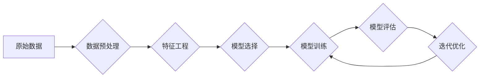

> 大数据，人工智能，机器学习，深度学习，数据驱动，特征工程，模型训练，算法优化

# 大数据在AI学习中的作用

大数据时代，数据量呈爆炸式增长，为人工智能（AI）和机器学习（ML）领域带来了前所未有的机遇和挑战。本文将探讨大数据在AI学习中的作用，从核心概念、算法原理到实际应用，全面解析大数据如何推动AI技术的发展。

## 1. 背景介绍

随着互联网、物联网、社交网络等技术的快速发展，我们生活在一个数据爆炸的时代。海量数据为AI和ML提供了丰富的学习资源，推动了技术的飞速进步。大数据在AI学习中的作用主要体现在以下几个方面：

- **提供更丰富的训练数据**：大数据使得AI模型能够学习到更加复杂和多样化的特征，提高模型的泛化能力和鲁棒性。
- **辅助特征工程**：通过分析大量数据，可以发现新的特征，提高模型性能。
- **优化算法**：大数据可以用于评估算法的性能，并进行参数优化。
- **加速模型训练**：利用分布式计算和并行计算技术，大数据可以显著提高模型训练速度。

## 2. 核心概念与联系

### 2.1 核心概念

- **大数据**：通常指数据量巨大、数据类型多样、数据价值密度低的数据集合。
- **机器学习**：一种使计算机系统能够从数据中学习并做出决策的技术。
- **深度学习**：一种利用多层神经网络进行特征学习和模式识别的技术。
- **特征工程**：通过对原始数据进行处理和转换，提取出有助于模型学习的有用信息。
- **模型训练**：使用训练数据对模型进行调整，使其能够更好地预测或分类。

### 2.2 Mermaid流程图



## 3. 核心算法原理 & 具体操作步骤

### 3.1 算法原理概述

大数据在AI学习中的作用主要体现在以下几个方面：

- **数据预处理**：对数据进行清洗、去重、缺失值处理等操作，确保数据质量。
- **特征工程**：通过特征选择、特征提取、特征转换等方法，提取出对模型有用的特征。
- **模型选择**：根据任务类型和数据特点，选择合适的模型。
- **模型训练**：使用训练数据对模型进行调整，使其能够更好地预测或分类。
- **模型评估**：使用测试数据评估模型性能，并迭代优化模型。

### 3.2 算法步骤详解

1. **数据预处理**：清洗数据，去除噪声和异常值，处理缺失值，将数据转换为适合模型训练的格式。
2. **特征工程**：根据任务需求，选择合适的特征提取方法，如文本分析、图像处理等，提取出对模型有用的特征。
3. **模型选择**：根据任务类型和数据特点，选择合适的模型，如决策树、支持向量机、神经网络等。
4. **模型训练**：使用训练数据对模型进行调整，使其能够更好地预测或分类。
5. **模型评估**：使用测试数据评估模型性能，如准确率、召回率、F1分数等。
6. **迭代优化**：根据评估结果，调整模型参数或特征，提高模型性能。

### 3.3 算法优缺点

#### 优点：

- **提高模型性能**：大数据为模型提供了更丰富的学习资源，有助于提高模型的泛化能力和鲁棒性。
- **辅助特征工程**：大数据可以帮助发现新的特征，提高模型性能。
- **优化算法**：大数据可以用于评估算法的性能，并进行参数优化。

#### 缺点：

- **数据质量问题**：大数据可能存在噪声、异常值和缺失值，影响模型性能。
- **计算资源需求**：大数据处理需要大量的计算资源，对硬件设备要求较高。
- **隐私和安全问题**：大数据可能包含敏感信息，需要采取措施保护数据隐私和安全。

### 3.4 算法应用领域

大数据在AI学习中的应用非常广泛，包括：

- **自然语言处理**：如文本分类、情感分析、机器翻译等。
- **计算机视觉**：如图像识别、目标检测、人脸识别等。
- **推荐系统**：如商品推荐、电影推荐等。
- **金融风控**：如欺诈检测、信用评分等。
- **医疗诊断**：如疾病预测、药物研发等。

## 4. 数学模型和公式 & 详细讲解 & 举例说明

### 4.1 数学模型构建

在AI学习中，常见的数学模型包括：

- **线性回归**：用于回归问题，预测连续值。
- **逻辑回归**：用于分类问题，预测概率。
- **支持向量机**：用于分类和回归问题，通过寻找最佳的超平面进行分类或回归。
- **神经网络**：用于复杂非线性问题，通过多层神经网络进行特征学习和模式识别。

### 4.2 公式推导过程

以下以线性回归为例，介绍公式推导过程：

假设我们有一个线性回归模型，其目标是最小化损失函数：

$$
L(\theta) = \frac{1}{2m} \sum_{i=1}^{m} (h_\theta(x^{(i)}) - y^{(i)})^2
$$

其中，$h_\theta(x) = \theta_0x_0 + \theta_1x_1 + \theta_2x_2 + \cdots + \theta_nx_n$ 为模型输出，$y^{(i)}$ 为真实标签，$m$ 为样本数量。

对损失函数求导并令其等于零，得到：

$$
\frac{\partial L(\theta)}{\partial \theta} = \frac{1}{m} \sum_{i=1}^{m} (h_\theta(x^{(i)}) - y^{(i)})x^{(i)} = 0
$$

解上述方程，得到模型参数：

$$
\theta = (\mathbf{X}^\mathbf{T}\mathbf{X})^{-1}\mathbf{X}^\mathbf{T}\mathbf{y}
$$

其中，$\mathbf{X}$ 为特征矩阵，$\mathbf{y}$ 为标签向量。

### 4.3 案例分析与讲解

以下以文本分类任务为例，讲解如何使用大数据进行特征工程和模型训练：

1. **数据预处理**：对文本数据进行清洗，去除噪声和异常值，处理缺失值。
2. **特征工程**：使用TF-IDF方法提取文本特征，将文本转换为向量表示。
3. **模型选择**：选择支持向量机（SVM）模型进行分类。
4. **模型训练**：使用训练数据对SVM模型进行训练。
5. **模型评估**：使用测试数据评估模型性能。

通过大数据进行特征工程和模型训练，可以使模型在文本分类任务上取得更好的性能。

## 5. 项目实践：代码实例和详细解释说明

### 5.1 开发环境搭建

1. 安装Python和Anaconda。
2. 安装PyTorch、Scikit-learn等库。

### 5.2 源代码详细实现

以下是一个简单的文本分类任务的Python代码示例：

```python
from sklearn.feature_extraction.text import TfidfVectorizer
from sklearn.model_selection import train_test_split
from sklearn.svm import SVC

# 加载数据
texts = ['This is a good movie.', 'This is a bad movie.']
labels = [1, 0]

# 特征工程
vectorizer = TfidfVectorizer()
X = vectorizer.fit_transform(texts)

# 模型选择
model = SVC()

# 模型训练
X_train, X_test, y_train, y_test = train_test_split(X, labels, test_size=0.5)
model.fit(X_train, y_train)

# 模型评估
print(model.score(X_test, y_test))
```

### 5.3 代码解读与分析

1. **数据预处理**：使用`train_test_split`函数将数据划分为训练集和测试集。
2. **特征工程**：使用`TfidfVectorizer`提取文本特征，将文本转换为向量表示。
3. **模型选择**：选择SVM模型进行分类。
4. **模型训练**：使用训练数据对SVM模型进行训练。
5. **模型评估**：使用测试数据评估模型性能。

通过大数据进行特征工程和模型训练，可以使模型在文本分类任务上取得更好的性能。

## 6. 实际应用场景

### 6.1 自然语言处理

大数据在自然语言处理中的应用非常广泛，如：

- **情感分析**：分析用户评论、社交媒体数据等，判断情感倾向。
- **文本分类**：对文本进行分类，如新闻分类、垃圾邮件检测等。
- **机器翻译**：将一种语言翻译成另一种语言。

### 6.2 计算机视觉

大数据在计算机视觉中的应用非常广泛，如：

- **图像识别**：识别图像中的物体、场景等。
- **目标检测**：检测图像中的目标，并定位目标位置。
- **人脸识别**：识别图像中的人脸。

### 6.3 推荐系统

大数据在推荐系统中的应用非常广泛，如：

- **商品推荐**：根据用户的历史购买记录，推荐用户可能感兴趣的商品。
- **电影推荐**：根据用户的历史观看记录，推荐用户可能喜欢的电影。

### 6.4 金融风控

大数据在金融风控中的应用非常广泛，如：

- **欺诈检测**：检测可疑的交易行为，预防欺诈。
- **信用评分**：评估用户的信用风险，为用户提供贷款等服务。

### 6.5 医疗诊断

大数据在医疗诊断中的应用非常广泛，如：

- **疾病预测**：根据患者的病历数据，预测患者可能患有的疾病。
- **药物研发**：通过分析大量基因数据，发现新的药物。

## 7. 工具和资源推荐

### 7.1 学习资源推荐

- **书籍**：
  - 《机器学习实战》
  - 《深度学习》
  - 《统计学习方法》
- **在线课程**：
  - 吴恩达的《机器学习》课程
  - 吴恩达的《深度学习》课程
  - fast.ai的《深度学习》课程

### 7.2 开发工具推荐

- **编程语言**：
  - Python
  - R
- **机器学习库**：
  - Scikit-learn
  - TensorFlow
  - PyTorch
- **数据可视化库**：
  - Matplotlib
  - Seaborn

### 7.3 相关论文推荐

- **《大规模机器学习》**：介绍大规模机器学习的理论基础和算法。
- **《深度学习》**：介绍深度学习的基本原理和应用。
- **《统计学习方法》**：介绍统计学习方法的基本原理和应用。

## 8. 总结：未来发展趋势与挑战

### 8.1 研究成果总结

大数据在AI学习中的作用已经得到了广泛的认可，并取得了显著的成果。随着技术的不断发展，大数据在AI学习中的作用将更加重要。

### 8.2 未来发展趋势

- **数据质量**：提高数据质量，减少噪声和异常值，提高模型性能。
- **数据隐私**：保护数据隐私，确保数据安全。
- **模型可解释性**：提高模型可解释性，使模型更加可靠。
- **跨领域迁移**：提高模型跨领域迁移能力，使模型更加通用。

### 8.3 面临的挑战

- **数据质量**：如何提高数据质量，减少噪声和异常值。
- **数据隐私**：如何保护数据隐私，确保数据安全。
- **模型可解释性**：如何提高模型可解释性，使模型更加可靠。
- **计算资源**：如何有效利用计算资源，提高模型训练和推理速度。

### 8.4 研究展望

未来，大数据在AI学习中的作用将更加重要。我们需要在数据质量、数据隐私、模型可解释性等方面进行更多研究和探索，以推动AI技术的发展。

## 9. 附录：常见问题与解答

### 9.1 常见问题

1. **什么是大数据**？
   - 大数据是指数据量巨大、数据类型多样、数据价值密度低的数据集合。
2. **大数据在AI学习中的作用是什么**？
   - 大数据在AI学习中的作用主要体现在提供更丰富的训练数据、辅助特征工程、优化算法和加速模型训练等方面。
3. **如何提高数据质量**？
   - 提高数据质量可以通过数据清洗、去重、缺失值处理等操作来实现。
4. **如何保护数据隐私**？
   - 保护数据隐私可以通过数据脱敏、差分隐私等技术来实现。

### 9.2 解答

1. **什么是大数据**？
   - 大数据是指数据量巨大、数据类型多样、数据价值密度低的数据集合。与传统的数据相比，大数据具有以下特点：
     - 数据量庞大：数据量达到PB级别。
     - 数据类型多样：包括结构化数据、半结构化数据和非结构化数据。
     - 数据价值密度低：从大量数据中提取有价值信息需要一定的技术和方法。
2. **大数据在AI学习中的作用是什么**？
   - 大数据在AI学习中的作用主要体现在以下几个方面：
     - **提供更丰富的训练数据**：大数据为AI模型提供了更丰富的学习资源，有助于提高模型的泛化能力和鲁棒性。
     - **辅助特征工程**：通过分析大量数据，可以发现新的特征，提高模型性能。
     - **优化算法**：大数据可以用于评估算法的性能，并进行参数优化。
     - **加速模型训练**：利用分布式计算和并行计算技术，大数据可以显著提高模型训练速度。
3. **如何提高数据质量**？
   - 提高数据质量可以通过以下方法来实现：
     - **数据清洗**：去除噪声和异常值，确保数据的准确性。
     - **数据去重**：去除重复的数据，避免模型过拟合。
     - **缺失值处理**：填充缺失值，提高数据的完整性。
     - **数据标准化**：将数据转换为统一的格式，方便模型处理。
4. **如何保护数据隐私**？
   - 保护数据隐私可以通过以下方法来实现：
     - **数据脱敏**：对敏感信息进行脱敏处理，如替换、掩码等。
     - **差分隐私**：通过添加噪声来保护数据隐私，同时保证模型的性能。
     - **联邦学习**：在本地设备上训练模型，避免数据上传到服务器。

---

作者：禅与计算机程序设计艺术 / Zen and the Art of Computer Programming