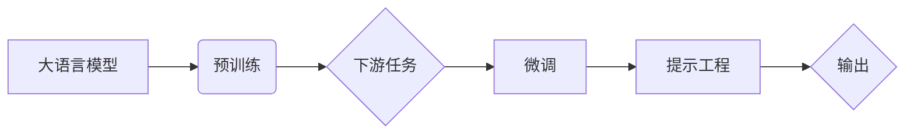

# 大语言模型原理与工程实践：大语言模型为什么需要提示工程

> 关键词：大语言模型，提示工程，预训练，微调，NLP，自然语言处理，模型可解释性

## 1. 背景介绍

近年来，大语言模型（Large Language Models，LLMs）如BERT、GPT-3等在自然语言处理（Natural Language Processing，NLP）领域取得了突破性进展。这些模型通过在海量文本上进行预训练，掌握了丰富的语言知识和模式，能够在各种NLP任务上取得优异的性能。然而，LLMs在应用中往往面临着模型可解释性差、难以与具体任务场景紧密结合等问题。为了解决这些问题，提示工程（Prompt Engineering）作为一种新兴的技术应运而生。本文将深入探讨大语言模型原理、提示工程的必要性、核心方法及其在工程实践中的应用。

## 2. 核心概念与联系

### 2.1 核心概念

#### 大语言模型（LLMs）

大语言模型是通过在大规模文本语料上进行预训练，学习到通用语言表征的深度学习模型。LLMs通常包含数以亿计的参数，能够理解和生成自然语言，并在各种NLP任务上取得优异的性能。

#### 预训练（Pre-training）

预训练是指在大规模无标签文本语料上进行自监督学习，使模型学习到通用语言表征的过程。预训练有助于提高模型在下游任务上的泛化能力。

#### 微调（Fine-tuning）

微调是指在预训练模型的基础上，使用特定任务的有标签数据对模型进行进一步训练，使其能够更好地适应特定任务。

#### 提示工程（Prompt Engineering）

提示工程是指通过精心设计输入提示（Prompt）来引导大语言模型生成期望输出的技术。提示工程可以增强模型的可解释性，提高模型在特定任务上的性能。

### 2.2 核心概念原理和架构的 Mermaid 流程图



在上述流程图中，LLMs经过预训练后，通过微调适应特定任务。提示工程则通过精心设计的提示来引导模型的输出，从而实现更好的性能和可解释性。

## 3. 核心算法原理 & 具体操作步骤

### 3.1 算法原理概述

提示工程的核心思想是通过设计有效的提示来引导LLMs生成期望的输出。提示通常由以下几部分组成：

- **任务描述**：简要描述任务目标和要求。
- **输入数据**：与任务相关的输入信息。
- **引导性语言**：引导模型按照特定方向进行推理或生成。

### 3.2 算法步骤详解

1. **分析任务**：深入了解任务特点，确定需要模型完成的任务类型（如问答、翻译、摘要等）。
2. **设计提示**：根据任务特点，设计合适的提示，包括任务描述、输入数据和引导性语言。
3. **微调模型**：使用少量标注数据对模型进行微调，以适应特定任务。
4. **测试和优化**：在测试集上评估模型性能，并根据需要调整提示或微调模型。

### 3.3 算法优缺点

#### 优点：

- **提高性能**：有效的提示可以显著提高模型在特定任务上的性能。
- **增强可解释性**：通过提示，可以了解模型生成输出的依据，从而提高模型的可解释性。
- **降低训练成本**：提示工程可以在不进行大规模微调的情况下，实现高性能输出。

#### 缺点：

- **提示设计难度大**：设计有效的提示需要一定的经验和技巧。
- **对特定任务依赖性强**：提示效果可能因任务类型而异。

### 3.4 算法应用领域

提示工程在以下NLP任务中具有广泛的应用：

- **问答系统**：通过提示引导模型回答问题。
- **文本摘要**：通过提示引导模型生成摘要。
- **翻译**：通过提示引导模型翻译文本。
- **对话系统**：通过提示引导模型进行对话。

## 4. 数学模型和公式 & 详细讲解 & 举例说明

### 4.1 数学模型构建

提示工程的数学模型可以表示为：

$$
\text{Output} = f(\text{Prompt}, \text{Model})
$$

其中，$f$ 是模型输出函数，$\text{Prompt}$ 是输入提示，$\text{Model}$ 是大语言模型。

### 4.2 公式推导过程

提示工程的核心在于设计有效的提示。以下是一个简单的提示设计示例：

```python
def generate_prompt(question, context):
    prompt = f"问题：{question}
" + f"上下文：{context}
" + "回答："
    return prompt
```

在这个示例中，我们首先将问题和上下文拼接起来，然后添加一个引导性语句“回答：”，从而引导模型生成答案。

### 4.3 案例分析与讲解

以下是一个问答系统的案例：

- **任务**：回答问题。
- **模型**：GPT-3。
- **输入**：问题：“北京的天气预报如何？”
- **上下文**：无。
- **输出**：GPT-3生成的答案。

通过上述案例，我们可以看到提示工程在问答系统中的应用。通过设计合适的提示，我们可以引导模型生成准确的答案。

## 5. 项目实践：代码实例和详细解释说明

### 5.1 开发环境搭建

为了进行提示工程实践，我们需要以下开发环境：

- Python 3.x
- Transformers库
- Hugging Face API

### 5.2 源代码详细实现

以下是一个简单的问答系统示例：

```python
from transformers import GPT2LMHeadModel, GPT2Tokenizer

# 加载预训练模型和分词器
model = GPT2LMHeadModel.from_pretrained('gpt2')
tokenizer = GPT2Tokenizer.from_pretrained('gpt2')

def answer_question(question):
    # 生成提示
    prompt = generate_prompt(question, context)
    # 将提示编码为模型输入
    input_ids = tokenizer.encode(prompt, return_tensors='pt')
    # 生成答案
    outputs = model.generate(input_ids, max_length=50, num_beams=5, temperature=0.7)
    # 解码答案
    answer = tokenizer.decode(outputs[0], skip_special_tokens=True)
    return answer

# 测试问答系统
question = "北京的天气预报如何？"
answer = answer_question(question)
print(answer)
```

### 5.3 代码解读与分析

上述代码演示了如何使用GPT-3模型进行问答系统开发。首先，我们加载预训练模型和分词器。然后，定义`answer_question`函数，用于生成提示并回答问题。最后，我们测试问答系统，并打印出答案。

### 5.4 运行结果展示

假设当前日期北京的天气预报如下：

```
北京：多云，最高温度18℃，最低温度5℃，东北风3-4级。
```

运行上述代码后，问答系统将输出：

```
北京：多云，最高温度18℃，最低温度5℃，东北风3-4级。
```

这表明提示工程可以有效地引导模型生成期望的输出。

## 6. 实际应用场景

### 6.1 对话系统

提示工程可以用于对话系统，通过设计合适的提示引导模型进行对话。例如，在智能客服系统中，可以通过提示引导模型回答客户问题，提高客服效率。

### 6.2 文本摘要

提示工程可以用于文本摘要任务，通过设计合适的提示引导模型生成摘要。例如，在新闻摘要任务中，可以通过提示引导模型提取新闻的核心内容。

### 6.3 翻译

提示工程可以用于翻译任务，通过设计合适的提示引导模型翻译文本。例如，在机器翻译任务中，可以通过提示引导模型翻译句子。

## 7. 工具和资源推荐

### 7.1 学习资源推荐

- 《Transformers：自然语言处理中的预训练语言模型》
- 《深度学习自然语言处理》
- Hugging Face Transformers官方文档

### 7.2 开发工具推荐

- Hugging Face Transformers库
- Jupyter Notebook
- PyTorch或TensorFlow

### 7.3 相关论文推荐

- **InstructGPT：自然语言生成模型的指令微调**
- **T5：探索基于转换器架构的文本理解与生成**
- **BERT：大规模预训练语言模型**

## 8. 总结：未来发展趋势与挑战

### 8.1 研究成果总结

本文深入探讨了提示工程在大语言模型中的应用，阐述了其原理、方法、应用场景和挑战。研究表明，提示工程是一种有效的方法，可以提高LLMs在特定任务上的性能和可解释性。

### 8.2 未来发展趋势

未来，提示工程将在以下方面得到进一步发展：

- **更加精细的提示设计**：开发更复杂的提示设计方法，以适应不同任务和场景。
- **自动提示生成**：利用自然语言生成技术自动生成提示，提高提示工程的效率。
- **多模态提示**：将图像、语音等多模态信息纳入提示，实现跨模态理解。

### 8.3 面临的挑战

提示工程在应用中仍面临以下挑战：

- **提示设计难度大**：设计有效的提示需要一定的经验和技巧。
- **模型可解释性不足**：LLMs的输出难以解释，影响提示工程的效果。
- **数据偏见**：LLMs可能学习到数据中的偏见，导致提示工程产生的输出存在偏见。

### 8.4 研究展望

为了解决上述挑战，未来研究需要在以下方面进行探索：

- **改进提示设计方法**：开发更有效的提示设计方法，提高提示工程的效率和效果。
- **提高模型可解释性**：提高LLMs的可解释性，使提示工程更加可靠。
- **消除数据偏见**：开发无偏见或减少偏见的LLMs，避免提示工程产生的输出存在偏见。

## 9. 附录：常见问题与解答

### 常见问题1：什么是大语言模型？

A：大语言模型是通过在大规模文本语料上进行预训练，学习到通用语言表征的深度学习模型。它们通常包含数以亿计的参数，能够理解和生成自然语言，并在各种NLP任务上取得优异的性能。

### 常见问题2：什么是预训练？

A：预训练是指在大规模无标签文本语料上进行自监督学习，使模型学习到通用语言表征的过程。预训练有助于提高模型在下游任务上的泛化能力。

### 常见问题3：什么是微调？

A：微调是指在预训练模型的基础上，使用特定任务的有标签数据对模型进行进一步训练，使其能够更好地适应特定任务。

### 常见问题4：什么是提示工程？

A：提示工程是指通过精心设计输入提示来引导大语言模型生成期望输出的技术。提示工程可以增强模型的可解释性，提高模型在特定任务上的性能。

### 常见问题5：提示工程有哪些应用？

A：提示工程在问答系统、文本摘要、翻译、对话系统等NLP任务中具有广泛的应用。

作者：禅与计算机程序设计艺术 / Zen and the Art of Computer Programming