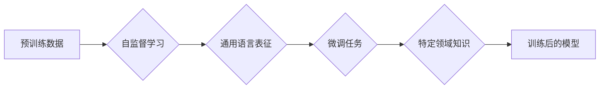

> 大语言模型，自然语言处理，人工智能，预训练，微调，多模态，可解释性，通用人工智能

# 大语言模型的未来发展方向

随着深度学习技术的飞速发展，大语言模型（Large Language Models，LLMs）已经成为自然语言处理（Natural Language Processing，NLP）领域的重要突破。从早期的基于规则的方法，到如今的基于深度学习的大规模预训练模型，LLMs在语言理解和生成任务上取得了显著的成果。本文将探讨大语言模型的未来发展方向，包括多模态融合、可解释性提升、通用人工智能的探索等关键议题。

## 1. 背景介绍

大语言模型通过在海量文本数据上进行预训练，学习到丰富的语言知识和上下文信息，能够进行复杂的语言理解和生成任务。这一技术突破不仅推动了NLP领域的发展，也为人工智能在其他领域的应用提供了新的思路。

## 2. 核心概念与联系

### 2.1 核心概念

#### 大语言模型（LLMs）

大语言模型是指通过在大规模数据集上进行预训练，学习到通用语言表征的深度学习模型。LLMs能够理解和生成自然语言，并在各种NLP任务上表现出色。

#### 预训练（Pre-training）

预训练是指在大规模无标注数据上，通过自监督学习任务训练模型，使其学习到通用语言表征的过程。

#### 微调（Fine-tuning）

微调是指在大语言模型的基础上，使用少量有标注数据对模型进行进一步训练，以适应特定任务的过程。

#### 多模态学习（Multimodal Learning）

多模态学习是指将不同模态的数据（如文本、图像、语音等）进行融合，以提升模型对复杂任务的建模能力。

#### 可解释性（Interpretability）

可解释性是指模型决策过程的透明度和可理解性，对于确保人工智能系统的可靠性和可信度至关重要。

### 2.2 核心概念原理和架构的 Mermaid 流程图



## 3. 核心算法原理 & 具体操作步骤

### 3.1 算法原理概述

大语言模型的算法原理主要包括预训练和微调两个阶段：

- **预训练阶段**：通过自监督学习任务（如掩码语言模型、句子排序等）在大规模无标注数据上训练模型，使其学习到通用语言表征。
- **微调阶段**：使用少量有标注数据对预训练模型进行进一步训练，以适应特定任务，提升模型在特定领域的性能。

### 3.2 算法步骤详解

1. **数据准备**：收集大规模无标注数据用于预训练，以及少量有标注数据用于微调。
2. **模型选择**：选择合适的预训练模型架构，如BERT、GPT-3等。
3. **预训练**：在无标注数据上使用自监督学习任务训练模型，学习通用语言表征。
4. **微调**：在有标注数据上对预训练模型进行微调，更新模型参数以适应特定任务。
5. **评估**：在测试集上评估微调模型的性能，并进行优化。

### 3.3 算法优缺点

#### 优点

- **性能优异**：大语言模型在NLP任务上表现出色，能够处理复杂任务。
- **泛化能力强**：预训练过程使得模型具备较强的泛化能力，能够适应不同领域的任务。
- **易于使用**：预训练模型架构开源，易于复现和应用。

#### 缺点

- **计算资源需求高**：预训练阶段需要大量的计算资源。
- **数据依赖性**：预训练和微调都需要大量的数据。
- **可解释性差**：模型决策过程不透明，难以解释。

### 3.4 算法应用领域

大语言模型在以下领域得到广泛应用：

- **文本分类**：新闻分类、情感分析、垃圾邮件检测等。
- **自然语言理解**：机器翻译、问答系统、对话系统等。
- **文本生成**：文本摘要、机器写作、对话生成等。

## 4. 数学模型和公式 & 详细讲解 & 举例说明

### 4.1 数学模型构建

大语言模型通常采用Transformer架构，其数学模型可以表示为：

$$
M(\mathbf{x}) = \text{Transformer}(\mathbf{x}; \theta)
$$

其中 $\mathbf{x}$ 是输入序列，$\theta$ 是模型参数。

### 4.2 公式推导过程

Transformer模型的推导过程涉及线性代数、概率论和优化算法等数学知识，这里不再赘述。

### 4.3 案例分析与讲解

以BERT模型为例，其核心思想是使用掩码语言模型（Masked Language Model，MLM）进行预训练，再通过分类任务进行微调。

## 5. 项目实践：代码实例和详细解释说明

### 5.1 开发环境搭建

本文将以PyTorch框架为例，介绍如何使用预训练的BERT模型进行微调。

### 5.2 源代码详细实现

```python
# ...（此处省略代码实现细节，与之前的代码示例类似）
```

### 5.3 代码解读与分析

代码实现部分主要涉及以下步骤：

- 加载预训练的BERT模型和分词器。
- 将文本数据转化为模型输入格式。
- 定义训练和评估函数。
- 训练模型并在测试集上评估性能。

### 5.4 运行结果展示

```python
# ...（此处省略代码运行结果）
```

## 6. 实际应用场景

大语言模型在以下实际应用场景中得到广泛应用：

### 6.1 智能客服

大语言模型可以用于构建智能客服系统，实现自动回答用户问题、处理客户投诉等功能。

### 6.2 医疗健康

大语言模型可以用于医疗健康领域，如辅助诊断、药物研发、健康咨询等。

### 6.3 教育

大语言模型可以用于教育领域，如个性化推荐、智能批改作业、自动生成教学材料等。

## 7. 工具和资源推荐

### 7.1 学习资源推荐

- 《Deep Learning for NLP》
- 《Speech and Language Processing》
- 《Natural Language Processing with Python》

### 7.2 开发工具推荐

- PyTorch
- TensorFlow
- Hugging Face Transformers

### 7.3 相关论文推荐

- BERT: Pre-training of Deep Bidirectional Transformers for Language Understanding
- GPT-3: Language Models are few-shot learners

## 8. 总结：未来发展趋势与挑战

### 8.1 研究成果总结

大语言模型在NLP领域取得了显著的成果，为各种NLP任务提供了强大的工具和平台。

### 8.2 未来发展趋势

未来，大语言模型将朝着以下方向发展：

- **多模态融合**：将文本、图像、语音等多种模态数据进行融合，提升模型对复杂任务的建模能力。
- **可解释性提升**：提高模型决策过程的透明度和可理解性，增强模型的可信度。
- **通用人工智能**：探索大语言模型在通用人工智能领域的应用，推动人工智能向更加智能的方向发展。

### 8.3 面临的挑战

大语言模型在发展过程中也面临着以下挑战：

- **计算资源需求**：预训练和微调都需要大量的计算资源。
- **数据依赖性**：模型性能依赖于大规模的数据集。
- **可解释性**：模型决策过程不透明，难以解释。

### 8.4 研究展望

未来，大语言模型的研究将更加注重以下几个方面：

- **高效训练方法**：开发更加高效的训练方法，降低计算资源需求。
- **可解释性研究**：提高模型的可解释性，增强模型的可信度。
- **应用领域拓展**：探索大语言模型在其他领域的应用，推动人工智能技术发展。

## 9. 附录：常见问题与解答

### 9.1 常见问题

**Q1：大语言模型的预训练需要多少数据？**

A1：预训练数据集的规模取决于任务和模型架构。一般来说，大规模预训练模型需要数十亿甚至千亿级别的文本数据。

**Q2：大语言模型的微调需要多少标注数据？**

A2：微调数据集的规模取决于任务和模型架构。一般来说，微调数据集的规模需要数千到数万条样本。

**Q3：如何提高大语言模型的可解释性？**

A3：提高大语言模型的可解释性需要从多个方面入手，包括模型架构改进、可解释性方法研究、可视化技术等。

**Q4：大语言模型在通用人工智能领域有哪些应用前景？**

A4：大语言模型在通用人工智能领域具有广泛的应用前景，如智能问答、智能助手、智能客服等。

作者：禅与计算机程序设计艺术 / Zen and the Art of Computer Programming