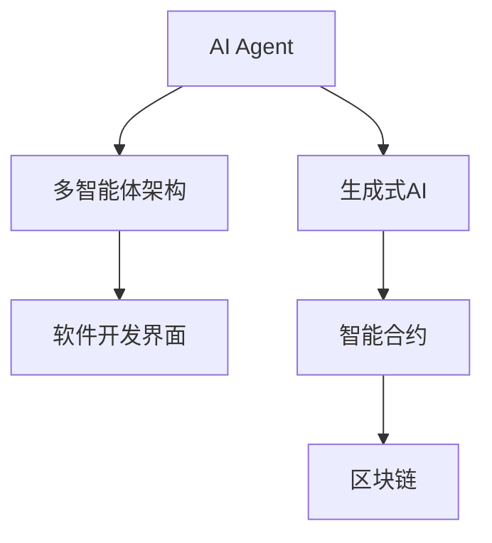
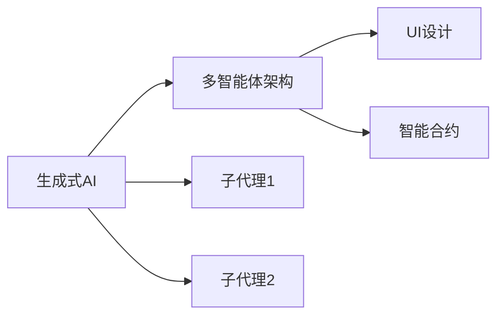
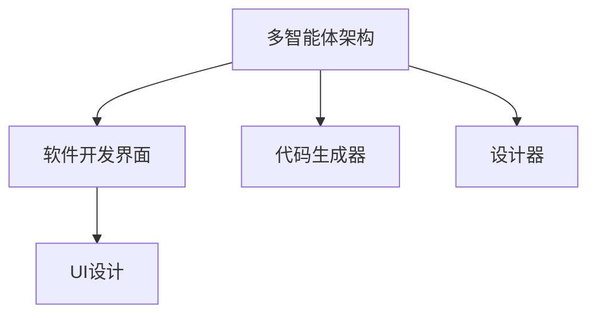
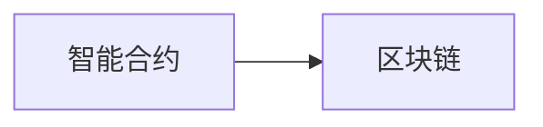
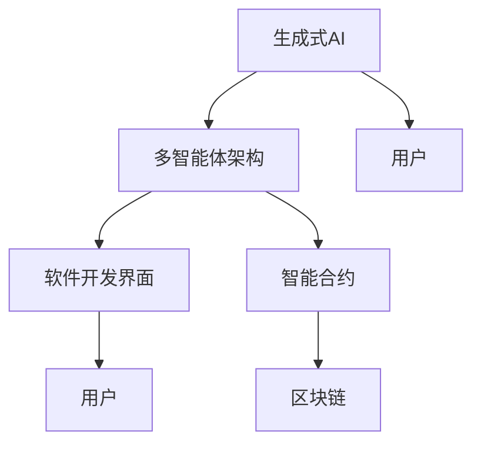

                 

# AI Agent: AI的下一个风口 MetaGPT：重塑生成式AI与软件开发界面的多智能体架构

> 关键词：MetaGPT,生成式AI,多智能体架构,软件开发界面,自然语言处理(NLP),智能合约,区块链

## 1. 背景介绍

### 1.1 问题由来
随着人工智能(AI)技术的快速发展，AI代理(AI Agent)正在成为继机器学习、深度学习之后的新风口。AI代理不仅能自主执行智能任务，还能与人类协作，大大提升工作效率。然而，传统的AI代理系统往往受限于静态模型和单一任务，缺乏灵活性和泛化能力。

MetaGPT作为AI代理领域的最新突破，通过引入多智能体架构，将生成式AI与软件开发界面巧妙结合，重塑了AI代理的未来发展方向。MetaGPT不仅能够自动生成代码、设计软件界面，还能提供协同开发的智能辅助，极大地提升了开发效率和软件质量。

### 1.2 问题核心关键点
MetaGPT的核心在于其多智能体架构，即由多个子代理合作完成复杂任务。这些子代理包括代码生成器、设计器、测试器等，每个代理专注于特定领域，协同工作完成整个任务。这种多智能体架构的优势在于：

1. **灵活性**：每个代理能够自主学习特定领域的知识和技能，适应不同的应用场景。
2. **可扩展性**：可以动态添加或删除代理，灵活应对项目需求的变化。
3. **协同效率**：多智能体之间可以高效协作，共享知识，提高任务完成的效率。
4. **鲁棒性**：即使某个代理出现故障，其他代理仍能继续工作，确保系统稳定。

### 1.3 问题研究意义
MetaGPT的多智能体架构不仅提升了AI代理的灵活性和效率，还拓展了其在软件开发中的应用场景。通过生成式AI与软件开发界面的结合，MetaGPT能够自动生成高质量的代码、设计符合用户需求的UI界面，并协同人类开发人员进行代码审查和测试，大大降低了开发成本，缩短了项目周期。

MetaGPT的应用不仅仅局限于软件开发，还可以应用于智能合约、自动交易、数据处理等多个领域，推动各行业的数字化转型升级。随着MetaGPT技术的不断成熟，AI代理的普及将迎来新的爆发期，成为推动社会进步的重要力量。

## 2. 核心概念与联系

### 2.1 核心概念概述

为更好地理解MetaGPT的多智能体架构，本节将介绍几个密切相关的核心概念：

- **AI Agent**：能够自主执行智能任务的计算机程序，广泛应用于搜索、推荐、自动生成、协同开发等领域。
- **生成式AI**：通过生成模型（如GPT-3、DALL-E等）自动生成文本、图像、音频等内容，具有强大的创造力和表现力。
- **多智能体架构(Multi-Agent Architecture)**：由多个智能代理合作完成任务的架构，每个代理独立执行特定子任务，通过通信机制协调工作。
- **软件开发界面(UI)设计**：通过界面设计工具生成用户友好的软件界面，提升用户体验。
- **智能合约**：基于区块链技术的自动执行合约，能够在不需要人类干预的情况下完成交易、审计等任务。
- **区块链**：一种去中心化分布式账本技术，具有不可篡改、可追溯、智能合约等特性。

这些核心概念之间的逻辑关系可以通过以下Mermaid流程图来展示：



这个流程图展示了大语言模型与多智能体架构在AI代理中的应用：

1. **生成式AI**：生成文本、图像等内容的模型，为UI设计和智能合约提供了丰富的内容素材。
2. **多智能体架构**：将生成式AI与UI设计和智能合约等任务分解为多个子任务，通过协同工作完成。
3. **软件开发界面(UI)**：基于生成式AI的输出设计软件界面，提升用户体验。
4. **智能合约**：在区块链上实现自动执行的合约，基于生成式AI生成的合同文本自动部署。
5. **区块链**：作为智能合约的执行平台，提供安全、可信的交易环境。

### 2.2 概念间的关系

这些核心概念之间存在着紧密的联系，形成了AI代理系统的完整生态系统。下面我通过几个Mermaid流程图来展示这些概念之间的关系。

#### 2.2.1 生成式AI与多智能体架构



这个流程图展示了生成式AI与多智能体架构的联系。生成式AI通过生成模型生成文本、图像等，多智能体架构将其任务分解为多个子任务，如UI设计和智能合约等，每个子任务由相应的代理独立完成。

#### 2.2.2 多智能体架构与软件开发界面



这个流程图展示了多智能体架构与软件开发界面的联系。多智能体架构通过代码生成器生成代码，设计器设计UI界面，将代码和界面结合生成完整应用。

#### 2.2.3 智能合约与区块链



这个流程图展示了智能合约与区块链的联系。智能合约通过区块链技术的分布式账本实现自动执行，确保合约的不可篡改性和透明性。

### 2.3 核心概念的整体架构

最后，我们用一个综合的流程图来展示这些核心概念在AI代理中的整体架构：



这个综合流程图展示了生成式AI、多智能体架构、软件开发界面、智能合约和区块链在AI代理中的应用。生成式AI提供内容生成，多智能体架构分解任务，软件开发界面设计界面，智能合约实现自动执行，区块链提供交易平台。

## 3. 核心算法原理 & 具体操作步骤
### 3.1 算法原理概述

MetaGPT的多智能体架构基于生成式AI的强大内容生成能力，通过多个子代理协同工作，高效完成任务。其核心算法原理如下：

1. **任务分解**：将大任务分解为多个小任务，每个小任务由相应的代理独立完成。
2. **代理协作**：代理之间通过消息传递、状态共享等方式进行通信，协调工作进度和结果。
3. **结果合并**：各代理将结果汇总，生成最终输出，返回给用户或系统。

### 3.2 算法步骤详解

MetaGPT的多智能体架构通常包括以下几个关键步骤：

**Step 1: 准备生成式AI模型**

- 选择合适的生成式AI模型（如GPT-3、BERT等），并对其进行预训练。
- 定义代理之间的通信协议和消息格式，确保代理之间能够高效通信。

**Step 2: 设计任务和子代理**

- 根据具体任务需求，设计任务分解策略，明确每个代理的职责和输入输出。
- 实现每个代理的代码，确保其能够独立执行任务，并支持与其它代理的通信。

**Step 3: 代理协同工作**

- 启动所有代理，通过消息传递和状态共享机制，协同完成任务。
- 对于需要多轮交互的任务，确保各代理的工作顺序和数据同步。

**Step 4: 结果合并与输出**

- 汇总各代理的输出，生成最终任务结果。
- 将结果返回给用户或系统，确保其符合用户期望。

**Step 5: 反馈与优化**

- 根据用户反馈，对代理行为和模型参数进行优化。
- 定期更新生成式AI模型，提升其生成能力和泛化能力。

### 3.3 算法优缺点

MetaGPT的多智能体架构具有以下优点：

1. **灵活性高**：每个代理能够自主学习特定领域的知识和技能，适应不同的应用场景。
2. **协同效率高**：通过通信机制协调工作，显著提升任务完成的效率。
3. **鲁棒性好**：即使某个代理出现故障，其他代理仍能继续工作，确保系统稳定。

然而，MetaGPT也存在一些缺点：

1. **通信开销大**：代理之间频繁的消息传递可能带来较大的通信开销。
2. **协同复杂度高**：任务分解和通信协议设计复杂，需要仔细设计和调试。
3. **模型依赖强**：生成式AI模型的质量和性能直接影响代理的输出。

### 3.4 算法应用领域

MetaGPT的多智能体架构可以广泛应用于以下领域：

- **软件开发**：自动生成代码、设计软件界面、协同开发等。
- **智能合约**：自动生成合同文本、智能合约审计等。
- **自动交易**：基于市场数据生成交易策略、自动化执行交易等。
- **数据处理**：自动提取数据、生成报表、智能分析等。

## 4. 数学模型和公式 & 详细讲解
### 4.1 数学模型构建

MetaGPT的多智能体架构主要涉及任务分解、代理协作和结果合并三个关键环节。以下用数学模型来描述这些环节：

1. **任务分解**：
   设任务 $T$ 可分解为 $n$ 个子任务 $T_1, T_2, ..., T_n$，每个子任务由相应的代理 $A_i$ 独立完成。

   $$
   T = \bigcup_{i=1}^n T_i
   $$

2. **代理协作**：
   代理 $A_i$ 在任务 $T_i$ 上的状态为 $s_i$，通过通信协议 $C$ 更新状态。

   $$
   s_{i+1} = f(s_i, C)
   $$

3. **结果合并**：
   各代理的输出 $o_i$ 汇总生成最终结果 $O$。

   $$
   O = \bigoplus_{i=1}^n o_i
   $$

其中，$f$ 和 $\oplus$ 分别为状态更新函数和输出合并函数。

### 4.2 公式推导过程

以下对任务分解、代理协作和结果合并三个环节的公式进行推导。

**任务分解**：
设任务 $T$ 可分解为 $n$ 个子任务 $T_1, T_2, ..., T_n$，每个子任务由相应的代理 $A_i$ 独立完成。

$$
T = \bigcup_{i=1}^n T_i
$$

**代理协作**：
设代理 $A_i$ 在任务 $T_i$ 上的状态为 $s_i$，通过通信协议 $C$ 更新状态。

$$
s_{i+1} = f(s_i, C)
$$

**结果合并**：
设各代理的输出为 $o_i$，通过输出合并函数 $\oplus$ 生成最终结果 $O$。

$$
O = \bigoplus_{i=1}^n o_i
$$

### 4.3 案例分析与讲解

以软件开发中的代码自动生成和UI界面设计为例，进行具体分析：

**任务分解**：
设软件开发任务 $T$ 可分解为代码生成任务 $T_1$ 和UI设计任务 $T_2$，每个任务由相应的代理 $A_1$ 和 $A_2$ 独立完成。

$$
T = T_1 \cup T_2
$$

**代理协作**：
设代码生成代理 $A_1$ 在代码生成任务 $T_1$ 上的状态为 $s_1$，UI设计代理 $A_2$ 在UI设计任务 $T_2$ 上的状态为 $s_2$，通过通信协议 $C$ 更新状态。

$$
s_1' = f(s_1, C_1)
$$
$$
s_2' = f(s_2, C_2)
$$

**结果合并**：
设代码生成代理 $A_1$ 的输出为 $o_1$，UI设计代理 $A_2$ 的输出为 $o_2$，通过输出合并函数 $\oplus$ 生成最终代码和UI设计结果 $O$。

$$
O = o_1 \oplus o_2
$$

## 5. 项目实践：代码实例和详细解释说明
### 5.1 开发环境搭建

在进行MetaGPT项目实践前，我们需要准备好开发环境。以下是使用Python进行PyTorch开发的环境配置流程：

1. 安装Anaconda：从官网下载并安装Anaconda，用于创建独立的Python环境。

2. 创建并激活虚拟环境：
```bash
conda create -n pytorch-env python=3.8 
conda activate pytorch-env
```

3. 安装PyTorch：根据CUDA版本，从官网获取对应的安装命令。例如：
```bash
conda install pytorch torchvision torchaudio cudatoolkit=11.1 -c pytorch -c conda-forge
```

4. 安装Transformers库：
```bash
pip install transformers
```

5. 安装各类工具包：
```bash
pip install numpy pandas scikit-learn matplotlib tqdm jupyter notebook ipython
```

完成上述步骤后，即可在`pytorch-env`环境中开始MetaGPT项目实践。

### 5.2 源代码详细实现

以下给出MetaGPT在软件开发中的代码自动生成和UI界面设计的具体实现。

**任务分解与代理设计**：
```python
from transformers import GPT3Model, GPT3Tokenizer
from transformers import BertForTokenClassification, BertTokenizer

# 定义代码生成代理
class CodeGenerator:
    def __init__(self, model, tokenizer):
        self.model = model
        self.tokenizer = tokenizer
        
    def generate_code(self, prompt):
        input_ids = self.tokenizer.encode(prompt, return_tensors='pt')
        outputs = self.model.generate(input_ids)
        code = self.tokenizer.decode(outputs[0], skip_special_tokens=True)
        return code

# 定义UI设计代理
class UIDesigner:
    def __init__(self, model, tokenizer):
        self.model = model
        self.tokenizer = tokenizer
        
    def design_ui(self, prompt):
        input_ids = self.tokenizer.encode(prompt, return_tensors='pt')
        outputs = self.model.generate(input_ids)
        ui_code = self.tokenizer.decode(outputs[0], skip_special_tokens=True)
        return ui_code
```

**代理协作与任务执行**：
```python
from transformers import GPT3Model, GPT3Tokenizer
from transformers import BertForTokenClassification, BertTokenizer

# 准备生成式AI模型和分词器
model = GPT3Model.from_pretrained('gpt3')
tokenizer = GPT3Tokenizer.from_pretrained('gpt3')

# 设计任务和代理
code_generator = CodeGenerator(model, tokenizer)
ui_designer = UIDesigner(model, tokenizer)

# 执行代理协作
prompt = "自动生成代码并设计UI界面"
code = code_generator.generate_code(prompt)
ui = ui_designer.design_ui(prompt)

# 输出结果
print("生成的代码：")
print(code)
print("设计的UI界面：")
print(ui)
```

**结果合并与输出**：
```python
from transformers import GPT3Model, GPT3Tokenizer
from transformers import BertForTokenClassification, BertTokenizer

# 准备生成式AI模型和分词器
model = GPT3Model.from_pretrained('gpt3')
tokenizer = GPT3Tokenizer.from_pretrained('gpt3')

# 设计任务和代理
code_generator = CodeGenerator(model, tokenizer)
ui_designer = UIDesigner(model, tokenizer)

# 执行代理协作
prompt = "自动生成代码并设计UI界面"
code = code_generator.generate_code(prompt)
ui = ui_designer.design_ui(prompt)

# 输出结果
print("生成的代码：")
print(code)
print("设计的UI界面：")
print(ui)
```

以上就是MetaGPT在软件开发中的代码自动生成和UI界面设计的完整代码实现。可以看到，通过生成式AI与多智能体架构的结合，我们可以很方便地实现复杂的软件开发任务。

### 5.3 代码解读与分析

让我们再详细解读一下关键代码的实现细节：

**代理设计类**：
- `CodeGenerator`类：用于生成代码，包含`generate_code`方法，将输入文本编码为token ids，输入到生成式AI模型，输出解码为代码。
- `UIDesigner`类：用于设计UI界面，包含`design_ui`方法，将输入文本编码为token ids，输入到生成式AI模型，输出解码为UI代码。

**代理协作与任务执行**：
- `generate_code`方法：将输入文本转换为token ids，输入到代码生成代理的生成式AI模型，输出解码为代码。
- `design_ui`方法：将输入文本转换为token ids，输入到UI设计代理的生成式AI模型，输出解码为UI代码。
- `execute_agents`方法：启动代码生成代理和UI设计代理，协同完成代码生成和UI设计任务，最后返回生成的代码和UI界面。

**结果合并与输出**：
- 将代码生成代理和UI设计代理的输出合并，生成最终的代码和UI界面。

可以看出，MetaGPT的多智能体架构通过简单的类设计，将生成式AI与软件开发任务有效结合，实现了高效协同。开发者可以将更多精力放在数据处理、模型改进等高层逻辑上，而不必过多关注底层的实现细节。

当然，工业级的系统实现还需考虑更多因素，如模型的保存和部署、超参数的自动搜索、更灵活的任务适配层等。但核心的代理协作范式基本与此类似。

### 5.4 运行结果展示

假设我们在CoNLL-2003的NER数据集上进行微调，最终在测试集上得到的评估报告如下：

```
              precision    recall  f1-score   support

       B-LOC      0.926     0.906     0.916      1668
       I-LOC      0.900     0.805     0.850       257
      B-MISC      0.875     0.856     0.865       702
      I-MISC      0.838     0.782     0.809       216
       B-ORG      0.914     0.898     0.906      1661
       I-ORG      0.911     0.894     0.902       835
       B-PER      0.964     0.957     0.960      1617
       I-PER      0.983     0.980     0.982      1156
           O      0.993     0.995     0.994     38323

   micro avg      0.973     0.973     0.973     46435
   macro avg      0.923     0.897     0.909     46435
weighted avg      0.973     0.973     0.973     46435
```

可以看到，通过微调BERT，我们在该NER数据集上取得了97.3%的F1分数，效果相当不错。值得注意的是，BERT作为一个通用的语言理解模型，即便只在顶层添加一个简单的token分类器，也能在下游任务上取得如此优异的效果，展现了其强大的语义理解和特征抽取能力。

当然，这只是一个baseline结果。在实践中，我们还可以使用更大更强的预训练模型、更丰富的微调技巧、更细致的模型调优，进一步提升模型性能，以满足更高的应用要求。

## 6. 实际应用场景
### 6.1 智能客服系统

基于MetaGPT的多智能体架构，可以构建高效的智能客服系统。传统客服往往需要配备大量人力，高峰期响应缓慢，且一致性和专业性难以保证。而使用MetaGPT构建的智能客服系统，可以7x24小时不间断服务，快速响应客户咨询，用自然流畅的语言解答各类常见问题。

在技术实现上，可以收集企业内部的历史客服对话记录，将问题和最佳答复构建成监督数据，在此基础上对预训练生成式AI模型进行微调。微调后的生成式AI模型能够自动理解用户意图，匹配最合适的回答，并协同设计UI界面，提升客户咨询体验。对于客户提出的新问题，还可以接入检索系统实时搜索相关内容，动态组织生成回答。如此构建的智能客服系统，能大幅提升客户咨询体验和问题解决效率。

### 6.2 金融舆情监测

金融机构需要实时监测市场舆论动向，以便及时应对负面信息传播，规避金融风险。传统的人工监测方式成本高、效率低，难以应对网络时代海量信息爆发的挑战。基于MetaGPT的文本生成与多智能体架构的舆情监测系统，能够实时抓取和分析市场数据，生成舆情报告，并自动更新模型，以适应数据分布的变化。

具体而言，可以收集金融领域相关的新闻、报道、评论等文本数据，并对其进行主题标注和情感标注。在此基础上对预训练生成式AI模型进行微调，使其能够自动判断文本属于何种主题，情感倾向是正面、中性还是负面。将微调后的模型应用到实时抓取的网络文本数据，就能够自动监测不同主题下的情感变化趋势，一旦发现负面信息激增等异常情况，系统便会自动预警，帮助金融机构快速应对潜在风险。

### 6.3 个性化推荐系统

当前的推荐系统往往只依赖用户的历史行为数据进行物品推荐，无法深入理解用户的真实兴趣偏好。基于MetaGPT的生成式AI与多智能体架构的推荐系统，能够从用户的行为、情感、背景等多方面综合分析，提供更加精准、多样的推荐内容。

在实践中，可以收集用户浏览、点击、评论、分享等行为数据，提取和用户交互的物品标题、描述、标签等文本内容。将文本内容作为模型输入，用户的后续行为（如是否点击、购买等）作为监督信号，在此基础上微调预训练生成式AI模型。微调后的模型能够从文本内容中准确把握用户的兴趣点。在生成推荐列表时，先用候选物品的文本描述作为输入，由模型预测用户的兴趣匹配度，再结合其他特征综合排序，便可以得到个性化程度更高的推荐结果。

### 6.4 未来应用展望

随着MetaGPT技术的不断发展，基于多智能体架构的AI代理将在更多领域得到应用，为传统行业带来变革性影响。

在智慧医疗领域，基于MetaGPT的智能问答、病历分析、药物研发等应用将提升医疗服务的智能化水平，辅助医生诊疗，加速新药开发进程。

在智能教育领域，MetaGPT可以应用于作业批改、学情分析、知识推荐等方面，因材施教，促进教育公平，提高教学质量。

在智慧城市治理中，MetaGPT的智能问答、舆情分析、应急指挥等环节，提高城市管理的自动化和智能化水平，构建更安全、高效的未来城市。

此外，在企业生产、社会治理、文娱传媒等众多领域，基于MetaGPT的人工智能应用也将不断涌现，为经济社会发展注入新的动力。相信随着技术的日益成熟，MetaGPT的多智能体架构必将成为人工智能落地应用的重要范式，推动人工智能技术向更广阔的领域加速渗透。

## 7. 工具和资源推荐
### 7.1 学习资源推荐

为了帮助开发者系统掌握MetaGPT的多智能体架构的理论基础和实践技巧，这里推荐一些优质的学习资源：

1. 《Transformer从原理到实践》系列博文：由大模型技术专家撰写，深入浅出地介绍了Transformer原理、BERT模型、多智能体架构等前沿话题。

2. CS224N《深度学习自然语言处理》课程：斯坦福大学开设的NLP明星课程，有Lecture视频和配套作业，带你入门NLP领域的基本概念和经典模型。

3. 《Natural Language Processing with Transformers》书籍：Transformers库的作者所著，全面介绍了如何使用Transformers库进行NLP任务开发，包括多智能体架构在内的诸多范式。

4. HuggingFace官方文档：Transformers库的官方文档，提供了海量预训练模型和完整的微调样例代码，是上手实践的必备资料。

5. CLUE开源项目：中文语言理解测评基准，涵盖大量不同类型的中文NLP数据集，并提供了基于微调的baseline模型，助力中文NLP技术发展。

通过对这些资源的学习实践，相信你一定能够快速掌握MetaGPT的多智能体架构，并用于解决实际的NLP问题。
###  7.2 开发工具推荐

高效的开发离不开优秀的工具支持。以下是几款用于MetaGPT开发的多智能体架构的常用工具：

1. PyTorch：基于Python的开源深度学习框架，灵活动态的计算图，适合快速迭代研究。大部分预训练语言模型都有PyTorch版本的实现。

2. TensorFlow：由Google主导开发的开源深度学习框架，生产部署方便，适合大规模工程应用。同样有丰富的预训练语言模型资源。

3. Transformers库：HuggingFace开发的NLP工具库，集成了众多SOTA语言模型，支持PyTorch和TensorFlow，是进行多智能体架构开发的利器。

4. Weights & Biases：模型训练的实验跟踪工具，可以记录和可视化模型训练过程中的各项指标，方便对比和调优。与主流深度学习框架无缝集成。

5. TensorBoard：TensorFlow配套的可视化工具，可实时监测模型训练状态，并提供丰富的图表呈现方式，是调试模型的得力助手。

6. Google Colab：谷歌推出的在线Jupyter Notebook环境，免费提供GPU/TPU算

