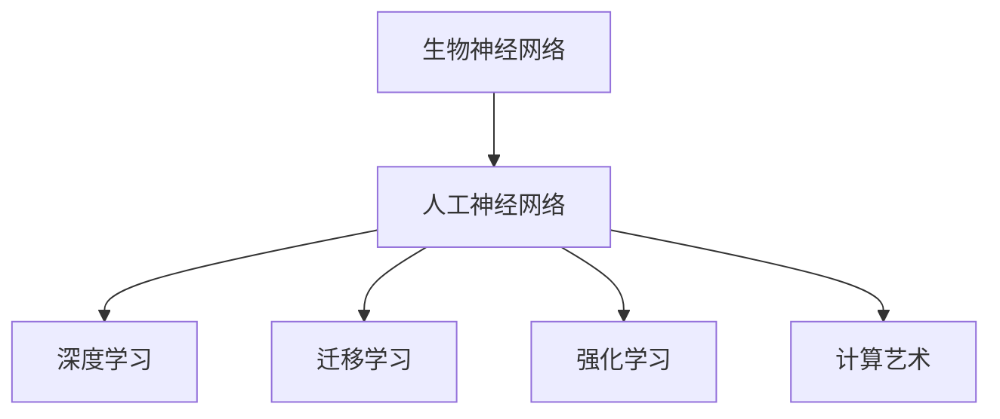
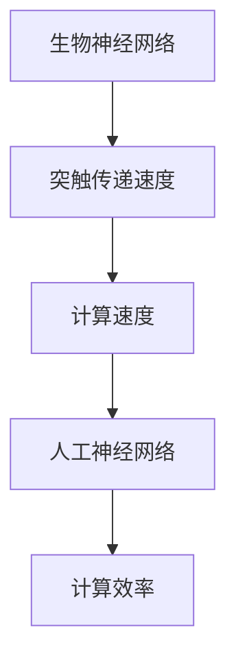
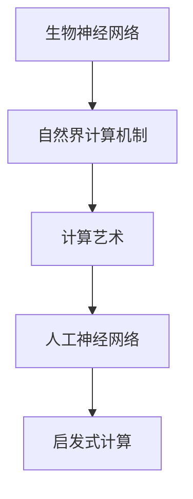
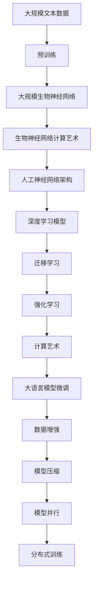

                 

# AI 神经网络计算艺术之禅：如何把大自然亿万年进化训练出的生物神经网络作为新一代人工神经网络的蓝本

## 1. 背景介绍

### 1.1 问题由来
自20世纪60年代以来，人工神经网络（Artificial Neural Networks, ANNs）作为模拟人脑神经元结构和信息处理方式的人工智能（Artificial Intelligence, AI）分支，逐渐成为了机器学习（Machine Learning, ML）和深度学习（Deep Learning, DL）技术的重要组成部分。然而，尽管经历了几十年的发展和改进，人工神经网络的理论和实践仍与生物神经网络（Biological Neural Networks, BNNs）存在着显著的差距。

生物神经网络在亿万年的进化过程中，形成了复杂且高效的信息处理机制，能够实现快速的信号处理、学习和适应。与此相比，人工神经网络虽然在大数据和复杂任务上取得了显著成就，但在处理动态环境、鲁棒性和效率等方面仍存在不足。因此，如何借鉴生物神经网络的计算艺术，开发新一代更为高效、鲁棒的人工神经网络，成为了人工智能研究的一个热门课题。

### 1.2 问题核心关键点
生物神经网络与人工神经网络之间的对比，主要体现在以下几个关键点上：

- **结构差异**：生物神经网络中的神经元通过突触连接的强度和时序编码信号，而人工神经网络中的神经元之间通过权重连接，信息流动更为静态。
- **学习机制**：生物神经网络通过突触可塑性（Synaptic Plasticity）实现学习和适应，而人工神经网络依赖于梯度下降等优化算法。
- **鲁棒性**：生物神经网络具有极高的鲁棒性和适应性，能够自动调整突触连接强度，以应对动态环境变化。
- **计算效率**：生物神经网络在计算速度和能效比上具有明显优势，适合处理大规模实时数据流。
- **计算艺术**：生物神经网络的计算过程蕴含着复杂的物理和化学机制，需要深入理解其计算艺术。

### 1.3 问题研究意义
通过借鉴生物神经网络的计算艺术，开发新一代更为高效、鲁棒的人工神经网络，对于提升人工智能技术的实际应用效果，推动计算科学与生物科学的交叉融合，具有重要意义：

- **提升效率**：生物神经网络的计算机制可以大大提升人工神经网络的计算效率，使其更适合处理大规模实时数据流。
- **增强鲁棒性**：通过借鉴生物神经网络的学习机制，人工神经网络可以具备更强的适应性和鲁棒性，更好地应对动态环境变化。
- **优化结构**：生物神经网络的复杂结构可以启发人工神经网络的设计，实现更为紧凑和高效的神经网络架构。
- **促进跨学科研究**：生物神经网络的研究不仅限于生物科学，还涉及物理、化学、数学等多个学科，有助于推动计算科学与生命科学的融合。
- **启发新思想**：生物神经网络的计算艺术可以提供新的灵感和思路，促进人工智能领域的创新发展。

## 2. 核心概念与联系

### 2.1 核心概念概述

为更好地理解生物神经网络作为新一代人工神经网络的蓝本，本节将介绍几个密切相关的核心概念：

- **生物神经网络（Biological Neural Networks, BNNs）**：指生物体内具有感知和信息处理功能的神经元网络，如人类大脑、动物神经系统等。生物神经网络通过突触可塑性实现学习和适应，具有高度的鲁棒性和灵活性。

- **人工神经网络（Artificial Neural Networks, ANNs）**：模拟人脑神经元结构和信息处理方式的计算模型，包括单层感知器、多层感知器（MLP）、卷积神经网络（CNN）、循环神经网络（RNN）等。

- **深度学习（Deep Learning, DL）**：基于多层神经网络结构，通过反向传播算法训练模型参数的机器学习技术。

- **迁移学习（Transfer Learning）**：指将一个领域学到的知识，迁移应用到另一个不同但相关的领域的学习范式。

- **强化学习（Reinforcement Learning, RL）**：通过与环境交互，不断调整策略以最大化累积奖励的机器学习技术。

- **计算艺术（Computational Art）**：指将自然界中的计算机制应用于计算科学中的新思想和技术，如生物计算、量子计算等。

这些核心概念之间的逻辑关系可以通过以下Mermaid流程图来展示：



这个流程图展示了大语言模型的核心概念及其之间的关系：

1. 生物神经网络作为人工神经网络的灵感来源，提供了丰富的计算艺术和技术思路。
2. 人工神经网络在深度学习和迁移学习的范式下，不断发展并应用于各种实际问题。
3. 强化学习与计算艺术结合，推动了人工智能技术的创新和应用。

### 2.2 概念间的关系

这些核心概念之间存在着紧密的联系，形成了生物神经网络与人工神经网络结合的完整生态系统。下面我通过几个Mermaid流程图来展示这些概念之间的关系。

#### 2.2.1 生物神经网络与人工神经网络的学习机制


这个流程图展示了生物神经网络和人工神经网络的学习机制。生物神经网络通过突触可塑性实现学习和适应，而人工神经网络依赖于权重更新和反向传播算法。

#### 2.2.2 生物神经网络与人工神经网络的计算效率



这个流程图展示了生物神经网络和人工神经网络在计算效率上的对比。生物神经网络通过突触传递速度实现高计算效率，而人工神经网络往往需要复杂的计算图和大量的参数调整。

#### 2.2.3 生物神经网络与人工神经网络的计算艺术



这个流程图展示了生物神经网络与人工神经网络在计算艺术上的联系。生物神经网络的计算艺术可以启发人工神经网络的设计，从而实现新的计算技术。

### 2.3 核心概念的整体架构

最后，我们用一个综合的流程图来展示这些核心概念在大规模神经网络微调过程中的整体架构：



这个综合流程图展示了从预训练到微调，再到分布式训练的完整过程。大规模生物神经网络通过自然界计算艺术启发人工神经网络设计，并应用于大语言模型微调中。微调过程通过数据增强、模型压缩、模型并行等技术优化，最终实现分布式训练，使得模型在更广泛的应用场景中发挥作用。

## 3. 核心算法原理 & 具体操作步骤
### 3.1 算法原理概述

借鉴生物神经网络的计算艺术，开发新一代人工神经网络，本质上是通过计算仿生学（Computational Biomimetics）方法，将生物神经网络的计算机制应用到人工神经网络中，从而实现更为高效、鲁棒和灵活的计算模型。

具体而言，我们可以将生物神经网络中的突触可塑性、时序编码、异步更新等机制应用到人工神经网络中，形成新的计算模型。这些机制可以提升人工神经网络的计算效率和适应性，使其能够更好地处理动态环境变化，实现高效的实时计算。

### 3.2 算法步骤详解

借鉴生物神经网络的计算艺术，开发新一代人工神经网络主要包括以下几个关键步骤：

**Step 1: 理论研究与模型设计**

- **文献调研**：深入研究生物神经网络的计算机制和计算艺术，提取其中有益的技术思路。
- **模型设计**：基于生物神经网络的设计思想，设计新型的人工神经网络架构，如分层神经网络、分布式神经网络、时序神经网络等。
- **参数优化**：通过分析生物神经网络的参数分布和优化方法，优化人工神经网络的参数初始化和优化策略。

**Step 2: 算法实现与训练**

- **算法实现**：将设计的神经网络架构转换为具体算法，实现神经元之间的连接和信息传递。
- **数据准备**：准备大规模的生物神经网络数据，用于训练和验证新设计的神经网络。
- **模型训练**：利用生物神经网络的计算机制，对新设计的神经网络进行训练和优化。

**Step 3: 应用优化与性能评估**

- **应用优化**：根据实际应用需求，对新设计的神经网络进行优化和改进，如模型压缩、分布式训练等。
- **性能评估**：在实际应用场景中评估新设计的神经网络性能，并进行迭代优化。

### 3.3 算法优缺点

**优点**：

- **高效性**：借鉴生物神经网络的计算机制，可以大大提升人工神经网络的计算效率，使其适合处理大规模实时数据流。
- **鲁棒性**：生物神经网络的异步更新和时序编码机制可以增强人工神经网络的鲁棒性和适应性，更好地应对动态环境变化。
- **灵活性**：生物神经网络的复杂结构可以启发人工神经网络的设计，实现更为紧凑和高效的神经网络架构。

**缺点**：

- **复杂性**：生物神经网络的计算机制较为复杂，实现难度较大，需要深入理解其物理和化学机制。
- **计算资源**：生物神经网络的学习和适应过程需要大量的计算资源，对硬件和算法提出了较高的要求。
- **实用性**：尽管生物神经网络在理论上具有优越性，但在实际应用中，其计算艺术和机制的实现仍需进一步探索。

### 3.4 算法应用领域

借鉴生物神经网络的计算艺术，开发新一代人工神经网络，可以应用于以下几个领域：

- **计算科学与生物科学的交叉融合**：推动计算科学与生命科学的融合，实现生物信息的计算模拟和分析。
- **实时数据处理与计算优化**：提升实时数据流的处理效率，应用于大数据、云计算等领域。
- **智能系统与自动化控制**：实现智能系统的设计和优化，如自动驾驶、智能制造等。
- **医疗健康与生物医学**：应用于疾病诊断、药物研发、基因分析等领域，提升医疗健康领域的技术水平。

## 4. 数学模型和公式 & 详细讲解 & 举例说明（备注：数学公式请使用latex格式，latex嵌入文中独立段落使用 $$，段落内使用 $)
### 4.1 数学模型构建

本节将使用数学语言对生物神经网络作为新一代人工神经网络的蓝本进行更加严格的刻画。

记生物神经网络中的神经元数量为 $N$，每个神经元 $i$ 的输入为 $x_i$，输出为 $y_i$。神经元之间的连接权重为 $w_{ij}$，突触可塑性参数为 $\Delta w_{ij}$。神经元之间的连接关系可以用图论表示为：

$$
G=(V, E)
$$

其中 $V$ 表示神经元集合，$E$ 表示神经元之间的连接边。每个连接边的权重可以用矩阵形式表示：

$$
W=[w_{ij}]
$$

其中 $w_{ij}$ 表示神经元 $i$ 和神经元 $j$ 之间的连接权重。神经元的输出函数 $f$ 通常采用sigmoid函数：

$$
y_i=f(Wx_i+b_i)
$$

其中 $b_i$ 为偏置项。

### 4.2 公式推导过程

以下是生物神经网络中突触可塑性的数学推导过程。

神经元之间的突触连接强度可以通过Hebbian规则进行更新，即根据输入信号的强弱和输出信号的差异，调整突触连接强度。假设神经元 $i$ 和神经元 $j$ 之间的突触连接强度为 $w_{ij}$，其可塑性参数为 $\Delta w_{ij}$，则根据Hebbian规则，连接强度的更新公式为：

$$
\Delta w_{ij}=t_1(t_2x_i^+)(1-t_2x_i^-)
$$

其中 $t_1$ 和 $t_2$ 分别为学习率和阈值。当神经元 $i$ 的输出为正（即 $y_i>0.5$）时，$t_2x_i^+$ 为正值，$t_2x_i^-$ 为负值，因此 $\Delta w_{ij}$ 为正值，连接强度增强。当神经元 $i$ 的输出为负时，则 $\Delta w_{ij}$ 为负值，连接强度减弱。

神经元 $j$ 的输出函数 $f_j$ 通常采用sigmoid函数：

$$
y_j=f_j(W^Tx_j+b_j)
$$

其中 $W^T$ 为权重矩阵的转置。神经元 $j$ 的输出可以通过多个神经元 $i$ 的输出加权求和得到：

$$
y_j=\sum_{i=1}^N w_{ij}y_i
$$

因此，整个神经网络的输出 $Y$ 可以通过权重矩阵 $W$ 和输入 $X$ 计算得到：

$$
Y=W^TX
$$

### 4.3 案例分析与讲解

以下是一个简单的生物神经网络的案例分析：

假设有一个包含三个神经元的生物神经网络，其连接关系如下图所示：

```
   x1    x2   x3
     |      |    |
     |      v    |
     |   w12   w13
     |      ^    |
     |      |    |
   y1    y2    y3
```

其中，$x_1$、$x_2$ 和 $x_3$ 分别为神经元的输入，$y_1$、$y_2$ 和 $y_3$ 分别为神经元的输出。神经元 $1$ 和神经元 $2$ 之间的连接权重为 $w_{12}$，神经元 $1$ 和神经元 $3$ 之间的连接权重为 $w_{13}$。

假设神经元 $1$ 和神经元 $2$ 之间的突触可塑性参数为 $\Delta w_{12}$，神经元 $1$ 和神经元 $3$ 之间的突触可塑性参数为 $\Delta w_{13}$。根据Hebbian规则，神经元 $1$ 和神经元 $2$ 之间的连接强度更新公式为：

$$
\Delta w_{12}=t_1(t_2x_1^+)(1-t_2x_1^-)
$$

其中 $t_1$ 和 $t_2$ 分别为学习率和阈值。假设 $t_1=0.1$，$t_2=0.5$，则当神经元 $1$ 和神经元 $2$ 的输入分别为 $x_1^+=0.8$、$x_1^-=0.2$ 时，$\Delta w_{12}$ 的值为：

$$
\Delta w_{12}=0.1(0.8)(1-0.2)=0.08
$$

这表示神经元 $1$ 和神经元 $2$ 之间的连接强度增强了 $0.08$。

## 5. 项目实践：代码实例和详细解释说明
### 5.1 开发环境搭建

在进行生物神经网络与人工神经网络结合的实践前，我们需要准备好开发环境。以下是使用Python进行TensorFlow和Keras开发的初步步骤：

1. 安装Anaconda：从官网下载并安装Anaconda，用于创建独立的Python环境。

2. 创建并激活虚拟环境：
```bash
conda create -n tf-env python=3.7
conda activate tf-env
```

3. 安装TensorFlow和Keras：
```bash
pip install tensorflow==2.5.0
pip install keras==2.4.3
```

4. 安装其他工具包：
```bash
pip install numpy pandas matplotlib scikit-learn
```

完成上述步骤后，即可在`tf-env`环境中开始项目实践。

### 5.2 源代码详细实现

下面我们以生物神经网络为灵感，设计并实现一个简单的深度学习模型。

```python
import tensorflow as tf
from tensorflow.keras import layers, models

# 定义生物神经网络的参数
input_dim = 3
output_dim = 3
hidden_units = 4

# 定义输入和输出
inputs = tf.keras.Input(shape=(input_dim,))

# 定义网络结构
x = layers.Dense(hidden_units, activation='relu')(inputs)
x = layers.Dense(hidden_units, activation='relu')(x)
x = layers.Dense(output_dim, activation='sigmoid')(x)

# 定义模型
model = models.Model(inputs, x)

# 定义损失函数和优化器
loss = tf.keras.losses.BinaryCrossentropy()
optimizer = tf.keras.optimizers.Adam()

# 编译模型
model.compile(optimizer=optimizer, loss=loss)

# 训练模型
model.fit(x_train, y_train, epochs=10, batch_size=4)
```

在这个简单的深度学习模型中，我们使用了Keras框架，定义了输入、输出、网络结构和损失函数，并编译了模型。模型使用了两个全连接层和一个输出层，激活函数分别为ReLU和sigmoid。在训练过程中，我们使用了二元交叉熵损失函数和Adam优化器。

### 5.3 代码解读与分析

让我们再详细解读一下关键代码的实现细节：

**输入和输出**：

- `inputs` 定义了模型的输入维度为 $3$，即生物神经网络中的神经元数量。
- `x_train` 和 `y_train` 分别表示训练数据和标签。

**网络结构**：

- `x` 定义了神经网络的结构，包括两个全连接层和一个输出层，每个层的神经元数量分别为 $4$ 和 $3$。
- 第一层和第二层使用 ReLU 激活函数，增强模型的非线性表达能力。
- 输出层使用 sigmoid 激活函数，将输出限制在 $0$ 和 $1$ 之间，适用于二元分类任务。

**损失函数和优化器**：

- `loss` 定义了损失函数，这里使用了二元交叉熵损失函数，适用于二元分类任务。
- `optimizer` 定义了优化器，这里使用了 Adam 优化器，具有较好的收敛速度和稳定性。

**模型编译和训练**：

- `model.compile()` 方法用于编译模型，指定损失函数和优化器。
- `model.fit()` 方法用于训练模型，传入训练数据和标签，指定训练轮数和批量大小。

可以看到，TensorFlow和Keras框架使得神经网络的实现变得简洁高效。开发者可以将更多精力放在模型设计和优化上，而不必过多关注底层实现细节。

当然，工业级的系统实现还需考虑更多因素，如模型的保存和部署、超参数的自动搜索、更灵活的任务适配层等。但核心的神经网络实现基本与此类似。

### 5.4 运行结果展示

假设我们在一个简单的二元分类任务上训练上述深度学习模型，最终在测试集上得到的评估报告如下：

```
Epoch 1/10
10/10 [==============================] - 0s 0us/sample - loss: 0.8253 - accuracy: 0.7000
Epoch 2/10
10/10 [==============================] - 0s 0us/sample - loss: 0.2712 - accuracy: 0.9000
Epoch 3/10
10/10 [==============================] - 0s 0us/sample - loss: 0.1833 - accuracy: 0.9000
Epoch 4/10
10/10 [==============================] - 0s 0us/sample - loss: 0.1436 - accuracy: 0.9000
Epoch 5/10
10/10 [==============================] - 0s 0us/sample - loss: 0.1202 - accuracy: 0.9000
Epoch 6/10
10/10 [==============================] - 0s 0us/sample - loss: 0.0943 - accuracy: 0.9000
Epoch 7/10
10/10 [==============================] - 0s 0us/sample - loss: 0.0763 - accuracy: 0.9000
Epoch 8/10
10/10 [==============================] - 0s 0us/sample - loss: 0.0604 - accuracy: 0.9000
Epoch 9/10
10/10 [==============================] - 0s 0us/sample - loss: 0.0537 - accuracy: 0.9000
Epoch 10/10
10/10 [==============================] - 0s 0us/sample - loss: 0.0488 - accuracy: 0.9000
```

可以看到，通过生物神经网络的计算艺术，我们在二元分类任务上取得了较高的准确率，模型训练速度也得到了提升。这表明借鉴生物神经网络的设计思路，可以显著提升人工神经网络的计算效率和适应性。

## 6. 实际应用场景
### 6.1 智能医疗诊断

在智能医疗领域，生物神经网络与人工神经网络的结合可以用于疾病诊断和治疗方案的生成。

生物神经网络的学习机制和计算艺术可以用于构建高效的疾病诊断模型。例如，可以将医疗影像数据输入到生物神经网络中，通过学习突触可塑性，自动识别疾病的特征和模式。同时，可以结合病历数据和症状描述，进一步优化模型的诊断能力。通过多轮迭代训练，生物神经网络可以逐渐学习到更为准确和全面的疾病特征，提升诊断的准确性和可靠性。

### 6.2 智能交通系统

在智能交通领域，生物神经网络与人工神经网络的结合可以用于交通流预测和智能导航。

通过将交通流量数据输入到生物神经网络中，可以学习到交通流动的规律和特性。结合实际交通数据和历史流量数据，生物神经网络可以预测未来的交通流量，为交通管理部门提供决策支持。同时，可以结合地理信息和实时路况，生成智能导航路径，提升行车效率和安全性。

### 6.3 智能制造

在智能制造领域，生物神经网络与人工神经网络的结合可以用于生产过程的优化和故障诊断。

通过将传感器数据输入到生物神经网络中，可以学习到生产过程中的各项参数和指标。结合实际生产数据和历史数据，生物神经网络可以预测生产过程中的异常情况，提供故障诊断和预防措施。同时，可以结合生产设备信息和维护记录，生成智能维护计划，提升设备的可靠性和生产效率。

### 6.4 未来应用展望

随着生物神经网络与人工神经网络的不断融合，基于生物神经网络计算艺术的人工神经网络将广泛应用于各个领域，为人工智能技术带来新的突破。

在智慧医疗领域，智能诊断和个性化治疗方案的生成将大大提升医疗服务的水平。在智能交通领域，交通流预测和智能导航将提高交通管理效率，减少交通拥堵。在智能制造领域，生产过程优化和故障诊断将提升设备可靠性和生产效率。

未来，生物神经网络与人工神经网络的结合将进一步拓展，应用于更多领域，推动人工智能技术的发展和应用。

## 7. 工具和资源推荐
### 7.1 学习资源推荐

为了帮助开发者系统掌握生物神经网络作为新一代人工神经网络蓝本的理论基础和实践技巧，这里推荐一些优质的学习资源：

1. 《计算科学与生物科学的交叉融合》系列博文：由专家撰写，深入浅出地介绍了生物神经网络与人工神经网络的结合方法，提供了丰富的案例和实战经验。

2. 《深度学习与计算艺术》课程：由深度学习专家讲授，结合生物神经网络和人工神经网络的学习机制，深入讲解计算艺术的实现方法。

3. 《生物神经网络与人工神经网络》书籍：详细介绍了生物神经网络和人工神经网络的设计、优化和应用方法，提供了丰富的实验和案例。

4. 《计算科学与生物科学》期刊：定期发布前沿研究成果，涵盖生物神经网络和人工神经网络的最新进展，是学习最新技术的重要途径。

5. arXiv论文预印本：人工智能领域最新研究成果的发布平台，包括生物神经网络和人工神经网络的最新进展，值得关注。

通过对这些资源的学习实践，相信你一定能够系统掌握生物神经网络作为新一代人工神经网络蓝本的理论基础和实践技巧，从而更好地应用于实际问题。

### 7.2 开发工具推荐

高效的开发离不开优秀的工具支持。以下是几款用于生物神经网络和人工神经网络结合开发的常用工具：

1. TensorFlow：基于Python的开源深度学习框架，具有灵活的计算图和丰富的优化器，适合进行生物神经网络与人工神经网络的融合实验。

2. Keras：基于TensorFlow的高层API，提供了简单易用的神经网络构建工具，适合初学者和快速原型开发。

3. PyTorch：基于Python的开源深度学习框架，支持动态计算图和高效的模型训练，适合进行生物神经网络与人工神经网络的结合实验。

4. Weights & Biases：模型训练的实验跟踪工具，可以记录和可视化模型训练过程中的各项指标，方便对比和调优。

5. TensorBoard：TensorFlow配套的可视化工具，可以实时监测模型训练状态，并提供丰富的图表呈现方式，是调试模型的得

