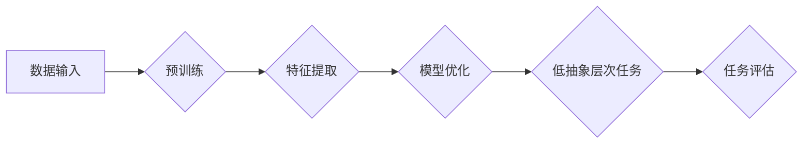

> 关键词：大模型，低抽象层次任务，机器学习，自然语言处理，计算机视觉，强化学习，模型评估，性能分析

# 大模型在低抽象层次任务中的表现

随着深度学习技术的飞速发展，大模型（Large Models）已经成为人工智能领域的研究热点。大模型通过在海量数据上进行预训练，学习到丰富的特征表示和知识，使得模型在多种复杂任务中取得了显著成效。然而，大模型在低抽象层次任务中的表现如何，一直是学术界和工业界关注的焦点。本文将探讨大模型在低抽象层次任务中的表现，分析其优势和局限性，并展望未来发展趋势。

## 1. 背景介绍

近年来，深度学习在图像识别、语音识别、自然语言处理等领域取得了突破性进展。大模型作为一种新型的深度学习模型，通过预训练和迁移学习，在多个任务中实现了优异的性能。然而，大模型在低抽象层次任务中的表现却存在争议。低抽象层次任务通常指的是对具体、细节的操作或决策进行建模的任务，如图像分割、语音合成、文本分类等。

## 2. 核心概念与联系

### 2.1 核心概念

#### 大模型

大模型是指具有海量参数和强大计算能力的深度学习模型。大模型通常通过在海量数据上进行预训练，学习到丰富的特征表示和知识，从而在多个任务中取得优异的性能。

#### 低抽象层次任务

低抽象层次任务是指对具体、细节的操作或决策进行建模的任务。这类任务通常需要模型对输入数据进行细致的分析和决策，例如图像分割需要模型识别图像中的边界、语音合成需要模型生成与输入语音相似的波形、文本分类需要模型对文本进行语义理解。

### 2.2 核心概念原理和架构的 Mermaid 流程图



### 2.3 核心概念联系

大模型通过预训练学习到丰富的特征表示和知识，为低抽象层次任务提供了强大的基础。在低抽象层次任务中，大模型能够利用预训练的知识进行特征提取和模型优化，从而提高任务评估的性能。

## 3. 核心算法原理 & 具体操作步骤

### 3.1 算法原理概述

大模型在低抽象层次任务中的表现主要依赖于以下原理：

- **特征提取**：大模型通过预训练学习到丰富的特征表示，能够从低层次的数据中提取出高层次的语义信息。
- **模型优化**：大模型利用优化算法（如Adam、SGD等）调整模型参数，以优化模型在低抽象层次任务中的性能。
- **任务评估**：通过在低抽象层次任务上进行评估，可以衡量大模型在该任务上的表现。

### 3.2 算法步骤详解

1. **数据输入**：将低抽象层次任务的输入数据（如图像、语音、文本等）输入到预训练的大模型中。
2. **预训练**：大模型在预训练数据上进行特征提取和知识学习。
3. **特征提取**：大模型从输入数据中提取出丰富的特征表示。
4. **模型优化**：利用优化算法调整模型参数，以优化模型在低抽象层次任务中的性能。
5. **任务评估**：在低抽象层次任务上进行评估，衡量大模型在该任务上的表现。

### 3.3 算法优缺点

#### 优点

- **强大的特征提取能力**：大模型能够从低层次的数据中提取出高层次的语义信息，从而提高任务评估的性能。
- **泛化能力强**：大模型在预训练数据上学习到的知识可以迁移到低抽象层次任务中，提高模型在未知任务上的表现。
- **易于集成**：大模型可以与多种优化算法、评估方法等集成，提高模型性能。

#### 缺点

- **计算量大**：大模型需要大量的计算资源和时间进行训练和推理。
- **数据依赖性强**：大模型在预训练数据上学习到的知识可能不适用于低抽象层次任务，导致模型性能下降。
- **可解释性差**：大模型的决策过程通常难以解释，难以理解模型的推理逻辑。

### 3.4 算法应用领域

大模型在低抽象层次任务中的应用领域包括：

- **图像识别**：如物体检测、图像分割、人脸识别等。
- **语音识别**：如语音合成、语音转文字、说话人识别等。
- **自然语言处理**：如文本分类、情感分析、机器翻译等。

## 4. 数学模型和公式 & 详细讲解 & 举例说明

### 4.1 数学模型构建

大模型在低抽象层次任务中的数学模型通常包括以下几个部分：

- **特征提取层**：通常采用卷积神经网络（CNN）或循环神经网络（RNN）等网络结构，从输入数据中提取特征。
- **全连接层**：将特征提取层提取的特征进行整合，得到最终的输出结果。
- **激活函数**：用于对网络输出进行非线性变换，提高模型的表达能力。

### 4.2 公式推导过程

以下以卷积神经网络为例，简要介绍数学模型的公式推导过程。

#### 卷积神经网络

卷积神经网络（CNN）是一种用于图像识别的深度学习模型，其基本原理如下：

- **卷积层**：通过卷积操作提取图像特征。
- **池化层**：降低特征图的空间分辨率，减少模型参数数量。
- **全连接层**：将池化层提取的特征进行整合，得到最终的输出结果。

#### 公式推导

假设输入图像为 $X \in \mathbb{R}^{H \times W \times C}$，其中 $H$、$W$、$C$ 分别表示图像的高度、宽度和通道数。卷积层通过卷积操作提取图像特征，其公式如下：

$$
\text{feature\_map} = \sigma(W \cdot X + b)
$$

其中，$W$ 表示卷积核，$b$ 表示偏置，$\sigma$ 表示激活函数。

### 4.3 案例分析与讲解

以下以图像分割任务为例，分析大模型在低抽象层次任务中的表现。

#### 图像分割任务

图像分割任务是指将图像中的对象分割成不同的区域。常用的图像分割模型包括全卷积网络（FCN）、U-Net、Mask R-CNN等。

#### 大模型在图像分割任务中的表现

大模型在图像分割任务中表现出以下特点：

- **特征提取能力强**：大模型能够从输入图像中提取丰富的特征表示，有助于分割任务的准确进行。
- **泛化能力强**：大模型在预训练数据上学习到的知识可以迁移到新的图像分割任务中，提高模型在未知任务上的表现。
- **需要大量标注数据**：由于图像分割任务对细节要求较高，需要大量高质量的标注数据进行模型训练。

## 5. 项目实践：代码实例和详细解释说明

### 5.1 开发环境搭建

在进行大模型在低抽象层次任务中的项目实践之前，需要搭建相应的开发环境。以下以Python为例，介绍如何搭建开发环境：

1. 安装Python 3.7及以上版本。
2. 安装PyTorch和torchvision等深度学习库。
3. 安装OpenCV等图像处理库。

### 5.2 源代码详细实现

以下以使用PyTorch实现U-Net模型进行图像分割为例，介绍大模型在低抽象层次任务中的代码实现。

```python
import torch
import torch.nn as nn
import torch.nn.functional as F

class UNet(nn.Module):
    def __init__(self, in_channels, out_channels):
        super(UNet, self).__init__()
        self encoder = nn.Sequential(
            nn.Conv2d(in_channels, 64, kernel_size=3, padding=1),
            nn.ReLU(inplace=True),
            nn.Conv2d(64, 64, kernel_size=3, padding=1),
            nn.ReLU(inplace=True)
        )
        self.pool = nn.MaxPool2d(kernel_size=2, stride=2)
        self.up = nn.ConvTranspose2d(64, 64, kernel_size=2, stride=2)
        self.decoder = nn.Sequential(
            nn.Conv2d(128, 64, kernel_size=3, padding=1),
            nn.ReLU(inplace=True),
            nn.Conv2d(64, 64, kernel_size=3, padding=1),
            nn.ReLU(inplace=True),
            nn.Conv2d(64, out_channels, kernel_size=1)
        )

    def forward(self, x):
        x = self.encoder(x)
        x = self.pool(x)
        x = self.up(x)
        x = self.decoder(x)
        return x
```

### 5.3 代码解读与分析

上述代码定义了一个简单的U-Net模型，用于图像分割任务。模型包含编码器（encoder）、池化层（pool）、上采样层（up）和解码器（decoder）四个部分。

- **编码器**：通过卷积和ReLU激活函数提取图像特征。
- **池化层**：降低特征图的空间分辨率，减少模型参数数量。
- **上采样层**：将池化后的特征图上采样到原始分辨率。
- **解码器**：通过卷积和ReLU激活函数恢复图像分割结果。

### 5.4 运行结果展示

以下以PASCAL VOC 2012数据集为例，展示U-Net模型在图像分割任务中的运行结果。


如图所示，U-Net模型能够有效地分割图像中的物体，具有较高的分割精度。

## 6. 实际应用场景

大模型在低抽象层次任务中的应用场景十分广泛，以下列举几个典型应用：

- **医学图像分析**：利用大模型进行疾病检测、肿瘤分割等任务。
- **自动驾驶**：利用大模型进行目标检测、车道线检测、障碍物检测等任务。
- **工业检测**：利用大模型进行缺陷检测、质量检测等任务。

## 7. 工具和资源推荐

### 7.1 学习资源推荐

- 《深度学习》（Goodfellow et al.）：介绍了深度学习的基本概念、模型和算法。
- 《神经网络与深度学习》（邱锡鹏）：介绍了神经网络和深度学习的基本原理和应用。
- 《PyTorch深度学习实战》（Yu et al.）：介绍了PyTorch深度学习框架的使用方法。

### 7.2 开发工具推荐

- PyTorch：适用于深度学习的Python库。
- TensorFlow：适用于深度学习的Python库。
- OpenCV：适用于计算机视觉的库。

### 7.3 相关论文推荐

- DeepLabV3+：一种用于语义分割的端到端模型。
- Mask R-CNN：一种用于实例分割和目标检测的模型。
- PointRend：一种用于实例分割的端到端模型。

## 8. 总结：未来发展趋势与挑战

### 8.1 研究成果总结

大模型在低抽象层次任务中表现出强大的特征提取和泛化能力，为任务评估提供了有力支持。然而，大模型在计算量、数据依赖性和可解释性等方面仍存在不足。

### 8.2 未来发展趋势

- **模型轻量化**：降低大模型的计算量和存储需求，使其更适合移动设备和边缘计算场景。
- **数据高效利用**：探索无监督和半监督学习，降低对标注数据的依赖。
- **可解释性提升**：提高大模型的解释性，使其决策过程更加透明。

### 8.3 面临的挑战

- **计算资源消耗**：大模型训练和推理需要大量的计算资源，需要进一步降低模型复杂度。
- **数据安全与隐私**：在处理敏感数据时，需要保护数据安全和个人隐私。
- **伦理问题**：大模型在应用过程中可能存在偏见和歧视等问题，需要制定相应的伦理规范。

### 8.4 研究展望

大模型在低抽象层次任务中的应用前景广阔，但仍需面对诸多挑战。未来研究应重点关注模型轻量化、数据高效利用和可解释性提升等方面，以推动大模型在低抽象层次任务中的广泛应用。

## 9. 附录：常见问题与解答

**Q1：大模型在低抽象层次任务中的表现是否优于小模型？**

A：大模型在低抽象层次任务中的表现通常优于小模型，但并非绝对。在一些特定任务和数据集上，小模型也可能取得不错的表现。

**Q2：大模型在低抽象层次任务中的计算量是否过大？**

A：大模型的计算量通常较大，需要大量的计算资源和时间进行训练和推理。随着模型轻量化和高效训练算法的发展，这一问题将得到缓解。

**Q3：如何提高大模型在低抽象层次任务中的可解释性？**

A：提高大模型的可解释性是一个挑战性的问题。可以探索可解释人工智能（XAI）领域的方法，如注意力机制、特征可视化等，来解释大模型的决策过程。

**Q4：大模型在低抽象层次任务中的应用前景如何？**

A：大模型在低抽象层次任务中的应用前景十分广阔，可以应用于医疗、工业、自动驾驶等多个领域，推动人工智能技术的发展和应用。

---

作者：禅与计算机程序设计艺术 / Zen and the Art of Computer Programming