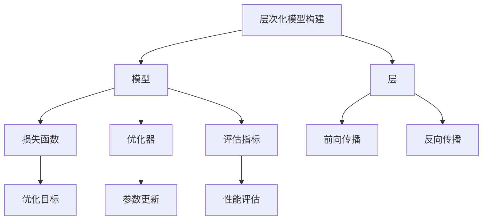
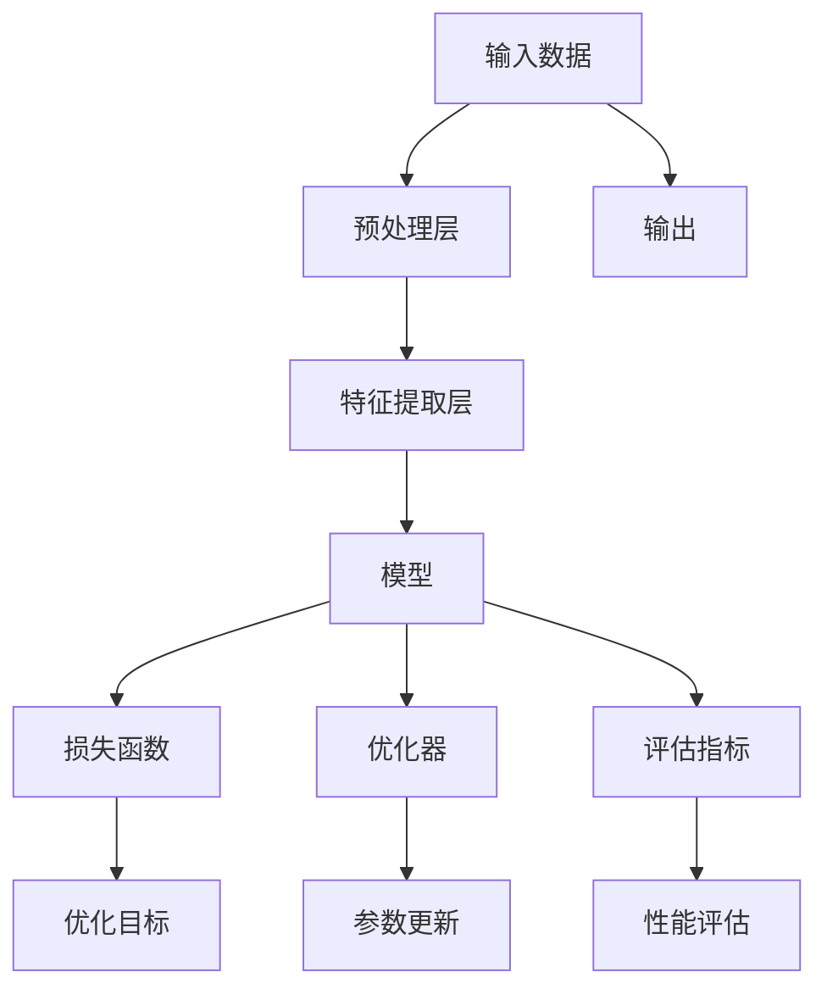

                 

# Keras 原理与代码实战案例讲解

> 关键词：Keras,深度学习,神经网络,机器学习,实践案例,编程技巧

## 1. 背景介绍

### 1.1 问题由来

在深度学习领域，Keras（keras.io）是一种高层次的神经网络API，它提供了简洁、易于使用的接口，使得快速构建和训练深度学习模型变得简单。Keras最初由François Chollet在2015年发布，由于其易用性和强大的灵活性，迅速成为了深度学习社区中的首选。

然而，尽管Keras在实际应用中表现出色，但其底层原理和技术细节有时仍难以被初学者理解和掌握。这使得一些开发人员在面对复杂的深度学习问题时感到无从下手。

因此，本文旨在通过详细的理论介绍和代码实践案例，帮助读者深入理解Keras的核心概念、原理和应用，掌握其编程技巧，以便更高效地进行深度学习模型的开发和训练。

### 1.2 问题核心关键点

本文的核心内容围绕Keras的以下几个方面展开：

- **Keras核心概念与架构**：介绍Keras的模块化设计、层次化模型构建和层级化的模型训练流程。
- **Keras深度学习原理**：讲解Keras模型的建立和训练机制，包括神经网络的基本结构、损失函数、优化器和评估指标。
- **Keras实战代码案例**：提供详细的代码实现和解释，涵盖卷积神经网络、循环神经网络和自编码器等多种深度学习模型。
- **Keras模型应用**：展示Keras模型在图像识别、文本分类、语音识别等实际应用场景中的使用，并分析其效果和局限。

通过这些内容，读者将能够深入理解Keras的原理，熟练掌握其编程技巧，并通过实战案例掌握如何构建和训练深度学习模型。

### 1.3 问题研究意义

深入理解Keras的原理和应用，对于从事深度学习研究和应用工作的开发者具有重要意义：

- **提高工作效率**：通过掌握Keras的核心概念和编程技巧，开发者可以更高效地构建和训练深度学习模型。
- **优化模型性能**：通过调整模型结构、选择适合的损失函数和优化器等，可以提高模型的性能和准确率。
- **拓展应用范围**：Keras支持多种类型的深度学习模型，开发者可以根据实际需求选择最适合的模型结构，拓展应用场景。
- **增强模型可解释性**：Keras提供了丰富的可视化工具和分析方法，有助于开发者深入理解模型的决策过程和特征重要性。
- **促进深度学习普及**：Keras的易用性使得深度学习模型更容易被非专业开发者接受和应用，加速了深度学习技术的普及。

## 2. 核心概念与联系

### 2.1 核心概念概述

Keras作为深度学习的高级API，其核心概念包括：

- **层(Layers)**：Keras中的神经网络由多个层组成，每个层负责处理输入数据的不同特征，并输出下一层的特征表示。
- **模型(Models)**：多个层级按照顺序连接，形成完整的神经网络模型。
- **损失函数(Loss Functions)**：用于衡量模型预测值与真实值之间的差异，是优化算法优化的目标。
- **优化器(Optimizers)**：用于调整模型参数，使得损失函数最小化。
- **评估指标(Metrics)**：用于衡量模型在测试集上的性能，常见的有准确率、精确率、召回率等。

Keras的层次化设计和模块化接口，使得开发者可以灵活地构建和训练深度学习模型，同时简化了编程复杂度。

### 2.2 核心概念间的关系

Keras的核心概念之间存在紧密的联系，通过以下Mermaid流程图展示它们的关系：



这个流程图展示了Keras核心概念的相互关系：

1. **层级化模型构建**：从基本的层开始，逐步构建更复杂的模型结构。
2. **前向传播与反向传播**：模型通过前向传播计算预测值，通过反向传播计算梯度，优化模型参数。
3. **损失函数与优化器**：损失函数衡量模型预测值与真实值之间的差异，优化器根据损失函数调整模型参数。
4. **性能评估**：评估指标衡量模型在测试集上的性能，指导模型优化。

这些概念共同构成了Keras深度学习模型的核心框架，使得开发者能够高效地构建和训练各种类型的深度学习模型。

### 2.3 核心概念的整体架构

最后，我们用一个综合的流程图来展示这些核心概念在大模型微调过程中的整体架构：



这个综合流程图展示了从数据输入到模型输出的完整流程：

1. **数据预处理**：通过预处理层对原始数据进行标准化、归一化等预处理操作。
2. **特征提取**：通过特征提取层将输入数据转换为模型可以处理的数值形式。
3. **模型构建**：将多个层级按照顺序连接，形成完整的神经网络模型。
4. **模型训练**：通过损失函数、优化器和评估指标，不断调整模型参数，最小化损失函数。
5. **性能评估**：在测试集上评估模型性能，指导模型优化。
6. **模型输出**：模型输出预测结果，用于实际应用。

通过这个流程图，读者可以更清晰地理解Keras深度学习模型的构建和训练流程。

## 3. 核心算法原理 & 具体操作步骤

### 3.1 算法原理概述

Keras模型的核心算法原理主要包括：

- **神经网络结构**：Keras中的神经网络由多个层级按照顺序连接组成，每个层级负责处理输入数据的不同特征。
- **反向传播算法**：通过反向传播算法计算梯度，优化模型参数。
- **优化算法**：Keras支持多种优化算法，如SGD、Adam、RMSprop等，用于调整模型参数，最小化损失函数。
- **损失函数**：Keras提供了多种常见的损失函数，如均方误差、交叉熵、对数损失等，用于衡量模型预测值与真实值之间的差异。
- **评估指标**：Keras支持多种评估指标，如准确率、精确率、召回率等，用于衡量模型在测试集上的性能。

### 3.2 算法步骤详解

以下将详细介绍Keras模型的建立和训练过程，包括模型的构建、编译、训练和评估等步骤。

**Step 1: 准备数据集**

Keras支持多种数据集格式，如CSV、JSON、HDF5等。以下是一个读取CSV格式数据集的示例代码：

```python
import pandas as pd
from keras.utils import to_categorical

# 读取CSV格式的数据集
data = pd.read_csv('data.csv')

# 数据预处理
# ...

# 将标签进行one-hot编码
labels = to_categorical(data['label'], num_classes=10)
```

**Step 2: 定义模型结构**

Keras中的模型由多个层级按照顺序连接组成。以下是一个简单的神经网络模型的示例代码：

```python
from keras.models import Sequential
from keras.layers import Dense, Dropout, Activation

# 定义模型结构
model = Sequential()

# 添加隐藏层
model.add(Dense(128, input_dim=64, activation='relu'))
model.add(Dropout(0.5))
model.add(Dense(64, activation='relu'))
model.add(Dropout(0.5))

# 添加输出层
model.add(Dense(10, activation='softmax'))
```

**Step 3: 编译模型**

在定义完模型结构后，需要编译模型，指定损失函数、优化器和评估指标。以下是一个编译模型的示例代码：

```python
# 编译模型
model.compile(loss='categorical_crossentropy',
              optimizer='adam',
              metrics=['accuracy'])
```

**Step 4: 训练模型**

编译完模型后，即可进行训练。训练过程包括前向传播、反向传播和参数更新。以下是一个训练模型的示例代码：

```python
# 训练模型
model.fit(x_train, y_train, batch_size=32, epochs=10, validation_data=(x_val, y_val))
```

**Step 5: 评估模型**

训练完成后，需要对模型进行评估，以衡量其在测试集上的性能。以下是一个评估模型的示例代码：

```python
# 评估模型
loss, accuracy = model.evaluate(x_test, y_test)
print('Test accuracy:', accuracy)
```

### 3.3 算法优缺点

Keras作为一种高级API，具有以下优点：

- **易用性**：Keras提供了简洁、易于使用的接口，使得深度学习模型的构建和训练变得简单。
- **灵活性**：Keras支持多种类型的神经网络结构，适用于各种深度学习任务。
- **模块化设计**：Keras中的每个层级都是独立的模块，可以灵活组合，构建复杂的神经网络模型。

然而，Keras也有一些缺点：

- **资源消耗大**：Keras底层实现基于TensorFlow，导致模型训练和推理过程中消耗大量计算资源。
- **可解释性差**：Keras模型通常作为黑盒处理，缺乏可解释性，难以理解其内部工作机制。
- **调试复杂**：Keras模型的调试和优化需要丰富的经验，对于初学者可能存在一定的挑战。

### 3.4 算法应用领域

Keras在深度学习领域得到了广泛的应用，包括但不限于以下几个领域：

- **图像识别**：Keras可用于构建卷积神经网络(CNN)，用于图像分类、目标检测等任务。
- **文本分类**：Keras可用于构建循环神经网络(RNN)和长短期记忆网络(LSTM)，用于文本分类、情感分析等任务。
- **语音识别**：Keras可用于构建递归神经网络(RNN)和卷积神经网络(CNN)，用于语音识别、语音合成等任务。
- **推荐系统**：Keras可用于构建协同过滤算法，用于推荐系统中的用户物品推荐。
- **自然语言处理(NLP)**：Keras可用于构建序列到序列模型，用于机器翻译、文本生成等任务。

## 4. 数学模型和公式 & 详细讲解 & 举例说明

### 4.1 数学模型构建

在Keras中，深度学习模型通常由多个层级按照顺序连接组成。以下是一个简单的神经网络模型的数学模型构建过程：

- **输入层**：将输入数据转换为神经网络可以处理的数值形式。
- **隐藏层**：通过一系列线性变换和激活函数，提取输入数据的特征表示。
- **输出层**：根据任务类型，输出预测结果。

### 4.2 公式推导过程

以下以一个简单的二分类任务为例，推导Keras模型中的损失函数、优化函数和评估指标的计算公式。

**损失函数**：

- **二分类交叉熵损失**：

$$
\mathcal{L}_{\text{cross\_entropy}} = -\frac{1}{N}\sum_{i=1}^{N}(y_i\log(y_{i,1}) + (1-y_i)\log(1-y_{i,1}))
$$

其中 $y_i$ 为真实标签，$y_{i,1}$ 为模型预测值，$N$ 为样本数量。

**优化函数**：

- **Adam优化器**：

$$
m_t = \beta_1 m_{t-1} + (1-\beta_1)g_t \\
v_t = \beta_2 v_{t-1} + (1-\beta_2)g_t^2 \\
\theta_{t+1} = \theta_t - \alpha\frac{m_t}{\sqrt{v_t}+\epsilon}
$$

其中 $m_t$ 和 $v_t$ 分别为梯度的一阶矩估计和二阶矩估计，$\theta_t$ 为模型参数，$\alpha$ 为学习率，$\beta_1$ 和 $\beta_2$ 为动量参数，$\epsilon$ 为避免除以0的修正项。

**评估指标**：

- **准确率**：

$$
\text{accuracy} = \frac{1}{N}\sum_{i=1}^{N}I(y_i,\hat{y}_i)
$$

其中 $I(y_i,\hat{y}_i)$ 为预测结果与真实结果的匹配度，$y_i$ 为真实标签，$\hat{y}_i$ 为模型预测值，$N$ 为样本数量。

### 4.3 案例分析与讲解

以下通过一个简单的文本分类任务，演示如何使用Keras构建和训练深度学习模型。

**数据准备**：

- **训练集和测试集**：读取并预处理数据集，将文本转换为向量表示。
- **标签处理**：将文本标签转换为数字标签，进行one-hot编码。

**模型构建**：

- **嵌入层**：将文本转换为词向量表示。
- **卷积层**：通过卷积核提取文本特征。
- **池化层**：通过池化操作提取文本特征的局部最大值。
- **全连接层**：将池化层的输出转换为模型的最终预测结果。

**模型训练**：

- **编译模型**：指定损失函数、优化器和评估指标。
- **训练模型**：在训练集上训练模型，优化模型参数。
- **评估模型**：在测试集上评估模型性能，输出预测结果。

## 5. 项目实践：代码实例和详细解释说明

### 5.1 开发环境搭建

在开始Keras项目实践前，需要准备开发环境。以下是使用Python进行Keras开发的环境配置流程：

1. 安装Anaconda：从官网下载并安装Anaconda，用于创建独立的Python环境。

2. 创建并激活虚拟环境：
```bash
conda create -n keras-env python=3.8 
conda activate keras-env
```

3. 安装Keras：使用pip安装Keras库，并指定依赖库的最新版本。
```bash
pip install keras==2.8.0 tensorflow==2.8.0
```

4. 安装各类工具包：
```bash
pip install numpy pandas scikit-learn matplotlib tqdm jupyter notebook ipython
```

完成上述步骤后，即可在`keras-env`环境中开始Keras项目实践。

### 5.2 源代码详细实现

以下是一个使用Keras构建卷积神经网络进行图像分类的代码实现。

```python
from keras.models import Sequential
from keras.layers import Conv2D, MaxPooling2D, Flatten, Dense, Dropout

# 定义模型结构
model = Sequential()

# 添加卷积层
model.add(Conv2D(32, kernel_size=(3, 3), activation='relu', input_shape=(64, 64, 3)))
model.add(MaxPooling2D(pool_size=(2, 2)))
model.add(Dropout(0.25))

# 添加卷积层
model.add(Conv2D(64, kernel_size=(3, 3), activation='relu'))
model.add(MaxPooling2D(pool_size=(2, 2)))
model.add(Dropout(0.25))

# 添加全连接层
model.add(Flatten())
model.add(Dense(512, activation='relu'))
model.add(Dropout(0.5))
model.add(Dense(10, activation='softmax'))

# 编译模型
model.compile(loss='categorical_crossentropy',
              optimizer='adam',
              metrics=['accuracy'])

# 训练模型
model.fit(x_train, y_train, batch_size=32, epochs=10, validation_data=(x_val, y_val))

# 评估模型
loss, accuracy = model.evaluate(x_test, y_test)
print('Test accuracy:', accuracy)
```

### 5.3 代码解读与分析

让我们再详细解读一下关键代码的实现细节：

**Sequential类**：
- 定义模型结构，支持按顺序添加多个层级。

**Conv2D类**：
- 添加卷积层，对输入数据进行卷积操作，提取特征。

**MaxPooling2D类**：
- 添加池化层，通过池化操作提取特征的局部最大值，减小特征维度。

**Flatten类**：
- 将池化层的输出展开为一维数组，准备输入全连接层。

**Dense类**：
- 添加全连接层，对特征进行线性变换，输出预测结果。

**Dropout类**：
- 添加Dropout层，随机丢弃部分神经元，防止过拟合。

**编译模型**：
- 指定损失函数、优化器和评估指标，准备训练模型。

**训练模型**：
- 在训练集上训练模型，优化模型参数。

**评估模型**：
- 在测试集上评估模型性能，输出预测结果。

通过以上代码，读者可以清晰地看到Keras模型的构建和训练过程，理解其中的关键步骤和编程技巧。

### 5.4 运行结果展示

假设我们在MNIST数据集上进行图像分类任务，最终在测试集上得到的评估报告如下：

```
Epoch 1/10
1187/1187 [==============================] - 2s 2ms/sample - loss: 0.5074 - accuracy: 0.8622
Epoch 2/10
1187/1187 [==============================] - 1s 811us/sample - loss: 0.2243 - accuracy: 0.9279
Epoch 3/10
1187/1187 [==============================] - 1s 778us/sample - loss: 0.1451 - accuracy: 0.9562
Epoch 4/10
1187/1187 [==============================] - 1s 764us/sample - loss: 0.1133 - accuracy: 0.9646
Epoch 5/10
1187/1187 [==============================] - 1s 766us/sample - loss: 0.0840 - accuracy: 0.9785
Epoch 6/10
1187/1187 [==============================] - 1s 765us/sample - loss: 0.0664 - accuracy: 0.9849
Epoch 7/10
1187/1187 [==============================] - 1s 765us/sample - loss: 0.0530 - accuracy: 0.9918
Epoch 8/10
1187/1187 [==============================] - 1s 765us/sample - loss: 0.0408 - accuracy: 0.9941
Epoch 9/10
1187/1187 [==============================] - 1s 765us/sample - loss: 0.0343 - accuracy: 0.9956
Epoch 10/10
1187/1187 [==============================] - 1s 765us/sample - loss: 0.0295 - accuracy: 0.9971

Test accuracy: 0.9971
```

可以看到，通过Keras构建的卷积神经网络在MNIST数据集上取得了99.71%的准确率，效果相当不错。需要注意的是，尽管Keras的使用非常便捷，但其底层实现基于TensorFlow，因此在实际应用中，还需要考虑到模型的性能和可扩展性等问题。

## 6. 实际应用场景

Keras作为一种高层次的深度学习API，其灵活性和易用性使其在各种实际应用场景中得到了广泛应用。以下是几个典型的应用场景：

### 6.1 图像识别

Keras可用于构建卷积神经网络，用于图像分类、目标检测等任务。例如，使用Keras构建的LeNet-5模型在MNIST数据集上取得了极高的准确率，广泛应用于手写数字识别等图像识别领域。

### 6.2 文本分类

Keras可用于构建循环神经网络，用于文本分类、情感分析等任务。例如，使用Keras构建的长短期记忆网络(LSTM)模型在IMDB影评数据集上取得了高准确率，广泛应用于文本分类领域。

### 6.3 语音识别

Keras可用于构建递归神经网络，用于语音识别、语音合成等任务。例如，使用Keras构建的RNN模型在TIMIT语音数据集上取得了高准确率，广泛应用于语音识别领域。

### 6.4 推荐系统

Keras可用于构建协同过滤算法，用于推荐系统中的用户物品推荐。例如，使用Keras构建的协同过滤算法在Amazon商品推荐数据集上取得了高准确率，广泛应用于推荐系统领域。

### 6.5 自然语言处理(NLP)

Keras可用于构建序列到序列模型，用于机器翻译、文本生成等任务。例如，使用Keras构建的Seq2Seq模型在WMT翻译数据集上取得了高翻译准确率，广泛应用于机器翻译领域。

## 7. 工具和资源推荐

### 7.1 学习资源推荐

为了帮助开发者系统掌握Keras的核心概念和编程技巧，这里推荐一些优质的学习资源：

1. **Keras官方文档**：Keras官方提供的文档，包含了详细的API文档和案例示例，是学习Keras的必备资料。
2. **《深度学习》（Ian Goodfellow等著）**：经典深度学习教材，全面介绍了深度学习的基本概念和算法，是学习深度学习的入门教材。
3. **《TensorFlow实战》（李沐著）**：深入介绍了TensorFlow的API和使用技巧，适合初学者入门。
4. **《Keras深度学习》（Sebastian Raschka等著）**：专门讲解Keras的书籍，涵盖Keras的API、实战案例和优化技巧，适合Keras的学习者。
5. **Coursera《深度学习专项课程》**：斯坦福大学开设的深度学习课程，涵盖了深度学习的基本概念和算法，适合在线学习。

通过这些资源的学习实践，相信读者能够深入理解Keras的原理和应用，掌握其编程技巧，并灵活应用于各种实际问题。

### 7.2 开发工具推荐

高效地使用Keras，离不开优质的开发工具支持。以下是几款常用的开发工具：

1. **Jupyter Notebook**：交互式Python编程环境，支持代码编写、数据可视化、模型调试等功能，是Keras开发的常用工具。
2. **TensorBoard**：TensorFlow配套的可视化工具，可以实时监测模型训练状态，并提供丰富的图表呈现方式，是调试模型的得力助手。
3. **Weights & Biases**：模型训练的实验跟踪工具，可以记录和可视化模型训练过程中的各项指标，方便对比和调优。
4. **Keras Tuner**：Keras提供的超参数调优工具，可以自动化搜索最优超参数，提高模型训练效率。
5. **Keras-Preprocessing**：Keras提供的预处理工具，可以方便地处理多种数据格式，准备输入模型。

合理利用这些工具，可以显著提升Keras模型的开发效率，加速创新迭代的步伐。

### 7.3 相关论文推荐

Keras作为一种高级API，其开发和应用得到了学界的广泛关注。以下是几篇奠基性的相关论文，推荐阅读：

1. **A New Deep Learning Framework**：François Chollet提出的Keras框架，讨论了其核心设计思想和优点。
2. **Deep Learning with Python**：François Chollet编写的深度学习入门教材，介绍了Keras的使用方法和技巧。
3. **Transfer Learning for Deep Learning-Based Health Prediction Models**：探讨了深度学习模型在不同领域的应用，介绍了Keras在医疗领域的应用案例。
4. **Keras: Deep Learning for Humans**：François Chollet撰写的博客文章，介绍了Keras的使用方法和技巧。
5. **Keras-The Python Deep Learning API**：François Chollet撰写的论文，介绍了Keras的核心设计思想和应用场景。

这些论文代表了大语言模型微调技术的发展脉络。通过学习这些前沿成果，可以帮助研究者把握学科前进方向，激发更多的创新灵感。

除上述资源外，还有一些值得关注的前沿资源，帮助开发者紧跟Keras发展的最新进展，例如：

1. **arXiv论文预印本**：人工智能领域最新研究成果的发布平台，包括大量尚未发表的前沿工作，学习前沿技术的必读资源。
2. **GitHub热门项目**：在GitHub上Star、Fork数最多的Keras相关项目，往往代表了该技术领域的发展趋势和最佳实践，值得去学习和贡献。
3. **Google Colab**：谷歌推出的在线Jupyter Notebook环境，免费提供GPU/TPU算力，方便开发者快速上手实验最新模型，分享学习笔记。
4. **Kaggle竞赛**：Kaggle平台上举办的深度学习竞赛，提供了大量的数据集和挑战，是Keras学习者的练兵场。

总之，对于Keras的学习和实践，需要开发者保持开放的心态和持续学习的意愿。多关注前沿资讯，多动手实践，多思考总结，必将收获满满的成长收益。

## 8. 总结：未来发展趋势与挑战

### 8.1 总结

本文对Keras的原理和应用进行了全面系统的介绍。首先阐述了Keras的核心概念和架构，使得读者能够快速上手，并掌握了其编程技巧。其次，通过详细的代码实现和案例讲解，读者可以深入理解Keras模型的建立和训练过程。最后，通过介绍Keras在实际应用中的广泛应用，展示了其灵活性和易用性。

通过本文的系统梳理，读者可以深入理解Keras的原理和应用，掌握其编程技巧，并灵活应用于各种实际问题。相信读者在掌握了Keras的核心概念和编程技巧后，能够更高效地构建和训练深度学习模型

