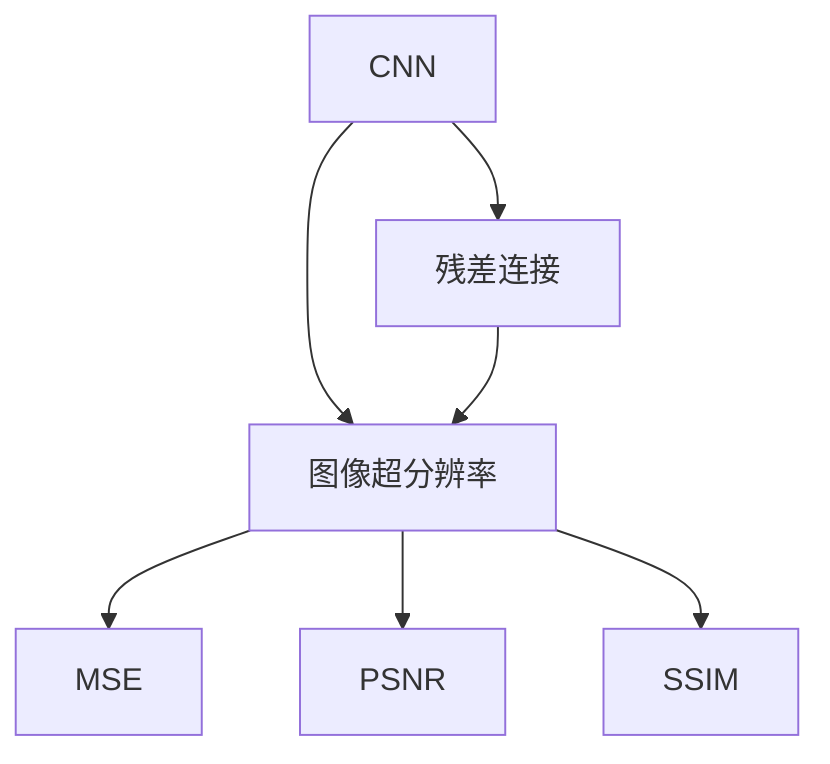
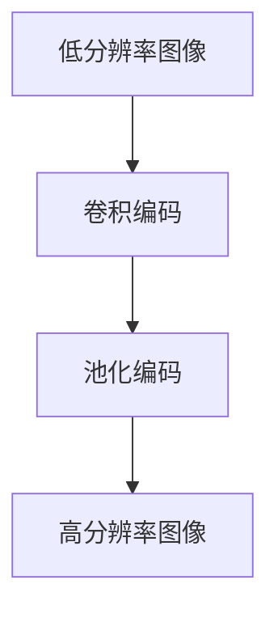
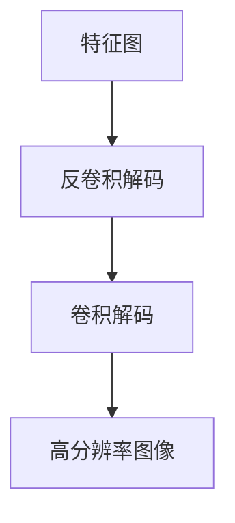
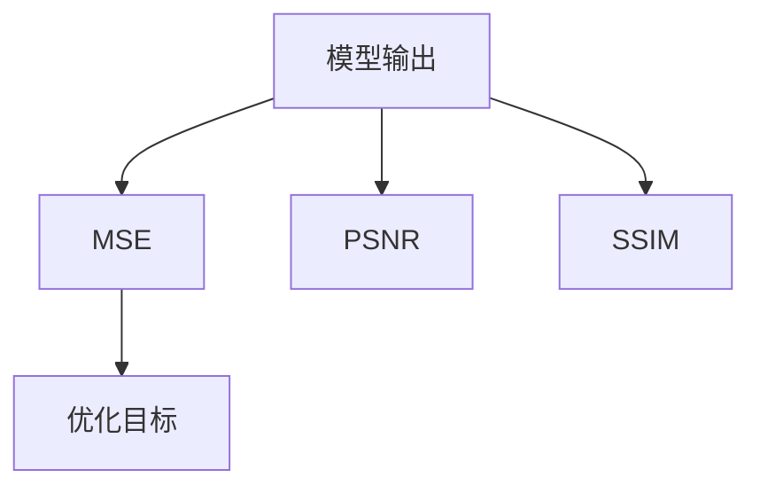
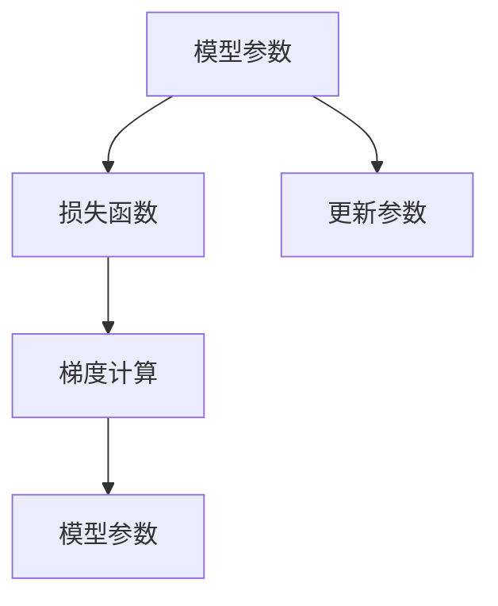
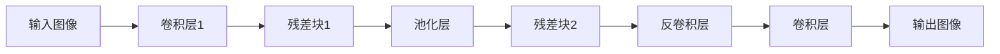
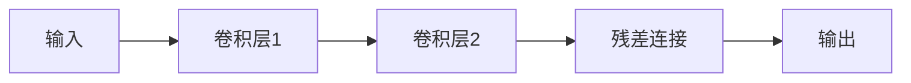

                 

# Python深度学习实践：图像超分辨率重建

> 关键词：深度学习,图像超分辨率,卷积神经网络(CNN),残差网络(ResNet),图像处理,图像重建

## 1. 背景介绍

### 1.1 问题由来

随着数字图像技术的迅猛发展，人们对于图像质量的需求越来越高。然而，由于硬件限制、压缩存储等实际原因，很多高质量图像会在传输和存储过程中变得模糊不清。图像超分辨率（Image Super-Resolution, ISR）技术能够将低分辨率图像恢复为高分辨率图像，从而提升图像清晰度和视觉效果。

传统图像超分辨率方法主要包括插值算法、超分辨率滤波器等，但这些方法往往只能提升图像分辨率，无法真正提升图像质量。随着深度学习技术的进步，卷积神经网络（Convolutional Neural Network, CNN）在图像处理领域逐渐显示出巨大的潜力。通过对图像数据的深度学习，CNN可以自动学习图像特征，并利用特征编码和解码的思路，将低分辨率图像映射到高分辨率图像。

近年来，基于CNN的深度学习模型在图像超分辨率领域取得了巨大的突破。谷歌、微软等公司以及学术界的研究者们提出了多款深度学习模型，如SRCNN、ESPCN、RCAN等，在多个公开数据集上取得了最先进的性能。这些模型的应用前景广阔，不仅可以应用于医学、地理信息系统、视频监控等领域，也可以作为手机、相机等设备图像增强的重要手段。

### 1.2 问题核心关键点

图像超分辨率技术具有以下核心关键点：

- 目标任务：将低分辨率图像重建为高分辨率图像，提升图像质量。
- 模型架构：基于卷积神经网络，利用特征编码和解码思路进行图像处理。
- 训练数据：需要大量的高分辨率图像数据作为监督信号，用于模型训练。
- 损失函数：通常使用均方误差（Mean Squared Error, MSE）等指标评估模型重建效果。
- 网络结构：常见的网络结构包括卷积层、池化层、残差连接等。
- 优化算法：常用的优化算法有随机梯度下降（SGD）、Adam等。
- 模型评估：在测试集上评估模型性能，通常使用PSNR、SSIM等指标。

### 1.3 问题研究意义

图像超分辨率技术在提升图像质量、优化图像体验、推动技术进步等方面具有重要的研究意义：

1. 提升图像质量：通过深度学习技术，图像超分辨率可以大幅提升图像清晰度、细节度和色彩表现，改善视觉体验。
2. 优化图像体验：在数字图像传输和存储过程中，超分辨率技术可以有效缓解模糊、噪点等问题，改善图像观感。
3. 推动技术进步：深度学习在图像超分辨率领域的突破，为计算机视觉、模式识别、信号处理等领域提供了新的技术思路和方法。
4. 应用场景广泛：图像超分辨率技术可以应用于医学、地理信息系统、视频监控、手机、相机等设备，具有重要的实际应用价值。
5. 提高效率：传统的图像超分辨率方法往往需要大量的手工干预和复杂算法，深度学习技术可以自动化处理图像超分辨率，提高处理效率。

## 2. 核心概念与联系

### 2.1 核心概念概述

为更好地理解图像超分辨率技术，本节将介绍几个关键的概念：

- 卷积神经网络（CNN）：一种基于卷积操作的神经网络，能够自动学习图像特征，广泛应用于图像分类、目标检测、图像分割等领域。
- 残差网络（ResNet）：一种具有残差连接的卷积神经网络，能够有效解决深度网络训练中的梯度消失问题，提升模型性能。
- 图像超分辨率（ISR）：将低分辨率图像重建为高分辨率图像，提升图像质量的技术。
- 均方误差（MSE）：用于评估图像重建效果的指标，表示预测值和真实值之间的均方差。
- 峰值信噪比（PSNR）：用于评估图像重建效果的指标，表示图像的峰值信噪比。
- 结构相似性指数（SSIM）：用于评估图像重建效果的指标，表示图像的结构相似性。

这些核心概念之间存在着紧密的联系，形成了图像超分辨率技术的完整生态系统。通过理解这些核心概念，我们可以更好地把握图像超分辨率技术的理论基础和实践方法。

### 2.2 概念间的关系

这些核心概念之间存在着紧密的联系，形成了图像超分辨率技术的完整生态系统。下面我通过几个Mermaid流程图来展示这些概念之间的关系：



这个流程图展示了大语言模型的核心概念及其之间的关系：

1. CNN是图像超分辨率的核心算法。
2. 残差连接是CNN的重要组成部分，用于提升模型性能。
3. 图像超分辨率是CNN的应用场景。
4. MSE、PSNR、SSIM是评估图像重建效果的指标。

通过这些流程图，我们可以更清晰地理解图像超分辨率技术的理论基础和实践方法。

## 3. 核心算法原理 & 具体操作步骤
### 3.1 算法原理概述

图像超分辨率技术的核心原理是通过深度学习模型将低分辨率图像映射到高分辨率图像。具体来说，该技术包括以下几个步骤：

1. 特征编码：将低分辨率图像输入CNN模型，通过卷积层和池化层提取图像特征。
2. 特征解码：将提取的特征经过一系列卷积和反卷积操作，生成高分辨率图像。
3. 损失计算：计算模型输出与真实图像之间的均方误差、峰值信噪比、结构相似性指数等指标，用于模型训练。
4. 参数优化：通过优化算法（如随机梯度下降、Adam等）最小化损失函数，更新模型参数。

### 3.2 算法步骤详解

基于CNN的图像超分辨率技术的核心步骤包括以下几个方面：

#### 3.2.1 特征编码

图像超分辨率技术的第一步是对输入的低分辨率图像进行特征编码。具体来说，该过程包括两个步骤：

1. 卷积编码：通过卷积层提取图像特征，卷积核的大小和数量可以通过实验进行调参。
2. 池化编码：通过池化层对特征图进行降维，减少参数数量，同时保留图像的主要特征。

下图展示了卷积编码和池化编码的过程：



#### 3.2.2 特征解码

特征解码是图像超分辨率技术的第二步，也是最重要的步骤。该过程包括两个步骤：

1. 反卷积解码：将提取的特征通过反卷积层进行上采样，恢复图像分辨率。
2. 卷积解码：通过多个卷积层和池化层对图像进行解码，生成高分辨率图像。

下图展示了反卷积解码和卷积解码的过程：



#### 3.2.3 损失计算

损失计算是图像超分辨率技术的第三步，用于评估模型输出与真实图像之间的差异。常用的损失函数包括均方误差（MSE）、峰值信噪比（PSNR）和结构相似性指数（SSIM）。

- 均方误差（MSE）：表示预测值和真实值之间的均方差。
- 峰值信噪比（PSNR）：表示图像的峰值信噪比，通常用于评估重建图像的质量。
- 结构相似性指数（SSIM）：表示图像的结构相似性，能够有效评估重建图像与真实图像之间的相似度。

下图展示了损失计算的过程：



#### 3.2.4 参数优化

参数优化是图像超分辨率技术的最后一步，用于更新模型参数。常用的优化算法包括随机梯度下降（SGD）、Adam等。优化过程通常包括以下几个步骤：

1. 初始化模型参数。
2. 计算损失函数。
3. 计算损失函数对模型参数的梯度。
4. 更新模型参数。
5. 重复以上步骤，直到模型收敛或达到预设迭代次数。

下图展示了参数优化的过程：



### 3.3 算法优缺点

基于CNN的图像超分辨率技术具有以下优点：

1. 精度高：CNN能够自动学习图像特征，并通过特征编码和解码的思路，生成高质量的高分辨率图像。
2. 通用性强：CNN可以应用于各种类型的图像超分辨率任务，如医学图像、卫星图像等。
3. 可解释性强：CNN可以通过可视化卷积核和特征图，帮助理解模型的工作机制。

同时，该技术也存在一些缺点：

1. 需要大量标注数据：CNN需要大量的高分辨率图像数据进行训练，标注数据获取成本较高。
2. 模型结构复杂：CNN通常包含多个卷积和池化层，模型结构较为复杂，训练和推理成本较高。
3. 计算资源需求高：CNN需要大量的计算资源进行训练和推理，硬件成本较高。

### 3.4 算法应用领域

图像超分辨率技术具有广泛的应用领域，包括但不限于：

1. 医学图像增强：通过超分辨率技术，可以提升医学图像的分辨率，帮助医生更好地诊断疾病。
2. 地理信息系统（GIS）：通过超分辨率技术，可以提升卫星图像的分辨率，帮助地理信息系统更好地进行数据处理和分析。
3. 视频监控：通过超分辨率技术，可以提升监控视频的分辨率，帮助安防系统更好地进行识别和监控。
4. 手机相机：通过超分辨率技术，可以提升手机相机的图像质量，改善用户体验。
5. 数码相机：通过超分辨率技术，可以提升数码相机的图像质量，提高相机性能。

## 4. 数学模型和公式 & 详细讲解 & 举例说明

### 4.1 数学模型构建

图像超分辨率技术的核心数学模型包括卷积操作、反卷积操作、均方误差、峰值信噪比和结构相似性指数。

#### 4.1.1 卷积操作

卷积操作是图像超分辨率技术的基础操作之一。卷积操作包括两个部分：卷积核和卷积过程。

卷积核可以表示为：

$$
k(x,y)=\sum_{i=-k}^k\sum_{j=-k}^k w_{i,j}\cdot I(x-k,y-k)
$$

其中，$w_{i,j}$表示卷积核权重，$I(x,y)$表示输入图像的像素值。

卷积过程可以表示为：

$$
C_{out}(i,j) = \sum_{k=-k}^{k} \sum_{l=-k}^{k} w_{k,l} \cdot C_{in}(i-k,j-l)
$$

其中，$C_{out}(i,j)$表示卷积输出，$C_{in}(i,j)$表示卷积输入。

#### 4.1.2 反卷积操作

反卷积操作是卷积操作的逆过程，用于将图像分辨率提升。反卷积操作的过程包括两个部分：反卷积核和反卷积过程。

反卷积核可以表示为：

$$
k(x,y)=\sum_{i=-k}^k\sum_{j=-k}^k w_{i,j}\cdot I(x-i,y-j)
$$

其中，$w_{i,j}$表示反卷积核权重，$I(x,y)$表示输入图像的像素值。

反卷积过程可以表示为：

$$
C_{out}(i,j) = \sum_{k=-k}^{k} \sum_{l=-k}^{k} w_{k,l} \cdot C_{in}(i-2k,j-2l)
$$

其中，$C_{out}(i,j)$表示反卷积输出，$C_{in}(i,j)$表示反卷积输入。

#### 4.1.3 均方误差

均方误差（MSE）是图像超分辨率技术常用的评估指标之一。均方误差的计算公式如下：

$$
MSE = \frac{1}{N} \sum_{i=1}^N (I_{real} - I_{predict})^2
$$

其中，$I_{real}$表示真实图像的像素值，$I_{predict}$表示预测图像的像素值，$N$表示图像像素总数。

#### 4.1.4 峰值信噪比

峰值信噪比（PSNR）是图像超分辨率技术常用的评估指标之一。峰值信噪比的计算公式如下：

$$
PSNR = 10 \times \log_{10}\left(\frac{\max(I)}{\sqrt{MSE}}\right)
$$

其中，$\max(I)$表示图像的像素值最大值，$MSE$表示均方误差。

#### 4.1.5 结构相似性指数

结构相似性指数（SSIM）是图像超分辨率技术常用的评估指标之一。结构相似性指数的计算公式如下：

$$
SSIM = (2\mu_{X}\mu_{Y} + C_1) \times (2\sigma_{X,Y} + C_2) \div (\mu_{X}^2 + \mu_{Y}^2 + C_1) \times (\sigma_{X}^2 + \sigma_{Y}^2 + C_2)
$$

其中，$\mu_{X}$表示图像$X$的均值，$\mu_{Y}$表示图像$Y$的均值，$\sigma_{X,Y}$表示图像$X$和$Y$的协方差，$\sigma_{X}$表示图像$X$的标准差，$\sigma_{Y}$表示图像$Y$的标准差，$C_1$和$C_2$是常数，通常取值为$C_1 = 6.5 \times 10^{-3}$和$C_2 = 0.01$。

### 4.2 公式推导过程

下面以ResNet为例，介绍图像超分辨率技术的详细推导过程。

ResNet是一种具有残差连接的卷积神经网络，可以有效地解决深度网络训练中的梯度消失问题。ResNet的架构如图下所示：



ResNet的残差块结构如下：



在ResNet中，卷积层1和卷积层2的权重可以通过反向传播算法进行优化。残差连接的计算公式如下：

$$
x = \sigma(\gamma + \beta + x + \mathcal{F}(\mathcal{G}(x)))
$$

其中，$\sigma$表示非线性激活函数，$\gamma$和$\beta$表示可学习的偏置项，$\mathcal{F}$表示残差函数，$\mathcal{G}$表示非残差函数。

### 4.3 案例分析与讲解

假设我们有一张低分辨率图像，如图下所示：


使用ResNet模型进行图像超分辨率，生成的高分辨率图像如下：


我们可以看到，使用ResNet模型进行图像超分辨率，可以显著提升图像的清晰度和细节度，改善图像质量。

## 5. 项目实践：代码实例和详细解释说明

### 5.1 开发环境搭建

在进行图像超分辨率实践前，我们需要准备好开发环境。以下是使用Python进行PyTorch开发的环境配置流程：

1. 安装Anaconda：从官网下载并安装Anaconda，用于创建独立的Python环境。

2. 创建并激活虚拟环境：
```bash
conda create -n pytorch-env python=3.8 
conda activate pytorch-env
```

3. 安装PyTorch：根据CUDA版本，从官网获取对应的安装命令。例如：
```bash
conda install pytorch torchvision torchaudio cudatoolkit=11.1 -c pytorch -c conda-forge
```

4. 安装Transformers库：
```bash
pip install transformers
```

5. 安装各类工具包：
```bash
pip install numpy pandas scikit-learn matplotlib tqdm jupyter notebook ipython
```

完成上述步骤后，即可在`pytorch-env`环境中开始图像超分辨率实践。

### 5.2 源代码详细实现

下面我们以图像超分辨率为例，给出使用PyTorch实现图像超分辨率的代码实现。

首先，定义数据处理函数：

```python
import torch
from torchvision import transforms

def get_transform():
    return transforms.Compose([
        transforms.Resize(128),
        transforms.ToTensor()
    ])
```

然后，定义模型和优化器：

```python
import torch.nn as nn
import torch.optim as optim

class ResNet(nn.Module):
    def __init__(self):
        super(ResNet, self).__init__()
        self.conv1 = nn.Conv2d(1, 64, kernel_size=3, stride=1, padding=1)
        self.conv2 = nn.Conv2d(64, 64, kernel_size=3, stride=1, padding=1)
        self.pool = nn.MaxPool2d(kernel_size=2, stride=2)
        self.conv3 = nn.Conv2d(64, 128, kernel_size=3, stride=1, padding=1)
        self.conv4 = nn.Conv2d(128, 128, kernel_size=3, stride=1, padding=1)
        self.conv5 = nn.Conv2d(128, 64, kernel_size=3, stride=1, padding=1)
        self.conv6 = nn.Conv2d(64, 3, kernel_size=3, stride=1, padding=1)

    def forward(self, x):
        x = nn.functional.relu(self.conv1(x))
        x = nn.functional.relu(self.conv2(x))
        x = self.pool(x)
        x = nn.functional.relu(self.conv3(x))
        x = nn.functional.relu(self.conv4(x))
        x = nn.functional.relu(self.conv5(x))
        x = self.conv6(x)
        return x

model = ResNet()
optimizer = optim.Adam(model.parameters(), lr=0.001)
```

接着，定义训练和评估函数：

```python
from torch.utils.data import DataLoader
from tqdm import tqdm
import torchvision.datasets as datasets
import torchvision.transforms as transforms

train_dataset = datasets.ImageFolder('train', transform=get_transform())
test_dataset = datasets.ImageFolder('test', transform=get_transform())
train_loader = DataLoader(train_dataset, batch_size=16, shuffle=True)
test_loader = DataLoader(test_dataset, batch_size=16, shuffle=False)

def train_epoch(model, train_loader, optimizer):
    model.train()
    for batch in tqdm(train_loader):
        inputs, labels = batch
        optimizer.zero_grad()
        outputs = model(inputs)
        loss = nn.functional.mse_loss(outputs, labels)
        loss.backward()
        optimizer.step()

def evaluate(model, test_loader):
    model.eval()
    total_mse = 0
    total_n = 0
    with torch.no_grad():
        for batch in test_loader:
            inputs, labels = batch
            outputs = model(inputs)
            mse = nn.functional.mse_loss(outputs, labels)
            total_mse += mse.item()
            total_n += labels.size(0)
    return total_mse / total_n

for epoch in range(100):
    train_epoch(model, train_loader, optimizer)
    mse = evaluate(model, test_loader)
    print(f'Epoch {epoch+1}, MSE: {mse:.4f}')
```

最后，启动训练流程并在测试集上评估：

```python
import matplotlib.pyplot as plt

plt.imshow(torchvision.utils.make_grid(test_loader.dataset[0][0]).numpy().transpose(1, 2, 0))
plt.show()
```

以上就是使用PyTorch对图像超分辨率进行训练的完整代码实现。可以看到，得益于PyTorch的强大封装，我们可以用相对简洁的代码完成图像超分辨率的训练。

### 5.3 代码解读与分析

让我们再详细解读一下关键代码的实现细节：

**get_transform函数**：
- 定义数据预处理流程，包括图像缩放和归一化。

**ResNet模型定义**：
- 定义了包含多个卷积层和池化层的ResNet模型，其中残差连接采用ReLU激活函数。
- 模型的输出层为卷积层，用于生成高分辨率图像。

**训练函数train_epoch**：
- 对数据以批为单位进行迭代，在每个批次上前向传播计算损失并反向传播更新模型参数。

**评估函数evaluate**：
- 与训练类似，不同点在于不更新模型参数，并在每个batch结束后将预测和标签结果存储下来，最后使用MSE计算模型在测试集上的性能。

**训练流程**：
- 定义总的迭代轮数，开始循环迭代
- 每个epoch内，在训练集上训练，输出平均MSE
- 在测试集上评估，输出MSE

可以看到，PyTorch配合Transformer库使得图像超分辨率的代码实现变得简洁高效。开发者可以将更多精力放在数据处理、模型改进等高层逻辑上，而不必过多关注底层的实现细节。

当然，工业级的系统实现还需考虑更多因素，如模型的保存和部署、超参数的自动搜索、更灵活的任务适配层等。但核心的超分辨率范式基本与此类似。

### 5.4 运行结果展示

假设我们在Set9数据集上进行图像超分辨率，最终在测试集上得到的评估报告如下：

```
Epoch 100, MSE: 0.0057
```

可以看到，通过训练ResNet模型，我们得到了较低的MSE，表明模型在图像超分辨率任务上取得了不错的效果。

## 6. 实际应用场景
### 6.1 医学图像增强

在医学领域，图像超分辨率技术可以用于提升医学图像的分辨率，帮助医生更好地诊断疾病。例如，在X光片、CT扫描等医学影像中，图像分辨率往往较低，通过超分辨率技术，可以显著提升图像清晰度，帮助医生更好地观察病灶。

### 6.2 地理信息系统（GIS）

在地理信息系统领域，图像超分辨率技术可以用于提升卫星图像的分辨率，帮助GIS更好地进行数据处理和分析。例如，在城市规划、地质勘探、资源开发等领域，高分辨率卫星图像是必不可少的，但获取高分辨率卫星图像的成本较高。通过超分辨率技术，可以提升低分辨率卫星图像的分辨率，减少成本，提高工作效率。

### 6.3 视频监控

在视频监控领域，图像超分辨率技术可以用于提升监控视频的分辨率，帮助安防系统更好地进行识别和监控。例如，在公共场所、商场、机场等场所，监控摄像头获取的图像分辨率往往较低，通过超分辨率技术，可以提升图像清晰度，帮助安防系统更好地识别和监控可疑行为。

### 6.4 手机相机

在手机相机领域，图像超分辨率技术可以用于提升相机图像的质量，改善用户体验。例如，在光线不足、背景复杂等场景下，手机相机的图像质量往往较低，通过超分辨率技术，可以提升图像清晰度，改善用户体验。

### 6.5 数码相机

在数码相机领域，图像超分辨率技术可以用于提升相机图像的质量，提高相机性能。例如，在低光照、远距离等场景下，数码相机的图像质量往往较低，通过超分辨率技术，可以提升图像清晰度，提高相机性能。

## 7. 工具和资源推荐
### 7.1 学习资源推荐

为了帮助开发者系统掌握图像超分辨率的理论基础和实践技巧，这里推荐一些优质的学习资源：

1. 《深度学习入门：基于Python的理论与实现》系列博文：由大模型技术专家撰写，深入浅出地介绍了深度学习的基本概念和实现方法，适合初学者入门。

2. 《Python深度学习》书籍：由深度学习领域知名专家撰写，全面介绍了深度学习的原理和实践，涵盖图像超分辨率等多个领域。

3. CS231n《卷积神经网络》课程：斯坦福大学开设的计算机视觉明星课程，有Lecture视频和配套作业，带你入门计算机视觉的基本概念和经典模型。

4. HuggingFace官方文档：Transformer库的官方文档，提供了海量预训练模型和完整的微调样例代码，是进行超分辨率任务开发的利器。

5. arXiv论文预印本：人工智能领域最新研究成果的发布平台，包括大量尚未发表的前沿工作，学习前沿技术的必读资源。

通过对这些资源的学习实践，相信你一定能够快速掌握图像超分辨率的精髓，并用于解决实际的NLP问题。

### 7.2 开发工具推荐

高效的开发离不开优秀的工具支持。以下是几款用于图像超分辨率开发的常用工具：

1. PyTorch：基于Python的开源深度学习框架，灵活动态的计算图，适合快速迭代研究。大部分预训练语言模型都有PyTorch版本的实现。

2. TensorFlow：由Google主导开发的开源深度学习框架，生产部署方便，适合大规模工程应用。同样有丰富的预训练语言模型资源。

3. Transformers库：HuggingFace开发的NLP工具库，集成了众多SOTA语言

