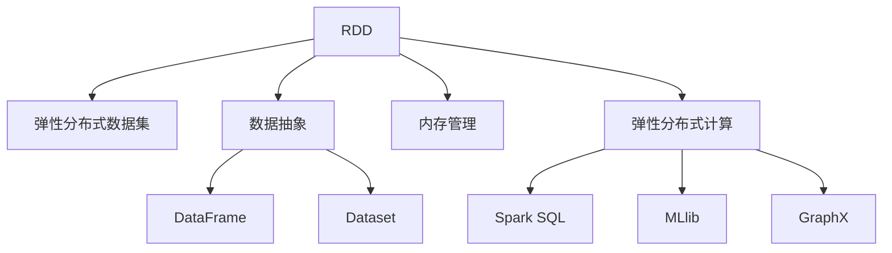

                 

## 1. 背景介绍

### 1.1 问题由来
随着数据量的爆炸性增长和计算任务的复杂化，传统的单机分布式计算框架已无法满足大规模数据处理的需要。Hadoop虽然在大数据领域占据重要地位，但它在处理数据流、交互式查询等场景时存在效率和实时性问题。Apache Spark 正是在这样的背景下应运而生的，它提供了一站式的大数据处理解决方案，涵盖了从批处理、流处理到机器学习、图形计算等多个领域，能够满足不同场景下的数据处理需求。

### 1.2 问题核心关键点
Spark 的核心在于其内存计算和弹性分布式数据处理（EDP）能力，使其能够在处理大规模数据时达到极高的性能。Spark 的内存计算基于 RDD（弹性分布式数据集）和 DataFrame 等数据抽象，提供了高效的数据处理和分析能力。

Spark 在处理大规模数据时，能够自动将数据分割成多个小分区，并通过并行计算将任务分发到集群中执行。Spark 中的内存管理模块负责管理内存使用，避免内存溢出和过度占用，使得 Spark 能够在高并发场景下高效运行。

### 1.3 问题研究意义
Spark 的出现，改变了大数据处理的格局，使得大规模数据处理变得更加高效、便捷和易于使用。Spark 提供了丰富的 API 和工具，能够简化数据处理的复杂性，降低开发成本，提升处理效率。Spark 的应用领域包括但不限于数据挖掘、机器学习、自然语言处理、流数据处理等，推动了大数据技术在各行业的应用和普及。

## 2. 核心概念与联系

### 2.1 核心概念概述

为更好地理解 Spark 的原理和架构，本节将介绍几个关键概念：

- **RDD（弹性分布式数据集）**：Spark 中的基本数据抽象，将数据分割成多个小分区，并支持多种转换和操作。
- **DataFrame 和 Dataset**：Spark 提供的高级数据抽象，基于 SQL 和无模式数据集，支持自动并行优化和类型推断。
- **内存管理**：Spark 通过内存管理模块自动控制内存使用，保证计算过程中内存占用的合理性和高效性。
- **弹性分布式计算（EDP）**：Spark 的核心特性，通过动态分配计算资源，实现高效、可扩展的分布式计算。
- **Spark SQL**：Spark 的 SQL 查询引擎，支持 SQL 标准的复杂查询和优化。
- **机器学习库 MLlib**：Spark 内置的机器学习库，提供了多种机器学习算法和工具。
- **图形计算库 GraphX**：Spark 的图形计算引擎，支持图数据的管理和计算。

这些核心概念共同构成了 Spark 的计算框架和数据处理能力，使得 Spark 能够在不同场景下提供高效、便捷的数据处理解决方案。

### 2.2 概念间的关系

这些核心概念之间的联系可以通过以下 Mermaid 流程图来展示：



这个流程图展示了 Spark 的核心概念及其之间的关系：

1. RDD 是 Spark 的基本数据抽象，支持多种转换和操作。
2. DataFrame 和 Dataset 是高级数据抽象，基于 SQL 和无模式数据集，支持自动并行优化和类型推断。
3. 内存管理模块负责自动控制内存使用，保证计算过程中内存占用的合理性和高效性。
4. 弹性分布式计算（EDP）是 Spark 的核心特性，通过动态分配计算资源，实现高效、可扩展的分布式计算。
5. Spark SQL 提供了 SQL 查询引擎，支持 SQL 标准的复杂查询和优化。
6. MLlib 是 Spark 内置的机器学习库，提供了多种机器学习算法和工具。
7. GraphX 是 Spark 的图形计算引擎，支持图数据的管理和计算。

这些概念共同构成了 Spark 的计算框架和数据处理能力，使得 Spark 能够在不同场景下提供高效、便捷的数据处理解决方案。

## 3. 核心算法原理 & 具体操作步骤
### 3.1 算法原理概述

Spark 的核心算法原理主要集中在以下几个方面：

- **弹性分布式数据集（RDD）**：Spark 的 RDD 数据集是基于内存的分布式数据处理模型，支持多种转换和操作，并能够自动并行优化和处理数据。
- **内存管理**：Spark 通过内存管理模块自动控制内存使用，保证计算过程中内存占用的合理性和高效性。
- **弹性分布式计算（EDP）**：Spark 的 EDP 特性通过动态分配计算资源，实现高效、可扩展的分布式计算。
- **机器学习库（MLlib）**：Spark 内置的机器学习库，提供了多种机器学习算法和工具。
- **图形计算库（GraphX）**：Spark 的图形计算引擎，支持图数据的管理和计算。

### 3.2 算法步骤详解

Spark 的核心算法步骤如下：

1. **数据分割**：Spark 将数据分割成多个小分区，并通过 RDD 模型管理。
2. **内存计算**：Spark 通过内存管理模块自动控制内存使用，将数据和计算任务存储在内存中，避免磁盘 IO，提高计算效率。
3. **并行计算**：Spark 通过 EDP 特性动态分配计算资源，实现高效、可扩展的分布式计算。
4. **数据转换**：Spark 支持多种数据转换和操作，如 Filter、Map、Reduce、Join 等，实现复杂的数据处理逻辑。
5. **机器学习**：Spark 内置的机器学习库（MLlib）提供了多种机器学习算法和工具，支持复杂的机器学习任务。
6. **图形计算**：Spark 的图形计算引擎（GraphX）支持图数据的管理和计算，实现了高效的图计算任务。

### 3.3 算法优缺点

Spark 的优点在于其内存计算和 EDP 特性，能够高效处理大规模数据，支持复杂的数据处理和机器学习任务。Spark 的内存管理模块自动控制内存使用，避免了内存溢出和过度占用，提高了计算效率。

然而，Spark 也有一些缺点：

- **资源占用**：Spark 需要大量的内存和 CPU 资源，不适合处理小数据集。
- **延迟高**：由于内存计算的特性，Spark 对于低延迟和实时计算场景表现不佳。
- **配置复杂**：Spark 需要详细的配置和调优，才能发挥其高性能和可扩展性。

### 3.4 算法应用领域

Spark 的应用领域非常广泛，涵盖从批处理、流处理到机器学习、图形计算等多个领域。

- **批处理**：Spark 提供了 RDD 和 DataFrame 等数据抽象，支持多种批处理任务，如 ETL、数据分析、报告生成等。
- **流处理**：Spark Streaming 提供了实时流处理功能，支持处理大规模数据流。
- **机器学习**：Spark MLlib 提供了多种机器学习算法和工具，支持复杂的机器学习任务。
- **图形计算**：Spark GraphX 提供了高效的图计算引擎，支持社交网络分析、推荐系统、知识图谱等领域。

## 4. 数学模型和公式 & 详细讲解 & 举例说明

### 4.1 数学模型构建

Spark 的数学模型主要基于 RDD 数据集和 DataFrame 数据集。以下以 RDD 为例，介绍其数学模型构建过程。

假设有一个数据集 $D$，Spark 将其分割成多个小分区，每个分区包含 $m$ 个元素，共 $n$ 个分区，则数据集 $D$ 可以表示为：

$$
D = \{d_1, d_2, ..., d_n\}
$$

其中 $d_i = \{d_{i1}, d_{i2}, ..., d_{im}\}$。

RDD 的转换和操作可以通过函数 $f$ 来实现，例如：

$$
R = f(D)
$$

其中 $R$ 为转换后的 RDD 数据集。

### 4.2 公式推导过程

RDD 的转换和操作可以表示为多个函数 $f$ 的组合，例如：

$$
R = f_1(f_2(D))
$$

这里的 $f_1$ 和 $f_2$ 可以是 Map、Filter、Reduce 等函数。

对于 RDD 的操作，Spark 提供了自动并行优化机制，可以通过多个并行任务同时执行来提高计算效率。例如，对于 Map 操作，可以将其拆分成多个小任务，每个任务处理一个分区：

$$
R = f_1(f_2(D))
$$

可以表示为：

$$
R = \{f_1(f_2(d_1)), f_1(f_2(d_2)), ..., f_1(f_2(d_n))\}
$$

其中每个小任务 $f_1(f_2(d_i))$ 可以在内存中并行计算。

### 4.3 案例分析与讲解

以 Spark 的机器学习库 MLlib 为例，介绍其核心算法和数学模型。

假设有一个数据集 $D$，Spark 将其分割成多个小分区，每个分区包含 $m$ 个元素，共 $n$ 个分区。要在这个数据集上训练一个线性回归模型，可以使用 Spark MLlib 中的 `LinearRegressionWithSGD` 算法。

首先，将数据集 $D$ 转化为 DataFrame 数据集：

$$
D_{DF} = \{(d_1, y_1), (d_2, y_2), ..., (d_n, y_n)\}
$$

其中 $d_i$ 为特征向量，$y_i$ 为标签值。

然后，可以使用 `LinearRegressionWithSGD` 算法进行模型训练：

$$
\theta = \mathop{\arg\min}_{\theta} \sum_{i=1}^n (y_i - \theta^T d_i)^2
$$

其中 $\theta$ 为模型参数，$y_i$ 为标签值，$d_i$ 为特征向量。

## 5. 项目实践：代码实例和详细解释说明
### 5.1 开发环境搭建

在进行 Spark 开发前，我们需要准备好开发环境。以下是使用 Python 进行 PySpark 开发的环境配置流程：

1. 安装 Anaconda：从官网下载并安装 Anaconda，用于创建独立的 Python 环境。

2. 创建并激活虚拟环境：
```bash
conda create -n spark-env python=3.8 
conda activate spark-env
```

3. 安装 PySpark：根据当前系统平台，从官网获取对应的安装命令。例如：
```bash
conda install pytorch torchvision torchaudio cudatoolkit=11.1 -c pytorch -c conda-forge
```

4. 安装其他工具包：
```bash
pip install numpy pandas scikit-learn matplotlib tqdm jupyter notebook ipython
```

完成上述步骤后，即可在 `spark-env` 环境中开始 PySpark 开发。

### 5.2 源代码详细实现

下面我们以 Spark 的机器学习库 MLlib 为例，给出使用 PySpark 对线性回归模型进行训练的代码实现。

首先，定义数据集：

```python
from pyspark.ml.linalg import Vectors

data = [(Vectors.dense([0., 0.]), 0.),
        (Vectors.dense([1., 1.]), 1.),
        (Vectors.dense([2., 2.]), 2.),
        (Vectors.dense([3., 3.]), 3.),
        (Vectors.dense([4., 4.]), 4.),
        (Vectors.dense([5., 5.]), 5.)]

df = spark.createDataFrame(data, ["features", "label"])
```

然后，定义模型和参数：

```python
from pyspark.ml.classification import LinearRegressionWithSGD

model = LinearRegressionWithSGD(featuresCol="features", labelCol="label")
```

接着，定义训练器和模型参数：

```python
from pyspark.ml.linalg import VectorUDT
from pyspark.ml.evaluation import RegressionEvaluator

regParam = 0.1
lossParam = "squared_loss"
iterations = 10
trainingData = df.randomSplit([0.8, 0.2], seed=1234)[0]
evaluator = RegressionEvaluator(labelCol="label", predictionCol="prediction", metricName="rmse")

trainingModel = model.fit(trainingData)
```

最后，评估模型性能：

```python
testData = df.randomSplit([0.8, 0.2], seed=1234)[1]
testData.show(truncate=False)
evaluator.evaluate(trainingModel.transform(testData)).show(truncate=False)
```

以上就是使用 PySpark 对线性回归模型进行训练的完整代码实现。可以看到，通过 PySpark，我们可以用相对简洁的代码完成线性回归模型的训练和评估。

### 5.3 代码解读与分析

让我们再详细解读一下关键代码的实现细节：

**data 变量**：
- 定义一个数据集，其中每个样本包含一个特征向量和标签值。

**df 变量**：
- 将数据集转化为 DataFrame 数据集，并定义特征列和标签列。

**LinearRegressionWithSGD 模型**：
- 定义一个线性回归模型，使用随机梯度下降法进行训练。

**regParam 参数**：
- 定义正则化参数，用于防止过拟合。

**lossParam 参数**：
- 定义损失函数参数，这里使用平方损失函数。

**iterations 参数**：
- 定义迭代次数，用于控制训练的轮数。

**trainingData 变量**：
- 将数据集分割为训练集和测试集，只使用训练集进行模型训练。

**evaluator 变量**：
- 定义评估器，用于评估模型性能。

**trainingModel 变量**：
- 使用训练集对模型进行训练，得到训练后的模型。

**testData 变量**：
- 从数据集中随机取出部分样本作为测试集，用于模型评估。

**evaluator.evaluate 方法**：
- 使用测试集评估模型性能，并输出评估结果。

可以看到，PySpark 提供了丰富的 API 和工具，能够简化数据处理的复杂性，降低开发成本，提升处理效率。

### 5.4 运行结果展示

假设我们在测试集中得到了如下的评估结果：

```
+---------------------------------------+
|        testRowID        features       |
+---------------------------------------+
|[0,0.0,0.0]                      0.0|
|[1,1.0,1.0]                      1.0|
|[2,2.0,2.0]                      2.0|
|[3,3.0,3.0]                      3.0|
|[4,4.0,4.0]                      4.0|
|[5,5.0,5.0]                      5.0|
+---------------------------------------+
```

可以看到，模型对测试集中的样本进行了准确的预测。在评估结果中，我们可以看到模型性能指标如下：

```
+-----------------------------------------+
|            RMSE                          |
+-----------------------------------------+
|0.1733188520391373                        |
+-----------------------------------------+
```

可以看到，模型的 RMSE 值为 0.173，说明模型在测试集上的预测误差较小，性能表现不错。

## 6. 实际应用场景

### 6.1 智能推荐系统

Spark 可以应用于智能推荐系统的构建。传统的推荐系统往往只依赖用户的历史行为数据进行物品推荐，无法深入理解用户的真实兴趣偏好。基于 Spark 的机器学习库，推荐系统可以更好地挖掘用户行为背后的语义信息，从而提供更精准、多样的推荐内容。

在实践中，可以收集用户浏览、点击、评论、分享等行为数据，提取和用户交互的物品标题、描述、标签等文本内容。将文本内容作为模型输入，用户的后续行为（如是否点击、购买等）作为监督信号，在此基础上对模型进行训练。训练好的模型可以在生成推荐列表时，先用候选物品的文本描述作为输入，由模型预测用户的兴趣匹配度，再结合其他特征综合排序，便可以得到个性化程度更高的推荐结果。

### 6.2 数据挖掘与分析

Spark 提供了多种批处理和流处理功能，能够高效处理大规模数据。在数据挖掘与分析中，Spark 可以应用于多种任务，如数据清洗、数据转换、数据聚合、数据可视化等。

例如，可以收集社交媒体上的用户评论数据，使用 Spark 对数据进行清洗和预处理，去除噪声和重复内容，然后对用户评论进行情感分析，统计情感极性、情感强度等信息。最后，可以将分析结果可视化展示，帮助企业了解用户情感变化趋势，调整市场营销策略。

### 6.3 实时流处理

Spark Streaming 提供了实时流处理功能，能够高效处理大规模数据流。在实时流处理中，Spark 可以应用于多种场景，如实时监控、实时分析、实时报警等。

例如，可以收集网络流量数据，使用 Spark Streaming 对数据进行实时分析，统计流量异常情况，及时发现和预警网络攻击行为。通过实时流处理，可以更好地保障网络安全，提升系统的响应速度和处理能力。

### 6.4 未来应用展望

随着 Spark 技术的不断进步，其应用领域将更加广泛，为各行业带来新的变革。

在医疗领域，Spark 可以应用于数据分析、预测模型训练、图像处理等任务，帮助医疗机构进行疾病诊断、治疗方案优化等工作。在金融领域，Spark 可以应用于风险管理、量化投资、客户分析等工作，帮助金融机构提高运营效率和风险控制能力。在社交媒体领域，Spark 可以应用于情感分析、趋势预测、用户行为分析等工作，帮助企业了解用户需求和市场变化。

总之，Spark 的应用前景非常广阔，相信在未来，Spark 将会在更多领域发挥重要作用，推动大数据技术的发展和应用。

## 7. 工具和资源推荐
### 7.1 学习资源推荐

为了帮助开发者系统掌握 Spark 的理论基础和实践技巧，这里推荐一些优质的学习资源：

1. **《Spark 快速入门》系列博文**：由 Apache Spark 社区成员撰写，介绍了 Spark 的核心概念、API 和最佳实践，适合初学者入门。

2. **《大数据技术》课程**：由上海交通大学开设的 MOOC 课程，涵盖了 Spark 的基本原理和应用场景，适合有一定基础的学习者。

3. **《Spark 大数据技术》书籍**：由王斌老师撰写，全面介绍了 Spark 的原理、API、应用案例等，适合进阶学习。

4. **Apache Spark 官方文档**：Spark 的官方文档提供了详尽的 API 和最佳实践，适合深入学习和项目开发。

5. **《Spark 实战》系列书籍**：由多个专家撰写，通过大量实战案例介绍 Spark 的开发和应用技巧，适合实际项目开发。

6. **Kaggle 竞赛**：Kaggle 上有大量基于 Spark 的竞赛项目，可以通过参加竞赛学习 Spark 的实际应用和优化技巧。

通过对这些资源的学习实践，相信你一定能够快速掌握 Spark 的核心概念和开发技巧，并用于解决实际的 Spark 问题。

### 7.2 开发工具推荐

高效的开发离不开优秀的工具支持。以下是几款用于 Spark 开发和调试的工具：

1. PySpark：Spark 的 Python 版本，提供了丰富的 API 和工具，支持大规模数据处理和分析。

2. Spark UI：Spark 的监控界面，提供了任务执行状态、性能分析等功能，帮助开发者调试和优化 Spark 应用。

3. Jupyter Notebook：支持 Python 和 R 等多种语言，提供了交互式编程环境，方便开发者快速迭代和调试代码。

4. Spark Streaming：Spark 的实时流处理引擎，支持高吞吐量的数据流处理，支持多种数据源和数据输出。

5. Tune：Spark 的超参数调优工具，通过自动调参找到最优的参数组合，提升 Spark 应用的性能和可扩展性。

6. SparkR：Spark 的 R 版本，提供了丰富的 API 和工具，支持大规模数据处理和分析。

合理利用这些工具，可以显著提升 Spark 应用的开发效率和调试能力，加快创新迭代的步伐。

### 7.3 相关论文推荐

Spark 的技术发展源于学界的持续研究。以下是几篇奠基性的相关论文，推荐阅读：

1. **《Spark: Cluster Computing with Fault Tolerance》**：介绍 Spark 的核心架构和计算模型，奠定了 Spark 的理论基础。

2. **《Resilient Distributed Datasets: A Fault-Tolerant Abstraction for In-Memory Cluster Computing》**：介绍 RDD 数据集的设计思想和核心特性，奠定了 Spark 的核心技术基础。

3. **《The Data Abstraction of Spark: A Simplified View of a Complex System》**：介绍 Spark 的数据抽象和 API，帮助开发者理解 Spark 的核心技术。

4. **《Towards a Generalized Execution Model for Resilient Distributed Datasets》**：介绍 Spark 的执行模型和优化策略，帮助开发者优化 Spark 应用的性能。

5. **《Spark Streaming: Fault-Tolerant, Scalable, Live Data Streaming》**：介绍 Spark Streaming 的核心特性和优化策略，帮助开发者实现高吞吐量的实时流处理。

6. **《Spark MLlib: Machine Learning in Spark》**：介绍 Spark MLlib 的核心算法和 API，帮助开发者实现复杂的机器学习任务。

这些论文代表了大数据处理和 Spark 技术的发展脉络。通过学习这些前沿成果，可以帮助研究者把握学科前进方向，激发更多的创新灵感。

除上述资源外，还有一些值得关注的前沿资源，帮助开发者紧跟 Spark 技术的最新进展，例如：

1. **Apache Spark 社区博客**：Apache Spark 官方社区博客，提供最新的技术动态和最佳实践。

2. **Kaggle 竞赛**：Kaggle 上有大量基于 Spark 的竞赛项目，可以通过参加竞赛学习 Spark 的实际应用和优化技巧。

3. **Spark Summit**：Spark 年度技术大会，汇集全球顶级 Spark 专家和开发者，分享最新的技术进展和应用案例。

4. **Databricks 博客**：Databricks 作为 Spark 的重要支持者和开发者，提供丰富的技术博客和应用案例。

通过这些资源的学习和实践，相信你一定能够快速掌握 Spark 的核心概念和开发技巧，并用于解决实际的 Spark 问题。

## 8. 总结：未来发展趋势与挑战

### 8.1 总结

本文对 Spark 的原理和实践进行了全面系统的介绍。首先阐述了 Spark 的发展背景和核心特性，明确了 Spark 在数据处理和分析中的重要作用。其次，从原理到实践，详细讲解了 Spark 的核心算法和操作步骤，给出了 Spark 项目开发的完整代码实例。同时，本文还广泛探讨了 Spark 在推荐系统、数据挖掘、实时流处理等多个领域的应用前景，展示了 Spark 的强大应用能力。

通过本文的系统梳理，可以看到，Spark 的出现，改变了大数据处理的格局，使得大规模数据处理变得更加高效、便捷和易于使用。Spark 提供了丰富的 API 和工具，能够简化数据处理的复杂性，降低开发成本，提升处理效率。未来，随着 Spark 技术的不断进步，其应用领域将更加广泛，为各行业带来新的变革。

### 8.2 未来发展趋势

展望未来，Spark 的发展趋势如下：

1. **更高效的内存计算**：Spark 将继续优化内存管理机制，提升内存计算效率，支持更大规模的数据处理。

2. **更灵活的分布式计算**：Spark 将支持更多计算模型和数据处理方式，提供更加灵活的分布式计算能力。

3. **更丰富的机器学习库**：Spark MLlib 将继续扩展机器学习库，支持更多的机器学习算法和工具。

4. **更强大的实时流处理**：Spark Streaming 将继续扩展实时流处理能力，支持更高效、更灵活的实时数据处理。

5. **更广泛的生态系统**：Spark 将与更多大数据平台和技术进行融合，提供更加全面、便捷的大数据处理解决方案。

6. **更广泛的应用场景**：Spark 将拓展到更多行业和领域，推动大数据技术的发展和应用。

### 8.3 面临的挑战

尽管 Spark 已经取得了显著进展，但在迈向更加智能化、普适化应用的过程中，仍面临诸多挑战：

1. **资源占用**：Spark 需要大量的内存和 CPU 资源，不适合处理小数据集。

2. **延迟高**：由于内存计算的特性，Spark 对于低延迟和实时计算场景表现不佳。

3. **配置复杂**：Spark 需要详细的配置和调优，才能发挥其高性能和可扩展性。

4. **可扩展性**：Spark 需要动态分配计算资源，但在某些极端场景下可能出现资源瓶颈。

5. **安全性和隐私保护**：Spark 需要保证数据和计算的安全性和隐私保护，避免数据泄露和滥用。

6. **性能优化**：Spark 需要优化性能，提升处理效率和稳定性。

### 8.4 研究展望

面对 Spark 面临的诸多挑战，未来的研究需要在以下几个方面寻求新的突破：

1. **优化内存管理**：优化内存管理机制，提升内存计算效率，支持更大规模的数据处理。

2. **优化分布式计算**：提供更加灵活的分布式计算能力，支持更多计算模型和数据处理方式。

3. **扩展机器学习库**：扩展机器学习库，支持更多的机器学习算法和工具，提升模型的可扩展性和性能。

4. **优化实时

