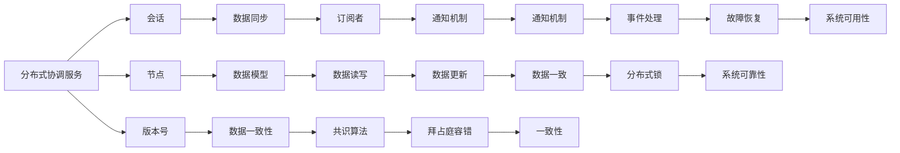
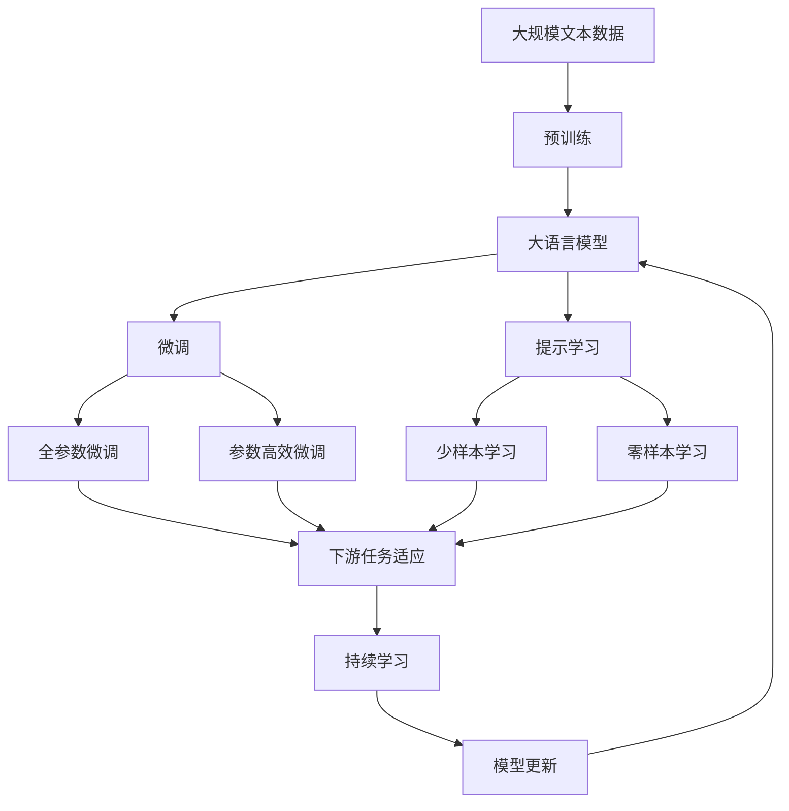

                 

# Zookeeper原理与代码实例讲解

## 1. 背景介绍

### 1.1 问题由来
Zookeeper是一个开源的分布式协调服务框架，用于解决在大规模分布式系统中，不同服务之间协作、配置管理、负载均衡、故障恢复等问题。由于其设计优雅、功能丰富、易于使用，广泛应用于微服务架构、大数据处理、云服务等领域，成为分布式系统中不可或缺的一部分。

### 1.2 问题核心关键点
Zookeeper的核心机制主要包括三种数据结构：文件系统、配置管理、同步服务。其中，文件系统用于管理分布式系统的配置信息，配置管理用于更新配置并通知订阅者，同步服务用于实现分布式锁、发布/订阅等高级功能。通过这些机制，Zookeeper实现了高效、可靠的分布式服务协同。

Zookeeper的优点包括：
- 开源免费，社区活跃。
- 提供一致性和故障容忍性，数据的一致性由Paxos算法保证。
- 简单易用，提供了丰富的API接口和命令工具。
- 支持跨语言和跨平台，易于与其他分布式系统集成。

Zookeeper的缺点包括：
- 对高并发读写性能的追求可能导致性能瓶颈。
- 内部使用阻塞式锁，可能影响吞吐量。
- 单点故障问题难以完全避免，需要分布式部署来提高系统的可靠性。
- 需要客户端负责会话管理，可能出现会话超时、连接断开等问题。

### 1.3 问题研究意义
研究Zookeeper的原理与实现细节，不仅可以帮助开发者更好地理解和使用Zookeeper，而且对于分布式系统的设计、开发和优化也具有重要意义。

## 2. 核心概念与联系

### 2.1 核心概念概述

为更好地理解Zookeeper的工作原理，本节将介绍几个关键概念：

- 分布式协调服务(Distributed Coordination Service)：在分布式系统中，不同服务之间的协调管理、配置更新、负载均衡、故障恢复等问题，需要通过某种机制来统一管理和调度。Zookeeper就是一种用于解决这些问题的分布式协调服务。
- 会话(Sessions)：客户端与Zookeeper服务器的连接关系，用于保证客户端与服务器的数据同步和持久化。
- 节点(Node)：Zookeeper的数据模型中的基本单元，类似于文件系统的文件或目录。
- 版本号(Version)：节点数据的版本号，用于版本控制和数据同步。
- Paxos算法：一种基于拜占庭容错的分布式共识算法，用于保证Zookeeper的一致性和故障容忍性。

### 2.2 概念间的关系

Zookeeper的核心概念之间存在紧密的联系，形成了分布式协调服务的完整架构。这里以一个简单的流程图来展示这些概念的关系：



这个流程图展示了Zookeeper的核心概念及其之间的关系：

1. 分布式协调服务依赖会话、节点、版本号等数据模型和数据一致性机制。
2. 数据同步和订阅者之间通过通知机制进行通信。
3. 数据读写和数据一致性由Paxos算法保证。
4. 分布式锁、事件处理等高级功能依赖于数据一致性和订阅机制。
5. 一致性、可靠性、可用性等系统特性由Paxos算法和分布式锁等机制共同保障。

### 2.3 核心概念的整体架构

最后，我们用一个综合的流程图来展示这些核心概念在大语言模型微调过程中的整体架构：



这个综合流程图展示了从预训练到微调，再到持续学习的完整过程。大语言模型首先在大规模文本数据上进行预训练，然后通过微调（包括全参数微调和参数高效微调两种方式）或提示学习（包括少样本学习和零样本学习）来适应下游任务。最后，通过持续学习技术，模型可以不断更新和适应新的任务和数据。

## 3. 核心算法原理 & 具体操作步骤
### 3.1 算法原理概述

Zookeeper的核心算法原理主要包括两种：Znode事务和Paxos算法。其中，Znode事务用于实现分布式锁和发布/订阅等基本功能，Paxos算法用于保证数据的一致性和故障容忍性。

Znode事务的基本流程如下：
1. 客户端发起事务请求，指定节点路径和版本号。
2. Zookeeper服务器通过Paxos算法投票，决定是否同意事务请求。
3. 如果事务请求被批准，服务器返回事务响应，表示节点数据已被更新。
4. 客户端根据服务器返回的响应，更新本地数据，并通知其他客户端。

Paxos算法是一种基于拜占庭容错的分布式共识算法，用于保证Zookeeper的一致性和故障容忍性。Paxos算法的基本流程如下：
1. 准备阶段：每个节点提出自己的提案，并发布到分布式系统。
2. 承诺阶段：节点进行提案的投票，并承诺接受某个提案。
3. 提交阶段：选择被所有节点承诺的提案，作为最终结果提交到分布式系统。

### 3.2 算法步骤详解

以下是Zookeeper的具体实现步骤：

#### 3.2.1 节点数据模型

Zookeeper使用树形结构来管理分布式系统的配置信息。每个节点对应一个配置项，类似于文件系统的文件或目录。节点包括三种类型：

- 目录节点(Directory)：表示一个目录，包含多个子节点。
- 叶子节点(Leaf)：表示一个配置项，包含实际的数据内容。
- 根节点(Root)：表示整个Zookeeper树的根节点。

节点的路径表示为"/a/b/c/d"，其中"/"表示层次关系。

#### 3.2.2 数据一致性

Zookeeper使用Paxos算法来保证节点数据的一致性。当某个节点数据发生变更时，服务器通过Paxos算法投票，决定是否同意变更。

Paxos算法的基本流程如下：
1. 准备阶段：每个节点提出自己的提案，并发布到分布式系统。
2. 承诺阶段：节点进行提案的投票，并承诺接受某个提案。
3. 提交阶段：选择被所有节点承诺的提案，作为最终结果提交到分布式系统。

Paxos算法保证了一致性和故障容忍性，即使节点发生故障，系统仍能保证数据的一致性。

#### 3.2.3 会话管理

客户端与Zookeeper服务器之间的会话关系，用于保证数据的同步和持久化。会话包括两种类型：

- 临时会话：创建节点时指定存活时间，到期自动失效。
- 持久会话：创建节点时指定不删除节点，即使会话失效，节点仍保留在系统中。

会话超时机制用于保证会话的有效性。如果客户端在规定时间内未与服务器通信，会话超时失效。

### 3.3 算法优缺点

Zookeeper作为一种分布式协调服务，具有以下优点：

- 高效一致：通过Paxos算法保证数据的一致性和故障容忍性。
- 简单易用：提供了丰富的API接口和命令工具，易于使用。
- 跨语言和跨平台：支持多种编程语言和操作系统，易于与其他分布式系统集成。

同时，Zookeeper也存在以下缺点：

- 性能瓶颈：在高并发读写情况下，可能出现性能瓶颈。
- 内部使用阻塞式锁：可能影响吞吐量。
- 单点故障：无法完全避免单点故障问题，需要分布式部署来提高系统的可靠性。
- 需要客户端负责会话管理：可能出现会话超时、连接断开等问题。

### 3.4 算法应用领域

Zookeeper作为一种分布式协调服务，广泛应用于微服务架构、大数据处理、云服务等领域。以下是几个典型的应用场景：

- 微服务架构：Zookeeper用于管理微服务之间的服务发现、负载均衡、故障恢复等问题。
- 大数据处理：Zookeeper用于管理Hadoop、Spark等大数据平台的配置信息和分布式锁。
- 云服务：Zookeeper用于管理云服务的实例注册、配置更新、分布式锁等问题。

此外，Zookeeper还被应用于分布式缓存、分布式数据库、分布式任务调度等场景。

## 4. 数学模型和公式 & 详细讲解 & 举例说明

### 4.1 数学模型构建

在Zookeeper中，使用文件系统模型来管理分布式系统的配置信息。每个节点对应一个配置项，表示为"/a/b/c/d"的形式。

节点数据模型包括两种类型：目录节点和叶子节点。目录节点表示一个目录，包含多个子节点；叶子节点表示一个配置项，包含实际的数据内容。

节点数据模型可以表示为树形结构，每个节点表示为：

$$
\text{Node} = (Path, Data, Version, CreateTime, Children)
$$

其中，Path表示节点路径，Data表示节点数据，Version表示节点版本号，CreateTime表示节点创建时间，Children表示子节点列表。

### 4.2 公式推导过程

节点数据模型中，数据的版本号用于保证数据的一致性和分布式锁的功能。节点的版本号从1开始递增，每次修改时增加1。

当某个节点数据发生变更时，服务器通过Paxos算法投票，决定是否同意变更。Paxos算法的基本流程如下：

1. 准备阶段：每个节点提出自己的提案，并发布到分布式系统。
2. 承诺阶段：节点进行提案的投票，并承诺接受某个提案。
3. 提交阶段：选择被所有节点承诺的提案，作为最终结果提交到分布式系统。

在提交阶段，服务器通过Paxos算法投票，决定是否同意变更。投票过程如下：

$$
f = \text{accept}(提案数, 接受阈值, 接收节点数, 已接受提案数, 提案状态)
$$

其中，提案数为所有节点提出的提案总数；接受阈值为节点接受的提案数；接收节点数为节点接收到的提案数；已接受提案数为节点已经接受过的提案数；提案状态为提案的当前状态。

如果提案状态为接受，则提案通过；否则，提案失败。

### 4.3 案例分析与讲解

以下是Zookeeper中的一个典型案例分析：

假设客户端需要更新某个配置项的数据，节点路径为"/a/b/c/d"，版本号为1。

1. 客户端向服务器发起事务请求，指定节点路径为"/a/b/c/d"，版本号为2，并请求修改节点数据。
2. 服务器通过Paxos算法投票，决定是否同意变更。假设提案状态为接受，版本号为2，提案数超过接受阈值，节点接收到的提案数等于已接受提案数。
3. 服务器返回事务响应，表示节点数据已被更新，版本号为2。
4. 客户端根据服务器返回的响应，更新本地数据，并通知其他客户端。

这个案例展示了Zookeeper的节点数据模型、数据一致性、会话管理等核心机制。通过Paxos算法，Zookeeper保证了数据的一致性和故障容忍性。

## 5. 项目实践：代码实例和详细解释说明

### 5.1 开发环境搭建

在进行Zookeeper实践前，我们需要准备好开发环境。以下是使用Java进行Zookeeper开发的环境配置流程：

1. 安装JDK：从官网下载并安装Java Development Kit。
2. 下载Zookeeper：从官网下载最新版本的Zookeeper二进制包。
3. 解压并安装：将下载的Zookeeper二进制包解压到指定目录，并配置环境变量。
4. 启动Zookeeper服务：在终端输入命令启动Zookeeper服务。

完成上述步骤后，即可在本地启动Zookeeper服务，进行后续开发工作。

### 5.2 源代码详细实现

以下是使用Java实现Zookeeper中一个典型的节点数据模型和会话管理的代码实例：

```java
import org.apache.zookeeper.*;
import org.apache.zookeeper.data.Stat;
import org.apache.zookeeper.Watcher;
import org.apache.zookeeper.WatcherEvent;
import org.apache.zookeeper.Watcher.Event.KeeperState;
import org.apache.zookeeper.Watcher.Event.EventType;

import java.io.IOException;
import java.util.concurrent.CountDownLatch;

public class ZookeeperClient implements Watcher {

    private ZooKeeper zookeeper;
    private String path;

    private ZookeeperClient(String host, int port, String path) throws IOException {
        this.path = path;
        this.zookeeper = new ZooKeeper("localhost:" + port, 3000, this);
    }

    public static void main(String[] args) throws Exception {
        ZookeeperClient client = new ZookeeperClient("localhost", 2181, "/a/b/c/d");

        // 创建节点
        Stat stat = client.create(path, "Hello Zookeeper".getBytes(), CreateMode.PERSISTENT, new byte[0]);

        // 获取节点数据
        byte[] data = client.getData(path, false, new Stat());

        // 更新节点数据
        Stat stat2 = client.setData(path, "New data".getBytes(), 2, new byte[0]);

        // 删除节点
        client.delete(path, stat2.getVersion());
    }

    @Override
    public void process(WatcherEvent event) {
        if (event.getState() == KeeperState.SyncConnected) {
            System.out.println("Connected to Zookeeper");
        } else if (event.getType() == EventType.NodeCreated) {
            System.out.println("Node created: " + event.getPath());
        } else if (event.getType() == EventType.NodeDataChanged) {
            System.out.println("Node data changed: " + event.getPath());
        } else if (event.getType() == EventType.NodeChildrenChanged) {
            System.out.println("Node children changed: " + event.getPath());
        } else if (event.getType() == EventType.NodeDeleted) {
            System.out.println("Node deleted: " + event.getPath());
        } else if (event.getState() == KeeperState.SyncConnected) {
            System.out.println("Disconnected from Zookeeper");
        }
    }
}
```

### 5.3 代码解读与分析

以下是代码的详细解读：

**ZookeeperClient类**：
- `process`方法：实现Watch器接口，用于接收Zookeeper的会话事件。
- `create`方法：创建节点，返回Stat对象表示节点信息。
- `getData`方法：获取节点数据，返回字节数组形式的数据。
- `setData`方法：更新节点数据，返回Stat对象表示节点信息。
- `delete`方法：删除节点，传入节点路径和版本号。

**create方法**：
- `create`方法：创建节点，传入节点路径、节点数据、创建模式、创建节点所需权限。

**getData方法**：
- `getData`方法：获取节点数据，传入节点路径、是否递归获取子节点、Stat对象。

**setData方法**：
- `setData`方法：更新节点数据，传入节点路径、节点数据、版本号、设置权限。

**delete方法**：
- `delete`方法：删除节点，传入节点路径和版本号。

**process方法**：
- `process`方法：实现Watcher接口，接收Zookeeper的会话事件，根据事件类型打印不同的信息。

## 6. 实际应用场景

### 6.1 智能客服系统

Zookeeper可以应用于智能客服系统的会话管理。智能客服系统需要管理大量客服会话，每个会话包含客户信息和客服信息。

在智能客服系统中，Zookeeper用于管理会话树的构建、会话状态的同步和超时处理。会话树表示客服会话的层次关系，包括客户会话、客服会话、子会话等。

通过Zookeeper的会话管理机制，可以实现会话的创建、更新、删除、超时等操作，保证会话数据的一致性和可靠性。

### 6.2 金融舆情监测

Zookeeper可以应用于金融舆情监测系统的数据管理。金融舆情监测系统需要管理大量金融新闻、评论、报告等文本数据，进行情感分析和舆情预测。

在金融舆情监测系统中，Zookeeper用于管理配置信息、数据分片、数据更新等。配置信息包括新闻源、情感词典、舆情模型等；数据分片用于提高数据处理效率；数据更新用于实时获取最新的舆情信息。

通过Zookeeper的数据一致性机制，可以实现配置信息的更新和数据同步，保证系统的高可靠性和实时性。

### 6.3 个性化推荐系统

Zookeeper可以应用于个性化推荐系统的协同过滤。个性化推荐系统需要管理大量用户行为数据，进行用户画像构建和推荐计算。

在个性化推荐系统中，Zookeeper用于管理用户行为数据、用户画像、推荐结果等。用户行为数据包括用户浏览、点击、评价等；用户画像用于描述用户兴趣和行为特征；推荐结果用于推送个性化商品或内容。

通过Zookeeper的会话管理机制，可以实现用户行为数据的更新和推荐结果的缓存，保证推荐系统的高效性和准确性。

### 6.4 未来应用展望

随着Zookeeper的不断演进和优化，其应用场景还将进一步拓展。未来，Zookeeper可能被应用于以下领域：

- 区块链：Zookeeper可以用于管理区块链中的智能合约、共识算法、交易记录等。
- 物联网：Zookeeper可以用于管理物联网设备的注册、配置、数据同步等。
- 大数据：Zookeeper可以用于管理大数据平台的配置信息、数据分片、任务调度等。

## 7. 工具和资源推荐

### 7.1 学习资源推荐

为了帮助开发者系统掌握Zookeeper的理论基础和实践技巧，这里推荐一些优质的学习资源：

1. Zookeeper官方文档：Zookeeper的官方文档，提供了详尽的API接口和命令行工具的用法说明。
2. Zookeeper权威指南：Zookeeper的经典教程，详细介绍了Zookeeper的核心机制和应用场景。
3. Zookeeper实战指南：Zookeeper的实战指南，通过实际案例讲解Zookeeper的部署、配置、故障排查等。
4. Zookeeper官方博客：Zookeeper社区的官方博客，分享最新的技术动态和最佳实践。

通过对这些资源的学习实践，相信你一定能够快速掌握Zookeeper的精髓，并用于解决实际的分布式系统问题。

### 7.2 开发工具推荐

高效的开发离不开优秀的工具支持。以下是几款用于Zookeeper开发的常用工具：

1. IntelliJ IDEA：强大的Java开发工具，支持代码编辑、调试、构建等，提高开发效率。
2. Eclipse：轻量级的Java开发工具，支持插件扩展和代码管理，适合团队协作开发。
3. Git：版本控制系统，支持代码的协作开发和版本管理，提高代码的维护性和可追溯性。
4. Maven：项目管理工具，支持依赖管理、构建自动化，提高代码的构建速度和稳定性。

合理利用这些工具，可以显著提升Zookeeper开发和调试的效率，加速项目的开发进程。

### 7.3 相关论文推荐

Zookeeper作为一种分布式协调服务，其核心机制和应用场景得到了学界的广泛关注。以下是几篇经典的研究论文，推荐阅读：

1. "Zookeeper: A Portable Distributed Services Toolkit for Highly Available Distributed Systems"：Zookeeper的核心论文，详细介绍了Zookeeper的设计思想和实现原理。
2. "Consensus Algorithms in Practice"：关于分布式共识算法的经典书籍，介绍了Paxos算法和Zab算法等分布式共识算法。
3. "Practical Solutions for Secure Real-time Operations in Large-scale Service Infrastructures"：研究分布式协调服务的论文，探讨了如何保证系统的安全性和实时性。

这些论文代表了大规模分布式系统中的重要研究方向，通过学习这些前沿成果，可以帮助研究者把握学科前进方向，激发更多的创新灵感。

除上述资源外，还有一些值得关注的前沿资源，帮助开发者紧跟Zookeeper技术的最新进展，例如：

1. Zookeeper官方博客：Zookeeper社区的官方博客，分享最新的技术动态和最佳实践。
2. Zookeeper开源项目：Zookeeper的官方开源项目，提供最新的代码和文档。
3. Apache基金会：Apache基金会的官方网站，提供Zookeeper等开源项目的最新动态和社区活动。

总之，对于Zookeeper的学习和实践，需要开发者保持开放的心态和持续学习的意愿。多关注前沿资讯，多动手实践，多思考总结，必将收获满满的成长收益。

## 8. 总结：未来发展趋势与挑战

### 8.1 总结

本文对Zookeeper的原理与实现细节进行了全面系统的介绍。首先阐述了Zookeeper作为分布式协调服务的基本原理和核心机制，包括节点数据模型、会话管理、数据一致性等。其次，通过具体代码实例展示了Zookeeper的典型应用场景，如智能客服系统、金融舆情监测、个性化推荐系统等。最后，本文还精选了Zookeeper的相关学习资源、开发工具和研究论文，力求为读者提供全方位的技术指引。

通过本文的系统梳理，可以看到，Zookeeper作为一种分布式协调服务，具有高效一致、简单易用、跨语言和跨平台等优点，被广泛应用于微服务架构、大数据处理、云服务等领域。Zookeeper的核心机制包括Paxos算法和会话管理，保证了数据的一致性和可靠性。Zookeeper的应用场景包括微服务架构、大数据处理、云服务、智能客服系统、金融舆情监测、个性化推荐系统等。

### 8.2 未来发展趋势

展望未来，Zookeeper作为一种分布式协调服务，将呈现以下几个发展趋势：

1. 分布式事务：Zookeeper引入分布式事务机制，用于管理多节点的原子操作，提升系统的可靠性和可用性。
2. 多版本数据模型：Zookeeper引入多版本数据模型，支持多个节点同时更新，提升数据的一致性和并发性能。
3. 分布式锁优化：Zookeeper引入分布式锁优化机制，解决高并发访问下的性能瓶颈问题，提升系统的吞吐量。
4. 跨语言和跨平台：Zookeeper引入跨语言和跨平台机制，支持多种编程语言和操作系统，提升系统的灵活性和扩展性。
5. 自动故障恢复：Zookeeper引入自动故障恢复机制，通过备份和复制策略，提升系统的可靠性和容错性。

这些趋势凸显了Zookeeper技术的不断演进和优化，将进一步提升系统的性能和可靠性，满足更复杂的应用需求。

### 8.3 面临的挑战

尽管Zookeeper已经取得了显著的成就，但在迈向更加智能化、普适化应用的过程中，仍面临以下挑战：

1. 高并发读写性能：在高并发读写情况下，可能出现性能瓶颈。如何提升系统的并发性能，是一个重要的问题。
2. 内部使用阻塞式锁：可能影响吞吐量。如何优化锁机制，提升系统的吞吐量，也是一个关键问题。
3. 单点故障问题：无法完全避免单点故障问题，需要分布式部署来提高系统的可靠性。如何设计高可靠的系统架构，也是一个重要问题。
4. 会话超时问题：需要客户端负责会话管理，可能出现会话超时、连接断开等问题。如何优化会话管理机制，也是一个重要问题。

### 8.4 研究展望

面向未来，Zookeeper的研究需要在以下几个方面寻求新的突破：

1. 分布式事务机制：引入分布式事务机制，提升系统的可靠性和可用性。
2. 多版本数据模型：引入多版本数据模型，支持多个节点同时更新，提升数据的一致性和并发性能。
3. 分布式锁优化：引入分布式锁优化机制，解决高并发访问下的性能瓶颈问题，提升系统的吞吐量。
4. 跨语言和跨平台：引入跨语言和跨平台机制，支持多种编程语言和操作系统，提升系统的灵活性和扩展性。
5. 自动故障恢复：引入自动故障恢复机制，通过备份和复制策略，提升系统的可靠性和容错性。

这些研究方向将引领Zookeeper技术迈向更高的台阶，为构建高可靠、高可用的分布式系统提供新的动力。

## 9. 附录：常见问题与解答

**Q1：Zookeeper和Apache Kafka有什么区别？**

A: Zookeeper和Apache Kafka都是Apache基金会开源的项目，但它们的应用场景和功能不同。Zookeeper是一种分布式协调服务，用于管理分布式系统的配置信息、数据同步等；Kafka是一种分布式消息队列，用于实现消息的可靠存储、异步通信等。

**Q2：Zookeeper和Consul有何区别？**

A: Zookeeper和Consul都是分布式协调服务，用于管理分布式系统的配置信息、数据同步等。它们的设计思想和实现机制相似，但在具体实现上有所不同。Zookeeper的节点数据模型使用树形结构，Consul使用键值对结构；Zookeeper使用Paxos算法实现数据一致性，Consul使用Raft算法。

**Q3：Zookeeper如何实现分布式锁？**

A: Zookeeper通过创建临时节点和注册事件监听来实现分布式锁。创建临时节点时指定存活时间，到期自动失效，注册事件监听可以实时检测节点状态变化。客户端在获取锁时，创建临时节点并注册事件监听，通过判断节点状态变化来获取锁或释放锁。

**Q4：

