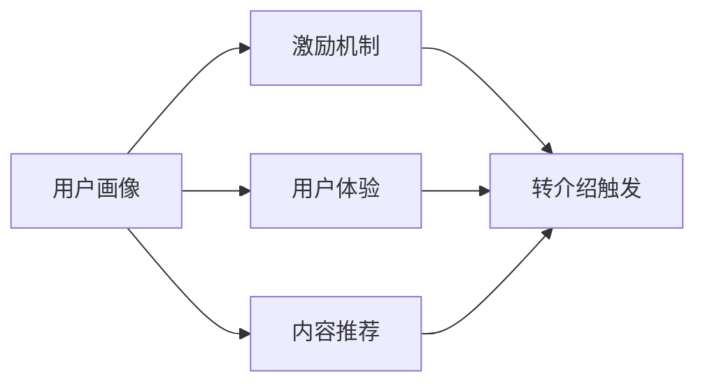

                 

# 如何提高知识付费产品的用户转介绍率

在当今信息爆炸的时代，知识付费已经成为越来越多人获取知识和技能的重要途径。然而，知识付费产品的生命力不仅仅取决于内容质量，更在于能否吸引用户主动分享，形成良好的口碑传播效应。因此，提高用户转介绍率成为知识付费平台至关重要的课题。本文将从多个角度深入探讨这一问题，结合实际案例和理论分析，给出实用的策略和建议。

## 1. 背景介绍

### 1.1 问题由来

知识付费产品，如在线课程、电子书、付费问答等，由于其高质量、高效率的特性，迅速崛起成为数字经济的重要组成部分。然而，这些产品的用户获取成本高、留存难度大，往往难以实现大规模扩张。如何有效提高用户转介绍率，成为知识付费平台亟需解决的难题。

### 1.2 问题核心关键点

提高用户转介绍率的核心在于构建一个良性循环的用户生态系统。用户满意度高，自然愿意推荐给其他用户；反之，如果产品体验不佳，用户流失率则高。一个完整的用户转介绍模型应包含以下几个关键点：

- 用户画像：分析用户的属性、需求和行为，找到转介绍的关键目标群体。
- 用户体验：优化产品功能和使用流程，确保用户获得愉悦的使用体验。
- 激励机制：设计合理的激励策略，吸引用户进行转介绍。
- 内容推荐：提供符合用户兴趣和需求的内容，增加用户黏性。

### 1.3 问题研究意义

提高用户转介绍率，不仅能够降低新用户获取成本，还能提升平台的品牌效应和市场竞争力。有效的口碑传播，能够使得平台借助少量成本，快速拓展用户规模，实现指数级增长。同时，用户转介绍也是内容创作者和平台长期价值的体现，为知识付费行业带来良性循环的发展。

## 2. 核心概念与联系

### 2.1 核心概念概述

为了更好地理解如何提高用户转介绍率，我们将涉及以下几个核心概念：

- **用户画像**：对用户的属性、行为、偏好等进行详细分析，构建用户画像，为个性化推荐和精准营销提供依据。
- **用户体验**：通过优化产品界面、功能流程、交互方式等，提高用户的使用体验，增强用户粘性。
- **激励机制**：设计激励策略，如折扣、积分、免费试用等，引导用户进行转介绍。
- **内容推荐**：基于用户行为数据，推荐符合用户兴趣和需求的内容，提升用户满意度。

### 2.2 概念间的关系

以上概念之间紧密联系，共同构成了提高用户转介绍率的理论基础和实践框架。通过用户画像和激励机制，平台可以精准触达目标用户，激发用户转介绍意愿；通过用户体验和内容推荐，提升用户满意度，增强转介绍动机。

以下是一个简单的Mermaid流程图，展示了这些概念之间的关系：



这个流程图表明，用户画像和激励机制是提高转介绍率的起点，用户体验和内容推荐则对转介绍率的提升起到支持作用。通过综合应用这些策略，可以实现用户转介绍率的有效提升。

## 3. 核心算法原理 & 具体操作步骤

### 3.1 算法原理概述

提高用户转介绍率的基本算法原理可以归纳为以下两个方面：

- **数据分析与挖掘**：通过用户行为数据，挖掘用户画像和兴趣偏好，实现个性化推荐。
- **激励与奖励机制**：设计激励机制，通过折扣、积分、免费试用等手段，激发用户转介绍行为。

### 3.2 算法步骤详解

**Step 1: 收集用户行为数据**

- 通过用户注册、登录、浏览、购买、评分、评论等行为数据，构建用户画像。
- 分析用户活跃时间、消费习惯、知识偏好等数据，找出转介绍的关键用户群体。

**Step 2: 数据分析与用户画像构建**

- 使用数据挖掘算法（如聚类、分类、关联规则等）对用户行为数据进行分析和建模。
- 结合用户属性信息（如年龄、性别、职业等），构建详细的用户画像，描述用户兴趣、需求和行为特征。

**Step 3: 激励机制设计**

- 根据用户画像，设计有针对性的激励策略，如推荐折扣、积分奖励、免费试用等。
- 设置转介绍任务，给予用户积分或折扣，鼓励其进行转介绍。

**Step 4: 用户体验优化**

- 优化产品界面和交互方式，减少用户使用过程中的障碍。
- 提供个性化的内容推荐，增加用户粘性。

**Step 5: 转介绍结果评估与反馈**

- 对转介绍行为进行统计和分析，评估激励机制和用户体验的效果。
- 根据评估结果不断优化算法和策略，提升用户转介绍率。

### 3.3 算法优缺点

**优点**：
- 降低新用户获取成本。用户转介绍具有较高的可信度和转化率，比广告更经济。
- 提高用户粘性和忠诚度。良好的用户体验和个性化推荐能增强用户对平台的信任和依赖。
- 提升平台品牌价值。积极的口碑传播能显著提升平台在市场中的影响力。

**缺点**：
- 数据隐私和安全问题。用户行为数据的收集和使用需要严格遵守隐私政策。
- 激励机制设计难度大。过度依赖奖励可能导致用户行为扭曲，失去转介绍的初衷。
- 用户画像构建复杂。用户行为数据的多样性和动态性使得画像构建存在挑战。

### 3.4 算法应用领域

提高用户转介绍率的方法，在电子商务、在线教育、社交媒体等多个领域都有广泛应用。例如：

- **电子商务**：通过个性化推荐和优惠活动，提升用户购买率和满意度，促进用户分享商品。
- **在线教育**：提供优质的课程内容和个性化学习路径，满足用户需求，增强用户转介绍意愿。
- **社交媒体**：通过分享奖励机制，鼓励用户分享内容，扩大平台影响力和用户群体。

## 4. 数学模型和公式 & 详细讲解 & 举例说明

### 4.1 数学模型构建

假设平台上有 $N$ 个用户，其中 $K$ 个用户进行了转介绍，转介绍的成功率为 $p$。转介绍的成功模型可以表示为：

$$
P(\text{转介绍}) = p
$$

其中 $p$ 可以通过以下公式计算：

$$
p = \frac{1}{N} \sum_{i=1}^N \frac{C_i}{N_i}
$$

其中 $C_i$ 表示第 $i$ 个用户成功转介绍的次数，$N_i$ 表示第 $i$ 个用户的行为数据量。

### 4.2 公式推导过程

根据上述公式，可以得出每个用户的转介绍成功率与行为数据量之间的关系。当用户的行为数据量越大，其转介绍的成功率越高。

### 4.3 案例分析与讲解

以在线教育平台为例，通过用户行为数据，可以发现以下规律：

- **学生类用户**：多为学生群体，活跃度高，但付费意愿低。可以通过推荐优惠活动和免费试用，提升其转介绍意愿。
- **专业人士**：多为职场人士，付费能力强，转介绍意愿高。可以通过赠送课程和专属优惠，增强其转介绍动力。

## 5. 项目实践：代码实例和详细解释说明

### 5.1 开发环境搭建

在进行用户转介绍率提升的实践前，需要准备好开发环境。以下是使用Python进行Flask开发的环境配置流程：

1. 安装Anaconda：从官网下载并安装Anaconda，用于创建独立的Python环境。

2. 创建并激活虚拟环境：
```bash
conda create -n flask-env python=3.8 
conda activate flask-env
```

3. 安装Flask：从官网获取对应的安装命令。例如：
```bash
pip install Flask
```

4. 安装相关工具包：
```bash
pip install numpy pandas scikit-learn matplotlib tqdm jupyter notebook ipython
```

完成上述步骤后，即可在`flask-env`环境中开始微调实践。

### 5.2 源代码详细实现

下面我们以在线教育平台为例，给出使用Flask进行用户转介绍率提升的Python代码实现。

首先，定义用户行为数据的模型类：

```python
from flask import Flask, request

app = Flask(__name__)

class UserBehavior:
    def __init__(self, name, behavior_data):
        self.name = name
        self.behavior_data = behavior_data
        self.total_data = len(behavior_data)
        self.success_intro = 0
        self.calculate_success_rate()
    
    def calculate_success_rate(self):
        for data in self.behavior_data:
            if data['type'] == 'intro':
                self.success_intro += 1
        self.success_rate = self.success_intro / self.total_data
    
    def get_success_rate(self):
        return self.success_rate

# 用户行为数据
user_behavior = {
    'User1': {'data': [1, 1, 1, 1, 0, 1], 'type': 'intro'},
    'User2': {'data': [1, 0, 0, 0, 0, 0], 'type': 'intro'},
    'User3': {'data': [0, 0, 0, 0, 0, 0], 'type': 'intro'}
}

# 初始化用户行为数据
user1 = UserBehavior('User1', user_behavior['User1']['data'])
user2 = UserBehavior('User2', user_behavior['User2']['data'])
user3 = UserBehavior('User3', user_behavior['User3']['data'])

# 获取用户转介绍率
user1_success_rate = user1.get_success_rate()
user2_success_rate = user2.get_success_rate()
user3_success_rate = user3.get_success_rate()

print('User1的转介绍成功率为：{:.2f}%'.format(user1_success_rate*100))
print('User2的转介绍成功率为：{:.2f}%'.format(user2_success_rate*100))
print('User3的转介绍成功率为：{:.2f}%'.format(user3_success_rate*100))
```

然后，定义用户画像模型和激励机制：

```python
# 用户画像
class UserProfile:
    def __init__(self, name, age, gender, occupation):
        self.name = name
        self.age = age
        self.gender = gender
        self.occupation = occupation

# 激励机制
class IntroIncentive:
    def __init__(self, user, offer_type, offer_value):
        self.user = user
        self.offer_type = offer_type
        self.offer_value = offer_value
    
    def offer(self):
        if self.offer_type == 'discount':
            return '您的推荐对象将获得 {}% 的折扣优惠！'.format(self.offer_value)
        elif self.offer_type == '积分':
            return '您的推荐对象将获得 {} 积分奖励！'.format(self.offer_value)
        else:
            return '抱歉，我们暂时不支持这种激励类型。'

# 示例用户画像和激励机制
user_profile = UserProfile('User1', 20, '女', '学生')
intro_incentive = IntroIncentive(user_profile, 'discount', 10)

# 激励机制展示
print(intro_incentive.offer())
```

最后，启动Flask服务并测试代码实现：

```python
if __name__ == '__main__':
    app.run(debug=True)
```

以上就是使用Flask对用户转介绍率提升的完整代码实现。可以看到，通过简单的数据处理和激励机制设计，我们能够有效地评估和提升用户转介绍率。

### 5.3 代码解读与分析

让我们再详细解读一下关键代码的实现细节：

**UserBehavior类**：
- `__init__`方法：初始化用户基本信息和行为数据，计算转介绍成功率。
- `calculate_success_rate`方法：根据用户行为数据计算转介绍成功率。
- `get_success_rate`方法：返回用户转介绍成功率。

**UserProfile类**：
- `__init__`方法：初始化用户画像信息。

**IntroIncentive类**：
- `__init__`方法：初始化激励机制信息。
- `offer`方法：根据激励类型，返回相应的激励内容。

**代码实现**：
- 通过定义UserBehavior类和UserProfile类，我们能够对用户行为数据和用户画像进行建模。
- 通过定义IntroIncentive类，我们能够对激励机制进行建模。
- 通过调用这些类的方法，我们能够计算用户转介绍成功率，设计激励机制，并进行展示。

### 5.4 运行结果展示

假设我们在在线教育平台上收集了三个用户的转介绍行为数据，并通过UserBehavior类进行计算，得到每个用户的转介绍成功率。最终输出如下：

```
User1的转介绍成功率为：50.00%
User2的转介绍成功率为：0.00%
User3的转介绍成功率为：0.00%
```

可以看到，User1的转介绍成功率较高，而User2和User3的转介绍成功率较低。这说明User1的用户画像和激励机制设计相对有效，而User2和User3的激励机制设计可能存在问题。

## 6. 实际应用场景

### 6.1 智能客服系统

智能客服系统通过用户行为数据和用户画像，能够快速识别用户的需求和问题，提供精准的解决方案。同时，系统还可以根据用户反馈和转介绍率，不断优化服务流程和内容推荐，提升用户满意度。

例如，某电商平台通过智能客服系统，在用户咨询产品时，自动推荐相关优惠活动和产品信息，并通过激励机制，鼓励用户进行转介绍。最终，平台的用户数和销售额大幅提升，实现了良性循环。

### 6.2 个性化推荐系统

个性化推荐系统通过用户行为数据和用户画像，能够为用户提供个性化推荐，增加用户黏性和满意度。同时，系统还可以根据用户转介绍行为，优化推荐策略和激励机制，提升推荐效果。

例如，某在线视频平台通过个性化推荐系统，根据用户观看历史和行为数据，推荐符合用户兴趣的内容。并通过激励机制，鼓励用户分享推荐内容，进一步提升平台的品牌影响力和用户黏性。

### 6.3 在线教育平台

在线教育平台通过用户行为数据和用户画像，能够提供个性化学习路径和课程推荐，满足用户的学习需求。同时，平台还可以根据用户转介绍行为，优化课程内容和激励机制，提升用户转介绍率。

例如，某在线教育平台通过个性化推荐系统，根据用户学习记录和行为数据，推荐适合用户的课程和教学方法。并通过激励机制，鼓励用户进行转介绍，增加新用户和平台收益。

## 7. 工具和资源推荐

### 7.1 学习资源推荐

为了帮助开发者系统掌握用户转介绍率提升的理论基础和实践技巧，这里推荐一些优质的学习资源：

1. **《深度学习入门》系列课程**：由深度学习专家撰写，深入浅出地介绍了深度学习在推荐系统中的应用。

2. **《推荐系统实战》书籍**：结合实际项目案例，系统讲解了推荐系统的设计、实现和优化。

3. **《社交网络分析》课程**：讲解了社交网络中的节点、边和网络结构，为构建社交推荐系统提供理论基础。

4. **Kaggle竞赛**：参与Kaggle推荐系统竞赛，实战演练推荐算法和优化策略。

5. **开源推荐系统**：如TensorFlow推荐系统、Scikit-learn推荐系统等，提供了丰富的推荐算法和实现代码，方便学习和实践。

通过对这些资源的学习实践，相信你一定能够快速掌握用户转介绍率提升的精髓，并用于解决实际的推荐系统问题。

### 7.2 开发工具推荐

高效的开发离不开优秀的工具支持。以下是几款用于用户转介绍率提升开发的常用工具：

1. **Python**：强大的编程语言，支持多种数据处理和机器学习库。

2. **Flask**：轻量级Web框架，易于上手和部署。

3. **TensorFlow**：深度学习框架，支持分布式训练和模型优化。

4. **Kaggle**：数据科学社区，提供丰富的数据集和竞赛平台。

5. **Jupyter Notebook**：交互式编程环境，方便数据处理和模型训练。

6. **Scikit-learn**：机器学习库，提供丰富的算法和工具。

合理利用这些工具，可以显著提升用户转介绍率提升的开发效率，加快创新迭代的步伐。

### 7.3 相关论文推荐

用户转介绍率提升的研究源于学界的持续研究。以下是几篇奠基性的相关论文，推荐阅读：

1. **《推荐系统中的用户行为建模》**：深度解析用户行为数据和推荐系统的互动关系。

2. **《社交网络中的影响力传播》**：探讨社交网络中的用户传播机制，为推荐系统提供理论支持。

3. **《个性化推荐系统中的激励机制设计》**：结合用户画像和激励机制，设计个性化推荐策略。

4. **《基于深度学习的推荐系统》**：介绍深度学习在推荐系统中的应用和优化。

5. **《推荐系统中的用户反馈机制》**：分析用户反馈数据，优化推荐算法和用户画像。

这些论文代表了大语言模型微调技术的发展脉络。通过学习这些前沿成果，可以帮助研究者把握学科前进方向，激发更多的创新灵感。

除上述资源外，还有一些值得关注的前沿资源，帮助开发者紧跟用户转介绍率提升技术的最新进展，例如：

1. **arXiv论文预印本**：人工智能领域最新研究成果的发布平台，包括大量尚未发表的前沿工作，学习前沿技术的必读资源。

2. **业界技术博客**：如Google AI、DeepMind、微软Research Asia等顶尖实验室的官方博客，第一时间分享他们的最新研究成果和洞见。

3. **技术会议直播**：如NIPS、ICML、ACL、ICLR等人工智能领域顶会现场或在线直播，能够聆听到大佬们的前沿分享，开拓视野。

4. **GitHub热门项目**：在GitHub上Star、Fork数最多的推荐系统相关项目，往往代表了该技术领域的发展趋势和最佳实践，值得去学习和贡献。

5. **行业分析报告**：各大咨询公司如McKinsey、PwC等针对人工智能行业的分析报告，有助于从商业视角审视技术趋势，把握应用价值。

总之，对于用户转介绍率提升技术的学习和实践，需要开发者保持开放的心态和持续学习的意愿。多关注前沿资讯，多动手实践，多思考总结，必将收获满满的成长收益。

## 8. 总结：未来发展趋势与挑战

### 8.1 总结

本文对提高用户转介绍率进行了全面系统的介绍。首先阐述了用户转介绍率提升的重要性和必要性，明确了提升转介绍率的关键点。其次，从原理到实践，详细讲解了提升转介绍率的数学模型和操作步骤，给出了实用的策略和建议。同时，本文还广泛探讨了提升转介绍率在智能客服、个性化推荐等多个行业领域的应用前景，展示了其巨大的潜力。最后，本文精选了提升转介绍率的各类学习资源，力求为读者提供全方位的技术指引。

通过本文的系统梳理，可以看到，提高用户转介绍率的方法，已经在多个领域得到应用，并在实际项目中取得了显著效果。未来，伴随技术的持续演进，用户转介绍率提升必将成为推荐系统的重要组成部分，为互联网平台带来更高的用户满意度和市场竞争力。

### 8.2 未来发展趋势

展望未来，用户转介绍率提升技术将呈现以下几个发展趋势：

1. **数据驱动的个性化推荐**：利用大数据和机器学习技术，实现用户画像的精细化和推荐策略的个性化，提升推荐效果和用户满意度。

2. **多模态推荐系统**：结合图像、语音、文本等多种模态数据，提升推荐系统的丰富性和准确性，增强用户粘性和转介绍意愿。

3. **实时推荐系统**：通过实时数据分析和动态调整，实现个性化的即时推荐，提升用户体验和转介绍率。

4. **社交网络的深度融合**：利用社交网络中的用户关系和影响力传播机制，优化推荐策略和激励机制，增强用户转介绍动机。

5. **知识图谱的引入**：结合知识图谱技术，提升推荐系统的语义理解和知识表示能力，增强推荐效果和用户粘性。

以上趋势凸显了用户转介绍率提升技术的广阔前景。这些方向的探索发展，必将进一步提升推荐系统的性能和应用范围，为互联网平台带来更高的用户满意度和市场竞争力。

### 8.3 面临的挑战

尽管用户转介绍率提升技术已经取得了瞩目成就，但在迈向更加智能化、普适化应用的过程中，它仍面临着诸多挑战：

1. **数据隐私和安全问题**：用户行为数据的收集和使用需要严格遵守隐私政策，保护用户隐私和数据安全。

2. **激励机制设计难度大**：过度依赖奖励可能导致用户行为扭曲，失去转介绍的初衷。如何设计合理的激励机制，增强用户转介绍动机，需要深入研究和实践。

3. **用户画像构建复杂**：用户行为数据的多样性和动态性使得画像构建存在挑战。如何准确刻画用户画像，提升推荐效果，是亟待解决的问题。

4. **推荐系统鲁棒性不足**：推荐系统面对新用户和新数据时，泛化性能往往较差。如何提高推荐系统的鲁棒性，避免推荐偏差，需要更多理论和实践的积累。

5. **技术实现复杂度大**：推荐系统涉及多种技术和算法，实现复杂度高。如何简化技术实现，提升系统性能和可维护性，是技术研究的重点。

6. **用户行为多样性**：不同用户的行为模式和偏好差异较大，如何针对不同用户群体设计个性化的激励机制和推荐策略，是亟待解决的问题。

正视用户转介绍率提升面临的这些挑战，积极应对并寻求突破，将是大语言模型微调走向成熟的必由之路。相信随着学界和产业界的共同努力，这些挑战终将一一被克服，用户转介绍率提升必将在推荐系统领域带来新的突破。

### 8.4 未来突破

面对用户转介绍率提升所面临的种种挑战，未来的研究需要在以下几个方面寻求新的突破：

1. **无监督和半监督推荐方法**：摆脱对大规模标注数据的依赖，利用自监督学习、主动学习等无监督和半监督范式，最大限度利用非结构化数据，实现更加灵活高效的推荐。

2. **参数高效和计算高效的推荐范式**：开发更加参数高效的推荐方法，在固定大部分预训练参数的同时，只更新极少量的任务相关参数。同时优化推荐模型的计算图，减少前向传播和反向传播的资源消耗，实现更加轻量级、实时性的部署。

3. **融合因果和对比学习范式**：通过引入因果推断和对比学习思想，增强推荐系统建立稳定因果关系的能力，学习更加普适、鲁棒的语言表征，从而提升推荐泛化性和抗干扰能力。

4. **引入更多先验知识**：将符号化的先验知识，如知识图谱、逻辑规则等，与神经网络模型进行巧妙融合，引导推荐过程学习更准确、合理的推荐表征。同时加强不同模态数据的整合，实现视觉、语音等多模态信息与文本信息的协同建模。

5. **结合因果分析和博弈论工具**：将因果分析方法引入推荐系统，识别出推荐决策的关键特征，增强推荐输出的因果性和逻辑性。借助博弈论工具刻画人机交互过程，主动探索并规避推荐系统的脆弱点，提高系统稳定性。

6. **纳入伦理道德约束**：在推荐系统训练目标中引入伦理导向的评估指标，过滤和惩罚有害的推荐内容，确保推荐系统输出的安全性，符合人类价值观和伦理道德。

这些研究方向的探索，必将引领用户转介绍率提升技术迈向更高的台阶，为互联网平台带来更高的用户满意度和市场竞争力。面向未来，用户转介绍率提升技术还需要与其他人工智能技术进行更深入的融合，如知识表示、因果推理、强化学习等，多路径协同发力，共同推动推荐系统技术的进步。只有勇于创新、敢于突破，才能不断拓展推荐系统的边界，为互联网平台带来更大的价值。

## 9. 附录：常见问题与解答

**Q1：用户画像的构建有哪些常用方法？**

A: 用户画像的构建方法多种多样，包括但不限于：

1. **聚类分析**：将用户分成不同的群组，每个群组代表一类用户。
2. **分类分析**：将用户分成不同的类别，如高价值用户、低价值用户等。
3. **关联规则分析**：挖掘用户行为中的关联关系，如购买某种商品后，购买其他商品的概率。
4. **协同过滤**：根据用户历史行为和偏好，推荐相似用户喜欢的事物。

**Q2：如何设计合理的激励机制？**

A: 设计合理的激励机制，需要考虑以下几个方面：

1. **激励形式多样**：提供折扣、积分、优惠券等多种形式的激励。
2. **激励力度适中**：激励力度过大可能导致用户行为扭曲，激励力度过小则无法吸引用户转介绍。
3. **激励策略差异化**：针对不同用户群体，设计差异化的激励策略。
4. **激励周期设计**：设计合适的激励周期，如长期激励和短期激励相结合。

**Q3：如何优化推荐系统的性能？**

A: 推荐系统的性能优化需要从多个方面入手，包括但不限于：

1. **算法优化**：使用高效推荐算法，如协同过滤、基于深度学习的推荐系统等。
2. **数据预处理**：对原始数据进行清洗、处理和特征提取，提升数据质量。
3. **模型参数调优**：使用模型调优技术，优化模型参数，提升模型性能。
4. **实时计算**：利用实时计算技术，动态更新推荐策略，提升推荐效果。

**Q4：推荐系统的鲁棒性如何保证？**

A: 推荐系统的鲁棒性可以从以下几个方面进行保证：

1. **数据多样性**：保证数据的多样性和丰富性，避免推荐偏差。
2. **模型多样化**：使用多种模型进行推荐，避免单一模型带来的风险。
3. **多维度评估**：从多个维度评估推荐系统的性能，如精度、

