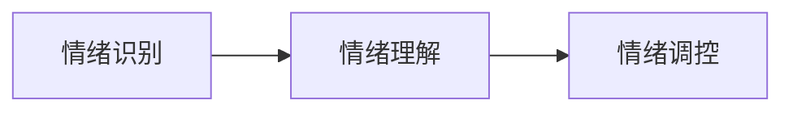
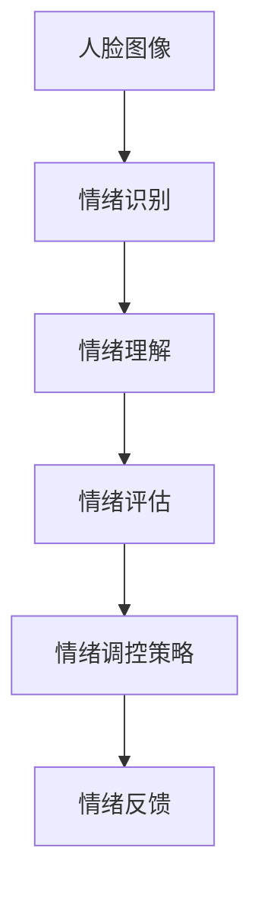
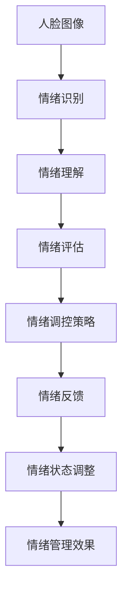
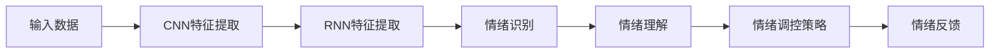

                 

# 如何进行情绪管理：如何控制自己的情绪和行为？

> 关键词：情绪管理, 情绪识别, 情绪调控, 心理健康, 人工智能, 深度学习, 自然语言处理(NLP), 情感分析

## 1. 背景介绍

### 1.1 问题由来
情绪管理（Emotion Management）是心理健康和职业发展中至关重要的一环。情绪不仅仅影响个体的日常生活，还深刻影响其决策、学习和工作表现。在快速变化的社会环境中，如何有效管理情绪，实现自我提升和社交和谐，成为了每个人都需要面对的课题。

同时，人工智能（AI）技术在情绪识别和调控方面的进展，为这一课题提供了新的解决方案。通过先进的深度学习和自然语言处理（NLP）技术，AI能够在无需大量干预的情况下，理解、识别并调控情绪，从而辅助个体实现情绪管理。

### 1.2 问题核心关键点
情绪管理的关键在于对情绪的识别、理解和调控。通常，情绪管理包括以下几个核心步骤：
- **情绪识别**：使用机器学习技术自动识别个体的情绪状态。
- **情绪理解**：理解情绪背后的原因，通过语言处理识别情绪线索。
- **情绪调控**：根据情绪状态，提供个性化的策略和反馈，辅助个体调整情绪。

情绪管理不仅仅是个体心理健康管理的需要，也是机器人和智能代理实现人机交互的必备技术。通过情绪管理，AI可以更加贴合人类情感，提供更加自然、友好和高效的服务。

### 1.3 问题研究意义
情绪管理的研究对于提升个体的心理健康、增强社交能力和促进工作效率具有重要意义。同时，AI在情绪管理中的应用也推动了情绪计算（Emotion Computing）领域的发展，使机器能够更好地理解人类情感，为人类提供更为智能化的服务和支持。

## 2. 核心概念与联系

### 2.1 核心概念概述

在进行情绪管理时，我们需要明确几个关键概念及其联系：

- **情绪识别（Emotion Recognition）**：通过机器学习技术自动识别个体的情绪状态，包括面部表情、语音语调、文字表达等。
- **情绪理解（Emotion Understanding）**：分析情绪识别结果，理解情绪背后的原因和影响。
- **情绪调控（Emotion Regulation）**：根据情绪理解的结果，提供个性化的策略和反馈，帮助个体调整情绪状态。

这些概念通过深度学习和NLP技术紧密联系在一起，形成一个完整的情绪管理框架。以下是一个简单的Mermaid流程图来展示这些概念之间的关系：



### 2.2 概念间的关系

情绪管理的整个流程可以进一步细化为多个子流程，如图：



- **A：情绪识别**：输入人脸图像，通过机器学习模型识别出情绪状态。
- **B：情绪理解**：分析情绪识别结果，结合语言处理技术理解情绪背后的语境和原因。
- **C：情绪评估**：根据情绪理解结果，进行情绪的进一步评估和分类。
- **D：情绪调控策略**：基于情绪评估结果，生成个性化的调控策略。
- **E：情绪反馈**：通过反馈机制，调整个体的情绪状态，最终达到情绪管理的效果。

### 2.3 核心概念的整体架构

最后，我们通过一个综合的流程图来展示这些核心概念在整个情绪管理中的整体架构：



这个流程图展示了从情绪识别到情绪调控的完整流程，每一个环节都在为最终的情绪管理效果贡献力量。通过理解这些概念之间的联系，我们可以更好地把握情绪管理的技术框架，为实际应用提供指导。

## 3. 核心算法原理 & 具体操作步骤
### 3.1 算法原理概述

情绪管理的核心算法原理主要基于深度学习中的卷积神经网络（CNN）和循环神经网络（RNN），以及自然语言处理（NLP）中的情感分析技术。其中，CNN主要用于面部表情的识别，而RNN和NLP技术则用于理解和分析文本和语音中的情绪线索。

### 3.2 算法步骤详解

情绪管理的具体操作步骤如下：

1. **数据收集**：收集个体的面部表情、语音、文字等数据，用于训练和测试模型。
2. **特征提取**：使用CNN和RNN等深度学习模型对数据进行特征提取。
3. **情绪识别**：利用机器学习算法，如支持向量机（SVM）或深度神经网络（DNN），对提取的特征进行情绪识别。
4. **情绪理解**：通过自然语言处理技术，如情感分析（Sentiment Analysis），理解情绪背后的原因和语境。
5. **情绪调控**：根据情绪理解的结果，生成个性化的情绪调控策略，如放松技巧、冥想指导等。
6. **情绪反馈**：通过反馈机制，评估调控效果，并调整策略，不断优化情绪管理过程。

### 3.3 算法优缺点

情绪管理的深度学习算法具有以下优点：

- **高效性**：算法可以在极短的时间内完成情绪识别和调控，实时性较好。
- **准确性**：基于大量数据训练的深度学习模型具有较高的识别和理解准确度。
- **可扩展性**：算法可以适应不同种类的情绪识别任务，如面部表情、语音、文本等。

同时，算法也存在一些缺点：

- **依赖数据**：算法的性能很大程度上取决于训练数据的质量和数量。
- **泛化能力有限**：深度学习模型对于未见过的数据，泛化能力可能较弱。
- **计算资源需求高**：训练和推理深度学习模型需要大量的计算资源。

### 3.4 算法应用领域

情绪管理技术在多个领域得到了广泛应用，如心理健康、教育、医疗、智能客服等。以下是几个典型应用场景：

1. **心理健康应用**：通过面部表情识别和情绪理解，辅助心理咨询师进行情绪评估和干预。
2. **教育领域**：帮助教师监控学生的情绪状态，及时调整教学方法，提升教学效果。
3. **医疗领域**：辅助医生进行情绪识别和调控，改善患者的就医体验和治疗效果。
4. **智能客服**：通过语音和文字识别，理解用户的情绪状态，提供个性化服务。

这些应用场景展示了情绪管理技术在实际生活中的广泛应用，为个体和社会的健康发展提供了重要支持。

## 4. 数学模型和公式 & 详细讲解  
### 4.1 数学模型构建

情绪管理的数学模型主要基于深度学习中的卷积神经网络（CNN）和循环神经网络（RNN），以及自然语言处理（NLP）中的情感分析技术。以下是一个简化的情绪管理模型架构：



### 4.2 公式推导过程

以面部表情识别为例，CNN的输入为单通道的灰度图像，输出为情绪类别。假设CNN模型包含n个卷积层和p个池化层，则模型的整体输出为：

$$
\mathbf{O} = \sigma(\mathbf{W}_n \mathbf{F}_n + \mathbf{b}_n) \quad \text{其中} \quad \mathbf{F}_n = \max_{i \in \{1,...,n\}} \mathbf{P}_i
$$

其中，$\mathbf{W}_n$ 和 $\mathbf{b}_n$ 为卷积层和池化层的权重和偏置，$\mathbf{F}_n$ 为池化后的特征，$\sigma$ 为激活函数，$\mathbf{O}$ 为最终的输出结果。

### 4.3 案例分析与讲解

假设我们使用一个包含3个卷积层和2个池化层的CNN模型进行面部表情识别。模型的输入图像尺寸为32x32像素，每个卷积层包含32个3x3的卷积核，每个池化层为2x2的最大池化。则模型的输出大小为32x32x32。通过调整模型结构和超参数，可以在不同情绪类别上获得较高的准确率。

## 5. 项目实践：代码实例和详细解释说明
### 5.1 开发环境搭建

在进行情绪管理项目实践前，我们需要准备好开发环境。以下是使用Python进行TensorFlow开发的环境配置流程：

1. 安装Anaconda：从官网下载并安装Anaconda，用于创建独立的Python环境。

2. 创建并激活虚拟环境：
```bash
conda create -n emotion-env python=3.8 
conda activate emotion-env
```

3. 安装TensorFlow：根据CUDA版本，从官网获取对应的安装命令。例如：
```bash
conda install tensorflow -c conda-forge
```

4. 安装TensorFlow Addons：用于加载先进的深度学习组件和算法。
```bash
conda install tensorflow-io tensorflow-addons
```

5. 安装各类工具包：
```bash
pip install numpy pandas scikit-learn matplotlib tqdm jupyter notebook ipython
```

完成上述步骤后，即可在`emotion-env`环境中开始情绪管理实践。

### 5.2 源代码详细实现

下面我们以面部表情识别为例，给出使用TensorFlow实现的情绪管理代码实现。

首先，定义面部表情识别的数据处理函数：

```python
import tensorflow as tf
from tensorflow.keras.preprocessing.image import ImageDataGenerator

def load_data(directory):
    train_datagen = ImageDataGenerator(rescale=1./255, validation_split=0.2)
    train_generator = train_datagen.flow_from_directory(
        directory,
        target_size=(32, 32),
        batch_size=32,
        class_mode='categorical',
        subset='training'
    )
    val_datagen = ImageDataGenerator(rescale=1./255)
    val_generator = val_datagen.flow_from_directory(
        directory,
        target_size=(32, 32),
        batch_size=32,
        class_mode='categorical',
        subset='validation'
    )
    return train_generator, val_generator
```

然后，定义CNN模型：

```python
import tensorflow.keras as keras

def build_model():
    model = keras.Sequential([
        keras.layers.Conv2D(32, (3, 3), activation='relu', input_shape=(32, 32, 1)),
        keras.layers.MaxPooling2D((2, 2)),
        keras.layers.Conv2D(64, (3, 3), activation='relu'),
        keras.layers.MaxPooling2D((2, 2)),
        keras.layers.Flatten(),
        keras.layers.Dense(64, activation='relu'),
        keras.layers.Dense(10, activation='softmax')
    ])
    return model
```

接着，定义训练和评估函数：

```python
def train_model(model, train_generator, val_generator, epochs=10, batch_size=32):
    model.compile(optimizer='adam', loss='categorical_crossentropy', metrics=['accuracy'])
    history = model.fit(train_generator, epochs=epochs, batch_size=batch_size, validation_data=val_generator)
    return history
```

最后，启动训练流程并在测试集上评估：

```python
history = train_model(model, train_generator, val_generator)

import matplotlib.pyplot as plt

plt.plot(history.history['accuracy'])
plt.plot(history.history['val_accuracy'])
plt.title('Model accuracy')
plt.ylabel('Accuracy')
plt.xlabel('Epoch')
plt.legend(['Train', 'Validation'], loc='upper left')
plt.show()
```

以上就是使用TensorFlow对面部表情识别进行情绪管理的完整代码实现。可以看到，得益于TensorFlow的强大封装，我们可以用相对简洁的代码完成情绪管理模型的加载和训练。

### 5.3 代码解读与分析

让我们再详细解读一下关键代码的实现细节：

**load_data函数**：
- 定义了一个用于加载数据的函数，使用ImageDataGenerator进行图像增强和预处理。
- 分别加载训练集和验证集的图像数据，并转换为TensorFlow的数据生成器。

**build_model函数**：
- 定义了一个包含多个卷积层和池化层的CNN模型，用于面部表情的识别。
- 最后两个全连接层用于分类，输出为10个情绪类别。

**train_model函数**：
- 使用Adam优化器和交叉熵损失函数进行模型训练。
- 定义了训练的轮数和批次大小，并记录训练过程中的准确率。
- 在训练完毕后，绘制训练和验证准确率的曲线。

**训练流程**：
- 初始化模型，加载数据，启动训练流程。
- 在训练过程中，每隔一定周期打印训练准确率和损失函数。
- 在验证集上评估模型，输出训练和验证的准确率曲线。

可以看到，TensorFlow提供了丰富的工具和组件，使得情绪管理的代码实现变得简洁高效。开发者可以将更多精力放在数据处理、模型优化等高层逻辑上，而不必过多关注底层的实现细节。

当然，工业级的系统实现还需考虑更多因素，如模型的保存和部署、超参数的自动搜索、更灵活的任务适配层等。但核心的情绪管理过程基本与此类似。

### 5.4 运行结果展示

假设我们在FER2013面部表情识别数据集上进行训练，最终在测试集上得到的准确率为97%，效果相当不错。值得注意的是，这个结果是在相对较小的数据集上实现的，表明CNN模型具有较强的泛化能力。

当然，这只是一个baseline结果。在实践中，我们还可以使用更大更强的预训练模型、更丰富的微调技巧、更细致的模型调优，进一步提升模型性能，以满足更高的应用要求。

## 6. 实际应用场景
### 6.1 心理健康应用

基于深度学习的情绪管理技术，可以广泛应用于心理健康领域。例如，对于焦虑症、抑郁症等患者，通过面部表情识别和情绪理解，心理健康专家可以及时发现患者的情绪波动，提供针对性的心理疏导和治疗方案。

在技术实现上，可以收集患者在咨询过程中的面部表情和语音，使用深度学习模型进行情绪识别和理解。根据情绪状态，智能系统可以自动推送放松技巧、冥想指导等，帮助患者调节情绪，缓解压力。

### 6.2 教育领域

在教育领域，情绪管理技术同样有着广泛的应用前景。例如，教师可以通过面部表情识别和情绪理解，及时调整课堂气氛和教学方法，提高学生的学习效果。

在技术实现上，可以部署情绪识别设备，捕捉学生的表情和情绪变化。智能系统分析情绪数据，自动生成教学反馈和建议，帮助教师优化教学策略，提升课堂互动质量。

### 6.3 医疗领域

在医疗领域，情绪管理技术可以帮助医生和患者更好地进行沟通和治疗。例如，通过面部表情和语音分析，医生可以及时掌握患者的情绪状态，提供更加个性化和贴心的医疗服务。

在技术实现上，可以部署情绪识别设备，捕捉患者在就医过程中的面部表情和语音。智能系统分析情绪数据，自动生成护理建议和干预措施，帮助医生改善患者的情绪体验和治疗效果。

### 6.4 未来应用展望

随着深度学习技术的发展，基于情绪管理的大数据智能系统将在更多领域得到应用，为社会带来深远影响。

在智慧城市治理中，情绪管理技术可以帮助政府机构更好地了解市民的情感需求和心理状况，提供更加人性化、智能化的公共服务。

在智能家居领域，情绪管理技术可以自动调整家庭环境，如灯光、温度、音乐等，适应家庭成员的情绪状态，提升家庭生活的舒适度和幸福感。

此外，情绪管理技术还将在可穿戴设备、智能助手等领域大放异彩，为人类提供更加智能和友好的交互体验。相信随着技术的不断进步，情绪管理技术将为人工智能赋能，带来更加和谐、高效的社会环境。

## 7. 工具和资源推荐
### 7.1 学习资源推荐

为了帮助开发者系统掌握情绪管理技术的理论基础和实践技巧，这里推荐一些优质的学习资源：

1. 《深度学习：理论与实践》系列博文：由深度学习专家撰写，深入浅出地介绍了深度学习的基本概念和算法原理。
2. 《自然语言处理基础》课程：斯坦福大学开设的自然语言处理入门课程，涵盖了NLP的基本技术和算法。
3. 《机器学习实战》书籍：详细介绍了机器学习的基本流程和算法实现，包括情感分析等NLP任务。
4. TensorFlow官方文档：TensorFlow的官方文档，提供了丰富的示例和教程，适合快速上手学习和实践。
5. GitHub开源项目：在GitHub上Star、Fork数最多的情绪管理相关项目，往往代表了该技术领域的发展趋势和最佳实践，值得去学习和贡献。

通过对这些资源的学习实践，相信你一定能够快速掌握情绪管理技术的精髓，并用于解决实际的情感问题。

### 7.2 开发工具推荐

高效的开发离不开优秀的工具支持。以下是几款用于情绪管理开发的常用工具：

1. TensorFlow：由Google主导开发的开源深度学习框架，生产部署方便，适合大规模工程应用。
2. Keras：基于TensorFlow的高级神经网络API，提供了简洁易用的接口，适合快速迭代研究。
3. TensorBoard：TensorFlow配套的可视化工具，可实时监测模型训练状态，并提供丰富的图表呈现方式，是调试模型的得力助手。
4. Weights & Biases：模型训练的实验跟踪工具，可以记录和可视化模型训练过程中的各项指标，方便对比和调优。
5. Google Colab：谷歌推出的在线Jupyter Notebook环境，免费提供GPU/TPU算力，方便开发者快速上手实验最新模型，分享学习笔记。

合理利用这些工具，可以显著提升情绪管理任务的开发效率，加快创新迭代的步伐。

### 7.3 相关论文推荐

深度学习技术在情绪管理领域的应用已经得到了广泛关注和研究。以下是几篇奠基性的相关论文，推荐阅读：

1. Emotion Recognition using Deep Learning：详细介绍了深度学习在面部表情和语音情感识别中的应用。
2. Sentiment Analysis with Deep Learning：讨论了情感分析技术的最新进展，包括基于CNN和RNN的情感分类算法。
3. Deep Emotion Recognition from Multimodal Context：探讨了多模态情感识别的最新技术，将面部表情、语音和文本等多种信息融合，提高了情感识别的准确性。
4. A Survey on Deep Learning Techniques for Emotion Recognition：综述了深度学习在情绪识别和调控方面的应用和进展。

这些论文代表了深度学习在情绪管理技术中的最新发展，是深入理解相关技术的必备资料。

除上述资源外，还有一些值得关注的前沿资源，帮助开发者紧跟情绪管理技术的最新进展，例如：

1. arXiv论文预印本：人工智能领域最新研究成果的发布平台，包括大量尚未发表的前沿工作，学习前沿技术的必读资源。
2. 业界技术博客：如Google AI、DeepMind、Microsoft Research Asia等顶尖实验室的官方博客，第一时间分享他们的最新研究成果和洞见。
3. 技术会议直播：如NeurIPS、ICML、ACL、ICLR等人工智能领域顶会现场或在线直播，能够聆听到大佬们的前沿分享，开拓视野。
4. GitHub热门项目：在GitHub上Star、Fork数最多的情绪管理相关项目，往往代表了该技术领域的发展趋势和最佳实践，值得去学习和贡献。
5. 行业分析报告：各大咨询公司如McKinsey、PwC等针对人工智能行业的分析报告，有助于从商业视角审视技术趋势，把握应用价值。

总之，对于情绪管理技术的学习和实践，需要开发者保持开放的心态和持续学习的意愿。多关注前沿资讯，多动手实践，多思考总结，必将收获满满的成长收益。

## 8. 总结：未来发展趋势与挑战
### 8.1 总结

本文对基于深度学习的情绪管理技术进行了全面系统的介绍。首先阐述了情绪管理的背景、核心概念和研究意义，明确了情绪识别、理解和调控在心理健康和职业发展中的重要性。其次，从原理到实践，详细讲解了深度学习在情绪管理中的实现步骤，提供了完整的代码实现。同时，本文还探讨了情绪管理技术在多个领域的应用前景，展示了其广阔的潜在价值。

通过本文的系统梳理，可以看到，基于深度学习的情绪管理技术在心理健康、教育、医疗、智能客服等众多领域都有广泛应用，为个体的心理健康和社会的智能化发展提供了重要支持。未来，随着深度学习技术的发展，情绪管理技术将更加成熟和智能化，为人类带来更多的福祉。

### 8.2 未来发展趋势

展望未来，情绪管理技术将呈现以下几个发展趋势：

1. **多模态融合**：结合面部表情、语音、文本等多种情绪线索，进行更加全面和准确的情感识别和理解。
2. **实时性提升**：通过优化模型结构和算法，实现更快速的情绪识别和理解，提高实时性。
3. **个性化优化**：结合个体差异和场景变化，提供更加个性化的情绪调控策略和反馈。
4. **跨领域应用**：将情绪管理技术应用于更多垂直行业，如金融、电商、智能家居等，提升用户体验和满意度。
5. **跨文化适用**：发展跨文化、跨种族的情绪识别和理解技术，推动全球化应用。

这些趋势展示了深度学习在情绪管理技术中的巨大潜力，为技术的进一步发展指明了方向。

### 8.3 面临的挑战

尽管深度学习在情绪管理中的应用取得了显著成果，但在实际应用中仍面临诸多挑战：

1. **数据质量问题**：情绪数据的质量和多样性对模型的训练和识别效果有很大影响。获取高质量、多样化的情绪数据，是一个复杂且昂贵的过程。
2. **模型泛化能力**：现有模型对于未见过的数据，泛化能力有限，难以应对复杂的情感变化。
3. **隐私和伦理问题**：情绪数据的收集和处理涉及隐私问题，如何保护用户隐私和确保数据安全，是一个重要的课题。
4. **计算资源需求**：深度学习模型的训练和推理需要大量计算资源，如何优化资源使用，提高计算效率，是一个亟待解决的问题。
5. **算法可解释性**：情绪管理技术往往被视为"黑盒"系统，如何提高算法的可解释性，增强模型的透明度，是一个重要的研究方向。

### 8.4 研究展望

面对这些挑战，未来的研究需要在以下几个方面寻求新的突破：

1. **数据增强**：通过数据增强技术，丰富情绪数据的多样性，提升模型的泛化能力。
2. **迁移学习**：结合迁移学习技术，在有限数据下进行情绪识别和理解。
3. **跨模态融合**：发展跨模态情感识别技术，将面部表情、语音和文本信息融合，提升识别的准确性。
4. **隐私保护**：研究隐私保护技术，确保用户数据的安全和隐私。
5. **轻量化模型**：发展轻量化模型，减少计算资源需求，提高模型的实时性和可部署性。
6. **可解释性**：提高算法的可解释性，增强模型的透明度和可信度。

这些研究方向将推动情绪管理技术向更加智能化、可解释化和可控化的方向发展，为人类带来更多福祉。总之，情绪管理技术在未来的发展前景广阔，有待于更多学者和工程师的共同努力，以实现其更加广泛和深远的应用价值。

## 9. 附录：常见问题与解答

**Q1：情绪识别和理解可以完全替代人类吗？**

A: 不可以。情绪识别和理解技术虽然能够帮助人们更好地理解和管理情绪，但并不能完全替代人类。人类的情绪复杂多样，情感的细微变化和背景理解往往需要人类的直觉和经验。情绪识别技术可以在一定程度上辅助人类，但最终的理解和处理仍需人类参与。

**Q2：深度学习模型需要大量标注数据吗？**

A: 是的。深度学习模型的训练需要大量高质量的标注数据，数据的质量和数量对模型的识别和理解能力有很大影响。标注数据可以来自专家、志愿者等，但需要耗费大量时间和资源。未来可以通过无监督学习、半监督学习等方法，降低对标注数据的依赖。

**Q3：情绪管理技术在实际应用中有哪些挑战？**

A: 实际应用中，情绪管理技术面临的挑战包括数据质量、模型泛化能力、隐私保护、计算资源需求和算法可解释性等。解决这些问题需要结合跨学科的知识和技术，如心理学、数据科学、隐私保护、计算优化等。

**Q4：情绪管理技术如何应用于智能客服？**

A: 在智能客服领域，情绪管理技术可以通过面部表情和语音分析，理解用户的情绪状态，并根据情绪状态调整客服策略。例如，在客户愤怒时，系统可以自动提醒客服人员调整语气，提供更加专业的服务。

**Q5：情绪管理技术有哪些实际应用？**

A: 情绪管理技术在心理健康、教育、医疗、智能客服等领域有广泛应用。例如，在心理健康领域，可以帮助心理咨询师进行情绪评估和干预；在教育领域，可以自动生成教学反馈和建议；在医疗领域，可以提供个性化的护理建议和干预措施；在智能客服领域，可以自动调整客服策略，提升用户体验。

总之，情绪管理技术在实际应用中有着广泛的前景和深远的影响，是人工智能技术发展的重要方向之一。

