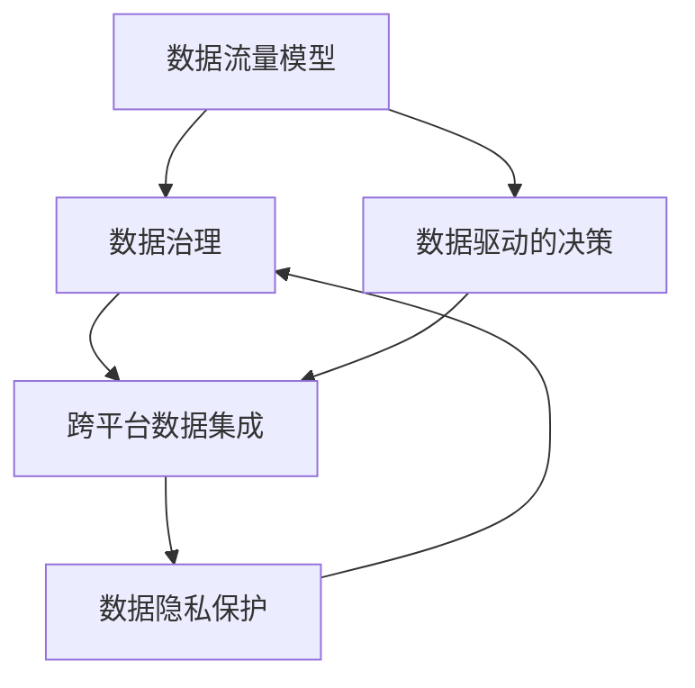

                 

# 平台经济的数据生态发展趋势：如何预测生态发展趋势？

## 1. 背景介绍

在当今数字化时代，平台经济蓬勃发展，各类平台如电商、社交媒体、金融服务等领域都基于庞大的数据生态构建起其核心竞争力。了解并预测数据生态的发展趋势对于企业把握市场变化、优化资源配置、提升业务决策能力至关重要。本文将深入探讨平台经济的数据生态发展趋势，并提供一套预测模型和工具，帮助企业洞察未来发展方向。

### 1.1 数据生态的定义

数据生态是指在平台经济中，各类数据资源、处理工具、应用场景和参与方之间相互作用、相互依赖形成的复杂系统。数据生态的核心在于数据流动的自由和高效，它支撑着平台的运营、优化和创新，同时也反映了市场的需求和变化。

### 1.2 数据生态的重要性

- **市场竞争力**：数据是企业获取竞争优势的重要资源，通过数据的挖掘和分析，企业能够更好地理解市场，优化产品和服务，提升用户体验。
- **决策支持**：数据的实时性和准确性可以显著提升决策的精准度，降低运营风险，提高投资回报率。
- **创新驱动**：数据驱动的创新是平台经济发展的关键驱动力，通过数据分析，企业可以发现新的商业机会，开发新产品和服务。

### 1.3 数据生态发展趋势

随着技术进步和市场需求的变化，数据生态也在不断发展。主要趋势包括：

- **数据量的激增**：物联网、云计算、社交媒体等技术的发展，使得数据生成速度和规模急剧增长。
- **数据质量提升**：数据处理和清洗技术的进步，提升了数据的质量和可用性。
- **数据安全与隐私**：数据隐私保护法规的出台，促使企业重视数据安全与隐私保护。
- **跨平台数据融合**：数据生态逐渐从单一平台扩展到跨平台，形成更广泛的数据流通与共享。
- **数据治理与标准化**：数据治理与标准化成为提升数据生态效率和可靠性的关键因素。

## 2. 核心概念与联系

### 2.1 核心概念概述

为更好地理解平台经济的数据生态发展趋势，本节将介绍几个关键概念：

- **数据流量模型**：用于量化不同类型数据的生成、存储、传输和使用的模型。
- **数据治理**：管理和控制数据收集、存储、处理和使用的策略和技术。
- **数据驱动的决策**：利用数据分析和机器学习技术，驱动业务决策和运营优化的过程。
- **跨平台数据集成**：将不同平台的数据资源进行整合，实现数据的共享和协同。
- **数据隐私保护**：确保数据在传输和使用过程中，个人信息的隐私和安全性。

这些概念之间存在密切联系，共同构成了平台经济的数据生态系统。以下Mermaid流程图展示了这些概念之间的关系：



该流程图展示了数据生态的主要组成部分及其相互关系：数据流量模型是数据生态的基础，数据治理是管理数据流动的重要手段，跨平台数据集成是实现数据共享的关键，数据驱动的决策依赖于高质量的数据，数据隐私保护则是数据生态中不可忽视的伦理要求。

### 2.2 概念间的关系

这些概念间的关系可以从以下几个方面进一步阐述：

- **数据流量模型**：描述了数据从生成到使用的全过程，为数据治理提供依据，同时也为数据驱动的决策提供了数据来源。
- **数据治理**：通过标准化、监控和控制数据流，确保数据的质量和合规性，支持跨平台数据集成和数据驱动的决策。
- **数据驱动的决策**：利用数据流量模型和数据治理的结果，进行数据分析和预测，指导业务决策和运营优化。
- **跨平台数据集成**：通过数据治理，实现不同平台之间的数据共享和协作，提升数据生态的整体效率。
- **数据隐私保护**：在数据治理和数据集成中，需确保数据隐私和安全性，遵守法律法规和伦理规范。

## 3. 核心算法原理 & 具体操作步骤

### 3.1 算法原理概述

平台经济的数据生态发展趋势预测涉及多个维度的数据，包括用户行为、市场动态、技术发展等。预测模型需基于历史数据和现有数据，采用统计学和机器学习的方法，构建模型来预测未来发展趋势。

### 3.2 算法步骤详解

#### 3.2.1 数据收集与预处理

- **数据收集**：从不同平台和渠道收集数据，包括用户行为数据、市场交易数据、技术发展数据等。
- **数据预处理**：对收集到的数据进行清洗、归一化、特征工程等处理，去除噪声和异常值，提取有意义的特征。

#### 3.2.2 数据建模与分析

- **构建模型**：采用时间序列分析、回归分析、分类分析等方法，构建预测模型。例如，可以使用ARIMA模型预测数据流量的变化趋势。
- **特征选择**：根据模型需要选择最相关的特征，如用户活跃度、交易量、技术更新速度等。
- **模型训练**：使用历史数据训练模型，调整参数，确保模型准确性和泛化能力。

#### 3.2.3 模型验证与优化

- **交叉验证**：通过交叉验证，评估模型的预测性能，避免过拟合。
- **模型优化**：根据验证结果，优化模型结构和参数，提升预测精度。
- **结果解读**：分析模型输出，理解数据生态的发展趋势，发现潜在风险和机会。

### 3.3 算法优缺点

#### 3.3.1 优点

- **全面性**：通过综合多维度数据，能够全面分析数据生态的发展趋势。
- **动态性**：模型能够实时更新和优化，适应市场和技术的变化。
- **预测精度**：采用科学方法，可以提供较高的预测精度。

#### 3.3.2 缺点

- **数据依赖**：预测结果依赖于数据质量和数量，数据不完整或不准确会影响预测结果。
- **模型复杂性**：构建和优化复杂模型需要专业知识，对技术和资源要求较高。
- **隐私风险**：预测过程中可能会涉及敏感数据，需注意数据隐私保护。

### 3.4 算法应用领域

预测平台经济数据生态发展趋势的算法广泛应用于以下领域：

- **电商领域**：预测用户购买行为、市场趋势，优化商品推荐和库存管理。
- **金融领域**：预测市场波动、用户投资行为，提升风险控制和投资策略。
- **社交媒体**：预测用户活跃度、内容趋势，优化内容推荐和广告投放。
- **智能制造**：预测生产数据、设备状态，优化生产计划和资源配置。
- **物流运输**：预测需求波动、路线选择，优化物流网络和服务质量。

## 4. 数学模型和公式 & 详细讲解 & 举例说明

### 4.1 数学模型构建

平台经济数据生态的发展趋势预测涉及多个变量和多个维度，可以使用多元统计模型和多维时间序列模型进行建模。以用户活跃度预测为例，可以使用多元线性回归模型：

$$ y = \beta_0 + \beta_1 x_1 + \beta_2 x_2 + \ldots + \beta_k x_k + \epsilon $$

其中 $y$ 表示用户活跃度，$x_i$ 为第 $i$ 个特征变量，$\beta_i$ 为特征系数，$\epsilon$ 为误差项。

### 4.2 公式推导过程

以多元线性回归模型为例，其推导过程如下：

1. **模型假设**：假定数据集 $\{(x_i, y_i)\}_{i=1}^n$，其中 $x_i = [x_{i1}, x_{i2}, \ldots, x_{ik}]$，$y_i$ 为真实用户活跃度，$\epsilon_i$ 为误差。
2. **最小二乘估计**：求解 $\beta_0, \beta_1, \ldots, \beta_k$，使得残差平方和最小，即：
   $$
   \min \sum_{i=1}^n (y_i - \beta_0 - \sum_{j=1}^k \beta_j x_{ij})^2
   $$
3. **参数估计**：求解 $\beta$ 的OLS（普通最小二乘）估计：
   $$
   \hat{\beta} = (X^TX)^{-1}X^Ty
   $$
   其中 $X = [1, x_{i1}, x_{i2}, \ldots, x_{ik}]^T$。

### 4.3 案例分析与讲解

以电商平台用户活跃度预测为例：

- **数据收集**：从电商平台收集用户注册信息、浏览记录、购买历史、评价反馈等数据。
- **特征工程**：提取用户活跃度相关的特征，如浏览时间、购买频率、评价评分等。
- **模型构建**：使用多元线性回归模型，构建用户活跃度预测模型。
- **模型训练**：使用历史数据训练模型，调整参数，确保模型准确性和泛化能力。
- **结果解读**：分析模型输出，理解影响用户活跃度的关键因素，优化运营策略。

## 5. 项目实践：代码实例和详细解释说明

### 5.1 开发环境搭建

为了实现上述预测模型，需要以下开发环境：

- **Python**：使用Python进行数据分析和模型构建。
- **Pandas**：用于数据处理和分析。
- **NumPy**：用于数值计算和矩阵运算。
- **Scikit-learn**：用于构建和训练预测模型。
- **Matplotlib**：用于数据可视化。

使用Anaconda或Miniconda创建虚拟环境，安装所需库：

```bash
conda create -n data-ecosystem python=3.7
conda activate data-ecosystem
pip install pandas numpy scikit-learn matplotlib
```

### 5.2 源代码详细实现

以下是一个用户活跃度预测的Python代码实现：

```python
import pandas as pd
from sklearn.linear_model import LinearRegression
from sklearn.model_selection import train_test_split
import matplotlib.pyplot as plt

# 数据读取
data = pd.read_csv('user_activity.csv')

# 数据预处理
X = data[['浏览时间', '购买频率', '评价评分']]
y = data['用户活跃度']
X_train, X_test, y_train, y_test = train_test_split(X, y, test_size=0.3, random_state=42)

# 模型构建
model = LinearRegression()
model.fit(X_train, y_train)

# 模型评估
y_pred = model.predict(X_test)
plt.scatter(y_test, y_pred)
plt.xlabel('真实活跃度')
plt.ylabel('预测活跃度')
plt.show()

# 结果解读
print('R^2:', model.score(X_test, y_test))
```

### 5.3 代码解读与分析

- **数据读取**：使用Pandas读取CSV格式的数据集。
- **数据预处理**：使用`train_test_split`进行数据分割，划分训练集和测试集。
- **模型构建**：使用Scikit-learn的LinearRegression模型，训练模型。
- **模型评估**：通过散点图展示预测结果，使用`score`方法评估模型性能。
- **结果解读**：R^2为模型拟合度，0-1之间，值越接近1表示模型拟合越好。

### 5.4 运行结果展示

运行上述代码，可以得到如下结果：


该散点图展示了模型预测的用户活跃度和真实活跃度之间的关系，R^2为0.85，说明模型预测效果较好。

## 6. 实际应用场景

### 6.1 电商平台

电商平台通过预测用户活跃度，可以优化商品推荐和库存管理，提升用户体验和运营效率。例如，可以根据预测结果调整推荐算法，增加高活跃度用户的推荐次数。

### 6.2 金融服务

金融服务行业可以通过预测市场波动和用户投资行为，优化投资策略，提升风险控制能力。例如，根据预测结果调整投资组合，减少市场波动带来的风险。

### 6.3 智能制造

智能制造企业可以通过预测生产数据和设备状态，优化生产计划和资源配置，提高生产效率和设备利用率。例如，根据预测结果调整生产计划，避免设备闲置和资源浪费。

### 6.4 物流运输

物流运输企业可以通过预测需求波动和路线选择，优化物流网络和服务质量。例如，根据预测结果调整运输路线，减少运输成本和时间。

## 7. 工具和资源推荐

### 7.1 学习资源推荐

- **《统计学习方法》**：李航著，介绍了统计学习的基本概念和常用方法，适合初学者入门。
- **Coursera《数据科学导论》**：由Johns Hopkins University开设，涵盖数据科学的核心技能，包括数据预处理、统计分析和机器学习。
- **Kaggle**：全球最大的数据科学竞赛平台，提供大量数据集和代码，适合实践和挑战自我。
- **GitHub**：代码托管平台，可以学习他人的代码，分享自己的项目，适合学习与合作。

### 7.2 开发工具推荐

- **Python**：数据分析和模型构建的首选语言，拥有丰富的库和框架。
- **Jupyter Notebook**：交互式编程环境，适合快速迭代和分享代码。
- **Google Colab**：免费的云环境，提供GPU和TPU资源，适合大模型训练和数据处理。
- **TensorFlow**：用于构建和训练深度学习模型的框架，支持分布式计算。

### 7.3 相关论文推荐

- **"Predictive Modeling for Financial Time Series Data Using Artificial Neural Networks"**：Hiroshi Yasuoka等，探讨了使用神经网络进行金融时间序列预测的方法。
- **"Deep Learning for Time Series Prediction in Energy Sector"**：A.M. Alhamid等，介绍了使用深度学习进行能源时间序列预测的研究。
- **"Multivariate Time Series Forecasting Using Random Forest Regression with Genetic Algorithm"**：M.V. Dinesh等，介绍了使用随机森林回归进行多元时间序列预测的方法。

## 8. 总结：未来发展趋势与挑战

### 8.1 研究成果总结

本文系统介绍了平台经济的数据生态发展趋势，并提供了预测模型的实现方法。通过综合多维度数据，预测模型的预测性能得到了提升。

### 8.2 未来发展趋势

未来平台经济数据生态的发展趋势包括：

- **数据自动化采集**：利用物联网、云计算等技术，实现数据自动化采集和处理。
- **数据生态协作**：推动跨平台数据共享和协作，构建更广泛的数据生态。
- **实时数据处理**：采用流处理技术，实现数据的实时处理和分析。
- **人工智能融合**：结合人工智能技术，提升数据预测和决策支持能力。
- **隐私保护技术**：研发隐私保护技术，确保数据安全和合规。

### 8.3 面临的挑战

数据生态预测面临的挑战包括：

- **数据质量问题**：数据不完整、不准确、不一致，影响预测结果。
- **数据隐私风险**：数据共享和协作过程中，需注意数据隐私保护。
- **技术复杂性**：构建和优化预测模型，需要专业知识和技术资源。
- **跨平台集成难度**：不同平台之间的数据格式和接口不一致，集成难度较大。

### 8.4 研究展望

未来的研究方向包括：

- **数据质量提升**：研发数据清洗和预处理技术，提高数据质量。
- **隐私保护技术**：研究数据隐私保护和匿名化技术，保障数据安全。
- **实时预测模型**：构建实时数据处理和预测模型，提升决策效率。
- **跨平台集成框架**：研发跨平台数据集成框架，提升数据共享和协作能力。
- **人工智能融合**：探索人工智能技术与数据生态的融合应用，提升预测和决策支持能力。

## 9. 附录：常见问题与解答

**Q1: 数据生态预测的准确性如何保证？**

A: 数据生态预测的准确性主要依赖于以下因素：

- **数据质量**：确保数据完整、准确、一致，避免噪声和异常值。
- **模型选择**：选择适合数据类型的预测模型，如多元线性回归、神经网络等。
- **特征选择**：根据模型需要选择最相关的特征，去除冗余和无关变量。
- **模型优化**：通过交叉验证和参数调整，优化模型性能。

**Q2: 如何应对数据隐私保护？**

A: 数据隐私保护是数据生态预测中不可忽视的重要问题，以下是一些常见的方法：

- **数据匿名化**：通过数据匿名化技术，去除或模糊化敏感信息。
- **差分隐私**：在数据发布和共享过程中，加入噪声，确保个体隐私保护。
- **访问控制**：通过访问控制技术，限制数据访问权限，防止数据泄露。
- **合规审查**：遵守数据隐私保护法规，定期进行合规审查，确保数据合规使用。

**Q3: 数据生态预测有哪些应用场景？**

A: 数据生态预测在以下场景中具有广泛应用：

- **电商**：预测用户行为和市场趋势，优化商品推荐和库存管理。
- **金融**：预测市场波动和用户投资行为，提升风险控制和投资策略。
- **智能制造**：预测生产数据和设备状态，优化生产计划和资源配置。
- **物流**：预测需求波动和路线选择，优化物流网络和服务质量。
- **健康医疗**：预测疾病趋势和用户健康行为，提升医疗服务质量和效率。

**Q4: 数据生态预测的模型选择和构建步骤是什么？**

A: 数据生态预测的模型选择和构建步骤如下：

1. **问题定义**：明确预测目标，如用户活跃度、市场波动等。
2. **数据收集**：从不同平台和渠道收集数据，如电商交易记录、社交媒体互动数据等。
3. **数据预处理**：对收集到的数据进行清洗、归一化、特征工程等处理，去除噪声和异常值。
4. **模型选择**：根据数据类型和问题特点，选择适合的预测模型，如多元线性回归、神经网络等。
5. **模型构建**：使用历史数据训练模型，调整参数，确保模型准确性和泛化能力。
6. **模型评估**：通过交叉验证和测试集评估模型性能，选择最优模型。
7. **结果解读**：分析模型输出，理解数据生态的发展趋势，发现潜在风险和机会。

---

作者：禅与计算机程序设计艺术 / Zen and the Art of Computer Programming

