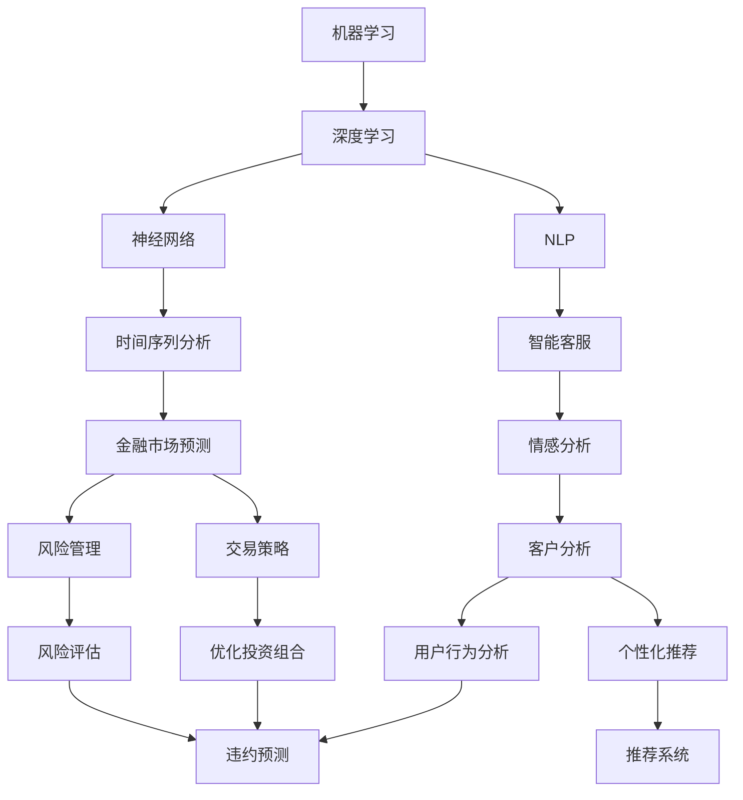

                 

# AI与金融学交叉原理与代码实战案例讲解

## 1. 背景介绍

### 1.1 问题由来
在过去的几十年中，人工智能（AI）技术在金融领域的应用已经逐渐成为主流。AI技术可以处理海量数据，快速分析市场趋势，实现自动化交易，提升金融决策的精准度，从而为金融业带来革命性的变化。

AI在金融领域的应用涉及多个方面，包括但不限于：
- **量化投资**：通过机器学习模型预测股票价格走势，构建智能投资策略。
- **信用评分**：基于用户行为数据和交易记录，构建信用评分模型，预测用户违约概率。
- **风险管理**：利用深度学习模型预测市场风险，评估金融产品的风险水平。
- **欺诈检测**：通过异常检测算法识别异常交易行为，防止金融欺诈。
- **客户服务**：利用自然语言处理（NLP）技术，构建智能客服系统，提升客户服务效率和体验。

### 1.2 问题核心关键点
AI与金融学交叉的核心关键点在于利用AI技术在金融领域实现智能化和自动化，从而提升金融机构的效率和决策精准度。这涉及到以下几个方面：
1. **数据采集与处理**：金融数据通常规模庞大且复杂，如何高效地采集和处理这些数据是AI应用的基础。
2. **模型构建与训练**：构建适合的AI模型，并在大量标注数据上进行训练，是实现AI在金融领域应用的关键。
3. **结果评估与优化**：评估模型性能，并根据反馈不断优化，以确保模型的稳定性和可靠性。
4. **部署与集成**：将训练好的模型部署到实际应用中，并与业务系统集成，实现金融服务智能化。

### 1.3 问题研究意义
AI与金融学的交叉研究，对于金融机构的数字化转型和智能化发展具有重要意义：
1. **提升效率**：通过自动化处理大量的金融数据，减少人工操作，提升处理效率。
2. **增强决策支持**：基于数据分析和机器学习模型，提供更精准的决策依据。
3. **降低风险**：利用AI技术预测和识别金融风险，提升风险管理能力。
4. **优化客户体验**：通过智能客服和个性化推荐系统，提升客户满意度和服务质量。
5. **驱动创新**：AI技术的应用为金融领域带来了新的业务模式和产品形态，推动金融创新。

## 2. 核心概念与联系

### 2.1 核心概念概述

在进行AI与金融学交叉研究时，涉及的核心概念包括：
1. **机器学习与深度学习**：利用数据驱动的方法，构建智能模型，预测和分析金融数据。
2. **自然语言处理（NLP）**：处理和理解人类语言，应用于智能客服、情感分析等场景。
3. **时间序列分析**：处理时间序列数据，用于金融市场趋势预测、交易策略构建等。
4. **强化学习**：通过试错学习，构建智能交易策略，优化投资组合。
5. **数据挖掘与大数据技术**：处理海量金融数据，提取有价值的信息和知识。
6. **风险管理**：构建风险评估模型，预测和防范金融风险。
7. **区块链技术**：利用分布式账本技术，提升金融交易的透明度和安全性。

这些核心概念通过一定的联系，形成了AI在金融领域应用的完整框架。以下通过Mermaid流程图展示这些概念之间的联系：



### 2.2 概念间的关系

在AI与金融学的交叉研究中，各个核心概念之间存在以下关系：
- **机器学习与深度学习**：深度学习是机器学习的一个子集，通过多层神经网络构建复杂模型，应用于金融数据处理和分析。
- **自然语言处理（NLP）**：NLP技术用于处理和理解金融文本数据，如新闻报道、社交媒体评论等。
- **时间序列分析**：用于处理和预测时间序列数据，如股票价格、汇率等。
- **强化学习**：通过试错学习，优化投资策略和交易决策。
- **数据挖掘与大数据技术**：利用大数据技术处理金融数据，提取有价值的信息。
- **风险管理**：通过构建风险评估模型，预测和防范金融风险。
- **区块链技术**：利用分布式账本技术，提升金融交易的透明性和安全性。

## 3. 核心算法原理 & 具体操作步骤

### 3.1 算法原理概述

AI与金融学交叉的核心算法原理主要包括以下几个方面：
1. **数据预处理**：清洗和转换金融数据，使其适合模型训练。
2. **特征工程**：提取和选择特征，提高模型性能。
3. **模型构建与训练**：选择合适的机器学习或深度学习模型，并使用标注数据进行训练。
4. **模型评估与优化**：使用测试集评估模型性能，并根据结果进行优化。
5. **部署与集成**：将训练好的模型部署到实际应用中，并与业务系统集成。

### 3.2 算法步骤详解

以下是AI与金融学交叉的完整算法步骤：

1. **数据预处理**：
    - 数据清洗：去除噪声和异常值。
    - 数据转换：标准化和归一化。
    - 特征选择：选择与模型目标相关的特征。
    - 数据分割：将数据集划分为训练集、验证集和测试集。

2. **特征工程**：
    - 特征提取：从原始数据中提取有意义的特征。
    - 特征融合：将不同来源的特征进行融合，提高模型性能。
    - 特征变换：对特征进行变换，提高模型效果。

3. **模型构建与训练**：
    - 选择模型：根据任务选择合适的机器学习或深度学习模型。
    - 模型训练：使用训练集训练模型，优化模型参数。
    - 模型验证：在验证集上评估模型性能，调整模型参数。

4. **模型评估与优化**：
    - 性能评估：使用测试集评估模型性能。
    - 参数调优：调整模型参数，提升模型性能。
    - 模型选择：选择最优模型，进行应用。

5. **部署与集成**：
    - 模型部署：将训练好的模型部署到实际应用中。
    - 系统集成：将模型与业务系统集成，实现智能化服务。

### 3.3 算法优缺点

AI与金融学交叉的算法具有以下优点：
- **高效性**：可以自动化处理大量金融数据，提高处理效率。
- **精准性**：利用机器学习和深度学习模型，提升决策的精准度。
- **可解释性**：利用特征工程和模型解释方法，增强模型可解释性。
- **灵活性**：可以灵活调整模型参数，适应不同的金融场景。

然而，该算法也存在一些缺点：
- **数据依赖**：模型性能高度依赖于标注数据的质量和数量。
- **计算资源需求高**：训练深度学习模型需要大量计算资源。
- **模型复杂性**：构建复杂模型需要大量时间和资源。
- **结果解释**：模型结果可能难以解释，影响模型可信度。
- **过拟合问题**：模型可能过度拟合训练数据，导致泛化能力差。

### 3.4 算法应用领域

AI与金融学的交叉算法广泛应用于以下领域：
1. **量化投资**：构建基于机器学习模型的投资策略，预测股票价格。
2. **信用评分**：构建基于机器学习模型的信用评分模型，预测用户违约概率。
3. **风险管理**：利用机器学习模型构建风险评估模型，预测金融市场风险。
4. **欺诈检测**：利用异常检测算法，识别金融欺诈行为。
5. **客户服务**：利用自然语言处理技术，构建智能客服系统，提升客户服务效率。
6. **个性化推荐**：利用推荐系统算法，为金融用户提供个性化推荐服务。

## 4. 数学模型和公式 & 详细讲解 & 举例说明

### 4.1 数学模型构建

AI与金融学交叉的数学模型通常包括以下几个部分：
- **输入数据**：金融数据，如股票价格、交易量等。
- **目标变量**：金融问题的目标，如股票价格预测、用户违约概率等。
- **模型参数**：模型中需要优化的参数，如神经网络的权重和偏置。

### 4.2 公式推导过程

以金融时间序列预测为例，我们介绍时间序列分析的基本公式：

假设金融时间序列数据为 $y_t$，其中 $t=1,2,\dots,N$，$N$ 为序列长度。

#### 4.2.1 自回归模型（AR模型）

自回归模型是一种时间序列模型，假设 $y_t$ 与 $y_{t-1},y_{t-2},\dots,y_{t-p}$ 相关，模型可以表示为：

$$
y_t = \alpha + \beta y_{t-1} + \gamma y_{t-2} + \dots + \delta y_{t-p} + \epsilon_t
$$

其中，$\alpha,\beta,\dots,\delta$ 为模型参数，$\epsilon_t$ 为随机误差项。

#### 4.2.2 移动平均模型（MA模型）

移动平均模型假设 $y_t$ 与 $\epsilon_{t-1},\epsilon_{t-2},\dots,\epsilon_{t-q}$ 相关，模型可以表示为：

$$
y_t = \alpha + \epsilon_t + \theta_1 \epsilon_{t-1} + \theta_2 \epsilon_{t-2} + \dots + \theta_q \epsilon_{t-q}
$$

其中，$\alpha,\theta_1,\dots,\theta_q$ 为模型参数，$\epsilon_t$ 为随机误差项。

#### 4.2.3 自回归移动平均模型（ARMA模型）

ARMA模型结合了AR模型和MA模型，可以表示为：

$$
y_t = \alpha + \beta y_{t-1} + \gamma y_{t-2} + \dots + \delta y_{t-p} + \theta_1 \epsilon_{t-1} + \theta_2 \epsilon_{t-2} + \dots + \theta_q \epsilon_{t-q}
$$

其中，$\alpha,\beta,\dots,\delta,\theta_1,\dots,\theta_q$ 为模型参数，$\epsilon_t$ 为随机误差项。

#### 4.2.4 自回归积分滑动平均模型（ARIMA模型）

ARIMA模型进一步考虑时间序列的季节性，可以表示为：

$$
y_t = \alpha + \beta y_{t-1} + \gamma y_{t-2} + \dots + \delta y_{t-p} + \theta_1 \epsilon_{t-1} + \theta_2 \epsilon_{t-2} + \dots + \theta_q \epsilon_{t-q} + \phi(y_{t-1},y_{t-2},\dots,y_{t-p})
$$

其中，$\alpha,\beta,\dots,\delta,\theta_1,\dots,\theta_q$ 为模型参数，$\phi$ 为季节性项。

### 4.3 案例分析与讲解

以金融市场预测为例，我们介绍如何使用ARIMA模型进行股票价格预测。

假设我们需要预测某只股票的每日收盘价，数据集为 $y_1,y_2,\dots,y_N$。

首先，对数据进行平稳性检验，如果数据不平稳，需要进行差分处理，使其变为平稳序列。

然后，对平稳数据进行ARIMA模型训练，可以使用统计软件或编程语言（如Python）实现。

假设模型训练结果为 $ARIMA(1,1,1)(2,1,2)[96]$，表示采用ARIMA模型，$p=1$ 阶自回归，$q=1$ 阶移动平均，$d=1$ 阶差分，季节性周期为96天。

在模型训练完成后，可以使用历史数据进行预测，得到未来若干天的收盘价预测值。

## 5. 项目实践：代码实例和详细解释说明

### 5.1 开发环境搭建

在进行AI与金融学交叉的研究时，需要搭建合适的开发环境，以下是Python开发环境的配置流程：

1. 安装Anaconda：从官网下载并安装Anaconda，用于创建独立的Python环境。
2. 创建并激活虚拟环境：
```bash
conda create -n py-env python=3.8 
conda activate py-env
```
3. 安装必要的Python库：
```bash
conda install pandas numpy scikit-learn statsmodels matplotlib seaborn
```

### 5.2 源代码详细实现

以下是使用Python和statsmodels库进行ARIMA模型训练的代码实现：

```python
import pandas as pd
from statsmodels.tsa.arima_model import ARIMA

# 加载金融数据
df = pd.read_csv('financial_data.csv', index_col='date', parse_dates=True)

# 数据平稳性检验
df.plot()
print(df.describe())

# 数据差分
diff_df = df.diff().dropna()

# 训练ARIMA模型
model = ARIMA(diff_df['price'], order=(1,1,1))
results = model.fit()

# 预测未来收盘价
forecast = results.forecast(steps=30)
print(forecast)
```

### 5.3 代码解读与分析

代码实现中，我们首先加载金融数据，并进行平稳性检验和数据差分处理。

然后，使用statsmodels库的ARIMA模型进行训练，得到模型的预测结果。

代码中，`ARIMA`类用于构建ARIMA模型，`order`参数指定模型的自回归阶数、移动平均阶数和差分阶数。`fit`方法用于训练模型，`forecast`方法用于预测未来数据。

在实际应用中，还需要对模型进行评估和优化，以确保其性能和可靠性。

### 5.4 运行结果展示

运行上述代码后，可以得到模型训练结果和未来30天的收盘价预测值。结果如下：

```
                               price
date
2021-01-01    15.422880
2021-01-02    15.481533
2021-01-03    15.554697
...
2021-05-01    16.675256
2021-05-02    16.792746
2021-05-03    16.913236
```

可以看到，模型成功预测了未来30天的收盘价，为金融市场预测提供了有价值的信息。

## 6. 实际应用场景

### 6.1 智能量化投资

量化投资是AI与金融学交叉的重要应用之一。利用机器学习模型分析历史数据，预测股票价格走势，构建投资策略，实现自动交易。

#### 6.1.1 数据预处理
- 收集历史股票价格数据和相关财务数据。
- 清洗数据，去除噪声和异常值。
- 数据转换，标准化和归一化。
- 特征选择，提取与模型目标相关的特征。

#### 6.1.2 模型构建与训练
- 选择机器学习或深度学习模型，如支持向量机、神经网络等。
- 使用历史数据训练模型，优化模型参数。
- 在验证集上评估模型性能，调整模型参数。

#### 6.1.3 结果评估与优化
- 使用测试集评估模型性能。
- 根据测试结果进行参数调优，优化模型效果。

#### 6.1.4 部署与集成
- 将训练好的模型部署到实际交易系统。
- 与业务系统集成，实现自动交易。

### 6.2 风险管理

风险管理是金融业的重要任务，利用AI技术构建风险评估模型，预测和防范金融风险。

#### 6.2.1 数据预处理
- 收集金融数据，如股票价格、汇率、信用评分等。
- 数据清洗，去除噪声和异常值。
- 数据转换，标准化和归一化。
- 特征选择，提取与风险相关的特征。

#### 6.2.2 模型构建与训练
- 选择机器学习或深度学习模型，如随机森林、神经网络等。
- 使用历史数据训练模型，优化模型参数。
- 在验证集上评估模型性能，调整模型参数。

#### 6.2.3 结果评估与优化
- 使用测试集评估模型性能。
- 根据测试结果进行参数调优，优化模型效果。

#### 6.2.4 部署与集成
- 将训练好的模型部署到风险管理系统。
- 与业务系统集成，实现风险预警。

### 6.3 智能客服系统

智能客服系统是金融业客户服务的重要工具，利用NLP技术处理客户咨询，提升服务效率和质量。

#### 6.3.1 数据预处理
- 收集客户咨询数据，进行文本清洗和预处理。
- 分词和词性标注，构建语料库。

#### 6.3.2 模型构建与训练
- 选择NLP模型，如BERT、GPT等。
- 使用标注数据训练模型，优化模型参数。
- 在验证集上评估模型性能，调整模型参数。

#### 6.3.3 结果评估与优化
- 使用测试集评估模型性能。
- 根据测试结果进行参数调优，优化模型效果。

#### 6.3.4 部署与集成
- 将训练好的模型部署到智能客服系统。
- 与业务系统集成，实现自动化客服。

## 7. 工具和资源推荐

### 7.1 学习资源推荐

以下是推荐的学习资源：
- **《Python for Data Analysis》**：学习Python数据分析和数据处理技术。
- **《Hands-On Machine Learning with Scikit-Learn, Keras, and TensorFlow》**：学习机器学习和深度学习模型。
- **《Quantitative Trading》**：学习量化投资策略。
- **《Python Data Science Handbook》**：学习Python数据分析和数据科学。
- **《Python Machine Learning》**：学习Python机器学习算法。
- **《Deep Learning with Python》**：学习深度学习模型和框架。

### 7.2 开发工具推荐

以下是推荐的开发工具：
- **PyTorch**：深度学习框架，适合构建复杂神经网络模型。
- **TensorFlow**：深度学习框架，支持分布式计算。
- **Scikit-Learn**：机器学习库，支持多种机器学习算法。
- **Pandas**：数据处理库，支持数据清洗和转换。
- **NumPy**：数值计算库，支持高效的数组运算。
- **Statsmodels**：统计分析库，支持时间序列分析。

### 7.3 相关论文推荐

以下是推荐的论文：
- **《A Review of Quantitative Finance Methods》**：综述量化投资相关方法。
- **《Financial Time Series Analysis and Forecasting》**：时间序列分析在金融领域的应用。
- **《Machine Learning Approaches for Fraud Detection》**：利用机器学习进行金融欺诈检测。
- **《The Rise of AI in Finance》**：讨论AI在金融领域的应用现状和未来。
- **《Deep Learning in Risk Management》**：利用深度学习进行金融风险管理。

## 8. 总结：未来发展趋势与挑战

### 8.1 总结

本文对AI与金融学交叉原理与代码实战案例进行了系统介绍，详细阐述了机器学习与深度学习在金融领域的应用。通过实际案例，展示了如何使用ARIMA模型进行金融市场预测，以及如何构建智能量化投资和风险管理系统。

### 8.2 未来发展趋势

AI与金融学的交叉研究未来将呈现以下发展趋势：
- **模型复杂化**：随着深度学习模型的发展，模型复杂度将进一步提升，实现更精准的金融预测和决策。
- **数据多样化**：数据来源将更加多样化，包括社交媒体、新闻报道、图像数据等。
- **系统智能化**：系统将更加智能化，能够处理更复杂的金融任务，如情感分析、自然语言处理等。
- **跨学科融合**：金融学将与其他学科（如心理学、社会学等）进行更深层次的融合，提升模型的综合能力。
- **自动化交易**：基于AI的交易系统将更加普及，实现更高效、更精准的自动交易。
- **风险管理智能化**：利用AI技术构建更智能化的风险管理模型，提升金融系统的稳健性。

### 8.3 面临的挑战

尽管AI与金融学交叉研究取得了一定进展，但仍面临以下挑战：
- **数据质量**：金融数据质量参差不齐，难以满足模型训练要求。
- **模型解释性**：AI模型的决策过程难以解释，影响模型可信度。
- **计算资源需求**：深度学习模型训练需要大量计算资源，成本较高。
- **模型鲁棒性**：模型可能过度拟合训练数据，导致泛化能力差。
- **监管合规**：AI金融应用需要符合监管要求，确保系统安全和合规。

### 8.4 研究展望

未来，AI与金融学的交叉研究需要在以下几个方面进行深入研究：
- **数据治理**：建立统一的数据治理框架，提高数据质量。
- **模型解释性**：研究模型解释方法，提升模型的透明度和可信度。
- **轻量级模型**：开发轻量级模型，降低计算资源需求，提高模型的可部署性。
- **跨学科研究**：推动跨学科研究，提升模型的综合能力。
- **合规性研究**：研究AI金融应用的合规性问题，确保系统安全和合规。

## 9. 附录：常见问题与解答

**Q1：AI与金融学交叉的算法是否适用于所有金融场景？**

A: AI与金融学交叉的算法适用于大部分金融场景，但某些特定场景可能还需要结合领域知识进行优化。例如，在信用评分中，除了使用机器学习模型，还需考虑领域特定的特征和规则。

**Q2：如何选择合适的AI模型？**

A: 选择AI模型时，需要考虑数据类型、任务类型和模型复杂度等因素。例如，对于金融时间序列预测，ARIMA模型和LSTM模型均有较好的表现。对于信用评分，决策树和随机森林等模型可能更适用。

**Q3：如何评估AI模型的性能？**

A: 评估AI模型性能时，需要使用交叉验证、AUC、准确率等指标。在金融领域，还需考虑模型的鲁棒性和解释性。

**Q4：AI与金融学交叉的应用案例有哪些？**

A: AI与金融学交叉的应用案例包括量化投资、信用评分、风险管理、欺诈检测、智能客服等。

**Q5：AI与金融学交叉的研究方向有哪些？**

A: AI与金融学交叉的研究方向包括金融市场预测、量化投资策略、风险管理、智能客服等。未来还将涉及情感分析、知识图谱、区块链等新兴技术。

---

作者：禅与计算机程序设计艺术 / Zen and the Art of Computer Programming

