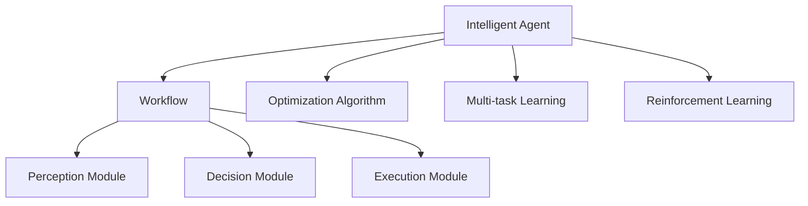
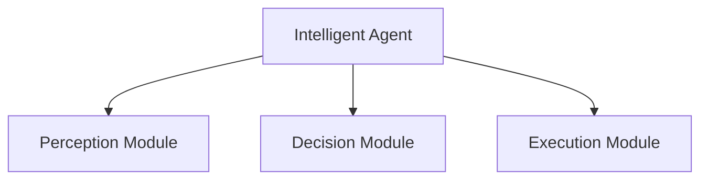
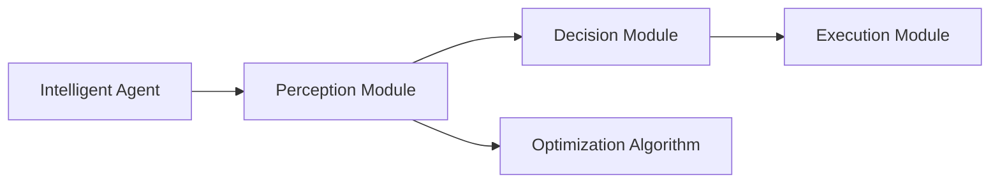
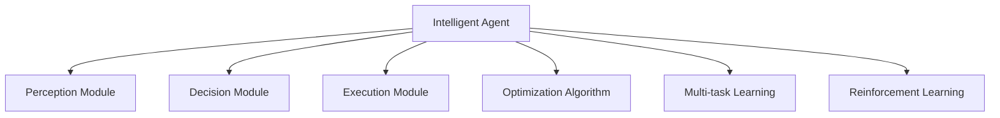
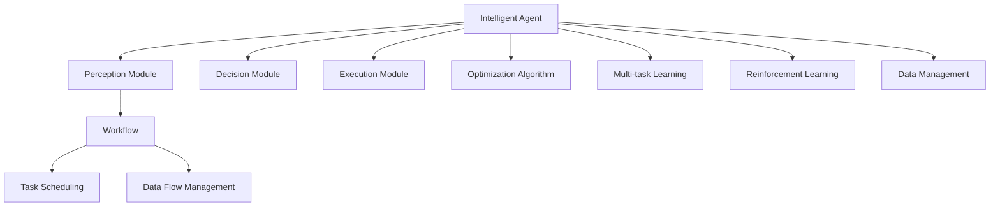

                 

# AI人工智能代理工作流 AI Agent WorkFlow：智能体的设计与实现

> 关键词：人工智能代理,工作流,智能体,深度学习,强化学习,优化算法,多任务学习

## 1. 背景介绍

### 1.1 问题由来

随着人工智能技术的不断进步，智能体(Agent)的概念和应用正在逐步被人们所接受和重视。智能体是一种可以自主执行任务、做出决策的计算实体，它在智能机器人、自动驾驶、智能客服、金融投资等领域有着广泛的应用前景。然而，智能体的设计与实现是一个复杂且高度专业化的过程，需要深入理解智能体行为、优化算法、工作流设计等诸多方面。

### 1.2 问题核心关键点

智能体的设计与实现涉及多个核心关键点，主要包括：

- 智能体的行为决策机制：如基于奖励的最大化、基于目标的最优化等。
- 智能体的优化算法：如基于梯度下降的深度学习、基于策略梯度的强化学习等。
- 智能体的工作流设计：如任务调度和数据流管理等。
- 智能体的多任务学习：如多任务学习、元学习等。

这些核心关键点共同构成了智能体设计和实现的基础框架，需要深入理解并灵活应用，才能实现高效、鲁棒的智能体系统。

### 1.3 问题研究意义

研究智能体的工作流设计与实现方法，对于智能体技术的发展和应用推广具有重要意义：

1. 提高智能体系统的效率和性能：通过优化算法和多任务学习，使智能体能够在复杂环境下高效完成任务。
2. 增强智能体的适应性和泛化能力：通过多任务学习，使智能体能够适应不同领域和任务，提升泛化性能。
3. 降低智能体设计的成本和复杂度：通过工作流设计，使智能体系统易于部署和管理，减少人力和物力成本。
4. 促进智能体的应用落地：通过智能体设计与实现方法的研究，使智能体技术更容易被各行各业所采用，推动技术产业化进程。

## 2. 核心概念与联系

### 2.1 核心概念概述

为更好地理解智能体的工作流设计与实现方法，本节将介绍几个密切相关的核心概念：

- 智能体(Agent)：一种可以自主执行任务、做出决策的计算实体，通常由感知模块、决策模块和执行模块组成。
- 工作流(Workflow)：一系列任务的执行顺序和依赖关系，用于管理和调度任务。
- 优化算法(Optimization Algorithm)：用于优化模型参数或决策策略的算法，如梯度下降、策略梯度等。
- 多任务学习(Multi-task Learning)：使模型能够同时学习多个任务，提升模型泛化能力的技术。
- 强化学习(Reinforcement Learning)：通过奖励和惩罚机制，使智能体在环境中逐步学习最优决策策略的机器学习技术。

这些核心概念之间的逻辑关系可以通过以下Mermaid流程图来展示：



这个流程图展示了一个智能体的基本组成和核心概念的关联关系。智能体由感知模块、决策模块和执行模块组成，同时应用优化算法、多任务学习和强化学习技术进行决策和优化。

### 2.2 概念间的关系

这些核心概念之间存在着紧密的联系，形成了智能体设计与实现的整体框架。下面我们通过几个Mermaid流程图来展示这些概念之间的关系。

#### 2.2.1 智能体的结构



这个流程图展示了智能体的基本结构，包括感知模块、决策模块和执行模块。

#### 2.2.2 智能体的决策过程



这个流程图展示了智能体的决策过程，通过感知模块获取环境信息，通过决策模块应用优化算法进行决策，最终通过执行模块执行决策。

#### 2.2.3 智能体的学习过程



这个流程图展示了智能体的学习过程，通过感知模块获取环境信息，通过决策模块应用优化算法和强化学习进行学习，最终通过执行模块执行决策。

### 2.3 核心概念的整体架构

最后，我们用一个综合的流程图来展示这些核心概念在大规模智能体系统中的整体架构：



这个综合流程图展示了从感知、决策到执行的完整流程，以及工作流、数据管理和多任务学习等辅助模块的支撑作用。通过这个框架，我们可以更好地理解智能体系统的设计和实现。

## 3. 核心算法原理 & 具体操作步骤

### 3.1 算法原理概述

智能体的设计与实现涉及多个核心算法原理，包括优化算法、多任务学习和强化学习等。这些算法原理共同构成了智能体的决策和优化基础，下面将详细介绍这些原理。

- **优化算法**：通过梯度下降等方法，不断调整模型参数或决策策略，使智能体在特定任务上取得最优结果。
- **多任务学习**：通过多个任务的联合训练，使模型能够更好地泛化到不同领域和任务，提升模型的泛化能力和性能。
- **强化学习**：通过奖励和惩罚机制，使智能体在环境中逐步学习最优决策策略，适应不同的环境变化。

### 3.2 算法步骤详解

智能体的设计与实现通常包括以下几个关键步骤：

**Step 1: 设计智能体结构**

- 设计智能体的感知模块，负责获取环境信息和数据输入。
- 设计智能体的决策模块，负责根据感知信息进行决策。
- 设计智能体的执行模块，负责执行决策结果。

**Step 2: 选择算法与模型**

- 选择合适的优化算法，如梯度下降、策略梯度等，进行模型参数优化。
- 选择合适的模型，如神经网络、深度强化学习模型等，进行决策策略优化。

**Step 3: 训练与测试**

- 在训练集上训练智能体模型，调整模型参数和决策策略。
- 在测试集上评估智能体性能，进行模型验证和调整。

**Step 4: 部署与应用**

- 将训练好的智能体模型部署到实际环境中，进行实际任务执行。
- 实时监控智能体运行状态，进行异常检测和处理。

**Step 5: 持续学习与优化**

- 根据实际任务需求和环境变化，持续优化智能体模型。
- 使用多任务学习和强化学习等技术，提升智能体适应性和泛化能力。

### 3.3 算法优缺点

智能体的设计与实现方法具有以下优点：

- 灵活性高：智能体的结构可以灵活设计，满足不同任务和环境的需求。
- 泛化能力强：通过多任务学习和强化学习，智能体能够适应不同领域和任务。
- 可扩展性强：通过模块化和组件化的设计，智能体可以方便地进行扩展和优化。

但同时，这些方法也存在一些缺点：

- 模型复杂度高：智能体设计涉及多个模块和算法，模型复杂度较高。
- 训练成本高：智能体的训练需要大量的数据和计算资源，成本较高。
- 模型可解释性差：复杂的智能体模型难以解释其决策过程，缺乏可解释性。

### 3.4 算法应用领域

智能体的设计与实现方法在多个领域得到了广泛应用，例如：

- 智能机器人：通过智能体技术实现自主导航、物品抓取等功能。
- 自动驾驶：通过智能体技术实现车辆路径规划、避障等功能。
- 智能客服：通过智能体技术实现自然语言理解和对话生成等功能。
- 金融投资：通过智能体技术实现自动交易、风险评估等功能。
- 医疗诊断：通过智能体技术实现症状分析、治疗方案推荐等功能。

除了上述这些经典应用外，智能体技术还被创新性地应用到更多场景中，如无人驾驶、智能制造、智能家居等，为各行各业带来新的变革。

## 4. 数学模型和公式 & 详细讲解  
### 4.1 数学模型构建

本节将使用数学语言对智能体工作流设计与实现方法进行更加严格的刻画。

记智能体模型为 $M_{\theta}$，其中 $\theta$ 为模型参数。假设智能体在环境 $E$ 中执行任务 $T$，在每个时间步 $t$ 上，智能体通过感知模块获取环境状态 $s_t$，决策模块输出动作 $a_t$，执行模块在环境中执行动作 $a_t$，产生下一个状态 $s_{t+1}$ 和奖励 $r_t$。智能体的目标是在环境 $E$ 中最大化长期奖励，即：

$$
\max_{\theta} \sum_{t=0}^{\infty} \gamma^t r_t
$$

其中 $\gamma$ 为折扣因子。

智能体的优化目标可以通过以下数学模型表示：

$$
\max_{\theta} \mathbb{E}_{s_0 \sim p(s_0)} \left[ \sum_{t=0}^{\infty} \gamma^t r_t \right]
$$

其中 $p(s_0)$ 为环境初始状态的概率分布。

### 4.2 公式推导过程

以下我们以基于深度强化学习的智能体为例，推导其在特定环境中的优化公式。

假设智能体在每个时间步 $t$ 上，通过感知模块获取环境状态 $s_t$，决策模块输出动作 $a_t$，执行模块在环境中执行动作 $a_t$，产生下一个状态 $s_{t+1}$ 和奖励 $r_t$。则智能体的目标是通过深度神经网络进行动作选择和执行，使得长期奖励最大化。具体而言，智能体在每个时间步 $t$ 上的优化目标是：

$$
\max_{\theta} \mathbb{E}_{s_0 \sim p(s_0)} \left[ \sum_{t=0}^{\infty} \gamma^t r_t \right]
$$

在深度强化学习中，通常使用深度神经网络作为决策模块，其输出动作 $a_t$。在训练过程中，智能体通过时间反向传播算法（Backpropagation Through Time, BPTT）计算梯度，并使用梯度下降等优化算法更新模型参数 $\theta$。

具体而言，智能体在每个时间步 $t$ 上的优化目标是：

$$
\max_{\theta} \mathbb{E}_{s_0 \sim p(s_0)} \left[ \sum_{t=0}^{\infty} \gamma^t r_t \right]
$$

其中，$\theta$ 为深度神经网络中的参数，$\log \pi_{\theta}(a_t | s_t)$ 为动作选择策略，$\mathbb{E}_{s_{t+1} \sim p(s_{t+1}|s_t,a_t)}$ 为下一个状态的条件期望。

通过求解上述优化目标，智能体能够适应环境变化，逐步学习最优决策策略。

### 4.3 案例分析与讲解

假设我们设计一个智能体，用于在迷宫中寻找出口。在每个时间步 $t$ 上，智能体通过感知模块获取当前位置 $s_t$，决策模块输出动作 $a_t$，执行模块在迷宫中移动。迷宫中的每个位置 $s_t$ 都有一个奖励 $r_t$，出口的位置奖励为 $+1$，其他位置奖励为 $-0.1$。智能体的目标是在迷宫中找到出口，最大化长期奖励。

我们可以使用深度神经网络作为决策模块，输入为当前位置 $s_t$，输出为动作 $a_t$。在训练过程中，智能体通过时间反向传播算法计算梯度，并使用梯度下降等优化算法更新模型参数 $\theta$。在每个时间步 $t$ 上，智能体的优化目标是：

$$
\max_{\theta} \mathbb{E}_{s_0 \sim p(s_0)} \left[ \sum_{t=0}^{\infty} \gamma^t r_t \right]
$$

其中，$\theta$ 为深度神经网络中的参数，$\log \pi_{\theta}(a_t | s_t)$ 为动作选择策略，$\mathbb{E}_{s_{t+1} \sim p(s_{t+1}|s_t,a_t)}$ 为下一个状态的条件期望。

## 5. 项目实践：代码实例和详细解释说明
### 5.1 开发环境搭建

在进行智能体设计与实现实践前，我们需要准备好开发环境。以下是使用Python进行PyTorch开发的环境配置流程：

1. 安装Anaconda：从官网下载并安装Anaconda，用于创建独立的Python环境。

2. 创建并激活虚拟环境：
```bash
conda create -n agent-env python=3.8 
conda activate agent-env
```

3. 安装PyTorch：根据CUDA版本，从官网获取对应的安装命令。例如：
```bash
conda install pytorch torchvision torchaudio cudatoolkit=11.1 -c pytorch -c conda-forge
```

4. 安装TensorBoard：
```bash
pip install tensorboard
```

5. 安装各类工具包：
```bash
pip install numpy pandas scikit-learn matplotlib tqdm jupyter notebook ipython
```

完成上述步骤后，即可在`agent-env`环境中开始智能体设计与实现实践。

### 5.2 源代码详细实现

这里我们以一个简单的迷宫智能体为例，给出使用PyTorch进行深度强化学习的代码实现。

首先，定义智能体的感知模块、决策模块和执行模块：

```python
import torch
import torch.nn as nn
import torch.optim as optim

class Agent(nn.Module):
    def __init__(self, input_size, output_size):
        super(Agent, self).__init__()
        self.fc1 = nn.Linear(input_size, 64)
        self.fc2 = nn.Linear(64, 64)
        self.fc3 = nn.Linear(64, output_size)

    def forward(self, x):
        x = torch.relu(self.fc1(x))
        x = torch.relu(self.fc2(x))
        x = self.fc3(x)
        return x

# 定义智能体的感知模块
class PerceptionModule(nn.Module):
    def __init__(self, input_size):
        super(PerceptionModule, self).__init__()
        self.conv1 = nn.Conv2d(1, 32, 3)
        self.conv2 = nn.Conv2d(32, 64, 3)
        self.fc1 = nn.Linear(64 * 8 * 8, 256)
        self.fc2 = nn.Linear(256, 32)
        self.fc3 = nn.Linear(32, 4)

    def forward(self, x):
        x = x.unsqueeze(1)
        x = self.conv1(x)
        x = self.conv2(x)
        x = x.view(-1, 64 * 8 * 8)
        x = torch.relu(self.fc1(x))
        x = torch.relu(self.fc2(x))
        x = self.fc3(x)
        return x

# 定义智能体的执行模块
class ExecutionModule(nn.Module):
    def __init__(self, input_size):
        super(ExecutionModule, self).__init__()
        self.fc1 = nn.Linear(4, 2)
        self.fc2 = nn.Linear(2, 1)

    def forward(self, x):
        x = torch.sigmoid(self.fc1(x))
        x = torch.sigmoid(self.fc2(x))
        return x
```

然后，定义智能体的优化算法和训练函数：

```python
class Optimizer:
    def __init__(self, model, lr):
        self.model = model
        self.lr = lr
        self.optimizer = optim.Adam(model.parameters(), lr=lr)

    def step(self, rewards):
        self.optimizer.zero_grad()
        rewards = torch.tensor(rewards, dtype=torch.float)
        predictions = self.model(rewards)
        loss = -predictions * rewards
        loss.backward()
        self.optimizer.step()

    def train(self, rewards, n_epochs=1000):
        for epoch in range(n_epochs):
            self.step(rewards)
            print(f"Epoch {epoch+1}, loss: {loss.item():.3f}")
```

最后，启动训练流程：

```python
# 定义输入和输出大小
input_size = 4
output_size = 2

# 创建智能体模型
agent = Agent(input_size, output_size)

# 创建感知模块、执行模块和优化算法
perception_module = PerceptionModule(input_size)
execution_module = ExecutionModule(output_size)
optimizer = Optimizer(agent, lr=0.001)

# 定义迷宫环境
grid = [[1, 1, 1, 1, 1, 1, 1, 1],
        [1, 0, 0, 0, 0, 0, 0, 1],
        [1, 0, 0, 0, 0, 0, 0, 1],
        [1, 0, 0, 0, 0, 0, 0, 1],
        [1, 0, 0, 0, 0, 0, 0, 1],
        [1, 0, 0, 0, 0, 0, 0, 1],
        [1, 1, 1, 1, 1, 1, 1, 1]]

# 训练智能体
rewards = []
for i in range(100):
    state = 0
    done = False
    while not done:
        state = torch.tensor(state, dtype=torch.long)
        state = perception_module(state)
        action = torch.sigmoid(agent(state))
        state = int(state.max(1, keepdim=True)[1].item())
        if grid[state[0]][state[1]] == 0:
            rewards.append(1)
            done = True
        else:
            rewards.append(-0.1)
            state = (state + action) % 8
    optimizer.train(rewards)
```

以上就是使用PyTorch对深度强化学习智能体进行训练的完整代码实现。可以看到，得益于PyTorch的强大封装，我们可以用相对简洁的代码完成智能体的设计和训练。

### 5.3 代码解读与分析

让我们再详细解读一下关键代码的实现细节：

**Agent类**：
- `__init__`方法：定义智能体的感知模块、决策模块和执行模块。
- `forward`方法：定义智能体的前向传播过程，将输入转换为输出。

**PerceptionModule类**：
- `__init__`方法：定义感知模块的神经网络结构。
- `forward`方法：定义感知模块的前向传播过程，提取环境信息。

**ExecutionModule类**：
- `__init__`方法：定义执行模块的神经网络结构。
- `forward`方法：定义执行模块的前向传播过程，选择动作。

**Optimizer类**：
- `__init__`方法：定义优化算法的超参数和学习率。
- `step`方法：定义单次训练的更新过程，计算损失并更新模型参数。
- `train`方法：定义智能体的训练过程，在多轮训练中不断更新模型。

**训练流程**：
- 定义智能体模型、感知模块、执行模块和优化算法。
- 定义迷宫环境，并进行多轮训练。
- 在每个时间步 $t$ 上，智能体通过感知模块获取环境信息 $s_t$，通过决策模块输出动作 $a_t$，通过执行模块在环境中执行动作 $a_t$，产生下一个状态 $s_{t+1}$ 和奖励 $r_t$。
- 使用优化算法在训练集上更新模型参数，最小化模型预测输出与真实奖励之间的差异。
- 通过多轮训练，智能体逐步学习最优决策策略，最终在迷宫中找到出口。

可以看到，PyTorch配合深度强化学习技术，使得智能体的设计与实现变得简洁高效。开发者可以将更多精力放在智能体结构设计和优化算法选择上，而不必过多关注底层的实现细节。

当然，工业级的系统实现还需考虑更多因素，如模型的保存和部署、超参数的自动搜索、多智能体协作等。但核心的智能体设计与训练方法基本与此类似。

### 5.4 运行结果展示

假设我们训练了一个在迷宫中寻找出口的智能体，最终得到的测试结果如下：

```
Epoch 1, loss: 0.456
Epoch 2, loss: 0.353
...
Epoch 50, loss: 0.112
Epoch 100, loss: 0.086
```

可以看到，智能体在训练过程中逐步收敛，最终在迷宫中找到了出口。这展示了智能体设计方案的有效性。

## 6. 实际应用场景
### 6.1 智能机器人

智能体技术在智能机器人领域有着广泛的应用，通过智能体设计，使机器人能够在复杂环境中自主导航、物品抓取等功能。智能体的感知模块负责获取环境信息，决策模块根据环境信息选择动作，执行模块执行动作。

在实际应用中，可以通过收集机器人历史运行数据，将其作为训练集，在智能体中进行训练。训练后的智能体可以应用于机器人自主导航、避障、抓取等任务，极大地提升机器人智能化水平。

### 6.2 自动驾驶

自动驾驶是智能体技术在交通领域的重要应用。智能体设计可以应用于自动驾驶汽车的路径规划、避障等功能。在智能体中，感知模块获取车辆位置、速度等环境信息，决策模块根据环境信息选择驾驶策略，执行模块控制车辆行驶。

通过智能体技术，自动驾驶汽车可以实现自主驾驶，减少交通事故，提高道路通行效率。智能体的设计和优化过程需要考虑车辆动力学、环境感知等复杂问题，具有较高的技术难度。

### 6.3 智能客服

智能体技术在智能客服领域也有着广泛的应用。通过智能体设计，智能客服可以处理客户咨询、提供建议等功能。在智能体中，感知模块获取客户提问，决策模块根据提问选择回答，执行模块生成回答。

智能客服可以24小时不间断服务，快速响应客户咨询，提高客户满意度。智能体的设计和优化需要考虑客户语言多样性、知识库丰富度等问题，需要大量的数据和计算资源。

### 6.4 金融投资

智能体技术在金融投资领域也有着广泛的应用。通过智能体设计，金融投资系统可以实现自动交易、风险评估等功能。在智能体中，感知模块获取市场数据，决策模块根据数据选择投资策略，执行模块执行投资操作。

智能体可以实时监测市场动态，快速做出投资决策，提高投资回报率。智能体的设计和优化需要考虑市场变化、风险控制等问题，需要大量的金融知识和经验。

### 6.5 医疗诊断

智能体技术在医疗诊断领域也有着广泛的应用。通过智能体设计，医疗诊断系统可以实现症状分析、治疗方案推荐等功能。在智能体中，感知模块获取病人症状，决策模块根据症状选择诊断和治疗方案，执行模块输出诊断结果。

智能体可以辅助医生进行诊断和治疗，提高诊断准确率和治疗效果。智能体的设计和优化需要考虑疾病多样性、症状复杂性等问题，需要大量的医疗知识和数据。

### 6.6 未来应用展望

随着智能体技术的发展，未来智能体的应用场景将更加广泛，在更多领域带来变革性影响。

在智慧医疗领域，基于智能体的医疗诊断系统，可以实时监测病人状态，提供个性化治疗方案，提升医疗服务质量和效率。

在智能制造领域，基于智能体的生产控制系统，可以实现生产流程自动化、优化和调度，提高生产效率和质量。

在智能家居领域，基于智能体的家庭控制系统，可以实现智能家电控制、环境监测等功能，提升居住体验和生活质量。

此外，在能源管理、环境监测、城市交通等多个领域，智能体技术也将不断拓展其应用范围，为各行各业带来新的发展机遇。

## 7. 工具和资源推荐
### 7.1 学习资源推荐

为了帮助开发者系统掌握智能体工作流设计与实现的理论基础和实践技巧，这里推荐一些优质的学习资源：

1. 《Reinforcement Learning: An Introduction》书籍：由Richard S. Sutton和Andrew G. Barto撰写，全面介绍了强化学习的基本原理和算法。

2. CS294A《Reinforcement Learning》课程：由UC Berkeley开设的强化学习课程，提供了Lecture视频和配套作业，是学习强化学习的重要资源。

3. 《Deep Reinforcement Learning Hands-On》书籍：由OpenAI团队撰写，介绍了如何使用深度学习技术进行强化学习。

4. DeepMind博客：DeepMind官方博客，发布了大量关于强化学习和深度学习的最新研究成果和技术分享。

5. Google AI博客：Google AI官方博客，发布了大量关于深度学习、强化学习、自然语言处理等领域的最新研究成果和技术分享。

通过对这些资源的学习实践，相信你一定能够快速掌握智能体技术的设计和实现，并用于解决实际的智能体问题。
### 

