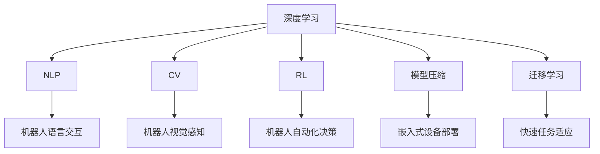
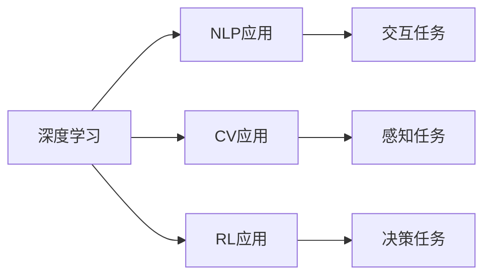
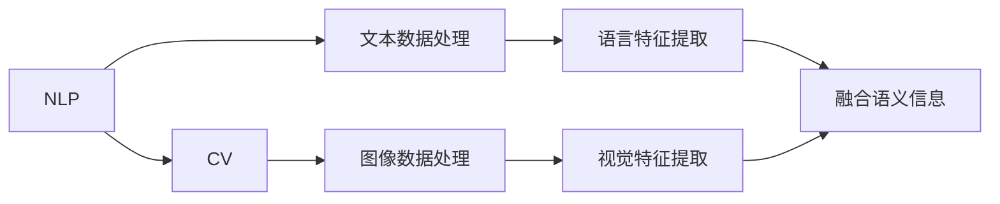
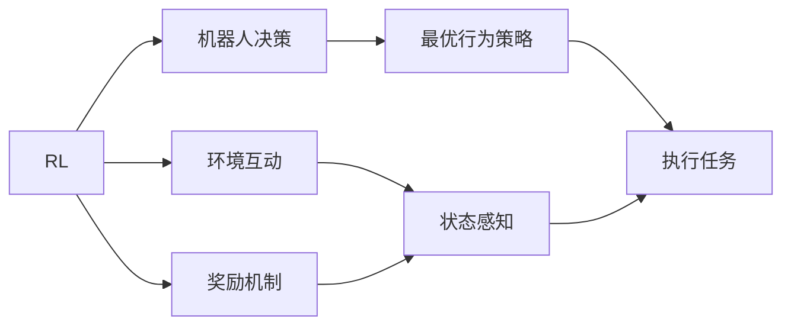
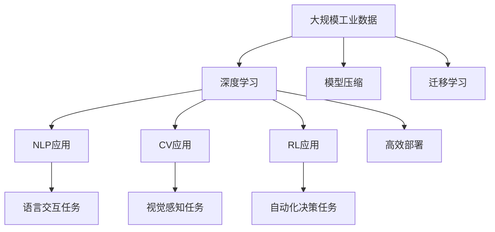

                 

# AI人工智能深度学习算法：在产业机器人中的应用

> 关键词：深度学习, 产业机器人, 自然语言处理(NLP), 计算机视觉(CV), 强化学习(RL), 模型压缩, 迁移学习, 机器人操作

## 1. 背景介绍

### 1.1 问题由来
随着制造业智能化转型的加速，产业机器人已经成为现代化生产的关键要素。然而，传统机器人存在灵活性差、自适应能力弱等问题，难以满足多变复杂生产环境的需要。近年来，基于深度学习的AI技术不断涌现，为解决这些问题提供了新的思路。

人工智能技术已经在多个工业领域得到应用，包括自动化生产线、智能物流、智慧工厂等。其中，深度学习作为AI技术的核心，在产业机器人上的应用也日益广泛。本文将详细阐述深度学习在产业机器人中的应用，包括自然语言处理(NLP)、计算机视觉(CV)、强化学习(Reinforcement Learning, RL)等多个领域，探索深度学习算法在工业机器人中的应用前景。

### 1.2 问题核心关键点
深度学习在产业机器人上的应用，主要体现在以下几个方面：

1. **自然语言处理(NLP)**：在机器人与操作人员、机器人与机器人之间的交互中，通过理解指令、生成任务描述等，提升机器人与人交互的效率和质量。
2. **计算机视觉(CV)**：利用深度学习模型进行视觉感知、识别和检测，为机器人提供准确的环境信息和物体识别能力，实现更灵活的操作。
3. **强化学习(RL)**：通过与环境的互动，使机器人自主学习最优行为策略，实现自动化决策和复杂操作。
4. **模型压缩**：在保证深度学习模型性能的同时，减少计算资源消耗，实现高效部署。
5. **迁移学习**：利用已有模型的知识和经验，快速适应新任务和环境，提高模型泛化能力。

这些关键技术使得深度学习在产业机器人上的应用成为可能，显著提升了机器人的智能化水平和生产效率。

### 1.3 问题研究意义
深度学习在产业机器人中的应用，对于提升工业自动化水平、推动制造业智能化转型、优化生产流程、提升产品质量等具有重要意义：

1. **提升生产效率**：深度学习算法能够处理大量数据，通过优化生产流程和自动化决策，显著提高生产效率。
2. **降低运营成本**：通过自动化和智能化改造，减少人力成本和错误率，降低运营成本。
3. **提升产品质量**：深度学习能够实时监测生产过程，及时发现和纠正问题，提高产品质量。
4. **灵活应对复杂环境**：通过深度学习模型的自适应能力，机器人能够应对多变复杂的环境，提升操作精准度。
5. **推动技术革新**：深度学习技术的广泛应用，推动了传统制造业向智能化、柔性化、个性化方向转型，为产业升级提供了动力。

## 2. 核心概念与联系

### 2.1 核心概念概述

为更好地理解深度学习在产业机器人中的应用，本节将介绍几个密切相关的核心概念：

- **深度学习**：基于神经网络的多层级模型，通过大量数据进行训练，学习数据之间的复杂映射关系。深度学习在产业机器人中的应用，主要体现在对大规模数据的学习和分析上。

- **自然语言处理(NLP)**：涉及文本数据的处理、分析和生成，包括语言模型、机器翻译、语音识别等。在产业机器人中，NLP技术主要应用于机器人与操作人员、机器人与机器人之间的语言交互。

- **计算机视觉(CV)**：涉及图像和视频数据的处理、分析和识别，包括目标检测、语义分割、动作识别等。在产业机器人中，CV技术主要应用于机器人的视觉感知和环境识别。

- **强化学习(RL)**：通过与环境的互动，利用奖励机制和惩罚机制，使模型自主学习最优行为策略。在产业机器人中，RL技术主要应用于机器人的自动化决策和复杂操作。

- **模型压缩**：通过剪枝、量化、蒸馏等技术，减少深度学习模型的计算资源消耗，实现高效部署。在产业机器人中，模型压缩技术主要用于资源有限的嵌入式设备上。

- **迁移学习**：通过已有模型的知识和经验，快速适应新任务和环境，提高模型泛化能力。在产业机器人中，迁移学习技术主要应用于机器人任务的快速适应和新环境的快速部署。

这些核心概念之间的逻辑关系可以通过以下Mermaid流程图来展示：



这个流程图展示了大语言模型微调过程中各个核心概念的关系和作用：

1. 深度学习作为核心技术，通过NLP、CV、RL等多个领域的应用，实现机器人智能化。
2. 模型压缩技术使得深度学习模型在嵌入式设备上高效部署，进一步推动工业机器人的应用。
3. 迁移学习技术加速了机器人对新任务和环境的适应，提高了机器人的泛化能力。

### 2.2 概念间的关系

这些核心概念之间存在着紧密的联系，形成了深度学习在产业机器人应用中的完整生态系统。下面我通过几个Mermaid流程图来展示这些概念之间的关系。

#### 2.2.1 深度学习在产业机器人中的应用架构



这个流程图展示了大语言模型微调过程中的应用架构：

1. 深度学习通过NLP、CV、RL等技术，支持机器人处理语言、视觉、决策等任务。
2. NLP、CV、RL技术相互配合，共同提升机器人完成任务的能力。
3. 迁移学习、模型压缩等技术，优化深度学习模型，提高工业机器人的效率和应用范围。

#### 2.2.2 自然语言处理(NLP)与计算机视觉(CV)的联系



这个流程图展示了NLP和CV技术之间的关系：

1. NLP处理文本数据，提取语言特征。
2. CV处理图像数据，提取视觉特征。
3. 通过融合语义信息和视觉信息，实现对复杂环境的理解和处理。

#### 2.2.3 强化学习(RL)在产业机器人中的应用



这个流程图展示了强化学习在产业机器人中的应用：

1. 强化学习通过与环境的互动，学习最优行为策略。
2. 环境互动和奖励机制，是强化学习的关键要素。
3. 最优行为策略指导机器人执行任务，提升操作精准度。

### 2.3 核心概念的整体架构

最后，我们用一个综合的流程图来展示这些核心概念在大语言模型微调过程中的整体架构：



这个综合流程图展示了从数据输入到深度学习模型应用的完整过程：

1. 大规模工业数据通过深度学习模型进行处理和分析。
2. NLP、CV、RL技术分别应用于语言交互、视觉感知和自动化决策任务。
3. 模型压缩和迁移学习技术，提升深度学习模型的部署效率和泛化能力。

通过这些流程图，我们可以更清晰地理解深度学习在产业机器人应用过程中的各个环节和作用，为后续深入讨论具体的算法和实践奠定基础。

## 3. 核心算法原理 & 具体操作步骤
### 3.1 算法原理概述

在产业机器人中，深度学习算法主要应用于自然语言处理(NLP)、计算机视觉(CV)和强化学习(RL)等领域。这些算法通过不同的原理和步骤，实现对工业机器人的智能化改造。

### 3.2 算法步骤详解

#### 3.2.1 自然语言处理(NLP)

**3.2.1.1 语言模型**

语言模型是NLP中的核心技术之一，用于处理文本数据，理解文本的含义和结构。常见的语言模型包括基于n-gram的语言模型、神经网络语言模型(Neural Network Language Model, NNLM)、Transformer模型等。

语言模型训练的一般步骤如下：

1. 收集工业领域的大量文本数据，包括操作手册、技术文档、生产记录等。
2. 对文本数据进行预处理，包括分词、去停用词、词向量嵌入等。
3. 构建神经网络语言模型，利用文本数据进行训练。
4. 在模型训练过程中，使用交叉熵损失函数进行优化，最小化模型预测与实际标签之间的差异。
5. 对训练好的模型进行评估，选择表现最优的模型用于后续应用。

语言模型在产业机器人中的应用主要体现在以下几个方面：

1. **指令理解**：机器人通过理解操作人员的语言指令，自动执行相应操作。
2. **任务生成**：根据机器人的工作状态和环境信息，生成合适的任务描述，指导机器人完成任务。
3. **多模态交互**：通过结合NLP和CV技术，实现对机器人视觉输入的语音理解和语义生成，提升人机交互效率。

**3.2.1.2 序列到序列模型**

序列到序列模型(Sequence-to-Sequence, Seq2Seq)是NLP中的另一种重要模型，用于处理输入序列到输出序列的任务，如机器翻译、对话生成等。

Seq2Seq模型训练的一般步骤如下：

1. 收集工业领域的大量文本数据，包括操作手册、技术文档、生产记录等。
2. 对文本数据进行预处理，包括分词、去停用词、词向量嵌入等。
3. 构建Seq2Seq模型，利用文本数据进行训练。
4. 在模型训练过程中，使用交叉熵损失函数进行优化，最小化模型预测与实际标签之间的差异。
5. 对训练好的模型进行评估，选择表现最优的模型用于后续应用。

Seq2Seq模型在产业机器人中的应用主要体现在以下几个方面：

1. **多语言支持**：实现机器人与操作人员之间的跨语言交互，提升国际化生产的效率。
2. **对话生成**：通过对话生成模型，机器人能够与操作人员进行自然语言对话，理解操作意图。
3. **任务分配**：根据机器人的工作状态和环境信息，生成合适的任务分配描述，指导机器人完成任务。

#### 3.2.2 计算机视觉(CV)

**3.2.2.1 目标检测**

目标检测是CV中的重要任务之一，用于在图像或视频中检测和定位物体。常见的目标检测算法包括基于滑动窗口的目标检测、基于区域提议的目标检测、基于深度学习的目标检测等。

目标检测训练的一般步骤如下：

1. 收集工业领域的大量图像或视频数据，包括生产线上的机器视觉数据、质量检测数据等。
2. 对图像或视频数据进行预处理，包括裁剪、缩放、归一化等。
3. 构建目标检测模型，利用图像或视频数据进行训练。
4. 在模型训练过程中，使用交叉熵损失函数进行优化，最小化模型预测与实际标签之间的差异。
5. 对训练好的模型进行评估，选择表现最优的模型用于后续应用。

目标检测在产业机器人中的应用主要体现在以下几个方面：

1. **物体识别**：识别生产线上各种物体，如零部件、工具等。
2. **质量检测**：检测产品质量，判断是否合格。
3. **环境感知**：感知生产线上的环境信息，如障碍物、光线等。

**3.2.2.2 语义分割**

语义分割是CV中的另一种重要任务，用于将图像或视频中的每个像素归类到不同的语义类别中。常见的语义分割算法包括基于区域的语义分割、基于深度学习的语义分割等。

语义分割训练的一般步骤如下：

1. 收集工业领域的大量图像或视频数据，包括生产线上的机器视觉数据、质量检测数据等。
2. 对图像或视频数据进行预处理，包括裁剪、缩放、归一化等。
3. 构建语义分割模型，利用图像或视频数据进行训练。
4. 在模型训练过程中，使用交叉熵损失函数进行优化，最小化模型预测与实际标签之间的差异。
5. 对训练好的模型进行评估，选择表现最优的模型用于后续应用。

语义分割在产业机器人中的应用主要体现在以下几个方面：

1. **零件定位**：定位生产线上的零件，并判断其位置和姿态。
2. **质量检测**：检测零件的质量，判断是否合格。
3. **环境感知**：感知生产线上的环境信息，如障碍物、光线等。

#### 3.2.3 强化学习(RL)

**3.2.3.1 状态空间模型**

状态空间模型(Statespace Model)是强化学习中的重要模型之一，用于描述系统状态和行为的关系。在工业机器人中，状态空间模型用于描述机器人与环境的互动关系，指导机器人进行自主决策。

状态空间模型训练的一般步骤如下：

1. 定义机器人与环境之间的状态空间，包括机器人当前位置、速度、姿态等。
2. 定义机器人的行为空间，包括机器人的动作空间、执行器配置等。
3. 定义奖励函数，用于评估机器人的行为效果。
4. 构建状态空间模型，利用机器人的动作和环境状态进行训练。
5. 在模型训练过程中，使用梯度下降等优化算法进行优化，最小化模型预测与实际行为之间的差异。
6. 对训练好的模型进行评估，选择表现最优的模型用于后续应用。

状态空间模型在产业机器人中的应用主要体现在以下几个方面：

1. **路径规划**：通过状态空间模型，规划机器人在复杂环境中的运动路径。
2. **自动化决策**：根据状态空间模型，机器人能够自主进行决策，优化操作过程。
3. **任务执行**：通过状态空间模型，指导机器人完成复杂的任务，如搬运、装配等。

**3.2.3.2 强化学习算法**

强化学习算法是强化学习中的核心技术，用于通过与环境的互动，学习最优行为策略。常见的强化学习算法包括Q-learning、SARSA、Deep Q-Learning等。

强化学习算法训练的一般步骤如下：

1. 定义机器人与环境之间的状态空间，包括机器人当前位置、速度、姿态等。
2. 定义机器人的行为空间，包括机器人的动作空间、执行器配置等。
3. 定义奖励函数，用于评估机器人的行为效果。
4. 构建强化学习模型，利用机器人的动作和环境状态进行训练。
5. 在模型训练过程中，使用梯度下降等优化算法进行优化，最小化模型预测与实际行为之间的差异。
6. 对训练好的模型进行评估，选择表现最优的模型用于后续应用。

强化学习算法在产业机器人中的应用主要体现在以下几个方面：

1. **路径规划**：通过强化学习算法，规划机器人在复杂环境中的运动路径。
2. **自动化决策**：根据强化学习算法，机器人能够自主进行决策，优化操作过程。
3. **任务执行**：通过强化学习算法，指导机器人完成复杂的任务，如搬运、装配等。

### 3.3 算法优缺点

#### 3.3.1 自然语言处理(NLP)

**3.3.1.1 优点**

1. **高效处理语言数据**：NLP技术能够高效处理大规模文本数据，提升信息处理速度。
2. **灵活人机交互**：通过NLP技术，机器人能够理解自然语言指令，提升人机交互效率。
3. **跨语言支持**：NLP技术支持跨语言交互，提升国际化生产的效率。

**3.3.1.2 缺点**

1. **数据依赖性强**：NLP技术需要大量高质量的文本数据进行训练，数据获取成本较高。
2. **语言模型误差**：NLP技术在理解复杂语言结构时，可能存在一定的误差。
3. **模型训练耗时**：NLP模型的训练通常需要较长的计算时间，需要高性能的计算资源。

#### 3.3.2 计算机视觉(CV)

**3.3.2.1 优点**

1. **精确物体识别**：CV技术能够精确识别物体，提升产品质量检测能力。
2. **实时环境感知**：CV技术支持实时环境感知，提升机器人的环境适应能力。
3. **多模态融合**：通过结合NLP和CV技术，实现多模态信息融合，提升机器人的综合能力。

**3.3.2.2 缺点**

1. **数据获取难度高**：CV技术需要大量高质量的图像或视频数据进行训练，数据获取成本较高。
2. **光照和遮挡影响**：CV技术在复杂光照和遮挡条件下，可能存在一定的识别误差。
3. **模型计算量大**：CV模型的计算量较大，需要高性能的计算资源。

#### 3.3.3 强化学习(RL)

**3.3.3.1 优点**

1. **自主决策能力**：强化学习技术支持机器人自主决策，提升操作精准度。
2. **适应复杂环境**：强化学习技术支持机器人适应复杂环境，提升环境适应能力。
3. **任务执行效率高**：强化学习技术支持机器人高效执行复杂任务，提升生产效率。

**3.3.3.2 缺点**

1. **数据获取难度高**：强化学习技术需要大量训练数据，数据获取成本较高。
2. **环境复杂性高**：强化学习技术在复杂环境下的行为策略学习较为困难。
3. **模型训练耗时**：强化学习模型的训练通常需要较长的计算时间，需要高性能的计算资源。

### 3.4 算法应用领域

#### 3.4.1 自然语言处理(NLP)

NLP技术在产业机器人中的应用主要体现在以下几个方面：

1. **指令理解和任务生成**：通过NLP技术，机器人能够理解操作人员的语言指令，生成合适的任务描述。
2. **多模态交互**：通过结合NLP和CV技术，实现对机器人视觉输入的语音理解和语义生成。
3. **跨语言支持**：支持机器人与操作人员之间的跨语言交互，提升国际化生产的效率。

#### 3.4.2 计算机视觉(CV)

CV技术在产业机器人中的应用主要体现在以下几个方面：

1. **物体识别和质量检测**：通过CV技术，识别生产线上的各种物体，检测产品质量。
2. **环境感知和路径规划**：通过CV技术，感知生产线上的环境信息，规划机器人的运动路径。
3. **多模态融合**：通过结合NLP和CV技术，实现多模态信息融合，提升机器人的综合能力。

#### 3.4.3 强化学习(RL)

RL技术在产业机器人中的应用主要体现在以下几个方面：

1. **自动化决策和路径规划**：通过RL技术，机器人能够自主进行决策，规划机器人在复杂环境中的运动路径。
2. **任务执行和效率提升**：通过RL技术，指导机器人高效执行复杂的任务，提升生产效率。

## 4. 数学模型和公式 & 详细讲解  
### 4.1 数学模型构建

在产业机器人中，深度学习算法的数学模型构建主要基于神经网络模型。下面以神经网络模型为例，展示其构建过程。

假设工业机器人的任务为路径规划，其状态空间为$s=(x,y,v)$，包括当前位置$x,y$和速度$v$。定义机器人的动作空间为$a=(a_x, a_y)$，包括左右移动和前后移动。奖励函数$r$用于评估机器人的行为效果，定义如下：

$$
r(s_{t+1}, a_t) = \left\{
\begin{aligned}
&1, & \text{如果机器人到达目标位置}\\
&-1, & \text{如果机器人碰到障碍物}\\
&0, & \text{其他情况}
\end{aligned}
\right.
$$

在强化学习中，目标是最小化期望总奖励，即：

$$
\min_{\theta} E\left[\sum_{t=0}^T r(s_{t+1}, a_t)\right]
$$

其中，$\theta$为神经网络的参数，$E$为期望，$T$为时间步数。

### 4.2 公式推导过程

在强化学习中，常用的算法包括Q-learning、SARSA、Deep Q-Learning等。这里以Deep Q-Learning为例，展示其公式推导过程。

Deep Q-Learning的目标是最小化Q值函数$Q(s_t,a_t)$，定义为：

$$
Q(s_t,a_t) = r_t + \gamma \max_a Q(s_{t+1},a_{t+1})
$$

其中，$r_t$为当前状态的奖励，$\gamma$为折扣因子，$s_{t+1}$为下一个状态，$a_{t+1}$为下一个动作。

在训练过程中，通过反向传播算法更新神经网络的参数，使Q值函数逼近真实值。具体步骤如下：

1. 初始化神经网络模型。
2. 对每个时间步$t$，将输入$s_t$和动作$a_t$输入模型，计算Q值函数$Q(s_t,a_t)$。
3. 根据奖励$r_t$和下一个状态$s_{t+1}$，计算下一个Q值函数$Q(s_{t+1},a_{t+1})$。
4. 计算目标Q值函数$Q'(s_t,a_t)$，定义为：
   $$
   Q'(s_t,a_t) = r_t + \gamma \max_a Q(s_{t+1},a_{t+1})
   $$
5. 通过计算目标Q值函数与当前Q值函数的差异，得到损失函数$L$：
   $$
   L = Q(s_t,a_t) - Q'(s_t,a_t)
   $$
6. 通过反向传播算法，更新神经网络的参数，使损失函数$L$最小化。

通过上述步骤，可以实现Deep Q-Learning模型的训练，并应用于机器人路径规划任务中。

### 4.3 案例分析与讲解

**案例1：机器人路径规划**

在机器人路径规划中，目标是最小化路径长度和避免障碍物。假设机器人在平面上运动，状态空间为$s=(x,y,v)$，包括当前位置$x,y$和速度$v$。定义机器人的动作空间为$a=(a_x, a_y)$，包括左右移动和前后移动。奖励函数$r$用于评估机器人的行为效果，定义如下：

$$
r(s_{t+1}, a_t) = \left\{
\begin{aligned}
&1, & \text{如果机器人到达目标位置}\\
&-1, & \text{如果机器人碰到障碍物}\\
&0, & \text{其他情况}
\end{aligned}
\right.
$$

在训练过程中，通过Deep Q-Learning算法，使机器人学习到最优路径规划策略。具体步骤如下：

1. 收集工业领域的大量环境数据，包括机器人的起始位置、目标位置、障碍物位置等。
2. 对数据进行预处理，包括归一化、去噪等。
3. 构建神经网络模型，利用环境数据进行训练。
4. 在模型训练过程中，使用交叉熵损失函数进行优化，最小化模型预测与实际行为之间的差异。
5. 对训练好的模型进行评估，选择表现最优的模型用于后续应用。

通过Deep Q-Learning算法，机器人能够自主进行路径规划，避开障碍物，达到目标位置。

**案例2：机器人自动化装配**

在机器人自动化装配中，目标是最小化装配误差和提升装配效率。假设机器人在平面上运动，状态空间为$s=(x,y,v)$，包括当前位置$x,y$和速度$v$。定义机器人的动作空间为$a=(a_x, a_y)$，包括左右移动和前后移动。奖励函数$r$用于评估机器人的行为效果，定义如下：

$$
r(s_{t+1}, a_t) = \left\{
\begin{aligned}
&1, & \text{如果机器人成功装配}\\
&-1, & \text{如果机器人装配失败}\\
&0, & \text{其他情况}
\end{aligned}
\right.
$$

在训练过程中，通过强化学习算法，使机器人学习到最优自动化装配策略。具体步骤如下：

1. 收集工业领域的大量装配数据，包括机器人的起始位置、目标位置、装配对象等。
2. 对数据进行预处理，包括归一化、去噪等。
3. 构建神经网络模型，利用装配数据进行训练。
4. 在模型训练过程中，使用梯度下降等优化算法进行优化，最小化模型预测与实际行为之间的差异。
5. 对训练好的模型进行评估，选择表现最优的模型用于后续应用。

通过强化学习算法，机器人能够自主进行自动化装配，提升装配效率和质量。

## 5. 项目实践：代码实例和详细解释说明
### 5.1 开发环境搭建

在进行深度学习算法在产业机器人中的应用实践前，我们需要准备好开发环境。以下是使用Python进行PyTorch开发的环境配置流程：

1. 安装Anaconda：从官网下载并安装Anaconda，用于创建独立的Python环境。

2. 创建并激活虚拟环境：
```bash

