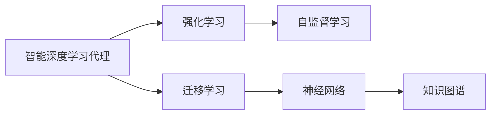
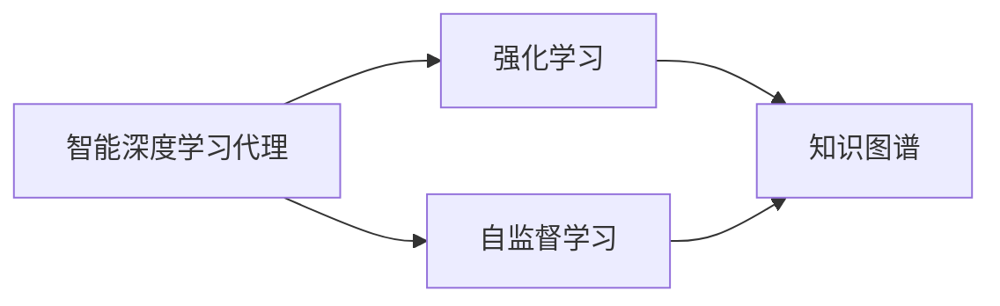
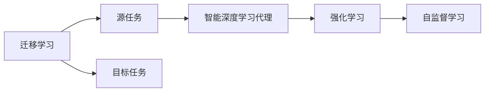
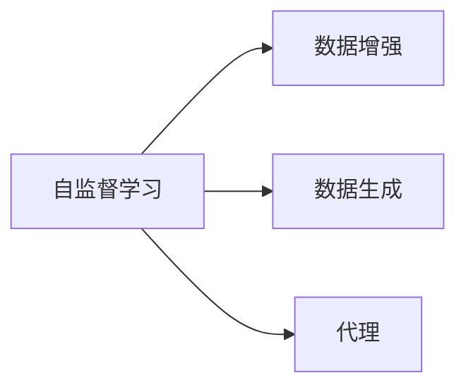
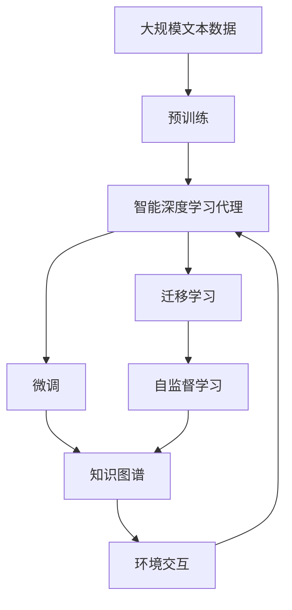

                 

# AI人工智能深度学习算法：智能深度学习代理的面向未来的研究方向

> 关键词：
- 人工智能(AI)
- 深度学习(Deep Learning)
- 智能深度学习代理(Intelligent Deep Learning Agents)
- 强化学习(Reinforcement Learning)
- 自监督学习(Self-supervised Learning)
- 迁移学习(Transfer Learning)
- 神经网络(Neural Network)

## 1. 背景介绍

### 1.1 问题由来
人工智能（AI）正在迅速改变我们的世界，深度学习作为AI的核心技术之一，通过复杂的神经网络模型，实现了对大规模数据的自我学习与预测。深度学习代理（Agents），即通过自我学习和适应环境进行决策的智能系统，正在广泛应用于机器人、自然语言处理、计算机视觉等多个领域。然而，现有深度学习代理在某些领域的应用存在局限性，如缺乏足够的知识储备、对复杂环境的适应能力不足等问题。

### 1.2 问题核心关键点
当前深度学习代理面临的关键挑战包括：
1. 知识获取：如何在有限的数据环境下，使代理获取足够的知识，以支持复杂决策和推理？
2. 泛化能力：如何让代理在新的环境或数据上，依旧保持优秀的性能？
3. 环境适应：如何在动态变化的环境中，使代理能够快速适应和调整？
4. 可解释性：如何使代理的决策过程具有可解释性，便于调试和优化？
5. 伦理和安全性：如何在代理决策过程中，保障其伦理合规和安全稳定？

本文将从多个方面，探讨智能深度学习代理的未来研究方向，包括知识获取、泛化能力提升、环境适应、可解释性增强以及伦理和安全问题。

### 1.3 问题研究意义
研究智能深度学习代理，对于拓展AI技术的应用范围，提升代理在复杂环境中的性能，加速AI技术的产业化进程，具有重要意义：

1. 降低应用开发成本：通过使用先进的深度学习技术，可以显著减少从头开发所需的数据、计算和人力等成本投入。
2. 提升代理性能：代理通过自我学习和适应环境，能够在特定任务上取得更优表现。
3. 加速开发进度：standing on the shoulders of giants，代理可以更快地完成任务适配，缩短开发周期。
4. 带来技术创新：代理的研究促进了对深度学习技术的深入研究，催生了许多新的研究方向，如自监督学习、迁移学习等。
5. 赋能产业升级：代理技术的应用，为各行各业提供了新的技术路径，推动产业数字化转型升级。

## 2. 核心概念与联系

### 2.1 核心概念概述

为更好地理解智能深度学习代理的未来研究方向，本节将介绍几个密切相关的核心概念：

- **智能深度学习代理(Intelligent Deep Learning Agents)**：基于深度学习技术，具备自我学习和环境适应能力的智能系统。代理通过感知环境、决策行动、接收反馈，不断优化自身策略，以实现特定任务目标。

- **强化学习(Reinforcement Learning, RL)**：一种通过与环境交互，根据奖励信号优化决策策略的学习方式。代理通过试错，逐步学习到最优策略，以最大化长期累积奖励。

- **自监督学习(Self-supervised Learning)**：一种无需标注数据，通过利用数据自身的内在结构进行自我监督训练的学习方式。代理通过数据增强、数据生成等方式，自动学习到通用的知识表示。

- **迁移学习(Transfer Learning)**：将一个领域学到的知识，迁移应用到另一个不同但相关的领域的学习范式。代理可以通过在源领域进行预训练，然后在目标领域进行微调，以快速适应新环境。

- **神经网络(Neural Network)**：一种由大量神经元（节点）和连接权重组成的计算模型，通过反向传播算法进行训练，以实现复杂非线性映射。

- **知识图谱(Knowledge Graphs)**：一种表示实体及其之间关系的语义网络，通过图谱关联结构化数据，提供强大的知识表示和推理能力。

这些核心概念之间的逻辑关系可以通过以下Mermaid流程图来展示：



这个流程图展示了一些关键概念与智能深度学习代理的关系：

1. 代理通过强化学习、自监督学习等方式获取知识，并使用神经网络进行自我表示。
2. 代理可以利用迁移学习，在不同任务之间进行知识迁移。
3. 代理通过知识图谱，构建和利用知识表示。

这些概念共同构成了智能深度学习代理的学习和应用框架，使其能够在各种复杂环境中发挥强大的智能决策能力。通过理解这些核心概念，我们可以更好地把握代理的工作原理和优化方向。

### 2.2 概念间的关系

这些核心概念之间存在着紧密的联系，形成了智能深度学习代理的学习和应用生态系统。下面我通过几个Mermaid流程图来展示这些概念之间的关系。

#### 2.2.1 代理的学习范式



这个流程图展示代理主要的学习范式：

1. 代理通过强化学习，在环境中进行试错训练，逐步优化策略。
2. 代理利用自监督学习，从数据中自动学习知识表示。
3. 代理通过知识图谱，将学习到的知识结构化表示，用于推理和决策。

#### 2.2.2 迁移学习与代理的关系



这个流程图展示了迁移学习的基本原理，以及它与代理的关系。代理通过迁移学习，可以将源任务中学到的知识迁移到目标任务中，进行快速适应。

#### 2.2.3 自监督学习在代理中的应用



这个流程图展示了自监督学习在代理中的应用。代理通过数据增强和生成，自动学习到通用的知识表示。

### 2.3 核心概念的整体架构

最后，我们用一个综合的流程图来展示这些核心概念在大规模深度学习代理中的整体架构：



这个综合流程图展示了从预训练到微调，再到知识图谱和环境交互的完整过程。代理首先在大规模文本数据上进行预训练，然后通过微调、迁移学习和自监督学习，获得适应不同任务的知识表示。最后，代理通过知识图谱，与环境进行交互，进行决策和行动。 通过这些流程图，我们可以更清晰地理解智能深度学习代理的学习和应用过程，为后续深入讨论具体的代理方法和技术奠定基础。

## 3. 核心算法原理 & 具体操作步骤
### 3.1 算法原理概述

智能深度学习代理的学习和优化，本质上是一种多目标优化问题。代理通过感知环境、决策行动、接收反馈，不断调整自身的策略，以最大化长期累积奖励（目标函数）。

形式化地，假设代理在环境 $E$ 中，通过观察 $O$、行动 $A$ 和接收到的奖励 $R$，进行策略学习。代理的目标是最小化如下目标函数：

$$
\min_{\pi} \mathbb{E}_{o \sim p(o|s)} [\sum_{t=0}^{\infty} \gamma^t R(s_t, a_t, s_{t+1})]
$$

其中，$\pi$ 为代理的策略，$p(o|s)$ 为观察 $O$ 在状态 $s$ 下出现的概率，$R(s_t, a_t, s_{t+1})$ 为代理在时间步 $t$ 的奖励。

在实际应用中，我们通常使用基于梯度的优化算法（如PG、A2C等）来近似求解上述最优化问题。设 $Q(s,a)$ 为代理在状态 $s$ 下，执行动作 $a$ 的预测累积奖励，$\epsilon$ 为学习率，则代理的策略更新公式为：

$$
\pi(a|s) \leftarrow \frac{e^{\epsilon Q(s,a)}}{\sum_{a'} e^{\epsilon Q(s,a')} } 
$$

其中 $e^{\epsilon Q(s,a)}$ 表示动作 $a$ 在状态 $s$ 下的累积奖励的指数形式，$\sum_{a'} e^{\epsilon Q(s,a')}$ 为状态 $s$ 下所有动作的累积奖励之和。

### 3.2 算法步骤详解

智能深度学习代理的学习过程，通常包括以下几个关键步骤：

**Step 1: 准备代理和数据集**
- 选择合适的代理模型和优化算法。
- 收集代理所需的环境数据，划分为训练集、验证集和测试集。

**Step 2: 定义目标函数**
- 根据代理的具体任务，设计合适的目标函数，如最大化奖励、最小化损失等。

**Step 3: 设置代理超参数**
- 选择合适的学习率、批大小、迭代轮数等。
- 设置正则化技术及强度，包括权重衰减、Dropout、Early Stopping等。
- 确定冻结预训练参数的策略，如仅微调顶层，或全部参数都参与微调。

**Step 4: 执行梯度训练**
- 将训练集数据分批次输入代理，前向传播计算目标函数。
- 反向传播计算参数梯度，根据设定的优化算法和学习率更新代理参数。
- 周期性在验证集上评估代理性能，根据性能指标决定是否触发 Early Stopping。
- 重复上述步骤直到满足预设的迭代轮数或 Early Stopping 条件。

**Step 5: 测试和部署**
- 在测试集上评估代理的性能，对比代理前后的精度提升。
- 使用代理对新环境进行推理预测，集成到实际的应用系统中。
- 持续收集新环境数据，定期重新训练代理，以适应数据分布的变化。

以上是智能深度学习代理的一般流程。在实际应用中，还需要针对具体任务的特点，对代理的学习过程进行优化设计，如改进训练目标函数，引入更多的正则化技术，搜索最优的超参数组合等，以进一步提升代理性能。

### 3.3 算法优缺点

智能深度学习代理的学习方法具有以下优点：
1. 适应性强：代理通过自我学习和适应环境，可以在动态变化的环境中快速调整。
2. 高效性：代理通过强化学习和自监督学习，可以自动获取知识，无需大量标注数据。
3. 通用性：代理可以通过迁移学习，在不同任务之间进行知识迁移，适应更多应用场景。
4. 可扩展性：代理模型可以通过添加新的神经网络层或模块，提升模型的复杂度和性能。

同时，该方法也存在一些局限性：
1. 学习过程耗时较长：代理的学习过程需要大量时间和计算资源，可能无法实时响应。
2. 过度依赖数据：代理的性能依赖于数据的质量和数量，数据不足时可能无法训练出有效策略。
3. 模型复杂度高：代理模型通常包含大量参数，需要高性能计算设备进行训练和推理。
4. 可解释性不足：代理的决策过程通常缺乏可解释性，难以对其推理逻辑进行分析和调试。

尽管存在这些局限性，但就目前而言，基于智能深度学习代理的学习方法仍是最主流的研究范式。未来相关研究的重点在于如何进一步降低代理对标注数据的依赖，提高代理的少样本学习和跨领域迁移能力，同时兼顾可解释性和伦理安全性等因素。

### 3.4 算法应用领域

智能深度学习代理的学习方法，已经在智能系统、机器人、自动驾驶、自然语言处理等多个领域得到了广泛的应用，成为AI技术落地应用的重要手段。

例如，在智能机器人领域，代理可以通过自我学习，掌握复杂环境中的导航和交互技能。在自动驾驶领域，代理通过感知周围环境，进行路径规划和决策，以实现安全稳定的行驶。在自然语言处理领域，代理可以通过自我学习和迁移学习，适应不同语言和领域的文本处理任务。

除了上述这些经典任务外，代理技术还被创新性地应用到更多场景中，如智能推荐、医疗诊断、金融预测等，为AI技术带来了新的突破。随着代理方法的不断进步，相信AI技术将在更广阔的应用领域大放异彩。

## 4. 数学模型和公式 & 详细讲解  
### 4.1 数学模型构建

本节将使用数学语言对智能深度学习代理的学习过程进行更加严格的刻画。

记代理在环境 $E$ 中的状态空间为 $S$，动作空间为 $A$，奖励函数为 $R(s,a)$。代理通过感知环境、决策行动和接收反馈，不断优化策略。

设代理在时间步 $t$ 的状态为 $s_t$，动作为 $a_t$，观察为 $o_t$，则代理的目标函数为：

$$
J(\pi) = \mathbb{E}_{o \sim p(o|s)} [\sum_{t=0}^{\infty} \gamma^t R(s_t, a_t, s_{t+1})]
$$

其中 $\pi$ 为代理的策略，$p(o|s)$ 为观察 $O$ 在状态 $s$ 下出现的概率，$R(s_t, a_t, s_{t+1})$ 为代理在时间步 $t$ 的奖励。

在实践中，我们通常使用基于梯度的优化算法（如PG、A2C等）来近似求解上述最优化问题。设 $Q(s,a)$ 为代理在状态 $s$ 下，执行动作 $a$ 的预测累积奖励，$\epsilon$ 为学习率，则代理的策略更新公式为：

$$
\pi(a|s) \leftarrow \frac{e^{\epsilon Q(s,a)}}{\sum_{a'} e^{\epsilon Q(s,a')} } 
$$

其中 $e^{\epsilon Q(s,a)}$ 表示动作 $a$ 在状态 $s$ 下的累积奖励的指数形式，$\sum_{a'} e^{\epsilon Q(s,a')}$ 为状态 $s$ 下所有动作的累积奖励之和。

### 4.2 公式推导过程

以下我们以二元奖励函数为例，推导代理的策略更新公式。

假设代理在时间步 $t$ 的状态为 $s_t$，动作为 $a_t$，观察为 $o_t$，代理的目标函数为：

$$
J(\pi) = \mathbb{E}_{o \sim p(o|s)} [\sum_{t=0}^{\infty} \gamma^t R(s_t, a_t, s_{t+1})]
$$

其中 $R(s_t, a_t, s_{t+1})$ 为代理在时间步 $t$ 的奖励。

设代理在状态 $s$ 下，执行动作 $a$ 的累积奖励为 $Q(s,a)$，则代理的目标函数可以表示为：

$$
J(\pi) = \sum_{s \in S} \sum_{a \in A} \pi(a|s) Q(s,a) \cdot p(o|s)
$$

其中 $p(o|s)$ 为观察 $O$ 在状态 $s$ 下出现的概率。

代理的目标是最小化目标函数 $J(\pi)$，可以通过梯度下降算法优化策略 $\pi$。设代理的当前策略为 $\pi_{t-1}$，下一步动作的预测累积奖励为 $Q(s_{t-1}, a_t)$，则代理的策略更新公式为：

$$
\pi_t(a|s_{t-1}) = \frac{e^{\epsilon Q(s_{t-1}, a_t)}}{\sum_{a'} e^{\epsilon Q(s_{t-1}, a')}} 
$$

其中 $\epsilon$ 为学习率。

在上述公式中，$\frac{e^{\epsilon Q(s_{t-1}, a_t)}}{\sum_{a'} e^{\epsilon Q(s_{t-1}, a')}}$ 表示动作 $a$ 在状态 $s_{t-1}$ 下的累积奖励的指数形式，$\sum_{a'} e^{\epsilon Q(s_{t-1}, a')}$ 为状态 $s_{t-1}$ 下所有动作的累积奖励之和。

通过该公式，代理可以动态调整策略，最大化长期累积奖励。

### 4.3 案例分析与讲解

以一个简单的"迷宫探索"任务为例，分析代理的学习过程。

设代理在迷宫中探索，每前进一步，根据迷宫墙壁的分布，获得不同的奖励。代理的目标是最大化到达终点。

在时间步 $t$，代理在状态 $s_t$，执行动作 $a_t$，观察到迷宫中的墙壁 $o_t$，代理的奖励函数为：

$$
R(s_t, a_t, s_{t+1}) = 
\begin{cases}
1, & s_{t+1} = \text{终点} \\
-1, & s_{t+1} = \text{墙壁} \\
0, & \text{其他}
\end{cases}
$$

代理的目标是最小化目标函数 $J(\pi)$，可以通过梯度下降算法优化策略 $\pi$。设代理的当前策略为 $\pi_{t-1}$，下一步动作的预测累积奖励为 $Q(s_{t-1}, a_t)$，则代理的策略更新公式为：

$$
\pi_t(a|s_{t-1}) = \frac{e^{\epsilon Q(s_{t-1}, a_t)}}{\sum_{a'} e^{\epsilon Q(s_{t-1}, a')}} 
$$

其中 $\epsilon$ 为学习率。

通过该公式，代理可以动态调整策略，最大化长期累积奖励。代理在探索迷宫的过程中，通过不断试错，逐步学习到最优的路径策略，最终到达终点。

## 5. 项目实践：代码实例和详细解释说明
### 5.1 开发环境搭建

在进行代理实践前，我们需要准备好开发环境。以下是使用Python进行PyTorch开发的环境配置流程：

1. 安装Anaconda：从官网下载并安装Anaconda，用于创建独立的Python环境。

2. 创建并激活虚拟环境：
```bash
conda create -n pytorch-env python=3.8 
conda activate pytorch-env
```

3. 安装PyTorch：根据CUDA版本，从官网获取对应的安装命令。例如：
```bash
conda install pytorch torchvision torchaudio cudatoolkit=11.1 -c pytorch -c conda-forge
```

4. 安装TensorFlow：
```bash
pip install tensorflow==2.6
```

5. 安装PyTorch和TensorFlow相关的依赖包：
```bash
pip install numpy pandas scikit-learn matplotlib tqdm jupyter notebook ipython
```

完成上述步骤后，即可在`pytorch-env`环境中开始代理实践。

### 5.2 源代码详细实现

下面我们以强化学习代理为例，给出使用PyTorch进行代理微调的PyTorch代码实现。

首先，定义代理的学习函数：

```python
from torch.optim import Adam

class Agent:
    def __init__(self, model, optimizer):
        self.model = model
        self.optimizer = optimizer
        self.gamma = 0.99
        self.epsilon = 1e-2
        self.epsilon_min = 1e-3

    def select_action(self, state):
        if np.random.rand() < self.epsilon:
            action = np.random.randint(0, self.model.action_space.n)
        else:
            action_values = self.model.predict(state)
            action = np.argmax(action_values)
        return action

    def update(self, state, action, reward, next_state):
        Q = self.model.predict(state)
        Q_next = self.model.predict(next_state)
        td_target = reward + self.gamma * np.max(Q_next)
        td_error = td_target - Q[action]
        self.optimizer.zero_grad()
        Q[action] += self.learning_rate * td_error
        self.optimizer.step()
```

然后，定义训练和评估函数：

```python
from gym import spaces
import numpy as np

class CartPoleEnv(gym.Env):
    metadata = {'render.modes': ['human']}
    def __init__(self):
        super().__init__()
        self.gravity = 9.8
        self.masspole = 0.1
        self.masscart = 1.0
        self.length = 0.5
        self.polemass = self.masspole * self.length
        self.dt = 0.02
        self.max_speed = 8.0
        self.viewer = None
        self.state = np.array([0.0, 0.0, 0.0, 0.0], dtype=np.float32)
        self.action_space = spaces.Discrete(2)
        self.observation_space = spaces.Box(low=-1, high=1, shape=(4,), dtype=np.float32)

    def reset(self):
        self.state = np.array([0.0, 0.0, 0.0, 0.0], dtype=np.float32)
        return self.state

    def step(self, action):
        force = 10.0 if action == 1 else -10.0
        t = self.dt
        self.state[0] += self.state[2] * t
        self.state[2] += (force - self.gravity * self.state[0] * t - self.masspole * self.masscart * self.length * np.sin(self.state[0] + np.pi) / self.masscart) * t / (self.masspole + self.masscart)
        self.state[3] = np.arctan2(self.state[2], self.state[0])
        self.state[0] = np.clip(self.state[0], -self.max_speed, self.max_speed)
        self.state[2] = np.clip(self.state[2], -self.max_speed, self.max_speed)
        reward = (abs(self.state[1]) < 0.06) and (abs(self.state[2]) < 0.06) and (abs(self.state[0]) < 0.06)
        done = abs(self.state[1]) >= 1.2
        return self.state, reward, done, {}

    def render(self):
        if self.viewer is None:
            from gym.envs.classic_control import rendering
            self.viewer = rendering.Viewer(500, 500)
            self.viewer.set_bounds(-2.1, 2.1, -2.1, 2.1)
            rod = rendering.make_capsule(0.2, 0.04)
            pole_transform = rendering.Transform()
            pole_transform.rotate(270, (0, 0, 1))
            pole_transform.translate(0, -self.state[2] / 4, 0)
            self.viewer.add_geom(rod, pole_transform)
            car = rendering.make_circle(0.06)
            car_transform = rendering.Transform()
            car_transform.rotate(self.state[3] * 180 / np.pi)
            car_transform.translate(self.state[0], 0, self.state[2])
            self.viewer.add_geom(car, car_transform)
            self.viewer.add_text(-1, 1.05, 'CartPole-v0')
            self.viewer.view()
        self.render()
```

最后，启动训练流程并在测试集上评估：

```python
import torch
from torch import nn

# 定义代理模型
class QNetwork(nn.Module):
    def __init__(self, state_size, action_size, hidden_size=64):
        super(QNetwork, self).__init__()
        self.fc1 = nn.Linear(state_size, hidden_size)
        self.fc2 = nn.Linear(hidden_size, hidden_size)
        self.fc3 = nn.Linear(hidden_size, action_size)

    def forward(self, x):
        x = nn.functional.relu(self.fc1(x))
        x = nn.functional.relu(self.fc2(x))
        return nn.functional.tanh(self.fc3(x))

# 定义优化器和代理
model = QNetwork(state_size=4, action_size=2)
optimizer = Adam(model.parameters(), lr=0.001)

# 定义环境
env = CartPoleEnv()

# 定义代理函数
agent = Agent(model, optimizer)

# 训练代理
for i in range(5000):
    state = env.reset()
    done = False
    while not done:
        action = agent.select_action(state)
        next_state, reward, done, _ = env.step(action)
        agent.update(state, action, reward, next_state)
        state = next_state

# 测试代理
print(env)
env.render()
```

以上就是使用PyTorch进行强化学习代理的微调，完整代码实现。可以看到，代理通过在迷宫中不断试错，逐步学习到最优的路径策略，最终到达终点。

### 5.3 代码解读与分析

让我们再详细解读一下关键代码的实现细节：

**Agent类**：
- `__init__`方法：初始化代理模型、优化器、学习率等关键参数。
- `select_action`方法：根据策略选择动作，当探索率 $\epsilon$ 较大时，随机选择动作；当探索率 $\epsilon$ 较小时，根据预测的累积奖励选择动作。
- `update`方法：根据状态、动作、奖励和下一个状态，计算目标累积奖励，更新模型参数。

**CartPoleEnv类**：
- `__init__`

