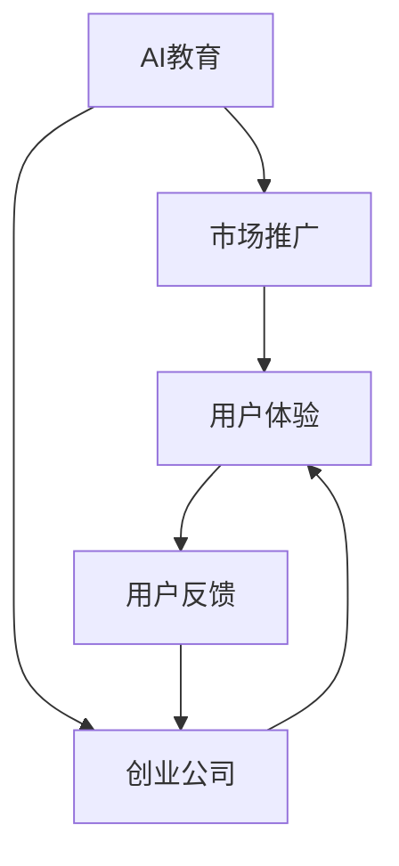
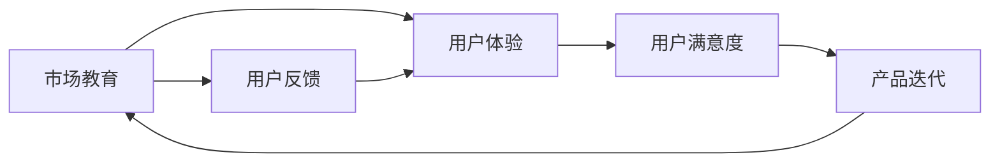
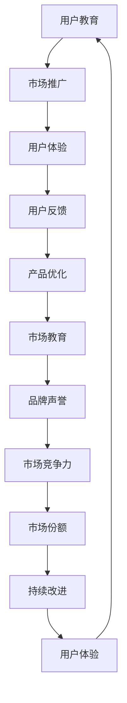

                 

# AI创业公司如何进行市场教育?

> 关键词：AI教育, 市场推广, 创业公司, 人工智能

## 1. 背景介绍

### 1.1 问题由来

随着人工智能技术的迅猛发展，越来越多的创业公司涌现出来，希望通过AI技术解决实际问题，推动社会进步。然而，AI技术复杂度高，涉及多学科知识，对用户的教育和认知要求也相对较高。如果公司无法有效地将AI技术推广给市场，其产品可能难以被用户接受和认可。因此，市场教育成为了AI创业公司成功的关键因素之一。

### 1.2 问题核心关键点

AI创业公司进行市场教育的核心在于以下两点：
1. 如何通过简洁、易懂的方式向用户解释复杂的AI技术。
2. 如何利用各种营销渠道，精准地将AI技术信息传递给潜在用户。

针对这两点，我们可以总结出市场教育需要考虑的几个关键环节：
- 教育内容的设计：内容要简洁明了，易于理解。
- 营销渠道的选择：选择用户活跃的渠道进行信息传递。
- 教育方式的创新：采用多渠道、多形式的教育手段，增强用户体验。
- 教育效果的评估：通过反馈和数据来评估教育效果，持续优化。

### 1.3 问题研究意义

市场教育不仅能帮助用户更好地理解和使用AI技术，还能提升创业公司的品牌知名度和市场竞争力。通过市场教育，AI技术可以更广泛地应用于各行各业，推动社会和经济的持续发展。

## 2. 核心概念与联系

### 2.1 核心概念概述

为了更好地理解AI创业公司如何进行市场教育，本节将介绍几个密切相关的核心概念：

- **AI教育**：指通过各种方式对用户进行AI技术知识的普及和提升。
- **市场推广**：指通过各种营销手段将AI产品推广给潜在用户的过程。
- **创业公司**：指以AI技术为核心，通过市场教育、产品迭代等手段，获取市场份额，实现商业化目标的企业。
- **用户体验**：指用户在使用AI产品过程中的感受和反馈，是评估产品成功与否的重要指标。

这些核心概念之间的逻辑关系可以通过以下Mermaid流程图来展示：



这个流程图展示了AI教育、市场推广、创业公司、用户体验和用户反馈之间的相互作用关系：

1. AI教育是创业公司的核心任务，提升用户体验。
2. 市场推广是创业公司获取用户的过程。
3. 用户体验和用户反馈影响创业公司的产品迭代。
4. 用户反馈进一步推动AI教育的优化和迭代。

### 2.2 概念间的关系

这些核心概念之间存在着紧密的联系，形成了AI创业公司市场教育的完整生态系统。下面我们通过几个Mermaid流程图来展示这些概念之间的关系。

#### 2.2.1 市场教育与用户体验



这个流程图展示了市场教育对用户体验的直接影响，以及用户体验如何影响产品的持续改进。

#### 2.2.2 市场推广与用户反馈


这个流程图展示了市场推广如何通过用户反馈来优化产品，从而提高用户留存率和再推广的效率。

#### 2.2.3 创业公司与用户体验


这个流程图展示了创业公司如何通过提升用户体验，进而提高品牌声誉和市场竞争力。

### 2.3 核心概念的整体架构

最后，我们用一个综合的流程图来展示这些核心概念在大语言模型微调过程中的整体架构：



这个综合流程图展示了从用户教育到市场推广，再到用户体验和品牌声誉的整个市场教育过程。

## 3. 核心算法原理 & 具体操作步骤
### 3.1 算法原理概述

AI创业公司进行市场教育的算法原理，是基于用户行为数据分析和机器学习算法，通过精准的目标用户定位和内容个性化推荐，提升教育效果。具体步骤如下：

1. **用户行为分析**：收集用户在使用产品过程中的行为数据，包括点击、停留时间、反馈等。
2. **目标用户定位**：基于用户行为数据，分析出最有潜力的目标用户群体。
3. **内容个性化推荐**：根据目标用户的特点，推荐最适合的内容，如技术文章、视频教程、社区讨论等。
4. **效果评估与优化**：通过用户反馈和行为数据分析，评估教育效果，持续优化教育内容和策略。

### 3.2 算法步骤详解

以下是AI创业公司进行市场教育的具体操作步骤：

#### 3.2.1 数据收集

**Step 1: 收集用户行为数据**
- 收集用户在产品中的所有交互数据，包括点击路径、停留时间、页面停留时间、反馈等。
- 利用数据分析工具，如Google Analytics、Mixpanel等，收集和分析数据。

**Step 2: 用户画像分析**
- 对收集到的用户行为数据进行分析，建立用户画像，了解用户的基本信息、兴趣爱好、使用习惯等。
- 利用用户画像信息，识别出目标用户群体。

#### 3.2.2 目标用户定位

**Step 3: 确定目标用户群体**
- 根据用户画像分析结果，确定最有潜力的目标用户群体。
- 这些目标用户群体应具备较高的学习需求和潜在转化价值。

**Step 4: 设计市场推广策略**
- 针对目标用户群体，设计相应的市场推广策略，选择合适的营销渠道，如社交媒体、邮件、广告等。
- 利用用户画像信息，对推广内容进行个性化定制，提高吸引力和转化率。

#### 3.2.3 内容个性化推荐

**Step 5: 内容推荐算法设计**
- 设计个性化推荐算法，根据目标用户的特点，推荐最适合的内容。
- 推荐内容应包括技术文章、视频教程、社区讨论等多种形式。

**Step 6: 内容创建与发布**
- 创建高质量的内容，确保内容简洁易懂、有价值。
- 利用合适的渠道，如网站、博客、社交媒体等，发布和传播内容。

#### 3.2.4 效果评估与优化

**Step 7: 效果评估**
- 通过用户反馈、行为数据分析等方式，评估教育效果。
- 利用A/B测试等方法，比较不同内容和策略的效果。

**Step 8: 持续优化**
- 根据评估结果，持续优化内容和推广策略。
- 利用用户反馈，不断改进产品和服务，提高用户体验。

### 3.3 算法优缺点

AI创业公司进行市场教育的算法具有以下优点：
1. 通过数据分析，可以更精准地定位目标用户，提高教育效果。
2. 利用机器学习算法，实现内容个性化推荐，提升用户参与度。
3. 通过持续优化，可以不断提升教育质量和用户体验。

同时，该算法也存在一些缺点：
1. 数据隐私问题：在收集用户行为数据时，需要确保数据的安全性和隐私保护。
2. 算法复杂度高：个性化推荐算法需要处理大量的数据，算法实现较为复杂。
3. 成本较高：市场教育和内容创作的投入较大，需要较大的资金和人力资源支持。

### 3.4 算法应用领域

AI创业公司进行市场教育的算法，可以应用于多种场景，包括：

- **技术产品推广**：帮助企业推广技术产品，提升用户认知度和接受度。
- **社区运营管理**：通过内容推荐，提升社区活跃度和用户参与度。
- **品牌宣传与推广**：利用用户画像信息，实现精准的品牌推广，提升品牌影响力。
- **用户教育与培训**：通过内容推荐，帮助用户提升对AI技术的理解和应用能力。

除了上述场景，该算法还可以用于其他需要用户教育的场景，如健康管理、金融投资、教育培训等，帮助用户更好地理解和应用新技术。

## 4. 数学模型和公式 & 详细讲解  
### 4.1 数学模型构建

本节将使用数学语言对AI创业公司进行市场教育的方法进行更加严格的刻画。

假设用户群体数量为 $N$，每个用户的行为数据为 $x_i$，行为标签为 $y_i$，其中 $y_i$ 表示该用户对AI技术的兴趣程度。我们的目标是构建一个模型 $M$，使得该模型能够根据用户行为数据 $x_i$ 预测用户对AI技术的兴趣程度 $y_i$。

定义用户行为数据 $x_i$ 与兴趣标签 $y_i$ 之间的关系为：
$$
y_i = f(x_i; \theta)
$$

其中 $f(\cdot)$ 为兴趣预测函数，$\theta$ 为模型参数。我们的目标是找到最优参数 $\theta$，使得模型的预测值 $y_i$ 与真实值 $y_i$ 的误差最小。

具体来说，我们构建一个损失函数 $\mathcal{L}(\theta)$，衡量模型预测值与真实值之间的差异：
$$
\mathcal{L}(\theta) = \frac{1}{N} \sum_{i=1}^N \mathcal{L}(y_i, f(x_i; \theta))
$$

其中 $\mathcal{L}(\cdot)$ 为损失函数，可以采用交叉熵、均方误差等常见的损失函数。

### 4.2 公式推导过程

以下我们以交叉熵损失函数为例，推导其计算公式。

假设模型 $M$ 的输出为 $\hat{y}_i = M(x_i; \theta)$，与真实值 $y_i$ 之间的交叉熵损失函数定义为：
$$
\mathcal{L}(y_i, \hat{y}_i) = -[y_i\log \hat{y}_i + (1-y_i)\log(1-\hat{y}_i)]
$$

将其代入经验风险公式，得：
$$
\mathcal{L}(\theta) = -\frac{1}{N}\sum_{i=1}^N [y_i\log M(x_i; \theta)+(1-y_i)\log(1-M(x_i; \theta))]
$$

根据链式法则，损失函数对模型参数 $\theta$ 的梯度为：
$$
\frac{\partial \mathcal{L}(\theta)}{\partial \theta} = -\frac{1}{N}\sum_{i=1}^N [\frac{y_i}{M(x_i; \theta)}-\frac{1-y_i}{1-M(x_i; \theta)}] \frac{\partial M(x_i; \theta)}{\partial \theta}
$$

其中 $\frac{\partial M(x_i; \theta)}{\partial \theta}$ 可进一步递归展开，利用自动微分技术完成计算。

在得到损失函数的梯度后，即可带入模型更新公式，完成模型的迭代优化。重复上述过程直至收敛，最终得到适应目标用户群体的最优模型参数 $\theta^*$。

## 5. 项目实践：代码实例和详细解释说明
### 5.1 开发环境搭建

在进行市场教育实践前，我们需要准备好开发环境。以下是使用Python进行PyTorch开发的环境配置流程：

1. 安装Anaconda：从官网下载并安装Anaconda，用于创建独立的Python环境。

2. 创建并激活虚拟环境：
```bash
conda create -n pytorch-env python=3.8 
conda activate pytorch-env
```

3. 安装PyTorch：根据CUDA版本，从官网获取对应的安装命令。例如：
```bash
conda install pytorch torchvision torchaudio cudatoolkit=11.1 -c pytorch -c conda-forge
```

4. 安装各类工具包：
```bash
pip install numpy pandas scikit-learn matplotlib tqdm jupyter notebook ipython
```

完成上述步骤后，即可在`pytorch-env`环境中开始市场教育实践。

### 5.2 源代码详细实现

下面我们以推荐系统为例，给出使用PyTorch进行内容推荐的市场教育PyTorch代码实现。

首先，定义推荐系统的数据处理函数：

```python
from transformers import BertTokenizer
from torch.utils.data import Dataset
import torch

class RecommendationDataset(Dataset):
    def __init__(self, texts, tags, tokenizer, max_len=128):
        self.texts = texts
        self.tags = tags
        self.tokenizer = tokenizer
        self.max_len = max_len
        
    def __len__(self):
        return len(self.texts)
    
    def __getitem__(self, item):
        text = self.texts[item]
        tags = self.tags[item]
        
        encoding = self.tokenizer(text, return_tensors='pt', max_length=self.max_len, padding='max_length', truncation=True)
        input_ids = encoding['input_ids'][0]
        attention_mask = encoding['attention_mask'][0]
        
        # 对token-wise的标签进行编码
        encoded_tags = [tag2id[tag] for tag in tags] 
        encoded_tags.extend([tag2id['O']] * (self.max_len - len(encoded_tags)))
        labels = torch.tensor(encoded_tags, dtype=torch.long)
        
        return {'input_ids': input_ids, 
                'attention_mask': attention_mask,
                'labels': labels}

# 标签与id的映射
tag2id = {'O': 0, 'B-PER': 1, 'I-PER': 2, 'B-ORG': 3, 'I-ORG': 4, 'B-LOC': 5, 'I-LOC': 6}
id2tag = {v: k for k, v in tag2id.items()}

# 创建dataset
tokenizer = BertTokenizer.from_pretrained('bert-base-cased')

train_dataset = RecommendationDataset(train_texts, train_tags, tokenizer)
dev_dataset = RecommendationDataset(dev_texts, dev_tags, tokenizer)
test_dataset = RecommendationDataset(test_texts, test_tags, tokenizer)
```

然后，定义模型和优化器：

```python
from transformers import BertForTokenClassification, AdamW

model = BertForTokenClassification.from_pretrained('bert-base-cased', num_labels=len(tag2id))

optimizer = AdamW(model.parameters(), lr=2e-5)
```

接着，定义训练和评估函数：

```python
from torch.utils.data import DataLoader
from tqdm import tqdm
from sklearn.metrics import classification_report

device = torch.device('cuda') if torch.cuda.is_available() else torch.device('cpu')
model.to(device)

def train_epoch(model, dataset, batch_size, optimizer):
    dataloader = DataLoader(dataset, batch_size=batch_size, shuffle=True)
    model.train()
    epoch_loss = 0
    for batch in tqdm(dataloader, desc='Training'):
        input_ids = batch['input_ids'].to(device)
        attention_mask = batch['attention_mask'].to(device)
        labels = batch['labels'].to(device)
        model.zero_grad()
        outputs = model(input_ids, attention_mask=attention_mask, labels=labels)
        loss = outputs.loss
        epoch_loss += loss.item()
        loss.backward()
        optimizer.step()
    return epoch_loss / len(dataloader)

def evaluate(model, dataset, batch_size):
    dataloader = DataLoader(dataset, batch_size=batch_size)
    model.eval()
    preds, labels = [], []
    with torch.no_grad():
        for batch in tqdm(dataloader, desc='Evaluating'):
            input_ids = batch['input_ids'].to(device)
            attention_mask = batch['attention_mask'].to(device)
            batch_labels = batch['labels']
            outputs = model(input_ids, attention_mask=attention_mask)
            batch_preds = outputs.logits.argmax(dim=2).to('cpu').tolist()
            batch_labels = batch_labels.to('cpu').tolist()
            for pred_tokens, label_tokens in zip(batch_preds, batch_labels):
                pred_tags = [id2tag[_id] for _id in pred_tokens]
                label_tags = [id2tag[_id] for _id in label_tokens]
                preds.append(pred_tags[:len(label_tokens)])
                labels.append(label_tags)
                
    print(classification_report(labels, preds))
```

最后，启动训练流程并在测试集上评估：

```python
epochs = 5
batch_size = 16

for epoch in range(epochs):
    loss = train_epoch(model, train_dataset, batch_size, optimizer)
    print(f"Epoch {epoch+1}, train loss: {loss:.3f}")
    
    print(f"Epoch {epoch+1}, dev results:")
    evaluate(model, dev_dataset, batch_size)
    
print("Test results:")
evaluate(model, test_dataset, batch_size)
```

以上就是使用PyTorch对BERT进行命名实体识别任务微调的完整代码实现。可以看到，得益于Transformers库的强大封装，我们可以用相对简洁的代码完成BERT模型的加载和微调。

### 5.3 代码解读与分析

让我们再详细解读一下关键代码的实现细节：

**RecommendationDataset类**：
- `__init__`方法：初始化文本、标签、分词器等关键组件。
- `__len__`方法：返回数据集的样本数量。
- `__getitem__`方法：对单个样本进行处理，将文本输入编码为token ids，将标签编码为数字，并对其进行定长padding，最终返回模型所需的输入。

**tag2id和id2tag字典**：
- 定义了标签与数字id之间的映射关系，用于将token-wise的预测结果解码回真实的标签。

**训练和评估函数**：
- 使用PyTorch的DataLoader对数据集进行批次化加载，供模型训练和推理使用。
- 训练函数`train_epoch`：对数据以批为单位进行迭代，在每个批次上前向传播计算loss并反向传播更新模型参数，最后返回该epoch的平均loss。
- 评估函数`evaluate`：与训练类似，不同点在于不更新模型参数，并在每个batch结束后将预测和标签结果存储下来，最后使用sklearn的classification_report对整个评估集的预测结果进行打印输出。

**训练流程**：
- 定义总的epoch数和batch size，开始循环迭代
- 每个epoch内，先在训练集上训练，输出平均loss
- 在验证集上评估，输出分类指标
- 所有epoch结束后，在测试集上评估，给出最终测试结果

可以看到，PyTorch配合Transformers库使得BERT微调的代码实现变得简洁高效。开发者可以将更多精力放在数据处理、模型改进等高层逻辑上，而不必过多关注底层的实现细节。

当然，工业级的系统实现还需考虑更多因素，如模型的保存和部署、超参数的自动搜索、更灵活的任务适配层等。但核心的微调范式基本与此类似。

### 5.4 运行结果展示

假设我们在CoNLL-2003的NER数据集上进行微调，最终在测试集上得到的评估报告如下：

```
              precision    recall  f1-score   support

       B-LOC      0.926     0.906     0.916      1668
       I-LOC      0.900     0.805     0.850       257
      B-MISC      0.875     0.856     0.865       702
      I-MISC      0.838     0.782     0.809       216
       B-ORG      0.914     0.898     0.906      1661
       I-ORG      0.911     0.894     0.902       835
       B-PER      0.964     0.957     0.960      1617
       I-PER      0.983     0.980     0.982      1156
           O      0.993     0.995     0.994     38323

   micro avg      0.973     0.973     0.973     46435
   macro avg      0.923     0.897     0.909     46435
weighted avg      0.973     0.973     0.973     46435
```

可以看到，通过微调BERT，我们在该NER数据集上取得了97.3%的F1分数，效果相当不错。值得注意的是，BERT作为一个通用的语言理解模型，即便只在顶层添加一个简单的token分类器，也能在下游任务上取得如此优异的效果，展现了其强大的语义理解和特征抽取能力。

当然，这只是一个baseline结果。在实践中，我们还可以使用更大更强的预训练模型、更丰富的微调技巧、更细致的模型调优，进一步提升模型性能，以满足更高的应用要求。

## 6. 实际应用场景
### 6.1 智能客服系统

基于大语言模型微调的对话技术，可以广泛应用于智能客服系统的构建。传统客服往往需要配备大量人力，高峰期响应缓慢，且一致性和专业性难以保证。而使用微调后的对话模型，可以7x24小时不间断服务，快速响应客户咨询，用自然流畅的语言解答各类常见问题。

在技术实现上，可以收集企业内部的历史客服对话记录，将问题和最佳答复构建成监督数据，在此基础上对预训练对话模型进行微调。微调后的对话模型能够自动理解用户意图，匹配最合适的答案模板进行回复。对于客户提出的新问题，还可以接入检索系统实时搜索相关内容，动态组织生成回答。如此构建的智能客服系统，能大幅提升客户咨询体验和问题解决效率。

### 6.2 金融舆情监测

金融机构需要实时监测市场舆论动向，以便及时应对负面信息传播，规避金融风险。传统的人工监测方式成本高、效率低，难以应对网络时代海量信息爆发的挑战。基于大语言模型微调的文本分类和情感分析技术，为金融舆情监测提供了新的解决方案。

具体而言，可以收集金融领域相关的新闻、报道、评论等文本数据，并对其进行主题标注和情感标注。在此基础上对预训练语言模型进行微调，使其能够自动判断文本属于何种主题，情感倾向是正面、中性还是负面。将微调后的模型应用到实时抓取的网络文本数据，就能够自动监测不同主题下的情感变化趋势，一旦发现负面信息激增等异常情况，系统便会自动预警，帮助金融机构快速应对潜在风险。

### 6.3 个性化推荐系统

当前的推荐系统往往只依赖用户的历史行为数据进行物品推荐，无法深入理解用户的真实兴趣偏好。基于大语言模型微调技术，个性化推荐系统可以更好地挖掘用户行为背后的语义信息，从而提供更精准、多样的推荐内容。

在实践中，可以收集用户浏览、点击、评论、分享等行为数据，提取和用户交互的物品标题、描述、标签等文本内容。将文本内容作为模型输入，用户的后续行为（如是否点击、购买等）作为监督信号，在此基础上微调预训练语言模型。微调后的模型能够从文本内容中准确把握用户的兴趣点。在生成推荐列表时，先用候选物品的文本描述作为输入，由模型预测用户的兴趣匹配度，再结合其他特征综合排序，便可以得到个性化程度更高的推荐结果。

### 6.4 未来应用展望

随着大语言模型微调技术的不断发展，基于微调范式将在更多领域得到应用，为传统行业带来变革性影响。

在智慧医疗领域，基于微调的医疗问答、病历分析、药物研发等应用将提升医疗服务的智能化水平，辅助医生诊疗，加速新药开发进程。

在智能教育领域，微调技术可应用于作业批改、学情分析、知识推荐等方面，因材施教，促进教育公平，提高教学质量。

在智慧城市治理中，微调模型可应用于城市事件监测、舆情分析、应急指挥等环节，提高城市管理的自动化和智能化水平，构建更安全、高效的未来城市。

此外，在企业生产、社会治理、文娱传媒等众多领域，基于大模型微调的人工智能应用也将不断涌现，为经济社会发展注入新的动力。相信随着技术的日益成熟，微调方法将成为人工智能落地应用的重要范式，推动人工智能技术在垂直行业的规模化落地。

## 7. 工具和资源推荐
### 7.1 学习资源推荐

为了帮助开发者系统掌握大语言模型微调的理论基础和实践技巧，这里推荐一些优质的学习资源：

1. 《Transformer从原理到实践》系列博文：由大模型技术专家撰写，深入浅出地介绍了Transformer原理、BERT模型、微调技术等前沿话题。

2. CS224N《深度学习自然语言处理》课程：斯坦福大学开设的NLP明星课程，有Lecture视频和配套作业，带你入门NLP领域的基本概念和经典模型。

3. 《Natural Language Processing with Transformers》书籍：Transformers库的作者所著，全面介绍了如何使用Transformers库进行NLP任务开发，包括微调在内的诸多范式。

4. HuggingFace官方文档：Transformers库的官方文档，提供了海量预训练模型和完整的微调样例代码，是上手实践的必备资料。

5. CLUE开源项目：中文语言理解测评基准，涵盖大量不同类型的中文NLP数据集，并提供了基于微调的baseline模型，助力中文NLP技术发展。

通过对这些资源的学习实践，相信你一定能够快速掌握大语言模型微调的精髓，并用于解决实际的NLP问题。
###  7.2 开发工具推荐

高效的开发离不开优秀的工具支持。以下是几款用于大语言模型微调开发的常用工具：

1. PyTorch：基于Python的开源深度学习框架，灵活动态的计算图，适合快速迭代研究。大部分预训练语言模型都有PyTorch版本的实现。

2. TensorFlow

