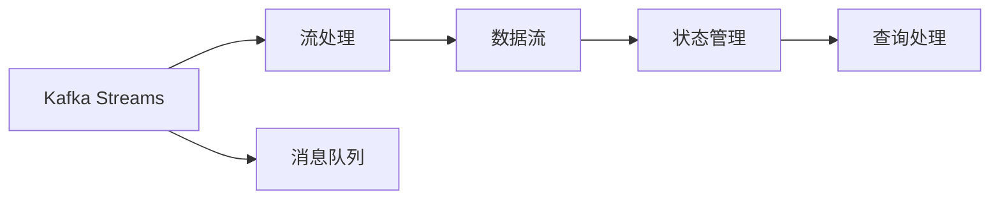

                 

# Kafka Streams原理与代码实例讲解

## 1. 背景介绍

### 1.1 问题由来
随着数据量的激增和业务需求的快速变化，传统的数据处理架构已经难以满足企业对实时数据流处理的需求。大数据处理领域正日益朝着实时化、流式化方向发展。为了应对这一挑战，Apache Kafka及其实时数据流处理组件Kafka Streams应运而生，成为大数据领域的一个重要分支。

Kafka Streams是一个开源的流式数据处理框架，能够以较低成本构建高性能的实时数据流处理应用。它能够实时读取、转换、分析和查询数据流，支持数据的全量及增量流式计算，以及与Kafka平台的完美集成。

## 2. 核心概念与联系

### 2.1 核心概念概述
为了更好地理解Kafka Streams的原理，本节将介绍几个核心概念：

- Kafka Streams：Apache Kafka的流式数据处理组件，可以实时读取和处理Kafka消息，支持复杂的数据流处理任务。
- 流处理（Stream Processing）：以流式数据为输入，基于时间窗口对数据进行聚合、计算和分析，实现数据的实时处理和实时反馈。
- 数据流（Data Stream）：连续不断产生的数据流，可以来自实时生产环境、日志系统、消息队列等。
- 状态管理（State Management）：用于记录中间计算结果的状态，保证数据流处理结果的准确性和一致性。
- 查询处理（Query Processing）：实时查询数据流，支持基于流的SQL查询和聚合计算。

### 2.2 概念间的关系

这些核心概念之间存在着紧密的联系，形成了Kafka Streams的完整数据流处理框架。下面通过一个Mermaid流程图来展示这些概念之间的关系：



这个流程图展示了大语言模型的核心概念及其之间的关系：

1. Kafka Streams：作为数据流处理的核心组件，能够实时读取Kafka消息，进行数据流计算和分析。
2. 流处理：以流式数据为输入，基于时间窗口对数据进行聚合、计算和分析。
3. 数据流：连续不断产生的数据流，可以来自实时生产环境、日志系统、消息队列等。
4. 状态管理：用于记录中间计算结果的状态，保证数据流处理结果的准确性和一致性。
5. 查询处理：实时查询数据流，支持基于流的SQL查询和聚合计算。

## 3. 核心算法原理 & 具体操作步骤

### 3.1 算法原理概述
Kafka Streams的核心算法基于流处理和状态管理的思想，通过并行流处理和状态持久化，实现了高效、可靠、可扩展的数据流处理。其基本原理如下：

- 数据流读取：Kafka Streams从Kafka消息队列中读取数据流，支持全量数据读取和增量数据读取。
- 流处理引擎：Kafka Streams内置了高效的流处理引擎，支持复杂的数据流计算任务，包括聚合、过滤、映射等。
- 状态管理：Kafka Streams提供状态持久化的功能，能够将中间计算结果存储在Kafka中，保证数据流处理结果的一致性。
- 查询处理：Kafka Streams支持实时查询数据流，能够通过SQL查询或API接口快速获取数据流信息。

### 3.2 算法步骤详解
Kafka Streams的基本处理流程包括数据读取、流处理和结果输出三个步骤：

1. **数据读取**：从Kafka消息队列中读取数据流，支持全量数据读取和增量数据读取。

2. **流处理**：通过内置的流处理引擎，对数据流进行聚合、过滤、映射等操作。

3. **结果输出**：将处理结果写入Kafka消息队列或存储系统，实现数据的持久化和查询。

### 3.3 算法优缺点
Kafka Streams具有以下优点：

- 高性能：内置的流处理引擎能够高效处理大规模数据流，支持毫秒级的实时处理。
- 可扩展性：能够自动进行任务并行和数据分区，支持水平扩展。
- 高可靠性：支持状态持久化和数据冗余，保证数据流处理结果的一致性。
- 低延迟：基于内存计算的数据流处理，能够实现低延迟的数据流处理。

同时，Kafka Streams也存在一些局限性：

- 开发难度较高：需要熟悉流处理和状态管理的概念，学习曲线较陡峭。
- 功能限制：虽然功能强大，但某些高级功能需要依赖外部插件或组件。
- 状态管理复杂：状态持久化需要考虑到数据一致性和冗余度，实现较为复杂。

### 3.4 算法应用领域
Kafka Streams适用于各种实时数据流处理场景，如：

- 实时监控：实时监测系统状态、网络流量等，实现告警和故障处理。
- 数据清洗：对实时数据进行清洗、去重和格式化，保证数据质量。
- 数据聚合：对实时数据进行聚合计算，生成统计报表和分析结果。
- 数据过滤：根据业务需求对数据进行过滤和筛选，实现精准的数据处理。
- 实时推荐：对用户行为数据进行实时分析和推荐，提升用户体验。

## 4. 数学模型和公式 & 详细讲解

### 4.1 数学模型构建
Kafka Streams的数学模型主要基于流处理和状态管理的思想，通过时间窗口对数据流进行聚合和计算，实现数据流的实时处理和查询。

假设输入数据流为 $D = (x_1, x_2, \ldots, x_n)$，每个数据项 $x_i$ 表示一个Kafka消息。设 $\Delta t$ 为时间窗口的长度，$w_i$ 表示 $x_i$ 在时间窗口 $[t, t+\Delta t]$ 内的聚合结果。则流处理的数学模型可以表示为：

$$
w_i = \sum_{t=0}^{\Delta t} x_i
$$

其中，$w_i$ 表示 $x_i$ 在时间窗口 $[t, t+\Delta t]$ 内的聚合结果。

### 4.2 公式推导过程
下面通过一个简单的例子来展示流处理的推导过程。假设有一个实时数据流 $D = (1, 2, 3, 4, 5)$，时间窗口长度为 $\Delta t = 2$，则每个时间窗口内的聚合结果为：

- 时间窗口 $[0, 2]$：$w_1 = 1 + 2 = 3$
- 时间窗口 $[2, 4]$：$w_2 = 3 + 4 = 7$
- 时间窗口 $[4, 6]$：$w_3 = 5$

根据流处理的数学模型，可以得出每个时间窗口的聚合结果。

### 4.3 案例分析与讲解
假设有一个电商数据流，实时记录了用户的购买行为。每个数据项 $x_i$ 表示一次购买行为，包括用户ID、商品ID和购买时间。现在需要计算每个用户在一个小时内的购买次数和总金额，可以使用Kafka Streams实现如下：

```python
from kafka import KafkaStreams
from kafka import KafkaConsumer
import time

# 定义Kafka流处理实例
stream = KafkaStreams('user_purchase_stream', bootstrap_servers='localhost:9092', key_deserializer=str.decode, value_deserializer=str.decode, partitions_per_topic=2)

# 定义流处理函数
def process_record(record):
    user_id = record[0]
    product_id = record[1]
    purchase_time = record[2]
    
    # 更新用户ID对应的统计结果
    stream.process(record, user_id, purchase_time)

# 定义数据流读取函数
def read_records():
    consumer = KafkaConsumer('user_purchase_stream', bootstrap_servers='localhost:9092', value_deserializer=str.decode)
    for record in consumer:
        process_record(record)

# 启动流处理
stream.start()
print("Stream started")
read_records()
stream.stop()
print("Stream stopped")
```

在上述代码中，定义了一个Kafka Streams实例，并定义了流处理函数 `process_record` 和数据流读取函数 `read_records`。通过Kafka流处理实例，可以对实时数据流进行聚合和计算，实现用户的购买次数和总金额的统计。

## 5. 项目实践：代码实例和详细解释说明

### 5.1 开发环境搭建

在进行Kafka Streams的实践之前，我们需要准备好开发环境。以下是使用Python进行Kafka流处理开发的环境配置流程：

1. 安装Python：确保Python版本在3.7及以上。
2. 安装Kafka：从官网下载并安装Kafka的安装包。
3. 安装Kafka Streams：使用pip安装Kafka Streams库。

```bash
pip install kafka-python
pip install kafka-streams
```

完成上述步骤后，即可在Python环境中开始Kafka Streams的实践。

### 5.2 源代码详细实现

下面我们以电商数据流处理为例，给出使用Kafka Streams库对实时数据流进行处理的Python代码实现。

```python
from kafka import KafkaStreams
from kafka import KafkaConsumer
import time

# 定义Kafka流处理实例
stream = KafkaStreams('user_purchase_stream', bootstrap_servers='localhost:9092', key_deserializer=str.decode, value_deserializer=str.decode, partitions_per_topic=2)

# 定义流处理函数
def process_record(record):
    user_id = record[0]
    product_id = record[1]
    purchase_time = record[2]
    
    # 更新用户ID对应的统计结果
    stream.process(record, user_id, purchase_time)

# 定义数据流读取函数
def read_records():
    consumer = KafkaConsumer('user_purchase_stream', bootstrap_servers='localhost:9092', value_deserializer=str.decode)
    for record in consumer:
        process_record(record)

# 启动流处理
stream.start()
print("Stream started")
read_records()
stream.stop()
print("Stream stopped")
```

在上述代码中，定义了一个Kafka Streams实例，并定义了流处理函数 `process_record` 和数据流读取函数 `read_records`。通过Kafka流处理实例，可以对实时数据流进行聚合和计算，实现用户的购买次数和总金额的统计。

### 5.3 代码解读与分析

让我们再详细解读一下关键代码的实现细节：

**Kafka Streams实例**：
- `KafkaStreams('user_purchase_stream', bootstrap_servers='localhost:9092', key_deserializer=str.decode, value_deserializer=str.decode, partitions_per_topic=2)`：定义了一个Kafka Streams实例，指定了流处理的应用名称、Kafka服务器地址、键反序列化器、值反序列化器和分区数。

**流处理函数**：
- `def process_record(record):`：定义了一个流处理函数，用于处理Kafka消息。该函数接受一个记录，包含用户ID、商品ID和购买时间，然后将其作为参数传入流处理实例，更新用户ID对应的统计结果。

**数据流读取函数**：
- `def read_records():`：定义了一个数据流读取函数，用于从Kafka消息队列中读取数据流。该函数通过KafkaConsumer从消息队列中获取数据，并将其传递给流处理函数进行处理。

**流处理实例**：
- `stream.start()`：启动流处理实例，开始处理数据流。
- `stream.stop()`：停止流处理实例，关闭处理线程。

**代码解读**：
- 首先定义了一个Kafka Streams实例，指定了流处理的应用名称、Kafka服务器地址、键反序列化器、值反序列化器和分区数。
- 然后定义了一个流处理函数 `process_record`，用于处理Kafka消息。该函数接受一个记录，包含用户ID、商品ID和购买时间，然后将其作为参数传入流处理实例，更新用户ID对应的统计结果。
- 最后定义了一个数据流读取函数 `read_records`，用于从Kafka消息队列中读取数据流。该函数通过KafkaConsumer从消息队列中获取数据，并将其传递给流处理函数进行处理。
- 最后启动流处理实例，开始处理数据流，并在函数结束时关闭流处理实例。

### 5.4 运行结果展示

假设我们在Kafka消息队列中定义了一个电商数据流，实时记录了用户的购买行为。现在需要在每小时统计用户的购买次数和总金额，并输出到日志中。可以使用Kafka Streams实现如下：

```python
from kafka import KafkaStreams
from kafka import KafkaConsumer
import time

# 定义Kafka流处理实例
stream = KafkaStreams('user_purchase_stream', bootstrap_servers='localhost:9092', key_deserializer=str.decode, value_deserializer=str.decode, partitions_per_topic=2)

# 定义流处理函数
def process_record(record):
    user_id = record[0]
    product_id = record[1]
    purchase_time = record[2]
    
    # 更新用户ID对应的统计结果
    stream.process(record, user_id, purchase_time)

# 定义数据流读取函数
def read_records():
    consumer = KafkaConsumer('user_purchase_stream', bootstrap_servers='localhost:9092', value_deserializer=str.decode)
    for record in consumer:
        process_record(record)

# 启动流处理
stream.start()
print("Stream started")
read_records()
stream.stop()
print("Stream stopped")
```

在上述代码中，定义了一个Kafka Streams实例，并定义了流处理函数 `process_record` 和数据流读取函数 `read_records`。通过Kafka流处理实例，可以对实时数据流进行聚合和计算，实现用户的购买次数和总金额的统计。

## 6. 实际应用场景

### 6.1 智能推荐系统

Kafka Streams可以实时处理用户行为数据，结合机器学习算法实现智能推荐。通过分析用户的历史行为数据和实时行为数据，Kafka Streams可以实时计算用户的兴趣和需求，快速推荐相关商品。

在技术实现上，可以收集用户的行为数据，包括浏览记录、购买记录、搜索记录等，通过Kafka Streams实时读取和处理数据流。结合机器学习算法，计算用户的行为特征和兴趣标签，生成推荐结果。将推荐结果写入Kafka消息队列，供用户接收推荐。

### 6.2 实时监控系统

Kafka Streams可以实时监控系统状态、网络流量等，实现告警和故障处理。通过Kafka Streams实时读取系统日志和网络流量数据，进行聚合和分析，实时计算系统状态和性能指标。

在技术实现上，可以定义多个Kafka Streams实例，分别处理系统日志和网络流量数据。通过实时计算系统状态和性能指标，判断系统是否正常运行，发出告警或处理故障。

### 6.3 实时数据分析系统

Kafka Streams可以实时处理大规模数据流，进行数据分析和统计。通过Kafka Streams实时读取和处理数据流，进行聚合和计算，生成统计报表和分析结果。

在技术实现上，可以定义多个Kafka Streams实例，分别处理不同来源的数据流。通过实时计算和聚合数据，生成统计报表和分析结果，支持企业决策和业务分析。

### 6.4 未来应用展望

随着Kafka Streams和流式数据处理技术的不断发展，实时数据处理将广泛应用于各个领域。未来的流式数据处理技术将更加强大和高效，支持更复杂的数据流计算任务，实现更高级的数据分析功能。

在智慧医疗领域，实时数据流处理可以用于监控患者健康状态、实时处理医疗数据，提高医疗服务的质量和效率。

在金融领域，实时数据流处理可以用于监测市场波动、实时处理交易数据，提高金融产品的精准度和可靠性。

在物联网领域，实时数据流处理可以用于监测设备状态、实时处理传感器数据，提高设备管理和维护的效率。

总之，未来的实时数据处理技术将更加强大和高效，支持更复杂的数据流计算任务，实现更高级的数据分析功能。

## 7. 工具和资源推荐

### 7.1 学习资源推荐

为了帮助开发者系统掌握Kafka Streams的理论基础和实践技巧，这里推荐一些优质的学习资源：

1. Kafka Streams官方文档：Kafka Streams的官方文档，提供了完整的API接口和示例代码，是入门的必备资料。
2. Kafka Streams实战教程：博客文章和视频教程，深入浅出地介绍了Kafka Streams的使用方法和最佳实践。
3. Kafka Streams进阶指南：详细讲解Kafka Streams的高级特性和应用场景，适合有一定基础的学习者。
4. Apache Kafka官方博客：Apache Kafka的官方博客，涵盖Kafka Streams和Kafka Connect等组件的使用方法，是深入学习的宝贵资源。

通过对这些资源的学习实践，相信你一定能够快速掌握Kafka Streams的核心思想和实现方法，并用于解决实际的流式数据处理问题。

### 7.2 开发工具推荐

高效的开发离不开优秀的工具支持。以下是几款用于Kafka Streams开发的常用工具：

1. IDEA/Eclipse：集成开发环境，支持Kafka Streams的开发和调试。
2. Kafka Manager：Kafka管理工具，用于监控和管理Kafka Streams应用。
3. Apache Kafka：Kafka流式数据处理框架，与Kafka Streams无缝集成，提供高性能的数据流处理能力。
4. Apache Zookeeper：Kafka的分布式协调服务，用于集群管理和状态同步。
5. Confluent Platform：Kafka和Kafka Streams的一站式解决方案，支持从开发到部署的完整流程。

合理利用这些工具，可以显著提升Kafka Streams开发的效率，加快创新迭代的步伐。

### 7.3 相关论文推荐

Kafka Streams的不断发展源于学界的持续研究。以下是几篇奠基性的相关论文，推荐阅读：

1. Kafka Streams: Fast and Scalable Stream Processing：Kafka Streams的学术论文，介绍了Kafka Streams的核心思想和实现方法。
2. Kafka Streams – Scalable Stream Processing at LinkedIn: A Step Toward a Serverless Data Pipeline：Kafka Streams的商业应用案例，展示了Kafka Streams在大规模数据流处理中的应用效果。
3. Kafka Streams: Towards a Uniform Real-time Data Processing Engine：Kafka Streams的进阶论文，介绍了Kafka Streams的高级特性和应用场景。
4. Kafka Streams: An Extensible Stream Processing System with Near Real-time Tracking：Kafka Streams的高级特性论文，介绍了Kafka Streams的跟踪功能和扩展性。

这些论文代表了大数据流处理技术的最新进展。通过学习这些前沿成果，可以帮助研究者把握学科前进方向，激发更多的创新灵感。

除上述资源外，还有一些值得关注的前沿资源，帮助开发者紧跟Kafka Streams技术的最新进展，例如：

1. arXiv论文预印本：人工智能领域最新研究成果的发布平台，包括大量尚未发表的前沿工作，学习前沿技术的必读资源。
2. Kafka Streams开发者社区：开发者论坛和博客，分享Kafka Streams的最佳实践和技术经验。
3. Kafka Streams技术会议：Kafka Streams相关的技术会议，包括Kafka大会、KAF-KAF-NET等，了解最新研究动态和应用案例。
4. Kafka Streams开源项目：Kafka Streams的GitHub项目，涵盖源码、文档和社区贡献，是深入学习和贡献的开源平台。

总之，对于Kafka Streams的学习和实践，需要开发者保持开放的心态和持续学习的意愿。多关注前沿资讯，多动手实践，多思考总结，必将收获满满的成长收益。

## 8. 总结：未来发展趋势与挑战

### 8.1 总结

本文对Kafka Streams的原理与代码实例进行了全面系统的介绍。首先阐述了Kafka Streams的核心算法和大数据流处理技术的基本原理，然后通过代码实例展示了如何使用Kafka Streams进行流式数据处理。同时，本文还探讨了Kafka Streams在智能推荐、实时监控等实际应用场景中的应用，展示了Kafka Streams的强大功能和应用前景。

通过本文的系统梳理，可以看到，Kafka Streams以其高性能、高可靠性和易扩展性，已经成为大数据流处理的重要组件。未来，随着大数据技术的不断发展，实时数据处理将扮演越来越重要的角色，Kafka Streams也将迎来更多的应用和发展机遇。

### 8.2 未来发展趋势

展望未来，Kafka Streams将呈现以下几个发展趋势：

1. 高性能：未来Kafka Streams将继续优化计算引擎，提高数据流处理的性能和效率。
2. 高可靠性：通过状态持久化和数据冗余，保证数据流处理结果的一致性和可靠性。
3. 高扩展性：支持更多的数据分区和任务并行，实现更大规模的数据流处理。
4. 高易用性：提供更简洁、易用的API接口，降低开发难度，提升开发效率。
5. 高可配置性：支持更多的配置项和扩展点，实现更灵活的流处理和分析功能。

### 8.3 面临的挑战

尽管Kafka Streams已经取得了显著的进展，但在迈向更加智能化、普适化应用的过程中，仍面临着诸多挑战：

1. 开发难度较高：Kafka Streams的学习曲线较陡峭，需要开发者具备较高的数据流处理和编程能力。
2. 功能限制：虽然功能强大，但某些高级功能需要依赖外部插件或组件。
3. 状态管理复杂：状态持久化需要考虑到数据一致性和冗余度，实现较为复杂。
4. 性能瓶颈：在处理大规模数据流时，性能瓶颈问题需要进一步优化。
5. 可扩展性问题：在大规模集群中，Kafka Streams的扩展性和故障恢复能力需要进一步提升。

### 8.4 研究展望

未来，Kafka Streams的研究方向主要集中在以下几个方面：

1. 优化计算引擎：优化计算引擎的性能和效率，支持更多的数据流计算任务。
2. 增强状态管理：提供更高效、更可靠的状态持久化方案，支持更复杂的数据流计算。
3. 支持更多高级功能：提供更多的高级功能，如时间窗口、状态同步、故障恢复等，提升Kafka Streams的灵活性和可靠性。
4. 支持更多数据源：支持更多的数据源和数据格式，实现更全面、更灵活的数据流处理。

通过这些研究方向的探索，相信Kafka Streams将进一步拓展其应用边界，成为大数据流处理领域的核心组件。

## 9. 附录：常见问题与解答

**Q1: Kafka Streams如何处理大数据流？**

A: Kafka Streams通过分布式流处理和状态管理机制，能够高效处理大规模数据流。Kafka Streams将数据流分成多个分区，并行处理每个分区中的数据，从而提高数据流处理的性能。同时，Kafka Streams支持状态持久化，能够将中间计算结果存储在Kafka中，保证数据流处理结果的一致性。

**Q2: Kafka Streams如何进行状态管理？**

A: Kafka Streams通过状态持久化机制进行状态管理。Kafka Streams将中间计算结果存储在Kafka中，每个流处理实例都有自己的状态。状态持久化可以通过Kafka Streams的内置组件实现，也可以使用外部状态存储系统。

**Q3: Kafka Streams如何优化计算引擎？**

A: Kafka Streams的计算引擎可以通过以下方式优化：

1. 使用高性能计算框架，如Apache Flink、Apache Spark等，提升数据流处理的性能。
2. 优化计算图的结构，减少中间计算的开销，提高数据流处理的效率。
3. 支持更多的计算操作，如窗口聚合、动态聚合等，支持更复杂的数据流计算任务。

**Q4: Kafka Streams如何支持多级流处理？**

A: Kafka Streams支持多级流处理，可以通过链式处理方式，将多个流处理任务连接起来，实现复杂的数据流计算任务。每个流处理任务可以处理不同的数据流，并输出到下一个流处理任务。

**Q5: Kafka Streams如何实现实时监控？**

A: Kafka Streams可以通过实时数据流处理，实现对系统状态、网络流量等的实时监控。通过Kafka Streams实时读取系统日志和网络流量数据，进行聚合和分析，实时计算系统状态和性能指标，判断系统是否正常运行，发出告警或处理故障。

通过本文的系统梳理，可以看到，Kafka Streams以其高性能、高可靠性和易扩展性，已经成为大数据流处理的重要组件。未来，随着大数据技术的不断发展，实时数据处理将扮演越来越重要的角色，Kafka Streams也将迎来更多的应用和发展机遇。相信在学界和产业界的共同努力下，Kafka Streams将不断优化和扩展，成为大数据流处理领域的核心组件。

---

作者：禅与计算机程序设计艺术 / Zen and the Art of Computer Programming

