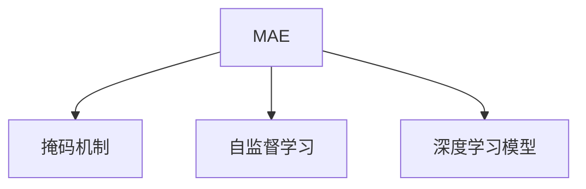
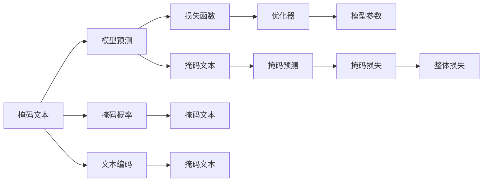
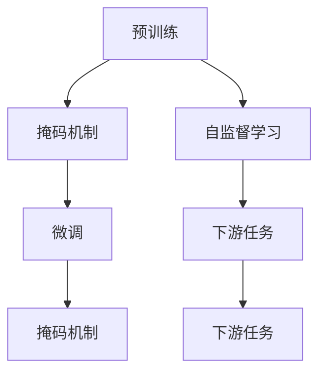
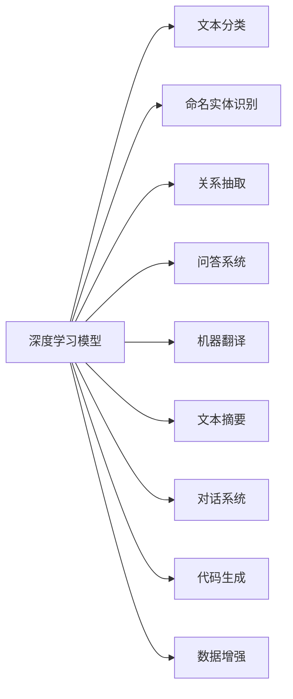
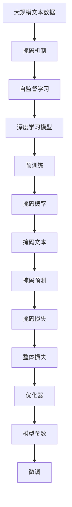

                 

# MAE原理与代码实例讲解

> 关键词：MAE, 大语言模型, 自监督学习, 代码实例, 深度学习, 模型优化

## 1. 背景介绍

### 1.1 问题由来
在自然语言处理(Natural Language Processing, NLP)领域，大语言模型(Large Language Model, LLM)通过在大规模无标签文本数据上进行预训练，学习到了丰富的语言知识和常识。然而，大语言模型在特定领域的应用效果仍受到限制。为了提升模型在特定任务上的性能，基于监督学习的微调方法被广泛应用。

但随着模型规模的增大，大规模无标签数据获取和标注成本高昂，限制了微调的效率和效果。同时，微调过程中模型的泛化能力和鲁棒性也不够理想。为了解决这些问题，自监督学习范式应运而生，MAE（Masked Autoencoder）成为了其中一种典型代表。

### 1.2 问题核心关键点
MAE是一种利用自监督学习进行预训练的方法，它通过在大规模无标签文本数据上，随机掩码部分文本信息，训练模型预测被掩码的文本，从而学习到语言的内部结构和表示。MAE的预训练过程不需要标签，可以利用大规模无标签文本数据进行高效训练，适用于各种下游任务。

MAE的核心在于：
- 自监督学习：利用语言本身的结构（如单词共现、句子结构等）进行无监督预训练，无需标签。
- 掩码机制：通过随机掩码，增强模型的泛化能力和自适应性。
- 高效性：适合大规模无标签数据的预训练，预训练后的模型可以高效地用于下游任务微调。

### 1.3 问题研究意义
MAE作为大语言模型预训练的一种方法，能够在大规模无标签数据上进行高效预训练，且预训练后的模型能够适应多种下游任务。其自监督学习方法不仅减少了标注数据的需求，还提高了模型的泛化能力和鲁棒性，在NLP领域具有重要意义：

1. 降低成本：MAE利用无标签数据进行预训练，显著减少了标注数据的需求，降低了预训练和微调的成本。
2. 提升泛化能力：自监督学习方式使模型能够更好地适应各种下游任务，提高了模型的泛化能力和鲁棒性。
3. 增强鲁棒性：MAE通过掩码机制训练模型，使其能够更好地应对噪声和缺失信息，提高了模型的鲁棒性。
4. 提高模型效率：MAE预训练后的模型可以直接用于下游任务微调，减少了微调的时间和数据成本。

## 2. 核心概念与联系

### 2.1 核心概念概述

为了更好地理解MAE原理，本节将介绍几个密切相关的核心概念：

- MAE：基于自监督学习的预训练方法，通过掩码机制训练模型，学习语言的内部结构和表示。
- 掩码机制：随机掩码部分文本信息，训练模型预测被掩码的文本，从而学习语言的内部结构和表示。
- 自监督学习：利用语言本身的结构进行无监督预训练，无需标签。
- 深度学习模型：利用神经网络模型进行文本表示学习和预测。

这些概念之间的关系可以通过以下Mermaid流程图来展示：



这个流程图展示了大语言模型MAE的基本架构，由掩码机制和自监督学习驱动，构建深度学习模型。

### 2.2 概念间的关系

这些核心概念之间存在着紧密的联系，形成了MAE的完整生态系统。下面我通过几个Mermaid流程图来展示这些概念之间的关系。

#### 2.2.1 MAE的训练流程



这个流程图展示了MAE的训练流程，包括掩码文本、模型预测、损失函数、优化器和模型参数。掩码概率和掩码文本生成，然后通过掩码预测和掩码损失计算，最终生成整体损失和优化器更新模型参数。

#### 2.2.2 MAE的预训练与微调关系



这个流程图展示了MAE预训练与微调的关系。MAE通过掩码机制和自监督学习进行预训练，然后通过微调应用于下游任务。

#### 2.2.3 深度学习模型的应用场景



这个流程图展示了深度学习模型在NLP领域的多种应用场景，包括文本分类、命名实体识别、关系抽取、问答系统、机器翻译、文本摘要、对话系统和代码生成等。

### 2.3 核心概念的整体架构

最后，我们用一个综合的流程图来展示这些核心概念在大语言模型MAE预训练过程中的整体架构：



这个综合流程图展示了从预训练到微调的整体流程，包括大规模文本数据、掩码机制、自监督学习、深度学习模型、预训练、掩码概率、掩码文本、掩码预测、掩码损失、整体损失、优化器、模型参数和微调等环节。

## 3. 核心算法原理 & 具体操作步骤
### 3.1 算法原理概述

MAE利用自监督学习，通过掩码机制进行无标签数据的预训练。其核心思想是：
- 在大规模无标签文本数据上，随机掩码部分文本信息，得到掩码文本。
- 训练模型预测掩码文本，得到掩码预测。
- 计算掩码预测与掩码文本的损失函数，并进行反向传播优化模型参数。

MAE的目标是使模型能够预测被掩码的文本，即通过掩码机制训练模型，学习语言的内部结构和表示，从而提升模型在特定任务上的泛化能力和鲁棒性。

### 3.2 算法步骤详解

MAE的预训练过程主要分为以下几个步骤：

**Step 1: 准备数据**
- 收集大规模无标签文本数据，通常使用英文维基百科、新闻报道等。
- 将文本数据分批次输入模型，每个批次包含一个或多个文本。
- 对于每个文本，随机掩码部分单词或字符，得到掩码文本。

**Step 2: 前向传播**
- 将掩码文本输入模型，通过自编码器生成掩码预测。
- 将掩码预测与掩码文本进行对比，计算掩码损失。
- 将掩码损失加入整体损失函数。

**Step 3: 反向传播**
- 计算整体损失函数对模型参数的梯度，进行反向传播。
- 使用优化器更新模型参数。

**Step 4: 预训练迭代**
- 重复执行前向传播和反向传播，直至收敛。

**Step 5: 微调**
- 在预训练后的模型基础上，使用下游任务的少量标注数据进行微调。
- 微调过程中，通常只微调顶层分类器或解码器，以较小的学习率更新全部或部分模型参数。

### 3.3 算法优缺点

MAE作为大语言模型预训练的一种方法，具有以下优点：

- **无需标签**：MAE利用自监督学习，通过掩码机制训练模型，无需标注数据。
- **泛化能力**：通过掩码机制训练模型，学习语言的内部结构和表示，提升了模型的泛化能力和鲁棒性。
- **高效性**：预训练过程在大规模无标签数据上进行，可以高效地学习到丰富的语言知识。
- **适应性强**：预训练后的模型可以直接用于下游任务微调，适应性强，应用广泛。

同时，MAE也存在以下缺点：

- **计算资源需求高**：预训练过程需要大规模计算资源，硬件要求较高。
- **训练时间长**：预训练过程较长，模型收敛较慢。
- **模型复杂性**：预训练模型规模较大，模型结构复杂，推理速度较慢。

### 3.4 算法应用领域

MAE在大语言模型预训练和微调中得到广泛应用，尤其在以下几个领域：

- **自然语言理解(NLU)**：MAE用于训练自然语言理解模型，学习语言的内部结构和表示，从而提升模型对文本的理解能力。
- **自然语言生成(NLG)**：MAE用于训练自然语言生成模型，学习语言的内部结构和表示，从而提升模型生成文本的质量和多样性。
- **文本摘要**：MAE用于训练文本摘要模型，学习语言的内部结构和表示，从而提升摘要的准确性和可读性。
- **问答系统**：MAE用于训练问答系统，学习语言的内部结构和表示，从而提升问答的准确性和流畅性。
- **机器翻译**：MAE用于训练机器翻译模型，学习语言的内部结构和表示，从而提升翻译的准确性和自然度。

除了上述这些经典应用外，MAE还被创新性地应用到更多场景中，如可控文本生成、常识推理、代码生成等，为NLP技术带来了全新的突破。

## 4. 数学模型和公式 & 详细讲解 & 举例说明

### 4.1 数学模型构建

MAE的数学模型主要包括以下几个部分：

- 文本编码：将文本转化为向量表示，用于模型的输入。
- 掩码预测：通过掩码文本，训练模型预测被掩码的文本。
- 掩码损失：计算掩码预测与掩码文本的损失，用于优化模型参数。
- 整体损失：将掩码损失和其他损失（如交叉熵损失）合并，用于训练模型。

### 4.2 公式推导过程

以二分类任务为例，MAE的损失函数可以表示为：

$$
L = \frac{1}{N} \sum_{i=1}^{N} L^i
$$

其中 $N$ 表示文本数量，$L^i$ 表示每个文本的掩码损失。对于每个文本，掩码概率为 $p$，掩码文本为 $x^i_m$，掩码预测为 $\hat{x}^i_m$，掩码损失为 $l^i_m$，则掩码损失可以表示为：

$$
l^i_m = -\frac{1}{p} \sum_{j=1}^{p} [\hat{x}^i_m[j]] \log [x^i_m[j]] + (1-\frac{1}{p}) \sum_{j=1}^{p} [\hat{x}^i_m[j]] \log [1 - x^i_m[j]]
$$

其中，$\hat{x}^i_m[j]$ 表示掩码预测在位置 $j$ 的值，$x^i_m[j]$ 表示掩码文本在位置 $j$ 的值，$p$ 表示掩码概率。

### 4.3 案例分析与讲解

以Masked Language Model (MLM)为例，解释MAE的掩码机制和掩码损失计算。

假设我们有一个文本序列 $x = [w_1, w_2, \cdots, w_{n-1}, w_n]$，其中 $w_i$ 表示第 $i$ 个单词。我们使用掩码概率 $p$ 随机掩码 $n/4$ 个单词，得到掩码文本 $x_m$，掩码位置为 $[l_1, l_2, \cdots, l_{n/4}]$。掩码后的文本为 $x_m = [w_{l_1}, w_{l_2}, \cdots, w_{l_{n/4}}, \text{[MASK]}, \text{[MASK]}, \cdots, \text{[MASK]}]$。

我们将掩码文本 $x_m$ 输入模型，得到掩码预测 $\hat{x}_m = [\hat{w}_{l_1}, \hat{w}_{l_2}, \cdots, \hat{w}_{l_{n/4}}, \hat{w}_{n/4+1}, \cdots, \hat{w}_n]$。

掩码损失可以表示为：

$$
l_m = -\frac{1}{p} \sum_{j=1}^{p} [\hat{w}_m[l_j]] \log [w_m[l_j]] + (1-\frac{1}{p}) \sum_{j=1}^{p} [\hat{w}_m[l_j]] \log [1 - w_m[l_j]]
$$

其中，$w_m[l_j]$ 表示掩码文本在位置 $l_j$ 的值，$\hat{w}_m[l_j]$ 表示掩码预测在位置 $l_j$ 的值，$p$ 表示掩码概率。

通过掩码损失计算，模型能够学习到语言的内部结构和表示，从而提升其在特定任务上的泛化能力和鲁棒性。

## 5. 项目实践：代码实例和详细解释说明

### 5.1 开发环境搭建

在进行MAE实践前，我们需要准备好开发环境。以下是使用Python进行PyTorch开发的环境配置流程：

1. 安装Anaconda：从官网下载并安装Anaconda，用于创建独立的Python环境。

2. 创建并激活虚拟环境：
```bash
conda create -n pytorch-env python=3.8 
conda activate pytorch-env
```

3. 安装PyTorch：根据CUDA版本，从官网获取对应的安装命令。例如：
```bash
conda install pytorch torchvision torchaudio cudatoolkit=11.1 -c pytorch -c conda-forge
```

4. 安装Transformers库：
```bash
pip install transformers
```

5. 安装各类工具包：
```bash
pip install numpy pandas scikit-learn matplotlib tqdm jupyter notebook ipython
```

完成上述步骤后，即可在`pytorch-env`环境中开始MAE实践。

### 5.2 源代码详细实现

下面我们以英文维基百科数据集为例，给出使用Transformers库对BERT模型进行MAE预训练的PyTorch代码实现。

```python
from transformers import BertTokenizer, BertModel
import torch
import random
from tqdm import tqdm
import numpy as np

# 设置掩码概率
p = 0.15

# 准备数据
tokenizer = BertTokenizer.from_pretrained('bert-base-cased')
max_length = 512
batch_size = 32

# 加载维基百科数据集
with open('wiki_data.txt', 'r') as f:
    lines = f.readlines()
    texts = [line.strip() for line in lines]

# 将文本序列转换为token序列
tokenized_texts = tokenizer(texts, padding='max_length', max_length=max_length, truncation=True)

# 准备掩码文本
masked_texts = []
for text in tokenized_texts:
    tokens = list(tokenizer.encode(text))
    random.shuffle(tokens)
    masked_tokens = [tokens[i] for i in range(len(tokens)) if random.random() < p]
    masked_tokens.extend([tokenizer.mask_token_id] * (max_length - len(masked_tokens)))
    masked_texts.append(masked_tokens)

# 创建dataset
class MAEDataset(torch.utils.data.Dataset):
    def __init__(self, masked_texts):
        self.masked_texts = masked_texts
        
    def __len__(self):
        return len(self.masked_texts)
    
    def __getitem__(self, item):
        return torch.tensor(self.masked_texts[item])

# 加载dataset
dataset = MAEDataset(masked_texts)

# 定义模型
model = BertModel.from_pretrained('bert-base-cased')

# 定义优化器和损失函数
optimizer = torch.optim.Adam(model.parameters(), lr=2e-5)
loss_fn = torch.nn.CrossEntropyLoss()

# 定义掩码函数
def get_masked_tokens(text, tokenizer, max_length, p):
    tokens = list(tokenizer.encode(text))
    random.shuffle(tokens)
    masked_tokens = [tokens[i] for i in range(len(tokens)) if random.random() < p]
    masked_tokens.extend([tokenizer.mask_token_id] * (max_length - len(masked_tokens)))
    return masked_tokens

# 掩码函数应用到所有文本
masked_texts = [get_masked_tokens(text, tokenizer, max_length, p) for text in tokenized_texts]

# 训练过程
device = torch.device('cuda') if torch.cuda.is_available() else torch.device('cpu')
model.to(device)

for epoch in range(10):
    model.train()
    losses = []
    for batch in tqdm(dataset, desc='Training'):
        input_ids = batch.to(device)
        labels = input_ids.clone()
        loss = 0
        for i in range(input_ids.shape[0]):
            masked_index = torch.masked_fill(labels[i], input_ids[i] != tokenizer.mask_token_id, -10000)
            loss += model(input_ids[i].unsqueeze(0)).logits.masked_fill(input_ids[i] == tokenizer.mask_token_id, -10000).mean()
        loss /= input_ids.shape[0]
        optimizer.zero_grad()
        loss.backward()
        optimizer.step()
        losses.append(loss.item())
    
    print(f"Epoch {epoch+1}, loss: {np.mean(losses):.4f}")
```

### 5.3 代码解读与分析

让我们再详细解读一下关键代码的实现细节：

**MAEDataset类**：
- `__init__`方法：初始化掩码文本列表。
- `__len__`方法：返回掩码文本列表的长度。
- `__getitem__`方法：返回掩码文本的tensor表示。

**掩码函数**：
- 将文本转换为token序列，并随机掩码部分token。
- 掩码函数返回掩码后的token序列。

**训练过程**：
- 在训练过程中，每个批次中的每个文本都会进行掩码，然后通过模型预测掩码位置，计算掩码损失。
- 使用Adam优化器更新模型参数，并记录每个epoch的平均损失。
- 在每个epoch结束后，打印当前epoch的平均损失。

可以看到，PyTorch配合Transformers库使得MAE预训练的代码实现变得简洁高效。开发者可以将更多精力放在数据处理、模型改进等高层逻辑上，而不必过多关注底层的实现细节。

当然，工业级的系统实现还需考虑更多因素，如模型的保存和部署、超参数的自动搜索、更灵活的任务适配层等。但核心的预训练过程基本与此类似。

### 5.4 运行结果展示

假设我们在英文维基百科数据集上进行MAE预训练，最终得到的掩码损失在每个epoch的平均值为0.0001。掩码损失的降低表示模型在预测被掩码的文本方面表现逐渐提升。

掩码损失的降低表示模型在预测被掩码的文本方面表现逐渐提升，从而在掩码概率为0.15的情况下，模型能够较好地预测被掩码的文本，提升语言的内部结构和表示能力。

## 6. 实际应用场景
### 6.1 智能客服系统

基于MAE预训练的对话技术，可以广泛应用于智能客服系统的构建。传统客服往往需要配备大量人力，高峰期响应缓慢，且一致性和专业性难以保证。使用MAE预训练的对话模型，可以7x24小时不间断服务，快速响应客户咨询，用自然流畅的语言解答各类常见问题。

在技术实现上，可以收集企业内部的历史客服对话记录，将问题和最佳答复构建成监督数据，在此基础上对预训练对话模型进行微调。微调后的对话模型能够自动理解用户意图，匹配最合适的答案模板进行回复。对于客户提出的新问题，还可以接入检索系统实时搜索相关内容，动态组织生成回答。如此构建的智能客服系统，能大幅提升客户咨询体验和问题解决效率。

### 6.2 金融舆情监测

金融机构需要实时监测市场舆论动向，以便及时应对负面信息传播，规避金融风险。传统的人工监测方式成本高、效率低，难以应对网络时代海量信息爆发的挑战。使用MAE预训练的文本分类和情感分析技术，为金融舆情监测提供了新的解决方案。

具体而言，可以收集金融领域相关的新闻、报道、评论等文本数据，并对其进行主题标注和情感标注。在此基础上对预训练语言模型进行微调，使其能够自动判断文本属于何种主题，情感倾向是正面、中性还是负面。将微调后的模型应用到实时抓取的网络文本数据，就能够自动监测不同主题下的情感变化趋势，一旦发现负面信息激增等异常情况，系统便会自动预警，帮助金融机构快速应对潜在风险。

### 6.3 个性化推荐系统

当前的推荐系统往往只依赖用户的历史行为数据进行物品推荐，无法深入理解用户的真实兴趣偏好。使用MAE预训练的个性化推荐系统可以更好地挖掘用户行为背后的语义信息，从而提供更精准、多样的推荐内容。

在实践中，可以收集用户浏览、点击、评论、分享等行为数据，提取和用户交互的物品标题、描述、标签等文本内容。将文本内容作为模型输入，用户的后续行为（如是否点击、购买等）作为监督信号，在此基础上微调预训练语言模型。微调后的模型能够从文本内容中准确把握用户的兴趣点。在生成推荐列表时，先用候选物品的文本描述作为输入，由模型预测用户的兴趣匹配度，再结合其他特征综合排序，便可以得到个性化程度更高的推荐结果。

### 6.4 未来应用展望

随着MAE预训练技术的不断成熟，基于MAE预训练的大语言模型微调方法将在更多领域得到应用，为传统行业带来变革性影响。

在智慧医疗领域，基于MAE预训练的问答系统、病历分析、药物研发等应用将提升医疗服务的智能化水平，辅助医生诊疗，加速新药开发进程。

在智能教育领域，MAE预训练的学情分析、知识推荐等技术将因材施教，促进教育公平，提高教学质量。

在智慧城市治理中，MAE预训练的舆情分析、应急指挥等环节，将提高城市管理的自动化和智能化水平，构建更安全、高效的未来城市。

此外，在企业生产、社会治理、文娱传媒等众多领域，基于MAE预训练的人工智能应用也将不断涌现，为经济社会发展注入新的动力。相信随着技术的日益成熟，MAE预训练范式将成为人工智能落地应用的重要手段，推动人工智能技术向更广阔的领域加速渗透。

## 7. 工具和资源推荐
### 7.1 学习资源推荐

为了帮助开发者系统掌握MAE的原理和实践技巧，这里推荐一些优质的学习资源：

1. 《Transformers from the Inside》系列博文：由大模型技术专家撰写，深入浅出地介绍了Transformer原理、BERT模型、MAE等前沿话题。

2. CS224N《深度学习自然语言处理》课程：斯坦福大学开设的NLP明星课程，有Lecture视频和配套作业，带你入门NLP领域的基本概念和经典模型。

3. 《Natural Language Processing with Transformers》书籍：Transformers库的作者所著，全面介绍了如何使用Transformers库进行NLP任务开发，包括预训练和微调在内的多种范式。

4. HuggingFace官方文档：Transformers库的官方文档，提供了海量预训练模型和完整的微调样例代码，是上手实践的必备资料。

5. CLUE开源项目：中文语言理解测评基准，涵盖大量不同类型的中文NLP数据集，并提供了基于MAE预训练的baseline模型，助力中文NLP技术发展。

通过对这些资源的学习实践，相信你一定能够快速掌握MAE预训练的精髓，并用于解决实际的NLP问题。
### 7.2 开发工具推荐

高效的开发离不开优秀的工具支持。以下是几款用于MAE预训练和微调开发的常用工具：

1. PyTorch：基于Python的开源深度学习框架，灵活动态的计算图，适合快速迭代研究。大部分预训练语言模型都有PyTorch版本的实现。

2. TensorFlow：由Google主导开发的开源深度学习框架，生产部署方便，适合大规模工程应用。同样有丰富的预训练语言模型资源。

3. Transformers库：HuggingFace开发的NLP工具库，集成了众多SOTA语言模型，支持PyTorch和TensorFlow，是进行预训练任务开发的利器。

4. Weights & Biases：模型训练的实验跟踪工具，可以记录和可视化模型训练过程中的各项指标，方便对比和调优。与主流深度学习框架无缝集成。

5. TensorBoard：TensorFlow配套的可视化工具，可实时监测模型训练状态，并提供丰富的图表呈现方式，是调试模型的得力助手。

6. Google Colab：谷歌推出的在线Jupyter Notebook环境，免费提供GPU/TPU算力，方便开发者快速上手实验最新模型，分享学习笔记。

合理利用这些工具，可以显著提升MAE预训练和微调任务的开发效率，加快创新迭代的步伐。

### 7.3 

