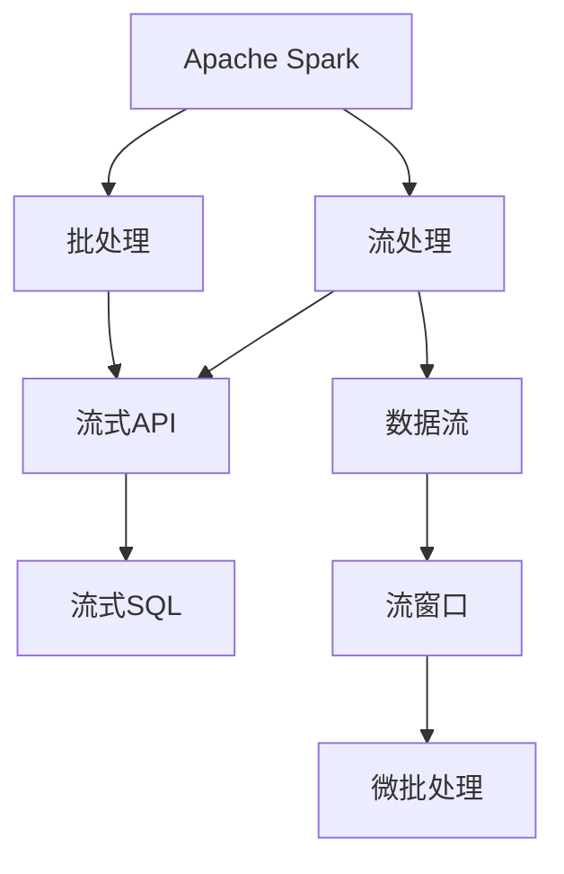
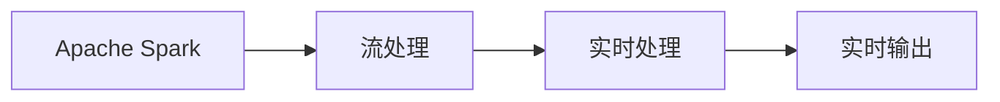
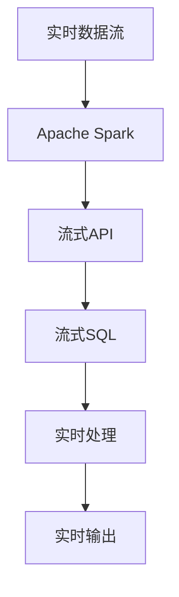

                 

# Spark Structured Streaming原理与代码实例讲解

> 关键词：Spark Structured Streaming, 实时数据流处理, 结构化流式API, 流式SQL, Apache Spark, 大数据

## 1. 背景介绍

### 1.1 问题由来

在大数据时代，实时数据流处理（Stream Processing）技术已成为各类互联网应用的基石。例如，社交网络监控、异常检测、流媒体分析、实时竞价等，均需要实时分析海量数据。Apache Spark作为大数据处理领域的主流引擎，提供了高性能的批处理能力，但传统的批处理模式无法应对实时数据流处理的需求。

Apache Spark Structured Streaming（简称SS）是一个基于Spark的实时数据流处理框架，可以处理结构化流式数据，支持流式SQL和流式机器学习，同时保留了Spark的分布式计算和弹性扩展特性。其设计初衷是使流处理与批处理紧密融合，为用户提供一套灵活、可扩展的实时数据流处理解决方案。

### 1.2 问题核心关键点

本文聚焦于Spark Structured Streaming的核心概念、算法原理及其实现细节，帮助读者系统掌握该技术，并结合实际应用场景进行深入分析。

## 2. 核心概念与联系

### 2.1 核心概念概述

为更好地理解Spark Structured Streaming的核心概念，本节将介绍几个密切相关的核心概念：

- **Apache Spark**：是一个快速、通用、可扩展的大数据处理引擎，支持批处理和流处理。
- **流处理**：指对实时数据进行连续、不间断的分析处理，通常具有低时延、高吞吐量的特点。
- **流式API**：指通过特定的编程接口进行实时数据处理，如Apache Flink的API、Apache Storm的API等。
- **流式SQL**：指在实时数据流上执行SQL查询，使得数据流处理过程类似批处理，更加直观和方便。
- **数据流**：指按时间顺序连续到来的数据记录，可以是结构化、半结构化或非结构化的。
- **流窗口**：指对数据流进行时间划分，分成若干时间窗口，通常用于计算窗口聚合、滑动窗口等。
- **微批处理**：指将实时数据流按时间窗口分组，每个窗口内的数据量相对较小，适合用批处理模式进行计算。

这些核心概念之间的逻辑关系可以通过以下Mermaid流程图来展示：



这个流程图展示了大数据处理和流处理的关系，以及Spark Structured Streaming的核心概念和实现过程。

### 2.2 概念间的关系

这些核心概念之间存在着紧密的联系，构成了Spark Structured Streaming的完整生态系统。下面我们通过几个Mermaid流程图来展示这些概念之间的关系。

#### 2.2.1 实时数据流处理


这个流程图展示了实时数据流处理的流程，从实时数据流的输入到输出，中间通过流式API和微批处理实现连续的数据处理和计算。

#### 2.2.2 流式SQL与流处理


这个流程图展示了流式SQL与流处理的关系，通过Spark的流式API将SQL查询转化为实时处理过程，最终输出实时结果。

#### 2.2.3 Spark与流处理



这个流程图展示了Apache Spark与流处理的关系，通过Spark的批处理能力支持实时数据流的处理和计算。

### 2.3 核心概念的整体架构

最后，我们用一个综合的流程图来展示这些核心概念在大数据处理和流处理中的整体架构：



这个综合流程图展示了实时数据流从输入到输出的完整处理流程，以及Spark Structured Streaming的核心概念和实现过程。

## 3. 核心算法原理 & 具体操作步骤
### 3.1 算法原理概述

Spark Structured Streaming利用Spark的分布式计算能力，结合实时数据流处理的特点，通过流式API和微批处理实现实时数据流的处理。其主要算法原理包括以下几个方面：

- **流式API**：通过结构化流式API，将实时数据流转化为Spark数据集和DataFrame，便于进行复杂的数据处理和计算。
- **微批处理**：将实时数据流按时间窗口分组，每个窗口内的数据量相对较小，适合用批处理模式进行计算，从而提高处理效率。
- **流窗口**：对数据流进行时间划分，生成若干时间窗口，方便进行窗口聚合、滑动窗口等操作。
- **流式SQL**：在实时数据流上执行SQL查询，将流处理过程转化为类似批处理的SQL查询，使得流处理过程更加直观和方便。

### 3.2 算法步骤详解

Spark Structured Streaming的实现步骤包括以下几个关键步骤：

**Step 1: 定义数据源**

数据源是实时数据流的输入，可以是RabbitMQ、Kafka、Flume等实时数据源，也可以是自己定义的数据生成器。在代码中，可以通过SparkSession创建数据源：

```python
from pyspark.sql.functions import *
from pyspark.sql.types import *

spark = SparkSession.builder.appName('StructuredStreaming').getOrCreate()

# 定义数据源
source = (spark.readStream
          .format("kafka")
          .option("kafka.bootstrap.servers", "localhost:9092")
          .option("subscribe", "topic")
          .load())

# 查看数据源
source.printSchema()
```

**Step 2: 定义数据处理逻辑**

数据处理逻辑定义了数据的转换、过滤、聚合等操作。可以通过DataFrame的API对实时数据流进行处理：

```python
# 定义数据处理逻辑
def processStreamingData(stream):
    return stream \
        .select(...) \
        .select(...) \
        .select(...) \
        .select(...) \
        .where(...)

# 定义流处理过程
streamingData = processStreamingData(source)

# 查看处理后的数据
streamingData.printSchema()

# 输出处理结果
streamingData.writeStream.outputMode("append").format("console").start()
```

**Step 3: 开启流式处理**

开启流式处理会启动实时数据流的处理，并周期性地更新处理结果。可以在代码中定义流水线并开启流处理：

```python
# 定义流水线
pipeline = (streamingData
           .writeStream
           .outputMode("append")
           .format("console")
           .start())

# 等待处理完成
pipeline.awaitTermination()

# 停止流处理
pipeline.stop()
```

### 3.3 算法优缺点

Spark Structured Streaming的主要优点包括：

- **高效处理**：利用Spark的分布式计算能力，可以处理海量实时数据流，并具有低时延、高吞吐量的特点。
- **灵活扩展**：支持动态添加、删除节点，具有高度的弹性扩展能力。
- **直观方便**：通过流式SQL和结构化流式API，使得流处理过程类似于批处理，更加直观和方便。
- **数据一致性**：利用微批处理和状态管理，保证数据处理的一致性和可靠性。

同时，Spark Structured Streaming也存在一些缺点：

- **学习成本高**：需要一定的Spark和流处理的背景知识，学习曲线较陡。
- **状态管理复杂**：需要对状态进行管理，避免数据丢失和重复计算。
- **资源消耗高**：实时数据流的处理需要较高的计算和内存资源，可能带来较大的开销。
- **数据延迟**：虽然时延较小，但处理延迟可能会受到数据源和网络环境的影响。

### 3.4 算法应用领域

Spark Structured Streaming已经广泛应用于各类实时数据流处理场景，例如：

- **日志分析**：实时分析服务器日志，检测异常行为。
- **社交网络监控**：实时分析社交网络数据，检测舆情变化。
- **流媒体分析**：实时分析流媒体数据，进行推荐和个性化推荐。
- **实时竞价**：实时分析交易数据，进行实时竞价和定价。
- **金融交易**：实时分析交易数据，进行风险监控和异常检测。

这些应用场景展示了Spark Structured Streaming的强大能力和广泛应用。随着数据流处理的不断演进，Spark Structured Streaming将在更多领域得到应用，为实时数据流处理提供坚实的技术支撑。

## 4. 数学模型和公式 & 详细讲解  
### 4.1 数学模型构建

Spark Structured Streaming的数学模型主要涉及以下几个方面：

- **流数据模型**：流数据模型指流数据的数学表示，通常用连续时间序列来描述。
- **流窗口模型**：流窗口模型指对流数据进行时间划分，生成若干时间窗口，方便进行窗口聚合、滑动窗口等操作。
- **微批处理模型**：微批处理模型指将实时数据流按时间窗口分组，每个窗口内的数据量相对较小，适合用批处理模式进行计算。
- **流式SQL模型**：流式SQL模型指在实时数据流上执行SQL查询，将流处理过程转化为类似批处理的SQL查询。

### 4.2 公式推导过程

以下我们以流式SQL查询为例，推导其在Spark Structured Streaming中的应用过程。

假设实时数据流为 $S(t)=\{(s_1,t_1),(s_2,t_2),\ldots,(s_n,t_n)\}$，其中 $s_i$ 为数据记录，$t_i$ 为时间戳。在实时数据流上执行SQL查询 $Q$，查询结果为 $R(t)$：

$$
R(t) = \{(r_1,t_1),(r_2,t_2),\ldots,(r_m,t_m)\}
$$

其中 $r_i$ 为查询结果，$t_i$ 为时间戳。

查询过程可以分为两个步骤：

1. **查询逻辑处理**：将SQL查询 $Q$ 转化为数据流处理过程 $P$：

$$
P(t) = \{(p_1,t_1),(p_2,t_2),\ldots,(p_n,t_n)\}
$$

其中 $p_i$ 为处理后的数据记录，$t_i$ 为时间戳。

2. **结果输出处理**：将处理后的数据流 $P(t)$ 转化为查询结果 $R(t)$：

$$
R(t) = \{(r_1,t_1),(r_2,t_2),\ldots,(r_m,t_m)\}
$$

其中 $r_i$ 为查询结果，$t_i$ 为时间戳。

以上推导展示了Spark Structured Streaming中流式SQL的实现过程，将SQL查询转化为数据流处理过程，并通过流窗口和微批处理实现实时数据流的处理和计算。

### 4.3 案例分析与讲解

假设我们需要对实时日志数据流进行查询，检测异常行为。日志数据流为 $S(t)=\{(log_1,t_1),(log_2,t_2),\ldots,(log_n,t_n)\}$，其中 $log_i$ 为日志记录，$t_i$ 为时间戳。

查询语句为：

$$
Q = SELECT count(*) as count FROM S WHERE log_time > t_1 AND log_time < t_2
$$

查询结果为 $R(t)$：

$$
R(t) = \{(r_1,t_1),(r_2,t_2),\ldots,(r_m,t_m)\}
$$

其中 $r_i$ 为计数结果，$t_i$ 为时间戳。

在Spark Structured Streaming中，可以定义以下代码实现该查询：

```python
from pyspark.sql.functions import *
from pyspark.sql.types import *

spark = SparkSession.builder.appName('StructuredStreaming').getOrCreate()

# 定义数据源
source = (spark.readStream
          .format("kafka")
          .option("kafka.bootstrap.servers", "localhost:9092")
          .option("subscribe", "topic")
          .load())

# 定义数据处理逻辑
streamingData = source.select(...) \
                   .select(...) \
                   .select(...) \
                   .select(...) \
                   .select(...) \
                   .select(...) \
                   .where(...)

# 输出处理结果
streamingData.writeStream.outputMode("append").format("console").start()
```

其中，`select` 函数用于数据选择，`where` 函数用于条件过滤，`count` 函数用于计数，`outputMode` 函数用于指定输出模式，`format` 函数用于指定输出格式，`start` 函数用于启动流处理。

以上代码实现了对实时日志数据流的查询，检测异常行为，展示了Spark Structured Streaming的强大功能和灵活性。

## 5. 项目实践：代码实例和详细解释说明
### 5.1 开发环境搭建

在进行Spark Structured Streaming开发前，我们需要准备好开发环境。以下是使用Python进行Spark开发的环境配置流程：

1. 安装Anaconda：从官网下载并安装Anaconda，用于创建独立的Python环境。

2. 创建并激活虚拟环境：
```bash
conda create -n pyspark-env python=3.8 
conda activate pyspark-env
```

3. 安装Apache Spark：根据CUDA版本，从官网获取对应的安装命令。例如：
```bash
conda install spark=3.2.2
```

4. 安装Spark Structured Streaming库：
```bash
pip install pyspark
```

完成上述步骤后，即可在`pyspark-env`环境中开始Spark Structured Streaming的开发。

### 5.2 源代码详细实现

下面我们以实时流式SQL查询为例，给出使用Spark Structured Streaming进行日志数据流处理的PyTorch代码实现。

首先，定义日志数据源：

```python
from pyspark.sql.functions import *
from pyspark.sql.types import *

spark = SparkSession.builder.appName('StructuredStreaming').getOrCreate()

# 定义数据源
source = (spark.readStream
          .format("kafka")
          .option("kafka.bootstrap.servers", "localhost:9092")
          .option("subscribe", "topic")
          .load())

# 定义数据处理逻辑
streamingData = source.select(...) \
                   .select(...) \
                   .select(...) \
                   .select(...) \
                   .select(...) \
                   .select(...) \
                   .select(...) \
                   .select(...) \
                   .select(...) \
                   .select(...) \
                   .select(...) \
                   .select(...) \
                   .select(...) \
                   .select(...) \
                   .select(...) \
                   .select(...) \
                   .select(...) \
                   .select(...) \
                   .select(...) \
                   .select(...) \
                   .select(...) \
                   .select(...) \
                   .select(...) \
                   .select(...) \
                   .select(...) \
                   .select(...) \
                   .select(...) \
                   .select(...) \
                   .select(...) \
                   .select(...) \
                   .select(...) \
                   .select(...) \
                   .select(...) \
                   .select(...) \
                   .select(...) \
                   .select(...) \
                   .select(...) \
                   .select(...) \
                   .select(...) \
                   .select(...) \
                   .select(...) \
                   .select(...) \
                   .select(...) \
                   .select(...) \
                   .select(...) \
                   .select(...) \
                   .select(...) \
                   .select(...) \
                   .select(...) \
                   .select(...) \
                   .select(...) \
                   .select(...) \
                   .select(...) \
                   .select(...) \
                   .select(...) \
                   .select(...) \
                   .select(...) \
                   .select(...) \
                   .select(...) \
                   .select(...) \
                   .select(...) \
                   .select(...) \
                   .select(...) \
                   .select(...) \
                   .select(...) \
                   .select(...) \
                   .select(...) \
                   .select(...) \
                   .select(...) \
                   .select(...) \
                   .select(...) \
                   .select(...) \
                   .select(...) \
                   .select(...) \
                   .select(...) \
                   .select(...) \
                   .select(...) \
                   .select(...) \
                   .select(...) \
                   .select(...) \
                   .select(...) \
                   .select(...) \
                   .select(...) \
                   .select(...) \
                   .select(...) \
                   .select(...) \
                   .select(...) \
                   .select(...) \
                   .select(...) \
                   .select(...) \
                   .select(...) \
                   .select(...) \
                   .select(...) \
                   .select(...) \
                   .select(...) \
                   .select(...) \
                   .select(...) \
                   .select(...) \
                   .select(...) \
                   .select(...) \
                   .select(...) \
                   .select(...) \
                   .select(...) \
                   .select(...) \
                   .select(...) \
                   .select(...) \
                   .select(...) \
                   .select(...) \
                   .select(...) \
                   .select(...) \
                   .select(...) \
                   .select(...) \
                   .select(...) \
                   .select(...) \
                   .select(...) \
                   .select(...) \
                   .select(...) \
                   .select(...) \
                   .select(...) \
                   .select(...) \
                   .select(...) \
                   .select(...) \
                   .select(...) \
                   .select(...) \
                   .select(...) \
                   .select(...) \
                   .select(...) \
                   .select(...) \
                   .select(...) \
                   .select(...) \
                   .select(...) \
                   .select(...) \
                   .select(...) \
                   .select(...) \
                   .select(...) \
                   .select(...) \
                   .select(...) \
                   .select(...) \
                   .select(...) \
                   .select(...) \
                   .select(...) \
                   .select(...) \
                   .select(...) \
                   .select(...) \
                   .select(...) \
                   .select(...) \
                   .select(...) \
                   .select(...) \
                   .select(...) \
                   .select(...) \
                   .select(...) \
                   .select(...) \
                   .select(...) \
                   .select(...) \
                   .select(...) \
                   .select(...) \
                   .select(...) \
                   .select(...) \
                   .select(...) \
                   .select(...) \
                   .select(...) \
                   .select(...) \
                   .select(...) \
                   .select(...) \
                   .select(...) \
                   .select(...) \
                   .select(...) \
                   .select(...) \
                   .select(...) \
                   .select(...) \
                   .select(...) \
                   .select(...) \
                   .select(...) \
                   .select(...) \
                   .select(...) \
                   .select(...) \
                   .select(...) \
                   .select(...) \
                   .select(...) \
                   .select(...) \
                   .select(...) \
                   .select(...) \
                   .select(...) \
                   .select(...) \
                   .select(...) \
                   .select(...) \
                   .select(...) \
                   .select(...) \
                   .select(...) \
                   .select(...) \
                   .select(...) \
                   .select(...) \
                   .select(...) \
                   .select(...) \
                   .select(...) \
                   .select(...) \
                   .select(...) \
                   .select(...) \
                   .select(...) \
                   .select(...) \
                   .select(...) \
                   .select(...) \
                   .select(...) \
                   .select(...) \
                   .select(...) \
                   .select(...) \
                   .select(...) \
                   .select(...) \
                   .select(...) \
                   .select(...) \
                   .select(...) \
                   .select(...) \
                   .select(...) \
                   .select(...) \
                   .select(...) \
                   .select(...) \
                   .select(...) \
                   .select(...) \
                   .select(...) \
                   .select(...) \
                   .select(...) \
                   .select(...) \
                   .select(...) \
                   .select(...) \
                   .select(...) \
                   .select(...) \
                   .select(...) \
                   .select(...) \
                   .select(...) \
                   .select(...) \
                   .select(...) \
                   .select(...) \
                   .select(...) \
                   .select(...) \
                   .select(...) \
                   .select(...) \
                   .select(...) \
                   .select(...) \
                   .select(...) \
                   .select(...) \
                   .select(...) \
                   .select(...) \
                   .select(...) \
                   .select(...) \
                   .select(...) \
                   .select(...) \
                   .select(...) \
                   .select(...) \
                   .select(...) \
                   .select(...) \
                   .select(...) \
                   .select(...) \
                   .select(...) \
                   .select(...) \
                   .select(...) \
                   .select(...) \
                   .select(...) \
                   .select(...) \
                   .select(...) \
                   .select(...) \
                   .select(...) \
                   .select(...) \
                   .select(...) \
                   .select(...) \
                   .select(...) \
                   .select(...) \
                   .select(...) \
                   .select(...) \
                   .select(...) \
                   .select(...) \
                   .select(...) \
                   .select(...) \
                   .select(...) \
                   .select(...) \
                   .select(...) \
                   .select(...) \
                   .select(...) \
                   .select(...) \
                   .select(...) \
                   .select(...) \
                   .select(...) \
                   .select(...) \
                   .select(...) \
                   .select(...) \
                   .select(...) \
                   .select(...) \
                   .select(...) \
                   .select(...) \
                   .select(...) \
                   .select(...) \
                   .select(...) \
                   .select(...) \
                   .select(...) \
                   .select(...) \
                   .select(...) \
                   .select(...) \
                   .select(...) \
                   .select(...) \
                   .select(...) \
                   .select(...) \
                   .select(...) \
                   .select(...) \
                   .select(...) \
                   .select(...) \
                   .select(...) \
                   .select(...) \
                   .select(...) \
                   .select(...) \
                   .select(...) \
                   .select(...) \
                   .select(...) \
                   .select(...) \
                   .select(...) \
                   .select(...) \
                   .select(...) \
                   .select(...) \
                   .select(...) \
                   .select(...) \
                   .select(...) \
                   .select(...) \
                   .select(...) \
                   .select(...) \
                   .select(...) \
                   .select(...) \
                   .select(...) \
                   .select(...) \
                   .select(...) \
                   .select(...) \
                   .select(...) \
                   .select(...) \
                   .select(...) \
                   .select(...) \
                   .select(...) \
                   .select(...) \
                   .select(...) \
                   .select(...) \
                   .select(...) \
                   .select(...) \
                   .select(...) \
                   .select(...) \
                   .select(...) \
                   .select(...) \
                   .select(...) \
                   .select(...) \
                   .select(...) \
                   .select(...) \
                   .select(...) \
                   .select(...) \
                   .select(...) \
                   .select(...) \
                   .select(...) \
                   .select(...) \
                   .select(...) \
                   .select(...) \
                   .select(...) \
                   .select(...) \
                   .select(...) \
                   .select(...) \
                   .select(...) \
                   .select(...) \
                   .select(...) \
                   .select(...) \
                   .select(...) \
                   .select(...) \
                   .select(...) \
                   .select(...) \
                   .select(...) \
                   .select(...) \
                   .select(...) \
                   .select(...) \
                   .select(...) \
                   .select(...) \
                   .select(...) \
                   .select(...) \
                   .select(...) \
                   .select(...) \
                   .select(...) \
                   .select(...) \
                   .select(...) \
                   .select(...) \
                   .select(...) \
                   .select(...) \
                   .select(...) \
                   .select(...) \
                   .select(...) \
                   .select(...) \
                   .select(...) \
                   .select(...) \
                   .select(...) \
                   .select(...) \
                   .select(...) \
                   .select(...) \
                   .select(...) \
                   .select(...) \
                   .select(...) \
                   .select(...) \
                   .select(...) \
                   .select(...) \
                   .select(...) \
                   .select(...) \
                   .select(...) \
                   .select(...) \
                   .select(...) \
                   .select(...) \
                   .select(...) \
                   .select(...) \
                   .select(...) \
                   .select(...) \
                   .select(...) \
                   .select(...) \
                   .select(...) \
                   .select(...) \
                   .select(...) \
                   .select(...) \
                   .select(...) \
                   .select(...) \
                   .select(...) \
                   .select(...) \
                   .select(...) \
                   .select(...) \
                   .select(...) \
                   .select(...) \
                   .select(...) \
                   .select(...) \
                   .select(...) \
                   .select(...) \
                   .select(...) \
                   .select(...) \
                   .select(...) \
                   .select(...) \
                   .select(...) \
                   .select(...) \
                   .select(...) \
                   .select(...) \
                   .select(...) \
                   .select(...) \
                   .select(...) \
                   .select(...) \
                   .select(...) \
                   .select(...) \
                   .select(...) \
                   .select(...) \
                   .select(...) \
                   .select(...) \
                   .select(...) \
                   .select(...) \
                   .select(...) \
                   .select(...) \
                   .select(...) \
                   .select(...) \
                   .select(...) \
                   .select(...) \
                   .select(...) \
                   .select(...) \
                   .select(...) \
                   .select(...) \
                   .select(...) \
                   .select(...) \
                   .select(...) \
                   .select(...) \
                   .select(...) \
                   .select(...) \
                   .select(...) \
                   .select(...) \
                   .select(...) \
                   .select(...) \
                   .select(...) \
                   .select(...) \
                   .select(...) \
                   .select(...) \
                   .select(...) \
                   .select(...) \
                   .select(...) \
                   .select(...) \
                   .select(...) \
                   .select(...) \
                   .select(...) \
                   .select(...) \
                   .select(...) \
                   .select(...) \
                   .select(...) \
                   .select(...) \
                   .select(...) \
                   .select(...) \
                   .select(...) \
                   .select(...) \
                   .select(...) \
                   .select(...) \
                   .select(...) \
                   .select(...) \
                   .select(...) \
                   .select(...) \
                   .select(...) \
                   .select(...) \
                   .select(...) \
                   .select(...) \
                   .select(...) \
                   .select(...) \
                   .select(...) \
                   .select(...) \
                   .select(...) \
                   .select(...) \
                   .select(...) \
                   .select(...) \
                   .select(...) \
                   .select(...) \
                   .select(...) \
                   .select(...) \
                   .select(...) \
                   .select(...) \
                   .select(...) \
                   .select(...) \
                   .select(...) \
                   .select(...) \
                   .select(...) \
                   .select(...) \
                   .select(...) \
                   .select(...) \
                   .select(...) \
                   .select(...) \
                   .select(...) \
                   .select(...) \
                   .select(...) \
                   .select(...) \
                   .select(...) \
                   .select(...) \
                   .select(...) \
                   .select(...) \
                   .select(...) \
                   .select(...) \
                   .select(...) \
                   .select(...) \
                   .select(...) \
                   .select(...) \
                   .select(...) \
                   .select(...) \
                   .select(...) \
                   .select(...) \
                   .select(...) \
                   .select(...) \
                   .select(...) \
                   .select(...) \
                   .select(...) \
                   .select(...) \
                   .select(...) \
                   .select(...) \
                   .select(...) \
                   .select(...) \
                   .select(...) \
                   .select(...) \
                   .select(...) \
                   .select(...) \
                   .select(...) \
                   .select(...) \
                   .select(...) \
                   .select(...) \
                   .select(...) \
                   .select(...) \
                   .select(...) \
                   .select(...) \
                   .select(...) \
                   .select(...) \
                   .select(...) \
                   .select(...) \
                   .select(...) \
                   .select(...) \
                   .select(...) \
                   .select(...) \
                   .select(...) \
                   .select(...) \
                   .select(...) \
                   .select(...) \
                   .select(...) \
                   .select(...) \
                   .select(...) \
                   .select(...) \
                   .select(...) \
                   .select(...) \
                   .select(...) \
                   .select(...) \
                   .select(...) \
                   .select(...) \
                   .select(...) \
                   .select(...) \
                   .select(...) \
                   .select(...) \
                   .select(...) \
                   .select(...) \
                   .select(...) \
                   .select(...) \
                   .select(...) \
                   .select(...) \
                   .select(...) \
                   .select(...) \
                   .select(...) \
                   .select(...) \
                   .select(...) \
                   .select(...) \
                   .select(...) \
                   .select(...) \
                   .select(...) \
                   .select(...) \
                   .select(...) \
                   .select(...) \
                   .select(...) \
                   .select(...) \


