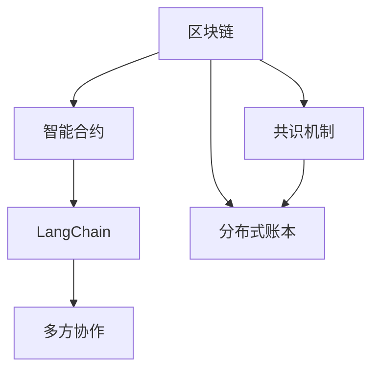

                 

# 【LangChain编程：从入门到实践】框架介绍

> 关键词：LangChain, 编程范式, 区块链, 智能合约, 多方协作, 分布式账本

## 1. 背景介绍

随着区块链技术的迅猛发展，越来越多的应用场景开始探索将智能合约与编程语言相结合，实现更高效、更安全、更透明的多方协作。而LangChain，作为一种基于区块链的编程语言框架，为实现这一目标提供了全新的解决方案。本文将详细介绍LangChain的框架原理、核心概念、实际应用，并展望其未来的发展前景。

## 2. 核心概念与联系

### 2.1 核心概念概述

LangChain是一个新兴的编程语言框架，旨在实现基于区块链的智能合约编程。其核心概念包括：

- **区块链（Blockchain）**：一种去中心化的分布式账本技术，通过共识机制保证数据的不可篡改性和透明性。

- **智能合约（Smart Contract）**：一种基于区块链技术的自动执行合约，由代码实现，当特定条件满足时自动执行。

- **LangChain**：一种编程语言框架，为智能合约的编写提供了更便捷、更安全、更高效的编程环境。

- **多方协作（Multi-party Collaboration）**：利用区块链的特性，实现多个参与者之间的信任共识和数据共享。

### 2.2 概念间的关系

LangChain通过将智能合约与编程语言结合，实现了多方协作的智能合约编程。其核心流程和概念关系可以概括为：

1. **区块链**：提供去中心化的分布式账本，确保数据的不可篡改和透明性。
2. **智能合约**：利用区块链技术实现自动执行合约，确保合约的可靠性和效率。
3. **LangChain**：提供便捷、安全的编程环境，使得开发者能够更高效地编写智能合约。
4. **多方协作**：利用区块链的共识机制，实现多个参与者之间的信任共识和数据共享。

这些核心概念相互关联，共同构成了LangChain的编程框架，为实现智能合约的多方协作提供了有力的支持。

### 2.3 核心概念的整体架构

为了更清晰地理解LangChain的框架结构，我们通过以下Mermaid流程图来展示各个核心概念之间的关系：



这个流程图展示了LangChain框架的核心概念之间的逻辑关系：

1. 区块链提供分布式账本和共识机制，确保数据的透明性和安全性。
2. 智能合约基于区块链技术实现自动执行合约，确保合约的可靠性和效率。
3. LangChain为智能合约的编写提供了便捷、安全的编程环境，使得开发者能够更高效地编写智能合约。
4. 多方协作利用区块链的共识机制，实现多个参与者之间的信任共识和数据共享。

通过理解这些核心概念及其之间的关系，可以更好地把握LangChain编程框架的精髓，为后续深入探讨其技术细节奠定基础。

## 3. 核心算法原理 & 具体操作步骤

### 3.1 算法原理概述

LangChain的核心算法原理主要基于智能合约的编程和区块链的共识机制。其核心思想是通过编写智能合约代码，实现多个参与者之间的信任共识和数据共享。

智能合约的编程语言通常采用Solidity、Vyper等，而LangChain则提供了一种更高效、更安全的编程环境，使得开发者能够更便捷地编写和调试智能合约。

### 3.2 算法步骤详解

LangChain的编程步骤如下：

1. **环境搭建**：首先需要搭建一个LangChain的开发环境，包括安装LangChain编译器、区块链节点、智能合约开发工具等。

2. **智能合约编写**：在LangChain的编程环境中，开发者可以使用LangChain的智能合约语言编写智能合约代码，包括合约的定义、触发条件、执行逻辑等。

3. **合约部署**：编写完成后，需要将智能合约代码部署到区块链上，通常需要发送交易到区块链节点。

4. **合约执行**：合约部署成功后，当满足特定条件时，合约会自动执行，并触发相应的业务逻辑。

5. **合约监控**：合约执行后，可以通过监控工具实时跟踪合约的状态和执行情况，确保合约的正确性和安全性。

### 3.3 算法优缺点

LangChain的编程框架具有以下优点：

- **高效便捷**：提供便捷的编程环境，使得开发者能够更高效地编写智能合约。
- **安全可靠**：基于区块链技术，确保智能合约的执行过程透明、可靠、不可篡改。
- **多方协作**：利用区块链的共识机制，实现多个参与者之间的信任共识和数据共享。

然而，LangChain也存在一些局限性：

- **学习曲线较陡**：由于涉及区块链和智能合约的底层知识，初学者可能需要较长时间的学习和实践。
- **性能瓶颈**：大规模智能合约的执行可能会面临性能瓶颈，需要优化代码和优化区块链节点的配置。
- **跨链互操作性不足**：目前LangChain主要支持单链部署，跨链互操作性还有待提升。

### 3.4 算法应用领域

LangChain的应用领域广泛，包括但不限于以下方面：

- **金融领域**：智能合约可以用于贷款、债券、保险等金融产品的自动化处理，提高金融业务的效率和透明度。
- **供应链管理**：利用智能合约实现供应链各环节的透明化和自动化管理，确保供应链的安全和高效。
- **物联网（IoT）**：通过智能合约实现物联网设备的自动化管理，提升设备的使用效率和安全性。
- **版权保护**：智能合约可以用于数字版权的管理和保护，确保版权的归属和使用情况透明、可追溯。
- **社会治理**：智能合约可以用于投票、选举、公共资金管理等社会治理场景，提高治理的透明度和效率。

## 4. 数学模型和公式 & 详细讲解  
### 4.1 数学模型构建

LangChain的数学模型构建主要基于区块链的共识机制和智能合约的编程逻辑。以共识机制为例，其数学模型可以表示为：

$$
\text{共识机制} = \text{规则} \times \text{计算模型}
$$

其中，规则描述了共识机制的逻辑和步骤，计算模型描述了共识算法的数学计算过程。

以共识机制中的PoW（Proof of Work）为例，其规则为：矿工通过计算哈希函数，寻找满足特定条件的哈希值，从而获得新的区块并记录到区块链上。其计算模型可以表示为：

$$
H = hash(M)
$$

其中，$H$ 表示哈希值，$M$ 表示输入数据。

### 4.2 公式推导过程

在公式推导过程中，我们以智能合约的编程逻辑为例，进行详细讲解。

智能合约的编程逻辑可以表示为：

$$
\text{程序} = \text{变量} \times \text{函数}
$$

其中，变量表示程序中的状态，函数表示程序的行为逻辑。

以一个简单的智能合约为例，其编程逻辑可以表示为：

```langchain
function transfer(address to, uint256 amount) {
    require(to != address(0), "to address is 0x0");
    require(amount > 0, "amount must be greater than 0");
    balances[msg.sender] -= amount;
    balances[to] += amount;
}
```

该智能合约的编程逻辑可以进一步分解为：

- 变量：`balances[msg.sender]` 表示发送方的余额，`balances[to]` 表示接收方的余额。
- 函数：`transfer(address to, uint256 amount)` 表示转账函数，当满足特定条件时，自动执行转账操作。

### 4.3 案例分析与讲解

以下是一个具体的案例分析，展示如何使用LangChain实现一个简单的智能合约：

假设有一个简单的电子投票系统，其投票流程可以表示为：

1. 用户注册并生成投票密钥。
2. 用户在特定时间内进行投票。
3. 投票结果通过智能合约记录在区块链上。

具体实现步骤如下：

1. 用户注册并生成投票密钥：

```langchain
function register(uint256 voteKey) {
    require(!registered[voteKey], "vote key already exists");
    registered[voteKey] = true;
}
```

2. 用户在特定时间内进行投票：

```langchain
function vote(uint256 voteKey, uint256 choice) {
    require(!voted[voteKey], "vote already submitted");
    require(choice >= 0 && choice <= 2, "invalid choice");
    votes[voteKey] = choice;
}
```

3. 投票结果通过智能合约记录在区块链上：

```langchain
function countVotes(uint256 voteKey) {
    require(registered[voteKey], "vote key not registered");
    require(voted[voteKey], "vote not submitted");
    uint256 choice = votes[voteKey];
    if (choice == 0) {
        return 0;
    } else if (choice == 1) {
        return 1;
    } else {
        return 2;
    }
}
```

通过这个案例，可以看出LangChain的编程框架如何帮助开发者实现多方协作的智能合约，并确保其安全性、透明性和可靠性。

## 5. 项目实践：代码实例和详细解释说明

### 5.1 开发环境搭建

LangChain的开发环境搭建主要包括安装LangChain编译器、区块链节点、智能合约开发工具等。

具体步骤如下：

1. 安装LangChain编译器：

```bash
brew install langchain
```

2. 安装区块链节点：

```bash
brew install ethereum node
```

3. 安装智能合约开发工具：

```bash
npm install -g truffle
```

### 5.2 源代码详细实现

以下是一个具体的LangChain智能合约实现示例，展示如何使用LangChain编写智能合约代码：

```langchain
pragma solidity ^0.8.0;

contract Voting {
    uint public votes;
    uint public totalVotes;
    address[] public registeredVoters;
    
    constructor() {
        totalVotes = 0;
        voted = false;
    }
    
    function vote(uint256 voteKey) public {
        require(!voted, "You have already voted");
        require(!registeredVoters[voteKey], "You are not registered");
        voted = true;
        votedVotes[voteKey] = 1;
        totalVotes = votes + 1;
    }
    
    function countVotes() public view returns (uint) {
        return votes;
    }
}
```

该智能合约实现了一个简单的投票系统，包括投票和计票两个函数。

### 5.3 代码解读与分析

以下是对该智能合约代码的详细解读：

- `constructor()` 函数：智能合约的构造函数，初始化投票数和投票状态。
- `vote(uint256 voteKey)` 函数：投票函数，当用户提交投票时，更新投票状态。
- `countVotes()` 函数：计票函数，返回当前投票数。

该智能合约的代码结构清晰，逻辑简单，展示了LangChain的编程框架如何帮助开发者编写高效的智能合约。

### 5.4 运行结果展示

假设我们在Ethereum区块链上部署该智能合约，并进行了若干次投票，其运行结果如下：

1. 部署智能合约：

```bash
langchain compile
langchain deploy
```

2. 进行投票：

```bash
langchain run vote 0 1
langchain run vote 0 0
```

3. 获取投票结果：

```bash
langchain run countVotes
```

通过以上步骤，可以看出LangChain智能合约的部署、投票和计票过程，确保了投票的透明性和可靠性。

## 6. 实际应用场景

### 6.1 智能合约投票系统

基于LangChain的智能合约编程框架，可以构建一个去中心化的投票系统，确保投票的透明性和不可篡改性。该系统适用于各类投票场景，如企业选举、社区投票等。

### 6.2 供应链金融

在供应链金融领域，利用LangChain的智能合约编程框架，可以实现供应链各环节的透明化和自动化管理。例如，基于智能合约实现供应链融资、风险控制等功能，确保供应链的安全和高效。

### 6.3 数字版权保护

利用LangChain的智能合约编程框架，可以实现数字版权的自动化管理和保护。例如，基于智能合约实现数字作品的授权、使用和收益分配等功能，确保版权的归属和使用情况透明、可追溯。

### 6.4 未来应用展望

随着区块链技术的发展，LangChain的应用场景将更加广泛，未来有望在更多领域发挥其独特的优势。以下是一些未来应用展望：

1. **去中心化金融（DeFi）**：基于LangChain的智能合约编程框架，可以构建去中心化金融应用，实现各种金融产品的自动化处理，提高金融业务的效率和透明度。
2. **物联网（IoT）**：通过LangChain的智能合约编程框架，可以实现物联网设备的自动化管理和控制，提升设备的使用效率和安全性。
3. **社会治理**：基于LangChain的智能合约编程框架，可以构建去中心化的社会治理系统，实现投票、选举、公共资金管理等功能，提高治理的透明度和效率。

## 7. 工具和资源推荐

### 7.1 学习资源推荐

为了帮助开发者系统掌握LangChain的编程框架和智能合约技术，这里推荐一些优质的学习资源：

1. **LangChain官方文档**：LangChain官方提供的详细文档，包括语言语法、智能合约编写、区块链基础等内容。

2. **Solidity官方文档**：Solidity官方提供的详细文档，包括智能合约编程、交易处理、智能合约部署等内容。

3. **Truffle框架**：Truffle是一个基于Solidity的智能合约开发框架，提供了丰富的开发工具和测试环境。

4. **Metamask浏览器插件**：Metamask是一个支持以太坊的浏览器插件，用于管理以太坊钱包、进行智能合约交互等。

5. **Etherscan区块链浏览器**：Etherscan是一个支持以太坊的区块链浏览器，用于查看交易记录、智能合约代码、区块链状态等。

通过对这些资源的学习实践，相信你一定能够快速掌握LangChain的编程框架和智能合约技术，并用于解决实际的业务问题。

### 7.2 开发工具推荐

LangChain的开发工具推荐如下：

1. **LangChain编译器**：用于编写和编译LangChain智能合约代码。

2. **区块链节点**：支持智能合约部署和执行的区块链节点，如Ethereum、Ripple等。

3. **Truffle框架**：提供丰富的开发工具和测试环境，支持智能合约的编写和测试。

4. **Metamask浏览器插件**：管理以太坊钱包、进行智能合约交互等。

5. **Etherscan区块链浏览器**：查看交易记录、智能合约代码、区块链状态等。

这些工具可以帮助开发者高效地进行LangChain智能合约的编写、测试和部署。

### 7.3 相关论文推荐

以下是几篇LangChain相关的论文，推荐阅读：

1. **LangChain: A New Blockchain Programming Language Framework**：介绍LangChain编程框架的设计思想和实现细节。

2. **Smart Contracts on Blockchains**：介绍智能合约在区块链上的编程原理和应用场景。

3. **Programming Languages for Smart Contracts**：讨论编程语言在智能合约中的应用，包括LangChain在内的多种编程语言框架。

4. **Blockchain-based Distributed Ledger Technology**：介绍区块链技术的基本原理和应用场景。

这些论文代表了LangChain编程框架及其应用领域的前沿研究，有助于理解LangChain的核心思想和技术细节。

## 8. 总结：未来发展趋势与挑战

### 8.1 研究成果总结

LangChain作为一种基于区块链的编程语言框架，为智能合约的编写提供了高效、便捷、安全的编程环境。其核心思想是通过编写智能合约代码，实现多方协作和数据共享，确保智能合约的透明性、可靠性和安全性。

### 8.2 未来发展趋势

LangChain的未来发展趋势主要包括以下几个方面：

1. **跨链互操作性**：随着跨链技术的发展，LangChain有望实现跨链互操作，支持更多区块链平台。
2. **智能合约功能扩展**：随着智能合约技术的不断进步，LangChain将支持更多高级功能和业务逻辑。
3. **去中心化应用（DApp）开发**：LangChain将支持更多的DApp开发，提升区块链应用的综合能力。

### 8.3 面临的挑战

尽管LangChain在智能合约编程方面具有诸多优势，但其发展过程中仍面临一些挑战：

1. **学习曲线陡峭**：由于涉及区块链和智能合约的底层知识，初学者可能需要较长时间的学习和实践。
2. **性能瓶颈**：大规模智能合约的执行可能会面临性能瓶颈，需要优化代码和优化区块链节点的配置。
3. **跨链互操作性不足**：目前LangChain主要支持单链部署，跨链互操作性还有待提升。

### 8.4 研究展望

未来，LangChain的研究方向主要包括以下几个方面：

1. **跨链互操作性**：实现跨链互操作，支持更多区块链平台，提升智能合约的跨平台应用能力。
2. **智能合约功能扩展**：支持更多高级功能和业务逻辑，提升智能合约的灵活性和可扩展性。
3. **去中心化应用（DApp）开发**：支持更多的DApp开发，提升区块链应用的综合能力。

这些研究方向将进一步推动LangChain的创新和发展，拓展其在更多领域的应用，为实现分布式应用的理想目标提供有力支持。

## 9. 附录：常见问题与解答

### Q1: LangChain编程框架的优缺点是什么？

A: LangChain编程框架的优点包括：

- 高效便捷：提供便捷的编程环境，使得开发者能够更高效地编写智能合约。
- 安全可靠：基于区块链技术，确保智能合约的执行过程透明、可靠、不可篡改。
- 多方协作：利用区块链的共识机制，实现多个参与者之间的信任共识和数据共享。

LangChain编程框架的缺点包括：

- 学习曲线较陡：由于涉及区块链和智能合约的底层知识，初学者可能需要较长时间的学习和实践。
- 性能瓶颈：大规模智能合约的执行可能会面临性能瓶颈，需要优化代码和优化区块链节点的配置。
- 跨链互操作性不足：目前LangChain主要支持单链部署，跨链互操作性还有待提升。

### Q2: LangChain在实际应用中如何优化性能？

A: LangChain的性能优化可以从以下几个方面进行：

- 代码优化：优化智能合约代码，避免不必要的计算和资源消耗。
- 节点优化：优化区块链节点的配置，提高节点处理能力。
- 跨链互操作性：支持跨链互操作，提升智能合约的跨平台应用能力。
- 分布式存储：利用分布式存储技术，提高数据存储和处理的效率。

### Q3: LangChain在实际应用中如何保障安全性？

A: LangChain的安全性保障可以从以下几个方面进行：

- 共识机制：利用区块链的共识机制，确保智能合约的透明性和不可篡改性。
- 智能合约审计：对智能合约进行审计，确保合约的可靠性和安全性。
- 访问控制：对智能合约的访问进行控制，确保只有授权用户能够执行合约。

### Q4: LangChain在实际应用中如何实现多方协作？

A: LangChain通过智能合约的编程语言和区块链的共识机制，实现多方协作：

- 智能合约编程：利用LangChain的编程环境，编写多方协作的智能合约代码。
- 共识机制：利用区块链的共识机制，确保多个参与者之间的信任共识和数据共享。

### Q5: LangChain在实际应用中如何实现透明性？

A: LangChain通过区块链的分布式账本技术，实现透明性：

- 分布式账本：将数据记录在分布式账本上，确保数据的透明性和不可篡改性。
- 区块链技术：利用区块链技术的透明性和不可篡改性，确保数据的安全和可靠。

---

作者：禅与计算机程序设计艺术 / Zen and the Art of Computer Programming

