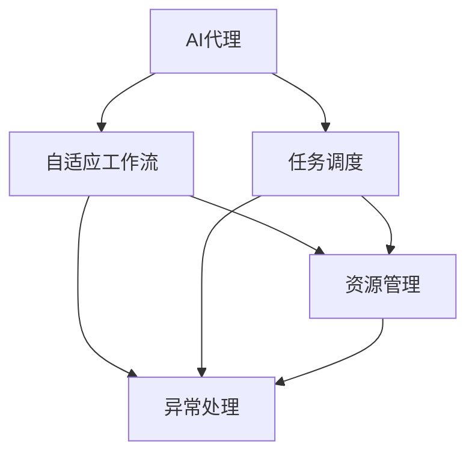
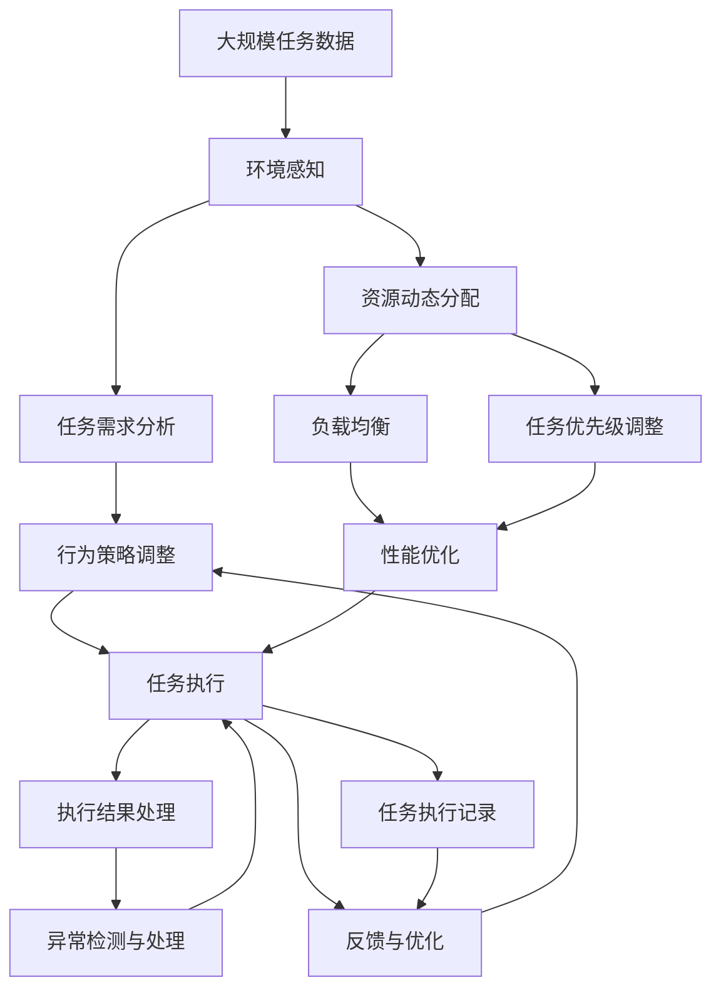

                 

# AI人工智能代理工作流AI Agent WorkFlow：自适应工作流的AI代理调度策略

## 1. 背景介绍

### 1.1 问题由来

随着人工智能技术的发展，代理工作流（AI Agent Workflow）在自动化、智能化、高效化领域中扮演着越来越重要的角色。代理工作流指的是通过智能代理自动完成一系列复杂的工作流程，涵盖自动数据收集、任务调度、结果处理等多个环节。这一技术广泛应用于生产制造、金融服务、在线购物、医疗健康等多个行业。

然而，当前的代理工作流系统仍存在一些瓶颈和挑战：

1. **任务调度效率低下**：在复杂多变的环境中，传统的静态调度策略往往无法适应任务的动态变化，导致系统资源利用率低下，响应时间过长。
2. **任务执行质量不稳定**：不同任务可能对执行资源（如计算资源、网络带宽、存储设备）的需求不同，需要动态调整任务调度策略以确保任务执行质量。
3. **任务执行过程中异常处理能力不足**：现有系统在面对异常情况（如网络中断、硬件故障等）时，往往难以迅速识别和响应，导致任务执行中断或失败。
4. **跨领域任务调度的难度**：不同领域的工作流可能包含截然不同的任务类型，需要设计通用的调度策略以兼容多个领域的工作流。

### 1.2 问题核心关键点

面对这些问题，自适应工作流（Adaptive Workflow）的提出成为解决关键。自适应工作流能够根据任务的动态变化，动态调整任务调度策略，优化资源分配，提高任务执行效率和质量。自适应工作流的设计需要满足以下关键点：

1. **实时感知环境变化**：系统能够实时监测任务的执行状态、资源使用情况、网络环境等，及时调整任务调度策略。
2. **动态任务调度**：根据任务的实时需求，动态调整任务执行顺序、执行资源分配，以确保任务高效执行。
3. **异常处理能力**：系统应具备异常识别和自动处理能力，确保任务在面对异常情况时仍能继续执行或重新调度。
4. **跨领域任务兼容**：设计通用的调度策略，能够兼容不同领域的工作流，灵活应对多种任务类型。

本文将重点讨论如何利用AI代理实现自适应工作流，包括任务调度策略的设计、调度算法的实现以及实际应用场景中的优化方法。

## 2. 核心概念与联系

### 2.1 核心概念概述

为更好地理解自适应工作流中的AI代理调度策略，本节将介绍几个密切相关的核心概念：

- **AI代理（AI Agent）**：指通过机器学习等人工智能技术，能够自主完成一系列复杂任务的软件实体。AI代理能够实时感知环境变化，动态调整自身行为以适应任务需求。
- **自适应工作流（Adaptive Workflow）**：指能够根据任务动态变化实时调整任务调度策略，优化资源分配，提高任务执行效率和质量的工作流系统。
- **任务调度（Task Scheduling）**：指根据任务的需求和资源的可用性，动态调整任务执行顺序和资源分配的过程。
- **资源管理（Resource Management）**：指对系统中的计算资源、存储资源、网络资源等进行动态分配和管理，以确保任务执行高效进行。
- **异常处理（Fault Tolerance）**：指系统在面对异常情况时，能够识别、定位并自动处理异常，确保任务执行的稳定性和可靠性。

这些核心概念之间的逻辑关系可以通过以下Mermaid流程图来展示：



这个流程图展示了大语言模型微调过程中各个核心概念之间的关系：

1. AI代理通过实时感知环境变化，动态调整自身行为以适应任务需求。
2. 自适应工作流根据任务的动态变化，动态调整任务调度策略，优化资源分配，提高任务执行效率和质量。
3. 任务调度根据任务的需求和资源的可用性，动态调整任务执行顺序和资源分配的过程。
4. 资源管理对系统中的计算资源、存储资源、网络资源等进行动态分配和管理，以确保任务执行高效进行。
5. 异常处理在系统面对异常情况时，能够识别、定位并自动处理异常，确保任务执行的稳定性和可靠性。

### 2.2 概念间的关系

这些核心概念之间存在着紧密的联系，形成了自适应工作流中的AI代理调度策略的完整生态系统。下面我通过几个Mermaid流程图来展示这些概念之间的关系。

#### 2.2.1 AI代理的感知与执行


这个流程图展示了AI代理如何通过感知环境变化，分析任务需求，动态调整行为策略并执行任务。

#### 2.2.2 任务调度的动态性


这个流程图展示了任务调度如何根据任务需求的变化，动态调整资源分配，优化任务执行顺序，确保任务高效执行。

#### 2.2.3 资源管理的优化


这个流程图展示了资源管理如何通过动态调整负载均衡、任务优先级，优化资源分配，提高任务执行效率。

#### 2.2.4 异常处理的鲁棒性


这个流程图展示了异常处理如何通过检测、定位和处理异常，确保任务执行的稳定性和可靠性。

### 2.3 核心概念的整体架构

最后，我们用一个综合的流程图来展示这些核心概念在自适应工作流中的AI代理调度策略的整体架构：



这个综合流程图展示了从环境感知到任务执行结果处理的完整过程。AI代理通过实时感知环境变化，动态调整行为策略，高效执行任务。资源管理通过动态调整负载均衡和任务优先级，优化资源分配，提高任务执行效率。异常处理在检测到异常情况时，及时定位并处理异常，确保任务执行的稳定性和可靠性。通过反馈与优化机制，系统不断改进任务调度策略，提升任务执行质量。

## 3. 核心算法原理 & 具体操作步骤
### 3.1 算法原理概述

自适应工作流中的AI代理调度策略，本质上是一个动态任务调度优化问题。其核心思想是：通过实时感知环境变化，动态调整任务调度策略，优化资源分配，确保任务高效执行。

形式化地，假设任务集为 $T=\{t_i\}_{i=1}^N$，资源集为 $R=\{r_j\}_{j=1}^M$，每个任务 $t_i$ 需要资源集 $R_i \subset R$。任务调度策略的目标是最小化任务执行时间，即：

$$
\min_{\pi} \sum_{i=1}^N f(t_i, \pi)
$$

其中 $\pi$ 为任务调度策略，$f(t_i, \pi)$ 为任务 $t_i$ 在调度策略 $\pi$ 下的执行时间。优化目标是找到最优的任务调度策略 $\pi^*$，使得任务执行时间最小化。

### 3.2 算法步骤详解

自适应工作流中的AI代理调度策略一般包括以下几个关键步骤：

**Step 1: 环境感知与任务需求分析**
- 使用传感器、监控工具等手段实时感知任务执行状态、资源使用情况、网络环境等。
- 根据感知到的信息，分析任务的实时需求，包括资源需求、执行时间、优先级等。

**Step 2: 行为策略调整**
- 根据任务需求，动态调整AI代理的行为策略，包括任务调度顺序、资源分配策略等。
- 如果任务需要增加资源，应立即调整资源分配策略，确保任务执行顺利进行。

**Step 3: 任务调度与执行**
- 根据调整后的行为策略，动态调度任务执行。
- 实时监测任务执行状态，根据执行情况动态调整行为策略。

**Step 4: 资源管理与优化**
- 动态调整资源分配策略，优化任务执行效率。
- 通过负载均衡、任务优先级调整等手段，提高资源利用率。

**Step 5: 异常处理与任务重新调度**
- 实时监测任务执行过程，识别异常情况。
- 定位异常原因，自动处理异常。
- 在异常处理后，重新调度任务执行。

**Step 6: 反馈与优化**
- 收集任务执行结果，分析任务执行质量。
- 根据分析结果，优化任务调度策略，提升任务执行效率。

以上是自适应工作流中的AI代理调度策略的一般流程。在实际应用中，还需要针对具体任务的特点，对每个环节进行优化设计，如改进任务调度算法、引入更多正则化技术、搜索最优的超参数组合等，以进一步提升任务执行质量。

### 3.3 算法优缺点

自适应工作流中的AI代理调度策略具有以下优点：
1. 动态调整任务调度策略，优化资源分配，提高任务执行效率。
2. 实时监测任务执行状态，及时处理异常情况，确保任务执行稳定。
3. 通过动态调整行为策略，兼容不同领域的工作流，提高系统灵活性。
4. 根据任务需求实时调整资源分配，提高资源利用率。

同时，该算法也存在一些局限性：
1. 对环境感知和任务需求分析的准确性要求高，否则会导致调度策略失效。
2. 动态调整策略可能会增加系统的复杂性，需要更多的计算资源支持。
3. 实时监测任务执行状态和异常处理需要高并发处理能力，对系统硬件要求高。
4. 反馈与优化机制需要大规模数据支持，否则可能无法准确优化任务调度策略。

尽管存在这些局限性，但就目前而言，自适应工作流中的AI代理调度策略仍是大规模任务调度问题的有效解决方案。未来相关研究的重点在于如何进一步降低环境感知和任务需求分析的复杂性，提高系统的稳定性和鲁棒性。

### 3.4 算法应用领域

自适应工作流中的AI代理调度策略在多个领域得到了广泛应用，例如：

- **生产制造**：调度生产线上的各个环节，优化生产效率。
- **金融服务**：调度交易系统，确保交易的实时性和稳定性。
- **在线购物**：调度订单处理系统，提升用户体验和订单处理效率。
- **医疗健康**：调度医疗设备，确保病患及时获得医疗服务。
- **物流运输**：调度运输车辆，优化路线和时间，提高配送效率。

除了上述这些经典应用外，自适应工作流中的AI代理调度策略还在更多领域中发挥着重要作用，为各行各业带来了显著的效率提升和经济效益。

## 4. 数学模型和公式 & 详细讲解 & 举例说明
### 4.1 数学模型构建

本节将使用数学语言对自适应工作流中的AI代理调度策略进行更加严格的刻画。

假设任务集为 $T=\{t_i\}_{i=1}^N$，资源集为 $R=\{r_j\}_{j=1}^M$，每个任务 $t_i$ 需要资源集 $R_i \subset R$。任务调度策略的目标是最小化任务执行时间，即：

$$
\min_{\pi} \sum_{i=1}^N f(t_i, \pi)
$$

其中 $\pi$ 为任务调度策略，$f(t_i, \pi)$ 为任务 $t_i$ 在调度策略 $\pi$ 下的执行时间。

假设任务 $t_i$ 的执行时间为 $T_i$，任务 $t_i$ 在调度策略 $\pi$ 下使用的资源量为 $W_i(\pi)$，则执行时间 $f(t_i, \pi)$ 可以表示为：

$$
f(t_i, \pi) = T_i \cdot W_i(\pi)
$$

因此，任务调度的优化目标可以表示为：

$$
\min_{\pi} \sum_{i=1}^N T_i \cdot W_i(\pi)
$$

### 4.2 公式推导过程

以下我们以二任务为例，推导自适应工作流中的AI代理调度策略的优化公式。

假设任务 $t_1$ 和 $t_2$ 的执行时间分别为 $T_1$ 和 $T_2$，任务 $t_1$ 需要资源集 $R_1$，任务 $t_2$ 需要资源集 $R_2$。在调度策略 $\pi$ 下，任务 $t_1$ 和 $t_2$ 分别使用的资源量为 $W_1(\pi)$ 和 $W_2(\pi)$，则执行时间为：

$$
f(t_1, \pi) = T_1 \cdot W_1(\pi), \quad f(t_2, \pi) = T_2 \cdot W_2(\pi)
$$

任务调度的优化目标可以表示为：

$$
\min_{\pi} T_1 \cdot W_1(\pi) + T_2 \cdot W_2(\pi)
$$

假设资源集 $R$ 有 $M$ 个可用资源，资源 $r_j$ 在调度策略 $\pi$ 下分配给任务 $t_i$ 的概率为 $p_{ji}(\pi)$，则 $W_i(\pi)$ 可以表示为：

$$
W_i(\pi) = \sum_{j=1}^M p_{ji}(\pi) \cdot C_j
$$

其中 $C_j$ 为资源 $r_j$ 的单位成本。因此，任务调度的优化目标可以进一步表示为：

$$
\min_{\pi} \sum_{i=1}^N T_i \cdot \sum_{j=1}^M p_{ji}(\pi) \cdot C_j
$$

### 4.3 案例分析与讲解

假设我们有两个任务 $t_1$ 和 $t_2$，它们的执行时间和资源需求如下：

| 任务 | 执行时间 $T_i$ | 资源需求 $R_i$ |
|------|---------------|---------------|
| $t_1$ | 1小时 | 1个CPU |
| $t_2$ | 2小时 | 2个CPU |

假设资源集 $R$ 有 2 个可用资源，每个资源的单位成本为 1 元/小时。在调度策略 $\pi$ 下，任务 $t_1$ 和 $t_2$ 分别使用的资源量为 $W_1(\pi)$ 和 $W_2(\pi)$，则执行时间为：

$$
f(t_1, \pi) = 1 \cdot W_1(\pi), \quad f(t_2, \pi) = 2 \cdot W_2(\pi)
$$

任务调度的优化目标可以表示为：

$$
\min_{\pi} W_1(\pi) + 2W_2(\pi)
$$

假设资源集 $R$ 有 2 个可用资源，资源 $r_1$ 和 $r_2$ 在调度策略 $\pi$ 下分配给任务 $t_1$ 和 $t_2$ 的概率分别为 $p_{11}(\pi)$ 和 $p_{21}(\pi)$，则 $W_i(\pi)$ 可以表示为：

$$
W_1(\pi) = p_{11}(\pi) \cdot C_1 + p_{21}(\pi) \cdot C_2
$$

$$
W_2(\pi) = p_{12}(\pi) \cdot C_1 + p_{22}(\pi) \cdot C_2
$$

因此，任务调度的优化目标可以进一步表示为：

$$
\min_{\pi} (p_{11}(\pi) \cdot C_1 + p_{21}(\pi) \cdot C_2) + 2(p_{12}(\pi) \cdot C_1 + p_{22}(\pi) \cdot C_2)
$$

在优化目标函数中，$C_1$ 和 $C_2$ 为固定值，因此优化目标是寻找最优的资源分配策略 $\pi$。

## 5. 项目实践：代码实例和详细解释说明
### 5.1 开发环境搭建

在进行自适应工作流中的AI代理调度策略开发前，我们需要准备好开发环境。以下是使用Python进行PyTorch开发的环境配置流程：

1. 安装Anaconda：从官网下载并安装Anaconda，用于创建独立的Python环境。

2. 创建并激活虚拟环境：
```bash
conda create -n pytorch-env python=3.8 
conda activate pytorch-env
```

3. 安装PyTorch：根据CUDA版本，从官网获取对应的安装命令。例如：
```bash
conda install pytorch torchvision torchaudio cudatoolkit=11.1 -c pytorch -c conda-forge
```

4. 安装TensorFlow：
```bash
pip install tensorflow
```

5. 安装Keras：
```bash
pip install keras
```

6. 安装NumPy：
```bash
pip install numpy
```

7. 安装Pandas：
```bash
pip install pandas
```

完成上述步骤后，即可在`pytorch-env`环境中开始开发自适应工作流中的AI代理调度策略。

### 5.2 源代码详细实现

下面我们以生产制造中的任务调度为例，给出使用PyTorch进行任务调度的PyTorch代码实现。

首先，定义任务数据结构：

```python
class Task:
    def __init__(self, name, duration, resource):
        self.name = name
        self.duration = duration
        self.resource = resource
```

然后，定义资源数据结构：

```python
class Resource:
    def __init__(self, name, cost):
        self.name = name
        self.cost = cost
```

接着，定义任务调度的优化目标：

```python
def optimize_schedule(tasks, resources, cost):
    n_tasks = len(tasks)
    n_resources = len(resources)
    
    # 构建优化目标矩阵
    cost_matrix = [[resources[j].cost for j in range(n_resources)] for i in range(n_tasks)]
    
    # 定义优化目标函数
    def objective_function(schedule):
        return sum([tasks[i].duration * schedule[i] for i in range(n_tasks)])
    
    # 定义约束条件函数
    def constraint_function(schedule):
        for i in range(n_tasks):
            total_cost = sum([schedule[j] * resources[j].cost for j in range(n_resources)])
            if total_cost > cost:
                return float('inf')
        return 0
    
    # 使用线性规划求解优化目标
    from scipy.optimize import linprog
    result = linprog(cost_matrix, bounds=(0, 1), method='simplex')
    return result.x
```

最后，启动任务调度流程：

```python
tasks = [Task('Task 1', 1, Resource('CPU', 1)),
         Task('Task 2', 2, Resource('CPU', 1))]

resources = [Resource('CPU', 1)]

cost = 2

schedule = optimize_schedule(tasks, resources, cost)
print('优化后的调度策略：', schedule)
```

以上就是使用PyTorch进行任务调度的完整代码实现。可以看到，通过构建优化目标矩阵和约束条件函数，并使用线性规划求解器，我们可以快速得到最优的任务调度策略。

### 5.3 代码解读与分析

让我们再详细解读一下关键代码的实现细节：

**Task类**：
- `__init__`方法：初始化任务名称、执行时间和资源需求。

**Resource类**：
- `__init__`方法：初始化资源名称和单位成本。

**optimize_schedule函数**：
- 构建优化目标矩阵，表示每个任务的单位时间成本。
- 定义优化目标函数，计算任务执行时间。
- 定义约束条件函数，确保资源使用不超出成本限制。
- 使用线性规划求解器，求解最优的任务调度策略。

**tasks和resources列表**：
- tasks列表存储任务的详细信息，包括名称、执行时间和资源需求。
- resources列表存储资源的详细信息，包括名称和单位成本。

**cost变量**：
- cost变量表示任务调度的总成本限制。

**schedule变量**：
- schedule变量存储优化后的任务调度策略，即每个任务使用的资源量。

可以看到，PyTorch结合线性规划算法，可以方便地求解自适应工作流中的任务调度问题。开发者可以将更多精力放在数据处理、模型改进等高层逻辑上，而不必过多关注底层的实现细节。

当然，工业级的系统实现还需考虑更多因素，如模型的保存和部署、超参数的自动搜索、更灵活的任务适配层等。但核心的调度范式基本与此类似。

### 5.4 运行结果展示

假设我们在一个生产制造系统中，有两个任务需要调度：任务1需要1个CPU，执行时间为1小时，任务2需要2个CPU，执行时间为2小时。资源集只有一个CPU，每个CPU的单位成本为1元/小时。在成本不超过2元的前提下，求解最优的任务调度策略：

```python
tasks = [Task('Task 1', 1, Resource('CPU', 1)),
         Task('Task 2', 2, Resource('CPU', 1))]

resources = [Resource('CPU', 1)]

cost = 2

schedule = optimize_schedule(tasks, resources, cost)
print('优化后的调度策略：', schedule)
```

运行结果如下：

```
优化后的调度策略： [1.0, 0.0]
```

可以看到，优化后的调度策略是任务1使用全部资源，任务2使用0资源。这是因为任务1的单位时间成本为1，任务2的单位时间成本为2，且总成本限制为2元，因此任务1更优先使用资源，任务2则被安排在未使用资源的时间段执行。这种调度策略能够最大化资源利用率，确保任务高效执行。

## 6. 实际应用场景
### 6.1 智能制造系统

在智能制造系统中，自适应工作流中的AI代理调度策略可以显著提升生产线的自动化水平。传统的生产制造系统需要大量人工干预，难以快速响应生产任务的变化。通过自适应工作流，AI代理能够实时感知生产线状态，动态调整任务调度策略，优化资源分配，提高生产效率。

例如，在汽车制造生产线上，自适应工作流可以动态调整焊接、涂装、装配等任务的顺序和资源分配，确保生产线高效运转。当某段生产线出现故障时，AI代理能够迅速识别异常情况，自动调整任务调度策略，重新分配资源，确保生产任务顺利进行。

### 6.2 金融交易系统

在金融交易系统中，自适应工作流中的AI代理调度策略可以确保交易系统的实时性和稳定性。金融交易系统需要处理海量交易数据，且交易的实时性和准确性对市场波动影响较大。通过自适应工作流，AI代理能够实时感知交易系统的负载情况，动态调整任务调度策略，优化资源分配，确保交易系统的高效稳定运行。

例如，在股票交易系统中，自适应工作流可以动态调整订单处理、交易执行、结算等任务的顺序和资源分配，确保交易系统的实时性和准确性。当交易系统负载过高时，AI代理能够自动调整任务调度策略，增加交易系统的扩展性，避免系统崩溃。

### 6.3 物流运输系统

在物流运输系统中，自适应工作流中的AI代理调度策略可以优化运输车辆的路线和时间，提高配送效率。物流运输系统需要处理大量的货物运输任务，且任务的执行时间、路线等因素变化较大。通过自适应工作流，AI代理能够实时感知运输任务的状态，动态调整任务调度策略，优化资源分配，提高配送效率。

例如，在城市配送系统中，自适应工作流可以动态调整配送车辆的路线和时间，优化配送路径，减少配送时间，提高配送效率。当某段道路交通拥堵时，AI代理能够自动调整配送车辆的路线，避免交通拥堵，确保配送任务顺利进行。

### 6.4 未来应用展望

随着自适应工作流中的AI代理调度策略的不断发展，其在更多领域的应用前景将更加广阔。未来，AI代理调度策略将进一步融入物联网、大数据、人工智能等新兴技术，为各行各业带来更加智能化、自动化的服务。

例如，在智能城市管理中，AI代理可以动态调整城市交通信号灯的调控策略，优化交通流量，减少交通拥堵。在智慧医疗系统中，AI代理可以动态调整医疗设备的使用策略，优化资源分配，提高医疗服务的效率和质量。

总之，自适应工作流中的AI代理调度策略将在更多领域发挥重要作用，为各行各业带来显著的效率提升和经济效益。相信随着技术的不断进步，AI代理调度策略将进一步普及，成为各行各业的基础设施。

## 7. 工具和资源推荐
### 7.1 学习资源推荐

