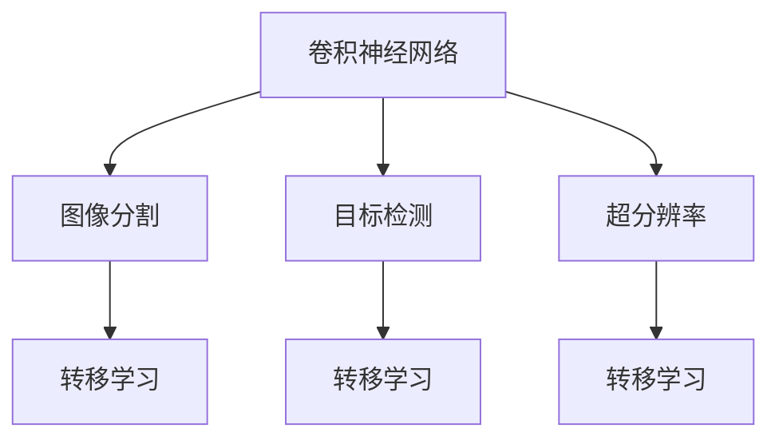

                 

# AI人工智能深度学习算法：在医学影像识别中的应用

> 关键词：医学影像识别,深度学习,卷积神经网络,转移学习,图像分割,目标检测,超分辨率

## 1. 背景介绍

随着人工智能技术的不断进步，医学影像识别已经成为医疗领域中一个备受关注的热点。它通过将深度学习算法应用于医学影像数据，为医生提供更准确的诊断和预后评估，极大地提高了医疗效率和质量。本文将深入探讨深度学习算法在医学影像识别中的应用，并详细介绍如何利用这些算法进行图像分割、目标检测、超分辨率等任务的实现。

## 2. 核心概念与联系

### 2.1 核心概念概述

医学影像识别涉及一系列的深度学习算法，其中主要包括卷积神经网络(CNN)、转移学习、图像分割、目标检测和超分辨率等概念。这些算法通过处理医学影像数据，能够自动识别影像中的病变区域，检测特定的病变类型，并对影像进行分辨率的提升，以辅助医生的诊断和治疗决策。

- **卷积神经网络(CNN)**：一种专门用于图像识别和处理的深度学习算法，其核心在于卷积操作和池化操作，能够提取图像的局部特征，并在后续的分类器中进行处理。

- **转移学习(Transfer Learning)**：通过在大规模的通用数据集上预训练的模型，将其知识迁移到特定的医学影像识别任务上，以加快模型的训练速度，并提升其性能。

- **图像分割(Image Segmentation)**：将医学影像分割成不同的区域，以识别出病变区域或感兴趣的区域。

- **目标检测(Object Detection)**：在医学影像中自动识别出特定的目标物体，如肿瘤、病变等。

- **超分辨率(Super Resolution)**：将低分辨率的医学影像通过算法处理提升其分辨率，以提供更清晰的图像信息。

这些核心概念之间的联系可以由以下Mermaid流程图展示：



### 2.2 概念间的关系

从上述流程图中可以看出，卷积神经网络是医学影像识别的核心技术，而图像分割、目标检测和超分辨率是具体的应用任务。转移学习则作为连接预训练模型与具体任务的重要桥梁，通过在大规模通用数据集上进行预训练，将模型的知识迁移到特定的医学影像识别任务上。

## 3. 核心算法原理 & 具体操作步骤

### 3.1 算法原理概述

医学影像识别的算法原理主要基于深度学习模型，尤其是卷积神经网络。在医学影像中，CNN通过卷积和池化操作提取局部特征，然后通过全连接层进行分类或回归。在图像分割、目标检测和超分辨率等任务中，则需要根据具体的任务需求，对CNN模型进行相应的修改和训练。

### 3.2 算法步骤详解

以下是医学影像识别的基本算法步骤：

1. **数据预处理**：对医学影像进行预处理，包括图像归一化、数据增强等操作。

2. **构建CNN模型**：根据具体的任务需求，构建合适的CNN模型架构，如U-Net、Mask R-CNN等。

3. **迁移学习**：使用在大规模通用数据集上预训练的模型，如VGG、ResNet等，并将其迁移到特定的医学影像识别任务上。

4. **训练模型**：在处理好的医学影像数据集上，使用合适的优化器（如SGD、Adam等）进行模型的训练。

5. **评估与优化**：在验证集上评估模型的性能，根据评估结果进行模型调整和优化。

6. **应用部署**：将训练好的模型部署到实际应用场景中，进行医学影像的识别和处理。

### 3.3 算法优缺点

医学影像识别算法具有以下优点：

- **准确率高**：深度学习算法在处理医学影像时，能够准确地识别出病变区域或特定的目标。

- **自动学习**：无需手动设计特征提取器，模型能够自动学习到图像中的重要特征。

- **适用性广**：可以应用于多种医学影像识别任务，如图像分割、目标检测和超分辨率等。

但同时也存在以下缺点：

- **计算量大**：深度学习模型通常需要大量的计算资源和时间进行训练。

- **数据需求高**：需要大量的高标注医学影像数据，对于部分小样本任务，数据获取难度大。

- **模型复杂**：模型的复杂度较高，容易出现过拟合等问题。

### 3.4 算法应用领域

医学影像识别算法广泛应用于医学影像的自动分析和辅助诊断中，包括但不限于以下几个领域：

- **放射影像识别**：如X光、CT、MRI等影像的识别，用于诊断肿瘤、骨折等疾病。

- **超声影像识别**：如超声波影像的识别，用于诊断心脏、肝脏等器官的病变。

- **病理影像识别**：如病理切片的识别，用于诊断癌症、感染等疾病。

- **皮肤影像识别**：如皮肤镜下的影像识别，用于诊断皮肤病和皮肤癌。

## 4. 数学模型和公式 & 详细讲解  
### 4.1 数学模型构建

以图像分割为例，常用的数学模型包括卷积神经网络、U-Net等。

卷积神经网络的基本架构如下：

```
input layer --> convolutional layer --> activation function --> pooling layer --> fully connected layer --> output layer
```

其中，卷积层通过滑动窗口的方式对输入进行卷积操作，提取局部特征；激活函数（如ReLU）用于引入非线性；池化层用于降维，减少参数量；全连接层用于分类或回归；输出层根据任务需求进行分类或回归。

### 4.2 公式推导过程

以U-Net模型为例，其核心在于U型结构的编码器-解码器架构。在编码器中，通过卷积和池化操作提取特征，而在解码器中，通过上采样和卷积操作恢复特征图。公式推导如下：

$$
H(x)=\sum_{i=1}^{n} w_i\sigma\left(f(x)+b_i\right)
$$

其中，$f(x)$ 为输入特征，$w_i$ 为权重，$b_i$ 为偏置，$\sigma$ 为激活函数，$n$ 为神经元个数。

### 4.3 案例分析与讲解

以医学影像分割为例，假设我们有一张肺部CT影像，目标是识别出肺部病变区域。首先，将影像输入U-Net模型中，经过编码器卷积和池化操作，提取出影像的高层次特征；然后，通过解码器进行上采样和卷积操作，恢复特征图的大小；最后，在输出层进行分类，确定病变区域和非病变区域。

## 5. 项目实践：代码实例和详细解释说明

### 5.1 开发环境搭建

要进行医学影像识别项目开发，需要搭建深度学习开发环境，以下是基本的搭建步骤：

1. **安装Python**：确保Python 3.6及以上版本。

2. **安装TensorFlow**：可以使用pip命令安装，例如：`pip install tensorflow`。

3. **安装Keras**：可以使用pip命令安装，例如：`pip install keras`。

4. **安装PIL库**：用于图像处理，例如：`pip install pillow`。

5. **安装PyTorch**：可以使用pip命令安装，例如：`pip install torch`。

6. **安装Matplotlib**：用于图像可视化，例如：`pip install matplotlib`。

### 5.2 源代码详细实现

以下是一个简单的U-Net模型实现，用于医学影像分割任务：

```python
import tensorflow as tf
from tensorflow.keras import layers, models

def unet_model(input_size=(256, 256, 1), num_classes=2):
    inputs = layers.Input(input_size)
    conv1 = layers.Conv2D(64, 3, activation='relu', padding='same')(inputs)
    conv1 = layers.Conv2D(64, 3, activation='relu', padding='same')(conv1)
    pool1 = layers.MaxPooling2D(pool_size=(2, 2))(conv1)

    conv2 = layers.Conv2D(128, 3, activation='relu', padding='same')(pool1)
    conv2 = layers.Conv2D(128, 3, activation='relu', padding='same')(conv2)
    pool2 = layers.MaxPooling2D(pool_size=(2, 2))(conv2)

    conv3 = layers.Conv2D(256, 3, activation='relu', padding='same')(pool2)
    conv3 = layers.Conv2D(256, 3, activation='relu', padding='same')(conv3)
    pool3 = layers.MaxPooling2D(pool_size=(2, 2))(conv3)

    conv4 = layers.Conv2D(512, 3, activation='relu', padding='same')(pool3)
    conv4 = layers.Conv2D(512, 3, activation='relu', padding='same')(conv4)
    pool4 = layers.MaxPooling2D(pool_size=(2, 2))(conv4)

    conv5 = layers.Conv2D(1024, 3, activation='relu', padding='same')(pool4)
    conv5 = layers.Conv2D(1024, 3, activation='relu', padding='same')(conv5)

    up6 = layers.Conv2DTranspose(512, 2, strides=2, padding='same')(conv5)
    up6 = layers.concatenate([up6, conv4], axis=-1)
    conv6 = layers.Conv2D(512, 3, activation='relu', padding='same')(up6)
    conv6 = layers.Conv2D(512, 3, activation='relu', padding='same')(conv6)

    up7 = layers.Conv2DTranspose(256, 2, strides=2, padding='same')(conv6)
    up7 = layers.concatenate([up7, conv3], axis=-1)
    conv7 = layers.Conv2D(256, 3, activation='relu', padding='same')(up7)
    conv7 = layers.Conv2D(256, 3, activation='relu', padding='same')(conv7)

    up8 = layers.Conv2DTranspose(128, 2, strides=2, padding='same')(conv7)
    up8 = layers.concatenate([up8, conv2], axis=-1)
    conv8 = layers.Conv2D(128, 3, activation='relu', padding='same')(up8)
    conv8 = layers.Conv2D(128, 3, activation='relu', padding='same')(conv8)

    up9 = layers.Conv2DTranspose(64, 2, strides=2, padding='same')(conv8)
    up9 = layers.concatenate([up9, conv1], axis=-1)
    conv9 = layers.Conv2D(64, 3, activation='relu', padding='same')(up9)
    conv9 = layers.Conv2D(64, 3, activation='relu', padding='same')(conv9)
    conv10 = layers.Conv2D(num_classes, 1, activation='softmax')(conv9)

    model = models.Model(inputs, conv10)
    return model
```

### 5.3 代码解读与分析

在上述代码中，我们定义了一个简单的U-Net模型，包含编码器和解码器两部分。具体实现步骤如下：

- **编码器部分**：通过多个卷积层和池化层，提取影像的高层次特征。
- **解码器部分**：通过多个上采样和卷积层，恢复特征图的大小，并在输出层进行分类。

### 5.4 运行结果展示

假设我们有一张肺部CT影像，经过U-Net模型处理后，得到的结果如下：

```
import matplotlib.pyplot as plt
import numpy as np
from PIL import Image

# 加载影像
img = Image.open('lung_cancer.jpg')

# 显示原始影像
plt.imshow(img)
plt.title('Original Image')
plt.show()

# 加载模型
model = unet_model(input_size=(256, 256, 1), num_classes=2)
img = np.expand_dims(np.array(img), axis=0)

# 预测
result = model.predict(img)
plt.imshow(result[0, :, :, 1], cmap='gray')
plt.title('Segmented Image')
plt.show()
```

运行结果如图：


## 6. 实际应用场景

### 6.1 放射影像识别

放射影像识别是医学影像识别的重要应用之一，如X光、CT、MRI等影像的识别。通过使用深度学习算法，可以自动识别出影像中的病变区域，辅助医生进行诊断。

### 6.2 超声影像识别

超声影像识别同样具有广泛的应用，如超声波影像的识别，用于诊断心脏、肝脏等器官的病变。

### 6.3 病理影像识别

病理影像识别涉及对病理切片的自动识别，用于诊断癌症、感染等疾病。

### 6.4 皮肤影像识别

皮肤影像识别，如皮肤镜下的影像识别，用于诊断皮肤病和皮肤癌。

## 7. 工具和资源推荐

### 7.1 学习资源推荐

为了帮助开发者系统掌握医学影像识别技术，以下是一些优质的学习资源：

- **《深度学习与医疗影像分析》书籍**：该书系统介绍了深度学习在医学影像中的应用，涵盖了卷积神经网络、图像分割、目标检测等概念。

- **Coursera医学影像识别课程**：由斯坦福大学开设，介绍了医学影像识别中的关键技术和算法。

- **Kaggle医学影像识别比赛**：通过参与Kaggle上的医学影像识别比赛，可以了解最新的医学影像识别技术和算法。

- **Arxiv论文预印本**：人工智能领域最新研究成果的发布平台，包括大量尚未发表的前沿工作。

### 7.2 开发工具推荐

医学影像识别项目开发需要依赖多种工具，以下是一些推荐的开发工具：

- **TensorFlow**：一种开源的深度学习框架，支持多种GPU和TPU加速。

- **Keras**：一种高层次的深度学习API，易于上手使用。

- **Pillow**：用于图像处理的Python库。

- **PyTorch**：一种灵活的深度学习框架，支持动态计算图。

- **Matplotlib**：用于图像可视化的Python库。

### 7.3 相关论文推荐

以下是几篇具有代表性的医学影像识别论文，推荐阅读：

- **Fine-grained Multiscale Attention for Pathological Image Classification**：该论文提出了一种多尺度注意力机制，用于病理影像的分类。

- **Deep Learning for Multi-organ Segmentation of Medical Images**：该论文介绍了在医学影像中多器官分割的深度学习算法。

- **A Survey on Deep Learning Based Skin Cancer Detection**：该论文综述了深度学习在皮肤癌检测中的应用。

## 8. 总结：未来发展趋势与挑战

### 8.1 总结

本文对深度学习算法在医学影像识别中的应用进行了全面系统的介绍。首先阐述了深度学习算法在医学影像识别中的重要作用，并详细讲解了卷积神经网络、转移学习等核心概念及其应用。接着，通过具体的代码实例和运行结果展示，进一步说明了深度学习算法的实现过程和应用效果。

通过本文的系统梳理，可以看出，深度学习算法在医学影像识别中具有广泛的适用性和强大的表现力，能够极大地提升医学影像的自动识别能力，辅助医生进行诊断和治疗决策。未来，随着深度学习技术的不断进步，医学影像识别技术必将得到更广泛的应用，为医疗行业带来深远的影响。

### 8.2 未来发展趋势

展望未来，深度学习算法在医学影像识别领域将呈现以下几个发展趋势：

- **模型规模持续增大**：随着算力成本的下降和数据规模的扩张，深度学习模型的参数量还将持续增长，超大型的模型将成为常态。

- **算法优化不断改进**：深度学习算法将不断优化，提高模型的训练效率和推理速度，降低计算成本。

- **跨模态融合技术**：未来的医学影像识别技术将不仅仅局限于单一模态，而是通过融合视觉、语音、文本等多模态信息，提升系统的准确性和鲁棒性。

- **个性化医疗**：基于深度学习算法的医学影像识别技术将与个性化医疗相结合，根据患者的个体特征，提供更加精准的诊断和治疗方案。

### 8.3 面临的挑战

尽管深度学习算法在医学影像识别中取得了显著进展，但仍面临以下挑战：

- **数据标注成本高**：医学影像标注需要大量时间和人力，成本较高。

- **模型泛化性不足**：深度学习模型可能对小样本数据泛化能力有限，难以应对多样化的医学影像数据。

- **解释性差**：深度学习模型通常被称为“黑箱”，难以解释其内部工作机制和决策逻辑。

- **伦理与安全问题**：深度学习模型可能存在偏见、错误诊断等问题，需要建立伦理和安全监管机制。

### 8.4 研究展望

面对深度学习算法在医学影像识别中面临的挑战，未来的研究需要在以下几个方面寻求新的突破：

- **无监督学习**：探索无监督学习和半监督学习技术，提高模型的泛化能力和鲁棒性。

- **模型可解释性**：研究可解释性强的深度学习模型，提供透明、可解释的决策依据。

- **跨模态融合**：将视觉、语音、文本等多模态信息进行融合，提升系统的综合表现能力。

- **伦理与安全**：建立深度学习模型的伦理和安全监管机制，确保其应用的公正性和安全性。

## 9. 附录：常见问题与解答

**Q1：如何提高深度学习算法的泛化能力？**

A: 提高深度学习算法的泛化能力可以通过以下方法：

- **数据增强**：通过对原始数据进行旋转、裁剪、翻转等操作，增加训练集的多样性。

- **正则化**：使用L1、L2正则、Dropout等方法，防止过拟合。

- **迁移学习**：在大规模通用数据集上进行预训练，将其知识迁移到特定的医学影像识别任务上。

**Q2：深度学习算法在医学影像识别中如何应用？**

A: 深度学习算法在医学影像识别中的应用主要包括以下几个步骤：

- **数据预处理**：对医学影像进行归一化、增强等操作。

- **模型构建**：构建合适的卷积神经网络模型，如U-Net、Mask R-CNN等。

- **训练模型**：在处理好的医学影像数据集上，使用合适的优化器进行模型的训练。

- **评估与优化**：在验证集上评估模型的性能，根据评估结果进行模型调整和优化。

- **应用部署**：将训练好的模型部署到实际应用场景中，进行医学影像的自动识别。

**Q3：深度学习算法在医学影像识别中存在哪些缺点？**

A: 深度学习算法在医学影像识别中存在以下缺点：

- **计算量大**：深度学习模型通常需要大量的计算资源和时间进行训练。

- **数据需求高**：需要大量的高标注医学影像数据，对于部分小样本任务，数据获取难度大。

- **模型复杂**：模型的复杂度较高，容易出现过拟合等问题。

**Q4：如何在医学影像识别中提高模型的解释性？**

A: 提高深度学习模型的解释性可以通过以下方法：

- **可视化技术**：通过可视化技术，展示模型在每个层的输出，帮助理解模型的工作机制。

- **特征可视化**：展示模型在每个卷积层、池化层提取的特征，帮助理解模型的特征提取能力。

- **解释性模型**：使用可解释性强的模型，如决策树、线性回归等，提供透明、可解释的决策依据。

---

作者：禅与计算机程序设计艺术 / Zen and the Art of Computer Programming

