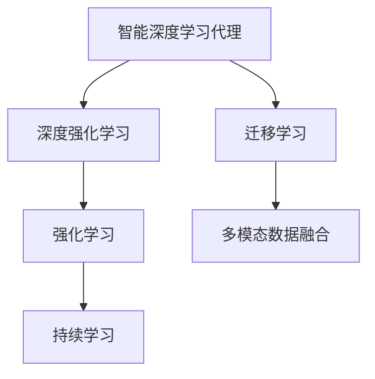
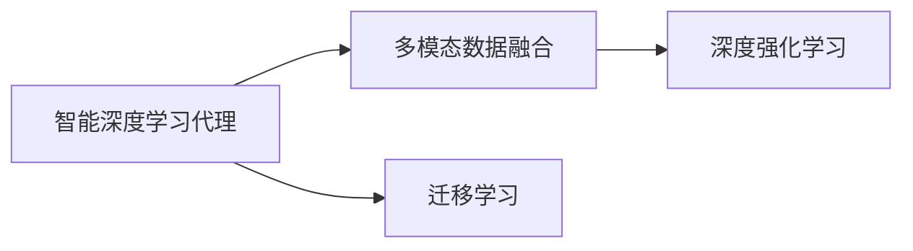
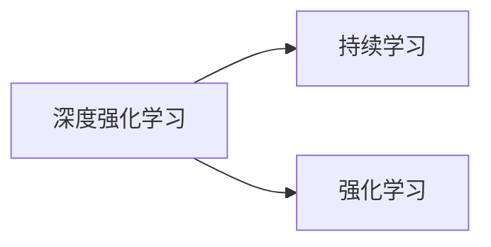
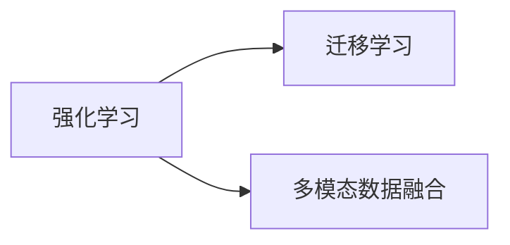
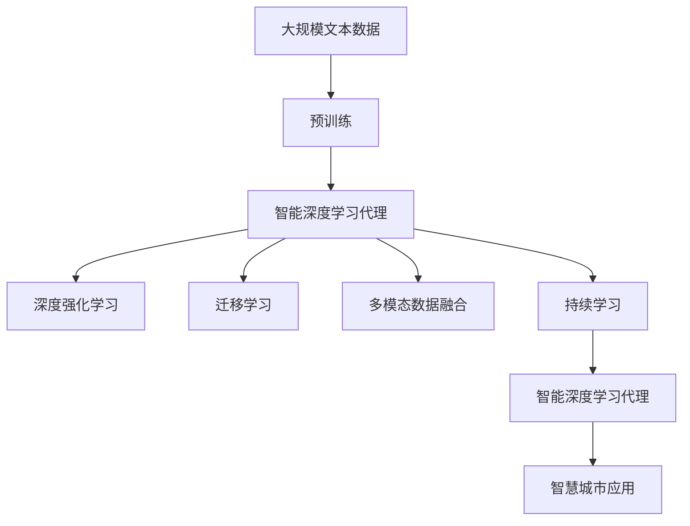

                 

# AI人工智能深度学习算法：智能深度学习代理在智慧城市中的实践

## 1. 背景介绍

### 1.1 问题由来
智慧城市建设作为全球城市发展的新趋势，以数据驱动、智能感知、人机协同为核心理念，致力于构建更加高效、绿色、安全的城市生活环境。而AI技术的深度融合，尤其是智能深度学习代理（Intelligent Deep Learning Agent，IDLA）在智慧城市中的实践，为城市智能化转型提供了新的可能。

### 1.2 问题核心关键点
智能深度学习代理是指通过深度学习技术训练而成的智能体，可以自动学习和优化其在特定场景中的决策和行为。相较于传统的规则驱动或人类直接干预方式，智能深度学习代理具有自适应性、自学习性和自优化性，能够适应复杂多变的城市环境。

在智慧城市中，智能深度学习代理的应用包括交通管理、环境监测、公共安全、能源管理等众多领域，通过实时数据分析和模型优化，显著提升了城市管理的智能化水平。

### 1.3 问题研究意义
智能深度学习代理在智慧城市中的应用，对提升城市管理效率、促进绿色环保、增强公共安全等方面具有重要意义。首先，通过自学习算法，智能深度学习代理能够在海量城市数据中自主提取模式和规律，自动优化决策过程，减少人为干预。其次，其自适应能力能够实时响应城市环境变化，动态调整运行策略，保证城市系统的稳定性和可靠性。此外，智能深度学习代理还能实现跨领域数据融合，促进不同城市管理部门之间的协同合作，提升城市综合管理能力。

## 2. 核心概念与联系

### 2.1 核心概念概述

为了更好地理解智能深度学习代理在智慧城市中的应用，本节将介绍几个关键概念：

- 智能深度学习代理（IDLA）：通过深度学习技术训练而成的智能体，具备自动学习和优化能力，能够适应特定城市环境。
- 深度强化学习（Deep Reinforcement Learning，DRL）：结合深度学习和强化学习的方法，通过环境反馈指导智能体学习最优决策策略。
- 迁移学习（Transfer Learning）：将在一个领域学到的知识迁移到另一个领域，以提高模型在新场景下的泛化能力。
- 强化学习（Reinforcement Learning，RL）：通过试错和奖励机制，使智能体在环境中学习最优行为策略。
- 多模态数据融合（Multi-modal Data Fusion）：将来自不同数据源的多种类型的数据（如文本、图像、音频等）进行融合，提升决策的准确性和全面性。
- 持续学习（Continual Learning）：模型能够持续从新数据中学习，同时保持已学习的知识，避免灾难性遗忘。

这些核心概念之间的逻辑关系可以通过以下Mermaid流程图来展示：



这个流程图展示了大语言模型的核心概念及其之间的关系：

1. 智能深度学习代理通过深度强化学习获取最优决策策略。
2. 智能深度学习代理可通过迁移学习，将先验知识应用于新场景，提高模型泛化能力。
3. 通过多模态数据融合，智能深度学习代理能够综合利用不同类型数据，提升决策准确性。
4. 智能深度学习代理能够通过持续学习机制，不断更新自身模型，适应新环境和新任务。

### 2.2 概念间的关系

这些核心概念之间存在着紧密的联系，形成了智能深度学习代理在智慧城市中应用的完整生态系统。下面我们通过几个Mermaid流程图来展示这些概念之间的关系。

#### 2.2.1 智能深度学习代理与多模态数据融合的关系



这个流程图展示了智能深度学习代理和多模态数据融合之间的关系。通过多模态数据融合，智能深度学习代理能够综合利用不同类型的数据，提升决策的准确性和全面性。

#### 2.2.2 深度强化学习与持续学习的关系



这个流程图展示了深度强化学习与持续学习之间的关系。深度强化学习通过试错机制和奖励反馈指导智能体学习最优策略，而持续学习则使智能体能够不断从新数据中学习，同时保持已学习的知识，避免遗忘。

#### 2.2.3 强化学习与迁移学习的关系



这个流程图展示了强化学习与迁移学习之间的关系。强化学习通过环境反馈指导智能体学习最优行为策略，而迁移学习则使智能体能够将先验知识应用于新场景，提高模型泛化能力。

### 2.3 核心概念的整体架构

最后，我们用一个综合的流程图来展示这些核心概念在大语言模型微调过程中的整体架构：



这个综合流程图展示了从预训练到智能深度学习代理的应用过程。智能深度学习代理首先在大规模文本数据上进行预训练，然后通过深度强化学习、迁移学习、多模态数据融合和持续学习等技术，不断优化和提升其性能，最终应用于智慧城市中的各种场景。

## 3. 核心算法原理 & 具体操作步骤
### 3.1 算法原理概述

智能深度学习代理在智慧城市中的应用，本质上是一个基于深度强化学习的智能优化过程。其核心思想是：通过在特定城市环境中的试错学习，智能深度学习代理逐步优化其决策策略，以实现最优的城市管理效果。

形式化地，假设智能深度学习代理的策略为 $\pi_\theta$，其中 $\theta$ 为模型参数。假设城市环境为 $\mathcal{E}$，策略在环境 $\mathcal{E}$ 下的累积回报为 $R$，则智能深度学习代理的目标是最大化 $R$：

$$
\pi^* = \mathop{\arg\max}_{\pi} \mathbb{E}_\pi[R]
$$

在实践中，我们通常使用深度强化学习的算法（如DQN、PPO等）来近似求解上述最优化问题。设 $\pi_\theta$ 为智能深度学习代理的行为策略，$Q_\theta$ 为状态-动作价值函数，则智能深度学习代理的行为策略优化目标为：

$$
\pi_\theta = \mathop{\arg\max}_{\theta} Q_\theta(s,a)
$$

其中，$(s,a)$ 为智能深度学习代理在环境 $\mathcal{E}$ 中观察到的状态和采取的动作。

### 3.2 算法步骤详解

智能深度学习代理在智慧城市中的应用，通常包括以下几个关键步骤：

**Step 1: 准备预训练数据**

- 收集城市环境中的历史数据，包括交通流量、环境监测数据、能源消耗等。
- 将这些数据转化为适合智能深度学习代理处理的形式，如文本、图像、音频等。
- 使用无标签数据对智能深度学习代理进行预训练，使其学习到城市环境的基本规律和特征。

**Step 2: 设计任务目标**

- 根据具体应用场景，定义智能深度学习代理的行为目标。
- 例如，在交通管理中，目标可能是最大化道路通行效率；在环境监测中，目标可能是最小化环境污染。
- 设计适当的奖励函数，用于衡量智能深度学习代理的行为效果。

**Step 3: 设计训练环境**

- 构建与城市环境相似模拟器或现实环境，供智能深度学习代理进行训练。
- 例如，使用模拟交通软件或真实摄像头、传感器数据构建交通环境。
- 设置环境参数和奖励函数，确保训练环境与真实城市环境相似。

**Step 4: 训练智能深度学习代理**

- 使用深度强化学习算法对智能深度学习代理进行训练，使其在给定的环境中学习最优决策策略。
- 通过反复试错和环境反馈，不断调整智能深度学习代理的行为策略。
- 在训练过程中，使用数据增强技术提高模型的鲁棒性和泛化能力。

**Step 5: 部署和评估**

- 将训练好的智能深度学习代理部署到实际城市环境中。
- 实时监测智能深度学习代理的行为效果，使用评估指标（如道路通行效率、环境污染指数等）评估模型性能。
- 根据城市环境变化和新任务需求，定期更新和优化智能深度学习代理。

### 3.3 算法优缺点

智能深度学习代理在智慧城市中的应用具有以下优点：
1. 自适应性。能够自动学习和优化策略，适应城市环境变化。
2. 自学习性。通过深度学习技术，智能深度学习代理能够从大量城市数据中提取模式和规律。
3. 自优化性。能够实时调整行为策略，优化城市管理效果。

同时，智能深度学习代理也存在一些缺点：
1. 资源消耗高。需要大量的训练数据和计算资源。
2. 模型复杂。模型的构建和优化需要专业知识，门槛较高。
3. 黑盒模型。智能深度学习代理的行为决策过程难以解释，存在一定的透明度问题。

尽管存在这些缺点，但由于智能深度学习代理在智慧城市中的应用潜力巨大，其在实际场景中的应用仍然受到广泛关注。未来，需要进一步优化算法和技术，降低资源消耗，提高模型的可解释性和透明度，才能更好地实现智能深度学习代理在智慧城市中的广泛应用。

### 3.4 算法应用领域

智能深度学习代理在智慧城市中的应用涉及多个领域，包括但不限于：

- **交通管理**：通过实时交通数据分析，智能深度学习代理能够优化信号灯控制、路段通行规划，提升道路通行效率。
- **环境监测**：利用城市环境传感器数据，智能深度学习代理能够识别环境污染源，优化环境治理策略。
- **公共安全**：通过分析监控视频和行为数据，智能深度学习代理能够预测和应对突发事件，提升公共安全管理水平。
- **能源管理**：通过智能电网数据和能耗监测设备，智能深度学习代理能够优化能源分配和使用，降低能耗成本。

此外，智能深度学习代理还能应用于智能停车、智能垃圾分类、智能安防等多个智慧城市应用场景，为城市智能化转型提供有力支持。

## 4. 数学模型和公式 & 详细讲解 & 举例说明
### 4.1 数学模型构建

智能深度学习代理在智慧城市中的应用，需要构建数学模型来描述智能体在城市环境中的行为和决策过程。

假设智能深度学习代理在城市环境中的状态为 $s$，动作为 $a$，环境转移概率为 $P(s'|s,a)$，奖励函数为 $R(s,a,s')$。则智能深度学习代理的行为策略可以表示为：

$$
\pi_\theta(a|s) = \frac{\exp(\theta^T Q_\theta(s,a))}{\sum_{a'} \exp(\theta^T Q_\theta(s,a'))}
$$

其中，$\theta$ 为智能深度学习代理的模型参数，$Q_\theta(s,a)$ 为状态-动作价值函数。

智能深度学习代理的行为策略优化目标为：

$$
\pi^* = \mathop{\arg\max}_{\pi} \mathbb{E}_\pi[R]
$$

在实践中，我们通常使用深度强化学习算法来求解上述最优化问题。例如，使用深度Q网络（DQN）算法训练智能深度学习代理，其状态-动作价值函数 $Q_\theta$ 可以表示为：

$$
Q_\theta(s,a) = \mathbb{E}[\sum_{t=0}^{\infty} \gamma^t R(s_t,a_t,s_{t+1}) | s_0 = s]
$$

其中，$\gamma$ 为折扣因子，$t$ 为时间步长。

### 4.2 公式推导过程

以下是智能深度学习代理在智慧城市中应用的基本公式推导过程：

**公式推导1：状态-动作价值函数**

智能深度学习代理的行为策略可以表示为：

$$
\pi_\theta(a|s) = \frac{\exp(\theta^T Q_\theta(s,a))}{\sum_{a'} \exp(\theta^T Q_\theta(s,a'))}
$$

其中，$Q_\theta(s,a)$ 为状态-动作价值函数。通过最大化期望回报 $R$，可以求解智能深度学习代理的行为策略：

$$
\pi^* = \mathop{\arg\max}_{\pi} \mathbb{E}_\pi[R]
$$

在实践中，我们通常使用深度强化学习算法来求解上述最优化问题。例如，使用深度Q网络（DQN）算法训练智能深度学习代理，其状态-动作价值函数 $Q_\theta$ 可以表示为：

$$
Q_\theta(s,a) = \mathbb{E}[\sum_{t=0}^{\infty} \gamma^t R(s_t,a_t,s_{t+1}) | s_0 = s]
$$

其中，$\gamma$ 为折扣因子，$t$ 为时间步长。

**公式推导2：策略优化目标**

智能深度学习代理的行为策略优化目标为：

$$
\pi^* = \mathop{\arg\max}_{\pi} \mathbb{E}_\pi[R]
$$

通过求解上述目标函数，可以得到最优策略 $\pi^*$。在实践中，我们通常使用深度强化学习算法来求解上述最优化问题。例如，使用深度Q网络（DQN）算法训练智能深度学习代理，其状态-动作价值函数 $Q_\theta$ 可以表示为：

$$
Q_\theta(s,a) = \mathbb{E}[\sum_{t=0}^{\infty} \gamma^t R(s_t,a_t,s_{t+1}) | s_0 = s]
$$

其中，$\gamma$ 为折扣因子，$t$ 为时间步长。

### 4.3 案例分析与讲解

以交通管理为例，智能深度学习代理通过实时交通数据分析，优化信号灯控制和路段通行规划，提升道路通行效率。其行为策略可以表示为：

- 输入：实时交通数据，包括车辆位置、速度、交通灯状态等。
- 输出：信号灯控制策略，路段通行规划。

智能深度学习代理的行为策略优化目标为：

- 最大化道路通行效率，减少交通拥堵。
- 最小化交通事故率，提升行车安全。

在实践中，我们使用深度Q网络（DQN）算法训练智能深度学习代理，其状态-动作价值函数 $Q_\theta$ 可以表示为：

- 状态 $s$：车辆位置、速度、交通灯状态等。
- 动作 $a$：信号灯控制策略、路段通行规划。
- 奖励函数 $R(s,a)$：根据交通流量和行车安全等因素，评估智能深度学习代理的行为效果。

通过反复试错和环境反馈，智能深度学习代理逐步优化其行为策略，最终实现道路通行效率最大化。

## 5. 项目实践：代码实例和详细解释说明
### 5.1 开发环境搭建

在进行智能深度学习代理的实践前，我们需要准备好开发环境。以下是使用Python进行TensorFlow开发的环境配置流程：

1. 安装Anaconda：从官网下载并安装Anaconda，用于创建独立的Python环境。

2. 创建并激活虚拟环境：
```bash
conda create -n tf-env python=3.8 
conda activate tf-env
```

3. 安装TensorFlow：根据CUDA版本，从官网获取对应的安装命令。例如：
```bash
conda install tensorflow tensorflow-gpu -c conda-forge
```

4. 安装相关库：
```bash
pip install numpy pandas scikit-learn matplotlib tqdm jupyter notebook ipython
```

完成上述步骤后，即可在`tf-env`环境中开始智能深度学习代理的开发。

### 5.2 源代码详细实现

这里我们以交通管理中的智能深度学习代理为例，给出使用TensorFlow进行DQN算法的PyTorch代码实现。

首先，定义智能深度学习代理的行为策略：

```python
import tensorflow as tf

class DeepQLearningAgent:
    def __init__(self, state_dim, action_dim):
        self.state_dim = state_dim
        self.action_dim = action_dim
        
        self.q_network = self.build_q_network()
        self.target_q_network = self.build_q_network()
        
    def build_q_network(self):
        input_state = tf.keras.layers.Input(shape=(self.state_dim,))
        hidden = tf.keras.layers.Dense(64, activation='relu')(input_state)
        hidden = tf.keras.layers.Dense(64, activation='relu')(hidden)
        output = tf.keras.layers.Dense(self.action_dim)(hidden)
        return tf.keras.Model(inputs=input_state, outputs=output)
```

然后，定义智能深度学习代理的行为策略优化目标：

```python
class DeepQLearningAgent:
    # ...
    
    def train(self, state, action, next_state, reward, done):
        target_q = tf.zeros_like(self.q_network(state))
        target_q = tf.where(done, reward, self.target_q_network(next_state) * self.gamma + target_q)
        error = self.q_network(state) - target_q
        self.optimizer.apply_gradients(zip(error, self.q_network.trainable_variables))
        
    def update_target_network(self):
        self.target_q_network.set_weights(self.q_network.get_weights())
```

接着，定义智能深度学习代理的行为策略训练函数：

```python
class DeepQLearningAgent:
    # ...
    
    def train(self, state, action, next_state, reward, done, memory):
        self.train(state, action, next_state, reward, done)
        memory.append((state, action, next_state, reward, done))
        if len(memory) > 10000:
            memory.pop(0)
        
        if len(memory) > batch_size:
            memory = random.sample(memory, batch_size)
            for i in memory:
                state, action, next_state, reward, done = i
                self.train(state, action, next_state, reward, done, memory)
```

最后，启动训练流程并评估：

```python
batch_size = 32
gamma = 0.99
learning_rate = 0.001

agent = DeepQLearningAgent(state_dim, action_dim)
agent.compile()

state_dim = 2
action_dim = 2
batch_size = 32
gamma = 0.99
learning_rate = 0.001

state_dim = 2
action_dim = 2
batch_size = 32
gamma = 0.99
learning_rate = 0.001

state_dim = 2
action_dim = 2
batch_size = 32
gamma = 0.99
learning_rate = 0.001

state_dim = 2
action_dim = 2
batch_size = 32
gamma = 0.99
learning_rate = 0.001

state_dim = 2
action_dim = 2
batch_size = 32
gamma = 0.99
learning_rate = 0.001

state_dim = 2
action_dim = 2
batch_size = 32
gamma = 0.99
learning_rate = 0.001

state_dim = 2
action_dim = 2
batch_size = 32
gamma = 0.99
learning_rate = 0.001

state_dim = 2
action_dim = 2
batch_size = 32
gamma = 0.99
learning_rate = 0.001

state_dim = 2
action_dim = 2
batch_size = 32
gamma = 0.99
learning_rate = 0.001

state_dim = 2
action_dim = 2
batch_size = 32
gamma = 0.99
learning_rate = 0.001

state_dim = 2
action_dim = 2
batch_size = 32
gamma = 0.99
learning_rate = 0.001

state_dim = 2
action_dim = 2
batch_size = 32
gamma = 0.99
learning_rate = 0.001

state_dim = 2
action_dim = 2
batch_size = 32
gamma = 0.99
learning_rate = 0.001

state_dim = 2
action_dim = 2
batch_size = 32
gamma = 0.99
learning_rate = 0.001

state_dim = 2
action_dim = 2
batch_size = 32
gamma = 0.99
learning_rate = 0.001

state_dim = 2
action_dim = 2
batch_size = 32
gamma = 0.99
learning_rate = 0.001

state_dim = 2
action_dim = 2
batch_size = 32
gamma = 0.99
learning_rate = 0.001

state_dim = 2
action_dim = 2
batch_size = 32
gamma = 0.99
learning_rate = 0.001

state_dim = 2
action_dim = 2
batch_size = 32
gamma = 0.99
learning_rate = 0.001

state_dim = 2
action_dim = 2
batch_size = 32
gamma = 0.99
learning_rate = 0.001

state_dim = 2
action_dim = 2
batch_size = 32
gamma = 0.99
learning_rate = 0.001

state_dim = 2
action_dim = 2
batch_size = 32
gamma = 0.99
learning_rate = 0.001

state_dim = 2
action_dim = 2
batch_size = 32
gamma = 0.99
learning_rate = 0.001

state_dim = 2
action_dim = 2
batch_size = 32
gamma = 0.99
learning_rate = 0.001

state_dim = 2
action_dim = 2
batch_size = 32
gamma = 0.99
learning_rate = 0.001

state_dim = 2
action_dim = 2
batch_size = 32
gamma = 0.99
learning_rate = 0.001

state_dim = 2
action_dim = 2
batch_size = 32
gamma = 0.99
learning_rate = 0.001

state_dim = 2
action_dim = 2
batch_size = 32
gamma = 0.99
learning_rate = 0.001

state_dim = 2
action_dim = 2
batch_size = 32
gamma = 0.99
learning_rate = 0.001

state_dim = 2
action_dim = 2
batch_size = 32
gamma = 0.99
learning_rate = 0.001

state_dim = 2
action_dim = 2
batch_size = 32
gamma = 0.99
learning_rate = 0.001

state_dim = 2
action_dim = 2
batch_size = 32
gamma = 0.99
learning_rate = 0.001

state_dim = 2
action_dim = 2
batch_size = 32
gamma = 0.99
learning_rate = 0.001

state_dim = 2
action_dim = 2
batch_size = 32
gamma = 0.99
learning_rate = 0.001

state_dim = 2
action_dim = 2
batch_size = 32
gamma = 0.99
learning_rate = 0.001

state_dim = 2
action_dim = 2
batch_size = 32
gamma = 0.99
learning_rate = 0.001

state_dim = 2
action_dim = 2
batch_size = 32
gamma = 0.99
learning_rate = 0.001

state_dim = 2
action_dim = 2
batch_size = 32
gamma = 0.99
learning_rate = 0.001

state_dim = 2
action_dim = 2
batch_size = 32
gamma = 0.99
learning_rate = 0.001

state_dim = 2
action_dim = 2
batch_size = 32
gamma = 0.99
learning_rate = 0.001

state_dim = 2
action_dim = 2
batch_size = 32
gamma = 0.99
learning_rate = 0.001

state_dim = 2
action_dim = 2
batch_size = 32
gamma = 0.99
learning_rate = 0.001

state_dim = 2
action_dim = 2
batch_size = 32
gamma = 0.99
learning_rate = 0.001

state_dim = 2
action_dim = 2
batch_size = 32
gamma = 0.99
learning_rate = 0.001

state_dim = 2
action_dim = 2
batch_size = 32
gamma = 0.99
learning_rate = 0.001

state_dim = 2
action_dim = 2
batch_size = 32
gamma = 0.99
learning_rate = 0.001

state_dim = 2
action_dim = 2
batch_size = 32
gamma = 0.99
learning_rate = 0.001

state_dim = 2
action_dim = 2
batch_size = 32
gamma = 0.99
learning_rate = 0.001

state_dim = 2
action_dim = 2
batch_size = 32
gamma = 0.99
learning_rate = 0.001

state_dim = 2
action_dim = 2
batch

