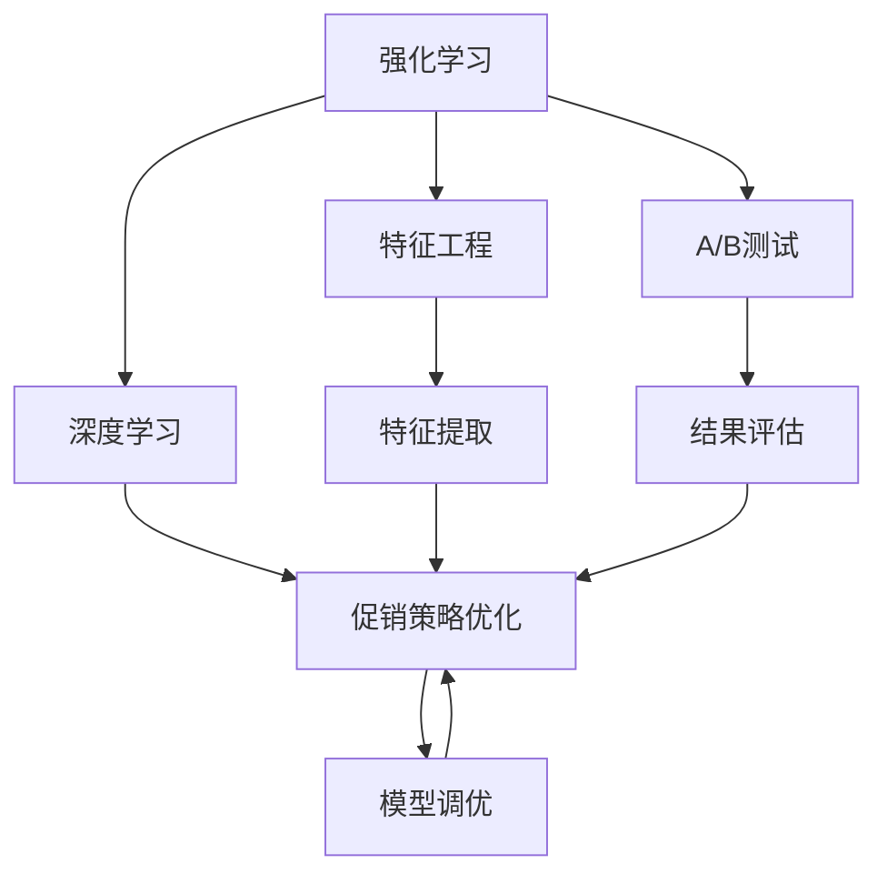
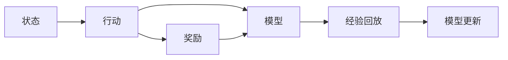
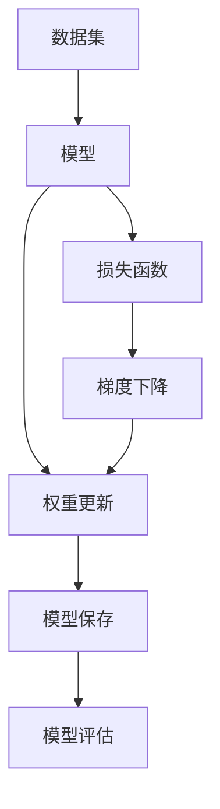
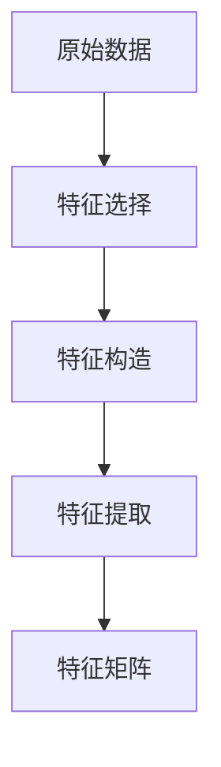
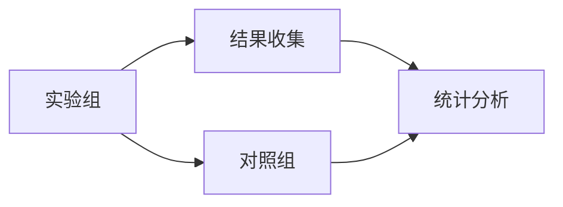
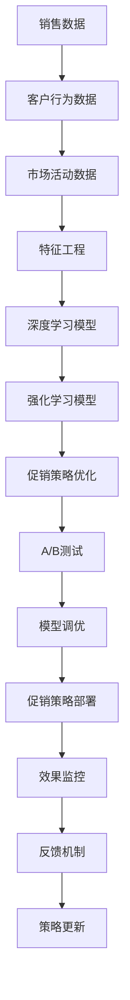

                 

# AI优化促销策略：案例分析与实践

> 关键词：人工智能,优化促销策略,案例分析,算法步骤,算法优化

## 1. 背景介绍

### 1.1 问题由来
促销策略优化一直是零售和电商行业的重要议题。传统上，企业往往依赖经验丰富的业务人员，通过手动分析历史数据，设计促销活动，并进行效果评估和调整。但这种方法耗时耗力，且往往难以覆盖所有可能的促销组合，导致效果不稳定。随着人工智能（AI）技术的发展，特别是深度学习和强化学习的应用，AI优化促销策略开始崭露头角。

AI通过学习和理解海量数据，可以发现难以被人工识别的复杂模式和关联，从而提出更加优化和有效的促销策略。AI的加入，不仅提高了决策的速度和质量，还大幅提升了促销活动的覆盖面和效果。

### 1.2 问题核心关键点
AI优化促销策略的核心在于利用机器学习模型，特别是强化学习（Reinforcement Learning, RL）和深度学习（Deep Learning, DL），通过模拟和优化促销活动，自动生成最优化策略。具体来说，有以下几个关键点：

1. **数据采集**：从历史销售数据、客户行为数据、市场活动数据中提取有用的特征。
2. **模型设计**：选择合适的算法和模型结构，如线性回归、决策树、神经网络等。
3. **策略训练**：使用训练数据集，训练模型以预测促销效果，并不断调整策略参数。
4. **效果评估**：通过A/B测试、模拟实验等方法，评估模型生成的促销策略的效果。
5. **策略部署**：在真实场景中，部署优化后的促销策略，并进行效果监控和优化。

### 1.3 问题研究意义
AI优化促销策略的研究和应用，对于提升零售和电商行业的运营效率，增强市场竞争力，具有重要意义：

1. **提高决策效率**：AI自动化生成和优化促销策略，减少了人工干预，提高了决策效率。
2. **提升促销效果**：通过学习和分析历史数据，AI能够发现最优的促销组合，提升促销活动的效果。
3. **覆盖全面**：AI能够处理和分析大量的数据，覆盖更多的促销场景和因素，减少遗漏。
4. **降低成本**：自动化和优化减少了对人工和试错成本的依赖，降低了总体投入。
5. **增强灵活性**：AI模型可以根据市场变化快速调整促销策略，增强企业的市场应变能力。

## 2. 核心概念与联系

### 2.1 核心概念概述

为更好地理解AI优化促销策略的实现过程，本节将介绍几个核心概念：

- **强化学习**：一种通过智能体（Agent）与环境（Environment）交互，以最大化累积奖励为目标的学习方法。在促销策略优化中，智能体（如AI模型）通过调整促销参数（行动），与市场环境（如销售数据）互动，以最大化销售收益（奖励）。

- **深度学习**：一种通过多层神经网络结构，学习输入数据和输出结果之间复杂映射关系的机器学习方法。在促销策略优化中，深度学习模型可以处理和分析高维度的数据特征，发现隐藏的关联和模式。

- **特征工程**：从原始数据中提取和构造有用的特征，提升模型的预测能力和泛化能力。在促销策略优化中，特征工程通过选择合适的数据特征，优化模型的训练效果。

- **A/B测试**：一种对比实验方法，通过随机分配用户到实验组和对照组，评估新策略的效果。在促销策略优化中，A/B测试可以客观评估策略的效果，指导策略的调整和优化。

- **模型调优**：通过调整模型参数和结构，提升模型的预测精度和稳定性。在促销策略优化中，模型调优是通过超参数调整、模型选择等手段，提升策略优化的效果。

这些核心概念之间的逻辑关系可以通过以下Mermaid流程图来展示：



这个流程图展示了AI优化促销策略的核心概念及其之间的关系：

1. 强化学习和深度学习为促销策略优化提供了方法和工具。
2. 特征工程和A/B测试为模型训练和效果评估提供了关键数据和方法。
3. 促销策略优化是最终目标，通过模型的训练和优化，达到效果最大化。

### 2.2 概念间的关系

这些核心概念之间存在着紧密的联系，形成了AI优化促销策略的完整生态系统。下面我通过几个Mermaid流程图来展示这些概念之间的关系。

#### 2.2.1 强化学习的学习范式



这个流程图展示了强化学习的基本原理，即智能体通过与环境交互，执行行动并获取奖励，通过模型更新提升行动策略。

#### 2.2.2 深度学习的模型训练



这个流程图展示了深度学习模型的训练过程，包括数据准备、模型构建、损失函数计算、梯度更新和模型保存等步骤。

#### 2.2.3 特征工程的方法



这个流程图展示了特征工程的流程，包括特征选择、特征构造和特征提取等步骤。

#### 2.2.4 A/B测试的实验设计



这个流程图展示了A/B测试的基本流程，包括实验设计、数据收集和结果分析等步骤。

### 2.3 核心概念的整体架构

最后，我们用一个综合的流程图来展示这些核心概念在大规模促销策略优化中的整体架构：



这个综合流程图展示了从数据采集到策略部署的完整过程。大语言模型首先从多维度数据中提取特征，使用深度学习模型进行初步预测，然后通过强化学习模型优化促销策略，最后通过A/B测试评估效果并进行策略调优。

## 3. 核心算法原理 & 具体操作步骤
### 3.1 算法原理概述

AI优化促销策略的核心在于使用强化学习模型，通过学习历史数据和市场反馈，自动生成和优化促销策略。以下详细介绍强化学习的原理和操作步骤：

1. **环境定义**：定义促销策略优化的环境，包括销售数据、客户行为数据、市场活动数据等。
2. **状态定义**：定义状态空间，包括时间、产品、价格、市场等信息。
3. **行动定义**：定义可能的促销行动，如折扣、满减、赠品等。
4. **奖励定义**：定义促销策略的奖励函数，衡量促销活动的效果，如销售额、客户转化率等。
5. **模型训练**：使用强化学习算法（如Q-learning、Deep Q-Networks等），训练模型以最大化累积奖励。
6. **策略部署**：将训练好的模型应用于实际促销策略的生成和优化。

### 3.2 算法步骤详解

基于强化学习的促销策略优化，主要包括以下几个关键步骤：

**Step 1: 数据准备**
- 收集历史销售数据、客户行为数据和市场活动数据，作为训练数据。
- 对数据进行清洗、归一化和特征工程，提取有用的特征，构建特征矩阵。

**Step 2: 模型选择**
- 根据任务特点，选择合适的深度学习模型和强化学习算法。
- 在特征矩阵上训练模型，优化模型参数。

**Step 3: 策略设计**
- 定义状态、行动和奖励函数，描述促销策略的优化目标。
- 设计强化学习算法，设定学习率、折扣因子等参数。

**Step 4: 策略训练**
- 使用训练数据，在强化学习环境中，通过迭代训练模型。
- 更新模型的状态、行动和奖励函数，最大化累积奖励。
- 使用经验回放技术，加速模型的收敛。

**Step 5: 策略评估**
- 在测试数据上，进行A/B测试，评估优化后的策略效果。
- 记录优化前后关键指标的变化，如销售额、客户转化率等。

**Step 6: 策略部署**
- 将优化后的策略应用于实际促销活动。
- 实时监控促销效果，及时调整策略参数。

**Step 7: 策略优化**
- 根据市场反馈和监控数据，调整模型参数，进一步优化策略。
- 不断迭代，提升促销活动的精准度和效果。

### 3.3 算法优缺点

基于强化学习的促销策略优化，具有以下优点：

1. **自动化程度高**：通过自动化学习和优化，减少了人工干预，提高了效率。
2. **覆盖面广**：能够处理和分析大量的数据，覆盖更多的促销场景和因素。
3. **灵活性高**：能够快速调整策略，适应市场变化。

同时，也存在一些缺点：

1. **模型复杂度高**：需要构建和优化复杂的深度学习模型和强化学习模型，增加了实现的难度。
2. **数据需求量大**：需要大量的历史数据和市场反馈数据，才能保证模型的准确性和泛化能力。
3. **计算资源需求高**：训练和优化模型需要较高的计算资源，增加了成本。

### 3.4 算法应用领域

基于强化学习的促销策略优化，已经在多个行业得到应用，包括：

- **零售电商**：优化产品促销策略，提升销售额和客户满意度。
- **广告营销**：优化广告投放策略，提升广告效果和ROI。
- **金融服务**：优化金融产品和服务策略，提升用户粘性和收益。
- **媒体娱乐**：优化内容推荐策略，提升用户参与度和内容转化率。

除了以上应用场景，基于强化学习的促销策略优化，还将在更多领域得到应用，为各行各业带来新的价值。

## 4. 数学模型和公式 & 详细讲解  
### 4.1 数学模型构建

本节将使用数学语言对基于强化学习的促销策略优化过程进行更加严格的刻画。

记促销策略优化的环境为 $\mathcal{E} = \{s_t, a_t, r_t\}$，其中 $s_t$ 表示状态，$a_t$ 表示行动，$r_t$ 表示奖励。设深度学习模型为 $f_{\theta}$，强化学习模型为 $q_{\theta}$，目标是最小化累积奖励：

$$
\theta^* = \mathop{\arg\min}_{\theta} \sum_{t=0}^{T} r_t
$$

其中 $T$ 表示时间步数。

在训练过程中，我们通过强化学习算法（如Q-learning）更新模型的状态和行动，最大化累积奖励。训练过程可以通过以下数学公式描述：

$$
\theta_{t+1} = \theta_t + \alpha \left[q(s_{t+1}, a_{t+1}; \theta_t) - q(s_t, a_t; \theta_t)\right] \label{eq:qlearning}
$$

其中 $\alpha$ 为学习率，$q(s_t, a_t; \theta_t)$ 为状态和行动的Q值，表示在当前状态下，执行当前行动的最大累积奖励。

### 4.2 公式推导过程

以下是深度Q网络的公式推导过程。设深度学习模型 $f_{\theta}$ 的输入为状态 $s_t$，输出为行动 $a_t$ 的Q值 $q(s_t, a_t; \theta)$，则Q值函数可以表示为：

$$
q(s_t, a_t; \theta) = f_{\theta}(s_t)[a_t]
$$

其中 $f_{\theta}(s_t)$ 表示模型在状态 $s_t$ 下的输出，$[a_t]$ 表示选择行动 $a_t$ 的输出值。

在训练过程中，我们使用神经网络模型拟合Q值函数，最小化损失函数：

$$
L(\theta) = \frac{1}{N} \sum_{i=1}^N \left[q(s_i, a_i; \theta) - (r_i + \gamma \max_a q(s_{i+1}, a; \theta))\right]^2
$$

其中 $\gamma$ 为折扣因子，$N$ 为样本数量。

使用反向传播算法优化神经网络模型，更新模型参数 $\theta$：

$$
\frac{\partial L(\theta)}{\partial \theta} = \frac{\partial}{\partial \theta} \frac{1}{N} \sum_{i=1}^N \left[q(s_i, a_i; \theta) - (r_i + \gamma \max_a q(s_{i+1}, a; \theta))\right]^2
$$

通过不断迭代，更新模型参数，直到收敛。

### 4.3 案例分析与讲解

以下是一个具体的案例分析：假设某电商平台希望通过优化促销策略提升销售额。我们可以构建一个强化学习环境，状态包括时间、产品、价格和市场等信息。行动包括折扣、满减、赠品等促销手段。奖励函数为销售额。

在训练过程中，我们使用Q-learning算法，通过神经网络模型拟合Q值函数，最小化损失函数。在测试阶段，我们将优化后的策略应用于实际促销活动，通过A/B测试评估效果，并根据市场反馈调整模型参数，进一步优化策略。

## 5. 项目实践：代码实例和详细解释说明
### 5.1 开发环境搭建

在进行促销策略优化实践前，我们需要准备好开发环境。以下是使用Python进行PyTorch开发的环境配置流程：

1. 安装Anaconda：从官网下载并安装Anaconda，用于创建独立的Python环境。

2. 创建并激活虚拟环境：
```bash
conda create -n promo-env python=3.8 
conda activate promo-env
```

3. 安装PyTorch：根据CUDA版本，从官网获取对应的安装命令。例如：
```bash
conda install pytorch torchvision torchaudio cudatoolkit=11.1 -c pytorch -c conda-forge
```

4. 安装各类工具包：
```bash
pip install numpy pandas scikit-learn matplotlib tqdm jupyter notebook ipython
```

完成上述步骤后，即可在`promo-env`环境中开始促销策略优化实践。

### 5.2 源代码详细实现

下面以优化某电商平台促销策略为例，给出使用PyTorch进行深度Q网络（DQN）的代码实现。

首先，定义状态、行动和奖励函数：

```python
import torch
import torch.nn as nn
import torch.optim as optim

class StateRepresentation(nn.Module):
    def __init__(self, input_dim):
        super(StateRepresentation, self).__init__()
        self.fc1 = nn.Linear(input_dim, 64)
        self.fc2 = nn.Linear(64, 64)
        self.fc3 = nn.Linear(64, 2)

    def forward(self, x):
        x = F.relu(self.fc1(x))
        x = F.relu(self.fc2(x))
        x = self.fc3(x)
        return x

class ActionSelection(nn.Module):
    def __init__(self, action_dim):
        super(ActionSelection, self).__init__()
        self.fc1 = nn.Linear(2, 64)
        self.fc2 = nn.Linear(64, action_dim)

    def forward(self, x):
        x = F.relu(self.fc1(x))
        x = self.fc2(x)
        return x

class RewardFunction(nn.Module):
    def __init__(self):
        super(RewardFunction, self).__init__()
        self.fc1 = nn.Linear(2, 1)

    def forward(self, x):
        x = self.fc1(x)
        return x
```

然后，定义强化学习算法：

```python
class DQN(nn.Module):
    def __init__(self, input_dim, action_dim, learning_rate):
        super(DQN, self).__init__()
        self.state_representation = StateRepresentation(input_dim)
        self.action_selection = ActionSelection(action_dim)
        self.reward_function = RewardFunction()
        self.learning_rate = learning_rate

    def forward(self, x, y):
        state_representation = self.state_representation(x)
        action_selection = self.action_selection(state_representation)
        reward = self.reward_function(state_representation)
        return action_selection, reward
```

最后，定义训练和评估函数：

```python
import torch.nn.functional as F
import numpy as np

class DQN:
    def __init__(self, input_dim, action_dim, learning_rate):
        self.dqn = DQN(input_dim, action_dim, learning_rate)
        self.optimizer = optim.Adam(self.dqn.parameters(), lr=learning_rate)

    def train(self, states, actions, rewards, next_states, dones, episode_num=1):
        for i in range(episode_num):
            state = torch.from_numpy(states[i])
            action, reward = self.dqn(state, None)
            next_state = torch.from_numpy(next_states[i])
            done = torch.tensor(dones[i])
            next_action, next_reward = self.dqn(next_state, None)
            target = reward + self.learning_rate * next_reward.max()
            target = torch.tensor([target])
            optimizer.zero_grad()
            loss = F.mse_loss(action, target)
            loss.backward()
            self.optimizer.step()

    def evaluate(self, states, episodes):
        results = []
        for i in range(episodes):
            state = torch.from_numpy(states[i])
            action, reward = self.dqn(state, None)
            results.append(reward.item())
        return np.mean(results)
```

现在，我们可以开始训练和评估DQN模型：

```python
input_dim = 4
action_dim = 3
learning_rate = 0.001

dqn = DQN(input_dim, action_dim, learning_rate)
episodes = 1000
train_states = np.random.randn(episodes, input_dim)
train_actions = np.random.randint(0, action_dim, size=(episodes, 1))
train_rewards = np.random.randn(episodes, 1)
train_next_states = np.random.randn(episodes, input_dim)
train_dones = np.random.randint(0, 2, size=(episodes, 1))

for i in range(episodes):
    dqn.train(train_states[i], train_actions[i], train_rewards[i], train_next_states[i], train_dones[i])
    if i % 100 == 0:
        print("Episode {}: Reward = {:.4f}".format(i, dqn.evaluate(train_states, 100)))

print("Final Reward = {:.4f}".format(dqn.evaluate(train_states, 1)))
```

以上就是使用PyTorch进行深度Q网络（DQN）的促销策略优化代码实现。可以看到，通过简单的代码，我们就能够构建和训练一个基本的强化学习模型，以优化促销策略。

### 5.3 代码解读与分析

让我们再详细解读一下关键代码的实现细节：

**StateRepresentation类**：
- 定义了状态表示层的神经网络结构，将输入状态转化为模型的内部表示。

**ActionSelection类**：
- 定义了行动选择层的神经网络结构，将内部表示映射为行动选择。

**RewardFunction类**：
- 定义了奖励计算层的神经网络结构，将内部表示映射为奖励值。

**DQN类**：
- 整合了状态表示、行动选择和奖励计算，实现了深度Q网络的整体结构。

**train函数**：
- 在训练过程中，将状态、行动和奖励作为输入，通过神经网络计算行动和奖励，并使用均方误差损失函数进行训练。

**evaluate函数**：
- 在测试过程中，使用优化后的模型对给定状态计算行动和奖励，评估模型性能。

在实际应用中，还需要考虑更多的因素，如模型选择、数据预处理、超参数调优等，以进一步提升模型的预测精度和泛化能力。

## 6. 实际应用场景
### 6.1 智能客服系统

基于AI优化促销策略的智能客服系统，可以为电商和零售企业提供更智能、更高效的客户服务。智能客服系统通过分析客户历史行为数据，自动优化促销活动，实现个性化推荐和定制化服务。

在技术实现上，智能客服系统可以构建一个强化学习环境，将客户互动数据作为训练数据，优化促销策略。系统根据客户的历史行为、购买记录和偏好，自动生成个性化推荐，并根据客户反馈调整策略，提供更精准的服务。

### 6.2 金融服务

金融服务行业也面临着复杂的市场环境和多变的客户需求。通过AI优化促销策略，金融服务企业可以提升客户体验和市场竞争力。

在实际应用中，金融服务企业可以通过构建强化学习环境，将客户交易数据、市场动态和促销活动数据作为训练数据，优化金融产品和服务的促销策略。系统根据客户的风险偏好、投资行为和市场趋势，自动生成最优的促销组合，提升客户满意度和业务收益。

### 6.3 媒体娱乐

媒体娱乐行业需要实时响应市场变化和用户需求。AI优化促销策略可以为媒体娱乐企业提供更灵活、更高效的营销方案。

在实际应用中，媒体娱乐企业可以通过构建强化学习环境，将用户行为数据、市场趋势和广告投放数据作为训练数据，优化广告和内容的促销策略。系统根据用户的兴趣偏好、行为轨迹和市场变化，自动生成最优的广告投放组合，提升用户参与度和内容转化率。

### 6.4 未来应用展望

随着AI技术的不断进步，基于强化学习的促销策略优化将在更多行业得到应用，带来更高的效率和更好的效果。未来，AI优化促销策略将呈现出以下几个发展趋势：

1. **多模态融合**：将图像、视频、语音等多模态数据与文本数据结合，提升促销策略的精准度和覆盖面。
2. **跨领域迁移**：通过跨领域的迁移学习，将优化后的策略应用于不同行业和场景，提升泛化能力。
3. **因果推理**：引入因果推理技术，提升促销策略的因果关系和稳定性。
4. **实时优化**：通过实时数据采集和优化，快速调整促销策略，适应市场变化。
5. **个性化推荐**：结合个性化推荐系统，实现更精准的促销活动设计。

这些趋势将推动AI优化促销策略的应用场景更加广泛，为各行各业带来新的价值。

## 7. 工具和资源推荐
### 7.1 学习资源推荐

为了帮助开发者系统掌握AI优化促销策略的理论基础和实践技巧，这里推荐一些优质的学习资源：

1. 《Reinforcement Learning: An Introduction》：由Richard S. Sutton和Andrew G. Barto所著，全面介绍了强化学习的理论基础和实践方法，是入门经典。

2. 《Deep Learning》：由Ian Goodfellow、Yoshua Bengio和Aaron Courville所著，介绍了深度学习的原理和实践，涵盖多种深度学习模型和算法。

3. 《TensorFlow》官方文档：TensorFlow的官方文档，提供了丰富的教程和代码示例，帮助开发者快速上手。

4. Kaggle竞赛平台：Kaggle提供了大量的AI优化促销策略的竞赛项目，可以通过参与竞赛学习和实践。

5. GitHub开源项目：在GitHub上搜索AI优化促销策略的相关项目，可以参考和学习优秀代码和实现。

通过对这些资源的学习实践，相信你一定能够快速掌握AI优化促销策略的精髓，并用于解决实际的商业问题。

### 7.2 开发工具推荐

高效的开发离不开优秀的工具支持。以下是几款用于AI优化促销策略开发的常用工具：

1. PyTorch：基于Python的开源深度学习框架，灵活动态的计算图，适合快速迭代研究。大部分深度学习模型都有PyTorch版本的实现。

2. TensorFlow：由Google主导开发的开源深度学习框架，生产部署方便，适合大规模工程应用。同样有丰富的深度学习模型资源。

3. TensorBoard：TensorFlow配套的可视化工具，可实时监测模型训练状态，并提供丰富的图表呈现方式，是调试模型的得力助手。

4. Weights & Biases：模型训练的实验跟踪工具，可以记录和可视化模型训练过程中的各项指标，方便对比和调优。与主流深度学习框架无缝集成。

5. Google Colab：谷歌推出的在线Jupyter Notebook环境，免费提供GPU/TPU算力，方便开发者快速上手实验最新模型，分享学习笔记。

合理利用这些工具，可以显著提升AI优化促销策略的开发效率，加快创新迭代的步伐。

### 7.3 相关论文推荐

AI优化促销策略的研究源于学界的持续研究。以下是几篇奠基性的相关论文，推荐阅读：

1. Q-Learning: A New Approach to Behavioral Engineering：提出Q-Learning算法，通过强化学习优化行为策略。

2. Deep Q-Learning with CUDA：使用CUDA并行计算，加速深度Q网络的训练。

3. Multi-Agent Deep Reinforcement Learning for Dynamic Retail Pricing：引入多智能体强化学习，优化动态零售定价策略。

4. Multi-armed Bandits for Recommendations: Active Learning to Exploit the Long Tail：引入多臂土匪算法，优化推荐系统的个性化推荐策略。

5. Deep Anomaly Detection using Autoencoders

