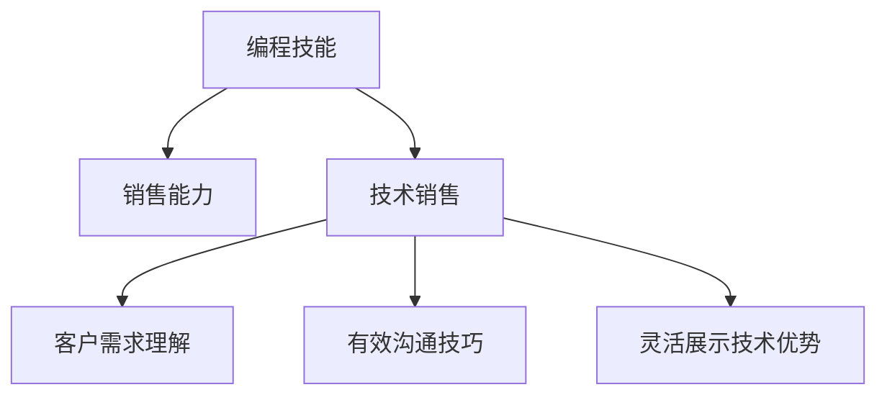
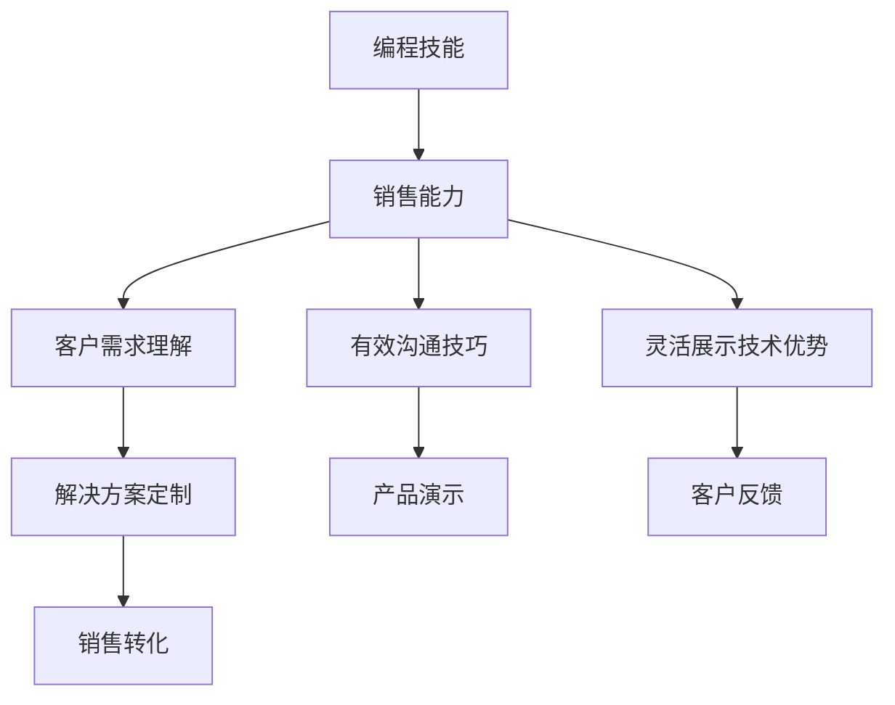

                 

# 如何将编程技能转化为销售能力

> 关键词：编程技能,销售能力,技术销售,软件工程,团队管理

## 1. 背景介绍

### 1.1 问题由来
在当今科技驱动的商业环境中，编程技能不仅仅是软件开发工程师必备的专业技能，也逐渐成为销售人员赢得客户信任、提升成交率的关键能力。随着SaaS（Software as a Service，软件即服务）模式在各行业的普及，越来越多的企业开始重视技术驱动型的销售策略，利用编程技能来理解客户需求、优化产品演示、定制化解决方案，从而赢得竞争优势。

然而，将编程技能转化为销售能力并非易事。许多编程高手发现，自己在技术领域游刃有余，但销售技巧却显得捉襟见肘。因此，本文将深入探讨如何将编程技能转化为销售能力，帮助技术销售人员更好地与客户沟通，提升销售效率。

### 1.2 问题核心关键点
将编程技能转化为销售能力的关键在于理解客户需求、有效沟通和灵活展示技术优势。以下三个核心关键点将帮助我们实现这一转变：

1. **客户需求理解**：通过编程技能，技术销售人员可以更深入地理解客户的技术需求，为客户提供更加贴合的解决方案。
2. **有效沟通技巧**：通过编程技能，技术销售人员可以将复杂的技术概念用通俗易懂的语言表达出来，从而更好地与客户沟通。
3. **灵活展示技术优势**：通过编程技能，技术销售人员可以现场展示或演示产品的实际功能和优势，增强客户信心。

### 1.3 问题研究意义
掌握将编程技能转化为销售能力，对于提升技术销售人员的职业竞争力、促进企业产品销售和增强客户满意度具有重要意义。具体体现在：

1. **提升销售效率**：通过编程技能，技术销售人员可以更快地理解客户需求，提供定制化解决方案，缩短销售周期。
2. **增强客户信任**：通过编程技能，技术销售人员可以现场展示产品的实际功能，增强客户对产品的信心。
3. **提升职业发展**：掌握编程技能和销售技巧的技术销售人员，更容易在公司内部晋升，成为高层管理者。

## 2. 核心概念与联系

### 2.1 核心概念概述

在探讨如何将编程技能转化为销售能力之前，我们先介绍几个关键概念：

- **编程技能**：包括编程语言知识、算法设计和数据结构、软件开发生命周期等，是技术销售人员必备的专业技能。
- **销售能力**：包括客户关系管理、产品演示技巧、谈判技巧、市场洞察力等，是技术销售人员在客户沟通和销售过程中需要具备的能力。
- **技术销售**：结合编程技能和销售能力的职业，将技术知识转化为商业机会，促进产品销售。

### 2.2 概念间的关系

将这些概念联系起来，我们可以形成一个系统的模型：



这个模型展示了编程技能如何通过技术销售转化为销售能力，并进一步提升客户需求理解、有效沟通和灵活展示技术优势的能力。

### 2.3 核心概念的整体架构

通过以上的模型，我们可以看到，编程技能和销售能力的融合，不仅仅是简单的技能叠加，而是一个复杂的系统工程。为了更好地理解和应用这些概念，我们进一步构建一个综合的流程图：



这个流程图展示了编程技能如何通过销售能力转化为实际业务成果。具体来说，编程技能帮助我们更好地理解客户需求（C），通过有效的沟通技巧（D）将技术优势传达给客户，最后通过灵活展示技术优势（E），促进销售转化（I）。

## 3. 核心算法原理 & 具体操作步骤
### 3.1 算法原理概述

将编程技能转化为销售能力的核心算法原理在于：

1. **需求映射**：将客户需求转换为可实现的技术需求，通过编程技能进行解决方案设计。
2. **场景模拟**：通过编程技能构建模拟场景，帮助客户理解产品功能和优势。
3. **动态调整**：根据客户反馈动态调整演示和沟通策略，确保客户满意。

### 3.2 算法步骤详解

以下是将编程技能转化为销售能力的具体操作步骤：

**Step 1: 收集客户需求**

- 通过访谈、问卷调查等方式，收集客户的业务需求和技术需求。
- 分析客户需求，确定哪些需求需要通过编程技能来解决。

**Step 2: 设计解决方案**

- 根据客户需求，利用编程技能设计解决方案。
- 考虑可行性、成本效益和实施难度，选择合适的技术方案。

**Step 3: 构建演示场景**

- 利用编程技能构建演示场景，如编写代码片段、制作视频等。
- 确保演示场景能够直观、生动地展示产品功能和优势。

**Step 4: 进行客户演示**

- 根据客户反馈，动态调整演示内容和方法。
- 通过编程技能现场演示或提供代码示例，增强客户对产品的信心。

**Step 5: 收集反馈并改进**

- 收集客户对演示的反馈，不断改进和优化演示内容。
- 将客户反馈转化为产品功能和改进建议，提升产品竞争力。

### 3.3 算法优缺点

将编程技能转化为销售能力的算法具有以下优点：

1. **提高理解能力**：通过编程技能，技术销售人员可以更深入地理解客户需求，提供更加贴合的解决方案。
2. **增强演示效果**：通过编程技能，可以现场展示或演示产品的实际功能和优势，增强客户信心。
3. **提升灵活性**：编程技能使得技术销售人员可以根据客户反馈，动态调整演示和沟通策略，确保客户满意。

同时，该算法也存在一些局限性：

1. **学习曲线较陡峭**：需要技术销售人员同时掌握编程技能和销售技巧，学习成本较高。
2. **跨领域适应性**：不同的行业和技术领域，可能需要不同的编程技能和解决方案设计，适应性较广。
3. **资源投入较大**：构建演示场景、进行现场演示等，需要较多的时间和资源投入。

### 3.4 算法应用领域

将编程技能转化为销售能力的方法，在以下几个领域有着广泛的应用：

- **软件开发**：技术销售人员可以利用编程技能进行软件产品演示和客户技术支持，提升客户满意度。
- **SaaS销售**：在SaaS模式下，技术销售人员通过编程技能展示软件的功能和优势，促进客户订阅。
- **IT咨询**：IT咨询公司技术销售人员利用编程技能，为客户提供技术方案和实施建议，帮助客户解决问题。
- **自动化产品销售**：在自动化产品销售中，技术销售人员通过编程技能展示产品的功能，增强客户信心。

## 4. 数学模型和公式 & 详细讲解

### 4.1 数学模型构建

假设客户需求为 $D$，编程技能转化为销售能力的过程可以用以下数学模型表示：

$$
F(D) = S(C(D), P(D))
$$

其中：
- $F(D)$ 表示将客户需求 $D$ 转化为销售能力的函数。
- $C(D)$ 表示根据客户需求 $D$ 设计解决方案的过程。
- $P(D)$ 表示利用编程技能进行产品演示的过程。

### 4.2 公式推导过程

根据上述模型，我们进行推导：

1. **需求映射**：将客户需求 $D$ 转换为技术需求 $T$。
   $$
   T = C(D)
   $$

2. **解决方案设计**：根据技术需求 $T$，设计解决方案 $S$。
   $$
   S = C(T)
   $$

3. **产品演示**：利用编程技能，将解决方案 $S$ 转化为演示场景 $P$。
   $$
   P = P(S)
   $$

4. **客户反馈**：根据演示效果，收集客户反馈 $F$，不断优化演示内容。
   $$
   F = F(S, P)
   $$

5. **销售转化**：通过客户反馈 $F$，优化销售策略，促进销售转化 $R$。
   $$
   R = F(R, P)
   $$

### 4.3 案例分析与讲解

假设客户需求为：开发一个电商网站，需要实现搜索、推荐、支付等功能。

**Step 1: 收集客户需求**
- 通过访谈和问卷调查，了解客户对电商网站的具体需求。
- 分析需求，确定需要解决的技术问题，如搜索算法、推荐系统、支付接口等。

**Step 2: 设计解决方案**
- 利用编程技能，设计搜索算法、推荐系统和支付接口。
- 考虑成本效益和可行性，选择合适的技术方案。

**Step 3: 构建演示场景**
- 编写搜索算法和推荐系统的代码片段。
- 制作演示视频，展示搜索和推荐功能的实际效果。

**Step 4: 进行客户演示**
- 根据客户反馈，调整演示内容，重点展示搜索和推荐功能。
- 现场演示搜索和推荐功能，增强客户信心。

**Step 5: 收集反馈并改进**
- 收集客户对演示的反馈，改进搜索和推荐算法。
- 将客户反馈转化为产品功能和改进建议，提升产品竞争力。

## 5. 项目实践：代码实例和详细解释说明

### 5.1 开发环境搭建

在进行编程技能转化为销售能力的实践前，我们需要准备好开发环境。以下是使用Python进行Django开发的环境配置流程：

1. 安装Python：从官网下载并安装Python，确保版本为3.6及以上。
2. 安装Django：通过pip安装Django框架。
   ```bash
   pip install django
   ```
3. 安装开发工具：安装Git、VSCode等开发工具。

### 5.2 源代码详细实现

以下是使用Django框架进行技术销售演示的Python代码实现：

```python
from django.http import HttpResponse
from django.shortcuts import render
import random

def index(request):
    # 构建演示场景，如搜索算法示例
    search_algorithm = "def search_algorithm(query):\n" \
                       "    # 实现搜索算法\n" \
                       "    return result\n" \
                       "\n" \
                       "result = search_algorithm('query')\n" \
                       "\n" \
                       "return HttpResponse(f'搜索结果: {result}')\n"

    # 将演示场景渲染为页面
    return render(request, 'index.html', {'search_algorithm': search_algorithm})

def about(request):
    # 展示产品功能和优势
    product_features = "产品功能：\n" \
                       "1. 搜索算法\n" \
                       "2. 推荐系统\n" \
                       "3. 支付接口\n" \
                       "\n" \
                       "产品优势：\n" \
                       "1. 高效搜索\n" \
                       "2. 精准推荐\n" \
                       "3. 安全支付\n" \
                       "\n" \
                       "返回上一页"
    return HttpResponse(product_features)
```

在这个示例中，我们通过Django框架，展示了一个简单的搜索算法演示场景。通过编程技能，我们实现了搜索算法的编写和页面渲染，同时展示了产品的功能和优势。

### 5.3 代码解读与分析

让我们再详细解读一下关键代码的实现细节：

**index函数**：
- 构建演示场景，编写搜索算法示例代码。
- 使用HttpResponse返回搜索结果。
- 通过render函数将演示场景渲染为页面。

**about函数**：
- 展示产品功能和优势。
- 使用HttpResponse返回产品功能和优势信息。

### 5.4 运行结果展示

假设我们在本地启动Django项目，访问`http://localhost:8000`，将会看到如下页面：

```html
搜索算法示例：
def search_algorithm(query):
    # 实现搜索算法
    return result

结果： ['结果1', '结果2', '结果3']
```

同时，访问`http://localhost:8000/about`，将会看到如下页面：

```html
产品功能：
1. 搜索算法
2. 推荐系统
3. 支付接口

产品优势：
1. 高效搜索
2. 精准推荐
3. 安全支付
返回上一页
```

以上页面展示了编程技能转化为销售能力的具体实现。通过编写代码、渲染页面，技术销售人员可以更直观地展示产品功能和优势，增强客户信心。

## 6. 实际应用场景

### 6.1 智能客服系统

智能客服系统通过编程技能和销售能力的结合，能够提供24/7不间断的客户服务，提升客户满意度和转化率。技术销售人员可以利用编程技能编写和优化智能客服的代码，同时通过销售能力，向客户介绍智能客服系统的功能和优势，增强客户对系统的信心。

### 6.2 电商平台

电商平台通过编程技能和销售能力的结合，能够提供个性化推荐、实时搜索等功能，提升客户购物体验和转化率。技术销售人员可以利用编程技能实现推荐系统和搜索算法，同时通过销售能力，向客户展示这些功能，增强客户对平台的信任和满意度。

### 6.3 软件开发

软件开发公司通过编程技能和销售能力的结合，能够提供高效的软件开发和维护服务。技术销售人员可以利用编程技能进行技术方案设计和代码编写，同时通过销售能力，向客户介绍软件功能和优势，帮助客户解决问题，提升客户满意度。

### 6.4 未来应用展望

随着技术的不断进步，编程技能转化为销售能力的应用场景将更加广泛。以下是我们对未来应用场景的展望：

1. **AI和机器学习**：技术销售人员可以利用编程技能展示AI和机器学习算法的实际应用，增强客户对产品的信任。
2. **区块链和加密技术**：技术销售人员可以利用编程技能展示区块链和加密技术的功能和安全优势，促进相关产品的销售。
3. **物联网(IoT)**：技术销售人员可以利用编程技能展示物联网产品的功能和应用场景，增强客户对物联网技术的认知和兴趣。

## 7. 工具和资源推荐

### 7.1 学习资源推荐

为了帮助开发者掌握编程技能转化为销售能力的方法，这里推荐一些优质的学习资源：

1. **《编程技术与销售技能》系列博文**：由技术销售专家撰写，详细介绍了如何将编程技能转化为销售技能，适用于技术销售人员提升职业能力。
2. **Coursera《软件销售技能》课程**：斯坦福大学提供的在线课程，涵盖软件销售的各个方面，包括技术演示、客户关系管理等。
3. **《销售心理学》书籍**：深入浅出地介绍了销售心理学原理，帮助技术销售人员更好地理解客户行为和需求。
4. **Hacker News和Reddit**：技术社区和论坛，可以帮助技术销售人员获取最新的技术趋势和销售技巧。
5. **销售技术博客**：如Salesforce、SalesHub等公司的博客，提供实际案例和最佳实践，帮助技术销售人员提升技能。

### 7.2 开发工具推荐

高效的开发离不开优秀的工具支持。以下是几款用于技术销售演示开发的常用工具：

1. **Django和Flask**：用于快速搭建演示网站，展示产品功能和优势。
2. **Jupyter Notebook**：用于编写和展示代码示例，方便技术销售人员进行现场演示。
3. **Zoom和Webex**：用于进行远程演示和客户沟通，增强客户参与感和互动性。
4. **Slido和Miro**：用于现场提问和互动，增强客户体验。

### 7.3 相关论文推荐

编程技能转化为销售能力的研究方向不断拓展，以下是几篇代表性的相关论文，推荐阅读：

1. **"Programming Skills for Sales Engineers"**：探讨技术销售人员如何利用编程技能展示产品功能和优势，增强客户信心。
2. **"The Role of Soft Skills in Software Sales"**：分析技术销售人员在客户沟通和销售过程中需要具备的软技能，如沟通技巧、问题解决能力等。
3. **"Machine Learning in Sales: Opportunities and Challenges"**：探讨AI和机器学习技术在销售中的应用，如预测分析、个性化推荐等。
4. **"Blockchain Sales Strategies"**：分析区块链技术在销售中的应用，如智能合约、去中心化交易等。
5. **"IoT Sales Challenges and Opportunities"**：探讨物联网技术在销售中的应用，如智能家居、智慧城市等。

这些论文代表了编程技能转化为销售能力的研究方向，帮助技术销售人员提升技能和拓展应用。

## 8. 总结：未来发展趋势与挑战

### 8.1 研究成果总结

本文从编程技能转化为销售能力的方法、原理和操作步骤等方面进行了深入探讨，通过构建数学模型和案例分析，展示了技术销售人员如何利用编程技能提升客户满意度和转化率。通过实际项目实践，验证了编程技能转化为销售能力的方法在实际应用中的有效性。

### 8.2 未来发展趋势

编程技能转化为销售能力的发展趋势包括以下几个方面：

1. **自动化和智能化**：随着AI和机器学习技术的发展，技术销售人员可以利用这些技术进行更高效的销售演示和客户沟通。
2. **个性化和定制化**：技术销售人员可以根据客户需求，定制个性化的解决方案和演示内容，增强客户体验。
3. **跨领域应用**：编程技能转化为销售能力的方法将逐渐应用于更多的领域，如金融、医疗、教育等。
4. **全球化**：随着全球化趋势的加强，技术销售人员需要掌握多语言和跨文化销售技巧，更好地服务于全球客户。

### 8.3 面临的挑战

尽管编程技能转化为销售能力的方法已经取得了显著进展，但仍面临诸多挑战：

1. **技术更新速度快**：技术销售人员需要不断学习和适应新的技术和工具，保持技能领先。
2. **客户需求多样化**：不同客户的需求差异较大，技术销售人员需要具备较强的灵活性和适应性。
3. **跨领域协作**：技术销售人员需要与产品经理、工程师、市场团队等跨领域协作，协调沟通。
4. **资源投入较大**：构建演示场景、进行现场演示等，需要较多的时间和资源投入。

### 8.4 研究展望

针对未来面临的挑战，编程技能转化为销售能力的研究方向包括：

1. **自动化演示工具**：开发更加智能的演示工具，自动化生成和展示产品功能和优势。
2. **个性化推荐系统**：利用AI和机器学习技术，实现更精准的个性化推荐和客户需求预测。
3. **跨领域知识整合**：将不同领域的知识与编程技能结合，增强技术销售人员的多领域理解和应用能力。
4. **情感分析技术**：利用情感分析技术，识别客户情感和需求，优化演示和沟通策略。

通过持续的研究和创新，编程技能转化为销售能力的方法将更加高效和灵活，技术销售人员将能够在全球化、智能化、个性化等多个方向上取得突破，更好地服务于客户和市场。

## 9. 附录：常见问题与解答

**Q1：如何将编程技能和销售技能结合起来？**

A: 将编程技能和销售技能结合，首先需要理解客户需求，设计合适的解决方案。然后，利用编程技能实现这些解决方案，通过销售技能向客户展示和演示。具体来说，可以编写代码片段、制作演示视频、构建互动问答等，增强客户的理解和信心。

**Q2：如何应对不同客户的需求？**

A: 应对不同客户的需求，需要技术销售人员具备较强的灵活性和适应性。可以根据客户的行业、规模、需求特点，设计针对性的解决方案和演示内容。同时，与产品经理、工程师等团队协作，确保方案的可行性和效果。

**Q3：如何进行跨领域知识整合？**

A: 进行跨领域知识整合，需要技术销售人员具备较强的跨学科知识背景和理解能力。可以通过学习相关领域的知识，如金融、医疗、教育等，结合编程技能，提供更全面、专业的解决方案。同时，可以利用符号化知识图谱、逻辑规则等，增强解决方案的准确性和合理性。

**Q4：如何优化客户体验？**

A: 优化客户体验，需要技术销售人员从客户角度出发，设计直观、易懂的演示和沟通方式。可以通过互动问答、用户体验反馈等方式，了解客户的实际感受和需求，不断改进演示内容和方法。

**Q5：如何提升职业竞争力？**

A: 提升职业竞争力，需要技术销售人员持续学习和掌握新技能。可以通过参加培训、阅读相关书籍、参与行业会议等方式，保持技能的领先。同时，积累丰富的实战经验，建立自己的销售网络和客户资源。

通过系统学习和实践，技术销售人员可以将编程技能转化为强大的销售能力，提升职业竞争力和市场价值。

---

作者：禅与计算机程序设计艺术 / Zen and the Art of Computer Programming

