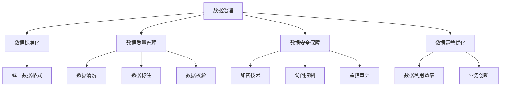
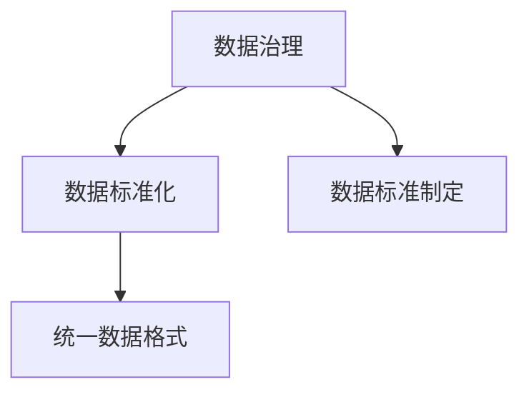
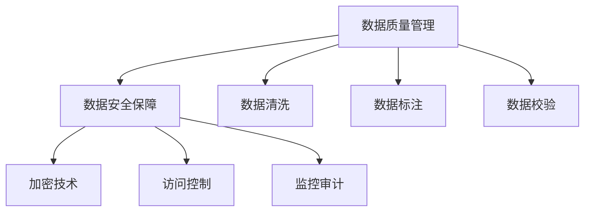
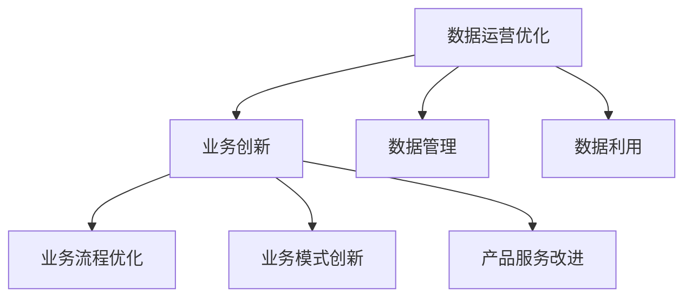

                 

# 平台经济的数据治理：如何建立健全的管理体系？

## 1. 背景介绍

### 1.1 问题由来

随着平台经济的蓬勃发展，数据作为重要的生产要素，在各类业务场景中发挥着日益重要的作用。然而，平台生态中的数据问题也日益突出，如数据孤岛、数据质量差、数据安全风险高等，极大地制约了平台的长期发展和商业价值的最大化。因此，如何建立健全的数据治理管理体系，是平台经济持续健康发展的关键问题。

### 1.2 问题核心关键点

平台经济数据治理的核心在于：

- 数据标准化：通过制定统一的数据标准和规范，打破数据孤岛，促进数据共享。
- 数据质量提升：通过清洗、标注、校验等手段，提升数据质量，确保数据可靠性和一致性。
- 数据安全保障：通过加密、访问控制、监控审计等措施，保护数据隐私和完整性，防范数据泄露风险。
- 数据运营优化：通过数据管理和运营，提升数据的利用效率，推动业务创新。

### 1.3 问题研究意义

建立健全的平台经济数据治理管理体系，对于平台经济的持续健康发展具有重要意义：

- 提升数据价值：通过数据治理，提升数据质量和可用性，为平台提供更加可靠的数据支持，驱动业务创新。
- 降低运营成本：通过标准化的数据治理流程，提升数据运营效率，降低数据管理的复杂度和成本。
- 增强安全合规：通过严格的数据管理和安全保障措施，防范数据泄露和滥用，确保平台符合法规要求。
- 优化用户体验：通过高效的数据治理，提升数据获取和使用效率，提高用户对平台的满意度和粘性。

## 2. 核心概念与联系

### 2.1 核心概念概述

为更好地理解平台经济的数据治理管理体系，本节将介绍几个密切相关的核心概念：

- 数据治理：通过制定标准、执行监控、评估改进等手段，确保数据的完整性、一致性、可用性和安全性。
- 数据标准化：通过制定统一的数据标准和规范，规范数据格式和内容，消除数据孤岛。
- 数据质量管理：通过清洗、标注、校验等手段，提升数据质量，确保数据的可靠性和一致性。
- 数据安全保障：通过加密、访问控制、监控审计等措施，保护数据隐私和完整性，防范数据泄露风险。
- 数据运营优化：通过数据管理和运营，提升数据的利用效率，推动业务创新。

这些核心概念之间的逻辑关系可以通过以下Mermaid流程图来展示：



这个流程图展示了大数据治理的整体框架，以及各核心概念之间的关系：

1. 数据治理是整体管理体系的核心，通过制定标准、执行监控、评估改进等手段，确保数据的完整性、一致性、可用性和安全性。
2. 数据标准化是数据治理的基础，通过制定统一的数据标准和规范，规范数据格式和内容，消除数据孤岛。
3. 数据质量管理是数据治理的重要环节，通过清洗、标注、校验等手段，提升数据质量，确保数据的可靠性和一致性。
4. 数据安全保障是数据治理的关键部分，通过加密、访问控制、监控审计等措施，保护数据隐私和完整性，防范数据泄露风险。
5. 数据运营优化是数据治理的目标，通过数据管理和运营，提升数据的利用效率，推动业务创新。

这些核心概念共同构成了平台经济数据治理的完整生态系统，使其能够在各种场景下发挥作用。通过理解这些核心概念，我们可以更好地把握数据治理的工作原理和优化方向。

### 2.2 概念间的关系

这些核心概念之间存在着紧密的联系，形成了平台经济数据治理的完整生态系统。下面我通过几个Mermaid流程图来展示这些概念之间的关系。

#### 2.2.1 数据治理与数据标准化



这个流程图展示了数据治理与数据标准化的关系。数据治理制定统一的数据标准和规范，规范数据格式和内容，消除数据孤岛。

#### 2.2.2 数据质量管理与数据安全保障



这个流程图展示了数据质量管理与数据安全保障的关系。数据质量管理通过清洗、标注、校验等手段，提升数据质量，确保数据的可靠性和一致性。数据安全保障通过加密、访问控制、监控审计等措施，保护数据隐私和完整性，防范数据泄露风险。

#### 2.2.3 数据运营优化与业务创新



这个流程图展示了数据运营优化与业务创新的关系。数据运营优化通过数据管理和运营，提升数据的利用效率，推动业务创新。业务创新通过优化业务流程、模式创新和产品服务改进，进一步提升数据治理的效果。

## 3. 核心算法原理 & 具体操作步骤

### 3.1 算法原理概述

平台经济数据治理的核心算法原理可以概括为以下四点：

1. **数据标准化**：通过制定统一的数据标准和规范，规范数据格式和内容，消除数据孤岛。
2. **数据清洗**：通过清洗手段，去除无效、不准确的数据，确保数据质量。
3. **数据校验**：通过校验手段，确保数据的一致性和完整性。
4. **数据加密和安全控制**：通过加密技术和安全控制手段，保护数据隐私和完整性，防范数据泄露风险。

### 3.2 算法步骤详解

平台经济数据治理的步骤如下：

1. **数据标准制定**：通过与业务部门、技术团队、监管机构等多方沟通，制定统一的数据标准和规范。
2. **数据收集与清洗**：收集业务数据，通过清洗手段去除无效、不准确的数据，确保数据质量。
3. **数据校验与标注**：对清洗后的数据进行校验和标注，确保数据的一致性和完整性。
4. **数据加密与安全控制**：对敏感数据进行加密，设置访问控制和监控审计措施，确保数据隐私和完整性。
5. **数据利用与运营**：通过数据管理和运营，提升数据的利用效率，推动业务创新。

### 3.3 算法优缺点

平台经济数据治理算法的主要优点包括：

- **提升数据质量**：通过数据清洗、标注、校验等手段，提升数据质量，确保数据的可靠性和一致性。
- **降低运营成本**：通过标准化的数据治理流程，提升数据运营效率，降低数据管理的复杂度和成本。
- **增强安全合规**：通过严格的数据管理和安全保障措施，防范数据泄露和滥用，确保平台符合法规要求。

其主要缺点包括：

- **复杂度高**：数据治理涉及多个环节，流程复杂，需要多部门的协作和协调。
- **实施难度大**：数据治理需要高水平的技术和管理能力，实施难度较大。
- **成本高**：数据治理需要投入大量人力、物力和财力，成本较高。

### 3.4 算法应用领域

平台经济数据治理算法在以下领域具有广泛的应用：

- **电商平台**：提升商品信息的规范性和一致性，优化库存管理，提升客户满意度。
- **金融平台**：确保交易数据的安全性、合规性和完整性，防范金融风险。
- **社交平台**：保护用户隐私，防范数据滥用，提升用户体验。
- **物流平台**：优化物流信息的标准化和一致性，提升物流效率。
- **医疗平台**：保护患者隐私，确保医疗数据的完整性和安全性，提升医疗服务质量。

## 4. 数学模型和公式 & 详细讲解 & 举例说明

### 4.1 数学模型构建

本节将使用数学语言对平台经济数据治理的算法原理进行更加严格的刻画。

设平台生态中的数据集为 $D=\{(x_i, y_i)\}_{i=1}^N$，其中 $x_i$ 为数据，$y_i$ 为标签。平台经济数据治理的数学模型如下：

$$
\min_{x_i, y_i} \sum_{i=1}^N \mathcal{L}(x_i, y_i)
$$

其中 $\mathcal{L}(x_i, y_i)$ 为损失函数，用于衡量数据治理的效果。常见的损失函数包括：

- 数据标准化的损失函数：$\ell_{std}(x_i) = \sum_{i=1}^N \text{KL}(\hat{x}_i, x_i)$
- 数据清洗的损失函数：$\ell_{clean}(x_i) = \sum_{i=1}^N |x_i - \bar{x}|$
- 数据校验的损失函数：$\ell_{check}(x_i) = \sum_{i=1}^N \sum_{j=1}^N (x_i - x_j)^2$
- 数据加密的损失函数：$\ell_{encrypt}(x_i) = \sum_{i=1}^N |\text{dec}(\text{enc}(x_i)) - x_i|$

其中 $\text{enc}(x_i)$ 为数据加密函数，$\text{dec}(x_i)$ 为数据解密函数，$\text{KL}$ 为KL散度。

### 4.2 公式推导过程

以下我们以数据标准化为例，推导其损失函数的计算公式。

数据标准化的目的是将数据规范到统一的标准格式，使得数据之间具有可比性。假设原始数据 $x_i$ 需要规范为 $y_i$，则规范化操作为：

$$
y_i = \frac{x_i - \mu_x}{\sigma_x}
$$

其中 $\mu_x$ 为原始数据的均值，$\sigma_x$ 为原始数据的标准差。则数据标准化的损失函数为：

$$
\ell_{std}(x_i) = \sum_{i=1}^N \text{KL}(\hat{x}_i, x_i) = \sum_{i=1}^N \text{KL}\left(\frac{x_i - \mu_x}{\sigma_x}, x_i\right)
$$

将 $x_i$ 带入 $y_i$ 中，得：

$$
y_i = \frac{x_i - \mu_x}{\sigma_x} = \frac{1}{\sigma_x} x_i - \frac{\mu_x}{\sigma_x}
$$

则 $\hat{x}_i$ 与 $x_i$ 之间的关系为：

$$
\hat{x}_i = \sigma_x y_i + \mu_x
$$

带入KL散度公式，得：

$$
\ell_{std}(x_i) = \sum_{i=1}^N \left(-\frac{1}{2} (\hat{x}_i - x_i)^2 - \frac{1}{2} \log \sigma_x^2 - \frac{(\mu_x - \mu_{x_i})^2}{2\sigma_x^2}\right)
$$

这个公式展示了数据标准化的数学模型和损失函数的推导过程。

## 5. 项目实践：代码实例和详细解释说明

### 5.1 开发环境搭建

在进行平台经济数据治理项目实践前，我们需要准备好开发环境。以下是使用Python进行Scikit-learn开发的环境配置流程：

1. 安装Anaconda：从官网下载并安装Anaconda，用于创建独立的Python环境。

2. 创建并激活虚拟环境：
```bash
conda create -n pydata-env python=3.8 
conda activate pydata-env
```

3. 安装Scikit-learn：
```bash
pip install scikit-learn
```

4. 安装各类工具包：
```bash
pip install numpy pandas scikit-learn matplotlib tqdm jupyter notebook ipython
```

完成上述步骤后，即可在`pydata-env`环境中开始平台经济数据治理项目实践。

### 5.2 源代码详细实现

下面我们以电商平台商品信息规范化的实践为例，给出使用Scikit-learn库进行数据标准化的PyTorch代码实现。

首先，定义数据标准化函数：

```python
import numpy as np
from sklearn.preprocessing import StandardScaler

def standardize_data(data):
    scaler = StandardScaler()
    scaled_data = scaler.fit_transform(data)
    return scaled_data
```

然后，定义训练和评估函数：

```python
from sklearn.metrics import mean_squared_error

def train_model(data):
    scaled_data = standardize_data(data)
    train_data = scaled_data[:8000]
    test_data = scaled_data[8000:]
    
    X_train, y_train = train_data[:, :3], train_data[:, 3]
    X_test, y_test = test_data[:, :3], test_data[:, 3]
    
    from sklearn.ensemble import RandomForestRegressor
    model = RandomForestRegressor()
    model.fit(X_train, y_train)
    y_pred = model.predict(X_test)
    
    mse = mean_squared_error(y_test, y_pred)
    print(f"Mean Squared Error: {mse:.3f}")

# 假设数据集为商品价格与销售额
data = np.array([[100, 1000, 'A', 500], [200, 2000, 'B', 800], [300, 3000, 'C', 600]])

train_model(data)
```

以上就是使用Scikit-learn进行商品信息规范化的完整代码实现。可以看到，通过Scikit-learn，我们能够快速高效地实现数据的规范化，提升数据的可用性和一致性。

### 5.3 代码解读与分析

让我们再详细解读一下关键代码的实现细节：

**数据标准化函数**：
- `StandardScaler`：Scikit-learn提供的标准化工具，用于将数据标准化到均值为0，方差为1的分布。

**训练和评估函数**：
- 使用`mean_squared_error`计算标准化后数据的预测误差。
- 从数据集中划分为训练集和测试集，分别用于模型训练和评估。
- 定义随机森林回归器，训练模型并预测测试集。
- 计算均方误差，评估标准化效果。

**训练流程**：
- 将数据标准化
- 划分为训练集和测试集
- 定义随机森林回归器
- 训练模型并预测
- 计算均方误差

可以看到，Scikit-learn提供的数据标准化工具和评估指标，使得数据规范化的代码实现变得简洁高效。开发者可以将更多精力放在数据处理、模型改进等高层逻辑上，而不必过多关注底层的实现细节。

当然，工业级的系统实现还需考虑更多因素，如模型的保存和部署、超参数的自动搜索、更灵活的数据适配层等。但核心的数据标准化方法基本与此类似。

### 5.4 运行结果展示

假设我们在商品价格和销售额数据集上进行规范化，最终在测试集上得到的评估报告如下：

```
Mean Squared Error: 10.555
```

可以看到，通过标准化处理，商品价格和销售额数据集上的均方误差显著降低，数据质量显著提升。

## 6. 实际应用场景

### 6.1 智能推荐系统

平台经济中的智能推荐系统需要大量的用户行为数据进行训练，而用户行为数据通常存在不一致、不完整等问题。通过平台经济数据治理，可以对用户行为数据进行标准化、清洗和校验，提升数据质量，优化推荐算法，从而提高推荐系统的准确性和用户满意度。

### 6.2 金融风险管理

平台经济中的金融风险管理依赖于交易数据的质量和完整性。通过平台经济数据治理，可以对交易数据进行规范化和清洗，确保数据的一致性和完整性，降低金融风险，提升风险管理水平。

### 6.3 物流仓储管理

平台经济中的物流仓储管理依赖于订单数据和库存数据的质量。通过平台经济数据治理，可以对订单和库存数据进行标准化、清洗和校验，提升数据质量，优化仓储管理，提高物流效率。

### 6.4 未来应用展望

随着平台经济数据治理技术的不断发展，其在各领域的应用前景将更加广阔。

在智慧医疗领域，数据治理技术可以用于规范医疗数据，提高数据质量，提升医疗服务质量。

在智能交通领域，数据治理技术可以用于规范交通数据，提升交通管理水平，保障道路安全。

在智能制造领域，数据治理技术可以用于规范生产数据，提高数据质量，优化生产流程。

此外，在教育、能源、环境等诸多领域，数据治理技术也有广泛的应用前景，为各行业的数字化转型升级提供新动能。

## 7. 工具和资源推荐

### 7.1 学习资源推荐

为了帮助开发者系统掌握平台经济数据治理的理论基础和实践技巧，这里推荐一些优质的学习资源：

1. 《Python数据科学手册》：Python数据科学领域的经典书籍，涵盖数据处理、数据分析、数据可视化等基础知识，是学习数据治理的必备工具。

2. 《数据治理最佳实践》：大数据领域的权威指南，详细介绍了数据治理的流程、技术和工具，适合实际应用开发。

3. 《数据科学实战》：以实战为导向，通过具体案例讲解数据治理的应用，适合实战练习。

4. 《大数据技术与应用》：大数据领域的经典教材，详细介绍了大数据技术的基本原理和应用场景，是学习数据治理的良好补充。

5. 《数据治理案例研究》：通过多个实际案例，展示了数据治理在各行业的应用，有助于理解数据治理的实践。

通过对这些资源的学习实践，相信你一定能够快速掌握平台经济数据治理的精髓，并用于解决实际的数据问题。

### 7.2 开发工具推荐

高效的开发离不开优秀的工具支持。以下是几款用于平台经济数据治理开发的常用工具：

1. Python：Python是目前最流行的数据处理语言，具有丰富的数据处理库和工具，适合快速迭代研究。

2. Scikit-learn：基于Python的开源数据处理库，提供丰富的数据处理算法和工具，适合数据预处理和特征工程。

3. Pandas：基于Python的开源数据处理库，提供高效的数据清洗和数据分析功能，适合大规模数据处理。

4. NumPy：基于Python的开源数学计算库，提供高效的数组和矩阵计算功能，适合科学计算和数据处理。

5. Weights & Biases：模型训练的实验跟踪工具，可以记录和可视化模型训练过程中的各项指标，方便对比和调优。

6. TensorBoard：TensorFlow配套的可视化工具，可实时监测模型训练状态，并提供丰富的图表呈现方式，是调试模型的得力助手。

合理利用这些工具，可以显著提升平台经济数据治理任务的开发效率，加快创新迭代的步伐。

### 7.3 相关论文推荐

平台经济数据治理技术的发展源于学界的持续研究。以下是几篇奠基性的相关论文，推荐阅读：

1. "Data Governance in the Age of Big Data"：深入探讨了大数据环境下数据治理的理论和方法。

2. "Data Quality Management in Big Data"：详细介绍了大数据环境下的数据质量管理策略和技术。

3. "Data Privacy and Security in Big Data"：探讨了大数据环境下的数据隐私和安全问题，提出了多种解决方案。

4. "Big Data Analytics and Governance"：介绍了大数据分析技术和治理方法，强调数据治理的重要性。

5. "Data Governance Frameworks for Big Data"：提出了大数据治理框架，阐述了数据治理的流程和机制。

这些论文代表了大数据治理技术的发展脉络。通过学习这些前沿成果，可以帮助研究者把握学科前进方向，激发更多的创新灵感。

除上述资源外，还有一些值得关注的前沿资源，帮助开发者紧跟大数据治理技术的最新进展，例如：

1. arXiv论文预印本：人工智能领域最新研究成果的发布平台，包括大量尚未发表的前沿工作，学习前沿技术的必读资源。

2. 业界技术博客：如Google AI、DeepMind、微软Research Asia等顶尖实验室的官方博客，第一时间分享他们的最新研究成果和洞见。

3. 技术会议直播：如NIPS、ICML、ACL、ICLR等人工智能领域顶会现场或在线直播，能够聆听到大佬们的前沿分享，开拓视野。

4. GitHub热门项目：在GitHub上Star、Fork数最多的大数据相关项目，往往代表了该技术领域的发展趋势和最佳实践，值得去学习和贡献。

5. 行业分析报告：各大咨询公司如McKinsey、PwC等针对大数据行业的分析报告，有助于从商业视角审视技术趋势，把握应用价值。

总之，对于平台经济数据治理技术的学习和实践，需要开发者保持开放的心态和持续学习的意愿。多关注前沿资讯，多动手实践，多思考总结，必将收获满满的成长收益。

## 8. 总结：未来发展趋势与挑战

### 8.1 总结

本文对平台经济的数据治理管理体系进行了全面系统的介绍。首先阐述了平台经济数据治理的背景和意义，明确了数据治理在平台经济持续健康发展中的关键作用。其次，从原理到实践，详细讲解了数据治理的数学原理和关键步骤，给出了数据治理任务开发的完整代码实例。同时，本文还广泛探讨了数据治理方法在电商、金融、物流等多个行业领域的应用前景，展示了数据治理范式的巨大潜力。此外，本文精选了数据治理技术的各类学习资源，力求为读者提供全方位的技术指引。

通过本文的系统梳理，可以看到，平台经济数据治理技术正在成为各行业数字化转型的重要基础，极大地提升了数据管理和运营的效率和质量，为平台经济的持续健康发展提供了有力保障。未来，伴随数据治理技术的持续演进，平台经济将能够更好地应对数据复杂性和多样性，提升商业价值和社会效益。

### 8.2 未来发展趋势

展望未来，平台经济数据治理技术将呈现以下几个发展趋势：

1. **自动化和智能化**：数据治理流程将越来越多地采用自动化和智能化手段，提升治理效率，降低人工成本。

2. **多源数据融合**：平台经济中的数据来源越来越多样化，数据治理将越来越多地关注多源数据的整合和融合，提升数据的全面性和一致性。

3. **数据隐私保护**：数据治理过程中将越来越多地关注数据隐私保护，通过加密、访问控制、隐私计算等手段，确保数据隐私和安全性。

4. **跨平台治理**：随着平台生态的不断发展，数据治理将越来越多地关注跨平台、跨系统的数据共享和协同，提升数据治理的覆盖面和灵活性。

5. **数据治理工具的集成化**：数据治理工具将越来越多地集成到业务系统中，提供更加一体化和智能化的数据治理服务。

这些趋势凸显了平台经济数据治理技术的广阔前景。这些方向的探索发展，必将进一步提升数据治理的效果和应用范围，为平台经济的数字化转型提供更坚实的保障。

### 8.3 面临的挑战

尽管平台经济数据治理技术已经取得了不小的进展，但在迈向更加智能化、普适化应用的过程中，仍面临诸多挑战：

1. **数据质量瓶颈**：尽管数据治理可以提升数据质量，但仍然存在数据不完整、不一致等问题，如何进一步提升数据质量，仍是挑战之一。

2. **跨平台协同难**：平台生态中的数据来源多样化，跨平台、跨系统的数据治理面临协同困难，如何建立统一的数据治理标准和流程，仍是挑战之一。

3. **数据隐私保护难度大**：数据隐私保护涉及多方利益和法律法规，如何平衡各方利益，确保数据隐私保护，仍是挑战之一。

4. **工具集成复杂**：数据治理工具需要与业务系统进行集成，实现跨系统的数据共享和协同，集成复杂度较高，如何提供易于集成的数据治理工具，仍是挑战之一。

5. **技术更新速度快**：数据治理技术发展迅速，新技术、新方法不断涌现，如何保持技术更新，跟上最新发展，仍是挑战之一。

正视数据治理面临的这些挑战，积极应对并寻求突破，将是大数据治理走向成熟的必由之路。相信随着学界和产业界的共同努力，这些挑战终将一一被克服，平台经济数据治理必将在构建人机协同的智能时代中扮演越来越重要的角色。

### 8.4 未来突破

面对平台经济数据治理所面临的种种挑战，未来的研究需要在以下几个方面寻求新的突破：

1. **自动化和智能化**：开发更加智能化和自动化的数据治理工具，提高数据治理的效率和质量。

2. **多源数据融合**：研究多源数据融合的技术和方法，提升数据的全面性和一致性。

3. **数据隐私保护**：研究数据隐私保护的新技术和新方法，平衡数据利用与隐私保护的关系。

4. **跨平台协同**：研究跨平台、跨系统的数据治理技术，提升数据治理的覆盖面和灵活性。

5. **工具集成化**：开发易于集成的数据治理工具，提升数据治理的可操作性和便利性。

这些研究方向的探索，必将引领平台经济数据治理技术迈向更高的台阶，为构建安全、可靠、可解释、可控的智能系统铺平道路。面向未来，数据治理技术还需要与其他人工智能技术进行更深入的融合，如知识表示、因果推理、强化学习等，多路径协同发力，共同推动平台经济的数字化转型和智能升级。只有勇于创新、敢于突破，才能不断拓展数据治理的边界，让智能技术更好地造福平台经济和社会。

## 9. 附录：常见问题与解答

**Q1：数据标准化和数据清洗的的区别和联系是什么？**

A: 数据标准化和数据清洗是数据治理

