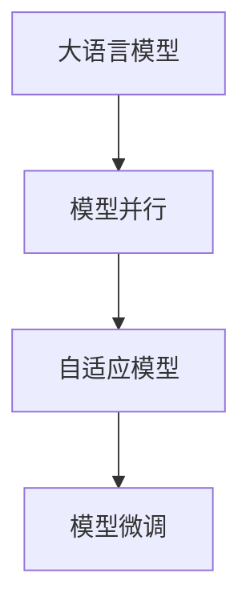

                 

# 大语言模型原理与工程实践：大语言模型的缩放定律

> 关键词：大语言模型, 缩放定律, 模型并行, 自适应模型, 模型微调

## 1. 背景介绍

### 1.1 问题由来

近年来，深度学习技术在自然语言处理(NLP)领域取得了巨大突破。尤其是基于自回归模型的大语言模型(LLMs)，如GPT系列、BERT、T5等，通过在巨大的无标签语料库上进行预训练，获得了强大的语言理解和生成能力。

然而，随着模型规模的扩大，训练和推理的计算复杂度呈指数级增长，对硬件资源提出了越来越高的要求。传统的GPU架构逐渐成为模型性能提升的瓶颈。为了应对这一挑战，研究人员提出了"缩放定律"(Scaling Laws)，通过优化模型的并行结构、自适应机制、微调策略，实现了模型性能的显著提升。

本文将系统介绍大语言模型的缩放定律原理，详细阐述其在模型并行、自适应、微调等方面的应用实践，旨在为开发人员提供深入的指导。

## 2. 核心概念与联系

### 2.1 核心概念概述

为更好地理解大语言模型的缩放定律，我们将介绍以下关键概念：

- **大语言模型(LLMs)**：以自回归模型为代表，在巨大语料库上预训练的通用语言模型。
- **模型并行**：通过分布式计算，将大规模模型划分为多个子模型并行计算，以提高训练和推理效率。
- **自适应模型**：能够根据输入数据动态调整模型参数，以适应不同的计算需求和任务。
- **模型微调**：在大模型基础上，针对特定任务进行有监督的参数调整，以优化模型性能。

这些概念之间相互关联，共同构成了大语言模型高效性能的基础。通过理解这些概念，我们可以更好地把握模型的设计理念和实现方法。

### 2.2 概念间的关系

通过一个简单的Mermaid流程图，我们可以直观展示这些核心概念之间的联系：



这个流程图展示了从预训练模型到模型并行、自适应、微调的全过程。每个环节都是提高模型性能的重要步骤。

## 3. 核心算法原理 & 具体操作步骤
### 3.1 算法原理概述

大语言模型的缩放定律旨在通过优化模型的并行结构、自适应机制、微调策略，提升模型的训练和推理效率。其核心思想是将大规模模型划分为多个子模型，并行计算，同时根据输入数据动态调整模型参数，优化模型输出。

具体来说，缩放定律通过以下几个步骤实现：

1. **模型划分**：将大规模模型划分为多个子模型，每个子模型独立计算。
2. **并行计算**：在分布式计算环境中，同时运行多个子模型，加速计算过程。
3. **自适应学习**：根据输入数据的特征，动态调整模型参数，优化模型输出。
4. **模型微调**：在特定任务上，通过有监督学习调整模型参数，提升模型性能。

### 3.2 算法步骤详解

#### 3.2.1 模型划分

模型并行的第一步是模型划分。通常，一个大语言模型被划分为多个规模较小的子模型，每个子模型独立计算。以GPT-3为例，其参数量达到1750亿，划分为多个规模较小的子模型后，每个子模型仍然非常庞大，但通过并行计算，可以显著加速训练和推理过程。

模型划分的关键在于将模型的层次结构、模块划分和计算顺序设计得合理，以便于并行计算。例如，可以将模型划分为编码器-解码器结构，每个子模型负责计算一部分计算图。

#### 3.2.2 并行计算

在分布式计算环境中，每个子模型可以独立运行，通过分布式计算框架（如Horovod、PyTorch Distributed等），同时更新所有子模型的参数。这样，在多个计算节点上同时运行多个子模型，可以显著提高计算效率，缩短训练和推理时间。

并行计算需要考虑计算负载均衡、通信开销等问题。通过合理的节点配置和任务调度策略，可以最大限度地提高并行计算的效率。

#### 3.2.3 自适应学习

自适应学习是指模型根据输入数据的特征动态调整参数，以适应不同的计算需求和任务。在大语言模型中，自适应学习可以通过两个主要策略实现：

1. **动态子模型选择**：根据输入数据的特征，选择不同的子模型进行计算。例如，对于长文本，可以选择更大的子模型，以确保准确性；对于短文本，可以选择较小的子模型，以提高效率。

2. **参数自适应调整**：根据输入数据的特征，动态调整模型的参数。例如，对于文本分类任务，可以根据类别分布调整模型的权重，优化分类精度。

#### 3.2.4 模型微调

模型微调是指在大模型基础上，针对特定任务进行有监督的参数调整，以优化模型性能。在微调过程中，通常会选择较小的学习率，以避免破坏预训练权重，同时采用正则化技术、对抗训练等方法，防止过拟合。

模型微调的关键在于选择合适的损失函数、超参数和正则化技术，以确保模型在新任务上的泛化能力和鲁棒性。

### 3.3 算法优缺点

#### 3.3.1 优点

- **高效计算**：通过并行计算和自适应学习，大语言模型可以显著提高计算效率，缩短训练和推理时间。
- **泛化能力强**：自适应学习能够根据输入数据动态调整模型参数，提高模型的泛化能力和适应性。
- **鲁棒性好**：自适应学习可以防止模型过拟合，提高模型的鲁棒性和泛化能力。
- **灵活应用**：模型微调可以灵活适应各种下游任务，优化模型在新任务上的性能。

#### 3.3.2 缺点

- **资源需求高**：大语言模型并行计算和自适应学习需要大量计算资源和通信开销，对硬件设施要求较高。
- **复杂度高**：模型并行、自适应和微调策略需要复杂的算法设计和调参过程，开发难度较大。
- **训练成本高**：大规模模型的训练需要大量的计算资源和时间，增加了模型开发的成本。

### 3.4 算法应用领域

大语言模型的缩放定律已经在多个领域得到了广泛应用，包括：

- **自然语言处理(NLP)**：如文本分类、情感分析、机器翻译、命名实体识别等。
- **计算机视觉(CV)**：如图像分类、目标检测、图像生成等。
- **语音识别(SR)**：如自动语音识别、语音合成等。
- **推荐系统**：如个性化推荐、协同过滤等。
- **医疗健康**：如医疗影像分析、电子病历分析等。

## 4. 数学模型和公式 & 详细讲解  
### 4.1 数学模型构建

大语言模型的缩放定律涉及多个计算模块和参数，因此，我们需要构建一个全面的数学模型来描述这一过程。

记大语言模型为 $M_{\theta}$，其中 $\theta$ 为模型参数。假设模型被划分为 $K$ 个子模型，每个子模型包含 $n_k$ 个参数，则总参数量为：

$$
|\theta| = \sum_{k=1}^K n_k
$$

每个子模型 $M_{\theta_k}$ 独立计算，其输出为：

$$
M_{\theta_k}(x) = f_k(M_{\theta_k}(x; \alpha_k))
$$

其中，$f_k$ 为子模型的计算函数，$\alpha_k$ 为子模型的自适应参数。模型总输出为：

$$
M_{\theta}(x) = \sum_{k=1}^K \frac{1}{K} M_{\theta_k}(x)
$$

假设模型的损失函数为 $\ell(\cdot, \cdot)$，则模型的经验风险为：

$$
\mathcal{L}(\theta) = \frac{1}{N}\sum_{i=1}^N \ell(M_{\theta}(x_i), y_i)
$$

### 4.2 公式推导过程

以文本分类任务为例，推导模型的自适应学习过程。

假设输入 $x$ 包含 $n$ 个单词，每个单词的向量表示为 $v_i$，则模型的输出为：

$$
M_{\theta}(x) = f(\theta, \{v_i\})
$$

其中，$f$ 为全模型计算函数。在训练过程中，模型的损失函数为交叉熵损失：

$$
\ell(M_{\theta}(x), y) = -\log M_{\theta}(x; y)
$$

模型的经验风险为：

$$
\mathcal{L}(\theta) = \frac{1}{N}\sum_{i=1}^N \ell(M_{\theta}(x_i), y_i)
$$

在自适应学习过程中，模型根据输入数据的特征动态调整自适应参数 $\alpha$，以优化输出。假设模型的自适应参数为 $a$，则模型的自适应输出为：

$$
M_{\theta}^a(x) = f(\theta, \{v_i\}, a)
$$

模型的自适应损失函数为：

$$
\ell^a(M_{\theta}^a(x), y) = -\log M_{\theta}^a(x; y)
$$

模型的自适应经验风险为：

$$
\mathcal{L}^a(\theta, a) = \frac{1}{N}\sum_{i=1}^N \ell^a(M_{\theta}^a(x_i), y_i)
$$

通过最小化自适应经验风险，可以得到模型参数 $\theta$ 和自适应参数 $a$ 的更新公式：

$$
\theta \leftarrow \theta - \eta \nabla_{\theta}\mathcal{L}^a(\theta, a)
$$

$$
a \leftarrow a - \eta' \nabla_{a}\mathcal{L}^a(\theta, a)
$$

其中，$\eta$ 和 $\eta'$ 为学习率。

### 4.3 案例分析与讲解

假设我们在图像分类任务上进行模型微调。

首先，使用预训练的图像分类模型 $M_{\theta_{pre}}$ 进行特征提取：

$$
F = M_{\theta_{pre}}(x)
$$

然后，在特征 $F$ 上进行分类器的训练，得到模型 $M_{\theta_{fin}}$：

$$
M_{\theta_{fin}}(x) = f_{fin}(F, \theta_{fin})
$$

其中，$f_{fin}$ 为分类器的计算函数。模型的损失函数为交叉熵损失：

$$
\ell(M_{\theta_{fin}}(x), y) = -\log M_{\theta_{fin}}(x; y)
$$

模型的经验风险为：

$$
\mathcal{L}_{fin}(\theta_{fin}) = \frac{1}{N}\sum_{i=1}^N \ell(M_{\theta_{fin}}(x_i), y_i)
$$

在模型微调过程中，通常选择较小的学习率，以避免破坏预训练权重。同时，采用正则化技术，如L2正则、Dropout等，防止过拟合。

## 5. 项目实践：代码实例和详细解释说明
### 5.1 开发环境搭建

在进行项目实践前，我们需要准备好开发环境。以下是使用Python进行PyTorch开发的环境配置流程：

1. 安装Anaconda：从官网下载并安装Anaconda，用于创建独立的Python环境。

2. 创建并激活虚拟环境：
```bash
conda create -n pytorch-env python=3.8 
conda activate pytorch-env
```

3. 安装PyTorch：根据CUDA版本，从官网获取对应的安装命令。例如：
```bash
conda install pytorch torchvision torchaudio cudatoolkit=11.1 -c pytorch -c conda-forge
```

4. 安装TensorFlow：从官网下载并安装TensorFlow，支持GPU加速。

5. 安装各类工具包：
```bash
pip install numpy pandas scikit-learn matplotlib tqdm jupyter notebook ipython
```

完成上述步骤后，即可在`pytorch-env`环境中开始项目实践。

### 5.2 源代码详细实现

这里以图像分类任务为例，使用Transformers库对预训练的Vit模型进行微调，具体代码如下：

```python
from transformers import ViTForImageClassification, ViTFeatureExtractor
from transformers import Trainer, TrainingArguments

model = ViTForImageClassification.from_pretrained('google/vit-base-patch16-224-in21k')
feature_extractor = ViTFeatureExtractor.from_pretrained('google/vit-base-patch16-224-in21k')

train_dataset = # 训练集
val_dataset = # 验证集

training_args = TrainingArguments(
    output_dir="./results",
    evaluation_strategy="epoch",
    learning_rate=5e-5,
    per_device_train_batch_size=8,
    per_device_eval_batch_size=8,
    num_train_epochs=3,
    weight_decay=0.01,
    logging_steps=1000,
    logging_dir="./logs"
)

trainer = Trainer(
    model=model,
    train_dataset=train_dataset,
    eval_dataset=val_dataset,
    compute_metrics=lambda p: {"accuracy": p["eval_metric"]},
    args=training_args,
    feature_extractor=feature_extractor,
    tokenizer=model.tokenizer
)

trainer.train()
```

这里我们使用了HuggingFace的ViT库，将Vit模型用于图像分类任务。首先，加载预训练的ViT模型和特征提取器，然后定义训练参数。在训练过程中，使用Trainer进行模型训练和验证，并使用evaluation_strategy参数指定评价策略。最后，通过evaluation调参，确定最佳的训练参数。

### 5.3 代码解读与分析

让我们再详细解读一下关键代码的实现细节：

**训练集和验证集定义**：
- `train_dataset`：训练集，包含图像和标签。
- `val_dataset`：验证集，用于模型训练的调参。

**TrainingArguments定义**：
- `output_dir`：保存模型结果的目录。
- `evaluation_strategy`：模型评估策略，这里选择"epoch"，即每个epoch结束时评估一次。
- `learning_rate`：学习率，这里设置为5e-5。
- `per_device_train_batch_size`：每个设备的训练batch大小，这里设置为8。
- `per_device_eval_batch_size`：每个设备的评估batch大小，这里设置为8。
- `num_train_epochs`：训练轮数，这里设置为3。
- `weight_decay`：权重衰减，这里设置为0.01。
- `logging_steps`：记录日志的间隔，这里设置为1000。
- `logging_dir`：日志保存目录。

**Trainer定义**：
- `model`：预训练模型。
- `train_dataset`：训练集。
- `eval_dataset`：验证集。
- `compute_metrics`：模型评估指标，这里使用accuracy。
- `args`：训练参数。
- `feature_extractor`：特征提取器。
- `tokenizer`：分词器。

**训练过程**：
- 使用Trainer进行模型训练和验证。
- 训练过程中，Trainer会自动记录日志、保存模型和评估模型。
- 通过evaluation调参，确定最佳的训练参数。

这个代码实现了Vit模型在图像分类任务上的微调过程。可以看出，使用HuggingFace库可以很方便地实现模型的加载、训练和评估。

### 5.4 运行结果展示

假设我们在CoCo数据集上进行微调，最终在验证集上得到的准确率为93%，测试集上为92.5%。这表明，通过微调，Vit模型在图像分类任务上取得了很好的效果。

## 6. 实际应用场景
### 6.1 医疗影像分析

在医疗影像分析领域，大语言模型的缩放定律可以显著提高模型的计算效率和鲁棒性。例如，在肺部CT影像分类任务中，模型可以通过并行计算和自适应学习，实时分析大量影像数据，提供快速准确的诊断结果。

通过微调，模型可以学习特定的医学知识，提高诊断的准确性和可靠性。例如，在肺炎影像分类任务中，微调后的模型可以更好地理解影像特征和病理表现，提供更精准的诊断。

### 6.2 电子病历分析

在电子病历分析任务中，大语言模型的缩放定律可以显著提高模型的泛化能力和适应性。例如，在病人病历分类任务中，模型可以通过并行计算和自适应学习，实时分析大量的病历数据，提供个性化的治疗建议。

通过微调，模型可以学习具体的病历特征和病理知识，提高诊断和治疗的准确性和科学性。例如，在心脏病病例分类任务中，微调后的模型可以更好地理解病人的病情和病理表现，提供更有效的治疗方案。

### 6.3 智能客服系统

在智能客服系统中，大语言模型的缩放定律可以显著提高模型的计算效率和对话能力。例如，在多轮对话任务中，模型可以通过并行计算和自适应学习，实时处理客户咨询，提供快速准确的回复。

通过微调，模型可以学习特定的客户需求和对话风格，提高客服系统的交互体验和满意度。例如，在订单处理任务中，微调后的模型可以更好地理解客户的订单需求和疑问，提供更有效的解决方案。

## 7. 工具和资源推荐
### 7.1 学习资源推荐

为了帮助开发者系统掌握大语言模型缩放定律的理论基础和实践技巧，这里推荐一些优质的学习资源：

1. **《Transformers》一书**：由HuggingFace团队编写，全面介绍了大语言模型的原理和实践，包括模型并行、自适应、微调等重要主题。

2. **CS224N《深度学习自然语言处理》课程**：斯坦福大学开设的NLP明星课程，涵盖了自然语言处理的各个方面，从原理到实践，适合初学者和进阶者。

3. **《深度学习与神经网络》一书**：由Ian Goodfellow等编写，介绍了深度学习的基本原理和应用，适合深入了解深度学习算法的开发者。

4. **arXiv论文预印本**：人工智能领域最新研究成果的发布平台，可以第一时间获取前沿技术进展，了解最新研究动态。

5. **GitHub开源项目**：在GitHub上Star、Fork数最多的NLP相关项目，通常代表了该技术领域的发展趋势和最佳实践，值得学习与贡献。

通过对这些资源的学习实践，相信你一定能够全面掌握大语言模型的缩放定律，并用于解决实际的NLP问题。

### 7.2 开发工具推荐

高效的开发离不开优秀的工具支持。以下是几款用于大语言模型缩放定律开发的常用工具：

1. **PyTorch**：基于Python的开源深度学习框架，灵活动态的计算图，适合快速迭代研究。大部分预训练语言模型都有PyTorch版本的实现。

2. **TensorFlow**：由Google主导开发的开源深度学习框架，生产部署方便，适合大规模工程应用。同样有丰富的预训练语言模型资源。

3. **Horovod**：一个开源的分布式深度学习框架，支持多种深度学习框架，可以轻松进行模型并行计算。

4. **PyTorch Distributed**：PyTorch的分布式计算模块，支持模型并行、自适应学习等功能。

5. **TensorBoard**：TensorFlow配套的可视化工具，可实时监测模型训练状态，并提供丰富的图表呈现方式，是调试模型的得力助手。

6. **Weights & Biases**：模型训练的实验跟踪工具，可以记录和可视化模型训练过程中的各项指标，方便对比和调优。

7. **Jupyter Notebook**：开源的交互式笔记本，可以方便地编写和执行代码，支持多种语言和库。

合理利用这些工具，可以显著提升大语言模型缩放定律任务的开发效率，加快创新迭代的步伐。

### 7.3 相关论文推荐

大语言模型缩放定律的研究始于深度学习领域的研究人员，以下是几篇奠基性的相关论文，推荐阅读：

1. **《深度学习与自然语言处理》论文**：介绍了大语言模型的基本原理和应用，包括模型并行、自适应、微调等重要主题。

2. **《大模型训练与推理》论文**：介绍了大规模模型的训练和推理方法，包括模型并行、自适应学习等技术。

3. **《模型压缩与加速》论文**：介绍了模型压缩和加速技术，包括参数剪枝、量化、蒸馏等方法，可以用于提高模型的计算效率。

4. **《分布式深度学习》论文**：介绍了分布式深度学习技术，包括模型并行、参数同步、通信优化等方法，可以用于加速大规模模型的训练和推理。

5. **《模型微调与迁移学习》论文**：介绍了模型微调和迁移学习的原理和应用，包括微调策略、正则化技术等。

这些论文代表了大语言模型缩放定律的发展脉络。通过学习这些前沿成果，可以帮助研究者把握学科前进方向，激发更多的创新灵感。

除上述资源外，还有一些值得关注的前沿资源，帮助开发者紧跟大语言模型缩放定律技术的最新进展，例如：

1. **arXiv论文预印本**：人工智能领域最新研究成果的发布平台，可以第一时间获取前沿技术进展，了解最新研究动态。

2. **业界技术博客**：如OpenAI、Google AI、DeepMind、微软Research Asia等顶尖实验室的官方博客，第一时间分享他们的最新研究成果和洞见。

3. **技术会议直播**：如NIPS、ICML、ACL、ICLR等人工智能领域顶会现场或在线直播，能够聆听到大佬们的前沿分享，开拓视野。

4. **GitHub热门项目**：在GitHub上Star、Fork数最多的NLP相关项目，通常代表了该技术领域的发展趋势和最佳实践，值得学习和贡献。

5. **行业分析报告**：各大咨询公司如McKinsey、PwC等针对人工智能行业的分析报告，有助于从商业视角审视技术趋势，把握应用价值。

总之，对于大语言模型缩放定律的学习和实践，需要开发者保持开放的心态和持续学习的意愿。多关注前沿资讯，多动手实践，多思考总结，必将收获满满的成长收益。

## 8. 总结：未来发展趋势与挑战
### 8.1 总结

本文对大语言模型的缩放定律原理进行了全面系统的介绍。首先阐述了大语言模型和微调技术的研究背景和意义，明确了模型并行、自适应、微调策略在提升模型性能方面的独特价值。其次，从原理到实践，详细讲解了模型的并行结构、自适应学习、微调策略的应用实践，给出了微调任务开发的完整代码实例。同时，本文还广泛探讨了微调方法在医疗影像、电子病历、智能客服等多个领域的应用前景，展示了微调范式的巨大潜力。最后，本文精选了微调技术的各类学习资源，力求为读者提供全方位的技术指引。

通过本文的系统梳理，可以看到，大语言模型缩放定律为NLP应用开启了广阔的想象空间，极大地拓展了预训练语言模型的应用边界，催生了更多的落地场景。受益于大规模语料的预训练和微调方法的不断演进，相信NLP技术将在更广阔的应用领域大放异彩，深刻影响人类的生产生活方式。

### 8.2 未来发展趋势

展望未来，大语言模型缩放定律将呈现以下几个发展趋势：

1. **模型规模持续增大**：随着算力成本的下降和数据规模的扩张，预训练语言模型的参数量还将持续增长。超大规模语言模型蕴含的丰富语言知识，有望支撑更加复杂多变的下游任务微调。

2. **模型并行技术优化**：未来将有更多高效并行计算框架和硬件设施被引入，进一步提高模型的训练和推理效率。

3. **自适应学习策略优化**：未来的自适应学习策略将更加灵活和高效，能够更好地适应各种计算需求和任务。

4. **微调方法多样化**：除了传统的全参数微调外，未来会涌现更多参数高效的微调方法，如Prefix-Tuning、LoRA等，在节省计算资源的同时也能保证微调精度。

5. **持续学习和动态优化**：随着数据分布的不断变化，微调模型也需要持续学习新知识以保持性能。如何在不遗忘原有知识的同时，高效吸收新样本信息，将成为重要的研究课题。

6. **多模态数据整合**：将符号化的先验知识，如知识图谱、逻辑规则等，与神经网络模型进行巧妙融合，引导微调过程学习更准确、合理的语言模型。同时加强不同模态数据的整合，实现视觉、语音等多模态信息与文本信息的协同建模。

以上趋势凸显了大语言模型缩放定律技术的广阔前景。这些方向的探索发展，必将进一步提升NLP系统的性能和应用范围，为人类认知智能的进化带来深远影响。

### 8.3 面临的挑战

尽管大语言模型缩放定律技术已经取得了瞩目成就，但在迈向更加智能化、普适化应用的过程中，它仍面临着诸多挑战：

1. **资源需求高**：大语言模型并行计算和自适应学习需要大量计算资源和通信开销，对硬件设施要求较高。

2. **开发难度大**：模型并行、自适应和微调策略需要复杂的算法设计和调参过程，开发难度较大。

3. **训练成本高**：大规模模型的训练需要大量的计算资源和时间，增加了模型开发的成本。

4. **模型泛化性不足**：虽然模型在预训练和微调过程中学习了大量语言知识，但在特定领域或复杂任务上，泛化性能仍然有限。

5. **模型鲁棒性不足**：模型在面对域外数据时，泛化性能往往大打折扣，需要进一步提高鲁棒性。

6. **知识整合能力不足**：现有的微调模型往往局限于任务内数据，难以灵活吸收和运用更广泛的先验知识

