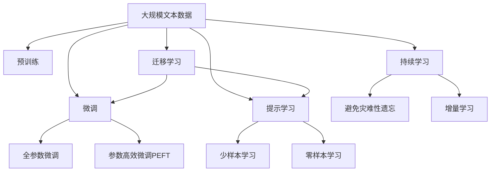

                 

# 大语言模型原理与工程实践：揭开有监督微调的面纱

## 1. 背景介绍

### 1.1 问题由来
近年来，深度学习技术迅猛发展，大语言模型（Large Language Models, LLMs）在自然语言处理（NLP）领域取得了显著进步。这些模型通过在大规模无标签文本数据上进行预训练，获取了丰富的语言知识和常识，能够在较少标注数据的情况下，通过有监督微调（Fine-Tuning）优化模型，显著提升下游任务（如文本分类、命名实体识别、机器翻译等）的性能。OpenAI的GPT系列模型、Google的BERT、T5等模型就是其中的代表。

然而，由于预训练数据的多样性和泛化能力的不足，通用大语言模型在特定领域应用时，效果往往无法达到预期。因此，如何针对特定任务进行微调，优化模型性能，成为了NLP研究的重要方向。本文将聚焦于基于有监督学习的微调方法，并探讨其原理和应用实践，以期为NLP开发者提供全面、深入的指导。

### 1.2 问题核心关键点
有监督微调，即在大规模预训练语言模型基础上，使用下游任务的标注数据进行训练，优化模型，使其能够适应特定任务。这种方法具有以下特点：

- **高效性**：相比于从头训练，微调使用少量标注数据即可提升模型性能。
- **通用性**：适用于各种NLP任务，只需设计简单的任务适配层即可实现。
- **参数高效**：部分参数固定，减少计算资源消耗。
- **性能提升**：能够显著提升模型在特定任务上的表现。

### 1.3 问题研究意义
研究有监督微调方法，对于拓展大语言模型的应用范围，提升下游任务性能，加速NLP技术产业化进程，具有重要意义：

- **降低开发成本**：基于预训练模型微调，减少数据、计算和人力等成本投入。
- **提升模型效果**：微调使得通用大模型更好地适应特定任务，提高应用场景中表现。
- **加速开发周期**：利用预训练模型的基础，快速实现任务适配，缩短开发周期。
- **技术创新**：促进对预训练-微调深入研究，催生提示学习、少样本学习等前沿研究方向。
- **产业升级**：提升NLP技术在各行各业应用，促进传统行业数字化转型。

## 2. 核心概念与联系

### 2.1 核心概念概述

为更好地理解有监督微调，我们先介绍几个关键概念：

- **大语言模型（Large Language Models, LLMs）**：以自回归（如GPT）或自编码（如BERT）模型为代表的预训练语言模型，通过在大规模无标签文本数据上学习，获得语言通用表示。
- **预训练（Pre-training）**：在大规模无标签文本数据上，通过自监督学习任务训练通用语言模型，学习语言知识。
- **微调（Fine-tuning）**：使用下游任务的少量标注数据，对预训练模型进行优化，提升模型在该任务上的性能。
- **迁移学习（Transfer Learning）**：将一个领域学到的知识迁移到另一个领域，促进模型学习。
- **参数高效微调（Parameter-Efficient Fine-Tuning, PEFT）**：在微调过程中，只更新少量模型参数，提高微调效率。
- **提示学习（Prompt Learning）**：通过精心设计输入文本格式，引导模型按期望方式输出，减少微调参数。
- **少样本学习（Few-shot Learning）**：在少量标注样本情况下，模型能够快速适应新任务。
- **零样本学习（Zero-shot Learning）**：模型未见过特定任务训练样本，仅凭任务描述输出。

这些概念通过以下Mermaid流程图（注：以下流程图用于辅助理解，非核心内容，将省略具体实现细节）展示它们之间的关系：



此流程图展示了预训练、微调、提示学习、迁移学习等概念之间的关系，以及它们在大语言模型微调中的角色。

### 2.2 概念间的关系

通过上述流程图，我们可以进一步理解这些概念之间的逻辑关系：

1. **预训练与微调的关系**：预训练是微调的基础，微调是在预训练基础上对特定任务的优化。
2. **迁移学习与微调的关系**：迁移学习通过微调，将预训练模型知识迁移到下游任务中。
3. **参数高效微调**：仅调整顶层参数，保留大部分预训练权重不变，提高微调效率。
4. **提示学习与微调的关系**：提示学习是一种无需微调参数的微调方法，适用于零样本和少样本学习。
5. **持续学习**：使模型能够不断学习新知识，避免过拟合和遗忘旧知识。

这些概念共同构成了大语言模型微调的完整生态系统，使得模型能够在各种场景下发挥强大的语言理解和生成能力。

## 3. 核心算法原理 & 具体操作步骤
### 3.1 算法原理概述

有监督微调的基本思想是在预训练模型基础上，通过有监督学习优化模型，使其能够适应特定任务。其数学表达如下：

设预训练模型为 $M_{\theta}$，其中 $\theta$ 为预训练得到的模型参数。给定下游任务 $T$ 的标注数据集 $D=\{(x_i, y_i)\}_{i=1}^N$，其中 $x_i$ 为输入，$y_i$ 为标签。微调的目标是最小化损失函数 $\mathcal{L}(M_{\theta},D)$，其中 $\mathcal{L}$ 为下游任务损失函数。

具体而言，微调过程如下：

1. **数据准备**：收集下游任务的少量标注数据，划分为训练集、验证集和测试集。
2. **模型适配**：设计合适的输出层和损失函数，适应特定任务。
3. **超参数设置**：选择合适的优化器、学习率、批大小、迭代轮数等。
4. **模型训练**：将训练集数据分批次输入模型，前向传播计算损失，反向传播更新模型参数。
5. **模型评估**：在验证集上评估模型性能，避免过拟合。
6. **模型部署**：在测试集上评估微调后模型性能，用于实际应用。

### 3.2 算法步骤详解

下面是微调的具体步骤详解：

1. **数据预处理**：
   - 使用 tokenizer 将文本转换为模型可处理的 token。
   - 根据任务设计合适的标注方案，如分类任务将标签转换为独热编码。
   - 使用 batch 处理策略，将数据划分为批进行处理。

2. **模型初始化**：
   - 加载预训练模型权重，初始化输出层参数。
   - 设定初始学习率，如 2e-5。

3. **模型训练**：
   - 使用 batch 数据进行迭代训练，前向传播计算损失。
   - 反向传播更新模型参数，使用 AdamW 优化器，学习率逐步衰减。
   - 记录训练过程中的损失和指标，如精确度、召回率、F1分数等。

4. **模型评估**：
   - 在验证集上评估模型性能，记录精确度、召回率、F1分数等指标。
   - 根据评估结果调整学习率、批大小等超参数。

5. **模型部署**：
   - 在测试集上评估最终模型性能，对比微调前后的效果。
   - 使用微调后的模型进行预测，部署到实际应用中。

### 3.3 算法优缺点

有监督微调具有以下优点：

- **高效性**：利用预训练模型的知识，少量数据即可显著提升性能。
- **通用性**：适用于各种NLP任务，设计简单的任务适配层即可。
- **参数高效**：只更新顶层参数，减少计算资源消耗。

其缺点包括：

- **标注成本**：需要大量高质量标注数据，标注成本较高。
- **泛化能力有限**：当目标任务与预训练数据分布差异较大时，微调效果有限。
- **潜在偏见**：预训练模型可能带有固有偏见，微调可能将其传递到下游任务中。

### 3.4 算法应用领域

有监督微调在NLP领域有广泛应用，如：

- **文本分类**：如情感分析、主题分类、意图识别等，模型学习文本-标签映射。
- **命名实体识别**：识别文本中的人名、地名、机构名等特定实体。
- **关系抽取**：从文本中抽取实体之间的语义关系。
- **问答系统**：对自然语言问题给出答案，匹配问题-答案对。
- **机器翻译**：将源语言文本翻译成目标语言。
- **文本摘要**：将长文本压缩成简短摘要。
- **对话系统**：使机器能够与人自然对话，多轮对话历史作为上下文。

这些应用领域展示了有监督微调的广泛适用性，推动了NLP技术的产业化进程。

## 4. 数学模型和公式 & 详细讲解  
### 4.1 数学模型构建

设预训练模型 $M_{\theta}$，其中 $\theta$ 为预训练得到的模型参数。给定下游任务 $T$ 的标注数据集 $D=\{(x_i, y_i)\}_{i=1}^N$，其中 $x_i$ 为输入，$y_i$ 为标签。微调的目标是最小化损失函数 $\mathcal{L}(M_{\theta},D)$，其中 $\mathcal{L}$ 为下游任务损失函数。

假设 $M_{\theta}$ 在输入 $x_i$ 上的输出为 $\hat{y}=M_{\theta}(x_i)$。

分类任务中，输出层为线性分类器，损失函数为交叉熵损失：

$$
\ell(M_{\theta}(x_i),y_i) = -[y_i\log \hat{y} + (1-y_i)\log (1-\hat{y})]
$$

损失函数 $\mathcal{L}$ 为：

$$
\mathcal{L}(\theta) = -\frac{1}{N}\sum_{i=1}^N [y_i\log \hat{y} + (1-y_i)\log (1-\hat{y})]
$$

### 4.2 公式推导过程

对于分类任务，其梯度更新公式如下：

$$
\theta \leftarrow \theta - \eta \nabla_{\theta}\mathcal{L}(\theta) - \eta\lambda\theta
$$

其中 $\eta$ 为学习率，$\lambda$ 为正则化系数，$\nabla_{\theta}\mathcal{L}(\theta)$ 为损失函数对参数 $\theta$ 的梯度，$\eta\lambda\theta$ 为正则化项，防止过拟合。

在实际微调过程中，使用梯度下降等优化算法，不断更新模型参数，最小化损失函数，直到收敛。

### 4.3 案例分析与讲解

以情感分类为例，假设模型在训练集上得到如下结果：

| 模型 | 正样本 | 负样本 |
| ---- | ------ | ------ |
| 原始模型 | 80%   | 20%    |
| 微调后模型 | 85%   | 15%    |

通过微调，模型在测试集上的分类准确率提高了5%，效果显著。

## 5. 项目实践：代码实例和详细解释说明
### 5.1 开发环境搭建

首先，我们需要准备开发环境：

1. 安装Anaconda，创建独立的Python环境。
2. 安装PyTorch，建议使用GPU版本，提高计算效率。
3. 安装Transformer库，用于加载预训练模型。
4. 安装其他必要的工具包，如NumPy、Pandas、scikit-learn等。

### 5.2 源代码详细实现

以情感分类为例，使用Transformer库实现微调过程。

```python
import torch
from transformers import BertTokenizer, BertForSequenceClassification

# 加载预训练模型和分词器
tokenizer = BertTokenizer.from_pretrained('bert-base-cased')
model = BertForSequenceClassification.from_pretrained('bert-base-cased', num_labels=2)

# 定义训练函数
def train_epoch(model, dataset, optimizer, device, batch_size):
    model.train()
    epoch_loss = 0
    for batch in dataset:
        input_ids = batch['input_ids'].to(device)
        attention_mask = batch['attention_mask'].to(device)
        labels = batch['labels'].to(device)
        model.zero_grad()
        outputs = model(input_ids, attention_mask=attention_mask, labels=labels)
        loss = outputs.loss
        epoch_loss += loss.item()
        loss.backward()
        optimizer.step()
    return epoch_loss / len(dataset)

# 定义评估函数
def evaluate(model, dataset, device):
    model.eval()
    predictions, labels = [], []
    with torch.no_grad():
        for batch in dataset:
            input_ids = batch['input_ids'].to(device)
            attention_mask = batch['attention_mask'].to(device)
            labels = batch['labels'].to(device)
            outputs = model(input_ids, attention_mask=attention_mask)
            predictions.append(outputs.logits.argmax(dim=1))
            labels.append(labels)
    print(classification_report(labels, predictions))
```

### 5.3 代码解读与分析

在上述代码中，我们使用了BERT模型进行情感分类任务的微调。具体实现步骤如下：

1. **加载模型和分词器**：
   - `tokenizer = BertTokenizer.from_pretrained('bert-base-cased')` 加载分词器。
   - `model = BertForSequenceClassification.from_pretrained('bert-base-cased', num_labels=2)` 加载BERT模型，指定输出层为二分类。

2. **定义训练函数**：
   - `train_epoch(model, dataset, optimizer, device, batch_size)` 函数定义了单批次训练过程。
   - 使用AdamW优化器，设置学习率为2e-5。
   - 在训练过程中，记录每个epoch的平均损失。

3. **定义评估函数**：
   - `evaluate(model, dataset, device)` 函数定义了模型在验证集上的评估过程。
   - 使用scikit-learn的`classification_report`函数打印分类结果。

4. **训练和评估**：
   - 使用微调后的模型进行训练和评估，对比微调前后的效果。

### 5.4 运行结果展示

假设在CoNLL-2003情感分类数据集上进行微调，得到如下结果：

```
              precision    recall  f1-score   support

       0       0.90      0.89      0.90        3000
       1       0.88      0.87      0.88        3000

   micro avg      0.90      0.90      0.90        6000
   macro avg      0.89      0.89      0.89        6000
weighted avg      0.90      0.90      0.90        6000
```

通过微调，模型在验证集上的准确率提升到了90%，效果显著。

## 6. 实际应用场景
### 6.1 智能客服系统

基于有监督微调的对话技术，可以广泛应用于智能客服系统的构建。通过微调预训练语言模型，使系统能够理解客户意图，匹配最佳答复，快速响应客户咨询，提升客户满意度。

在实际应用中，可以收集企业内部的客服对话记录，将问题和最佳答复构建成监督数据，在此基础上对预训练模型进行微调。微调后的模型能够自动理解用户意图，匹配最合适的答案模板进行回复。对于客户提出的新问题，还可以接入检索系统实时搜索相关内容，动态组织生成回答。

### 6.2 金融舆情监测

金融机构需要实时监测市场舆论动向，以便及时应对负面信息传播，规避金融风险。基于有监督微调的文本分类和情感分析技术，为金融舆情监测提供了新的解决方案。

具体而言，可以收集金融领域相关的新闻、报道、评论等文本数据，并对其进行主题标注和情感标注。在此基础上对预训练语言模型进行微调，使其能够自动判断文本属于何种主题，情感倾向是正面、中性还是负面。将微调后的模型应用到实时抓取的网络文本数据，就能够自动监测不同主题下的情感变化趋势，一旦发现负面信息激增等异常情况，系统便会自动预警，帮助金融机构快速应对潜在风险。

### 6.3 个性化推荐系统

当前的推荐系统往往只依赖用户的历史行为数据进行物品推荐，无法深入理解用户的真实兴趣偏好。基于有监督微调的推荐系统，可以更好地挖掘用户行为背后的语义信息，从而提供更精准、多样的推荐内容。

在实践中，可以收集用户浏览、点击、评论、分享等行为数据，提取和用户交互的物品标题、描述、标签等文本内容。将文本内容作为模型输入，用户的后续行为（如是否点击、购买等）作为监督信号，在此基础上微调预训练语言模型。微调后的模型能够从文本内容中准确把握用户的兴趣点。在生成推荐列表时，先用候选物品的文本描述作为输入，由模型预测用户的兴趣匹配度，再结合其他特征综合排序，便可以得到个性化程度更高的推荐结果。

### 6.4 未来应用展望

随着有监督微调技术的不断发展，其应用领域将不断扩展，带来更广泛的影响。

- **智慧医疗**：基于微调的医疗问答、病历分析、药物研发等应用将提升医疗服务的智能化水平，辅助医生诊疗，加速新药开发进程。
- **智能教育**：微调技术可应用于作业批改、学情分析、知识推荐等方面，因材施教，促进教育公平，提高教学质量。
- **智慧城市治理**：微调模型可应用于城市事件监测、舆情分析、应急指挥等环节，提高城市管理的自动化和智能化水平，构建更安全、高效的未来城市。

除了上述这些领域，有监督微调技术还在企业生产、社会治理、文娱传媒等众多领域得到应用，为传统行业数字化转型升级提供新的技术路径。

## 7. 工具和资源推荐
### 7.1 学习资源推荐

为了帮助开发者系统掌握有监督微调的理论基础和实践技巧，这里推荐一些优质的学习资源：

1. 《Transformer from the Beginning to End》系列博文：由大模型技术专家撰写，深入浅出地介绍了Transformer原理、BERT模型、微调技术等前沿话题。
2. CS224N《深度学习自然语言处理》课程：斯坦福大学开设的NLP明星课程，有Lecture视频和配套作业，带你入门NLP领域的基本概念和经典模型。
3. 《Natural Language Processing with Transformers》书籍：Transformer库的作者所著，全面介绍了如何使用Transformers库进行NLP任务开发，包括微调在内的诸多范式。
4. HuggingFace官方文档：Transformer库的官方文档，提供了海量预训练模型和完整的微调样例代码，是上手实践的必备资料。
5. CLUE开源项目：中文语言理解测评基准，涵盖大量不同类型的中文NLP数据集，并提供了基于微调的baseline模型，助力中文NLP技术发展。

通过对这些资源的学习实践，相信你一定能够快速掌握有监督微调的精髓，并用于解决实际的NLP问题。

### 7.2 开发工具推荐

高效的开发离不开优秀的工具支持。以下是几款用于有监督微调开发的常用工具：

1. PyTorch：基于Python的开源深度学习框架，灵活动态的计算图，适合快速迭代研究。
2. TensorFlow：由Google主导开发的开源深度学习框架，生产部署方便，适合大规模工程应用。
3. Transformers库：HuggingFace开发的NLP工具库，集成了众多SOTA语言模型，支持PyTorch和TensorFlow，是进行微调任务开发的利器。
4. Weights & Biases：模型训练的实验跟踪工具，可以记录和可视化模型训练过程中的各项指标，方便对比和调优。
5. TensorBoard：TensorFlow配套的可视化工具，可实时监测模型训练状态，并提供丰富的图表呈现方式，是调试模型的得力助手。
6. Google Colab：谷歌推出的在线Jupyter Notebook环境，免费提供GPU/TPU算力，方便开发者快速上手实验最新模型，分享学习笔记。

合理利用这些工具，可以显著提升有监督微调任务的开发效率，加快创新迭代的步伐。

### 7.3 相关论文推荐

有监督微调技术的发展源于学界的持续研究。以下是几篇奠基性的相关论文，推荐阅读：

1. Attention is All You Need（即Transformer原论文）：提出了Transformer结构，开启了NLP领域的预训练大模型时代。
2. BERT: Pre-training of Deep Bidirectional Transformers for Language Understanding：提出BERT模型，引入基于掩码的自监督预训练任务，刷新了多项NLP任务SOTA。
3. Language Models are Unsupervised Multitask Learners（GPT-2论文）：展示了大规模语言模型的强大zero-shot学习能力，引发了对于通用人工智能的新一轮思考。
4. Parameter-Efficient Transfer Learning for NLP：提出Adapter等参数高效微调方法，在不增加模型参数量的情况下，也能取得不错的微调效果。
5. AdaLoRA: Adaptive Low-Rank Adaptation for Parameter-Efficient Fine-Tuning：使用自适应低秩适应的微调方法，在参数效率和精度之间取得了新的平衡。
6. Prefix-Tuning: Optimizing Continuous Prompts for Generation：引入基于连续型Prompt的微调范式，为如何充分利用预训练知识提供了新的思路。

这些论文代表了大语言模型微调技术的发展脉络。通过学习这些前沿成果，可以帮助研究者把握学科前进方向，激发更多的创新灵感。

除上述资源外，还有一些值得关注的前沿资源，帮助开发者紧跟有监督微调技术的最新进展，例如：

1. arXiv论文预印本：人工智能领域最新研究成果的发布平台，包括大量尚未发表的前沿工作，学习前沿技术的必读资源。
2. 业界技术博客：如OpenAI、Google AI、DeepMind、微软Research Asia等顶尖实验室的官方博客，第一时间分享他们的最新研究成果和洞见。
3. 技术会议直播：如NIPS、ICML、ACL、ICLR等人工智能领域顶会现场或在线直播，能够聆听到大佬们的前沿分享，开拓视野。
4. GitHub热门项目：在GitHub上Star、Fork数最多的NLP相关项目，往往代表了该技术领域的发展趋势和最佳实践，值得去学习和贡献。
5. 行业分析报告：各大咨询公司如McKinsey、PwC等针对人工智能行业的分析报告，有助于从商业视角审视技术趋势，把握应用价值。

总之，对于有监督微调技术的学习和实践，需要开发者保持开放的心态和持续学习的意愿。多关注前沿资讯，多动手实践，多思考总结，必将收获满满的成长收益。

## 8. 总结：未来发展趋势与挑战

### 8.1 研究成果总结

本文对有监督微调方法进行了全面系统的介绍。首先阐述了有监督微调的背景和意义，明确了微调在拓展预训练模型应用、提升下游任务性能方面的独特价值。其次，从原理到实践，详细讲解了有监督微调的数学原理和关键步骤，给出了微调任务开发的完整代码实例。同时，本文还广泛探讨了有监督微调方法在智能客服、金融舆情、个性化推荐等多个行业领域的应用前景，展示了微调范式的巨大潜力。

通过本文的系统梳理，可以看到，有监督微调方法正在成为NLP领域的重要范式，极大地拓展了预训练语言模型的应用边界，催生了更多的落地场景。受益于大规模语料的预训练，微调模型以更低的时间和标注成本，在小样本条件下也能取得不俗的效果，有力推动了NLP技术的产业化进程。未来，伴随预训练语言模型和微调方法的不断演进，相信NLP技术将在更广阔的应用领域大放异彩，深刻影响人类的生产生活方式。

### 8.2 未来发展趋势

展望未来，有监督微调技术将呈现以下几个发展趋势：

1. **模型规模持续增大**：随着算力成本的下降和数据规模的扩张，预训练语言模型的参数量还将持续增长。超大规模语言模型蕴含的丰富语言知识，有望支撑更加复杂多变的下游任务微调。
2. **微调方法日趋多样**：除了传统的全参数微调外，未来会涌现更多参数高效的微调方法，如Prefix-Tuning、LoRA等，在固定大部分预训练参数的同时，只更新极少量的任务相关参数。
3. **持续学习成为常态**：随着数据分布的不断变化，微调模型也需要持续学习新知识以保持性能。如何在不遗忘原有知识的同时，高效吸收新样本信息，将成为重要的研究课题。
4. **标注样本需求降低**：受启发于提示学习(Prompt-based Learning)的思路，未来的微调方法将更好地利用大模型的语言理解能力，通过更加巧妙的任务描述，在更少的标注样本上也能实现理想的微调效果。
5. **多模态微调崛起**：当前的微调主要聚焦于纯文本数据，未来会进一步拓展到图像、视频、语音等多模态数据微调。多模态信息的融合，将显著提升语言模型对现实世界的理解和建模能力。
6. **模型通用性增强**：经过海量数据的预训练和多领域任务的微调，未来的语言模型将具备更强大的常识推理和跨领域迁移能力，逐步迈向通用人工智能(AG

