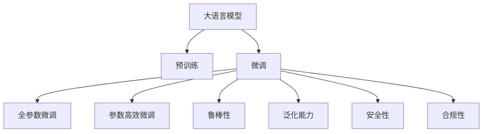

                 

# 大语言模型原理与工程实践：行业大语言模型的评测：以金融行业大语言模型为例

## 1. 背景介绍

### 1.1 问题由来

近年来，随着人工智能技术的迅猛发展，金融行业也逐步迈入了智能时代。金融行业的独特性在于其高度的业务复杂性和决策敏感性，因此对自然语言处理(NLP)技术提出了极高的要求。大语言模型作为一种先进的AI技术，在金融领域具有广阔的应用前景。

金融行业涉及多种任务，包括但不限于文本分类、情感分析、客户服务、舆情监控等。这些任务对自然语言处理技术有着不同的需求和挑战。为此，大语言模型在金融领域的应用，需要针对具体的业务场景进行定制和优化，以达到最佳效果。

### 1.2 问题核心关键点

金融行业大语言模型评测的核心关键点主要包括：

- **数据质量与标注**：金融领域数据复杂多样，且标注成本较高。高质量标注数据对模型训练至关重要。
- **模型适配与微调**：不同金融任务需要适配不同模型，微调过程需要精细调参，以避免过拟合。
- **模型鲁棒性与泛化能力**：金融模型需具备较强的鲁棒性和泛化能力，以应对复杂多变的市场环境。
- **安全性与合规性**：金融行业对模型输出结果的安全性和合规性要求较高，需进行严格的测试和监控。
- **性能评估与优化**：基于业务需求，需对模型性能进行全面评估，并进行优化调整。

### 1.3 问题研究意义

大语言模型在金融行业的评测和应用，对于提升金融服务智能化水平、降低运营成本、增强市场决策支持等方面具有重要意义：

1. **提升智能化水平**：通过智能客户服务、智能风险管理、智能投研等应用，金融行业能够提升服务效率和质量，更好地满足客户需求。
2. **降低运营成本**：智能化系统能够替代部分人工操作，减少人力投入，降低运营成本。
3. **增强决策支持**：通过大数据分析和情感分析等技术，金融模型能够提供更为准确的决策支持，提高投资和风险管理的效果。
4. **满足监管要求**：智能模型需符合相关金融监管政策，确保合规性。
5. **保障数据安全**：模型需具备一定的数据保护和隐私保护能力，保障客户信息安全。

## 2. 核心概念与联系

### 2.1 核心概念概述

为了更好地理解金融行业大语言模型的评测方法，我们首先介绍几个核心概念：

- **大语言模型(Large Language Model, LLM)**：一类基于深度神经网络的语言模型，通过大规模无标签文本数据进行预训练，具备较强的语言理解和生成能力。
- **预训练(Pre-training)**：使用大规模无标签文本数据训练模型，使其学习到语言的基本特征和规律。
- **微调(Fine-tuning)**：在预训练模型的基础上，使用特定的金融任务数据集进行有监督训练，优化模型在该任务上的性能。
- **鲁棒性(Robustness)**：指模型对输入数据的扰动和变化具有较强的适应能力，能够在不同环境条件下保持稳定的输出。
- **泛化能力(Generalization)**：指模型在未见过的数据上能够取得良好表现的能力。
- **安全性(Security)**：指模型输出结果不受恶意干扰和攻击，能够保护用户隐私和数据安全。
- **合规性(Compliance)**：指模型输出需符合相关法律法规，如GDPR、PCI等。

这些核心概念通过以下Mermaid流程图进行展示：



### 2.2 概念间的关系

这些核心概念之间存在着紧密的联系，形成了大语言模型评测与应用的完整生态系统。通过以下Mermaid流程图展示这些概念之间的关系：


此流程图展示了从数据标注到模型部署的完整流程，以及各环节对大语言模型评测的影响。

## 3. 核心算法原理 & 具体操作步骤

### 3.1 算法原理概述

基于监督学习的大语言模型评测算法，主要通过以下步骤实现：

1. **数据准备**：收集金融领域相关文本数据，并进行预处理和标注。
2. **模型选择**：选择合适的预训练模型，如BERT、GPT等。
3. **微调设置**：确定微调的超参数，如学习率、批量大小、迭代次数等。
4. **模型训练**：在金融数据集上进行有监督训练，优化模型性能。
5. **模型评估**：在测试集上评估模型性能，如准确率、召回率、F1分数等。
6. **模型优化**：根据评估结果，调整模型结构和参数，进一步提升性能。

### 3.2 算法步骤详解

以下详细介绍每个步骤的详细内容：

**Step 1: 数据准备**

金融行业数据复杂多样，通常包括新闻报道、客户反馈、市场评论等。数据准备阶段需要进行数据清洗、标注和分集，以确保数据的质量和多样性。

- **数据清洗**：去除无用信息，如HTML标签、停用词等，保留关键信息。
- **数据标注**：对文本进行分类、情感标注、实体识别等操作，生成标注数据集。
- **数据分集**：将数据集分为训练集、验证集和测试集，保证模型评估的公平性和可靠性。

**Step 2: 模型选择**

金融行业大语言模型评测中，常用的预训练模型包括BERT、GPT等。选择合适的模型，需考虑模型的语言理解能力和应用场景。

- **BERT**：适用于各种NLP任务，具有较强的上下文理解能力。
- **GPT**：擅长生成文本，适合生成式任务如文本生成、对话等。

**Step 3: 微调设置**

微调过程需要设置多个超参数，以保证模型训练的稳定性和效率。

- **学习率**：一般设置为预训练时学习率的1/10到1/100。
- **批量大小**：通常设置为32到64，以平衡计算速度和模型收敛速度。
- **迭代次数**：根据数据集大小和模型复杂度，一般设置为10到100轮。
- **正则化**：使用L2正则、Dropout等技术，防止过拟合。

**Step 4: 模型训练**

在金融数据集上进行有监督训练，优化模型性能。

- **训练过程**：使用GPU/TPU等高性能设备，提高训练速度。
- **迭代优化**：使用Adam等优化器，不断更新模型参数。
- **早期停止**：设置Early Stopping机制，避免过度拟合。

**Step 5: 模型评估**

在测试集上评估模型性能，如准确率、召回率、F1分数等。

- **评估指标**：选择与业务需求匹配的评估指标，如二分类任务使用准确率、召回率和F1分数等。
- **评估过程**：使用测试集进行单批次或批量评估，计算模型性能指标。

**Step 6: 模型优化**

根据评估结果，调整模型结构和参数，进一步提升性能。

- **超参数调整**：根据性能指标，调整学习率、批量大小等超参数。
- **模型融合**：使用模型融合技术，提高模型的泛化能力。
- **模型压缩**：通过剪枝、量化等技术，减小模型大小，提高推理速度。

### 3.3 算法优缺点

基于监督学习的大语言模型评测算法具有以下优点：

- **精度高**：通过有监督训练，模型能够快速适应金融任务，取得较高的精度。
- **可解释性强**：通过详细的训练和评估过程，可以清晰地解释模型决策过程。
- **适应性强**：适用于多种金融任务，如文本分类、情感分析等。

同时，该算法也存在以下缺点：

- **数据依赖性强**：需要高质量的标注数据，数据获取成本较高。
- **泛化能力有限**：在测试集上，模型的泛化能力可能不足，需进一步优化。
- **计算资源消耗大**：大模型训练和推理需要大量的计算资源，可能影响系统性能。

### 3.4 算法应用领域

基于监督学习的大语言模型评测算法，在金融行业的应用领域包括但不限于：

- **客户服务**：智能客服系统，通过NLP技术处理客户咨询，提高服务效率。
- **风险管理**：使用情感分析技术，监控市场情绪，进行风险预警。
- **投研分析**：使用文本分类和实体识别技术，辅助分析师进行市场分析和财务报表分析。
- **舆情监控**：通过情感分析技术，监控社交媒体和新闻报道，进行舆情分析。
- **合规审计**：使用NLP技术，处理合规文档和规则库，辅助合规审计。

## 4. 数学模型和公式 & 详细讲解 & 举例说明

### 4.1 数学模型构建

金融行业大语言模型的评测模型，通常采用二分类任务，如正负情感分类。

设模型输入为 $x$，输出为 $y$，其中 $y \in \{0,1\}$，表示情感分类标签。模型的输出为 $M_{\theta}(x)$，其中 $\theta$ 为模型参数。

### 4.2 公式推导过程

二分类任务的交叉熵损失函数定义为：

$$
\ell(M_{\theta}(x),y) = -[y\log M_{\theta}(x) + (1-y)\log (1-M_{\theta}(x))]
$$

在金融数据集 $D=\{(x_i,y_i)\}_{i=1}^N$ 上，经验风险为：

$$
\mathcal{L}(\theta) = \frac{1}{N}\sum_{i=1}^N \ell(M_{\theta}(x_i),y_i)
$$

使用梯度下降等优化算法，最小化损失函数，得到模型参数 $\hat{\theta}$：

$$
\hat{\theta} = \mathop{\arg\min}_{\theta} \mathcal{L}(\theta)
$$

### 4.3 案例分析与讲解

以情感分析任务为例，假设有一个简单的金融数据集 $D$，其中包含客户对银行的评价。我们将评价分为正面和负面两类。

- **数据准备**：收集客户评价，进行文本清洗和标注。
- **模型选择**：选择BERT作为预训练模型。
- **微调设置**：设置学习率为1e-5，批量大小为32，迭代次数为10轮。
- **模型训练**：在金融数据集上进行有监督训练。
- **模型评估**：在测试集上评估模型性能，如准确率、召回率和F1分数。
- **模型优化**：根据评估结果，调整学习率和批量大小，进一步提升模型性能。

## 5. 项目实践：代码实例和详细解释说明

### 5.1 开发环境搭建

以下是在PyTorch环境下搭建大语言模型评测环境的步骤：

1. 安装Anaconda：从官网下载并安装Anaconda，用于创建独立的Python环境。

2. 创建并激活虚拟环境：
```bash
conda create -n pytorch-env python=3.8 
conda activate pytorch-env
```

3. 安装PyTorch：根据CUDA版本，从官网获取对应的安装命令。例如：
```bash
conda install pytorch torchvision torchaudio cudatoolkit=11.1 -c pytorch -c conda-forge
```

4. 安装Transformer库：
```bash
pip install transformers
```

5. 安装各类工具包：
```bash
pip install numpy pandas scikit-learn matplotlib tqdm jupyter notebook ipython
```

完成上述步骤后，即可在`pytorch-env`环境中开始项目实践。

### 5.2 源代码详细实现

以下是一个使用PyTorch对BERT模型进行情感分析任务微调的示例代码：

```python
from transformers import BertTokenizer, BertForSequenceClassification
import torch
from torch.utils.data import Dataset, DataLoader
from sklearn.metrics import accuracy_score, precision_recall_fscore_support

# 定义情感标注字典
label2idx = {'Negative': 0, 'Positive': 1}

# 定义情感分析模型
model = BertForSequenceClassification.from_pretrained('bert-base-cased', num_labels=len(label2idx))

# 定义情感标注数据集
class SentimentDataset(Dataset):
    def __init__(self, texts, labels):
        self.texts = texts
        self.labels = labels
        
    def __len__(self):
        return len(self.texts)
    
    def __getitem__(self, idx):
        text = self.texts[idx]
        label = self.labels[idx]
        
        encoding = tokenizer(text, return_tensors='pt', max_length=128, padding='max_length', truncation=True)
        input_ids = encoding['input_ids']
        attention_mask = encoding['attention_mask']
        
        return {'input_ids': input_ids, 
                'attention_mask': attention_mask,
                'labels': torch.tensor(label2idx[label])}

# 加载数据集
tokenizer = BertTokenizer.from_pretrained('bert-base-cased')
train_dataset = SentimentDataset(train_texts, train_labels)
dev_dataset = SentimentDataset(dev_texts, dev_labels)
test_dataset = SentimentDataset(test_texts, test_labels)

# 定义超参数
device = torch.device('cuda') if torch.cuda.is_available() else torch.device('cpu')
model.to(device)
learning_rate = 2e-5
num_epochs = 5
batch_size = 16

# 定义优化器和损失函数
optimizer = AdamW(model.parameters(), lr=learning_rate)
loss_fn = torch.nn.CrossEntropyLoss()

# 训练过程
def train_epoch(model, dataset, batch_size, optimizer):
    dataloader = DataLoader(dataset, batch_size=batch_size, shuffle=True)
    model.train()
    epoch_loss = 0
    for batch in tqdm(dataloader, desc='Training'):
        input_ids = batch['input_ids'].to(device)
        attention_mask = batch['attention_mask'].to(device)
        labels = batch['labels'].to(device)
        model.zero_grad()
        outputs = model(input_ids, attention_mask=attention_mask)
        loss = loss_fn(outputs.logits, labels)
        epoch_loss += loss.item()
        loss.backward()
        optimizer.step()
    return epoch_loss / len(dataloader)

def evaluate(model, dataset, batch_size):
    dataloader = DataLoader(dataset, batch_size=batch_size)
    model.eval()
    preds, labels = [], []
    with torch.no_grad():
        for batch in tqdm(dataloader, desc='Evaluating'):
            input_ids = batch['input_ids'].to(device)
            attention_mask = batch['attention_mask'].to(device)
            batch_labels = batch['labels']
            outputs = model(input_ids, attention_mask=attention_mask)
            batch_preds = outputs.logits.argmax(dim=1).to('cpu').tolist()
            batch_labels = batch_labels.to('cpu').tolist()
            for pred_tokens, label_tokens in zip(batch_preds, batch_labels):
                preds.append(pred_tokens)
                labels.append(label_tokens)
                
    print('Accuracy:', accuracy_score(labels, preds))

# 训练和评估
for epoch in range(num_epochs):
    loss = train_epoch(model, train_dataset, batch_size, optimizer)
    print(f"Epoch {epoch+1}, train loss: {loss:.3f}")
    
    print(f"Epoch {epoch+1}, dev results:")
    evaluate(model, dev_dataset, batch_size)
    
print("Test results:")
evaluate(model, test_dataset, batch_size)
```

### 5.3 代码解读与分析

以下是对代码中关键部分的详细解读：

**SentimentDataset类**：
- `__init__`方法：初始化文本和标签数据。
- `__len__`方法：返回数据集大小。
- `__getitem__`方法：对单个样本进行处理，将文本输入转换为token ids，将标签转换为数字，并进行定长padding。

**label2idx字典**：
- 定义了标签与数字id之间的映射关系，用于将预测结果解码为真实的标签。

**训练和评估函数**：
- 使用PyTorch的DataLoader对数据集进行批次化加载，供模型训练和推理使用。
- 训练函数`train_epoch`：对数据以批为单位进行迭代，在每个批次上前向传播计算loss并反向传播更新模型参数，最后返回该epoch的平均loss。
- 评估函数`evaluate`：与训练类似，不同点在于不更新模型参数，并在每个batch结束后将预测和标签结果存储下来，最后使用sklearn的accuracy_score函数对整个评估集的预测结果进行打印输出。

**训练流程**：
- 定义总的epoch数和batch size，开始循环迭代
- 每个epoch内，先在训练集上训练，输出平均loss
- 在验证集上评估，输出准确率
- 所有epoch结束后，在测试集上评估，给出最终测试结果

## 6. 实际应用场景

### 6.1 智能客服系统

基于大语言模型评测的智能客服系统，可以广泛应用于金融行业。传统客服往往需要配备大量人力，高峰期响应缓慢，且一致性和专业性难以保证。使用大语言模型评测系统，可以7x24小时不间断服务，快速响应客户咨询，用自然流畅的语言解答各类常见问题。

在技术实现上，可以收集企业内部的历史客服对话记录，将问题和最佳答复构建成监督数据，在此基础上对预训练大语言模型进行评测，得到最优模型。微调后的模型能够自动理解用户意图，匹配最合适的答案模板进行回复。对于客户提出的新问题，还可以接入检索系统实时搜索相关内容，动态组织生成回答。如此构建的智能客服系统，能大幅提升客户咨询体验和问题解决效率。

### 6.2 金融舆情监测

金融机构需要实时监测市场舆论动向，以便及时应对负面信息传播，规避金融风险。传统的人工监测方式成本高、效率低，难以应对网络时代海量信息爆发的挑战。基于大语言模型评测的舆情监测技术，为金融舆情监测提供了新的解决方案。

具体而言，可以收集金融领域相关的新闻、报道、评论等文本数据，并对其进行主题标注和情感标注。在此基础上对预训练语言模型进行评测，使其能够自动判断文本属于何种主题，情感倾向是正面、中性还是负面。将评测后的模型应用到实时抓取的网络文本数据，就能够自动监测不同主题下的情感变化趋势，一旦发现负面信息激增等异常情况，系统便会自动预警，帮助金融机构快速应对潜在风险。

### 6.3 个性化推荐系统

当前的推荐系统往往只依赖用户的历史行为数据进行物品推荐，无法深入理解用户的真实兴趣偏好。基于大语言模型评测的个性化推荐系统，可以更好地挖掘用户行为背后的语义信息，从而提供更精准、多样的推荐内容。

在实践中，可以收集用户浏览、点击、评论、分享等行为数据，提取和用户交互的物品标题、描述、标签等文本内容。将文本内容作为模型输入，用户的后续行为（如是否点击、购买等）作为监督信号，在此基础上对预训练语言模型进行评测，得到最优模型。微调后的模型能够从文本内容中准确把握用户的兴趣点。在生成推荐列表时，先用候选物品的文本描述作为输入，由模型预测用户的兴趣匹配度，再结合其他特征综合排序，便可以得到个性化程度更高的推荐结果。

### 6.4 未来应用展望

随着大语言模型评测技术的发展，其在金融行业的各类应用也将不断拓展，为传统行业带来变革性影响。

在智慧医疗领域，基于大语言模型评测的问答、病历分析、药物研发等应用将提升医疗服务的智能化水平，辅助医生诊疗，加速新药开发进程。

在智能教育领域，大语言模型评测可应用于作业批改、学情分析、知识推荐等方面，因材施教，促进教育公平，提高教学质量。

在智慧城市治理中，大语言模型评测技术可应用于城市事件监测、舆情分析、应急指挥等环节，提高城市管理的自动化和智能化水平，构建更安全、高效的未来城市。

此外，在企业生产、社会治理、文娱传媒等众多领域，大语言模型评测的应用也将不断涌现，为经济社会发展注入新的动力。相信随着技术的日益成熟，大语言模型评测技术必将在构建人机协同的智能时代中扮演越来越重要的角色。

## 7. 工具和资源推荐

### 7.1 学习资源推荐

为了帮助开发者系统掌握大语言模型评测的理论基础和实践技巧，这里推荐一些优质的学习资源：

1. 《Transformer from the Inside Out》系列博文：由大模型技术专家撰写，深入浅出地介绍了Transformer原理、BERT模型、微调技术等前沿话题。

2. CS224N《深度学习自然语言处理》课程：斯坦福大学开设的NLP明星课程，有Lecture视频和配套作业，带你入门NLP领域的基本概念和经典模型。

3. 《Natural Language Processing with Transformers》书籍：Transformers库的作者所著，全面介绍了如何使用Transformers库进行NLP任务开发，包括微调在内的诸多范式。

4. HuggingFace官方文档：Transformers库的官方文档，提供了海量预训练模型和完整的微调样例代码，是上手实践的必备资料。

5. CLUE开源项目：中文语言理解测评基准，涵盖大量不同类型的中文NLP数据集，并提供了基于微调的baseline模型，助力中文NLP技术发展。

通过对这些资源的学习实践，相信你一定能够快速掌握大语言模型评测的精髓，并用于解决实际的NLP问题。

### 7.2 开发工具推荐

高效的开发离不开优秀的工具支持。以下是几款用于大语言模型评测开发的常用工具：

1. PyTorch：基于Python的开源深度学习框架，灵活动态的计算图，适合快速迭代研究。大部分预训练语言模型都有PyTorch版本的实现。

2. TensorFlow：由Google主导开发的开源深度学习框架，生产部署方便，适合大规模工程应用。同样有丰富的预训练语言模型资源。

3. Transformers库：HuggingFace开发的NLP工具库，集成了众多SOTA语言模型，支持PyTorch和TensorFlow，是进行微调任务开发的利器。

4. Weights & Biases：模型训练的实验跟踪工具，可以记录和可视化模型训练过程中的各项指标，方便对比和调优。与主流深度学习框架无缝集成。

5. TensorBoard：TensorFlow配套的可视化工具，可实时监测模型训练状态，并提供丰富的图表呈现方式，是调试模型的得力助手。

6. Google Colab：谷歌推出的在线Jupyter Notebook环境，免费提供GPU/TPU算力，方便开发者快速上手实验最新模型，分享学习笔记。

合理利用这些工具，可以显著提升大语言模型评测的开发效率，加快创新迭代的步伐。

### 7.3 相关论文推荐

大语言模型评测技术的发展源于学界的持续研究。以下是几篇奠基性的相关论文，推荐阅读：

1. Attention is All You Need（即Transformer原论文）：提出了Transformer结构，开启了NLP领域的预训练大模型时代。

2. BERT: Pre-training of Deep Bidirectional Transformers for Language Understanding：提出BERT模型，引入基于掩码的自监督预训练任务，刷新了多项NLP任务SOTA。

3. Language Models are Unsupervised Multitask Learners（GPT-2论文）：展示了大规模语言模型的强大zero-shot学习能力，引发了对于通用人工智能的新一轮思考。

4. Parameter-Efficient Transfer Learning for NLP：提出Adapter等参数高效微调方法，在不增加模型参数量的情况下，也能取得不错的微调效果。

5. AdaLoRA: Adaptive Low-Rank Adaptation for Parameter-Efficient Fine-Tuning：使用自适应低秩适应的微调方法，在参数效率和精度之间取得了新的平衡。

这些论文代表了大语言模型评测技术的发展脉络。通过学习这些前沿成果，可以帮助研究者把握学科前进方向，激发更多的创新灵感。

除上述资源外，还有一些值得关注的前沿资源，帮助开发者紧跟大语言模型评测技术的最新进展，例如：

1. arXiv论文预印本：人工智能领域最新研究成果的发布平台，包括大量尚未发表的前沿工作，学习前沿技术的必读资源。

2. 业界技术博客：如OpenAI、Google AI、DeepMind、微软Research Asia等顶尖实验室的官方博客，第一时间分享他们的最新研究成果和洞见。

3. 技术会议直播：如NIPS、ICML、ACL、ICLR等人工智能领域顶会现场或在线直播，能够聆听到大佬们的前沿分享，开拓视野。

4. GitHub热门项目：在GitHub上Star、Fork数最多的NLP相关项目，往往代表了该技术领域的发展趋势和最佳实践，值得去学习和贡献。

5. 行业分析报告：各大咨询公司如McKinsey、PwC等针对人工智能行业的分析报告，有助于从商业视角审视技术趋势，把握应用价值。

总之，对于大语言模型评测技术的学习和实践，需要开发者保持开放的心态和持续学习的意愿。多关注前沿资讯，多动手实践，多思考总结，必将收获满满的成长收益。

## 8. 总结：未来发展趋势与挑战

### 8.1 总结

本文对基于监督学习的大语言模型评测方法进行了全面系统的介绍。首先阐述了大语言模型评测在金融行业的应用背景和重要性，明确了评测方法在提升金融服务智能化水平、降低运营成本、增强市场决策支持

