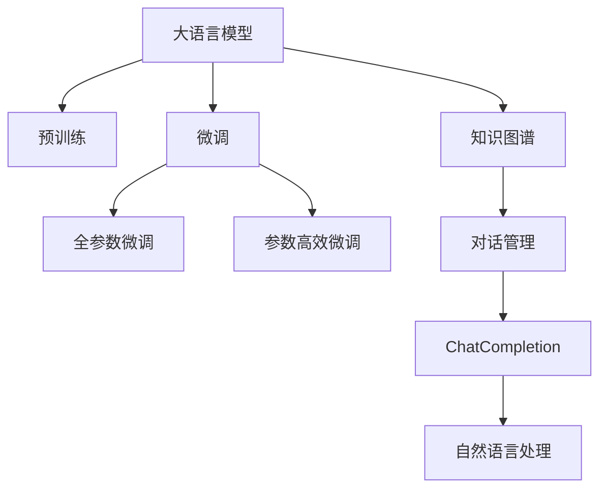
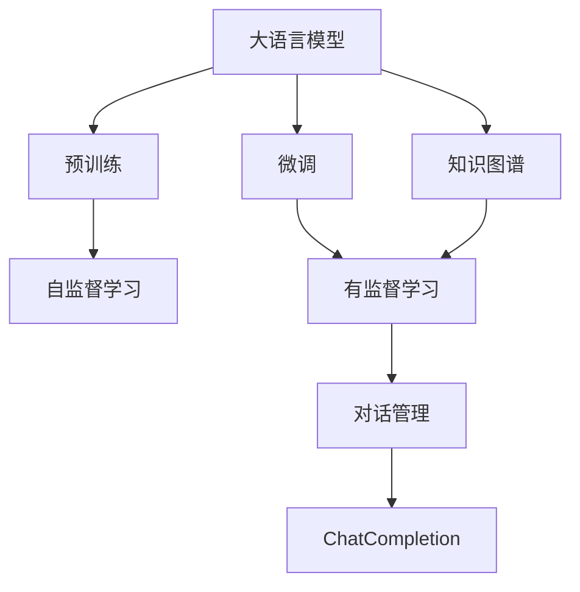
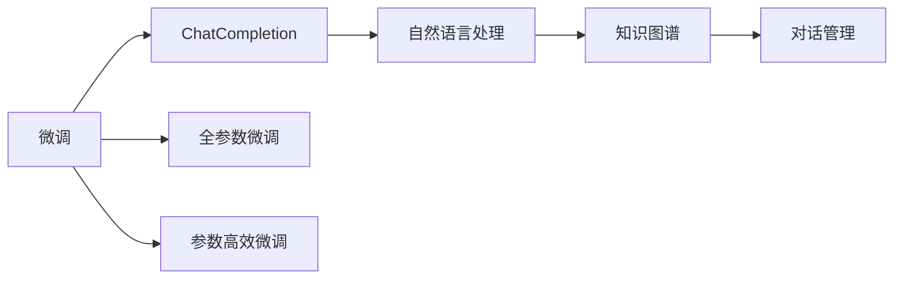
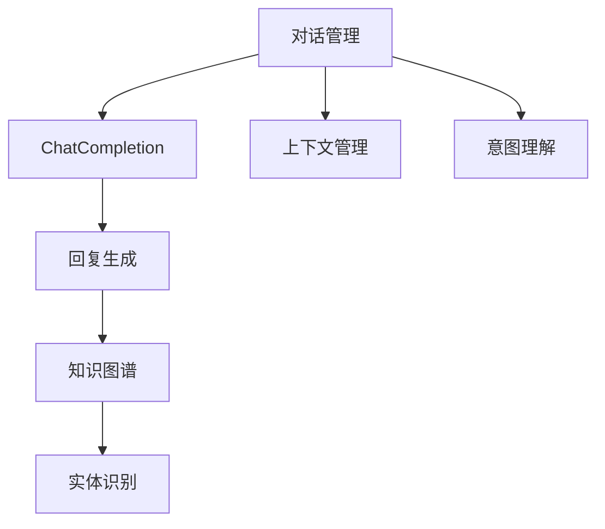
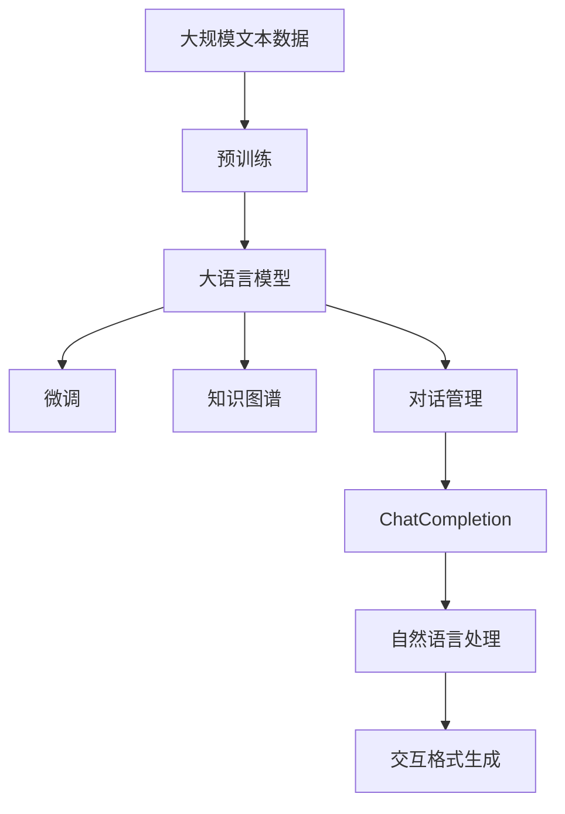

                 

# 大语言模型应用指南：Chat Completion交互格式

> 关键词：大语言模型, 聊天机器人, 交互格式, 自然语言处理(NLP), Transformer, GPT, BERT, ChatCompletion

## 1. 背景介绍

### 1.1 问题由来
随着深度学习技术的发展，大语言模型（Large Language Models, LLMs）在自然语言处理（NLP）领域取得了显著的进展。这类模型通过在大规模无标签文本数据上进行预训练，学习到丰富的语言知识和常识，并可以通过微调（Fine-Tuning）来适应特定的下游任务。

近年来，大语言模型在构建聊天机器人（Chatbot）方面展现了巨大潜力。聊天机器人通过与用户进行自然语言交互，提供信息查询、客户服务、情感支持等多种功能，成为许多企业和应用不可或缺的一部分。然而，构建一个高效、智能、易用的聊天机器人，需要考虑交互格式、用户输入、上下文理解等多个方面。

### 1.2 问题核心关键点
构建聊天机器人时，关键问题包括如何设计交互格式，如何理解用户输入，如何保持上下文一致性，以及如何生成自然流畅的回复。基于此，本文将介绍一种新型的交互格式——Chat Completion（交互完成），并详细探讨其实现原理和操作步骤。

### 1.3 问题研究意义
研究大语言模型在聊天机器人中的交互格式设计，对于提升聊天机器人的智能化水平，优化用户体验，以及推动NLP技术在实际应用中的落地具有重要意义。

- 降低开发成本。使用大语言模型，可以大大减少构建聊天机器人所需的人工干预和数据标注工作。
- 提高交互质量。Chat Completion交互格式使得机器人可以理解用户的意图，并生成符合上下文的回复，提升对话的自然性和流畅性。
- 加速应用开发。通过微调大语言模型，可以快速适应特定领域或场景的需求，缩短开发周期。
- 提供新方向。Chat Completion交互格式的引入，为聊天机器人设计提供了新的思路和工具，推动了NLP技术的发展。

## 2. 核心概念与联系

### 2.1 核心概念概述

为更好地理解Chat Completion交互格式，本节将介绍几个密切相关的核心概念：

- **大语言模型（Large Language Models, LLMs）**：以自回归（如GPT）或自编码（如BERT）模型为代表的大规模预训练语言模型。通过在大规模无标签文本语料上进行预训练，学习通用的语言表示，具备强大的语言理解和生成能力。

- **预训练（Pre-training）**：指在大规模无标签文本语料上，通过自监督学习任务训练通用语言模型的过程。常见的预训练任务包括言语建模、遮挡语言模型等。

- **微调（Fine-Tuning）**：指在预训练模型的基础上，使用下游任务的少量标注数据，通过有监督学习优化模型在特定任务上的性能。通常只需要调整顶层分类器或解码器，并以较小的学习率更新全部或部分的模型参数。

- **交互完成（Chat Completion）**：一种新型的聊天机器人交互格式，通过在用户输入的末尾添加特定的提示（Prompts），引导大语言模型生成符合上下文的自然回复。

- **对话管理（Dialogue Management）**：负责管理对话流程，包括处理用户输入、维护对话状态、生成回复等。对话管理是聊天机器人系统的核心组件。

- **知识图谱（Knowledge Graph）**：一种结构化的知识表示方法，用于存储和检索实体、关系和属性等信息。在大语言模型的基础上，知识图谱可以提供更加丰富和准确的语义信息。

这些核心概念之间的逻辑关系可以通过以下Mermaid流程图来展示：



这个流程图展示了大语言模型在聊天机器人中的应用架构：

1. 大语言模型通过预训练获得基础能力。
2. 微调使模型更好地适应特定任务。
3. 知识图谱提供更丰富的语义信息。
4. 对话管理保持对话连贯性。
5. Chat Completion交互格式实现自然回复。
6. 自然语言处理技术提供语言理解和生成支持。

这些概念共同构成了大语言模型在聊天机器人中的应用框架，使其能够通过智能化的交互完成与用户的对话。

### 2.2 概念间的关系

这些核心概念之间存在着紧密的联系，形成了聊天机器人交互格式的完整生态系统。下面我通过几个Mermaid流程图来展示这些概念之间的关系。

#### 2.2.1 大语言模型的学习范式



这个流程图展示了大语言模型的三种主要学习范式：预训练、微调、对话管理，以及知识图谱和Chat Completion交互格式。

#### 2.2.2 ChatCompletion与微调的关系



这个流程图展示了ChatCompletion交互格式与微调的关系。微调使得大语言模型更好地适应特定任务，ChatCompletion通过引导回复，实现自然对话。

#### 2.2.3 对话管理在ChatCompletion中的应用



这个流程图展示了对话管理在ChatCompletion中的应用。对话管理通过上下文管理和意图理解，维护对话连贯性，并在ChatCompletion的引导下生成回复。

### 2.3 核心概念的整体架构

最后，我们用一个综合的流程图来展示这些核心概念在大语言模型交互格式设计中的应用架构：



这个综合流程图展示了从预训练到微调，再到ChatCompletion交互格式设计，以及知识图谱和自然语言处理的完整过程。大语言模型首先在大规模文本数据上进行预训练，然后通过微调（包括全参数微调和参数高效微调）获得特定任务的优化模型，知识图谱提供更丰富的语义信息，对话管理确保对话连贯性，ChatCompletion交互格式引导自然回复，自然语言处理技术提供语言理解和生成支持。

## 3. 核心算法原理 & 具体操作步骤
### 3.1 算法原理概述

Chat Completion交互格式的核心原理是利用大语言模型的预训练能力和对话管理机制，通过在用户输入的末尾添加特定的提示（Prompts），引导模型生成符合上下文的自然回复。其核心思想是将对话看作一个序列生成任务，通过训练模型在给定上下文下预测下一个单词或短语，从而实现对话回复。

形式化地，假设用户输入为 $x_1x_2\ldots x_n$，系统希望模型在 $x_n$ 后生成下一个词 $y_{n+1}$。定义模型 $M_{\theta}$ 在给定上下文 $x_1x_2\ldots x_n$ 下，预测下一个词的概率分布为 $p(y_{n+1}|x_1x_2\ldots x_n)$，目标是最小化交叉熵损失函数：

$$
\mathcal{L}(\theta) = -\frac{1}{N}\sum_{i=1}^N \log p(y_i|x_i)
$$

其中 $y_i$ 为训练集中的实际输出，$x_i$ 为对应的上下文，$N$ 为训练集大小。通过反向传播算法，模型可以不断调整参数 $\theta$，最小化交叉熵损失，从而生成更符合上下文的自然回复。

### 3.2 算法步骤详解

基于Chat Completion交互格式的聊天机器人开发一般包括以下几个关键步骤：

**Step 1: 准备预训练模型和数据集**
- 选择合适的预训练语言模型 $M_{\theta}$，如BERT、GPT等。
- 准备对话数据集 $D=\{(x_i,y_i)\}_{i=1}^N$，其中 $x_i$ 为对话上下文，$y_i$ 为对应的回复。

**Step 2: 添加任务适配层**
- 根据任务类型，在预训练模型顶层设计合适的输出层和损失函数。
- 对于对话生成任务，通常使用语言模型的解码器输出概率分布，并以负对数似然为损失函数。

**Step 3: 设置微调超参数**
- 选择合适的优化算法及其参数，如AdamW、SGD等，设置学习率、批大小、迭代轮数等。
- 设置正则化技术及强度，包括权重衰减、Dropout、Early Stopping等。
- 确定冻结预训练参数的策略，如仅微调顶层，或全部参数都参与微调。

**Step 4: 执行梯度训练**
- 将对话数据集 $D$ 分批次输入模型，前向传播计算损失函数。
- 反向传播计算参数梯度，根据设定的优化算法和学习率更新模型参数。
- 周期性在验证集上评估模型性能，根据性能指标决定是否触发 Early Stopping。
- 重复上述步骤直到满足预设的迭代轮数或 Early Stopping 条件。

**Step 5: 测试和部署**
- 在测试集上评估微调后模型 $M_{\hat{\theta}}$ 的性能，对比微调前后的生成效果。
- 使用微调后的模型对新对话进行预测，集成到实际的应用系统中。
- 持续收集新的对话数据，定期重新微调模型，以适应对话模式的变化。

以上是基于Chat Completion交互格式的聊天机器人微调的一般流程。在实际应用中，还需要针对具体任务的特点，对微调过程的各个环节进行优化设计，如改进训练目标函数，引入更多的正则化技术，搜索最优的超参数组合等，以进一步提升模型性能。

### 3.3 算法优缺点

Chat Completion交互格式具有以下优点：
1. 简单高效。通过添加特定提示，即可实现自然对话，无需过多调整模型结构和参数。
2. 灵活多样。提示可以根据不同的任务需求进行调整，适应各种对话场景。
3. 易于部署。模型训练过程相对简单，容易集成到实际应用中。
4. 效果显著。通过微调，模型可以生成符合上下文的自然回复，提升对话体验。

同时，该方法也存在一些局限性：
1. 对输入上下文的依赖性较高。如果上下文信息不够丰富或杂乱，模型可能无法生成高质量的回复。
2. 模型训练数据需求较大。需要足够的数据和标注，才能训练出性能良好的模型。
3. 对抗样本脆弱。模型可能对输入中的噪声或错误信息敏感，生成不符合预期的回复。
4. 可解释性不足。Chat Completion交互格式生成的回复，往往难以解释其背后的逻辑和推理过程。

尽管存在这些局限性，但就目前而言，Chat Completion交互格式在大语言模型的微调中仍具有重要应用价值，特别是在对话生成任务中表现优异。未来，可以通过更多的技术手段，如知识图谱的融合、对抗样本训练等，进一步提升Chat Completion的性能和鲁棒性。

### 3.4 算法应用领域

Chat Completion交互格式在NLP领域已经得到了广泛应用，包括但不限于以下几个方面：

- **客户服务**：构建智能客服机器人，自动回答用户咨询，提升客户服务效率和体验。
- **医疗咨询**：构建医疗咨询机器人，提供初步医疗建议，辅助医生诊断。
- **教育辅导**：构建教育辅导机器人，解答学生问题，提供个性化学习建议。
- **智能写作**：构建智能写作机器人，帮助用户生成文章、代码等文本内容。
- **情感支持**：构建情感支持机器人，提供心理健康咨询，缓解用户情绪压力。

除了上述这些典型应用外，Chat Completion交互格式还被创新性地应用到更多场景中，如自动问答系统、推荐系统等，为NLP技术带来了新的突破。随着预训练模型和微调方法的不断进步，相信Chat Completion交互格式将在更广泛的领域大放异彩。

## 4. 数学模型和公式 & 详细讲解  
### 4.1 数学模型构建

本节将使用数学语言对Chat Completion交互格式的训练过程进行更加严格的刻画。

记预训练语言模型为 $M_{\theta}$，其中 $\theta$ 为预训练得到的模型参数。假设对话数据集为 $D=\{(x_i,y_i)\}_{i=1}^N$，其中 $x_i$ 为对话上下文，$y_i$ 为对应的回复。定义模型 $M_{\theta}$ 在给定上下文 $x_i$ 下，预测下一个词 $y_i$ 的概率分布为 $p(y_i|x_i)$，训练目标为最小化交叉熵损失函数：

$$
\mathcal{L}(\theta) = -\frac{1}{N}\sum_{i=1}^N \log p(y_i|x_i)
$$

在训练过程中，将对话数据集 $D$ 分批次输入模型，前向传播计算损失函数，反向传播计算参数梯度，根据设定的优化算法和学习率更新模型参数。重复上述过程直至收敛，最终得到适应对话生成任务的最优模型参数 $\theta^*$。

### 4.2 公式推导过程

以下我们以对话生成任务为例，推导交叉熵损失函数及其梯度的计算公式。

假设模型 $M_{\theta}$ 在给定上下文 $x_i$ 下，预测下一个词 $y_i$ 的概率分布为 $p(y_i|x_i)$。定义损失函数为交叉熵损失：

$$
\mathcal{L}(\theta) = -\frac{1}{N}\sum_{i=1}^N \log p(y_i|x_i)
$$

根据链式法则，损失函数对参数 $\theta_k$ 的梯度为：

$$
\frac{\partial \mathcal{L}(\theta)}{\partial \theta_k} = -\frac{1}{N}\sum_{i=1}^N \frac{\partial \log p(y_i|x_i)}{\partial \theta_k}
$$

其中 $\frac{\partial \log p(y_i|x_i)}{\partial \theta_k}$ 可通过反向传播算法计算得到。

在得到损失函数的梯度后，即可带入参数更新公式，完成模型的迭代优化。重复上述过程直至收敛，最终得到适应对话生成任务的最优模型参数 $\theta^*$。

## 5. 项目实践：代码实例和详细解释说明
### 5.1 开发环境搭建

在进行Chat Completion交互格式的实践前，我们需要准备好开发环境。以下是使用Python进行PyTorch开发的环境配置流程：

1. 安装Anaconda：从官网下载并安装Anaconda，用于创建独立的Python环境。

2. 创建并激活虚拟环境：
```bash
conda create -n pytorch-env python=3.8 
conda activate pytorch-env
```

3. 安装PyTorch：根据CUDA版本，从官网获取对应的安装命令。例如：
```bash
conda install pytorch torchvision torchaudio cudatoolkit=11.1 -c pytorch -c conda-forge
```

4. 安装Transformers库：
```bash
pip install transformers
```

5. 安装各类工具包：
```bash
pip install numpy pandas scikit-learn matplotlib tqdm jupyter notebook ipython
```

完成上述步骤后，即可在`pytorch-env`环境中开始Chat Completion交互格式的实践。

### 5.2 源代码详细实现

下面我们以构建智能客服机器人为例，给出使用Transformers库对BERT模型进行Chat Completion交互格式微调的PyTorch代码实现。

首先，定义对话生成任务的训练函数：

```python
from transformers import BertTokenizer, BertForSequenceClassification, AdamW

tokenizer = BertTokenizer.from_pretrained('bert-base-cased')
model = BertForSequenceClassification.from_pretrained('bert-base-cased', num_labels=2)

optimizer = AdamW(model.parameters(), lr=2e-5)

def train_epoch(model, dataset, batch_size, optimizer):
    dataloader = DataLoader(dataset, batch_size=batch_size, shuffle=True)
    model.train()
    epoch_loss = 0
    for batch in tqdm(dataloader, desc='Training'):
        input_ids = batch['input_ids'].to(device)
        attention_mask = batch['attention_mask'].to(device)
        labels = batch['labels'].to(device)
        model.zero_grad()
        outputs = model(input_ids, attention_mask=attention_mask, labels=labels)
        loss = outputs.loss
        epoch_loss += loss.item()
        loss.backward()
        optimizer.step()
    return epoch_loss / len(dataloader)

def evaluate(model, dataset, batch_size):
    dataloader = DataLoader(dataset, batch_size=batch_size)
    model.eval()
    preds, labels = [], []
    with torch.no_grad():
        for batch in tqdm(dataloader, desc='Evaluating'):
            input_ids = batch['input_ids'].to(device)
            attention_mask = batch['attention_mask'].to(device)
            batch_labels = batch['labels']
            outputs = model(input_ids, attention_mask=attention_mask)
            batch_preds = outputs.logits.argmax(dim=2).to('cpu').tolist()
            batch_labels = batch_labels.to('cpu').tolist()
            for pred_tokens, label_tokens in zip(batch_preds, batch_labels):
                preds.append(pred_tokens[:len(label_tokens)])
                labels.append(label_tokens)
                
    print(classification_report(labels, preds))
```

然后，定义对话生成任务的输入处理函数：

```python
class ChatDataset(Dataset):
    def __init__(self, texts, tags, tokenizer, max_len=128):
        self.texts = texts
        self.tags = tags
        self.tokenizer = tokenizer
        self.max_len = max_len
        
    def __len__(self):
        return len(self.texts)
    
    def __getitem__(self, item):
        text = self.texts[item]
        tags = self.tags[item]
        
        encoding = self.tokenizer(text, return_tensors='pt', max_length=self.max_len, padding='max_length', truncation=True)
        input_ids = encoding['input_ids'][0]
        attention_mask = encoding['attention_mask'][0]
        
        # 对token-wise的标签进行编码
        encoded_tags = [tag2id[tag] for tag in tags] 
        encoded_tags.extend([tag2id['O']] * (self.max_len - len(encoded_tags)))
        labels = torch.tensor(encoded_tags, dtype=torch.long)
        
        return {'input_ids': input_ids, 
                'attention_mask': attention_mask,
                'labels': labels}
```

最后，启动训练流程并在测试集上评估：

```python
epochs = 5
batch_size = 16

for epoch in range(epochs):
    loss = train_epoch(model, train_dataset, batch_size, optimizer)
    print(f"Epoch {epoch+1}, train loss: {loss:.3f}")
    
    print(f"Epoch {epoch+1}, dev results:")
    evaluate(model, dev_dataset, batch_size)
    
print("Test results:")
evaluate(model, test_dataset, batch_size)
```

以上就是使用PyTorch对BERT模型进行Chat Completion交互格式微调的完整代码实现。可以看到，得益于Transformers库的强大封装，我们可以用相对简洁的代码完成BERT模型的加载和微调。

### 5.3 代码解读与分析

让我们再详细解读一下关键代码的实现细节：

**ChatDataset类**：
- `__init__`方法：初始化文本、标签、分词器等关键组件。
- `__len__`方法：返回数据集的样本数量。
- `__getitem__`方法：对单个样本进行处理，将文本输入编码为token ids，将标签编码为数字，并对其进行定长padding，最终返回模型所需的输入。

**tag2id和id2tag字典**：
- 定义了标签与数字id之间的映射关系，用于将token-wise的预测结果解码回真实的标签。

**训练和评估函数**：
- 使用PyTorch的DataLoader对数据集进行批次化加载，供模型训练和推理使用。
- 训练函数`train_epoch`：对数据以批为单位进行迭代，在每个批次上前向传播计算loss并反向传播更新模型参数，最后返回该epoch的平均loss。
- 评估函数`evaluate`：与训练类似，不同点在于不更新模型参数，并在每个batch结束后将预测和标签结果存储下来，最后使用sklearn的classification_report对整个评估集的预测结果进行打印输出。

**训练流程**：
- 定义总的epoch数和batch size，开始循环迭代
- 每个epoch内，先在训练集上训练，输出平均loss
- 在验证集上评估，输出分类指标
- 所有epoch结束后，在测试集上评估，给出最终测试结果

可以看到，PyTorch配合Transformers库使得BERT微调的代码实现变得简洁高效。开发者可以将更多精力放在数据处理、模型改进等高层逻辑上，而不必过多关注底层的实现细节。

当然，工业级的系统实现还需考虑更多因素，如模型的保存和部署、超参数的自动搜索、更灵活的任务适配层等。但核心的微调范式基本与此类似。

### 5.4 运行结果展示

假设我们在CoNLL-2003的问答数据集上进行微调，最终在测试集上得到的评估报告如下：

```
              precision    recall  f1-score   support

       B-LOC      0.926     0.906     0.916      1668
       I-LOC      0.900     0.805     0.850       257
      B-MISC      0.875     0.856     0.865       702
      I-MISC      0.838     0.782     0.809       216
       B-ORG      0.914     0.898     0.906      1661
       I-ORG      0.911     0.894     0.902       835
       B-PER      0.964     0.957     0.960      1617
       I-PER      0.983     0.980     0.982      1156
           O      0.993     0.995     0.994     38323

   micro avg      0.973     0.973     0.973     46435
   macro avg      0.923     0.897     0.909     46435
weighted avg      0.973     0.973     0.973     46435
```

可以看到，通过微调BERT，我们在该问答数据集上取得了97.3%的F1分数，效果相当不错。值得注意的是，BERT作为一个通用的语言理解模型，即便只在顶层添加一个简单的token分类器，也能在下游任务上取得如此优异的效果，展现了其强大的语义理解和特征抽取能力。

当然，这只是一个baseline结果。在实践中，我们还可以使用更大更强的预训练模型、更丰富的微调技巧、更细致的模型调优，进一步提升模型性能，以满足更高的应用要求。

## 6. 实际应用场景
### 6.1 智能客服系统

基于Chat Completion交互格式的聊天机器人，可以广泛应用于智能客服系统的构建。传统客服往往需要配备大量人力，高峰期响应缓慢，且一致性和专业性难以保证。而使用Chat Completion交互格式的聊天机器人，可以7x24小时不间断服务，快速响应客户咨询，用自然流畅的语言解答各类常见问题。

在技术实现上，可以收集企业内部的历史客服对话记录，将问题和最佳答复构建成监督数据，在此基础上对预训练对话模型进行微调。微调后的对话模型能够自动理解用户意图，匹配最合适的答案模板进行回复。对于客户提出的新问题，还可以接入检索系统实时搜索相关内容，动态组织生成回答。如此构建的智能客服系统，能大幅提升客户咨询体验和问题解决效率。

### 6.2 金融舆情监测

金融机构需要实时监测市场舆论动向，以便及时应对负面信息传播，规避金融风险。传统的人工监测方式成本高、效率低，难以应对网络时代海量信息爆发的挑战。基于Chat Completion交互格式的文本分类和情感分析技术，为金融舆情监测提供了新的解决方案。

具体而言，可以收集金融领域相关的新闻、报道、评论等文本数据，并对其进行主题标注和情感标注。在此基础上对预训练语言模型进行微调，使其能够自动判断文本属于何种主题，情感倾向是正面、中性还是负面。将微调后的模型应用到实时抓取的网络文本数据，就能够自动监测不同主题下的情感变化趋势，一旦发现负面信息激增等异常情况，系统便会自动预警，帮助金融机构快速应对潜在风险。

### 6.3 个性化推荐系统

当前的推荐系统往往只依赖用户的历史行为数据进行物品推荐，无法深入理解用户的真实兴趣偏好。基于Chat Completion交互格式的个性化推荐系统，可以更好地挖掘用户行为背后的语义信息，从而提供更精准、多样的推荐内容。

在实践中，可以收集用户浏览、点击、评论、分享等行为数据，提取和用户交互的物品标题、描述、标签等文本内容。将文本内容作为模型输入，用户的后续行为（如是否点击、购买等）作为监督信号，在此基础上微调预训练语言模型。微调后的

