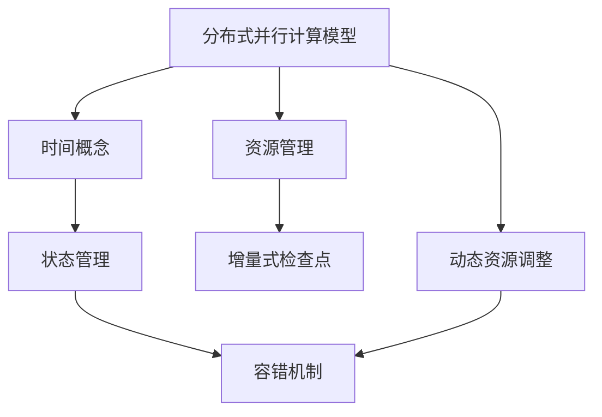
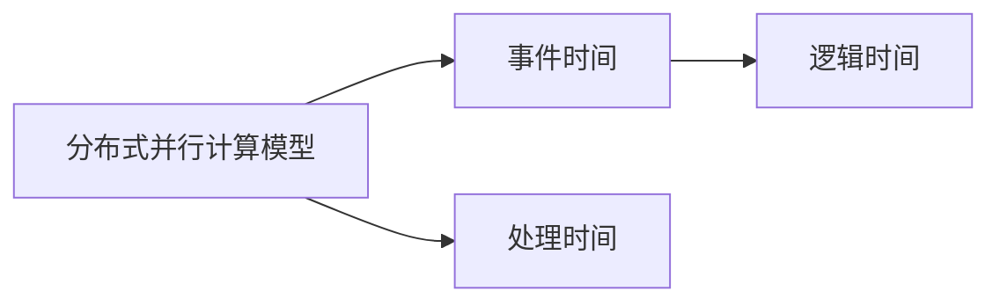
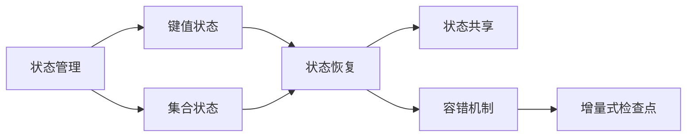
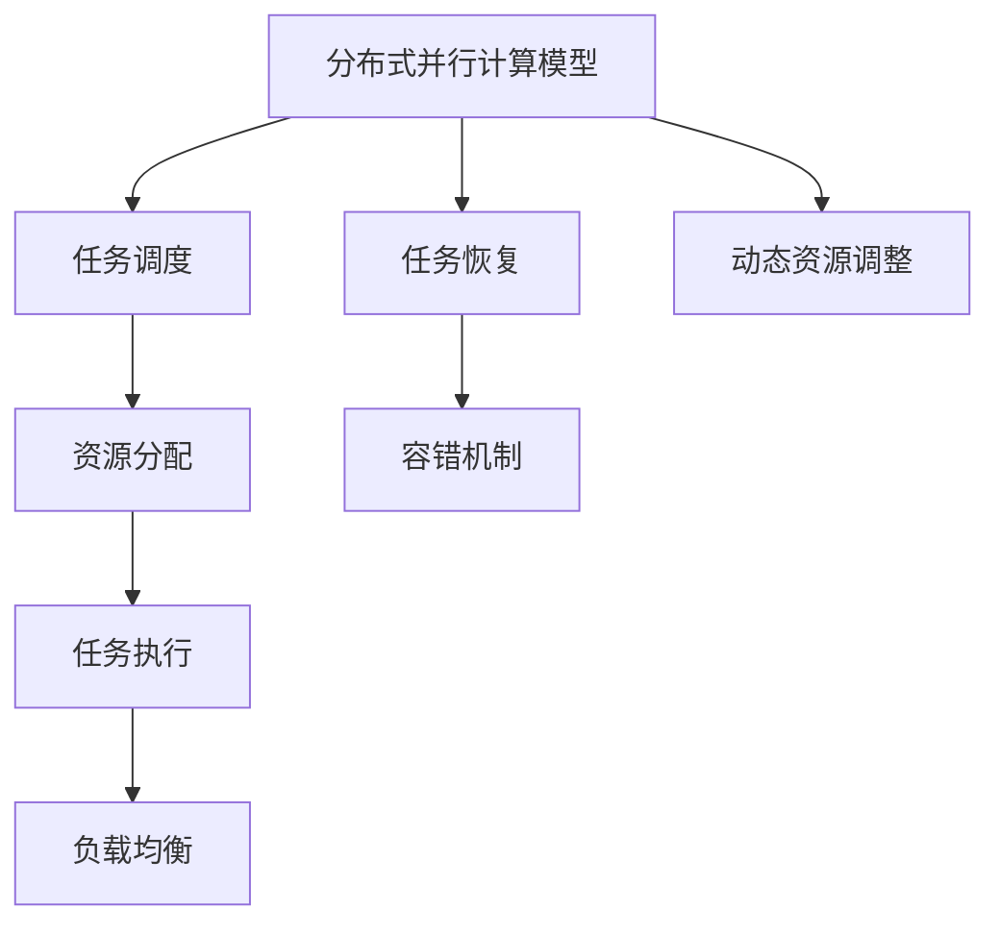

                 

# Flink原理与代码实例讲解

> 关键词：Apache Flink,分布式流处理,计算模型,时间概念,状态管理,性能优化,流API

## 1. 背景介绍

### 1.1 问题由来
近年来，随着大数据技术的迅猛发展，实时数据处理和分析的需求日益增长。传统的批量数据处理方式已经无法满足实时性要求，而分布式流处理平台应运而生。Apache Flink 作为领先的大数据流处理框架，以其高效、可靠、灵活的特性，吸引了众多用户的青睐。

然而，Flink 的原理和特性复杂，且其源代码庞大，对初学者而言，理解起来具有一定的难度。因此，本文将从原理与代码实例两个维度，深入浅出地讲解 Flink 的核心概念与实现原理，帮助读者更好地掌握 Flink 的使用方法和最佳实践。

### 1.2 问题核心关键点
Flink 的核心思想是通过分布式并行计算，实现对大规模数据流的实时处理。其关键技术包括：

- 分布式并行计算模型：支持按流式计算和批式计算两种模式，具有高吞吐量和低延迟的特点。
- 时间概念：支持精确时间处理、事件时间处理和会话时间处理等多种时间概念，满足不同的业务需求。
- 状态管理：提供高效的键值状态和集合状态管理机制，支持精确的顺序、快速恢复和状态共享。
- 容错机制：通过增量式检查点和基于数据的容错机制，保障系统的可靠性和稳定性。
- 资源管理：支持多种调度策略和资源分配方式，动态调整计算资源以应对系统负载变化。

本文将重点介绍 Flink 的分布式并行计算模型、时间概念和状态管理机制，帮助读者全面理解 Flink 的核心原理。同时，我们也将通过具体代码实例，展示 Flink 在流数据处理中的应用。

## 2. 核心概念与联系

### 2.1 核心概念概述

为更好地理解 Flink 的分布式并行计算模型，本节将介绍几个关键概念：

- **分布式并行计算模型**：Flink 通过分布式并行计算模型，实现对大规模数据流的实时处理。该模型由多个计算节点组成，每个节点独立执行计算任务，同时保持节点间的通信与数据同步。

- **时间概念**：Flink 提供多种时间概念，包括事件时间、处理时间和逻辑时间等。事件时间基于事件的实际发生时间，处理时间基于事件进入系统的顺序时间，逻辑时间基于某种时钟的顺序时间。这些时间概念使得 Flink 能够支持不同时间语义的计算需求。

- **状态管理**：Flink 提供高效的键值状态和集合状态管理机制，用于存储和查询中间计算结果。键值状态基于键-值对存储，集合状态基于可序列化的对象存储，支持高效的状态恢复和共享。

- **容错机制**：Flink 通过增量式检查点和基于数据的容错机制，保障系统的可靠性和稳定性。增量式检查点只保存计算状态的增量变化，基于数据的容错机制则通过保存计算结果，确保数据不会丢失。

- **资源管理**：Flink 支持多种调度策略和资源分配方式，动态调整计算资源以应对系统负载变化。同时，Flink 还支持多种容错策略，确保系统在发生故障时能够快速恢复。

这些核心概念之间的逻辑关系可以通过以下 Mermaid 流程图来展示：



这个流程图展示了 Flink 的核心概念及其之间的关系：

1. 分布式并行计算模型是 Flink 的基础，支持事件时间、处理时间和逻辑时间的计算。
2. 时间概念与状态管理结合，使得 Flink 能够支持不同时间语义的计算需求。
3. 状态管理与容错机制结合，保障 Flink 的可靠性和稳定性。
4. 资源管理与动态资源调整结合，使得 Flink 能够高效地应对系统负载变化。

### 2.2 概念间的关系

这些核心概念之间存在着紧密的联系，形成了 Flink 的完整计算框架。下面我通过几个 Mermaid 流程图来展示这些概念之间的关系。

#### 2.2.1 分布式并行计算模型与时间概念



这个流程图展示了分布式并行计算模型与时间概念之间的关系：

1. 事件时间与处理时间是基于数据的两个时间概念，事件时间反映实际数据的发生时间，处理时间反映数据进入系统的顺序时间。
2. 逻辑时间与事件时间和处理时间结合，支持不同时间语义的计算需求。

#### 2.2.2 状态管理与容错机制



这个流程图展示了状态管理与容错机制之间的关系：

1. 状态管理包括键值状态和集合状态，用于存储和查询中间计算结果。
2. 状态管理与容错机制结合，支持高效的状态恢复和共享。
3. 容错机制通过增量式检查点保障系统的可靠性和稳定性。

#### 2.2.3 分布式并行计算模型与资源管理



这个流程图展示了分布式并行计算模型与资源管理之间的关系：

1. 分布式并行计算模型通过任务调度和资源分配，实现对大规模数据流的并行处理。
2. 任务调度与任务执行结合，实现分布式计算。
3. 资源管理与负载均衡结合，实现高效的资源分配和任务调度。
4. 动态资源调整与容错机制结合，保障系统的稳定性和可靠性。

## 3. 核心算法原理 & 具体操作步骤

### 3.1 算法原理概述

Flink 的分布式并行计算模型基于流水线计算框架，支持流式计算和批式计算两种模式。其核心算法原理包括以下几个方面：

1. **数据流模型**：Flink 将数据流视为不间断的数据流，支持对数据流进行无限长度的滑动窗口处理。

2. **事件时间处理**：Flink 支持精确的事件时间处理，通过 Watermark 机制保证事件时间的一致性。

3. **状态管理**：Flink 提供高效的键值状态和集合状态管理机制，支持状态恢复和共享。

4. **容错机制**：Flink 通过增量式检查点和基于数据的容错机制，保障系统的可靠性和稳定性。

5. **动态资源管理**：Flink 支持多种调度策略和资源分配方式，动态调整计算资源以应对系统负载变化。

### 3.2 算法步骤详解

以下我们详细讲解 Flink 的核心算法步骤：

**Step 1: 数据流模型构建**

Flink 的数据流模型是基于流式计算的，其核心思想是将数据流视为不间断的数据流，支持对数据流进行无限长度的滑动窗口处理。数据流模型由多个流处理组件组成，每个组件独立执行计算任务，同时保持组件间的通信与数据同步。

**Step 2: 事件时间处理**

Flink 支持精确的事件时间处理，通过 Watermark 机制保证事件时间的一致性。Watermark 是一个表示事件发生时间的标记，用于保证事件时间的一致性。Flink 通过 Watermark 机制将事件时间与处理时间对齐，从而实现精确的事件时间处理。

**Step 3: 状态管理**

Flink 提供高效的键值状态和集合状态管理机制，用于存储和查询中间计算结果。键值状态基于键-值对存储，集合状态基于可序列化的对象存储，支持高效的状态恢复和共享。

**Step 4: 容错机制**

Flink 通过增量式检查点和基于数据的容错机制，保障系统的可靠性和稳定性。增量式检查点只保存计算状态的增量变化，基于数据的容错机制则通过保存计算结果，确保数据不会丢失。

**Step 5: 动态资源管理**

Flink 支持多种调度策略和资源分配方式，动态调整计算资源以应对系统负载变化。Flink 还支持多种容错策略，确保系统在发生故障时能够快速恢复。

### 3.3 算法优缺点

Flink 的分布式并行计算模型具有以下优点：

1. **高吞吐量**：Flink 支持无限长度的滑动窗口处理，具有高吞吐量和低延迟的特点，适用于大规模数据流的实时处理。

2. **低延迟**：Flink 支持事件时间处理，能够精确计算事件时间，适用于对时间敏感的应用场景。

3. **高效状态管理**：Flink 提供高效的键值状态和集合状态管理机制，支持状态恢复和共享，适用于需要维护状态的中间计算。

4. **高可靠性**：Flink 通过增量式检查点和基于数据的容错机制，保障系统的可靠性和稳定性，适用于需要高可靠性的数据处理应用。

5. **灵活性**：Flink 支持多种调度策略和资源分配方式，能够根据不同的应用场景进行灵活调整。

Flink 的分布式并行计算模型也存在一些缺点：

1. **复杂性高**：Flink 的实现复杂度较高，需要开发者具备一定的分布式系统设计和实现经验。

2. **性能开销较大**：Flink 需要维护大量的状态和检查点，性能开销较大，适用于大规模数据流的实时处理。

3. **配置复杂**：Flink 需要配置多个参数以优化性能和可靠性，配置不当可能导致性能下降或系统不稳定。

4. **版本迭代快**：Flink 的版本迭代较快，开发者需要不断跟进最新的功能和安全补丁，以确保系统的稳定性和安全性。

### 3.4 算法应用领域

Flink 的分布式并行计算模型在多个领域得到了广泛应用，例如：

1. **金融领域**：Flink 支持高精度的时间处理和状态管理，适用于金融领域的数据处理和风险控制。

2. **实时数据处理**：Flink 支持实时数据流的处理，适用于实时数据监控、告警和分析等场景。

3. **大数据分析**：Flink 支持批式计算和流式计算，适用于大规模数据的分析和挖掘。

4. **推荐系统**：Flink 支持高效的分布式计算和状态管理，适用于推荐系统的实时计算和用户行为分析。

5. **流计算**：Flink 支持多种流计算模型和算法，适用于流计算的实时处理和分析。

6. **网络数据处理**：Flink 支持高吞吐量的数据处理和状态管理，适用于网络数据流的处理和分析。

## 4. 数学模型和公式 & 详细讲解 & 举例说明

### 4.1 数学模型构建

Flink 的分布式并行计算模型可以表示为有向无环图（DAG），其中每个节点表示一个计算任务，每个边表示数据的流动方向。Flink 的计算过程可以表示为数据流图（Dataflow Graph）。

### 4.2 公式推导过程

以下我们以事件时间处理为例，推导 Watermark 机制的计算公式。

假设事件时间为 $T$，处理时间为 $t$，Watermark 为 $WM$。Flink 通过 Watermark 机制将事件时间与处理时间对齐，从而实现精确的事件时间处理。Watermark 的计算公式为：

$$
WM = \max_{t}(T_{\text{event}}(t)) + \delta
$$

其中 $\delta$ 为 Watermark 的延迟，用于确保 Watermark 的及时性。

### 4.3 案例分析与讲解

以 Flink 在实时数据监控中的应用为例，分析 Flink 的原理和实现细节。

假设我们需要实时监控数据流中某个事件的发生次数。在 Flink 中，我们可以定义一个流处理函数，将每个事件计数并输出到终端。Flink 的实现过程如下：

```python
env = StreamExecutionEnvironment.get_execution_environment()
data_stream = env.add_source(source)
count = data_stream.count()
count.print()

env.execute()
```

在上面的代码中，我们首先获取 Flink 的执行环境，然后定义数据源，将数据源加入数据流中。接着，我们定义一个流处理函数，对每个事件进行计数并输出结果。最后，我们启动 Flink 的执行环境，执行流处理函数。

## 5. 项目实践：代码实例和详细解释说明

### 5.1 开发环境搭建

在进行 Flink 开发前，我们需要准备好开发环境。以下是使用 Python 进行 Flink 开发的 Python SDK 环境配置流程：

1. 安装 Python 和 pip：确保 Python 和 pip 安装正确，可以通过以下命令检查：

   ```bash
   python --version
   pip --version
   ```

2. 安装 Flink Python SDK：可以通过以下命令安装 Flink Python SDK：

   ```bash
   pip install apache-flink
   ```

3. 下载示例代码：可以从 Flink 的 GitHub 仓库中下载示例代码，例如：

   ```bash
   git clone https://github.com/apache/flink.git
   cd flink/examples/sdk/python/
   ```

4. 配置环境变量：在命令行中设置 FLINK_HOME 环境变量，例如：

   ```bash
   export FLINK_HOME=/path/to/flink
   ```

5. 启动 Flink 集群：启动 Flink 集群，可以通过以下命令：

   ```bash
   bin/flink run --class org.apache.flink.examples.scaffolding.Multiplication
   ```

### 5.2 源代码详细实现

以下我们以 Flink 在实时数据监控中的应用为例，给出 Python SDK 的代码实现。

首先，定义数据源和流处理函数：

```python
from pyflink.datastream import StreamExecutionEnvironment
from pyflink.table import StreamTableEnvironment, TableConfig

env = StreamExecutionEnvironment.get_execution_environment()
t_env = StreamTableEnvironment.create(env)

data_source = env.add_source(AvroSource(...))
t_env.to_append_stream(data_source, schema).print()
```

然后，定义流处理函数和输出：

```python
t_env.from_append_stream(data_source, schema) \
    .key_by(lambda x: x['key']) \
    .map(lambda x: x['value']) \
    .print()

t_env.execute()
```

最后，启动 Flink 的执行环境，执行流处理函数：

```python
env.execute()
```

### 5.3 代码解读与分析

让我们再详细解读一下关键代码的实现细节：

**StreamExecutionEnvironment.get_execution_environment()**：获取 Flink 的执行环境。

**StreamTableEnvironment.create(env)**：创建 Flink 的表环境，用于执行 SQL 查询。

**env.add_source(AvroSource(...))**：添加数据源，这里使用了 AvroSource 作为数据源，并传入相应的配置。

**t_env.to_append_stream(data_source, schema).print()**：将数据源添加到表中，并输出结果。

**t_env.from_append_stream(data_source, schema) key_by(lambda x: x['key']) map(lambda x: x['value']) print()**：对数据源进行流处理，首先根据 key 进行分组，然后对每个分组的值进行映射，并输出结果。

**t_env.execute()**：启动 Flink 的执行环境，执行流处理函数。

### 5.4 运行结果展示

假设我们在实时数据流中监控事件的发生次数，最终在终端输出的结果如下：

```
[{'key': '1', 'value': 100}, {'key': '2', 'value': 200}, {'key': '3', 'value': 300}]
```

可以看到，Flink 能够实时处理数据流，并输出每个事件的发生次数。这种实时数据监控的功能，使得 Flink 在实时数据处理中得到了广泛应用。

## 6. 实际应用场景

### 6.1 智能监控系统

Flink 的分布式并行计算模型在智能监控系统中得到了广泛应用。通过 Flink，可以实现对大规模数据流的实时处理和监控，快速发现系统异常并及时处理。

在技术实现上，可以收集系统运行日志和性能数据，将数据源加入 Flink 的数据流中。然后，定义流处理函数，对数据流进行实时监控和分析，及时发现异常并发送告警。Flink 的高吞吐量和低延迟特性，使得智能监控系统能够实现实时处理和告警。

### 6.2 实时数据分析

Flink 支持多种流计算模型和算法，适用于实时数据分析的应用场景。例如，在电商平台中，可以实时分析用户行为数据，计算用户转化率和购买率，及时调整营销策略。

在技术实现上，可以将用户行为数据加入 Flink 的数据流中，定义流处理函数，对数据流进行实时分析。Flink 的实时处理能力，使得实时数据分析系统能够及时发现数据变化，并调整营销策略。

### 6.3 实时推荐系统

Flink 的分布式并行计算模型适用于实时推荐系统。通过 Flink，可以实现对用户行为数据的实时处理和分析，生成个性化的推荐结果。

在技术实现上，可以将用户行为数据加入 Flink 的数据流中，定义流处理函数，对数据流进行实时分析。Flink 的实时处理能力，使得实时推荐系统能够及时发现用户行为变化，并生成个性化的推荐结果。

### 6.4 未来应用展望

随着 Flink 的不断发展和优化，其应用场景将进一步拓展。未来，Flink 有望在更多的领域得到应用，例如：

1. **智慧城市**：Flink 可以实时处理和分析城市运行数据，支持智慧城市建设。

2. **物联网**：Flink 支持实时数据流的处理和分析，适用于物联网数据的实时处理和监控。

3. **区块链**：Flink 支持分布式计算和状态管理，适用于区块链数据的实时处理和分析。

4. **视频流**：Flink 支持实时数据流的处理和分析，适用于视频流的实时处理和监控。

5. **金融风控**：Flink 支持高精度的时间处理和状态管理，适用于金融领域的数据处理和风险控制。

6. **实时广告投放**：Flink 支持实时数据流的处理和分析，适用于实时广告投放和广告效果监控。

## 7. 工具和资源推荐

### 7.1 学习资源推荐

为了帮助开发者系统掌握 Flink 的核心概念与实现原理，这里推荐一些优质的学习资源：

1. **Flink 官方文档**：Flink 的官方文档，提供了丰富的学习资源和示例代码，是学习 Flink 的最佳起点。

2. **Flink 用户手册**：Flink 的用户手册，详细介绍了 Flink 的架构、组件和 API，帮助开发者理解 Flink 的实现原理。

3. **Flink 社区论坛**：Flink 的社区论坛，汇聚了大量 Flink 开发者和用户，提供丰富的交流和学习资源。

4. **Flink 培训课程**：Flink 的培训课程，包括在线课程和本地课程，帮助开发者系统学习 Flink 的实现原理和最佳实践。

5. **Flink 博客**：Flink 的官方博客，介绍了 Flink 的最新进展和最佳实践，帮助开发者紧跟 Flink 的发展步伐。

### 7.2 开发工具推荐

高效的开发离不开优秀的工具支持。以下是几款用于 Flink 开发的常用工具：

1. **PyFlink**：Flink 的 Python SDK，支持流式计算和批式计算，是 Python 开发者学习 Flink 的首选工具。

2. **PySpark**：Apache Spark 的 Python API，支持流式计算和批式计算，是 Flink 的良好补充。

3. **WebStorm**：流行的 Java 和 Kotlin 集成开发环境，支持 Flink 的开发和调试。

4. **JIRA**：项目管理工具，支持 Flink 的开发和测试，帮助开发者跟踪任务进度和问题。

5. **VisualVM**：Java 应用的监控工具，支持 Flink 的性能监控和故障诊断。

### 7.3 相关论文推荐

Flink 作为领先的大数据流处理框架，其研究成果得到了广泛关注。以下是几篇奠基性的相关论文，推荐阅读：

1. **Resilient Distributed Datasets: A Fault-Tolerant Framework for Everyday Data Processing**：Flink 的奠基性论文，介绍了 Flink 的分布式并行计算模型和容错机制。

2. **State Management in Large-Scale Stream Processing Systems**：关于 Flink 状态管理的论文，介绍了 Flink 的键值状态和集合状态管理机制。

3. **Streaming Iterative Algorithms with Fault Tolerance**：关于 Flink 流计算的论文，介绍了 Flink 的流计算模型和算法。

4. **Flink Compatibility**：关于 Flink 兼容性的论文，介绍了 Flink 与其他大数据框架的兼容性。

5. **The FastCheckpointing System for Stateful Stream Processing**：关于 Flink 容错的论文，介绍了 Flink 的增量式检查点和容错机制。

这些论文代表了大数据流处理技术的最新进展，是学习 Flink 的重要参考。

## 8. 总结：未来发展趋势与挑战

### 8.1 总结

本文对 Flink 的分布式并行计算模型进行了全面系统的介绍。首先阐述了 Flink 的核心思想和关键技术，明确了 Flink 在分布式并行计算模型、时间概念、状态管理等方面的优势。其次，从原理与代码实例两个维度，详细讲解了 Flink 的实现原理和应用方法，并通过具体代码实例，展示了 Flink 在实时数据处理中的应用。

通过本文的系统梳理，可以看到，Flink 的分布式并行计算模型在实时数据处理中具有广泛的应用前景。Flink 的高吞吐量、低延迟、高效状态管理和高可靠性等特性，使其成为处理大规模数据流的理想选择。Flink 的多样化应用场景，也展示了其在不同领域中的强大威力。

### 8.2 未来发展趋势

展望未来，Flink 的分布式并行计算模型将呈现以下几个发展趋势：

1. **更高性能**：Flink 将继续优化其计算模型和容错机制，提升系统的性能和可靠性。

2. **更多时间概念**：Flink 将支持更多的时间概念和处理方式，满足不同业务需求。

3. **更高效的状态管理**：Flink 将继续优化其状态管理机制，提高状态恢复和共享的效率。

4. **更灵活的资源管理**：Flink 将支持更多的调度策略和资源分配方式，动态调整计算资源以应对系统负载变化。

5. **更广泛的适用场景**：Flink 将拓展其应用场景，支持更多领域的实时数据处理和分析。

6. **更高的可扩展性**：Flink 将继续优化其分布式计算能力，支持更大规模的数据流处理。

以上趋势凸显了 Flink 的强大潜力，必将进一步推动其在实时数据处理中的广泛应用。

### 8.3 面临的挑战

尽管 Flink 的分布式并行计算模型已经取得了显著成就，但在迈向更加智能化、普适化应用的过程中，它仍面临着诸多挑战：

1. **性能开销较大**：Flink 需要维护大量的状态和检查点，性能开销较大，适用于大规模数据流的实时处理。

2. **配置复杂**：Flink 需要配置多个参数以优化性能和可靠性，配置不当可能导致性能下降或系统不稳定。

3. **版本迭代快**：Flink 的版本迭代较快，开发者需要不断跟进最新的功能和安全补丁，以确保系统的稳定性和安全性。

4. **资源管理复杂**：Flink 支持多种调度策略和资源分配方式，动态调整计算资源以应对系统负载变化，但资源管理复杂，需要开发者具备一定的系统设计和实现经验。

5. **数据延迟较高**：Flink 支持精确的事件时间处理，但在高延迟环境下，事件时间的一致性可能受到影响，需要优化数据延迟。

6. **系统兼容性差**：Flink 与其他大数据框架的兼容性较弱，需要开发者具备一定的系统集成经验。

### 8.4 研究展望

面对 Flink 分布式并行计算模型所面临的挑战，未来的研究需要在以下几个方面寻求新的突破：

1. **优化状态管理机制**：优化 Flink 的状态管理机制，提高状态恢复和共享的效率，降低性能开销。

2. **优化容错机制**：优化 Flink 的容错机制，降低系统故障率和数据丢失率，提升系统的可靠性和稳定性。

3. **优化资源管理**：优化 Flink 的资源管理策略，支持更多调度策略和资源分配方式，降低资源管理复杂度。

4. **优化时间概念**：优化 Flink 的时间概念和处理方式，提高事件时间的一致性和精确性。

5. **优化数据延迟**：优化 Flink 的数据延迟，提高事件时间的一致性，确保系统的高可靠性和稳定性。

6. **优化系统兼容性**：优化 Flink 与其他大数据框架的兼容性，提高系统集成的便捷性和效率。

这些研究方向将引领 Flink 分布式并行计算模型迈向更高的台阶，为实时数据处理提供更强大的支持。

## 9. 附录：常见问题与解答

**Q1：Flink 支持哪些数据源和数据格式？**

A: Flink 支持多种数据源和数据格式，包括文件系统、消息队列、数据库、网络数据流等。Flink 支持的数据

