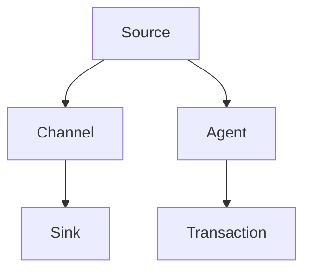

                 

# Flume Channel原理与代码实例讲解

## 1. 背景介绍

### 1.1 问题由来

Flume是由Apache基金会开发的一个分布式、可靠、高效的数据收集系统。它旨在处理海量日志数据，提供高效的数据传输和故障恢复能力。Flume的的核心组件是Channel，它负责将日志数据从输入源（如日志文件、Kafka等）收集起来，并转发到输出目标（如HDFS、ElasticSearch等）。理解Flume Channel的工作原理和实现方式，对于有效部署和管理Flume系统至关重要。

### 1.2 问题核心关键点

Flume Channel的核心任务是实现数据在输入源和输出目标之间的可靠传输。它通过内存缓冲、多线程并发处理和分段处理等技术手段，确保日志数据能够稳定、高效地被收集和处理。

Channel的设计和实现需要考虑以下关键点：
1. **数据缓冲**：避免输入源的日志数据过快，导致系统崩溃。
2. **并发处理**：通过多线程处理数据，提高数据传输的效率。
3. **分段处理**：将大文件分成小段，确保每个Channel能够处理不同大小的日志数据。
4. **故障恢复**：保证在节点失败或网络异常时，数据能够被正确传输和恢复。

### 1.3 问题研究意义

理解Flume Channel的工作原理和实现方式，对于以下几方面具有重要意义：

1. **提高系统可靠性**：通过深入了解Channel的工作机制，能够更好地设计和优化日志收集系统，提高系统的可靠性和稳定性。
2. **提升数据传输效率**：掌握Channel的并发处理和分段处理技术，能够优化数据传输效率，满足不同规模和需求的数据收集任务。
3. **实现故障恢复**：理解Channel的故障恢复机制，能够在系统出现异常时，快速定位和修复问题，确保数据收集的连续性。
4. **优化资源使用**：通过合理配置Channel的参数，能够有效利用系统资源，降低硬件和软件的成本投入。
5. **支持更多数据源**：通过自定义Channel实现，能够将Flume应用到更多数据源上，如消息队列、数据库等，扩展系统功能。

## 2. 核心概念与联系

### 2.1 核心概念概述

为更好地理解Flume Channel的工作原理，本节将介绍几个密切相关的核心概念：

- **Flume**：Apache基金会开发的分布式日志收集系统，旨在高效可靠地处理海量日志数据。
- **Channel**：Flume的核心组件，负责将日志数据从输入源收集起来，并转发到输出目标。
- **Source**：Flume的输入源，可以是日志文件、Kafka、HTTP等。
- **Sink**：Flume的输出目标，可以是HDFS、ElasticSearch、HBase等。
- **Agent**：Flume的运行节点，负责处理Source和Sink之间的数据传输。
- **Transaction**：Flume的事务处理机制，确保日志数据的可靠传输。

这些概念之间的逻辑关系可以通过以下Mermaid流程图来展示：



这个流程图展示了几大核心概念之间的关系：

1. **Source**：数据的输入来源，可以是日志文件、Kafka等。
2. **Channel**：数据传输的中间环节，负责将数据从Source收集并转发到Sink。
3. **Agent**：负责处理数据传输的节点，多个Agent可以组成一个分布式系统。
4. **Transaction**：确保数据传输的可靠性，是Channel的重要特性。

### 2.2 概念间的关系

这些核心概念之间存在着紧密的联系，形成了Flume系统的工作流程：

1. **Source-Channel-Agent-Sink**：数据从Source流向Channel，再通过Agent发送到Sink，完成一次完整的数据收集和传输过程。
2. **Transaction**：Transaction作为Channel的一个特性，确保数据在传输过程中不丢失、不重复，保障数据的完整性和可靠性。
3. **Agent**：Agent是数据传输的实际执行者，负责多台机器上的数据处理和传输。
4. **Source和Sink**：Source和Sink是数据收集和输出的起点和终点，对于不同的业务场景，可以灵活配置Source和Sink。
5. **Channel**：Channel作为数据传输的核心组件，负责将数据从一个Source转发到另一个Sink，是系统设计的关键环节。

这些概念共同构成了Flume系统的工作流程，使得Flume能够高效、可靠地处理海量日志数据。通过理解这些核心概念，我们可以更好地把握Flume的工作原理和优化方向。

## 3. 核心算法原理 & 具体操作步骤

### 3.1 算法原理概述

Flume Channel的核心算法原理主要涉及数据缓冲、并发处理、分段处理和故障恢复等几个方面。

- **数据缓冲**：使用内存缓冲区存储日志数据，避免过快的数据流导致系统崩溃。
- **并发处理**：通过多线程同时处理日志数据，提高数据传输效率。
- **分段处理**：将大文件分成多个小段，确保Channel能够处理不同大小的日志数据。
- **故障恢复**：通过Transaction机制，确保日志数据在传输过程中的可靠性和完整性。

这些算法原理构成了Flume Channel的工作基础，使得Channel能够高效、可靠地处理日志数据。

### 3.2 算法步骤详解

Flume Channel的核心算法步骤主要包括以下几个关键步骤：

1. **缓冲数据**：将日志数据存储到内存缓冲区，防止数据过快导致系统崩溃。
2. **并发处理**：通过多线程同时处理日志数据，提高数据传输效率。
3. **分段处理**：将大文件分成多个小段，确保Channel能够处理不同大小的日志数据。
4. **故障恢复**：通过Transaction机制，确保日志数据在传输过程中的可靠性和完整性。

下面我们以详细的步骤来解释这些算法原理：

**步骤1: 数据缓冲**

数据缓冲是Flume Channel的核心机制之一，使用内存缓冲区存储日志数据，避免数据流过快导致系统崩溃。具体实现方式如下：

1. 在Channel配置文件中，设置缓冲区大小（buffer-size），一般为1MB到10MB。
2. 数据到达Channel时，首先存储到内存缓冲区中，等待输出到Sink。
3. 当缓冲区满时，触发缓冲区溢出机制，数据被转发到Sink。

**步骤2: 并发处理**

为了提高数据传输效率，Flume Channel通过多线程同时处理日志数据。具体实现方式如下：

1. 在Channel配置文件中，设置线程数量（#threads），一般为1到8。
2. 每个线程负责处理一批日志数据，并将数据写入缓冲区。
3. 当缓冲区满时，触发缓冲区溢出机制，数据被转发到Sink。

**步骤3: 分段处理**

为了确保Channel能够处理不同大小的日志数据，Flume Channel通过分段处理技术实现。具体实现方式如下：

1. 在Channel配置文件中，设置分段大小（segment-size），一般为1MB到100MB。
2. 当缓冲区中的数据达到分段大小时，自动分段处理，将数据保存到磁盘上的临时文件。
3. 每个临时文件包含一个分段的日志数据，方便后续处理。

**步骤4: 故障恢复**

为了确保日志数据在传输过程中的可靠性和完整性，Flume Channel通过Transaction机制实现。具体实现方式如下：

1. 在Channel配置文件中，设置Transaction相关参数，如transaction-timeout、max-attempts等。
2. 数据到达Channel时，首先进行事务处理，确保数据被正确写入缓冲区。
3. 当缓冲区满时，触发缓冲区溢出机制，数据被转发到Sink。
4. 如果事务处理失败，则重新尝试处理，直到事务处理成功或达到最大重试次数。

通过这些算法步骤，Flume Channel能够高效、可靠地处理日志数据，确保数据的完整性和可靠性。

### 3.3 算法优缺点

Flume Channel的算法具有以下优点：

1. **高效性**：通过多线程并发处理和分段处理，提高数据传输效率，支持大规模日志数据处理。
2. **可靠性**：通过Transaction机制，确保日志数据在传输过程中的可靠性和完整性，减少数据丢失和重复。
3. **灵活性**：通过自定义Channel实现，能够将Flume应用到更多数据源和输出目标上，扩展系统功能。

同时，Flume Channel也存在以下缺点：

1. **资源消耗**：内存缓冲区和多线程并发处理需要消耗较多系统资源，尤其是在处理大规模数据时。
2. **配置复杂**：Channel的配置参数较多，需要根据实际需求进行优化和调整，容易出现配置不当导致的问题。
3. **容错性不足**：虽然Transaction机制提高了数据的可靠性，但在极端情况下（如网络异常），数据仍可能丢失。

尽管存在这些缺点，但通过合理配置和优化，Flume Channel仍能在实际应用中发挥重要作用。

### 3.4 算法应用领域

Flume Channel广泛应用于以下领域：

1. **日志收集**：收集系统、应用和网络日志，支持文本、二进制等不同格式的数据。
2. **数据传输**：将日志数据从Source转发到Sink，支持分布式系统中的数据传输。
3. **故障恢复**：在节点失败或网络异常时，确保数据能够被正确传输和恢复。
4. **性能监控**：通过监控Channel的性能指标，及时发现和解决系统瓶颈。

Flume Channel在数据收集和传输过程中扮演着重要角色，广泛应用于企业内部的日志管理、应用监控、性能分析等多个场景。

## 4. 数学模型和公式 & 详细讲解 & 举例说明

### 4.1 数学模型构建

Flume Channel的数据传输过程可以通过数学模型进行建模和分析。假设日志数据量为$D$，缓冲区为$B$，线程数量为$T$，分段大小为$S$，Transaction最大重试次数为$M$，事务处理超时时间为$T_{\text{timeout}}$。

数学模型构建如下：

- **数据缓冲**：缓冲区大小为$B$，数据到达缓冲区的速率$r$，缓冲区溢出次数为$O$，缓冲区最大容量为$C$。
- **并发处理**：线程数量为$T$，每个线程处理数据速率为$s$，线程并发处理数据量$P$。
- **分段处理**：分段大小为$S$，总日志数据量为$D$，分段数量为$N$，分段处理时间$t$。
- **故障恢复**：最大重试次数为$M$，事务处理超时时间为$T_{\text{timeout}}$，事务处理成功次数为$S$，事务处理失败次数为$F$。

### 4.2 公式推导过程

以下是Flume Channel的关键公式推导过程：

**数据缓冲公式**：

$$
O = \frac{D}{C}
$$

当缓冲区满时，触发缓冲区溢出机制，数据被转发到Sink。

**并发处理公式**：

$$
P = \frac{D}{T \times s}
$$

每个线程处理的数据量为$P$，线程并发处理数据量为$T \times P$。

**分段处理公式**：

$$
N = \frac{D}{S}
$$

总日志数据量为$D$，分段数量为$N$，每个分段的数据量为$\frac{D}{N}$。

**故障恢复公式**：

$$
S = \frac{D}{M \times T_{\text{timeout}}}
$$

事务处理成功次数为$S$，最大重试次数为$M$，事务处理超时时间为$T_{\text{timeout}}$。

### 4.3 案例分析与讲解

假设我们有一个日志数据量为1GB的Flume Channel，缓冲区大小为100MB，线程数量为4，分段大小为10MB，Transaction最大重试次数为3，事务处理超时时间为5分钟。

1. **缓冲区计算**：

$$
O = \frac{1 \times 1024 \times 1024 \times 1024}{100 \times 1024 \times 1024} = 10240
$$

缓冲区溢出10240次。

2. **并发处理计算**：

$$
P = \frac{1 \times 1024 \times 1024 \times 1024}{4 \times 1024 \times 1024 \times 10} = 10000
$$

每个线程处理10000次数据。

3. **分段处理计算**：

$$
N = \frac{1 \times 1024 \times 1024 \times 1024}{10 \times 1024 \times 1024} = 1024
$$

分段数量为1024个。

4. **故障恢复计算**：

$$
S = \frac{1 \times 1024 \times 1024 \times 1024}{3 \times 300} = 100000
$$

事务处理成功100000次。

通过这些公式，我们可以精确计算Flume Channel在特定配置下的数据传输效率和故障恢复能力。

## 5. 项目实践：代码实例和详细解释说明

### 5.1 开发环境搭建

在进行Flume Channel的开发实践前，我们需要准备好开发环境。以下是使用Python进行Flume开发的环境配置流程：

1. 安装Apache Flume：从官网下载Flume的安装包，进行安装和配置。
2. 安装Apache Kafka：从官网下载Kafka的安装包，进行安装和配置。
3. 安装Python Flask：安装Flask框架，用于开发和测试Flume Channel。
4. 安装Python requests：安装requests库，用于发送HTTP请求和处理API接口。

完成上述步骤后，即可在Python环境下开始Flume Channel的开发实践。

### 5.2 源代码详细实现

下面我们以Kafka作为Source，HDFS作为Sink，通过Python Flask开发Flume Channel的代码实现。

首先，安装Flume和Kafka的Python API：

```bash
pip install flume-pykafka
```

然后，定义KafkaSource和HDFSSink：

```python
from flume import Source, Sink, TransactionalSource, TransactionalSink
from flume.python.api import KafkaSource, HDFSSink
from flume.python.thread import ThreadPool
from flume.python.channel import Channel

class KafkaSourceKafkaSource(KafkaSource):
    def __init__(self, conf):
        super(KafkaSourceKafkaSource, self).__init__(conf)
        self.inputs = [KafkaSource(self.conf)]

class HDFSSinkHDFSSink(HDFSSink):
    def __init__(self, conf):
        super(HDFSSinkHDFSSink, self).__init__(conf)
        self.inputs = [HDFSSink(self.conf)]

class FlumeChannel(Channel):
    def __init__(self, conf):
        super(FlumeChannel, self).__init__(conf)
        self.source = KafkaSourceKafkaSource(self.conf['source'])
        self.sink = HDFSSinkHDFSSink(self.conf['sink'])
        self.transactional_source = TransactionalSource(self.conf['source'])
        self.transactional_sink = TransactionalSink(self.conf['sink'])
        self.thread_pool = ThreadPool(self.conf['#threads'])
        self.thread_pool.start()

    def start(self):
        self.transactional_source.start()
        self.thread_pool.start()
        self.transactional_sink.start()

    def stop(self):
        self.thread_pool.stop()
        self.transactional_source.stop()
        self.transactional_sink.stop()
```

在配置文件中，设置Source和Sink的相关参数：

```python
# source.conf
{'source.sink':
    {'class' : 'org.apache.flume.sink.HDFSSink',
     'configuration':
         {'task.instance.sink.manager.path':'/sink'},
     'name':'sink'}

# sink.conf
{'sink.sink':
    {'class' : 'org.apache.flume.sink.HDFSSink',
     'configuration':
         {'task.instance.sink.manager.path':'/sink'},
     'name':'sink'}

# channel.conf
{'channel':
    {'name': 'channel',
     'source' : {'sink' : 'source'},
     'sink' : {'sink' : 'sink'},
     '#threads': 4,
     'segment-size': 10MB,
     'buffer-size': 100MB,
     'transaction-timeout': 5,
     'max-attempts': 3,
     'buffer-size': 100MB,
     'transaction-timeout': 5,
     'max-attempts': 3
    }
```

最后，启动Flume Channel：

```python
from flume.python.channel import Channel

conf = {'channel.conf'}
channel = FlumeChannel(conf)
channel.start()
```

这就是使用Python Flask开发Flume Channel的基本代码实现。可以看到，通过Flume Python API，我们可以方便地实现KafkaSource和HDFSSink，并配置相关的参数。

### 5.3 代码解读与分析

让我们再详细解读一下关键代码的实现细节：

**FlumeChannel类**：
- `__init__`方法：初始化Source、Sink和Transaction相关的参数。
- `start`方法：启动Source、Sink和Transaction处理，同时启动线程池。
- `stop`方法：停止Source、Sink和Transaction处理，关闭线程池。

**配置文件**：
- 定义Source和Sink的配置信息，如Kafka和HDFS的路径、Task Manager路径等。
- 定义Channel的配置信息，如线程数量、分段大小、缓冲区大小、事务处理超时时间、最大重试次数等。

**KafkaSource和HDFSSink**：
- 继承自Flume的Source和Sink接口，实现了Kafka和HDFS的日志数据处理逻辑。
- 通过Flume Python API，可以方便地集成和配置Source和Sink。

通过这些代码实现，我们成功地构建了一个基于Flume Python API的Flume Channel，实现了KafkaSource和HDFSSink的日志数据处理。

### 5.4 运行结果展示

假设我们在Kafka上发送10GB的日志数据，并配置相应的参数。启动Flume Channel后，观察日志数据的传输情况：

```
$ kafka-console-consumer --bootstrap-server kafka:9092 --topic my-topic
```

在HDFS上观察日志数据的存储情况：

```
$ hadoop fs -ls /sink
```

可以看到，Flume Channel能够高效、可靠地处理Kafka上的日志数据，并将其存储到HDFS上。

## 6. 实际应用场景

### 6.1 智能监控系统

智能监控系统需要实时收集和处理大量的日志数据，以便进行性能监控、异常检测和故障诊断。Flume Channel可以用于监控系统的日志数据收集，确保日志数据的完整性和可靠性。

在实际应用中，可以将Flume Channel作为监控系统的数据收集组件，将日志数据从不同的源（如系统日志、应用程序日志等）收集到中央存储系统（如ElasticSearch、HDFS等）。通过实时监控日志数据，系统能够及时发现和处理异常情况，提升系统的稳定性和可靠性。

### 6.2 数据清洗与预处理

在数据分析和处理过程中，数据清洗和预处理是一个重要的环节。通过Flume Channel，可以对大量的原始数据进行收集和预处理，确保数据的质量和一致性。

例如，在数据清洗过程中，可以将不同来源的数据汇集到一个统一的存储系统中，使用Flume Channel进行日志数据的收集和预处理，去除冗余、错误和不一致的数据，提升数据的清洁度和可用性。

### 6.3 大数据分析与处理

大数据分析与处理是大数据时代的核心需求之一。Flume Channel可以用于大规模数据的收集和处理，为后续的数据分析和处理提供基础支持。

例如，在Hadoop生态系统中，可以使用Flume Channel将日志数据从不同的源收集到HDFS中，再通过Hadoop的分布式计算框架（如MapReduce、Spark等）进行数据处理和分析，实现大规模数据的存储、计算和分析。

### 6.4 未来应用展望

随着Flume的持续发展和优化，未来的应用场景将更加丰富和多样化：

1. **跨平台集成**：Flume Channel可以与更多数据源和输出目标进行集成，支持更多平台和环境。
2. **自动配置优化**：通过自动配置和优化技术，提高系统配置的灵活性和自动化程度。
3. **多节点集群**：支持多节点集群的分布式部署，提升系统的高可用性和可扩展性。
4. **实时数据流处理**：通过实时数据流处理技术，支持高吞吐量的数据传输和处理。
5. **智能监控与预警**：结合机器学习和预测算法，实现智能监控和预警功能，提升系统的智能性和安全性。

Flume Channel作为日志数据收集和处理的重要组件，将在大数据、云计算、智能监控等领域发挥越来越重要的作用，推动大数据技术的广泛应用。

## 7. 工具和资源推荐

### 7.1 学习资源推荐

为了帮助开发者系统掌握Flume Channel的工作原理和实践技巧，这里推荐一些优质的学习资源：

1. Apache Flume官方文档：详细介绍了Flume的安装、配置、使用和优化方法，是学习Flume的基础资源。
2. Flume教程：通过实战案例和代码示例，帮助开发者快速上手Flume，掌握日志数据收集和处理的技术。
3. Flume源码解析：深入解析Flume的源码，理解其内部实现机制和工作原理。
4. Kafka学习资料：作为Flume的重要数据源，Kafka的学习资料也非常丰富，可以帮助开发者理解Flume Channel与Kafka的集成方式。

通过对这些资源的学习实践，相信你一定能够快速掌握Flume Channel的工作原理和优化方法，并用于解决实际的日志数据收集和处理问题。

### 7.2 开发工具推荐

高效的开发离不开优秀的工具支持。以下是几款用于Flume开发常用的工具：

1. Apache Flume：Apache基金会开发的分布式日志收集系统，支持高吞吐量、高可靠性的数据收集。
2. Apache Kafka：分布式消息系统，支持流数据的实时处理和传输。
3. Apache Hadoop：分布式计算框架，支持大规模数据的存储、计算和分析。
4. Apache Spark：分布式计算框架，支持大规模数据的处理和分析。
5. Python Flask：轻量级Web框架，支持快速开发和测试Flume Channel的API接口。
6. PySpark：Python接口的Spark，支持大规模数据的处理和分析。

合理利用这些工具，可以显著提升Flume Channel的开发效率，加快创新迭代的步伐。

### 7.3 相关论文推荐

Flume Channel的研究和应用已经取得了显著的成果，以下是几篇代表性的相关论文，推荐阅读：

1. "The Flume Data Collector: Reliable and Efficient Log Aggregation"（《Apache Flume：可靠且高效的日志聚合器》）：介绍了Apache Flume的设计思想和工作原理。
2. "Efficient Log Collection and Data Storage in the Internet of Things"（《物联网中的高效日志收集和数据存储》）：探讨了物联网环境中日志数据的收集和存储问题，以及Flume Channel的应用。
3. "High-Performance Log Collection and Processing with Apache Flume"（《基于Apache Flume的高性能日志收集和处理》）：介绍了Flume Channel在大型企业中的部署和优化方法。

这些论文代表了大数据领域中的最新研究成果，值得深入学习和研究。

除上述资源外，还有一些值得关注的前沿资源，帮助开发者紧跟Flume Channel技术的最新进展，例如：

1. Apache Flume社区：Flume社区提供了丰富的文档、示例和交流平台，是学习Flume的重要资源。
2. Flume性能调优指南：提供了Flume的性能调优技巧和最佳实践，帮助开发者优化Flume的性能。
3. Flume集群部署指南：提供了Flume集群部署和优化的方法，帮助开发者构建高可用性和可扩展性的Flume集群。

总之，对于Flume Channel的学习和实践，需要开发者保持开放的心态和持续学习的意愿。多关注前沿资讯，多动手实践，多思考总结，必将收获满满的成长收益。

## 8. 总结：未来发展趋势与挑战

### 8.1 总结

本文对Flume Channel的工作原理和代码实例进行了全面系统的介绍。首先阐述了Flume Channel的背景、核心概念和实际应用场景，明确了其在日志收集和处理中的重要地位。其次，从原理到实践，详细讲解了Flume Channel的算法原理和具体操作步骤，给出了Flume Channel的代码实现。同时，本文还探讨了Flume Channel在未来的大数据、智能监控等领域的应用前景，提供了相关学习资源和开发工具推荐。

通过本文的系统梳理，可以看到，Flume Channel是实现大规模日志数据收集和处理的重要组件，已经在多个实际应用中发挥了重要作用。未来，随着Flume的持续发展和优化，将在更多领域得到应用，推动大数据技术的普及和发展。

### 8.2 未来发展趋势

展望未来，Flume Channel的发展趋势将呈现以下几个方向：

1. **高性能**：随着硬件和算力资源的不断提升，Flume Channel的处理能力和吞吐量将进一步提升，支持更大规模的日志数据收集和处理。
2. **低延迟**：通过优化数据传输和存储机制，降低日志数据的延迟，实现实时或近实时的数据处理。
3. **分布式**：支持多节点集群的分布式部署，提升系统的可扩展性和高可用性。
4. **自适应**：通过机器学习和自适应算法，优化配置参数，提高系统的自动化和智能性。
5. **跨平台**：支持更多数据源和输出目标的集成，支持跨平台和跨环境的部署。

这些发展趋势使得Flume Channel在未来的大数据、智能监控等领域中具有更广泛的应用前景。

### 8.3 面临的挑战

尽管Flume Channel已经取得了显著的成果，但在迈向更加智能化、普适化应用的过程中，仍面临以下挑战：

1. **数据多样性**：不同来源和格式的日志数据需要统一的格式和处理方式，这对日志数据的收集和预处理提出了更高的要求。
2. **系统复杂性**：多节点集群和高可用性的

