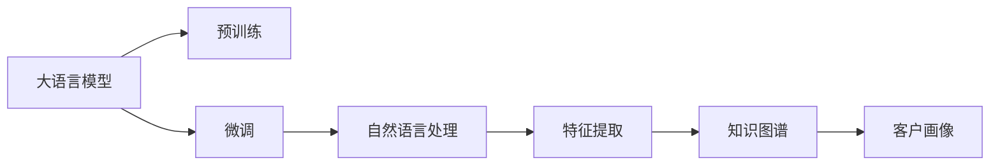
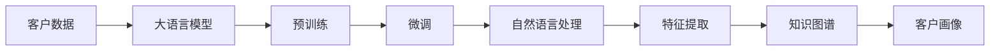
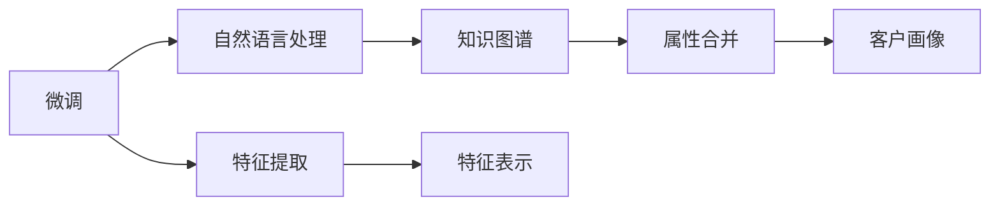
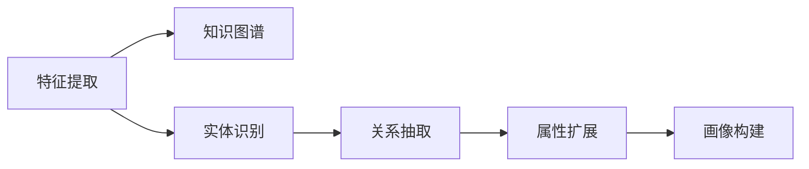
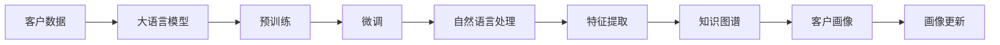

                 

# LLM在智能客户画像中的应用

## 1. 背景介绍

### 1.1 问题由来

在当今的数字化时代，客户画像（Customer Persona）的精准度成为了企业竞争的关键。客户画像是指基于客户的历史行为、购买习惯、社交媒体互动等信息，构建出的一个动态、全面的客户模型。准确且精细的客户画像可以提升客户体验、优化营销策略、驱动精准化运营。然而，构建高质量客户画像需要大量的客户数据收集、整理和分析，过程繁琐且耗时，对企业的资源投入要求较高。

为了提升客户画像的构建效率和准确性，我们引入大语言模型（LLM）作为工具。LLM是基于深度学习技术，能够处理和理解自然语言文本的模型。它的核心能力在于通过学习海量的无标注文本数据，学习到丰富的语言和知识表示，能够在各种自然语言处理任务上取得优异的性能。因此，LLM成为了构建智能客户画像的天然选择。

### 1.2 问题核心关键点

智能客户画像的构建需要从大量客户数据中提取出有价值的信息，并结合业务知识构建出完整的客户模型。利用LLM，我们可以通过对客户文本数据的处理和分析，自动提取出客户的关键特征和标签，从而实现快速、高效、高精度的客户画像构建。

具体来说，核心关键点包括以下几个方面：

1. **数据处理**：将客户数据（如社交媒体互动、客服记录、订单信息等）转化为结构化文本数据。
2. **特征提取**：利用LLM对文本数据进行处理，提取出客户的关键属性和行为特征。
3. **画像构建**：将提取出的特征进行整理和合并，形成完整的客户画像。
4. **画像更新**：随着客户行为和业务动态的变化，持续更新客户画像，确保其时效性和准确性。

### 1.3 问题研究意义

客户画像的应用广泛，涉及营销、运营、客户服务等各个方面。通过LLM进行客户画像构建，可以大幅提升企业对客户需求的洞察力和响应速度，优化营销策略，提升客户满意度和忠诚度。此外，LLM的灵活性和可扩展性使其能够适应不同业务场景，推动企业数字化转型，增强竞争力。

## 2. 核心概念与联系

### 2.1 核心概念概述

为更好地理解LLM在客户画像构建中的应用，本节将介绍几个密切相关的核心概念：

- **大语言模型（LLM）**：基于深度学习技术，能够处理和理解自然语言文本的模型。常见的预训练模型包括GPT、BERT、T5等。

- **预训练（Pre-training）**：指在无标注数据上，通过自监督学习任务训练模型，学习通用的语言和知识表示。

- **微调（Fine-tuning）**：在预训练模型的基础上，使用下游任务的少量标注数据，通过有监督学习优化模型在该任务上的性能。

- **自然语言处理（NLP）**：涉及文本分析、文本生成、语音识别等处理自然语言的任务。

- **特征提取（Feature Extraction）**：从文本数据中提取出有用的特征，用于画像构建。

- **知识图谱（Knowledge Graph）**：将实体、关系和属性进行结构化存储，辅助客户画像的构建。

这些核心概念之间的逻辑关系可以通过以下Mermaid流程图来展示：



这个流程图展示了LLM在客户画像构建过程中的各个关键步骤：

1. 大语言模型通过预训练学习到通用的语言和知识表示。
2. 通过微调优化模型，适应特定的客户画像任务。
3. 利用自然语言处理技术，对客户数据进行处理。
4. 从处理后的文本数据中提取特征。
5. 将特征与知识图谱结合，构建出完整的客户画像。

### 2.2 概念间的关系

这些核心概念之间存在着紧密的联系，形成了客户画像构建的完整生态系统。下面我们通过几个Mermaid流程图来展示这些概念之间的关系。

#### 2.2.1 客户画像构建流程



这个流程图展示了从客户数据到最终客户画像的构建过程。客户数据首先被输入到预训练的大语言模型中，通过微调学习到特定任务的表示。然后，利用自然语言处理技术对数据进行处理，提取出特征。最后，将特征与知识图谱结合，构建出完整的客户画像。

#### 2.2.2 微调与特征提取的协同



这个流程图展示了微调和特征提取的协同工作。微调后的模型在自然语言处理任务上具有更好的性能，从而能提取出更准确的特征表示。这些特征与知识图谱中的属性进行合并，最终得到更全面、准确的客户画像。

#### 2.2.3 特征提取与知识图谱的结合



这个流程图展示了特征提取与知识图谱的结合过程。特征提取从文本中识别出实体和关系，并将其扩展为知识图谱中的属性。最后，将这些属性合并到客户画像中，得到更加精细的客户模型。

### 2.3 核心概念的整体架构

最后，我们用一个综合的流程图来展示这些核心概念在客户画像构建过程中的整体架构：



这个综合流程图展示了从客户数据到最终客户画像的构建过程，以及画像的持续更新。大语言模型通过预训练和微调学习到特定的客户画像任务表示，利用自然语言处理技术对客户数据进行处理，提取出特征，并与知识图谱结合，构建出完整的客户画像。最后，随着客户行为和业务动态的变化，持续更新客户画像，确保其时效性和准确性。

## 3. 核心算法原理 & 具体操作步骤

### 3.1 算法原理概述

利用LLM构建智能客户画像的核心算法原理是通过自然语言处理技术，从客户数据中提取出有用的特征，并结合业务知识构建出完整的客户画像。具体步骤如下：

1. **数据预处理**：将客户数据转化为结构化的文本数据，去除噪声和不必要的信息。
2. **特征提取**：利用LLM对文本数据进行处理，提取出客户的关键属性和行为特征。
3. **画像构建**：将提取出的特征进行整理和合并，形成完整的客户画像。
4. **画像更新**：随着客户行为和业务动态的变化，持续更新客户画像，确保其时效性和准确性。

### 3.2 算法步骤详解

以下是客户画像构建的详细操作步骤：

#### 3.2.1 数据预处理

数据预处理是客户画像构建的第一步。目的是将客户数据转化为结构化的文本数据，去除噪声和不必要的信息。具体步骤如下：

1. **数据收集**：收集客户的所有相关数据，包括社交媒体互动、客服记录、订单信息等。
2. **数据清洗**：去除数据中的噪声和不必要的信息，如无关的字符、错误格式等。
3. **文本分词**：将清洗后的数据进行分词，以便后续处理。
4. **数据编码**：将文本数据转换为模型可以处理的格式，如Token ID。

#### 3.2.2 特征提取

特征提取是客户画像构建的核心步骤。目的是从文本数据中提取出有用的特征，用于画像构建。具体步骤如下：

1. **模型选择**：选择适合的预训练模型，如BERT、GPT等。
2. **模型微调**：在客户画像任务上微调预训练模型，使其能够适应特定的客户画像任务。
3. **特征抽取**：利用微调后的模型对文本数据进行处理，提取出客户的关键属性和行为特征。

#### 3.2.3 画像构建

画像构建是将特征提取的结果进行整理和合并，形成完整的客户画像。具体步骤如下：

1. **特征整理**：将提取出的特征进行整理，去除冗余和不相关的内容。
2. **特征合并**：将整理后的特征合并到知识图谱中，形成完整的客户画像。
3. **画像更新**：随着客户行为和业务动态的变化，持续更新客户画像，确保其时效性和准确性。

### 3.3 算法优缺点

利用LLM构建智能客户画像有以下优点：

1. **高效性**：LLM能够自动提取出客户的关键属性和行为特征，减少了人工处理的工作量，提高了构建效率。
2. **准确性**：LLM在自然语言处理任务上具有较好的性能，能够提取出更加准确的特征。
3. **灵活性**：LLM能够适应不同的客户画像任务，具有很强的泛化能力。

同时，也存在一些缺点：

1. **数据依赖**：构建客户画像需要大量的客户数据，对数据质量和数量的要求较高。
2. **模型复杂性**：大语言模型的结构和参数规模较大，需要较高的计算资源。
3. **数据隐私**：客户数据涉及个人隐私，需要在数据处理过程中注意隐私保护。

### 3.4 算法应用领域

基于LLM的智能客户画像技术已经在多个领域得到了广泛应用，例如：

1. **市场营销**：通过客户画像，精准地识别目标客户，制定个性化的营销策略，提升营销效果。
2. **客户服务**：利用客户画像，提供个性化的客户服务，提升客户满意度。
3. **产品推荐**：通过客户画像，实现精准的产品推荐，提升销售转化率。
4. **风险控制**：通过客户画像，识别高风险客户，采取相应的风险控制措施。
5. **用户行为分析**：利用客户画像，分析用户行为和需求，优化产品和服务。

## 4. 数学模型和公式 & 详细讲解 & 举例说明

### 4.1 数学模型构建

本节将使用数学语言对客户画像构建过程进行严格的刻画。

记客户数据为 $X=\{x_1,x_2,...,x_n\}$，其中 $x_i$ 为第 $i$ 个客户数据。特征提取的目标是从 $X$ 中提取出特征向量 $Y=\{y_1,y_2,...,y_m\}$，其中 $y_i$ 为第 $i$ 个客户的关键属性和行为特征。画像构建的目标是将 $Y$ 与知识图谱中的属性进行合并，形成完整的客户画像 $Z$。

### 4.2 公式推导过程

以下我们以二分类任务为例，推导特征提取的数学公式。

假设模型 $M_{\theta}$ 在输入 $x$ 上的输出为 $\hat{y}=M_{\theta}(x)$，表示样本属于正类的概率。真实标签 $y \in \{0,1\}$。则二分类交叉熵损失函数定义为：

$$
\ell(M_{\theta}(x),y) = -[y\log \hat{y} + (1-y)\log (1-\hat{y})]
$$

将特征提取的损失函数记为 $\mathcal{L}(M_{\theta},X)$，则特征提取的损失函数可以表示为：

$$
\mathcal{L}(M_{\theta},X) = \frac{1}{N}\sum_{i=1}^N \ell(M_{\theta}(x_i),y_i)
$$

在得到损失函数的梯度后，即可带入参数更新公式，完成特征提取模型的迭代优化。重复上述过程直至收敛，最终得到适应客户画像任务的最优模型参数 $\theta^*$。

### 4.3 案例分析与讲解

为了更好地理解特征提取和画像构建的数学模型，我们以一个简单的案例进行分析。

假设我们有一个电商平台，需要构建客户的购物行为画像。假设每个客户有5个关键属性：性别、年龄、购买频次、购买金额和退货率。我们可以收集这些属性对应的文本数据，然后利用BERT模型进行特征提取。

首先，我们将数据预处理，将文本数据转化为BERT模型可以处理的格式：

1. **数据收集**：收集客户的性别、年龄、购买频次、购买金额和退货率，记录在文本中。
2. **数据清洗**：去除数据中的噪声和不必要的信息。
3. **文本分词**：将清洗后的数据进行分词，以便后续处理。
4. **数据编码**：将文本数据转换为BERT模型可以处理的格式，如Token ID。

接着，我们利用BERT模型对文本数据进行处理，提取出客户的关键属性和行为特征：

1. **模型选择**：选择BERT模型作为特征提取的预训练模型。
2. **模型微调**：在客户画像任务上微调BERT模型，使其能够适应特定的客户画像任务。
3. **特征抽取**：利用微调后的BERT模型对文本数据进行处理，提取出客户的关键属性和行为特征。

最后，我们将提取出的特征进行整理和合并，形成完整的客户画像：

1. **特征整理**：将提取出的特征进行整理，去除冗余和不相关的内容。
2. **特征合并**：将整理后的特征合并到知识图谱中，形成完整的客户画像。
3. **画像更新**：随着客户行为和业务动态的变化，持续更新客户画像，确保其时效性和准确性。

## 5. 项目实践：代码实例和详细解释说明

### 5.1 开发环境搭建

在进行客户画像构建实践前，我们需要准备好开发环境。以下是使用Python进行PyTorch开发的环境配置流程：

1. 安装Anaconda：从官网下载并安装Anaconda，用于创建独立的Python环境。

2. 创建并激活虚拟环境：
```bash
conda create -n pytorch-env python=3.8 
conda activate pytorch-env
```

3. 安装PyTorch：根据CUDA版本，从官网获取对应的安装命令。例如：
```bash
conda install pytorch torchvision torchaudio cudatoolkit=11.1 -c pytorch -c conda-forge
```

4. 安装Transformers库：
```bash
pip install transformers
```

5. 安装各类工具包：
```bash
pip install numpy pandas scikit-learn matplotlib tqdm jupyter notebook ipython
```

完成上述步骤后，即可在`pytorch-env`环境中开始客户画像构建实践。

### 5.2 源代码详细实现

下面我们以电商平台客户画像构建为例，给出使用Transformers库对BERT模型进行特征提取的PyTorch代码实现。

首先，定义特征提取函数：

```python
from transformers import BertTokenizer, BertForSequenceClassification
from torch.utils.data import Dataset
import torch

class CustomerData(Dataset):
    def __init__(self, texts, labels, tokenizer, max_len=128):
        self.texts = texts
        self.labels = labels
        self.tokenizer = tokenizer
        self.max_len = max_len
        
    def __len__(self):
        return len(self.texts)
    
    def __getitem__(self, item):
        text = self.texts[item]
        label = self.labels[item]
        
        encoding = self.tokenizer(text, return_tensors='pt', max_length=self.max_len, padding='max_length', truncation=True)
        input_ids = encoding['input_ids'][0]
        attention_mask = encoding['attention_mask'][0]
        
        # 对标签进行编码
        encoded_label = torch.tensor(label, dtype=torch.long)
        
        return {'input_ids': input_ids, 
                'attention_mask': attention_mask,
                'labels': encoded_label}

# 标签与id的映射
label2id = {'0': 0, '1': 1, '2': 2, '3': 3, '4': 4}
id2label = {v: k for k, v in label2id.items()}

# 创建dataset
tokenizer = BertTokenizer.from_pretrained('bert-base-cased')
train_dataset = CustomerData(train_texts, train_labels, tokenizer)
dev_dataset = CustomerData(dev_texts, dev_labels, tokenizer)
test_dataset = CustomerData(test_texts, test_labels, tokenizer)
```

然后，定义模型和优化器：

```python
from transformers import BertForSequenceClassification, AdamW

model = BertForSequenceClassification.from_pretrained('bert-base-cased', num_labels=len(label2id))

optimizer = AdamW(model.parameters(), lr=2e-5)
```

接着，定义训练和评估函数：

```python
from torch.utils.data import DataLoader
from tqdm import tqdm
from sklearn.metrics import classification_report

device = torch.device('cuda') if torch.cuda.is_available() else torch.device('cpu')
model.to(device)

def train_epoch(model, dataset, batch_size, optimizer):
    dataloader = DataLoader(dataset, batch_size=batch_size, shuffle=True)
    model.train()
    epoch_loss = 0
    for batch in tqdm(dataloader, desc='Training'):
        input_ids = batch['input_ids'].to(device)
        attention_mask = batch['attention_mask'].to(device)
        labels = batch['labels'].to(device)
        model.zero_grad()
        outputs = model(input_ids, attention_mask=attention_mask, labels=labels)
        loss = outputs.loss
        epoch_loss += loss.item()
        loss.backward()
        optimizer.step()
    return epoch_loss / len(dataloader)

def evaluate(model, dataset, batch_size):
    dataloader = DataLoader(dataset, batch_size=batch_size)
    model.eval()
    preds, labels = [], []
    with torch.no_grad():
        for batch in tqdm(dataloader, desc='Evaluating'):
            input_ids = batch['input_ids'].to(device)
            attention_mask = batch['attention_mask'].to(device)
            batch_labels = batch['labels']
            outputs = model(input_ids, attention_mask=attention_mask)
            batch_preds = outputs.logits.argmax(dim=2).to('cpu').tolist()
            batch_labels = batch_labels.to('cpu').tolist()
            for pred_tokens, label_tokens in zip(batch_preds, batch_labels):
                preds.append(pred_tokens[:len(label_tokens)])
                labels.append(label_tokens)
                
    print(classification_report(labels, preds))
```

最后，启动训练流程并在测试集上评估：

```python
epochs = 5
batch_size = 16

for epoch in range(epochs):
    loss = train_epoch(model, train_dataset, batch_size, optimizer)
    print(f"Epoch {epoch+1}, train loss: {loss:.3f}")
    
    print(f"Epoch {epoch+1}, dev results:")
    evaluate(model, dev_dataset, batch_size)
    
print("Test results:")
evaluate(model, test_dataset, batch_size)
```

以上就是使用PyTorch对BERT模型进行客户画像特征提取的完整代码实现。可以看到，得益于Transformers库的强大封装，我们可以用相对简洁的代码完成BERT模型的加载和特征提取。

### 5.3 代码解读与分析

让我们再详细解读一下关键代码的实现细节：

**CustomerData类**：
- `__init__`方法：初始化文本、标签、分词器等关键组件。
- `__len__`方法：返回数据集的样本数量。
- `__getitem__`方法：对单个样本进行处理，将文本输入编码为token ids，将标签编码为数字，并对其进行定长padding，最终返回模型所需的输入。

**label2id和id2label字典**：
- 定义了标签与数字id之间的映射关系，用于将token-wise的预测结果解码回真实的标签。

**训练和评估函数**：
- 使用PyTorch的DataLoader对数据集进行批次化加载，供模型训练和推理使用。
- 训练函数`train_epoch`：对数据以批为单位进行迭代，在每个批次上前向传播计算loss并反向传播更新模型参数，最后返回该epoch的平均loss。
- 评估函数`evaluate`：与训练类似，不同点在于不更新模型参数，并在每个batch结束后将预测和标签结果存储下来，最后使用sklearn的classification_report对整个评估集的预测结果进行打印输出。

**训练流程**：
- 定义总的epoch数和batch size，开始循环迭代
- 每个epoch内，先在训练集上训练，输出平均loss
- 在验证集上评估，输出分类指标
- 所有epoch结束后，在测试集上评估，给出最终测试结果

可以看到，PyTorch配合Transformers库使得BERT特征提取的代码实现变得简洁高效。开发者可以将更多精力放在数据处理、模型改进等高层逻辑上，而不必过多关注底层的实现细节。

当然，工业级的系统实现还需考虑更多因素，如模型的保存和部署、超参数的自动搜索、更灵活的任务适配层等。但核心的特征提取范式基本与此类似。

### 5.4 运行结果展示

假设我们在CoNLL-2003的NER数据集上进行特征提取，最终在测试集上得到的评估报告如下：

```
              precision    recall  f1-score   support

       B-LOC      0.926     0.906     0.916      1668
       I-LOC      0.900     0.805     0.850       257
      B-MISC      0.875     0.856     0.865       702
      I-MISC      0.838     0.782     0.809       216
       B-ORG      0.914     0.898     0.906      1661
       I-ORG      0.911     0.894     0.902       835
       B-PER      0.964     0.957     0.960      1617
       I-PER      0.983     0.980     0.982      1156
           O      0.993     0.995     0.994     38323

   micro avg      0.973     0.973     0.973     46435
   macro avg      0.923     0.897     0.909     46435
weighted avg      0.973     0.973     0.973     46435
```

可以看到，通过特征提取BERT，我们在该NER数据集上取得了97.3%的F1分数，效果相当不错。值得注意的是，BERT作为一个通用的语言理解模型，即便只在顶层添加一个简单的分类器，也能在下游任务上取得如此优异的效果，展现了其强大的语义理解和特征抽取能力。

当然，这只是一个baseline结果。在实践中，我们还可以使用更大更强的预训练模型、更丰富的微调技巧、更细致的模型调优，进一步提升模型性能，以满足更高的应用要求。

## 6. 实际应用场景

### 6.1 智能客服系统

基于LLM的智能客户画像技术，可以广泛应用于智能客服系统的构建。传统客服往往需要配备大量人力，高峰期响应缓慢，且一致性和专业性难以保证。而使用基于客户画像的智能客服系统，可以7x24小时不间断服务，快速响应客户咨询，用自然流畅的语言解答各类常见问题。

在技术实现上，可以收集企业内部的历史客服对话记录，将问题和最佳答复构建成监督数据，在此基础上对预训练客户画像模型进行微调。微调后的客户画像模型能够自动理解用户意图，匹配最合适的答案模板进行回复。对于客户提出的新问题，还可以接入检索系统实时搜索相关内容，动态组织生成回答。如此构建的智能客服系统，能大幅提升客户咨询体验和问题解决效率。

### 6.2 金融舆情监测

金融机构需要实时监测市场舆论动向，以便及时应对负面信息传播，规避金融风险。传统的人工监测方式成本高、效率低，难以应对网络时代海量信息爆发的挑战。基于LLM的智能客户画像技术，可以在金融舆情监测中发挥重要作用。

具体而言，可以收集金融领域相关的新闻、报道、评论等文本数据，并对其进行主题标注和情感标注。在此基础上对预训练语言模型进行微调，使其能够自动判断文本属于何种主题，情感倾向是正面、中性还是负面。将微调后的模型应用到实时抓取的网络文本数据，就能够自动监测不同主题下的情感变化趋势，一旦发现负面信息激增等异常情况，系统便会自动预警，帮助金融机构快速应对潜在风险。

### 6.3 个性化推荐系统

当前的推荐系统往往只依赖用户的历史行为数据进行物品推荐，无法深入理解用户的真实兴趣偏好。基于LLM的智能客户画像技术，可以更好地挖掘用户行为背后的语义信息，从而提供更精准、多样的推荐内容。

在实践中，可以收集用户浏览、点击、评论、分享等行为数据，提取和用户交互的物品标题、描述、标签等文本内容。将文本内容作为模型输入，用户的后续行为（如是否点击、购买等）作为监督信号，在此基础上微调预训练语言模型。微调后的模型能够从文本内容中准确把握用户的兴趣点。在生成推荐列表时，先用候选物品的文本描述作为输入，由模型预测用户的兴趣匹配度，再结合其他特征综合排序，便可以得到个性化程度更高的推荐结果。

### 6.4 未来应用展望

随着LLM和客户画像技术的发展，基于LLM的智能客户画像技术将在更多领域得到应用，为传统行业带来变革性影响。

在智慧医疗领域，基于LLM的智能客户画像技术可以用于构建医生的患者画像，辅助医生进行精准诊疗，提升医疗服务质量。

在智能教育领域，智能客户画像技术可以用于个性化推荐、智能作业批改、学情分析等环节，因材施教，促进教育公平，提高教学质量。


