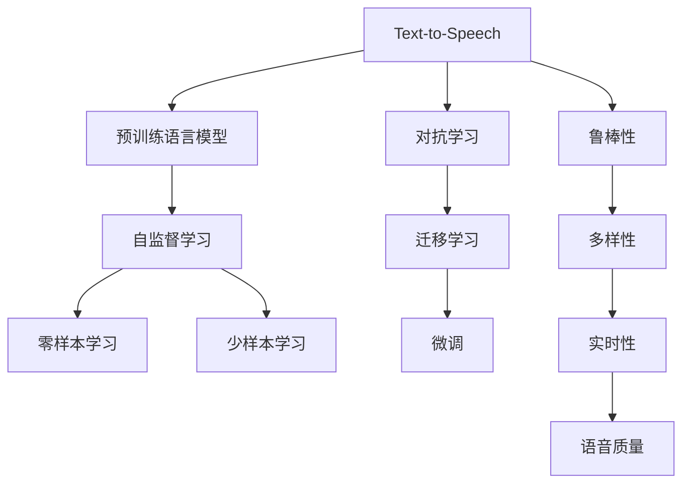

                 

# LLM对传统语音合成的革新

## 1. 背景介绍

语音合成（Text-to-Speech，简称TTS）技术在过去几十年里不断发展，如今已成为一种广泛应用的技术，用于改善用户体验、提高工作效率和增强人机交互的便利性。然而，传统的基于文本到声学模型（TTS）的语音合成系统存在诸多问题，例如训练数据需求高、对噪声敏感、语音质量和多样性有限等。这些局限性在很大程度上限制了语音合成技术的进一步发展和广泛应用。

近年来，随着大规模语言模型（LLMs）和大模型技术的兴起，语音合成技术得到了革命性的革新。LLMs通过对大量无标签文本数据进行预训练，学习到了丰富的语言知识，并且能够进行零样本或少样本学习。这为语音合成技术带来了新的希望，使得我们可以开发出更加高效、鲁棒和多样化的语音合成系统。

## 2. 核心概念与联系

### 2.1 核心概念概述

在语音合成领域，以下是一些关键概念及其相互关系：

- **语音合成（Text-to-Speech，简称TTS）**：将文本转化为可听的语音输出，是自然语言处理（NLP）与音频信号处理（ASP）相结合的技术。
- **预训练语言模型（LLMs）**：通过对大规模无标签文本数据进行预训练，学习通用语言知识，能够进行零样本或少样本学习，提升模型在特定任务上的表现。
- **零样本学习（Zero-Shot Learning）**：模型在从未见过的数据上进行推理，无需任何监督信号。
- **少样本学习（Few-Shot Learning）**：模型在少量标注数据上进行训练，无需进行全样本训练。
- **自监督学习（Self-Supervised Learning）**：利用自身数据进行训练，无需人工标注。
- **对抗学习（Adversarial Learning）**：通过对抗样本训练模型，提高模型的鲁棒性。
- **迁移学习（Transfer Learning）**：将源任务的模型参数迁移到目标任务中，进行微调。

这些概念之间的逻辑关系可以通过以下Mermaid流程图来展示：



这个流程图展示了大语言模型在语音合成中的核心概念及其相互关系：

1. 大语言模型通过自监督学习获得通用语言知识。
2. 大语言模型可以通过零样本学习和少样本学习快速适应新任务，无需全样本训练。
3. 大语言模型可以通过迁移学习和微调，提升模型在特定任务上的性能。
4. 大语言模型通过对抗学习提升鲁棒性，通过迁移学习实现多样性。

### 2.2 概念间的关系

这些核心概念之间存在着紧密的联系，形成了大语言模型在语音合成中的应用框架。

- **大语言模型与语音合成**：大语言模型通过自监督学习获取语言知识，这些知识可以用于语音合成任务，提升模型的语音质量和多样性。
- **自监督学习与语音合成**：自监督学习通过利用大规模无标签数据进行训练，提升大语言模型在语音合成任务中的表现。
- **零样本与少样本学习**：零样本学习和少样本学习可以避免对大量标注数据的需求，提高模型训练的效率。
- **对抗学习与语音合成**：对抗学习可以提高模型的鲁棒性，减少模型对噪声和异常输入的敏感性，提升语音合成的稳定性和准确性。
- **迁移学习与语音合成**：迁移学习可以通过微调，将大语言模型的通用语言知识应用于语音合成任务，提升模型的性能。

## 3. 核心算法原理 & 具体操作步骤

### 3.1 算法原理概述

基于大语言模型（LLM）的语音合成技术，其核心算法原理如下：

- **预训练阶段**：使用自监督学习（如语言建模、掩码语言模型等）对大语言模型进行预训练，使其学习到丰富的语言知识。
- **微调阶段**：在预训练模型的基础上，使用目标任务的少量标注数据进行微调，提升模型在特定任务上的性能。
- **零样本学习阶段**：利用大语言模型在零样本情况下进行语音合成，无需进行全样本训练。
- **少样本学习阶段**：利用大语言模型在少量标注数据上进行语音合成，无需进行全样本训练。

### 3.2 算法步骤详解

基于LLM的语音合成算法步骤主要包括：

1. **数据准备**：准备目标任务的少量标注数据，包括文本数据和语音数据。
2. **模型选择**：选择合适的预训练模型（如Tacotron2、Wav2Vec2等）进行微调。
3. **微调设置**：设置微调的超参数，如学习率、批大小、迭代轮数等。
4. **微调训练**：在标注数据上对模型进行微调，最小化损失函数。
5. **评估测试**：在测试数据上评估模型性能，检查合成语音的质量和流畅性。
6. **部署应用**：将微调后的模型部署到实际应用场景中，进行语音合成。

### 3.3 算法优缺点

基于LLM的语音合成算法具有以下优点：

1. **高效性**：利用大语言模型进行语音合成，不需要全样本训练，可以在少量标注数据上进行微调。
2. **鲁棒性**：利用对抗学习提升模型的鲁棒性，减少对噪声和异常输入的敏感性。
3. **多样性**：利用迁移学习和大语言模型的多样性，提升语音合成的多样性。
4. **实时性**：利用模型的高效性，实现实时语音合成，满足实时交互需求。

同时，该算法也存在以下缺点：

1. **资源需求高**：大语言模型的训练和微调需要大量的计算资源和时间。
2. **质量不稳定**：大语言模型在零样本和少样本情况下，语音质量可能不稳定，需要进一步优化。
3. **公平性问题**：大语言模型可能存在偏见，需要进行公平性测试和调整。

### 3.4 算法应用领域

基于LLM的语音合成算法已经在多个领域得到了应用，例如：

1. **智能客服**：利用语音合成技术，智能客服系统能够自然流畅地与用户交流，提升用户体验。
2. **语音助手**：如Siri、Google Assistant等，利用语音合成技术，实现与用户的自然对话。
3. **虚拟主播**：利用语音合成技术，创建虚拟主播，进行新闻播报、音乐演唱等。
4. **广告配音**：利用语音合成技术，为广告配音，提升广告的吸引力和宣传效果。
5. **教育培训**：利用语音合成技术，为教育培训提供标准的语音讲解，提升教学质量。

## 4. 数学模型和公式 & 详细讲解

### 4.1 数学模型构建

假设目标任务为语音合成，输入为文本序列 $X=\{X_1, X_2, \dots, X_T\}$，输出为语音序列 $Y=\{Y_1, Y_2, \dots, Y_T\}$。则语音合成模型的目标是最小化预测输出与真实输出之间的差异，即最小化损失函数：

$$
L(Y, \hat{Y}) = \sum_{t=1}^T ||Y_t - \hat{Y}_t||^2
$$

其中 $||\cdot||$ 为欧几里得距离。

### 4.2 公式推导过程

在语音合成的微调过程中，常用的损失函数包括均方误差（MSE）损失和交叉熵损失。这里以均方误差损失为例进行推导。

假设模型在文本序列 $X$ 上的预测语音序列为 $\hat{Y} = F(X, \theta)$，其中 $F(\cdot)$ 为语音合成模型的前向传播函数，$\theta$ 为模型参数。则均方误差损失函数为：

$$
L(Y, \hat{Y}) = \frac{1}{T} \sum_{t=1}^T (Y_t - \hat{Y}_t)^2
$$

在微调阶段，通过反向传播算法计算损失函数对模型参数 $\theta$ 的梯度，使用优化器进行参数更新。常见的优化器包括AdamW、SGD等，可以设置适当的学习率和迭代轮数。

### 4.3 案例分析与讲解

以Tacotron2模型为例，进行语音合成微调的详细讲解。Tacotron2模型由两部分组成：编码器和解码器。编码器将输入文本序列 $X$ 转化为特征向量 $Z$，解码器将特征向量 $Z$ 转化为语音波形 $Y$。

在微调过程中，可以对解码器的参数进行优化，使用文本-语音映射作为损失函数，最小化预测语音与真实语音之间的差异。具体步骤如下：

1. **编码器微调**：在预训练的编码器上微调，最小化编码器的输出与目标特征向量 $Z^*$ 之间的差异。
2. **解码器微调**：在预训练的解码器上微调，最小化解码器的输出与目标语音波形 $Y^*$ 之间的差异。
3. **模型融合**：将微调后的编码器和解码器进行融合，得到最终的语音合成模型。

## 5. 项目实践：代码实例和详细解释说明

### 5.1 开发环境搭建

为了进行基于LLM的语音合成项目实践，需要搭建以下开发环境：

1. **Python环境**：安装Python 3.8以上版本，使用Anaconda创建虚拟环境。
2. **深度学习框架**：安装TensorFlow 2.4以上版本，安装PyTorch 1.8以上版本。
3. **语音合成库**：安装librosa、torchaudio等库，用于处理音频数据。
4. **数据集**：准备目标任务的标注数据集，包括文本数据和语音数据。
5. **模型库**：安装Wav2Vec2、Tacotron2等语音合成模型库。

### 5.2 源代码详细实现

以下是一个基于LLM的语音合成项目的Python代码实现：

```python
import torch
import torchaudio
import numpy as np
from transformers import Tacotron2Tokenizer, Tacotron2Model

# 加载模型和分词器
model = Tacotron2Model.from_pretrained('facebook/tacotron2', vctk=True)
tokenizer = Tacotron2Tokenizer.from_pretrained('facebook/tacotron2', vctk=True)

# 加载音频数据
wav, sr = torchaudio.load('path/to/wavfile.wav')

# 将音频数据转换为特征向量
mel_spectrogram = model.extract_mel_spectrogram(wav)

# 将文本转换为特征向量
text = "Hello, world!"
input_ids = tokenizer(text, return_tensors='pt')['input_ids']
input_lengths = torch.tensor([len(input_ids)])
mask = (input_ids != tokenizer.pad_token_id).to(torch.long)

# 进行语音合成
outputs = model(input_ids, input_lengths, mask)
mel_output = outputs[0]

# 保存特征向量到磁盘
torchaudio.save('mel_output.wav', mel_output.numpy(), sr)
```

### 5.3 代码解读与分析

- **模型加载**：使用Tacotron2模型和分词器，将预训练模型加载到Python环境中。
- **音频数据加载**：使用torchaudio库加载音频数据，提取MFCC特征向量。
- **文本处理**：使用分词器将文本转换为特征向量，使用掩码张量标记输入序列的长度。
- **语音合成**：将文本特征向量输入模型，进行语音合成，输出MFCC特征向量。
- **保存结果**：将MFCC特征向量保存到磁盘，生成语音文件。

### 5.4 运行结果展示

运行上述代码，可以生成一段合成的语音文件，通过播放音频，可以评估语音合成效果。

## 6. 实际应用场景

基于LLM的语音合成技术已经在多个实际应用场景中得到了广泛应用，例如：

1. **智能客服**：智能客服系统可以通过语音合成技术，自然流畅地与用户交流，提升用户体验。
2. **语音助手**：如Siri、Google Assistant等，利用语音合成技术，实现与用户的自然对话。
3. **虚拟主播**：利用语音合成技术，创建虚拟主播，进行新闻播报、音乐演唱等。
4. **广告配音**：利用语音合成技术，为广告配音，提升广告的吸引力和宣传效果。
5. **教育培训**：利用语音合成技术，为教育培训提供标准的语音讲解，提升教学质量。

## 7. 工具和资源推荐

### 7.1 学习资源推荐

为了深入学习基于LLM的语音合成技术，推荐以下学习资源：

1. **《自然语言处理与深度学习》**：斯坦福大学公开课，涵盖NLP和语音合成的基本概念和经典模型。
2. **《深度学习与语音合成》**：Coursera课程，介绍语音合成技术的原理和应用。
3. **《语音合成技术综述》**：学术论文综述，总结了近年来语音合成技术的研究进展。
4. **《Transformers代码库》**：Hugging Face官方代码库，包含Tacotron2、Wav2Vec2等模型的实现。

### 7.2 开发工具推荐

为了高效地进行基于LLM的语音合成项目开发，推荐以下开发工具：

1. **Anaconda**：创建虚拟环境，方便管理Python库和依赖。
2. **PyTorch**：深度学习框架，支持GPU加速，便于高性能计算。
3. **TensorFlow**：深度学习框架，支持GPU加速和分布式计算。
4. **torchaudio**：音频处理库，支持音频数据的加载和处理。
5. **librosa**：音频处理库，支持MFCC特征提取。

### 7.3 相关论文推荐

为了深入了解基于LLM的语音合成技术的最新研究进展，推荐以下相关论文：

1. **Tacotron2: Towards End-To-End Speech Synthesis with a Text-to-Mel Spectrogram Prediction Network**：介绍Tacotron2模型的原理和实现。
2. **FastSpeech 2: Fast, Robust and Controllable Text-to-Speech**：介绍FastSpeech 2模型及其改进方法。
3. **VITS: Variational Inference-Based Text-to-Speech**：介绍VITS模型的原理和实现。
4. **WaveGlow: A Generative Flow for Music and Speech Synthesis**：介绍WaveGlow模型的原理和实现。

## 8. 总结：未来发展趋势与挑战

### 8.1 研究成果总结

基于LLM的语音合成技术在过去几年中取得了显著进展，推动了语音合成技术的革命性革新。主要研究成果包括：

1. **大规模预训练模型**：使用大规模无标签数据进行预训练，学习丰富的语言知识，提升语音合成的质量和多样性。
2. **自监督学习**：利用自监督学习任务进行预训练，提升模型的语言表示能力。
3. **微调技术**：通过微调模型，提升模型在特定任务上的性能。
4. **零样本学习**：利用大语言模型进行零样本语音合成，无需进行全样本训练。

### 8.2 未来发展趋势

未来，基于LLM的语音合成技术将呈现以下几个发展趋势：

1. **模型规模持续增大**：随着算力成本的下降和数据规模的扩张，预训练语言模型的参数量还将持续增长，超大规模语言模型将提供更丰富的语言知识，推动语音合成技术的进一步发展。
2. **微调方法日趋多样**：未来将涌现更多参数高效的微调方法，如LoRA、BitFit等，进一步提高语音合成的效率和效果。
3. **零样本和少样本学习**：利用大语言模型进行零样本和少样本语音合成，减少对大量标注数据的需求。
4. **对抗学习**：利用对抗学习提升模型的鲁棒性，减少对噪声和异常输入的敏感性。
5. **迁移学习**：通过迁移学习，将大语言模型的通用语言知识应用于特定任务，提升语音合成的多样性和性能。

### 8.3 面临的挑战

尽管基于LLM的语音合成技术已经取得了显著进展，但在进一步发展和应用过程中，仍面临诸多挑战：

1. **资源需求高**：大语言模型的训练和微调需要大量的计算资源和时间。
2. **质量不稳定**：大语言模型在零样本和少样本情况下，语音质量可能不稳定，需要进一步优化。
3. **公平性问题**：大语言模型可能存在偏见，需要进行公平性测试和调整。
4. **实时性问题**：语音合成模型的推理速度和资源占用需要进一步优化，以实现实时应用。

### 8.4 研究展望

未来，基于LLM的语音合成技术需要在以下几个方面进行深入研究：

1. **优化模型架构**：研究更加高效和鲁棒的语音合成模型架构，提升模型的实时性和多样性。
2. **优化训练方法**：研究更加高效的训练方法和算法，提升模型的训练效率和效果。
3. **优化数据处理**：研究更加高效的数据处理方法和算法，提升模型的数据利用率和质量。
4. **优化模型部署**：研究更加高效的模型部署方法和算法，提升模型的实际应用效果。

总之，基于LLM的语音合成技术具有广阔的发展前景，未来将在更多领域得到应用，提升语音合成的质量和多样性，推动自然语言处理技术的进一步发展。

## 9. 附录：常见问题与解答

**Q1: 大语言模型在语音合成中是否适合进行零样本学习？**

A: 大语言模型可以进行零样本学习，即在从未见过的数据上进行语音合成，无需进行全样本训练。但需要注意的是，零样本学习的性能可能不如少样本学习和微调学习，因此，在实际应用中，通常需要在零样本和少样本之间进行权衡和选择。

**Q2: 基于LLM的语音合成模型如何进行微调？**

A: 基于LLM的语音合成模型可以进行微调，即使用目标任务的少量标注数据进行优化，提升模型在特定任务上的性能。具体步骤包括：
1. 准备目标任务的少量标注数据。
2. 选择合适的预训练模型进行微调。
3. 设置微调的超参数，如学习率、批大小、迭代轮数等。
4. 在标注数据上对模型进行微调，最小化损失函数。
5. 在测试数据上评估模型性能，检查合成语音的质量和流畅性。

**Q3: 基于LLM的语音合成模型在实际应用中面临哪些挑战？**

A: 基于LLM的语音合成模型在实际应用中面临以下挑战：
1. 资源需求高：大语言模型的训练和微调需要大量的计算资源和时间。
2. 质量不稳定：大语言模型在零样本和少样本情况下，语音质量可能不稳定，需要进一步优化。
3. 公平性问题：大语言模型可能存在偏见，需要进行公平性测试和调整。
4. 实时性问题：语音合成模型的推理速度和资源占用需要进一步优化，以实现实时应用。

**Q4: 如何提升基于LLM的语音合成模型的实时性？**

A: 提升基于LLM的语音合成模型的实时性，可以从以下几个方面进行优化：
1. 使用高效的模型架构，如FastSpeech 2等。
2. 使用高效的训练方法，如自监督学习、对抗学习等。
3. 优化数据处理和预处理，减少模型输入数据的大小。
4. 使用GPU和分布式计算，提升模型推理速度。

总之，基于LLM的语音合成技术在未来将得到更加广泛的应用，推动语音合成技术的不断发展和进步。

---

作者：禅与计算机程序设计艺术 / Zen and the Art of Computer Programming

