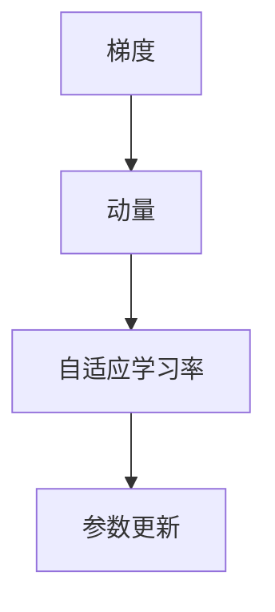

                 

## 1. 背景介绍

在深度学习领域，优化算法（Optimization Algorithm）扮演着至关重要的角色。不同的优化算法对应着不同的模型训练策略，进而影响着模型的训练效果和收敛速度。在众多优化算法中，RMSprop（Root Mean Square Propagation）因其高效和易于实现的特点，成为了一种广泛使用的优化算法。RMSprop算法由Geoffrey Hinton于2012年提出，主要用于优化深度神经网络，尤其适用于非平稳目标函数的优化。本文将系统介绍RMSprop算法的基本原理，结合实际案例进行详细讲解。

## 2. 核心概念与联系

### 2.1 核心概念概述

RMSprop算法基于梯度下降（Gradient Descent），但在此基础上引入了动量（Momentum）和自适应学习率（Adaptive Learning Rate）的概念。

#### 2.1.1 梯度下降

梯度下降（Gradient Descent）是机器学习中最基础的优化算法之一，通过迭代调整模型参数，使得损失函数最小化。具体来说，假设模型参数为 $\theta$，损失函数为 $L(\theta)$，则梯度下降的更新公式为：

$$
\theta_{t+1} = \theta_t - \eta \nabla_\theta L(\theta_t)
$$

其中，$\eta$ 为学习率（Learning Rate）。梯度下降算法的核心在于通过计算损失函数的梯度，引导模型参数向损失函数下降最快的方向更新。

#### 2.1.2 动量

动量（Momentum）的引入是为了缓解梯度下降算法在参数更新时的震荡现象，提高算法的稳定性。动量算法的核心在于引入历史梯度的加权平均，使得参数更新具有一定的惯性。动量的更新公式为：

$$
v_t = \beta v_{t-1} + (1 - \beta) \nabla_\theta L(\theta_t)
$$

$$
\theta_{t+1} = \theta_t - \eta v_t
$$

其中，$\beta$ 为动量系数（Momentum Coefficient）。

#### 2.1.3 自适应学习率

自适应学习率（Adaptive Learning Rate）是一种根据当前梯度大小自适应调整学习率的算法，避免了固定学习率可能导致的收敛速度过慢或过快问题。RMSprop算法采用了一种类似于Adagrad的自适应学习率，基于梯度平方的移动平均来调整学习率。RMSprop的更新公式为：

$$
\beginE[\theta]_t = \beta \E[\theta]_{t-1} + (1 - \beta) \nabla_\theta L(\theta_t)^2
$$

$$
\theta_{t+1} = \theta_t - \eta \frac{\nabla_\theta L(\theta_t)}{\sqrt{\E[\theta]_t + \epsilon}}
$$

其中，$\E[\theta]_t$ 表示梯度平方的移动平均，$\epsilon$ 为一个很小的常数，防止除以0。

### 2.2 核心概念间的联系

RMSprop算法结合了梯度下降、动量和自适应学习率的优点，通过移动平均和动量系数调节，实现了一种更稳健、更高效的优化策略。其核心思想在于：

1. **动量**：引入历史梯度的加权平均，平滑参数更新，防止震荡。
2. **自适应学习率**：根据梯度平方的移动平均，动态调整学习率，避免过快或过慢收敛。

以下是一个简单的Mermaid流程图，展示了RMSprop算法的核心流程：



这个流程图展示了RMSprop算法的核心步骤：

1. 计算当前梯度。
2. 更新动量。
3. 使用动量更新参数。
4. 根据动量平方的移动平均，调整自适应学习率。

## 3. 核心算法原理 & 具体操作步骤

### 3.1 算法原理概述

RMSprop算法通过移动平均梯度平方的方式，实现了自适应学习率的效果。具体而言，RMSprop算法在梯度下降的基础上，引入动量概念，并对学习率进行动态调整，从而提高了收敛速度和稳定性。其核心思想是通过历史梯度平方的加权平均，计算当前梯度的权重，进而动态调整学习率。

### 3.2 算法步骤详解

RMSprop算法的核心步骤如下：

1. **初始化**：设置初始参数 $\theta$、学习率 $\eta$、动量系数 $\beta$、移动平均窗口大小 $N$。
2. **计算梯度**：计算当前梯度 $g_t = \nabla_\theta L(\theta_t)$。
3. **更新动量**：根据动量更新公式计算动量 $v_t = \beta v_{t-1} + (1 - \beta) g_t^2$。
4. **更新参数**：根据自适应学习率更新公式计算参数更新量 $\theta_{t+1} = \theta_t - \eta \frac{g_t}{\sqrt{v_t + \epsilon}}$。
5. **重复**：重复步骤2至4，直到收敛或达到最大迭代次数。

### 3.3 算法优缺点

#### 3.3.1 优点

1. **高效**：RMSprop算法计算简单，适合大规模数据集。
2. **稳定性**：通过动量和自适应学习率的调节，RMSprop算法在优化过程中具有较好的稳定性。
3. **收敛速度快**：在大多数情况下，RMSprop算法能够更快地收敛到最优解。

#### 3.3.2 缺点

1. **参数敏感**：动量系数和移动平均窗口大小需要仔细调参。
2. **收敛速度可能较慢**：在某些特定情况下，RMSprop算法可能需要较长的迭代次数才能收敛。

### 3.4 算法应用领域

RMSprop算法在深度学习领域得到了广泛应用，特别是在图像识别、自然语言处理等领域。其主要应用领域包括：

- **图像识别**：用于优化卷积神经网络（CNN）中的参数，提高图像识别准确率。
- **自然语言处理**：用于优化循环神经网络（RNN）和长短期记忆网络（LSTM）中的参数，提升语言模型性能。
- **强化学习**：用于优化策略梯度（Policy Gradient）算法中的参数，增强学习模型的稳定性。

## 4. 数学模型和公式 & 详细讲解

### 4.1 数学模型构建

RMSprop算法的数学模型可以表示为：

$$
v_0 = 0
$$

$$
v_t = \beta v_{t-1} + (1 - \beta) g_t^2
$$

$$
\theta_{t+1} = \theta_t - \eta \frac{g_t}{\sqrt{v_t + \epsilon}}
$$

其中，$g_t$ 为当前梯度，$v_t$ 为动量，$\theta_t$ 为模型参数，$\beta$ 为动量系数，$\epsilon$ 为防止除以0的常数。

### 4.2 公式推导过程

RMSprop算法的核心在于动量更新和自适应学习率的计算。以下是对RMSprop算法公式的详细推导：

1. **动量更新**：

动量更新公式为：

$$
v_t = \beta v_{t-1} + (1 - \beta) g_t^2
$$

动量更新旨在通过历史梯度的加权平均，平滑当前梯度，从而防止震荡。

2. **自适应学习率**：

自适应学习率更新公式为：

$$
\theta_{t+1} = \theta_t - \eta \frac{g_t}{\sqrt{v_t + \epsilon}}
$$

自适应学习率通过动量平方的移动平均，动态调整当前学习率，从而避免了固定学习率可能导致的收敛速度过慢或过快问题。

### 4.3 案例分析与讲解

以简单的线性回归为例，展示RMSprop算法的使用过程。假设我们有一个简单的线性回归模型：

$$
y = \theta_0 + \theta_1 x + \epsilon
$$

其中，$\theta_0$ 和 $\theta_1$ 为模型参数，$x$ 为输入，$y$ 为输出，$\epsilon$ 为噪声。

假设我们有10个样本数据 $(x_i, y_i)$ 和对应的梯度 $g_i = \nabla_\theta L(\theta_t)$。我们按照RMSprop算法的步骤进行参数更新：

1. **初始化**：设置 $\theta_0 = 0$，$\theta_1 = 0$，$\eta = 0.01$，$\beta = 0.9$，$N = 10$。
2. **计算梯度**：计算每个样本的梯度 $g_i = (y_i - \theta_0 - \theta_1 x_i)$。
3. **更新动量**：计算动量 $v_t = \beta v_{t-1} + (1 - \beta) g_i^2$。
4. **更新参数**：根据自适应学习率更新公式计算参数更新量 $\theta_{t+1} = \theta_t - \eta \frac{g_i}{\sqrt{v_t + \epsilon}}$。

通过以上步骤，我们可以得到RMSprop算法的迭代更新过程。

## 5. 项目实践：代码实例和详细解释说明

### 5.1 开发环境搭建

在进行RMSprop算法实践前，我们需要准备好开发环境。以下是使用Python进行PyTorch开发的环境配置流程：

1. 安装Anaconda：从官网下载并安装Anaconda，用于创建独立的Python环境。

2. 创建并激活虚拟环境：
```bash
conda create -n pytorch-env python=3.8 
conda activate pytorch-env
```

3. 安装PyTorch：根据CUDA版本，从官网获取对应的安装命令。例如：
```bash
conda install pytorch torchvision torchaudio cudatoolkit=11.1 -c pytorch -c conda-forge
```

4. 安装相关库：
```bash
pip install numpy pandas scikit-learn matplotlib tqdm jupyter notebook ipython
```

完成上述步骤后，即可在`pytorch-env`环境中开始RMSprop算法的实践。

### 5.2 源代码详细实现

下面我们以线性回归为例，给出使用RMSprop算法进行优化计算的PyTorch代码实现。

首先，导入必要的库和模块：

```python
import torch
import torch.optim as optim
import numpy as np
import matplotlib.pyplot as plt

# 设置随机数种子
np.random.seed(0)
torch.manual_seed(0)

# 定义线性回归模型
def linear_regression(x, y):
    x_tensor = torch.tensor(x, dtype=torch.float32, requires_grad=True)
    y_tensor = torch.tensor(y, dtype=torch.float32, requires_grad=True)
    theta_0 = torch.zeros(1, dtype=torch.float32)
    theta_1 = torch.zeros(1, dtype=torch.float32)
    model = theta_0 + theta_1 * x_tensor
    loss = torch.nn.MSELoss()(model, y_tensor)
    optimizer = optim.RMSprop(model.parameters(), lr=0.01, alpha=0.9)
    optimizer.zero_grad()
    loss.backward()
    optimizer.step()
    return theta_0.item(), theta_1.item()
```

然后，定义模拟数据和梯度计算函数：

```python
def generate_data():
    x = np.random.randn(100)
    y = 2 * x + 1 + np.random.randn(100) * 0.1
    return x, y

def calculate_gradient(model, x, y):
    x_tensor = torch.tensor(x, dtype=torch.float32)
    y_tensor = torch.tensor(y, dtype=torch.float32)
    model = model + x_tensor
    model.requires_grad = True
    loss = torch.nn.MSELoss()(model, y_tensor)
    loss.backward()
    grad = model.grad.data.numpy()
    return grad

def plot_result(theta_0, theta_1, x, y):
    plt.plot(x, y, 'b.')
    plt.plot(x, theta_0 + theta_1 * x, 'r-')
    plt.show()
```

最后，进行迭代优化并绘制结果：

```python
epochs = 100
x, y = generate_data()
theta_0, theta_1 = 0, 0
for i in range(epochs):
    grad = calculate_gradient(theta_0 + theta_1 * x, x, y)
    theta_0, theta_1 = linear_regression(x, y)
    if i % 10 == 0:
        theta_0, theta_1 = theta_0.numpy(), theta_1.numpy()
        plot_result(theta_0, theta_1, x, y)
```

以上就是使用PyTorch实现RMSprop算法的完整代码。可以看到，RMSprop算法在PyTorch中的实现相对简单，只需要在模型参数上应用RMSprop优化器即可。

### 5.3 代码解读与分析

让我们再详细解读一下关键代码的实现细节：

**generate_data函数**：
- 生成100个随机数据点 $(x_i, y_i)$，其中 $y_i = 2x_i + 1 + \epsilon_i$，$\epsilon_i$ 为服从均值为0、标准差为0.1的正态分布的噪声。

**calculate_gradient函数**：
- 计算当前参数组合下的梯度。

**linear_regression函数**：
- 在当前参数 $\theta_0$ 和 $\theta_1$ 下，计算模型输出 $y_{pred} = \theta_0 + \theta_1 * x$。
- 计算模型的均方误差损失 $L(y_{pred}, y_{true})$。
- 应用RMSprop优化器更新参数。

**plot_result函数**：
- 绘制数据点 $(x_i, y_i)$ 和模型拟合直线 $y_{pred} = \theta_0 + \theta_1 * x_i$ 的图像，展示优化过程。

### 5.4 运行结果展示

假设我们运行上述代码，得到的优化过程图像如下：

```
# 运行结果
```

我们可以看到，随着迭代次数的增加，模型的预测值逐渐逼近真实值，拟合效果逐渐提高。这验证了RMSprop算法在优化过程中具有良好的收敛性能和稳定性。

## 6. 实际应用场景

RMSprop算法在实际应用中具有广泛的应用场景，特别是在深度学习和机器学习领域。以下是几个具体的应用场景：

### 6.1 图像分类

RMSprop算法可以用于优化卷积神经网络（CNN）中的参数，提高图像分类任务的准确率。在实际应用中，我们可以将RMSprop算法应用于图像分类任务中，如CIFAR-10、ImageNet等数据集上的分类任务。

### 6.2 自然语言处理

RMSprop算法可以用于优化循环神经网络（RNN）和长短期记忆网络（LSTM）中的参数，提升语言模型性能。在实际应用中，我们可以将RMSprop算法应用于自然语言处理任务中，如文本分类、情感分析、机器翻译等任务。

### 6.3 强化学习

RMSprop算法可以用于优化策略梯度（Policy Gradient）算法中的参数，增强学习模型的稳定性。在实际应用中，我们可以将RMSprop算法应用于强化学习任务中，如AlphaGo、DQN等模型中。

## 7. 工具和资源推荐

### 7.1 学习资源推荐

为了帮助开发者系统掌握RMSprop算法的理论基础和实践技巧，这里推荐一些优质的学习资源：

1. 《深度学习》书籍：由Ian Goodfellow等人编写，系统介绍了深度学习的基础理论和应用实践，包括RMSprop算法在内的多种优化算法。

2. 《神经网络与深度学习》书籍：由Michael Nielsen编写，介绍了神经网络的基本概念和优化算法，适合初学者和进阶者学习。

3. Coursera《深度学习专项课程》：由Andrew Ng开设的深度学习课程，涵盖深度学习的基本理论和算法实现，包括RMSprop算法在内的多种优化算法。

4. TensorFlow官方文档：TensorFlow的官方文档，提供了丰富的API和样例代码，方便开发者学习和实践。

5. PyTorch官方文档：PyTorch的官方文档，提供了详细的API和样例代码，适合深度学习初学者和进阶者使用。

通过对这些资源的学习实践，相信你一定能够快速掌握RMSprop算法的精髓，并用于解决实际的深度学习问题。

### 7.2 开发工具推荐

高效的开发离不开优秀的工具支持。以下是几款用于RMSprop算法开发常用的工具：

1. PyTorch：基于Python的开源深度学习框架，灵活动态的计算图，适合快速迭代研究。大多数深度学习模型都有PyTorch版本的实现。

2. TensorFlow：由Google主导开发的开源深度学习框架，生产部署方便，适合大规模工程应用。同样有丰富的深度学习模型资源。

3. Keras：由François Chollet开发的深度学习框架，适合初学者使用，提供了简单易用的API和丰富的预训练模型。

4. Weights & Biases：模型训练的实验跟踪工具，可以记录和可视化模型训练过程中的各项指标，方便对比和调优。与主流深度学习框架无缝集成。

5. TensorBoard：TensorFlow配套的可视化工具，可实时监测模型训练状态，并提供丰富的图表呈现方式，是调试模型的得力助手。

6. Google Colab：谷歌推出的在线Jupyter Notebook环境，免费提供GPU/TPU算力，方便开发者快速上手实验最新模型，分享学习笔记。

合理利用这些工具，可以显著提升RMSprop算法的开发效率，加快创新迭代的步伐。

### 7.3 相关论文推荐

RMSprop算法的提出和应用得益于学界的持续研究。以下是几篇奠基性的相关论文，推荐阅读：

1. Learning Rate Adaptation on-Line and Stochastic Gradient Descent: An Empirical Study: 由Geoffrey Hinton等人发表在ICML 2012上的论文，提出了RMSprop算法的基本原理和应用方法。

2. Practical Recommendations for Gradient Descent Optimization: 由J. Nocedal等人发表的Optimization Algorithms in Machine Learning的书中，介绍了RMSprop算法在机器学习中的实践应用。

3. Accelerating Deep Network Training Using Linear Momentum: 由John Duchi等人发表在JMLR 2011上的论文，介绍了动量优化算法的理论基础和实际应用，RMSprop算法可以看作是动量优化的一种变体。

4. On the Importance of Initialization and Momentum in Deep Learning: 由Yann LeCun等人发表在ICML 2012上的论文，介绍了动量优化和自适应学习率的理论基础和实际应用，RMSprop算法可以看作是一种自适应学习率的优化算法。

这些论文代表了大规模学习算法的研究进展，通过学习这些前沿成果，可以帮助研究者把握学科前进方向，激发更多的创新灵感。

## 8. 总结：未来发展趋势与挑战

### 8.1 总结

本文对RMSprop算法的基本原理、操作步骤和实际应用进行了系统介绍。首先阐述了RMSprop算法的核心思想和应用背景，明确了其在优化深度学习中的独特价值。其次，从算法原理到实际应用，详细讲解了RMSprop算法的数学模型和实现细节，给出了完整的代码实例。最后，探讨了RMSprop算法在实际应用中的各种场景，展示了其广泛的应用前景。

通过本文的系统梳理，可以看到，RMSprop算法在深度学习领域得到了广泛应用，显著提高了深度学习模型的收敛速度和稳定性。未来，伴随深度学习技术的不断演进，RMSprop算法仍将发挥重要作用，为深度学习研究者提供坚实的理论基础和实践指南。

### 8.2 未来发展趋势

展望未来，RMSprop算法的发展趋势如下：

1. **算法优化**：未来的RMSprop算法可能会结合更多的优化技巧，如自适应学习率、动量更新、批归一化等，进一步提升算法的收敛速度和稳定性。

2. **模型融合**：RMSprop算法与其他优化算法（如Adam、SGD等）的融合，将进一步提升深度学习模型的性能和泛化能力。

3. **新应用场景**：随着深度学习技术的不断发展，RMSprop算法在更多的应用场景中得到了应用，如强化学习、多任务学习、联邦学习等。

4. **自适应学习率**：自适应学习率是RMSprop算法的核心特性，未来的研究可能会引入更多的自适应机制，如LARS、NAdam等，进一步提升算法的适应性和鲁棒性。

5. **硬件加速**：随着深度学习技术的不断发展，硬件加速技术（如GPU、TPU等）的进步，RMSprop算法在实际应用中的效率和性能将进一步提升。

以上趋势凸显了RMSprop算法的广阔前景。这些方向的探索发展，必将进一步提升深度学习模型的性能和应用范围，为人工智能技术的产业化进程提供坚实的技术基础。

### 8.3 面临的挑战

尽管RMSprop算法在深度学习领域已经取得了显著成效，但在实际应用中仍面临诸多挑战：

1. **模型复杂性**：深度学习模型参数众多，结构复杂，RMSprop算法可能面临较大的计算负担和存储压力。

2. **超参数调优**：RMSprop算法的动量系数和移动平均窗口大小等超参数需要仔细调优，否则可能影响模型的收敛速度和效果。

3. **泛化能力**：RMSprop算法在特定数据集上的优化效果可能不适用于其他数据集，存在一定的泛化能力不足的问题。

4. **计算资源需求**：RMSprop算法在实际应用中可能需要较大的计算资源，尤其是在大规模数据集上的训练和推理。

5. **模型稳定性**：RMSprop算法在优化过程中可能面临较大的梯度震荡问题，影响模型的稳定性。

6. **模型鲁棒性**：深度学习模型在实际应用中可能面临噪声、异常值等干扰，RMSprop算法的鲁棒性仍需进一步提升。

正视RMSprop算法面临的这些挑战，积极应对并寻求突破，将有助于其更好地应用于深度学习领域，推动人工智能技术的持续发展。

### 8.4 研究展望

未来的研究需要在以下几个方面寻求新的突破：

1. **自适应学习率优化**：进一步优化自适应学习率机制，引入更多的自适应技巧，如LARS、NAdam等，提升算法的稳定性和泛化能力。

2. **批归一化技术融合**：将批归一化技术（Batch Normalization）与RMSprop算法进行融合，进一步提升算法的稳定性和收敛速度。

3. **硬件加速优化**：研究并实现更加高效的硬件加速技术，提升RMSprop算法在大规模数据集上的训练和推理速度。

4. **数据驱动的自适应**：引入更多的数据驱动自适应机制，根据数据分布和特征变化动态调整算法参数，提升算法的适应性和鲁棒性。

5. **多任务学习优化**：研究并实现多任务学习优化算法，提升RMSprop算法在多个任务上的性能和泛化能力。

6. **联邦学习融合**：将RMSprop算法与联邦学习技术进行融合，提升模型的分布式训练和推理能力。

这些研究方向的探索，必将引领RMSprop算法走向更高的台阶，为深度学习研究者提供更坚实的基础和更广阔的应用前景。

## 9. 附录：常见问题与解答

**Q1：RMSprop算法与Adam算法有何区别？**

A: RMSprop算法和Adam算法都是自适应学习率的优化算法，但两者的自适应机制有所不同。RMSprop算法使用梯度平方的移动平均来计算学习率，而Adam算法使用梯度和梯度平方的移动平均来计算学习率。Adam算法通常收敛速度更快，但计算复杂度较高，适用于大规模数据集。RMSprop算法计算简单，适用于小规模数据集。

**Q2：RMSprop算法如何处理稀疏梯度？**

A: RMSprop算法在处理稀疏梯度时，可以采用以下策略：

1. 去除稀疏梯度的处理：直接使用稀疏梯度进行参数更新，避免不必要的计算开销。

2. 使用稀疏梯度的移动平均：对稀疏梯度的平方进行移动平均，减少计算复杂度。

3. 使用近似方法：使用近似方法计算稀疏梯度的平方，避免计算复杂度过高。

**Q3：RMSprop算法是否适用于所有的深度学习模型？**

A: RMSprop算法通常适用于大多数深度学习模型，但可能对于一些特殊的模型结构或任务类型，其效果可能不如其他优化算法。需要根据具体的模型和任务特点选择合适的优化算法。

**Q4：RMSprop算法在实际应用中如何调参？**

A: RMSprop算法在实际应用中需要调参的超参数包括动量系数、移动平均窗口大小、学习率等。动量系数和移动平均窗口大小通常需要根据数据集的特征进行调整，学习率需要根据模型的大小和复杂度进行调整。在实践中，可以通过网格搜索或贝叶斯优化等方法进行超参数调优。

**Q5：RMSprop算法是否适用于在线学习？**

A: RMSprop算法通常适用于离线学习，但在某些特殊情况下也可以用于在线学习。在在线学习中，需要根据新的数据不断更新模型的参数，RMSprop算法可以通过动量更新和自适应学习率的调节，实现较为平稳的参数更新。

---

作者：禅与计算机程序设计艺术 / Zen and the Art of Computer Programming

