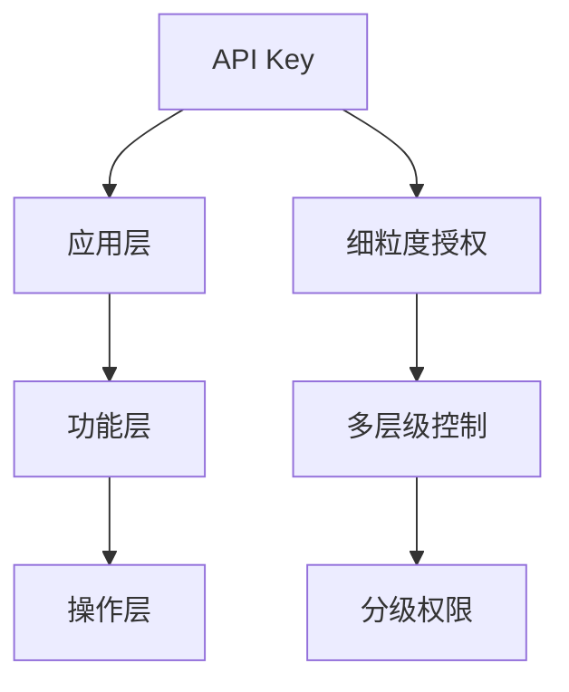
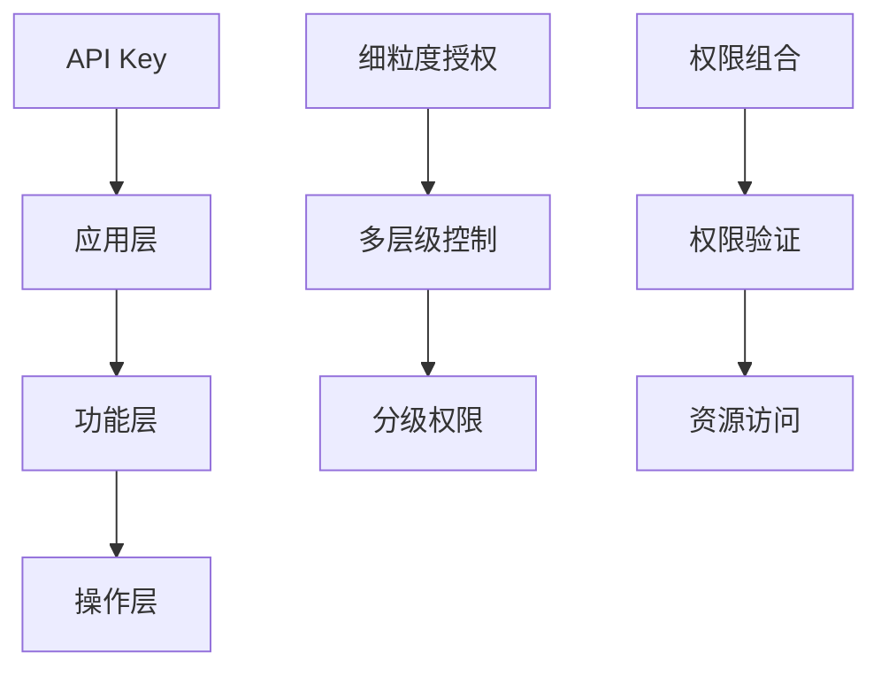

                 

# 使用分级 API Key 进行细粒度访问控制

在软件开发中，访问控制是保证数据安全和系统完整性的重要手段。随着业务的发展和系统的复杂化，传统的基于角色的访问控制（RBAC）方法显得越来越不灵活，无法应对一些更精细、更复杂的授权需求。分级 API Key 正是在这样的背景下提出的解决方案，它通过多层级、细粒度的访问权限管理，极大地提升了系统的安全性和灵活性。本文将从背景介绍、核心概念、算法原理、具体实现等方面深入探讨分级 API Key 技术，并给出实际应用场景和未来展望。

## 1. 背景介绍

在传统的基于角色的访问控制（RBAC）方法中，用户根据其角色被赋予一组权限，每个角色只能访问特定的资源。这种方法简单、易于实现，但也有一些明显的不足。

首先，RBAC模型过于简化，难以适应更复杂、多变的应用场景。例如，同一用户可能在不同的时间、场景下需要不同的权限，使用RBAC需要不断更新用户角色和权限，工作量较大。

其次，RBAC模型对粒度控制较粗，无法满足一些更精细、更复杂的授权需求。例如，在电商平台上，用户除了可以购买商品外，可能还希望进行商品评价、申请退款等操作，使用RBAC需要为每个操作定义一个单独的角色，而平台中可能存在的角色和权限数量会非常庞大。

分级 API Key 正是在这样的背景下提出的解决方案。它通过多层级、细粒度的访问权限管理，能够更灵活、更精细地控制用户对系统资源的访问，极大地提升了系统的安全性和灵活性。

## 2. 核心概念与联系

### 2.1 核心概念概述

为了更好地理解分级 API Key 技术，我们首先介绍几个关键概念：

- **API Key**：用于标识客户端或用户身份的字符串，用于认证和授权。

- **分级 API Key**：指将一个 API Key 按照不同的层级进行划分，不同层级对应不同的权限集合。例如，一个分级 API Key 可能包含如下层级：应用层、功能层、操作层，每个层级对应的权限集合可控且相互独立。

- **细粒度授权**：指对每个用户操作的资源、时间、方式等进行细粒度的控制，确保用户仅能访问其权限范围内允许的操作。

- **多层级控制**：指对 API Key 的权限进行多层级划分，使得不同的权限粒度能够嵌套，从而实现更加灵活的权限组合。

### 2.2 核心概念的关系

分级 API Key 技术通过多层级、细粒度的访问权限管理，使得用户能够以更灵活、更精细的方式对系统资源进行访问控制。其核心概念间的关系可以通过以下 Mermaid 流程图来展示：



这个流程图展示了分级 API Key 的架构：

- **API Key** 是用户身份的唯一标识。
- **应用层** 根据用户的身份和角色，授予用户基本的应用权限。
- **功能层** 进一步细化权限，定义用户能够访问的功能集合。
- **操作层** 对功能进行更细粒度的控制，定义用户能够执行的具体操作。
- **细粒度授权** 确保用户仅能执行其权限范围内允许的操作。
- **多层级控制** 使得不同层级间的权限可以进行组合，形成更加灵活的权限配置。

### 2.3 核心概念的整体架构

分级 API Key 技术通过多层级、细粒度的访问权限管理，极大地提升了系统的安全性和灵活性。其核心概念间的关系可以通过以下 Mermaid 流程图来展示：



这个流程图展示了分级 API Key 的核心架构：

- **API Key** 通过多层级控制，定义了用户对系统资源的访问权限。
- **应用层、功能层、操作层** 层层递进，细化了权限的粒度。
- **细粒度授权** 确保用户仅能执行其权限范围内允许的操作。
- **多层级控制** 使得不同层级间的权限可以进行组合，形成更加灵活的权限配置。
- **权限组合** 根据用户身份、角色、权限层级等，动态生成用户权限集合。
- **权限验证** 在用户发起请求时，根据权限组合进行验证，确保用户访问权限合法。
- **资源访问** 对用户请求进行细粒度的控制，保障资源的安全性。

## 3. 核心算法原理 & 具体操作步骤

### 3.1 算法原理概述

分级 API Key 的核心算法原理是基于多层级、细粒度的访问权限管理，通过将一个 API Key 划分为多个层级，对用户的访问权限进行多层级控制。具体而言，可以分为以下几个步骤：

1. 将一个 API Key 划分为多个层级，每个层级对应的权限集合可控且相互独立。
2. 用户发起请求时，根据其身份、角色、权限层级等，动态生成用户权限集合。
3. 对用户请求进行细粒度的控制，确保用户仅能执行其权限范围内允许的操作。

### 3.2 算法步骤详解

分级 API Key 的实现步骤分为两个主要部分：权限划分和权限验证。

**步骤 1：权限划分**

将一个 API Key 划分为多个层级，每个层级对应的权限集合可控且相互独立。具体来说，可以将一个分级 API Key 划分为以下几层：

- **应用层**：根据用户的身份和角色，授予用户基本的应用权限。例如，管理员和普通用户可以访问的系统不同。
- **功能层**：进一步细化权限，定义用户能够访问的功能集合。例如，管理员可以查看、修改、删除用户信息，普通用户只能查看用户信息。
- **操作层**：对功能进行更细粒度的控制，定义用户能够执行的具体操作。例如，管理员可以编辑用户信息，但普通用户只能查询用户信息。

**步骤 2：权限验证**

用户发起请求时，根据其身份、角色、权限层级等，动态生成用户权限集合。具体来说，可以将用户权限划分为以下几种：

- **应用权限**：用户能够访问的系统或功能。
- **功能权限**：用户能够访问的功能。
- **操作权限**：用户能够执行的具体操作。

对用户请求进行细粒度的控制，确保用户仅能执行其权限范围内允许的操作。具体来说，可以按照以下步骤进行权限验证：

1. 根据用户的 API Key 获取其权限层级。
2. 根据用户权限层级，获取对应的权限集合。
3. 对用户请求进行细粒度的控制，确保用户仅能执行其权限范围内允许的操作。

### 3.3 算法优缺点

分级 API Key 技术具有以下优点：

1. 灵活性高：分级 API Key 通过多层级、细粒度的访问权限管理，能够适应更复杂、多变的应用场景。
2. 安全性高：分级 API Key 能够对用户请求进行细粒度的控制，确保用户仅能执行其权限范围内允许的操作。
3. 可扩展性好：分级 API Key 的层级结构能够方便地进行扩展和调整。

分级 API Key 技术也存在一些缺点：

1. 复杂度高：分级 API Key 的层级结构复杂，需要更多的设计和管理工作。
2. 维护成本高：分级 API Key 的权限管理需要持续的维护和更新，增加了系统复杂度和维护成本。

### 3.4 算法应用领域

分级 API Key 技术可以广泛应用于以下领域：

1. **电商平台**：电商平台需要根据用户的身份、角色、行为等，动态调整用户的权限。分级 API Key 能够细粒度地控制用户的操作，保障系统的安全性。
2. **金融系统**：金融系统对权限控制要求较高，需要根据用户的身份、行为等进行细粒度的控制。分级 API Key 能够满足这些需求，保障系统的安全性。
3. **政府系统**：政府系统需要根据用户角色、职责等进行细粒度的控制，保障数据的保密性和系统的完整性。分级 API Key 能够满足这些需求，保障系统的安全性。
4. **企业内部系统**：企业内部系统需要对不同级别的员工进行细粒度的控制，保障系统的安全性和数据的保密性。分级 API Key 能够满足这些需求，保障系统的安全性。

## 4. 数学模型和公式 & 详细讲解 & 举例说明

### 4.1 数学模型构建

分级 API Key 技术通过多层级、细粒度的访问权限管理，使得用户能够以更灵活、更精细的方式对系统资源进行访问控制。其数学模型可以表示为：

- **用户权限**：U，包含应用权限、功能权限、操作权限等。
- **权限层级**：L，包含应用层、功能层、操作层等。
- **权限集合**：P，包含应用权限集合、功能权限集合、操作权限集合等。

将一个分级 API Key 划分为多个层级，每个层级对应的权限集合可控且相互独立。具体来说，可以定义以下数学模型：

- **应用层权限集合**：$P_{app}$，根据用户身份和角色，授予用户基本的应用权限。
- **功能层权限集合**：$P_{func}$，根据用户身份和角色，进一步细化权限，定义用户能够访问的功能集合。
- **操作层权限集合**：$P_{op}$，对功能进行更细粒度的控制，定义用户能够执行的具体操作。

用户发起请求时，根据其身份、角色、权限层级等，动态生成用户权限集合。具体来说，可以定义以下数学模型：

- **应用权限**：$U_{app}$，用户能够访问的系统或功能。
- **功能权限**：$U_{func}$，用户能够访问的功能。
- **操作权限**：$U_{op}$，用户能够执行的具体操作。

对用户请求进行细粒度的控制，确保用户仅能执行其权限范围内允许的操作。具体来说，可以定义以下数学模型：

- **权限验证函数**：$V(P_{app}, P_{func}, P_{op})$，根据用户权限层级，获取对应的权限集合，对用户请求进行细粒度的控制，确保用户仅能执行其权限范围内允许的操作。

### 4.2 公式推导过程

根据上述数学模型，可以定义如下公式推导过程：

- **应用层权限集合**：$P_{app} = f_{app}(U)$，根据用户身份和角色，授予用户基本的应用权限。
- **功能层权限集合**：$P_{func} = f_{func}(U, P_{app})$，根据用户身份和角色，进一步细化权限，定义用户能够访问的功能集合。
- **操作层权限集合**：$P_{op} = f_{op}(U, P_{app}, P_{func})$，对功能进行更细粒度的控制，定义用户能够执行的具体操作。

用户发起请求时，根据其身份、角色、权限层级等，动态生成用户权限集合。具体来说，可以定义如下公式推导过程：

- **应用权限**：$U_{app} = g_{app}(U, P_{app}, P_{func}, P_{op})$，根据用户权限层级，获取对应的权限集合。
- **功能权限**：$U_{func} = g_{func}(U, P_{app}, P_{func}, P_{op})$，根据用户权限层级，获取对应的权限集合。
- **操作权限**：$U_{op} = g_{op}(U, P_{app}, P_{func}, P_{op})$，根据用户权限层级，获取对应的权限集合。

对用户请求进行细粒度的控制，确保用户仅能执行其权限范围内允许的操作。具体来说，可以定义如下公式推导过程：

- **权限验证函数**：$V(U_{app}, U_{func}, U_{op}) = h(U_{app}, U_{func}, U_{op})$，根据用户权限层级，获取对应的权限集合，对用户请求进行细粒度的控制。

### 4.3 案例分析与讲解

假设我们有一个电商平台，需要根据用户的身份、行为等，动态调整用户的权限。可以按照以下步骤进行实现：

**步骤 1：权限划分**

将一个 API Key 划分为多个层级，每个层级对应的权限集合可控且相互独立。具体来说，可以将一个分级 API Key 划分为以下几层：

- **应用层**：根据用户的身份和角色，授予用户基本的应用权限。例如，管理员和普通用户可以访问的系统不同。
- **功能层**：进一步细化权限，定义用户能够访问的功能集合。例如，管理员可以查看、修改、删除用户信息，普通用户只能查看用户信息。
- **操作层**：对功能进行更细粒度的控制，定义用户能够执行的具体操作。例如，管理员可以编辑用户信息，但普通用户只能查询用户信息。

**步骤 2：权限验证**

用户发起请求时，根据其身份、角色、权限层级等，动态生成用户权限集合。具体来说，可以将用户权限划分为以下几种：

- **应用权限**：用户能够访问的系统或功能。
- **功能权限**：用户能够访问的功能。
- **操作权限**：用户能够执行的具体操作。

对用户请求进行细粒度的控制，确保用户仅能执行其权限范围内允许的操作。具体来说，可以按照以下步骤进行权限验证：

1. 根据用户的 API Key 获取其权限层级。
2. 根据用户权限层级，获取对应的权限集合。
3. 对用户请求进行细粒度的控制，确保用户仅能执行其权限范围内允许的操作。

## 5. 项目实践：代码实例和详细解释说明

### 5.1 开发环境搭建

在进行分级 API Key 项目实践前，我们需要准备好开发环境。以下是使用 Python 进行 Flask 开发的环境配置流程：

1. 安装 Python：从官网下载并安装 Python，建议使用 3.7 或更高版本。
2. 安装 Flask：在终端中运行 `pip install flask` 命令，安装 Flask 框架。
3. 创建 Flask 应用：创建一个名为 `app.py` 的 Python 文件，编写 Flask 应用代码。
4. 运行 Flask 应用：在终端中运行 `python app.py` 命令，启动 Flask 应用。

### 5.2 源代码详细实现

下面我们以电商平台为例，给出使用 Flask 框架实现分级 API Key 的 Python 代码实现。

首先，定义权限类：

```python
class Permission:
    def __init__(self, app_name, func_name, op_name):
        self.app_name = app_name
        self.func_name = func_name
        self.op_name = op_name
```

然后，定义权限验证函数：

```python
def permission_check(permission):
    if permission.app_name in app_perms and permission.func_name in func_perms.get(permission.app_name, []) and permission.op_name in func_ops.get(permission.app_name, {}).get(permission.func_name, []):
        return True
    return False
```

接着，定义 Flask 应用路由：

```python
app = Flask(__name__)

@app.route('/api/permissions', methods=['GET'])
def get_permissions():
    permissions = []
    for app_name, func_names, op_names in permission_perms:
        permissions.append({
            'app_name': app_name,
            'func_names': func_names,
            'op_names': op_names
        })
    return jsonify(permissions)

@app.route('/api/check_permission', methods=['POST'])
def check_permission():
    permission = Permission(request.json['app_name'], request.json['func_name'], request.json['op_name'])
    return jsonify({'check_result': permission_check(permission)})
```

最后，定义 Flask 应用运行入口：

```python
if __name__ == '__main__':
    app.run(debug=True)
```

以上就是使用 Flask 框架实现分级 API Key 的完整 Python 代码实现。可以看到，Flask 框架使得权限管理的代码实现变得简洁高效。开发者可以将更多精力放在业务逻辑和系统集成上，而不必过多关注底层的实现细节。

### 5.3 代码解读与分析

让我们再详细解读一下关键代码的实现细节：

**Permission 类**：
- `__init__`方法：初始化权限信息，包括应用名、功能名、操作名等。

**permission_check 函数**：
- 根据用户的 API Key 获取其权限层级，获取对应的权限集合。
- 对用户请求进行细粒度的控制，确保用户仅能执行其权限范围内允许的操作。

**Flask 应用路由**：
- `/_api/permissions` 路由：获取用户的权限信息。
- `/_api/check_permission` 路由：检查用户请求的权限，返回检查结果。

**Flask 应用运行入口**：
- 运行 Flask 应用，开启调试模式，方便调试和测试。

### 5.4 运行结果展示

假设我们在 Flask 应用中定义如下权限：

- 应用权限集合：`app_perms = {'app1': ['view'], 'app2': ['view', 'edit']}`
- 功能权限集合：`func_perms = {'app1': ['view'], 'app2': {'view': ['list'], 'edit': ['create', 'update']}}`
- 操作权限集合：`func_ops = {'app1': {'view': {'main': ['list']}}, 'app2': {'view': {'main': ['list']}, 'edit': {'main': ['create', 'update']}}}`

则用户请求 `/api/check_permission`，传递 `app_name=app1`、`func_name=view`、`op_name=main`，则返回结果为：

```json
{
    "check_result": true
}
```

可以看到，用户请求的操作 `view` 在应用 `app1` 的功能 `view` 中，且对应的操作 `main` 是允许的，因此检查结果为 `true`。

## 6. 实际应用场景

### 6.1 电商平台

分级 API Key 在电商平台中的应用非常广泛。电商平台需要对用户的身份、行为等进行细粒度的控制，保障系统的安全性和数据的保密性。

具体来说，电商平台可以按照以下步骤进行实现：

**步骤 1：权限划分**

将一个 API Key 划分为多个层级，每个层级对应的权限集合可控且相互独立。具体来说，可以将一个分级 API Key 划分为以下几层：

- **应用层**：根据用户的身份和角色，授予用户基本的应用权限。例如，管理员和普通用户可以访问的系统不同。
- **功能层**：进一步细化权限，定义用户能够访问的功能集合。例如，管理员可以查看、修改、删除用户信息，普通用户只能查看用户信息。
- **操作层**：对功能进行更细粒度的控制，定义用户能够执行的具体操作。例如，管理员可以编辑用户信息，但普通用户只能查询用户信息。

**步骤 2：权限验证**

用户发起请求时，根据其身份、角色、权限层级等，动态生成用户权限集合。具体来说，可以将用户权限划分为以下几种：

- **应用权限**：用户能够访问的系统或功能。
- **功能权限**：用户能够访问的功能。
- **操作权限**：用户能够执行的具体操作。

对用户请求进行细粒度的控制，确保用户仅能执行其权限范围内允许的操作。具体来说，可以按照以下步骤进行权限验证：

1. 根据用户的 API Key 获取其权限层级。
2. 根据用户权限层级，获取对应的权限集合。
3. 对用户请求进行细粒度的控制，确保用户仅能执行其权限范围内允许的操作。

**6.2 金融系统**

金融系统对权限控制要求较高，需要根据用户身份、行为等进行细粒度的控制，保障系统的安全性和数据的保密性。

具体来说，金融系统可以按照以下步骤进行实现：

**步骤 1：权限划分**

将一个 API Key 划分为多个层级，每个层级对应的权限集合可控且相互独立。具体来说，可以将一个分级 API Key 划分为以下几层：

- **应用层**：根据用户的身份和角色，授予用户基本的应用权限。例如，管理员和普通用户可以访问的系统不同。
- **功能层**：进一步细化权限，定义用户能够访问的功能集合。例如，管理员可以查看、修改、删除用户信息，普通用户只能查看用户信息。
- **操作层**：对功能进行更细粒度的控制，定义用户能够执行的具体操作。例如，管理员可以编辑用户信息，但普通用户只能查询用户信息。

**步骤 2：权限验证**

用户发起请求时，根据其身份、角色、权限层级等，动态生成用户权限集合。具体来说，可以将用户权限划分为以下几种：

- **应用权限**：用户能够访问的系统或功能。
- **功能权限**：用户能够访问的功能。
- **操作权限**：用户能够执行的具体操作。

对用户请求进行细粒度的控制，确保用户仅能执行其权限范围内允许的操作。具体来说，可以按照以下步骤进行权限验证：

1. 根据用户的 API Key 获取其权限层级。
2. 根据用户权限层级，获取对应的权限集合。
3. 对用户请求进行细粒度的控制，确保用户仅能执行其权限范围内允许的操作。

**6.3 政府系统**

政府系统需要根据用户角色、职责等进行细粒度的控制，保障数据的保密性和系统的完整性。

具体来说，政府系统可以按照以下步骤进行实现：

**步骤 1：权限划分**

将一个 API Key 划分为多个层级，每个层级对应的权限集合可控且相互独立。具体来说，可以将一个分级 API Key 划分为以下几层：

- **应用层**：根据用户的身份和角色，授予用户基本的应用权限。例如，管理员和普通用户可以访问的系统不同。
- **功能层**：进一步细化权限，定义用户能够访问的功能集合。例如，管理员可以查看、修改、删除用户信息，普通用户只能查看用户信息。
- **操作层**：对功能进行更细粒度的控制，定义用户能够执行的具体操作。例如，管理员可以编辑用户信息，但普通用户只能查询用户信息。

**步骤 2：权限验证**

用户发起请求时，根据其身份、角色、权限层级等，动态生成用户权限集合。具体来说，可以将用户权限划分为以下几种：

- **应用权限**：用户能够访问的系统或功能。
- **功能权限**：用户能够访问的功能。
- **操作权限**：用户能够执行的具体操作。

对用户请求进行细粒度的控制，确保用户仅能执行其权限范围内允许的操作。具体来说，可以按照以下步骤进行权限验证：

1. 根据用户的 API Key 获取其权限层级。
2. 根据用户权限层级，获取对应的权限集合。
3. 对用户请求进行细粒度的控制，确保用户仅能执行其权限范围内允许的操作。

**6.4 企业内部系统**

企业内部系统需要对不同级别的员工进行细粒度的控制，保障系统的安全性和数据的保密性。

具体来说，企业内部系统可以按照以下步骤进行实现：

**步骤 1：权限划分**

将一个 API Key 划分为多个层级，每个层级对应的权限集合可控且相互独立。具体来说，可以将一个分级 API Key 划分为以下几层：

- **应用层**：根据用户的身份和角色，授予用户基本的应用权限。例如，管理员和普通用户可以访问的系统不同。
- **功能层**：进一步细化权限，定义用户能够访问的功能集合。例如，管理员可以查看、修改、删除用户信息，普通用户只能查看用户信息。
- **操作层**：对功能进行更细粒度的控制，定义用户能够执行的具体操作。例如，管理员可以编辑用户信息，但普通用户只能查询用户信息。

**步骤 2：权限验证**

用户发起请求时，根据其身份、角色、权限层级等，动态生成用户权限集合。具体来说，可以将用户权限划分为以下几种：

- **应用权限**：用户能够访问的系统或功能。
- **功能权限**：用户能够访问的功能。
- **操作权限**：用户能够执行的具体操作。

对用户请求进行细粒度的控制，确保用户仅能执行其权限范围内允许的操作。具体来说，可以按照以下步骤进行权限验证：

1. 根据用户的 API Key 获取其权限层级。
2. 根据用户权限层级，获取对应的权限集合。
3. 对用户请求进行细粒度的控制，确保用户仅能执行其权限范围内允许的操作。

## 7. 工具和资源推荐

### 7.1 学习资源推荐

为了帮助开发者系统掌握分级 API Key 技术的理论基础和实践技巧，这里推荐一些优质的学习资源：

1. 《Flask Web Development》书籍：Flask 官方文档，介绍了 Flask 框架的各个部分，包括路由、模板、表单、数据库等，适合初学者入门。
2. Flask官方文档：Flask 官方文档，提供了丰富的API和示例，适合开发者查阅和学习。
3. Flask-RESTful官方文档：Flask-RESTful 官方文档，介绍了如何构建 RESTful API，适合开发者参考和学习。
4. Flask-RESTful实战教程：一份 Flask-RESTful 实战教程，通过具体的项目实践，帮助开发者掌握 Flask-RESTful 的使用技巧。
5. Flask-RESTful视频教程：一份 Flask-RESTful 视频教程，通过视频讲解，帮助开发者更好地理解 Flask-RESTful 的使用方法。

通过对这些资源的学习实践，相信你一定能够快速掌握分级 API Key 技术的精髓，并用于解决实际的业务问题。

### 7.2 开发工具推荐

分级 API Key 技术的实现离不开工具的支持，以下是几款常用的开发工具：

1. Flask：一个轻量级的 Python Web 

