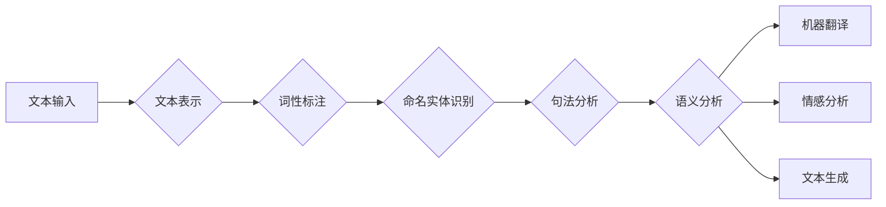

# 自然语言处理 原理与代码实例讲解

> 关键词：自然语言处理，NLP，机器学习，深度学习，文本分析，情感分析，实体识别，语言模型

## 1. 背景介绍

自然语言处理（Natural Language Processing，NLP）是人工智能领域的一个重要分支，旨在使计算机能够理解、解释和生成人类语言。随着深度学习技术的快速发展，NLP取得了显著的进展，并广泛应用于搜索引擎、机器翻译、智能客服、推荐系统等多个领域。本文将深入探讨NLP的基本原理、核心算法、代码实例，并展望其未来发展趋势。

## 2. 核心概念与联系

### 2.1 核心概念

自然语言处理的核心概念包括：

- **文本表示**：将文本转化为计算机可以处理的数据结构，如词向量、句向量等。
- **词性标注**：对句子中的单词进行分类，如名词、动词、形容词等。
- **命名实体识别**：识别句子中的特定实体，如人名、地名、组织名等。
- **句法分析**：分析句子的结构，如句法树等。
- **语义分析**：理解句子所表达的含义，包括语义角色标注、语义关系抽取等。
- **机器翻译**：将一种语言的文本翻译成另一种语言。
- **情感分析**：分析文本的情感倾向，如正面、负面、中性等。
- **文本生成**：根据输入生成文本，如问答系统、自动摘要等。

### 2.2 架构流程图



## 3. 核心算法原理 & 具体操作步骤

### 3.1 算法原理概述

自然语言处理的算法主要分为以下几类：

- **统计方法**：基于统计模型，如隐马尔可夫模型（HMM）、条件随机场（CRF）等。
- **深度学习方法**：基于神经网络，如卷积神经网络（CNN）、循环神经网络（RNN）、长短时记忆网络（LSTM）、门控循环单元（GRU）、Transformer等。

### 3.2 算法步骤详解

1. **数据预处理**：对原始文本进行清洗、分词、去除停用词等操作。
2. **文本表示**：将文本转化为数值化的向量表示，如词袋模型、TF-IDF、词向量等。
3. **特征提取**：从文本中提取有用的特征，如词性、命名实体、句法结构等。
4. **模型训练**：使用机器学习方法对模型进行训练。
5. **模型评估**：使用测试集评估模型的性能。

### 3.3 算法优缺点

#### 统计方法的优缺点

- **优点**：计算简单，易于实现。
- **缺点**：难以处理长距离依赖问题，泛化能力有限。

#### 深度学习方法的优缺点

- **优点**：能够处理长距离依赖问题，泛化能力强。
- **缺点**：训练数据量大，计算复杂度高。

## 4. 数学模型和公式 & 详细讲解 & 举例说明

### 4.1 数学模型构建

#### 词向量

词向量是将单词转化为向量表示的方法，常见的词向量模型包括Word2Vec、GloVe、FastText等。

$$
\text{word\_vector} = W \cdot \text{word\_embedding}
$$

其中，$W$ 是权重矩阵，$\text{word\_embedding}$ 是词向量。

#### 长短时记忆网络（LSTM）

LSTM是一种特殊的RNN，能够有效处理长距离依赖问题。

$$
\text{h}_{t} = \sigma(\text{f}_t(\text{h}_{t-1}, \text{x}_t, \text{C}_{t-1})) \otimes \text{C}_t
$$

其中，$\sigma$ 是sigmoid函数，$\text{f}_t$ 是 forget gate，$\text{x}_t$ 是输入，$\text{h}_{t-1}$ 是上一个时间步的隐藏状态，$\text{C}_{t-1}$ 是上一个时间步的细胞状态。

### 4.2 公式推导过程

以LSTM为例，推导其遗忘门、输入门和输出门的公式。

#### 遗忘门

$$
\text{f}_t = \sigma(W_f \cdot [\text{h}_{t-1}, \text{x}_t] + b_f)
$$

其中，$W_f$ 是遗忘门权重矩阵，$b_f$ 是遗忘门偏置，$[\cdot]$ 表示拼接操作。

#### 输入门

$$
\text{i}_t = \sigma(W_i \cdot [\text{h}_{t-1}, \text{x}_t] + b_i)
$$

其中，$W_i$ 是输入门权重矩阵，$b_i$ 是输入门偏置。

#### 输出门

$$
\text{o}_t = \sigma(W_o \cdot [\text{h}_{t-1}, \text{x}_t] + b_o)
$$

其中，$W_o$ 是输出门权重矩阵，$b_o$ 是输出门偏置。

#### 细胞状态

$$
\text{C}_t = \text{f}_t \cdot \text{C}_{t-1} + \text{i}_t \cdot \text{g}_t
$$

其中，$\text{g}_t = \text{tanh}(W_g \cdot [\text{h}_{t-1}, \text{x}_t] + b_g)$ 是新的细胞状态。

### 4.3 案例分析与讲解

以情感分析任务为例，使用LSTM模型对文本进行情感倾向分类。

1. **数据预处理**：对文本进行分词、去除停用词等操作，并将单词转化为词向量。
2. **模型构建**：构建LSTM模型，包括输入层、LSTM层、输出层等。
3. **模型训练**：使用标注数据进行模型训练，调整模型参数。
4. **模型评估**：使用测试集评估模型性能，计算准确率、召回率、F1值等指标。

## 5. 项目实践：代码实例和详细解释说明

### 5.1 开发环境搭建

1. 安装Python和pip。
2. 安装TensorFlow或PyTorch等深度学习框架。
3. 安装jieba分词等文本处理库。

### 5.2 源代码详细实现

以下使用PyTorch实现一个简单的情感分析模型：

```python
import torch
import torch.nn as nn

class SentimentAnalysis(nn.Module):
    def __init__(self, vocab_size, embedding_dim, hidden_dim, output_dim):
        super(SentimentAnalysis, self).__init__()
        self.embedding = nn.Embedding(vocab_size, embedding_dim)
        self.lstm = nn.LSTM(embedding_dim, hidden_dim, batch_first=True)
        self.fc = nn.Linear(hidden_dim, output_dim)

    def forward(self, text):
        embedded = self.embedding(text)
        output, (hidden, cell) = self.lstm(embedded)
        output = self.fc(output[:, -1, :])
        return output

# 实例化模型
model = SentimentAnalysis(vocab_size=10000, embedding_dim=50, hidden_dim=128, output_dim=1)

# 训练模型
# ...

# 评估模型
# ...
```

### 5.3 代码解读与分析

- `SentimentAnalysis` 类：定义了情感分析模型，包括嵌入层、LSTM层和全连接层。
- `forward` 方法：定义了模型的正向传播过程，包括嵌入、LSTM和全连接操作。

### 5.4 运行结果展示

运行上述代码后，可以在测试集上评估模型性能，计算准确率、召回率、F1值等指标。

## 6. 实际应用场景

自然语言处理技术在各个领域都有广泛的应用，以下列举几个常见应用场景：

- **搜索引擎**：使用NLP技术对网页进行索引和检索，提高搜索结果的准确性和相关性。
- **机器翻译**：将一种语言的文本翻译成另一种语言，促进不同语言之间的交流。
- **智能客服**：使用NLP技术构建智能客服系统，自动回答用户咨询，提高服务效率。
- **推荐系统**：使用NLP技术对用户兴趣进行建模，提高推荐系统的准确性。
- **问答系统**：使用NLP技术构建问答系统，回答用户提出的问题。
- **文本摘要**：使用NLP技术将长文本压缩成简洁的摘要。

## 7. 工具和资源推荐

### 7.1 学习资源推荐

- 《自然语言处理综论》
- 《深度学习与自然语言处理》
- 《自然语言处理入门》

### 7.2 开发工具推荐

- TensorFlow
- PyTorch
- NLTK
- spaCy

### 7.3 相关论文推荐

- Word2Vec
- GloVe
- BERT
- GPT-3

## 8. 总结：未来发展趋势与挑战

### 8.1 研究成果总结

自然语言处理技术在过去几十年取得了显著的进展，在文本表示、模型架构、算法优化等方面取得了重要突破。

### 8.2 未来发展趋势

- **多模态融合**：将文本信息与其他模态信息（如图像、视频、语音）进行融合，提高模型的感知能力。
- **少样本学习**：在标注数据有限的情况下，提高模型的泛化能力。
- **可解释性**：提高模型的可解释性，增强用户对模型的信任度。

### 8.3 面临的挑战

- **数据偏见**：如何消除数据中的偏见，避免模型输出歧视性结果。
- **计算效率**：如何提高模型的计算效率，降低部署成本。
- **可解释性**：如何提高模型的可解释性，让用户了解模型的决策过程。

### 8.4 研究展望

自然语言处理技术将继续发展，为人类社会带来更多便利和创新。未来，NLP技术将与其他人工智能技术深度融合，推动人工智能向更加智能化、人性化方向发展。

## 9. 附录：常见问题与解答

**Q1：什么是自然语言处理？**

A：自然语言处理（Natural Language Processing，NLP）是人工智能领域的一个重要分支，旨在使计算机能够理解、解释和生成人类语言。

**Q2：自然语言处理有哪些应用场景？**

A：自然语言处理技术在各个领域都有广泛的应用，包括搜索引擎、机器翻译、智能客服、推荐系统、问答系统、文本摘要等。

**Q3：如何选择合适的自然语言处理模型？**

A：选择合适的自然语言处理模型需要根据具体任务和数据进行。例如，对于文本分类任务，可以使用深度学习模型；对于序列标注任务，可以使用RNN或Transformer模型。

**Q4：如何提高自然语言处理模型的性能？**

A：提高自然语言处理模型性能的方法包括：使用更高质量的标注数据、改进模型架构、优化训练过程、引入知识增强等。

**Q5：自然语言处理技术有哪些挑战？**

A：自然语言处理技术面临的挑战包括：数据偏见、计算效率、可解释性等。

作者：禅与计算机程序设计艺术 / Zen and the Art of Computer Programming