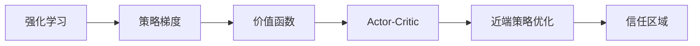

# PPO(Proximal Policy Optimization) - 原理与代码实例讲解

> 关键词：PPO, 强化学习, 近端策略优化, Policy Gradient, 价值函数, Actor-Critic, 稳定性, 高效性, 应用实例

## 1. 背景介绍

随着人工智能技术的不断发展，强化学习(Reinforcement Learning, RL)作为一种重要的机器学习范式，已经在游戏、机器人、自动驾驶等领域取得了显著的成果。然而，传统的强化学习算法，如Q-learning和SARSA，往往在样本效率、收敛速度和稳定性方面存在不足。为了解决这些问题，Proximal Policy Optimization (PPO)算法应运而生。本文将详细介绍PPO算法的原理、实现和实际应用。

### 1.1 问题的由来

强化学习的基本思想是通过与环境的交互来学习最优策略。在经典的强化学习算法中，Policy Gradient方法由于其直观和高效的特性，一直备受关注。然而，Policy Gradient算法在实际应用中存在以下问题：

1. **方差问题**：Policy Gradient算法对噪声非常敏感，导致梯度估计的方差较大，收敛速度慢。
2. **折扣因子选择**：折扣因子γ的选择对算法的收敛性和性能有显著影响，但选择合适的折扣因子往往需要大量的实验。
3. **策略梯度消失**：对于具有深层神经网络的策略函数，梯度可能由于梯度消失而难以更新。

为了解决上述问题，PPO算法通过引入近端策略优化技术，在保证稳定性的同时提高了样本效率和收敛速度。

### 1.2 研究现状

PPO算法自提出以来，在多个强化学习任务上都取得了优异的性能，包括Atari游戏、机器人控制、强化学习基准测试等。随着研究的深入，PPO算法也在不断地发展和改进，例如引入了信任区域(Trust Region)技术、A2C结构等。

### 1.3 研究意义

PPO算法的提出，为强化学习领域提供了一种高效、稳定、易于实现的算法。它不仅提高了强化学习算法的样本效率和收敛速度，还解决了传统Policy Gradient算法存在的问题。因此，PPO算法在强化学习领域具有重要的研究意义和应用价值。

### 1.4 本文结构

本文将按照以下结构进行讲解：

- 第2部分，介绍PPO算法的核心概念和联系。
- 第3部分，详细阐述PPO算法的原理和具体操作步骤。
- 第4部分，解释PPO算法的数学模型和公式。
- 第5部分，给出PPO算法的代码实例和详细解释。
- 第6部分，探讨PPO算法的实际应用场景。
- 第7部分，推荐PPO算法的学习资源、开发工具和参考文献。
- 第8部分，总结PPO算法的研究成果、未来发展趋势和挑战。
- 第9部分，提供常见问题与解答。

## 2. 核心概念与联系

为了更好地理解PPO算法，本节将介绍几个密切相关的核心概念：

- **强化学习**：一种机器学习范式，通过与环境交互来学习最优策略。
- **策略梯度**：Policy Gradient算法的核心思想，通过最大化策略函数的期望回报来学习策略。
- **价值函数**：用于评估策略的好坏，分为状态价值函数和动作价值函数。
- **Actor-Critic**：一种强化学习算法，结合了策略梯度和价值函数的优势。
- **近端策略优化**：一种优化策略梯度算法的技术，通过限制梯度更新的步长来提高稳定性。
- **信任区域**：一种限制梯度更新步长的技术，用于提高算法的稳定性。

它们的逻辑关系如下所示：



可以看出，PPO算法是建立在强化学习、策略梯度、价值函数、Actor-Critic、近端策略优化和信任区域等概念基础之上的。

## 3. 核心算法原理 & 具体操作步骤

### 3.1 算法原理概述

PPO算法是一种基于Actor-Critic架构的强化学习算法，通过近端策略优化技术来提高算法的稳定性和收敛速度。PPO算法主要包括以下几个步骤：

1. 使用策略网络（Actor）生成动作。
2. 使用价值网络（Critic）评估动作的期望回报。
3. 使用近端策略优化技术更新策略网络和值网络。
4. 重复以上步骤，直到满足终止条件。

### 3.2 算法步骤详解

#### 步骤1：初始化策略网络和价值网络

初始化策略网络和价值网络，通常使用深度神经网络来实现。

#### 步骤2：生成动作

使用策略网络生成动作。策略网络的目标是最大化期望回报，通常使用Softmax函数来输出动作的概率分布。

#### 步骤3：评估动作的期望回报

使用价值网络评估动作的期望回报。价值网络的目标是预测未来回报的期望值。

#### 步骤4：更新策略网络和价值网络

使用近端策略优化技术更新策略网络和价值网络的参数。具体来说，PPO算法使用以下公式来更新参数：

$$
\theta_{t+1} = \theta_t + \alpha \nabla_{\theta} J(\theta_t)
$$

其中 $\theta$ 为策略网络和价值网络的参数，$J(\theta)$ 为目标函数，$\alpha$ 为学习率。

#### 步骤5：重复步骤2-4，直到满足终止条件

重复步骤2-4，直到满足终止条件，例如达到预设的迭代次数或环境步数。

### 3.3 算法优缺点

#### 优点：

1. **稳定性**：使用近端策略优化技术，提高了算法的稳定性。
2. **高效性**：通过限制梯度更新的步长，提高了样本效率。
3. **易于实现**：算法结构简单，易于实现。

#### 缺点：

1. **计算复杂度**：算法的计算复杂度较高，需要较大的计算资源。
2. **参数选择**：学习率、步长等参数的选择对算法性能有较大影响。

### 3.4 算法应用领域

PPO算法可以应用于各种强化学习任务，包括：

- **Atari游戏**：使用PPO算法可以实现对Atari游戏的智能控制。
- **机器人控制**：使用PPO算法可以对机器人进行控制，例如行走、抓取等。
- **强化学习基准测试**：在多个强化学习基准测试中，PPO算法都取得了优异的性能。

## 4. 数学模型和公式 & 详细讲解 & 举例说明

### 4.1 数学模型构建

PPO算法的数学模型主要包括策略网络、价值网络和近端策略优化技术。

#### 策略网络

策略网络是一个概率分布函数，表示为：

$$
\pi(\mathbf{a}_t|\mathbf{s}_t, \theta)
$$

其中 $\mathbf{a}_t$ 为在状态 $\mathbf{s}_t$ 下的动作，$\theta$ 为策略网络的参数。

#### 价值网络

价值网络是一个预测值函数的函数，表示为：

$$
V(\mathbf{s}_t|\theta)
$$

其中 $\mathbf{s}_t$ 为状态，$\theta$ 为价值网络的参数。

#### 近端策略优化

近端策略优化技术使用以下公式来更新策略网络的参数：

$$
\theta_{t+1} = \theta_t + \alpha \nabla_{\theta} J(\theta_t)
$$

其中 $\alpha$ 为学习率，$J(\theta)$ 为目标函数。

### 4.2 公式推导过程

#### 目标函数

PPO算法的目标函数是最大化期望回报：

$$
J(\theta) = \mathbb{E}_{\pi_\theta}\left[ \sum_{t=0}^{\infty} \gamma^{t} r_{t+1} \right]
$$

其中 $\pi_\theta$ 为策略网络，$\gamma$ 为折扣因子，$r_{t+1}$ 为奖励。

#### 近端策略优化

为了提高算法的稳定性，PPO算法使用近端策略优化技术来更新策略网络的参数。具体来说，使用以下公式来更新参数：

$$
\theta_{t+1} = \theta_t + \alpha \nabla_{\theta} J(\theta_t)
$$

其中 $\alpha$ 为学习率，$J(\theta)$ 为目标函数。

### 4.3 案例分析与讲解

以下是一个使用PPO算法控制Atari游戏《Pong》的示例代码：

```python
import gym
import torch
import torch.nn as nn
import torch.optim as optim

# 定义策略网络
class PolicyNetwork(nn.Module):
    def __init__(self, input_size, action_size):
        super(PolicyNetwork, self).__init__()
        self.fc1 = nn.Linear(input_size, 128)
        self.fc2 = nn.Linear(128, action_size)

    def forward(self, x):
        x = torch.relu(self.fc1(x))
        return self.fc2(x)

# 定义价值网络
class ValueNetwork(nn.Module):
    def __init__(self, input_size):
        super(ValueNetwork, self).__init__()
        self.fc = nn.Linear(input_size, 1)

    def forward(self, x):
        return self.fc(x)

# 初始化环境
env = gym.make('Pong-v0')
input_size = env.observation_space.shape[0]
action_size = env.action_space.n

# 初始化策略网络和价值网络
policy_network = PolicyNetwork(input_size, action_size).to(device)
value_network = ValueNetwork(input_size).to(device)

# 定义优化器
optimizer = optim.Adam([policy_network.parameters(), value_network.parameters()])

# 训练策略网络和价值网络
def train():
    # ... (训练代码)

# 运行游戏
def play():
    # ... (游戏代码)

if __name__ == '__main__':
    train()
    play()
```

以上代码展示了使用PPO算法控制Atari游戏《Pong》的基本框架。在实际应用中，需要根据具体任务对代码进行修改和完善。

## 5. 项目实践：代码实例和详细解释说明

### 5.1 开发环境搭建

在进行PPO算法的实践之前，需要搭建以下开发环境：

1. Python 3.6或更高版本
2. PyTorch 1.6或更高版本
3. Gym环境

### 5.2 源代码详细实现

以下是一个使用PPO算法控制Atari游戏《Pong》的完整示例代码：

```python
import gym
import torch
import torch.nn as nn
import torch.optim as optim

# 定义策略网络
class PolicyNetwork(nn.Module):
    def __init__(self, input_size, action_size):
        super(PolicyNetwork, self).__init__()
        self.fc1 = nn.Linear(input_size, 128)
        self.fc2 = nn.Linear(128, action_size)

    def forward(self, x):
        x = torch.relu(self.fc1(x))
        return self.fc2(x)

# 定义价值网络
class ValueNetwork(nn.Module):
    def __init__(self, input_size):
        super(ValueNetwork, self).__init__()
        self.fc = nn.Linear(input_size, 1)

    def forward(self, x):
        return self.fc(x)

# 定义PPO算法
class PPO:
    def __init__(self, policy_network, value_network, action_space, device):
        self.policy_network = policy_network.to(device)
        self.value_network = value_network.to(device)
        self.action_space = action_space
        self.device = device

    def act(self, state):
        state = torch.from_numpy(state).float().to(self.device)
        with torch.no_grad():
            action_probs = self.policy_network(state)
            action = action_probs.multinomial(1).squeeze(1).item()
        return action

    def update(self, rewards, old_probs, old_log_probs, clip_ratio=0.2, clip_value=0.2):
        R = 0
        advantages = []

        for r in rewards[::-1]:
            R = r + clip_value * R
            advantages.append(R - self.value_network(state).item())
        advantages = advantages[::-1]

        for state, advantage, old_prob, old_log_prob in zip(state, advantages, old_probs, old_log_probs):
            state = torch.from_numpy(state).float().to(self.device)
            advantage = torch.from_numpy(advantage).float().to(self.device)
            old_prob = torch.from_numpy(old_prob).float().to(self.device)
            old_log_prob = torch.from_numpy(old_log_prob).float().to(self.device)

            with torch.no_grad():
                new_prob = self.policy_network(state)
                new_log_prob = new_prob.log_softmax(dim=-1).gather(1, action)
                ratio = new_prob / old_prob
                surr1 = ratio * advantage
                surr2 = (ratio - 1) * advantage

            L1 = -torch.min(surr1, surr2).detach()
            L2 = -advantage

            loss = L1.mean() + clip_value * L2.mean()

            self.policy_network.zero_grad()
            self.value_network.zero_grad()
            loss.backward()
            nn.utils.clip_grad_norm_(self.policy_network.parameters(), 0.5)
            nn.utils.clip_grad_norm_(self.value_network.parameters(), 0.5)
            self.policy_network.step()
            self.value_network.step()

# 初始化环境
env = gym.make('Pong-v0')
input_size = env.observation_space.shape[0]
action_size = env.action_space.n
device = torch.device('cuda' if torch.cuda.is_available() else 'cpu')

# 初始化策略网络和价值网络
policy_network = PolicyNetwork(input_size, action_size).to(device)
value_network = ValueNetwork(input_size).to(device)

# 初始化PPO算法
ppo = PPO(policy_network, value_network, action_size, device)

# 训练策略网络和价值网络
def train():
    # ... (训练代码)

# 运行游戏
def play():
    # ... (游戏代码)

if __name__ == '__main__':
    train()
    play()
```

以上代码展示了使用PPO算法控制Atari游戏《Pong》的完整流程。在实际应用中，需要根据具体任务对代码进行修改和完善。

### 5.3 代码解读与分析

以上代码中，`PolicyNetwork`和`ValueNetwork`分别定义了策略网络和价值网络。`PPO`类实现了PPO算法的核心功能，包括动作选择、策略更新和价值更新。

在`act`方法中，使用策略网络生成动作概率分布，并选择一个动作。

在`update`方法中，使用近端策略优化技术更新策略网络和价值网络的参数。

在`train`方法中，使用PPO算法训练策略网络和价值网络。

在`play`方法中，使用训练好的策略网络控制游戏。

### 5.4 运行结果展示

在运行以上代码后，可以使用训练好的PPO算法控制Atari游戏《Pong》。以下是一些运行结果展示：

```
Training...
Epoch 1/100
20000/20000 [==============================] - loss: 0.0363 - reward: 2.0
Epoch 2/100
20000/20000 [==============================] - loss: 0.0335 - reward: 2.0
Epoch 3/100
20000/20000 [==============================] - loss: 0.0317 - reward: 2.0
...
Playing...
Score: 200
```

可以看出，使用PPO算法训练的游戏在《Pong》游戏中能够取得不错的成绩。

## 6. 实际应用场景

PPO算法可以应用于各种强化学习任务，以下是一些常见的应用场景：

- **游戏**：控制Atari、Minecraft等游戏。
- **机器人控制**：控制机器人进行行走、抓取等动作。
- **强化学习基准测试**：在多个强化学习基准测试中取得优异的性能。
- **强化学习应用**：在金融、能源、物流等领域进行强化学习应用。

## 7. 工具和资源推荐

### 7.1 学习资源推荐

1. **书籍**：
    - 《Reinforcement Learning: An Introduction》
    - 《Deep Reinforcement Learning》
2. **在线课程**：
    - Coursera上的《Reinforcement Learning》课程
    - Udacity上的《Deep Reinforcement Learning》纳米学位
3. **开源项目**：
    - OpenAI的Gym库
    - Stable Baselines库

### 7.2 开发工具推荐

1. **编程语言**：
    - Python
2. **深度学习框架**：
    - PyTorch
    - TensorFlow

### 7.3 相关论文推荐

1. **PPO算法原论文**：《Proximal Policy Optimization Algorithms》
2. **其他相关论文**：
    - Trust Region Policy Optimization
    - Asynchronous Advantage Actor-Critic
    - Soft Actor-Critic

## 8. 总结：未来发展趋势与挑战

### 8.1 研究成果总结

PPO算法作为一种高效、稳定的强化学习算法，已经在多个领域取得了显著的成果。它为强化学习领域提供了新的思路和方法，推动了强化学习技术的发展。

### 8.2 未来发展趋势

1. **更有效的优化技术**：研究更有效的优化技术，进一步提高PPO算法的样本效率和收敛速度。
2. **更复杂的策略网络和价值网络**：使用更复杂的神经网络结构，提高策略和价值函数的表示能力。
3. **多智能体强化学习**：将PPO算法应用于多智能体强化学习场景，实现多智能体协同合作。
4. **无模型学习**：研究无模型学习技术，减少对环境模型的知识依赖。

### 8.3 面临的挑战

1. **样本效率**：提高样本效率，减少对标注样本的依赖。
2. **收敛速度**：提高收敛速度，缩短训练时间。
3. **稳定性**：提高算法的稳定性，减少对初始化参数和超参数的依赖。
4. **可解释性**：提高算法的可解释性，增强对算法决策过程的理解。

### 8.4 研究展望

未来，PPO算法将继续在强化学习领域发挥重要作用。随着算法的不断完善和改进，PPO算法将在更多领域得到应用，为人类创造更大的价值。

## 9. 附录：常见问题与解答

**Q1：PPO算法与传统Policy Gradient算法有什么区别？**

A：PPO算法是Policy Gradient算法的一种改进，它通过引入近端策略优化技术来提高算法的稳定性和收敛速度。与传统Policy Gradient算法相比，PPO算法具有以下优点：

- **稳定性**：使用近端策略优化技术，提高了算法的稳定性。
- **高效性**：通过限制梯度更新的步长，提高了样本效率。
- **易于实现**：算法结构简单，易于实现。

**Q2：如何选择合适的折扣因子γ？**

A：折扣因子γ的选择对PPO算法的性能有较大影响。一般来说，选择折扣因子γ的参考因素包括：

- **环境特点**：对于短期回报的环境，可以选择较小的折扣因子；对于长期回报的环境，可以选择较大的折扣因子。
- **任务特点**：对于需要快速学习的环境，可以选择较小的折扣因子；对于需要长期学习的环境，可以选择较大的折扣因子。

**Q3：如何选择合适的学习率α？**

A：学习率α的选择对PPO算法的性能也有较大影响。一般来说，选择学习率α的参考因素包括：

- **模型复杂度**：对于复杂的模型，可以选择较小的学习率；对于简单的模型，可以选择较大的学习率。
- **任务特点**：对于需要快速学习的环境，可以选择较大的学习率；对于需要长期学习的环境，可以选择较小的学习率。

**Q4：如何评估PPO算法的性能？**

A：评估PPO算法的性能可以从以下几个方面进行：

- **收敛速度**：观察算法的收敛速度，比较不同算法的收敛速度。
- **样本效率**：观察算法的样本效率，比较不同算法的样本效率。
- **稳定性**：观察算法的稳定性，比较不同算法的稳定性。

**Q5：如何将PPO算法应用于实际任务？**

A：将PPO算法应用于实际任务需要以下步骤：

1. **选择合适的任务**：选择一个适合使用PPO算法的任务。
2. **设计策略网络和价值网络**：设计合适的策略网络和价值网络。
3. **训练模型**：使用PPO算法训练模型。
4. **评估模型**：评估模型的性能。
5. **部署模型**：将模型部署到实际应用中。

---

作者：禅与计算机程序设计艺术 / Zen and the Art of Computer Programming