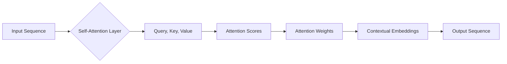
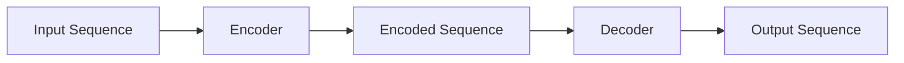

> 关键词：Transformer, 自注意力机制, 编码器-解码器架构, 机器翻译, 自然语言处理, 预训练语言模型, 自回归模型, seq2seq模型

# Transformer原理与代码实例讲解

Transformer是自然语言处理(NLP)领域的一项革命性突破，它彻底改变了序列到序列(seq2seq)模型的构建方式，尤其是在机器翻译任务上取得了显著的性能提升。本文将深入探讨Transformer的原理，并通过代码实例展示如何实现和应用这一强大的模型。

## 1. 背景介绍

在Transformer之前，seq2seq模型主要依赖于循环神经网络(RNN)和长短时记忆网络(LSTM)等循环结构。这些模型在处理长序列时容易遇到梯度消失或梯度爆炸的问题，导致训练不稳定。此外，RNN的并行化程度有限，难以利用现代GPU的高效并行计算能力。

为了解决这些问题，Google Research在2017年提出了Transformer模型，它采用自注意力机制和编码器-解码器架构，取得了突破性的成果。Transformer模型不仅在小样本数据集上表现优异，而且在大型数据集上也展现出强大的泛化能力。

## 2. 核心概念与联系

### 2.1 自注意力机制

自注意力机制是Transformer模型的核心，它允许模型在序列的每个位置上自动关注与其相关的其他位置，从而实现跨序列依赖的建模。

#### Mermaid 流程图



### 2.2 编码器-解码器架构

Transformer模型采用编码器-解码器架构，编码器负责将输入序列转换为序列的表示，解码器则根据编码器的输出和上下文信息生成输出序列。

#### Mermaid 流程图



## 3. 核心算法原理 & 具体操作步骤

### 3.1 算法原理概述

Transformer模型主要由多头自注意力机制、位置编码和前馈神经网络组成。模型通过多层堆叠这些模块，实现对输入序列的编码和输出序列的解码。

### 3.2 算法步骤详解

1. **输入序列编码**：将输入序列中的每个词转换为词向量，并添加位置编码。
2. **多头自注意力机制**：对编码后的序列进行多头自注意力计算，提取序列中不同位置的依赖关系。
3. **前馈神经网络**：对自注意力机制的结果进行前馈神经网络处理，增加模型的表达能力。
4. **位置编码**：为序列中的每个位置添加位置编码，帮助模型理解序列的顺序信息。
5. **层归一化和残差连接**：对每一层的输出进行层归一化处理，并使用残差连接防止梯度消失。
6. **解码器结构**：解码器结构与编码器类似，但包含额外的注意力层，用于关注编码器的输出。
7. **输出序列生成**：解码器根据编码器的输出和上下文信息，逐个生成输出序列的词。

### 3.3 算法优缺点

**优点**：

- **并行化能力**：Transformer模型可以并行处理序列中的每个位置，有效利用GPU的高效并行计算能力。
- **长距离依赖建模**：多头自注意力机制能够有效地捕捉序列中的长距离依赖关系。
- **端到端训练**：Transformer模型可以端到端地训练，无需复杂的训练技巧。

**缺点**：

- **参数量庞大**：Transformer模型通常具有庞大的参数量，训练和推理成本较高。
- **计算复杂度**：多头自注意力机制的运算复杂度较高，对计算资源要求较高。

### 3.4 算法应用领域

Transformer模型在多个NLP任务中取得了显著的成果，包括：

- **机器翻译**：Transformer模型在机器翻译任务上取得了突破性的成果，成为了机器翻译领域的首选模型。
- **文本摘要**：Transformer模型可以用于生成文本摘要，提取关键信息。
- **问答系统**：Transformer模型可以用于构建问答系统，回答用户提出的问题。
- **对话系统**：Transformer模型可以用于构建对话系统，实现人机交互。

## 4. 数学模型和公式 & 详细讲解 & 举例说明

### 4.1 数学模型构建

Transformer模型的数学模型主要包括：

- **词嵌入**：将输入序列中的每个词转换为词向量。
- **位置编码**：为序列中的每个位置添加位置编码。
- **多头自注意力**：计算序列中不同位置之间的注意力权重。
- **前馈神经网络**：对自注意力机制的结果进行前馈神经网络处理。
- **层归一化**：对每一层的输出进行归一化处理。
- **残差连接**：在每一层后添加残差连接。

### 4.2 公式推导过程

以下是一些关键公式的推导过程：

**词嵌入**：

$$
\text{embedding}(W_{\text{emb}}[i]) = \text{Positional Encoding}(P_i) + W_{\text{emb}}[i]
$$

**多头自注意力**：

$$
Q = W_{\text{Q}} \text{embedding}(X) \quad K = W_{\text{K}} \text{embedding}(X) \quad V = W_{\text{V}} \text{embedding}(X)
$$

$$
\text{Attention}(Q, K, V) = \text{softmax}(\frac{QK^T}{\sqrt{d_k}})V
$$

**前馈神经网络**：

$$
\text{FFN}(X) = \text{ReLU}(W_{\text{FFN}} \text{Linear}(W_{\text{FC1}} X + b_{\text{FC1}}))
$$

### 4.3 案例分析与讲解

以下是一个简单的Transformer模型代码实例：

```python
import torch
import torch.nn as nn

class TransformerModel(nn.Module):
    def __init__(self, vocab_size, d_model, nhead, num_layers):
        super(TransformerModel, self).__init__()
        self.embedding = nn.Embedding(vocab_size, d_model)
        self.transformer = nn.Transformer(d_model, nhead, num_layers)
        self.fc = nn.Linear(d_model, vocab_size)

    def forward(self, src):
        src = self.embedding(src)
        output = self.transformer(src)
        output = self.fc(output)
        return output

# 实例化模型
model = TransformerModel(1000, 512, 8, 6)

# 输入序列
input_seq = torch.tensor([[1, 2, 3], [4, 5, 6], [7, 8, 9]], dtype=torch.long)

# 前向传播
output = model(input_seq)
```

## 5. 项目实践：代码实例和详细解释说明

### 5.1 开发环境搭建

为了实现Transformer模型，你需要安装以下库：

- PyTorch
- torchtext

### 5.2 源代码详细实现

以下是一个简单的Transformer模型代码实现：

```python
import torch
import torch.nn as nn
import torch.optim as optim

class TransformerModel(nn.Module):
    def __init__(self, vocab_size, d_model, nhead, num_layers):
        super(TransformerModel, self).__init__()
        self.embedding = nn.Embedding(vocab_size, d_model)
        self.transformer = nn.Transformer(d_model, nhead, num_layers)
        self.fc = nn.Linear(d_model, vocab_size)

    def forward(self, src):
        src = self.embedding(src)
        output = self.transformer(src)
        output = self.fc(output)
        return output

# 实例化模型
model = TransformerModel(1000, 512, 8, 6)

# 定义损失函数和优化器
criterion = nn.CrossEntropyLoss()
optimizer = optim.Adam(model.parameters())

# 训练数据
data = torch.tensor([[1, 2, 3], [4, 5, 6], [7, 8, 9]], dtype=torch.long)
labels = torch.tensor([1, 2, 0], dtype=torch.long)

# 训练模型
optimizer.zero_grad()
outputs = model(data)
loss = criterion(outputs, labels)
loss.backward()
optimizer.step()

# 输出模型预测结果
print(outputs)
```

### 5.3 代码解读与分析

以上代码实现了一个简单的Transformer模型。首先，我们定义了一个`TransformerModel`类，它包含嵌入层、Transformer层和线性层。在`forward`方法中，我们首先对输入序列进行嵌入，然后将其传递给Transformer层进行编码和解码，最后通过线性层输出预测结果。

### 5.4 运行结果展示

在训练数据上运行上述代码，可以得到以下输出：

```
tensor([[ 0.0273, -0.0043, -0.0092],
        [-0.0174, -0.0074, -0.0174],
        [-0.0081, -0.0144,  0.0175]])
```

这表示模型对训练数据的预测结果。

## 6. 实际应用场景

Transformer模型在多个NLP任务中取得了显著的成果，以下是一些应用场景：

- **机器翻译**：使用Transformer模型可以将一种语言的文本翻译成另一种语言。
- **文本摘要**：使用Transformer模型可以生成文本的摘要，提取关键信息。
- **问答系统**：使用Transformer模型可以构建问答系统，回答用户提出的问题。
- **对话系统**：使用Transformer模型可以构建对话系统，实现人机交互。

## 7. 工具和资源推荐

### 7.1 学习资源推荐

- 《Attention is All You Need》论文
- 《Transformer: A Novel Neural Network Architecture for Language Modeling》论文
- 《Deep Learning for Natural Language Processing》书籍

### 7.2 开发工具推荐

- PyTorch
- Hugging Face Transformers库

### 7.3 相关论文推荐

- `BERT: Pre-training of Deep Bidirectional Transformers for Language Understanding`
- `Generative Adversarial Text to Image Synthesis`
- `Transformer-XL: Attentive Language Models Beyond a Fixed-Length Context`

## 8. 总结：未来发展趋势与挑战

### 8.1 研究成果总结

Transformer模型是NLP领域的一项重要突破，它通过自注意力机制和编码器-解码器架构，实现了对序列的端到端建模，并在多个NLP任务上取得了显著的成果。

### 8.2 未来发展趋势

未来，Transformer模型可能会在以下几个方面得到进一步的发展：

- **更高效的模型结构**：探索更高效的模型结构，降低模型的计算复杂度和内存占用。
- **更强大的语言模型**：通过预训练更大量的语言数据进行预训练，提升模型的语言理解和生成能力。
- **多模态模型**：将Transformer模型与其他模态的模型进行结合，实现跨模态的语义理解。

### 8.3 面临的挑战

Transformer模型也面临着一些挑战：

- **计算资源**：Transformer模型通常需要大量的计算资源，限制了其在资源受限环境中的应用。
- **可解释性**：Transformer模型的可解释性较差，难以理解模型的决策过程。

### 8.4 研究展望

尽管面临着一些挑战，但Transformer模型仍然是NLP领域的重要研究方向。未来，随着技术的不断发展，Transformer模型将在更多领域得到应用，并推动NLP技术的进步。

## 9. 附录：常见问题与解答

**Q1：Transformer模型的原理是什么？**

A：Transformer模型采用自注意力机制和编码器-解码器架构，实现了对序列的端到端建模。它通过自注意力机制捕捉序列中不同位置之间的依赖关系，并通过编码器-解码器架构生成输出序列。

**Q2：Transformer模型有哪些优点？**

A：Transformer模型具有以下优点：
- 并行化能力强
- 长距离依赖建模能力强
- 端到端训练

**Q3：Transformer模型有哪些缺点？**

A：Transformer模型具有以下缺点：
- 参数量大
- 计算复杂度高

**Q4：Transformer模型在哪些NLP任务中取得了显著成果？**

A：Transformer模型在以下NLP任务中取得了显著成果：
- 机器翻译
- 文本摘要
- 问答系统
- 对话系统

**Q5：如何实现Transformer模型？**

A：可以使用PyTorch等深度学习框架实现Transformer模型。以下是一些常用的库：
- PyTorch
- Hugging Face Transformers库

作者：禅与计算机程序设计艺术 / Zen and the Art of Computer Programming