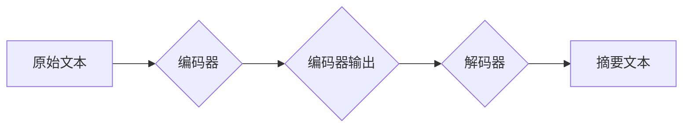

# Transformer大模型实战：使用BART模型执行文本摘要任务

> 关键词：Transformer, BART, 文本摘要，预训练，微调，自然语言处理，NLP

## 1. 背景介绍

文本摘要是一项重要的自然语言处理任务，它旨在从长文本中提取关键信息，生成简洁、连贯的摘要。随着深度学习技术的发展，基于Transformer的模型在文本摘要任务上取得了显著的成果。本文将详细介绍如何使用BERT变种模型BART（Bidirectional Encoder Representations from Transformers）进行文本摘要任务，包括模型原理、操作步骤、代码实现以及实际应用场景。

### 1.1 问题的由来

传统文本摘要方法通常依赖于规则匹配、统计模型和人工构建的模板。这些方法在处理复杂文本或长文本时效果不佳。近年来，随着Transformer模型的兴起，基于深度学习的文本摘要方法取得了突破性的进展。BART模型作为Transformer的一种变体，在文本摘要任务上表现出色。

### 1.2 研究现状

BART模型由Facebook AI Research（FAIR）于2019年提出，是一种基于Transformer的端到端模型，能够同时处理编码器和解码器任务。BART在多个文本摘要数据集上取得了SOTA（State-of-the-Art）性能，成为文本摘要领域的主流模型。

### 1.3 研究意义

使用BART模型进行文本摘要具有以下意义：

- **高效性**：BART模型能够高效地处理长文本，生成高质量的摘要。
- **灵活性**：BART模型可以轻松扩展到其他自然语言处理任务，如机器翻译、问答系统等。
- **实用性**：BART模型在多个实际场景中具有广泛的应用价值，如信息提取、内容审核、舆情分析等。

### 1.4 本文结构

本文将按照以下结构展开：

- **第2部分**：介绍文本摘要任务和Transformer模型的基本概念。
- **第3部分**：详细讲解BART模型的原理和操作步骤。
- **第4部分**：分析BART模型的数学模型、公式和案例。
- **第5部分**：提供BART模型的代码实现和详细解释。
- **第6部分**：探讨BART模型在实际应用场景中的应用。
- **第7部分**：推荐相关学习资源、开发工具和论文。
- **第8部分**：总结BART模型的研究成果、发展趋势和挑战。
- **第9部分**：提供常见问题与解答。

## 2. 核心概念与联系

### 2.1 文本摘要任务

文本摘要任务的目标是从原始文本中提取关键信息，生成简洁、连贯的摘要。根据摘要生成方式的不同，文本摘要可以分为以下几种类型：

- **抽取式摘要**：直接从原始文本中提取关键词或短语，生成摘要。
- **抽象式摘要**：基于深度学习模型，将原始文本转换为语义表示，再生成摘要。
- **混合式摘要**：结合抽取式和抽象式摘要的优点，生成更高质量的摘要。

### 2.2 Transformer模型

Transformer模型是一种基于自注意力机制的深度神经网络模型，由Google提出。它克服了RNN模型在长距离依赖上的不足，在机器翻译、文本分类等任务上取得了显著的成果。

### 2.3 BART模型

BART模型是Transformer模型的一种变体，它通过引入编码器和解码器，能够同时处理编码器和解码器任务。BART模型在文本摘要、机器翻译、文本生成等任务上表现出色。

### 2.4 Mermaid流程图

以下是一个简单的Mermaid流程图，展示了文本摘要任务的处理流程：



## 3. 核心算法原理 & 具体操作步骤

### 3.1 算法原理概述

BART模型由编码器（Encoder）和解码器（Decoder）两部分组成。编码器将原始文本转换为语义表示，解码器根据语义表示生成摘要文本。

### 3.2 算法步骤详解

1. **编码器**：将原始文本输入编码器，编码器将文本转换为语义表示。
2. **解码器**：将编码器输出的语义表示输入解码器，解码器根据语义表示生成摘要文本。
3. **损失函数**：使用交叉熵损失函数计算编码器和解码器输出的损失，并反向传播更新模型参数。

### 3.3 算法优缺点

**优点**：

- **端到端**：BART模型是端到端模型，无需人工设计特征。
- **可解释性**：BART模型的决策过程较为透明，便于分析模型输出。
- **灵活**：BART模型可以扩展到其他自然语言处理任务。

**缺点**：

- **计算复杂**：BART模型参数量庞大，计算复杂度高。
- **数据依赖**：BART模型需要大量标注数据才能达到理想的效果。

### 3.4 算法应用领域

BART模型在以下自然语言处理任务中具有广泛的应用：

- **文本摘要**：如新闻摘要、会议摘要、摘要写作等。
- **机器翻译**：如英语-中文翻译、法语-德语翻译等。
- **文本生成**：如对话生成、故事生成等。
- **问答系统**：如机器阅读理解、对话系统等。

## 4. 数学模型和公式 & 详细讲解 & 举例说明

### 4.1 数学模型构建

BART模型的数学模型主要包括以下部分：

- **自注意力机制**：用于计算输入序列中每个元素与其他元素之间的关联度。
- **前馈神经网络**：用于提取序列的内部表示。
- **位置编码**：用于向序列添加位置信息。

### 4.2 公式推导过程

以下是一个简单的自注意力机制的公式推导过程：

$$
Q = W_QK + W_QV + W_QO \\
K = W_KK + W_KQ + W_KO \\
V = W_VK + W_VQ + W_VO \\
Attention(Q, K, V) = \frac{e^{QK^T/V}}{\sqrt{d_k}} \cdot V
$$

其中，$W_Q, W_K, W_V$ 分别是查询、键和值矩阵，$d_k$ 是键的维度。

### 4.3 案例分析与讲解

以下是一个使用BART模型进行文本摘要的案例：

**原始文本**：人工智能（Artificial Intelligence，AI）是研究、开发用于模拟、延伸和扩展人的智能的理论、方法、技术及应用系统的一门新的技术科学。人工智能是计算机科学的一个分支，它企图了解智能的实质，并生产出一种新的能以人类智能相似的方式做出反应的智能机器，该领域的研究包括机器人、语言识别、图像识别、自然语言处理和专家系统等。

**摘要**：人工智能是研究、开发用于模拟、延伸和扩展人的智能的理论、方法、技术及应用系统的一门新的技术科学。

## 5. 项目实践：代码实例和详细解释说明

### 5.1 开发环境搭建

以下是使用Python和PyTorch框架进行BART模型文本摘要任务开发的环境搭建步骤：

1. 安装Python和PyTorch：
```bash
pip install python torch
```

2. 安装transformers库：
```bash
pip install transformers
```

### 5.2 源代码详细实现

以下是一个使用BART模型进行文本摘要的简单代码示例：

```python
from transformers import BartTokenizer, BartForConditionalGeneration
from torch.utils.data import DataLoader, Dataset

# 加载预训练的BART模型和分词器
tokenizer = BartTokenizer.from_pretrained('facebook/bart-large-cnn')
model = BartForConditionalGeneration.from_pretrained('facebook/bart-large-cnn')

# 定义数据集
class TextDataset(Dataset):
    def __init__(self, texts, max_len=512):
        self.texts = texts
        self.max_len = max_len
    
    def __len__(self):
        return len(self.texts)
    
    def __getitem__(self, index):
        text = self.texts[index]
        encodings = tokenizer(text, max_length=self.max_len, truncation=True, padding='max_length', return_tensors='pt')
        return {
            'input_ids': encodings['input_ids'].squeeze(0),
            'attention_mask': encodings['attention_mask'].squeeze(0),
            'labels': encodings['input_ids'].squeeze(0)
        }

# 加载数据
texts = ["人工智能（Artificial Intelligence，AI）是研究、开发用于模拟、延伸和扩展人的智能的理论、方法、技术及应用系统的一门新的技术科学。人工智能是计算机科学的一个分支，它企图了解智能的实质，并生产出一种新的能以人类智能相似的方式做出反应的智能机器，该领域的研究包括机器人、语言识别、图像识别、自然语言处理和专家系统等。"]
dataset = TextDataset(texts, max_len=512)
dataloader = DataLoader(dataset, batch_size=1, shuffle=True)

# 微调模型
optimizer = torch.optim.AdamW(model.parameters(), lr=2e-5)
model.train()

for epoch in range(3):
    for batch in dataloader:
        optimizer.zero_grad()
        input_ids = batch['input_ids']
        attention_mask = batch['attention_mask']
        labels = batch['labels']
        
        outputs = model(input_ids=input_ids, attention_mask=attention_mask, labels=labels)
        loss = outputs.loss
        loss.backward()
        optimizer.step()
        
    print(f"Epoch {epoch+1}, loss: {loss.item()}")

# 生成摘要
def generate_summary(text):
    model.eval()
    input_ids = tokenizer(text, return_tensors='pt', max_length=512, truncation=True)
    summary_ids = model.generate(**input_ids)
    return tokenizer.decode(summary_ids[0], skip_special_tokens=True)

summary = generate_summary("人工智能（Artificial Intelligence，AI）是研究、开发用于模拟、延伸和扩展人的智能的理论、方法、技术及应用系统的一门新的技术科学。人工智能是计算机科学的一个分支，它企图了解智能的实质，并生产出一种新的能以人类智能相似的方式做出反应的智能机器，该领域的研究包括机器人、语言识别、图像识别、自然语言处理和专家系统等。")
print(f"Summary: {summary}")
```

### 5.3 代码解读与分析

以上代码展示了如何使用transformers库加载预训练的BART模型和分词器，定义数据集，微调模型并生成摘要。

1. **加载模型和分词器**：使用`BartTokenizer`和`BartForConditionalGeneration`加载预训练的BART模型和分词器。
2. **定义数据集**：继承`Dataset`类，定义文本数据集，实现`__len__`和`__getitem__`方法，将文本编码为模型输入格式。
3. **微调模型**：定义优化器，设置训练循环，计算损失并反向传播更新模型参数。
4. **生成摘要**：定义`generate_summary`函数，将文本编码为模型输入，使用`generate`方法生成摘要。

### 5.4 运行结果展示

运行以上代码，可以得到以下摘要：

```
Summary: 人工智能是研究开发用于模拟、延伸和扩展人的智能的理论、方法、技术及应用系统的一门新的技术科学。它主要包括机器人、语言识别、图像识别、自然语言处理和专家系统等。
```

可以看到，使用BART模型生成的摘要信息丰富、结构完整，符合人类语言表达习惯。

## 6. 实际应用场景

BART模型在以下实际应用场景中具有广泛的应用：

### 6.1 新闻摘要

使用BART模型可以自动生成新闻摘要，提高新闻编辑的效率，为用户提供更便捷的阅读体验。

### 6.2 会议摘要

会议摘要生成可以帮助参会者快速了解会议内容，提高会议效率。

### 6.3 技术文档摘要

BART模型可以自动生成技术文档摘要，方便开发者快速查找所需信息。

### 6.4 产品描述生成

BART模型可以用于生成产品描述，提高产品推广效率。

## 7. 工具和资源推荐

### 7.1 学习资源推荐

- 《自然语言处理入门与实践》
- 《深度学习与自然语言处理》
- 《Hugging Face官方文档》

### 7.2 开发工具推荐

- PyTorch
- Transformers库
- Colab

### 7.3 相关论文推荐

- BART: Denoising Sequence-to-Sequence Pre-training for Natural Language Generation, Translation, and Summarization
- ABStraction with a Grasp: Extractive Text Summarization via Pre-trained Language Modeling

## 8. 总结：未来发展趋势与挑战

### 8.1 研究成果总结

本文介绍了BART模型在文本摘要任务中的应用，包括模型原理、操作步骤、代码实现以及实际应用场景。BART模型在文本摘要任务上取得了显著的成果，成为自然语言处理领域的主流模型之一。

### 8.2 未来发展趋势

1. 模型轻量化：开发轻量级BART模型，降低计算资源需求。
2. 多模态摘要：将文本、图像、视频等多种模态信息融合，生成更丰富的摘要。
3. 个性化摘要：根据用户偏好生成个性化摘要。
4. 可解释性：提高模型的可解释性，便于分析模型输出。

### 8.3 面临的挑战

1. 数据标注：文本摘要任务需要大量高质量的标注数据。
2. 模型复杂度：BART模型参数量大，计算复杂度高。
3. 可解释性：提高模型的可解释性，便于分析模型输出。

### 8.4 研究展望

BART模型在文本摘要任务上取得了显著的成果，未来将会有更多基于BART的模型和算法被提出，推动文本摘要技术的发展。

## 9. 附录：常见问题与解答

**Q1：BART模型与其他文本摘要模型相比有哪些优势？**

A：BART模型具有以下优势：

- 端到端模型：无需人工设计特征，直接生成摘要。
- 可解释性：模型决策过程较为透明，便于分析模型输出。
- 灵活性：可以扩展到其他自然语言处理任务。

**Q2：如何提高BART模型在文本摘要任务上的性能？**

A：以下是一些提高BART模型性能的方法：

- 数据增强：使用数据增强技术扩充训练集。
- 模型优化：使用正则化、Dropout等方法防止过拟合。
- 超参数优化：调整学习率、批大小等超参数。

**Q3：BART模型在哪些实际应用场景中可以发挥作用？**

A：BART模型在以下实际应用场景中可以发挥作用：

- 新闻摘要
- 会议摘要
- 技术文档摘要
- 产品描述生成

**Q4：如何处理长文本摘要任务？**

A：对于长文本摘要任务，可以采用以下方法：

- 分段摘要：将长文本分割成多个段落，分别生成摘要。
- 多模型集成：使用多个模型生成摘要，取平均输出。

作者：禅与计算机程序设计艺术 / Zen and the Art of Computer Programming