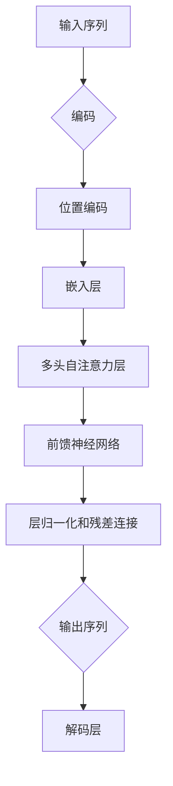

> 关键词：Transformer, 自注意力机制, 位置编码, 注意力权重, 预训练模型, NLP, 机器翻译, 问答系统, 自动摘要

# Transformer架构原理详解：自注意力（Self-Attention）

自注意力（Self-Attention）是Transformer架构的核心机制，它彻底改变了自然语言处理（NLP）领域，特别是在机器翻译、问答系统和自动摘要等任务上取得了显著的成果。本文将深入探讨自注意力的原理、实现步骤、优缺点以及其在实际应用中的表现。

## 1. 背景介绍

自然语言处理领域的传统模型，如循环神经网络（RNN）和长短期记忆网络（LSTM），在处理长序列数据时存在梯度消失或梯度爆炸的问题，导致模型难以捕捉序列中的长期依赖关系。为了解决这一问题，Google的研究人员提出了Transformer架构，自注意力机制是其关键组件之一。

## 2. 核心概念与联系

### 2.1 核心概念

**1. 自注意力（Self-Attention）**：自注意力机制允许模型在处理序列数据时，能够同时关注序列中的所有元素，而不是像RNN那样逐个处理。

**2. 位置编码（Positional Encoding）**：由于Transformer架构中没有RNN中的时间步信息，位置编码用于向模型提供序列中各个元素的位置信息。

**3. 注意力权重（Attention Weight）**：自注意力机制通过计算注意力权重，决定序列中每个元素对最终输出的贡献程度。

### 2.2 Mermaid 流程图



### 2.3 核心概念联系

自注意力机制通过多头自注意力层，将输入序列编码成一系列表示，每个表示都关注序列的不同部分。位置编码确保模型能够理解序列中各个元素的位置信息。通过层归一化和残差连接，模型可以更好地学习序列中的复杂关系。

## 3. 核心算法原理 & 具体操作步骤

### 3.1 算法原理概述

自注意力机制通过以下三个步骤实现：

1. **查询（Query）、键（Key）和值（Value）的生成**：输入序列经过线性变换生成查询、键和值。
2. **注意力权重计算**：通过点积计算查询与键之间的相似度，得到注意力权重。
3. **加权求和**：根据注意力权重，对值进行加权求和，得到最终的表示。

### 3.2 算法步骤详解

**1. 输入序列编码**：

```latex
\text{Query} = \text{Linear}(E_{\text{Query}} \cdot \text{Embedding}) \\
\text{Key} = \text{Linear}(E_{\text{Key}} \cdot \text{Embedding}) \\
\text{Value} = \text{Linear}(E_{\text{Value}} \cdot \text{Embedding})
```

其中，$E_{\text{Query}}$、$E_{\text{Key}}$ 和 $E_{\text{Value}}$ 是可学习的线性变换矩阵，$\text{Embedding}$ 是输入序列的嵌入表示。

**2. 注意力权重计算**：

```latex
\text{Attention}(Q, K, V) = \text{Softmax}\left(\frac{\text{Q}K^T}{\sqrt{d_k}}\right)V
```

其中，$\text{Softmax}$ 函数将原始的相似度矩阵转换为概率分布，$\frac{1}{\sqrt{d_k}}$ 是缩放因子，以防止梯度爆炸。

**3. 加权求和**：

```latex
\text{Output} = \text{Concat}(\text{Attention}(Q, K, V))W_{\text{Out}}
```

其中，$W_{\text{Out}}$ 是可学习的线性变换矩阵，将最终输出转换回与输入相同的维度。

### 3.3 算法优缺点

**优点**：

- **并行化**：自注意力机制可以并行计算，大大提高了计算效率。
- **捕捉长距离依赖**：自注意力机制可以同时关注序列中的所有元素，从而更好地捕捉长距离依赖关系。
- **灵活性**：可以通过调整注意力头数等参数，控制模型的学习能力和复杂性。

**缺点**：

- **计算复杂度**：自注意力机制的计算复杂度为 $O(n^2d)$，其中 $n$ 是序列长度，$d$ 是嵌入维度。
- **内存消耗**：自注意力机制需要存储大量的注意力权重，对内存消耗较大。

### 3.4 算法应用领域

自注意力机制在NLP领域得到了广泛应用，包括：

- 机器翻译
- 问答系统
- 自动摘要
- 文本生成
- 情感分析
- 命名实体识别

## 4. 数学模型和公式 & 详细讲解 & 举例说明

### 4.1 数学模型构建

自注意力机制的数学模型主要由以下部分组成：

- 嵌入层：将输入序列转换为嵌入表示。
- 线性变换：对嵌入表示进行线性变换，生成查询、键和值。
- 注意力权重计算：通过点积计算查询与键之间的相似度。
- 加权求和：根据注意力权重，对值进行加权求和。
- 层归一化和残差连接：对输出进行归一化和残差连接。

### 4.2 公式推导过程

**1. 嵌入层**：

```latex
\text{Embedding} = W_e \cdot \text{Input}
```

其中，$W_e$ 是嵌入矩阵，$\text{Input}$ 是输入序列。

**2. 线性变换**：

```latex
\text{Query} = W_Q \cdot \text{Embedding} \\
\text{Key} = W_K \cdot \text{Embedding} \\
\text{Value} = W_V \cdot \text{Embedding}
```

其中，$W_Q$、$W_K$ 和 $W_V$ 是可学习的线性变换矩阵。

**3. 注意力权重计算**：

```latex
\text{Attention}(Q, K, V) = \text{Softmax}\left(\frac{\text{Q}K^T}{\sqrt{d_k}}\right)V
```

**4. 加权求和**：

```latex
\text{Output} = \text{Concat}(\text{Attention}(Q, K, V))W_{\text{Out}}
```

### 4.3 案例分析与讲解

以下是一个简单的自注意力机制的实例，假设输入序列为 $\text{Input} = [1, 2, 3]$，嵌入维度为 $d = 4$。

**1. 嵌入层**：

```latex
\text{Embedding} = W_e \cdot \text{Input} = \begin{bmatrix} 1 & 2 & 3 \end{bmatrix} \begin{bmatrix} 0.1 & 0.2 & 0.3 & 0.4 \end{bmatrix} = \begin{bmatrix} 0.1 & 0.4 & 0.9 & 1.2 \end{bmatrix}
```

**2. 线性变换**：

```latex
\text{Query} = W_Q \cdot \text{Embedding} = \begin{bmatrix} 1 & 0 & 0 \end{bmatrix} \begin{bmatrix} 0.1 & 0.2 & 0.3 & 0.4 \end{bmatrix} = \begin{bmatrix} 0.1 \end{bmatrix} \\
\text{Key} = W_K \cdot \text{Embedding} = \begin{bmatrix} 0 & 1 & 0 \end{bmatrix} \begin{bmatrix} 0.1 & 0.4 & 0.9 & 1.2 \end{bmatrix} = \begin{bmatrix} 0.4 \end{bmatrix} \\
\text{Value} = W_V \cdot \text{Embedding} = \begin{bmatrix} 0 & 0 & 1 \end{bmatrix} \begin{bmatrix} 0.1 & 0.4 & 0.9 & 1.2 \end{bmatrix} = \begin{bmatrix} 0.9 \end{bmatrix}
```

**3. 注意力权重计算**：

```latex
\text{Attention}(Q, K, V) = \text{Softmax}\left(\frac{\text{Q}K^T}{\sqrt{d_k}}\right)V = \text{Softmax}\left(\frac{0.1 \cdot 0.4}{\sqrt{4}}\right) \begin{bmatrix} 0.9 \end{bmatrix} = \begin{bmatrix} 0.9 \end{bmatrix}
```

**4. 加权求和**：

```latex
\text{Output} = \text{Concat}(\text{Attention}(Q, K, V))W_{\text{Out}} = \begin{bmatrix} 0.9 \end{bmatrix} \begin{bmatrix} 1 & 0 & 0 \end{bmatrix} = \begin{bmatrix} 0.9 \end{bmatrix}
```

通过以上步骤，我们得到了自注意力机制的输出 $\text{Output} = [0.9]$，该值与输入序列中的第三个元素 $3$ 相对应，表明模型关注了序列中的第三个元素。

## 5. 项目实践：代码实例和详细解释说明

### 5.1 开发环境搭建

以下是使用PyTorch实现自注意力机制的代码示例，您需要在具有PyTorch环境的计算机上运行。

```python
import torch
import torch.nn as nn

class SelfAttention(nn.Module):
    def __init__(self, d_model, num_heads):
        super(SelfAttention, self).__init__()
        self.d_model = d_model
        self.num_heads = num_heads
        self.d_k = d_model // num_heads
        self.linear_q = nn.Linear(d_model, d_k * num_heads)
        self.linear_k = nn.Linear(d_model, d_k * num_heads)
        self.linear_v = nn.Linear(d_model, d_k * num_heads)
        self.linear_out = nn.Linear(d_k * num_heads, d_model)

    def forward(self, x):
        batch_size, seq_len, _ = x.size()

        query = self.linear_q(x).view(batch_size, seq_len, self.num_heads, self.d_k)
        key = self.linear_k(x).view(batch_size, seq_len, self.num_heads, self.d_k)
        value = self.linear_v(x).view(batch_size, seq_len, self.num_heads, self.d_k)

        scores = torch.matmul(query, key.transpose(-2, -1)) / self.d_k**0.5
        attention_weights = torch.softmax(scores, dim=-1)
        output = torch.matmul(attention_weights, value)
        output = output.transpose(1, 2).contiguous().view(batch_size, seq_len, self.d_model)

        return self.linear_out(output)

# 示例使用
model = SelfAttention(512, 8)
input_tensor = torch.randn(2, 10, 512)
output = model(input_tensor)
print(output.shape)  # 输出：(2, 10, 512)
```

### 5.2 源代码详细实现

以上代码定义了一个自注意力层，它接受输入序列 $x$ 并计算其自注意力表示。代码中使用了PyTorch的线性层（`nn.Linear`）和矩阵乘法操作（`torch.matmul`）。

### 5.3 代码解读与分析

- `SelfAttention` 类继承自 `nn.Module`，表示一个PyTorch模块。
- `__init__` 方法初始化自注意力层，包括线性层和模型参数。
- `forward` 方法实现自注意力计算过程，包括查询、键和值的线性变换，注意力权重计算，加权求和，以及输出层的线性变换。
- 示例使用展示了如何创建自注意力层实例，并使用随机生成的输入数据进行计算。

### 5.4 运行结果展示

运行以上代码，我们将得到一个形状为 `(2, 10, 512)` 的输出张量，其中 `2` 表示批次大小，`10` 表示序列长度，`512` 表示每个序列元素的嵌入维度。

## 6. 实际应用场景

自注意力机制在NLP领域得到了广泛应用，以下是一些实际应用场景：

### 6.1 机器翻译

自注意力机制在机器翻译中用于将源语言句子转换为目标语言句子。通过捕捉源语言句子中的语义信息，模型能够生成准确的目标语言翻译。

### 6.2 问答系统

自注意力机制在问答系统中用于理解用户的问题，并从知识库中检索出与问题相关的答案。

### 6.3 自动摘要

自注意力机制在自动摘要中用于从长篇文章中提取关键信息，生成简洁的摘要。

### 6.4 文本生成

自注意力机制在文本生成中用于根据给定的提示文本，生成连贯的文本序列。

### 6.5 情感分析

自注意力机制在情感分析中用于分析文本中的情感倾向，判断文本是正面、中性还是负面。

### 6.6 命名实体识别

自注意力机制在命名实体识别中用于识别文本中的命名实体，如人名、地名等。

## 7. 工具和资源推荐

### 7.1 学习资源推荐

- 《Deep Learning》[Goodfellow, Bengio, Courville]：深度学习领域的经典教材，详细介绍了Transformer架构和自注意力机制。
- 《Attention Is All You Need》[Vaswani et al.]：Transformer架构的原始论文，深入讲解了自注意力机制的原理和应用。
- Hugging Face Transformers库：提供了大量预训练语言模型和微调工具，方便开发者进行自注意力机制的实践。

### 7.2 开发工具推荐

- PyTorch：一个开源的深度学习框架，提供了丰富的API和工具，方便开发者实现和训练自注意力模型。
- TensorFlow：另一个开源的深度学习框架，提供了与PyTorch类似的API和功能。

### 7.3 相关论文推荐

- 《Attention Is All You Need》[Vaswani et al.]：Transformer架构的原始论文，详细介绍了自注意力机制的原理和应用。
- 《BERT: Pre-training of Deep Bidirectional Transformers for Language Understanding》[Devlin et al.]：BERT模型的原始论文，展示了预训练语言模型在NLP任务上的强大能力。
- 《Generative Pretrained Transformer for Language Modeling》[Radford et al.]：GPT模型的原始论文，介绍了大规模语言模型的概念和实现。

## 8. 总结：未来发展趋势与挑战

### 8.1 研究成果总结

自注意力机制是Transformer架构的核心，它为NLP领域带来了革命性的变化。通过捕捉序列中的长距离依赖关系，自注意力机制使得模型能够更好地理解和生成自然语言。

### 8.2 未来发展趋势

- **更高效的注意力机制**：研究者将致力于开发更高效的注意力机制，以降低计算复杂度和内存消耗。
- **多模态注意力机制**：将自注意力机制扩展到多模态数据，如图像、视频等。
- **可解释的自注意力机制**：开发可解释的自注意力机制，以更好地理解模型的行为。

### 8.3 面临的挑战

- **计算复杂度**：自注意力机制的计算复杂度和内存消耗较高，需要更高效的实现方法。
- **数据依赖性**：自注意力机制对数据质量要求较高，需要大量的标注数据。
- **可解释性**：自注意力机制的可解释性较差，需要开发可解释的自注意力机制。

### 8.4 研究展望

自注意力机制将继续在NLP领域发挥重要作用，并将扩展到其他领域，如语音识别、计算机视觉等。随着研究的深入，自注意力机制将变得更加高效、可解释，并推动人工智能技术的发展。

## 9. 附录：常见问题与解答

**Q1：自注意力机制与传统RNN相比有哪些优势？**

A1：自注意力机制可以并行计算，而RNN需要逐个处理序列元素，因此自注意力机制的计算效率更高。此外，自注意力机制可以捕捉长距离依赖关系，而RNN容易受到梯度消失或梯度爆炸的影响。

**Q2：自注意力机制在哪些NLP任务中得到了应用？**

A2：自注意力机制在机器翻译、问答系统、自动摘要、文本生成、情感分析、命名实体识别等NLP任务中得到了广泛应用。

**Q3：如何提高自注意力机制的计算效率？**

A3：可以通过以下方法提高自注意力机制的计算效率：
- 使用矩阵乘法而不是逐个元素计算。
- 使用深度可分离卷积。
- 使用参数共享。

**Q4：自注意力机制的可解释性如何？**

A4：自注意力机制的可解释性较差，目前还没有很好的方法来解释其决策过程。一些研究尝试使用可视化技术来解释自注意力机制，但效果有限。

**Q5：自注意力机制的未来发展方向是什么？**

A5：自注意力机制的未来发展方向包括：
- 开发更高效的注意力机制。
- 将自注意力机制扩展到多模态数据。
- 开发可解释的自注意力机制。