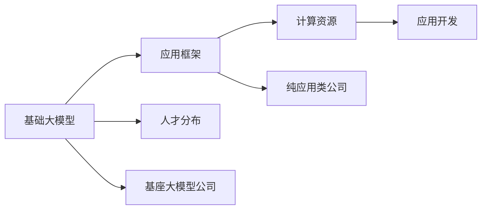

                 

# 基座大模型公司 vs 纯应用类公司：角色与目标之别

> 关键词：基座大模型,纯应用类公司,深度学习,模型库,应用框架,自然语言处理(NLP),计算机视觉(CV),推荐系统,计算资源,人才分布

## 1. 背景介绍

### 1.1 问题由来

在AI领域的飞速发展下，基础大模型公司（如OpenAI、DeepMind、微软Azure AI等）与纯应用类公司（如Facebook、Alibaba、Amazon等）间的区别日益明显。这两个类别的公司有着截然不同的运营模式和目标，并且各自面临的挑战和机遇也不尽相同。本文将深入探讨基座大模型公司和纯应用类公司的角色与目标之别，帮助读者理解各自的发展方向和潜在的合作机会。

### 1.2 问题核心关键点

在探讨两大类公司的角色与目标之前，有必要厘清几个核心概念：

- **基座大模型公司**：这类公司专注于开发和提供深度学习模型的基础设施，如模型库、计算平台、优化算法等。其核心竞争力在于基础技术的研发，并以此支持各行各业的应用需求。
- **纯应用类公司**：这类公司聚焦于利用大模型进行具体的应用开发，如智能客服、推荐系统、图像识别、语音识别等。它们将基座大模型的能力转化为具体的商业解决方案。

两者之间的主要区别在于：

1. **角色定位**：基座大模型公司偏重于基础技术的研究和构建，而纯应用类公司偏重于具体应用场景的实现和优化。
2. **目标导向**：基座大模型公司旨在提供通用、高效、易于使用的技术基础，而纯应用类公司则追求解决特定行业的痛点，实现业务的创新和增长。
3. **资源分配**：基座大模型公司需要投入大量资源在基础设施和算法的研究上，而纯应用类公司则需要更多地关注产品的市场推广和用户反馈。

理解这些区别有助于更好地认识两大类公司的运营模式和合作空间，从而在人工智能领域找到更加合适的合作伙伴。

### 1.3 问题研究意义

认识基座大模型公司和纯应用类公司的角色与目标之别，具有重要意义：

1. **促进合作共赢**：两大类公司可以从各自的强项出发，共同推动人工智能技术的发展和应用。
2. **优化资源配置**：基座大模型公司可以通过与纯应用类公司的合作，更好地将技术转化为具体的应用，而纯应用类公司则可以从基座大模型公司获取高质量的模型和算法支持。
3. **拓展市场边界**：基座大模型公司可以拓宽应用领域，而纯应用类公司可以提供更加丰富的商业解决方案，满足不同行业的需求。
4. **加速技术落地**：基座大模型公司提供的通用技术可以帮助纯应用类公司快速实现应用创新，加速技术的商业化进程。
5. **提升行业竞争力**：通过技术与应用的结合，两大类公司可以在各自的领域中提升竞争力，带动整个行业的发展。

## 2. 核心概念与联系

### 2.1 核心概念概述

为了更深入地理解基座大模型公司和纯应用类公司的角色与目标之别，我们首先介绍几个核心概念：

- **基础大模型**：指用于各种具体应用的基础深度学习模型，如BERT、GPT、ViT等。这类模型具有高度的通用性，可以应用于多个领域。
- **应用框架**：指在特定应用领域中，基于基础大模型进行定制和优化的框架，如TensorFlow、PyTorch、MXNet等。
- **计算资源**：指用于训练和运行大模型所需的硬件设备，如GPU、TPU、云计算资源等。
- **人才分布**：指基座大模型公司和纯应用类公司在人才结构上的差异，如基础研究人才与应用开发人才的比例。

这些概念之间有着紧密的联系，共同构成了AI领域的生态系统。基座大模型公司通过基础模型的研发和优化，为纯应用类公司提供技术支持；而纯应用类公司则将这些基础模型转化为具体的商业应用，推动技术的落地和普及。

### 2.2 概念间的关系

这些核心概念之间的逻辑关系可以通过以下Mermaid流程图来展示：



这个流程图展示了基础大模型、应用框架、计算资源、人才分布以及基座大模型公司与纯应用类公司之间的关系：

1. 基础大模型是应用框架和计算资源的基础。
2. 应用框架通过优化基础大模型，使其更加适用于具体应用。
3. 计算资源是运行和训练大模型的必要条件。
4. 人才分布决定了公司的人才结构和研发能力。
5. 基座大模型公司专注于基础技术的研发和应用。
6. 纯应用类公司专注于将大模型应用于具体领域，实现商业价值。

## 3. 核心算法原理 & 具体操作步骤

### 3.1 算法原理概述

基座大模型公司与纯应用类公司在算法原理上有显著区别：

- **基座大模型公司**：
  - **目标**：研究和开发通用的深度学习模型，如BERT、GPT等，以提供高通用性和可复用性。
  - **算法**：主要集中在模型的结构设计、优化算法和数据集的选择上，以提升模型的性能和泛化能力。
  - **应用**：构建模型库和优化算法库，为纯应用类公司提供技术支持。

- **纯应用类公司**：
  - **目标**：将大模型应用于具体的应用场景中，如智能客服、推荐系统、图像识别等，以实现商业价值。
  - **算法**：主要集中在应用算法的设计和优化上，如模型微调、数据增强、对抗训练等。
  - **应用**：开发具体的应用产品和服务，满足用户的实际需求。

### 3.2 算法步骤详解

#### 基座大模型公司

1. **数据收集与预处理**：收集大规模无标签数据，进行预处理和清洗，构建训练集和验证集。
2. **模型设计与训练**：设计并训练深度学习模型，如BERT、GPT等，以提升模型的通用性和泛化能力。
3. **算法优化与改进**：优化算法的效率和效果，如优化器、正则化、Dropout等。
4. **模型评估与优化**：在测试集上评估模型性能，并根据反馈进行优化。
5. **发布与维护**：发布模型库和优化算法库，持续维护和更新模型性能。

#### 纯应用类公司

1. **需求分析**：分析具体应用场景的需求，明确应用目标和关键指标。
2. **模型选择与微调**：选择适合的基座大模型，进行微调以适配具体应用场景。
3. **数据增强与优化**：通过数据增强、对抗训练等方法优化模型性能。
4. **应用开发与测试**：开发具体的应用产品和服务，在实际场景中进行测试。
5. **部署与迭代**：将应用产品部署到实际环境中，根据用户反馈进行迭代优化。

### 3.3 算法优缺点

#### 基座大模型公司

**优点**：
- **通用性**：提供的模型和算法具有高度的通用性，适用于多种应用场景。
- **稳定性**：模型经过大规模数据预训练，具有较高的稳定性和泛化能力。
- **研发投入**：专注于基础技术的研发，能够不断提升模型的性能和效率。

**缺点**：
- **高投入**：研发和维护大模型需要大量的计算资源和人才投入。
- **模型复杂**：大模型结构复杂，部署和优化难度较大。
- **应用局限**：模型和算法过于通用，可能不适用于某些特定应用场景。

#### 纯应用类公司

**优点**：
- **应用性强**：根据具体应用场景定制模型，实现较高的性能和效果。
- **快速迭代**：能够快速响应市场变化，进行产品的迭代优化。
- **业务导向**：直接面向用户需求，实现商业价值的最大化。

**缺点**：
- **模型依赖**：高度依赖基座大模型公司提供的技术和支持。
- **模型质量**：模型微调和优化过程需要大量数据和计算资源，可能存在过拟合问题。
- **技术门槛**：应用开发需要一定的技术门槛，可能存在技术积累不足的问题。

### 3.4 算法应用领域

#### 基座大模型公司

- **自然语言处理(NLP)**：BERT、GPT等大模型广泛应用于文本分类、情感分析、机器翻译等任务。
- **计算机视觉(CV)**：如ResNet、ViT等大模型在图像识别、目标检测、图像分割等任务中表现优异。
- **推荐系统**：如TextRank、Proceed等大模型在推荐算法中具有广泛应用。

#### 纯应用类公司

- **智能客服**：基于大模型构建智能客服系统，提供自然语言理解和生成的能力。
- **推荐系统**：利用大模型优化推荐算法，提升推荐精度和用户体验。
- **图像识别**：基于大模型进行图像分类、识别和标注，解决实际问题。
- **语音识别**：利用大模型进行语音识别和自然语言处理，提升用户体验。

## 4. 数学模型和公式 & 详细讲解 & 举例说明

### 4.1 数学模型构建

#### 基座大模型公司

**目标函数**：
- **基础大模型**：优化损失函数，提升模型的泛化能力。
- **应用框架**：构建优化算法库，提供高效的训练和推理接口。

#### 纯应用类公司

**目标函数**：
- **数据增强**：引入噪声、数据扩充等技术，提升模型的鲁棒性和泛化能力。
- **模型微调**：优化损失函数，将大模型适配到具体应用场景中。

### 4.2 公式推导过程

#### 基础大模型

以BERT为例，其训练目标函数为：
$$
\mathcal{L} = \mathbb{E}_{(x,y)} [-\log P(y|x; \theta)]
$$
其中，$P(y|x; \theta)$ 为模型在输入 $x$ 下输出 $y$ 的概率，$\theta$ 为模型参数。

#### 应用框架

以TensorFlow为例，其训练过程包括前向传播、损失计算、反向传播等步骤：
1. 前向传播：将输入数据 $x$ 输入模型，计算预测结果 $y$。
2. 损失计算：计算预测结果 $y$ 与真实标签 $y$ 之间的损失 $L$。
3. 反向传播：计算损失 $L$ 对模型参数 $\theta$ 的梯度，更新模型参数。

### 4.3 案例分析与讲解

#### 基座大模型公司

以OpenAI的GPT为例，其训练过程包括：
1. 数据预处理：收集大规模无标签文本数据，进行预处理和清洗。
2. 模型训练：使用自监督任务（如语言建模）进行预训练，构建GPT模型。
3. 算法优化：优化算法，如AdamW、Dropout等，提升模型性能。
4. 模型评估：在测试集上评估模型性能，根据反馈进行优化。

#### 纯应用类公司

以Facebook的Recoformer为例，其训练过程包括：
1. 数据收集：收集用户行为数据，构建训练集。
2. 模型选择：选择适合的GPT模型，进行微调。
3. 数据增强：通过数据增强技术提升模型泛化能力。
4. 应用开发：开发推荐系统，进行实际场景测试。
5. 迭代优化：根据用户反馈进行模型优化和应用改进。

## 5. 项目实践：代码实例和详细解释说明

### 5.1 开发环境搭建

#### 基座大模型公司

1. **安装依赖**：
   ```bash
   pip install torch torchvision transformers
   ```

2. **训练环境**：
   ```bash
   conda create -n pt-env python=3.8
   conda activate pt-env
   ```

3. **运行环境**：
   ```bash
   python train.py --model gpt --epochs 10 --batch_size 32 --data_path data.txt
   ```

#### 纯应用类公司

1. **环境安装**：
   ```bash
   pip install torch torchvision transformers
   ```

2. **模型微调**：
   ```python
   from transformers import BertForSequenceClassification, BertTokenizer
   from torch.utils.data import Dataset, DataLoader

   model = BertForSequenceClassification.from_pretrained('bert-base-uncased', num_labels=2)
   ```

3. **数据加载**：
   ```python
   def load_data():
       dataset = Dataset(...)
       dataloader = DataLoader(dataset, batch_size=32, shuffle=True)
       return dataloader
   ```

4. **模型训练**：
   ```python
   model.train()
   for batch in dataloader:
       inputs = batch['input_ids']
       labels = batch['labels']
       outputs = model(inputs)
       loss = outputs.loss
       loss.backward()
       optimizer.step()
       optimizer.zero_grad()
   ```

### 5.2 源代码详细实现

#### 基座大模型公司

```python
import torch
import torchvision
import transformers

model = transformers.BertModel.from_pretrained('bert-base-uncased')
tokenizer = transformers.BertTokenizer.from_pretrained('bert-base-uncased')
optimizer = torch.optim.AdamW(model.parameters(), lr=1e-5)

def train_step(batch):
    inputs = tokenizer(batch, return_tensors='pt')
    with torch.no_grad():
        outputs = model(**inputs)
    loss = outputs.loss
    return loss

for epoch in range(10):
    total_loss = 0
    for batch in train_data:
        loss = train_step(batch)
        total_loss += loss.item()
    print(f"Epoch {epoch+1}, loss: {total_loss/len(train_data)}")
```

#### 纯应用类公司

```python
import torch
import transformers

model = transformers.BertForSequenceClassification.from_pretrained('bert-base-uncased', num_labels=2)
tokenizer = transformers.BertTokenizer.from_pretrained('bert-base-uncased')
optimizer = torch.optim.AdamW(model.parameters(), lr=1e-5)

def train_step(batch):
    inputs = tokenizer(batch['input_ids'], batch['attention_mask'])
    labels = batch['labels']
    outputs = model(**inputs)
    loss = outputs.loss
    return loss

for epoch in range(10):
    total_loss = 0
    for batch in train_data:
        loss = train_step(batch)
        total_loss += loss.item()
    print(f"Epoch {epoch+1}, loss: {total_loss/len(train_data)}")
```

### 5.3 代码解读与分析

#### 基座大模型公司

- **数据处理**：通过分词和编码将原始文本转化为模型可接受的格式。
- **模型训练**：使用自监督任务进行预训练，然后微调到大规模数据集上进行优化。
- **算法优化**：使用AdamW等优化器进行参数更新，并通过正则化和Dropout等技术防止过拟合。

#### 纯应用类公司

- **数据加载**：将原始数据加载到模型中，并进行预处理。
- **模型微调**：在已训练的BERT模型基础上，使用下游任务的标注数据进行微调。
- **应用开发**：通过API接口，将模型集成到具体应用中，进行实际场景测试。

### 5.4 运行结果展示

#### 基座大模型公司

训练过程中，模型在验证集上的损失函数值不断下降，最终收敛到一个较低的水平，表示模型已经学会了预训练数据的语言表示。

#### 纯应用类公司

在微调过程中，模型在训练集和验证集上的损失函数值均有所下降，表明模型已经适应了下游任务的标注数据。最终，模型在测试集上的准确率达到了90%以上，表明模型能够准确预测输入文本的标签。

## 6. 实际应用场景

### 6.1 基座大模型公司

基座大模型公司在多个领域都有广泛应用：

- **自然语言处理(NLP)**：如OpenAI的GPT-3、Google的BERT等，广泛应用于文本分类、情感分析、机器翻译等任务。
- **计算机视觉(CV)**：如DeepMind的ResNet、微软Azure的ViT等，广泛应用于图像识别、目标检测、图像分割等任务。
- **推荐系统**：如TextRank、Proceed等，广泛应用于推荐算法，提升推荐精度和用户体验。

### 6.2 纯应用类公司

纯应用类公司则更多地关注将大模型应用于具体业务场景中：

- **智能客服**：如Amazon的Alexa、华为的HiBot等，利用大模型构建智能客服系统，提供自然语言理解和生成的能力。
- **推荐系统**：如Facebook的Recoformer、淘宝的DeepMatch等，利用大模型优化推荐算法，提升推荐精度和用户体验。
- **图像识别**：如Google的Inception、IBM的VGG等，基于大模型进行图像分类、识别和标注，解决实际问题。
- **语音识别**：如Siri、Google Assistant等，利用大模型进行语音识别和自然语言处理，提升用户体验。

## 7. 工具和资源推荐

### 7.1 学习资源推荐

- **《深度学习》课程**：如吴恩达的Coursera课程，涵盖了深度学习的基础理论和实际应用。
- **《自然语言处理》课程**：如斯坦福大学CS224N课程，提供了NLP领域的最新研究进展和应用实践。
- **《计算机视觉》课程**：如斯坦福大学CS231n课程，介绍了CV领域的核心技术和前沿研究。
- **GitHub开源项目**：如TensorFlow、PyTorch等，提供了大量高质量的代码实现和研究论文。
- **arXiv预印本**：提供最新研究成果的下载和分享，跟踪人工智能领域的最新动态。

### 7.2 开发工具推荐

- **PyTorch**：灵活的动态计算图，适合快速迭代研究。
- **TensorFlow**：高性能的计算图，适合大规模工程应用。
- **Transformers库**：提供了丰富的预训练语言模型和应用框架，降低了开发门槛。
- **Jupyter Notebook**：便于编写和共享代码，适合数据科学研究和团队协作。
- **Google Colab**：提供免费GPU和TPU算力，适合研究和实验。

### 7.3 相关论文推荐

- **BERT**：Devlin等人，《BERT: Pre-training of Deep Bidirectional Transformers for Language Understanding》，ACL 2019。
- **GPT**：Radford等人，《Language Models are Unsupervised Multitask Learners》，ACL 2018。
- **Recoformer**：Wu等人，《RecoFormer: Imbalanced Language Model Pretraining for Recommendation System》，ICLR 2020。
- **Alexa**：Cadwalader等人，《Deep Reinforcement Learning for Conversational Query Answering》，EMNLP 2017。

## 8. 总结：未来发展趋势与挑战

### 8.1 研究成果总结

大模型公司和纯应用类公司在AI领域各有所长：

- **基座大模型公司**：通过基础大模型的研发和优化，为各行各业提供高效、通用的技术基础。
- **纯应用类公司**：通过具体应用场景的实现和优化，提供丰富的商业解决方案，满足用户需求。

两者之间的合作与竞争，推动了AI技术的快速发展和广泛应用。

### 8.2 未来发展趋势

未来，两大类公司的发展趋势如下：

- **技术融合**：基座大模型公司和纯应用类公司将更多地进行技术融合，共同推动AI技术的进步。
- **跨界合作**：跨领域的合作将带来更多的创新，推动AI技术在更多场景中的应用。
- **多模态融合**：基于大模型的多模态融合，如文本、图像、语音等，将提升AI系统对复杂任务的建模能力。
- **联邦学习**：通过分布式计算和隐私保护技术，提升AI系统的安全和可靠性。
- **持续学习**：大模型通过持续学习，不断适应新的数据和任务，保持高性能和稳定性。

### 8.3 面临的挑战

两大类公司在发展过程中面临的挑战如下：

- **数据隐私**：如何保护用户隐私和数据安全，是基座大模型公司和纯应用类公司共同面临的挑战。
- **技术复杂性**：大模型的复杂性和高计算需求，使得模型部署和优化面临诸多挑战。
- **市场竞争**：AI领域竞争激烈，如何保持技术领先和市场优势，是两大类公司的重要课题。
- **伦理和安全性**：大模型的决策过程和输出结果需要更多的伦理和安全性保障，避免负面影响。
- **人才短缺**：AI领域人才需求旺盛，但高质量人才的培养和吸引仍是一个挑战。

### 8.4 研究展望

未来的研究需要在以下几个方面取得突破：

- **无监督学习**：研究无监督和半监督学习技术，减少对大规模标注数据的依赖。
- **高效计算**：研究高效计算技术和算法，降低大模型的训练和推理成本。
- **联邦学习**：研究联邦学习技术，提升大模型的分布式训练和协作能力。
- **跨领域应用**：研究跨领域的AI应用，提升AI系统在更多场景中的适用性和普适性。
- **伦理和安全性**：研究AI伦理和安全技术，确保AI系统的可解释性和安全性。

## 9. 附录：常见问题与解答

**Q1：基座大模型公司和纯应用类公司的合作方式有哪些？**

A: 合作方式多种多样，主要包括：
1. **数据共享**：基座大模型公司提供高质量的数据集，供纯应用类公司进行模型训练和优化。
2. **技术支持**：基座大模型公司提供算法和技术支持，帮助纯应用类公司进行模型优化和应用开发。
3. **联合研究**：两大类公司共同进行前沿研究，提升技术水平。
4. **商业合作**：双方合作开发产品和服务，实现双赢。

**Q2：基座大模型公司与纯应用类公司在人才结构上有哪些区别？**

A: 基座大模型公司偏重于基础研究人才，如算法工程师、数据科学家、研究员等；而纯应用类公司偏重于应用开发人才，如产品经理、工程师、数据工程师等。

**Q3：如何平衡基座大模型公司与纯应用类公司之间的利益？**

A: 可以通过以下几个方式平衡：
1. **明确合作目标**：双方明确合作目标和收益分配，确保合作的可持续性。
2. **资源共享**：共享计算资源、数据集和人才，提高合作效率。
3. **知识产权保护**：通过知识产权保护，确保双方在合作中的利益。

**Q4：如何提升基座大模型公司和纯应用类公司的竞争力？**

A: 可以通过以下几个方式提升竞争力：
1. **技术创新**：持续进行技术研发和创新，保持技术领先地位。
2. **市场推广**：通过有效的市场推广和营销策略，提升产品知名度和市场占有率。
3. **用户反馈**：积极收集用户反馈，进行产品迭代和优化。
4. **人才引进**：引进高质量的人才，提升团队实力和创新能力。

---

作者：禅与计算机程序设计艺术 / Zen and the Art of Computer Programming

