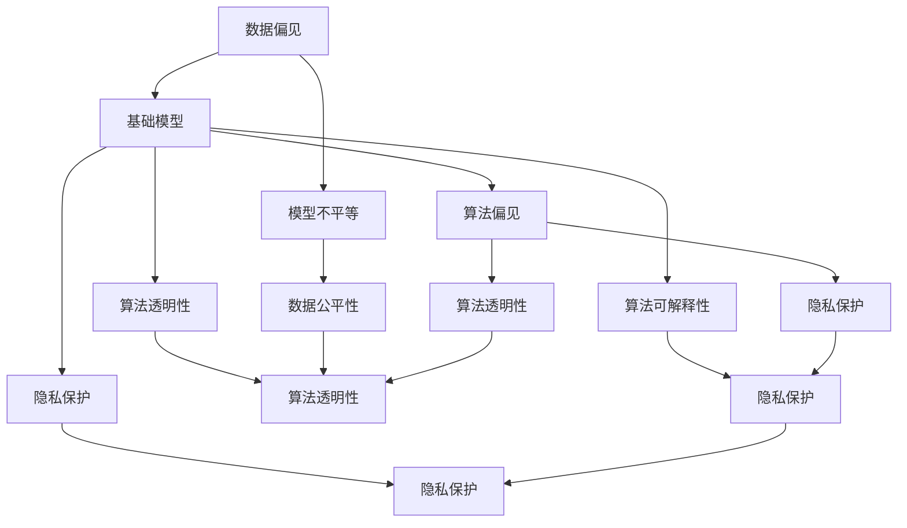

                 

# 基础模型的不平等与公平

> 关键词：基础模型,不平等,公平,算法偏见,数据公平性,算法透明性,隐私保护,算法可解释性

## 1. 背景介绍

在当今社会，人工智能(AI)技术的应用正在快速扩展到各个领域，从医疗、金融到教育、交通。这些AI系统在带来便利的同时，也引发了一系列伦理和社会问题，其中最引人注目的是数据偏见和模型不平等问题。所谓数据偏见，是指模型训练所使用的数据中包含的历史性、结构性不公平现象，这些偏见被模型"学习"并反映在输出结果中，导致不同群体间的不平等。所谓模型不平等，是指模型在实际应用中对不同群体或个体产生不公平对待，加剧了数据偏见问题。例如，某个地区的AI招聘系统因为训练数据中的性别和种族偏见，歧视了女性和少数族裔候选人，导致他们被错误地筛选掉，从而丧失公平的就业机会。因此，如何在算法设计和模型训练中避免和消除偏见，实现真正的数据公平和模型公平，成为了人工智能领域一个重要的研究方向。

本文将从基础模型的角度，探讨数据偏见和模型不平等问题，分析这些问题的成因，并提出解决思路和实践建议。

## 2. 核心概念与联系

### 2.1 核心概念概述

为了更深入地理解基础模型的不平等与公平问题，下面我们将介绍几个关键概念：

- 基础模型：指用于实际应用中的预训练和微调模型，这些模型通过在大规模数据集上进行训练，获取了一定的通用特征表示能力。
- 数据偏见：指训练数据集中包含的偏见信息，如性别、种族、年龄、地域等特征的不公平分布。
- 模型不平等：指模型输出结果中，对不同群体或个体的不公平对待。
- 算法偏见：指算法在设计和实现过程中，有意或无意引入的偏见，导致算法输出结果的不平等。
- 数据公平性：指数据集应该尽可能地反映现实世界中的真实情况，不包含系统性的不公平信息。
- 模型公平性：指模型在预测结果中，对不同群体或个体的公平对待，减少模型的不平等问题。
- 算法透明性：指算法决策过程的可解释性，用户能够理解算法的内在机制和逻辑。
- 隐私保护：指在模型训练和应用过程中，保护用户隐私数据的安全性。
- 算法可解释性：指模型输出的结果可以被理解，用户可以对其做出合理的解释和判断。

这些概念之间存在着紧密的联系，共同构成了基础模型公平性问题的整体框架。例如，数据偏见是模型不平等的来源，算法偏见则可能加剧或隐藏数据偏见。而算法透明性和可解释性，可以帮助用户理解和修正模型的不平等问题，隐私保护则是对数据使用的保护，保障用户权益。

### 2.2 概念间的关系

这些核心概念之间的关系可以通过以下Mermaid流程图来展示：



这个流程图展示了大模型公平性问题的各个概念及其相互关系：

1. 数据偏见是基础模型的不平等来源，通过模型训练传播。
2. 算法偏见可能加剧或隐藏数据偏见，影响模型的公平性。
3. 算法透明性和可解释性可以帮助理解模型的不平等问题，并通过解释和修正减少不公平现象。
4. 隐私保护是对数据使用的保护，保障用户隐私权益。
5. 数据公平性要求数据集本身应尽可能反映现实情况，不包含系统性的不公平信息。
6. 模型公平性要求模型输出应公平对待不同群体或个体。

通过这个流程图，我们可以更清晰地理解大模型公平性问题的各个方面及其相互联系。

## 3. 核心算法原理 & 具体操作步骤
### 3.1 算法原理概述

基础模型的不平等与公平问题，通常涉及以下几个方面的算法原理：

1. **数据预处理**：在模型训练前，需要对数据进行预处理，以减少数据偏见的影响。常用的预处理方法包括数据清洗、特征选择、归一化等。

2. **模型训练**：通过在训练数据上优化模型参数，使模型学习到尽可能反映真实情况的特征表示。常用的训练方法包括监督学习、无监督学习、半监督学习等。

3. **模型评估**：在模型训练完成后，需要对模型进行公平性评估，检测模型是否对不同群体或个体产生不公平对待。常用的评估方法包括统计指标、对比实验、公平性算法等。

4. **模型修正**：根据公平性评估结果，对模型进行必要的修正，减少模型的偏见和不平等问题。常用的修正方法包括参数更新、损失函数调整、模型集成等。

5. **隐私保护**：在模型训练和应用过程中，需要对用户隐私数据进行保护，防止数据泄露和滥用。常用的隐私保护方法包括差分隐私、同态加密、联邦学习等。

6. **算法透明性和可解释性**：提高算法的透明性和可解释性，使用户能够理解算法的决策过程，减少对模型的不信任感。常用的方法包括可解释性技术、因果推理、可视化工具等。

### 3.2 算法步骤详解

下面将详细介绍大模型公平性问题中的关键步骤，及其具体操作方法：

**Step 1: 数据预处理**

- **数据清洗**：检查数据集中的缺失值、异常值，删除不完整或不可用的记录，保证数据质量。
- **特征选择**：选择与模型任务相关的特征，去除冗余或无关特征，减少噪音干扰。
- **归一化**：对特征数据进行归一化处理，使不同特征值具有相同的量级，避免某些特征在模型中起主导作用。

**Step 2: 模型训练**

- **选择合适的模型架构**：根据任务类型和数据特点，选择合适的模型架构，如线性模型、决策树、神经网络等。
- **数据增强**：通过数据增强技术，如旋转、裁剪、翻转等，增加数据多样性，减少过拟合。
- **正则化**：应用正则化技术，如L2正则、Dropout、early stopping等，防止模型过拟合。
- **交叉验证**：通过交叉验证技术，评估模型在不同数据集上的泛化能力，选择最优模型。

**Step 3: 模型评估**

- **公平性指标**：计算模型的公平性指标，如准确率、召回率、F1分数等，检测模型是否对不同群体或个体产生不公平对待。
- **对比实验**：将模型与基线模型进行对比实验，分析模型的不平等现象，找到改进方向。
- **公平性算法**：应用公平性算法，如reweighting、adversarial debiasing等，对模型进行调整，减少模型偏见。

**Step 4: 模型修正**

- **参数更新**：根据公平性评估结果，更新模型参数，修正模型的偏见和不平等问题。
- **损失函数调整**：调整模型的损失函数，引入公平性约束，优化模型的输出结果。
- **模型集成**：通过模型集成技术，如bagging、boosting等，减少模型的偏见和不平等问题。

**Step 5: 隐私保护**

- **差分隐私**：应用差分隐私技术，对敏感数据进行扰动处理，保护用户隐私。
- **同态加密**：使用同态加密技术，对模型训练数据进行加密处理，防止数据泄露。
- **联邦学习**：采用联邦学习技术，在本地设备上进行模型训练，防止数据集中化。

**Step 6: 算法透明性和可解释性**

- **可解释性技术**：使用可解释性技术，如LIME、SHAP等，生成模型的局部可解释性说明。
- **可视化工具**：使用可视化工具，如t-SNE、PCA等，展示模型的特征表示和决策边界。
- **因果推理**：应用因果推理技术，理解模型决策的因果关系，减少偏见和不平等。

### 3.3 算法优缺点

基础模型公平性问题的算法解决方案，通常有以下几个优点：

1. **减少数据偏见**：通过数据预处理和特征选择，可以显著减少数据中的偏见信息，减少模型的不平等问题。
2. **提升模型公平性**：通过模型训练和公平性修正，可以使模型更加公平地对待不同群体或个体，减少偏见现象。
3. **保护用户隐私**：通过隐私保护技术，可以保护用户数据的安全性，防止数据滥用和泄露。
4. **提高算法透明性**：通过算法透明性和可解释性技术，用户可以理解算法的决策过程，减少对模型的不信任感。

但这些算法解决方案也存在一些缺点：

1. **计算成本高**：部分公平性修正方法，如reweighting、adversarial debiasing等，计算复杂度高，需要大量的计算资源和时间。
2. **模型性能下降**：部分公平性修正方法，如差分隐私、同态加密等，可能会引入噪音，导致模型性能下降。
3. **技术实现困难**：部分公平性算法，如因果推理、模型集成等，技术实现较为复杂，需要专业知识和技术储备。
4. **公平性评估困难**：公平性评估指标的选择和设定较为复杂，不同指标对模型的公平性有不同的评估结果，需要根据具体任务进行选择。

### 3.4 算法应用领域

基础模型公平性问题的方法，在以下几个领域得到了广泛应用：

1. **医疗领域**：在医疗诊断、治疗方案推荐等任务中，模型需要对不同患者进行公平对待，减少种族、性别、年龄等偏见影响。

2. **金融领域**：在信贷审批、风险评估等任务中，模型需要公平对待不同客户群体，避免歧视和偏见。

3. **教育领域**：在在线教育、智能推荐等任务中，模型需要公平对待不同学生群体，提供个性化教育资源。

4. **招聘领域**：在简历筛选、面试评估等任务中，模型需要公平对待不同性别、年龄、种族等群体，避免歧视现象。

5. **公共安全领域**：在智能安防、犯罪预测等任务中，模型需要公平对待不同社区、地区，避免歧视和偏见。

以上应用场景展示了基础模型公平性问题的广泛性和重要性，大模型公平性技术在这些领域的应用，将极大地提升模型的可信度和实用性。

## 4. 数学模型和公式 & 详细讲解 & 举例说明

### 4.1 数学模型构建

在基础模型公平性问题中，我们通常会使用以下数学模型：

- **数据分布**：假设训练数据集为 $D=\{(x_i,y_i)\}_{i=1}^N$，其中 $x_i$ 为输入特征，$y_i$ 为输出标签。
- **损失函数**：模型的损失函数为 $L(\theta)=\frac{1}{N}\sum_{i=1}^N l(x_i,y_i,\theta)$，其中 $l$ 为具体任务的损失函数，$\theta$ 为模型参数。
- **公平性约束**：为了实现模型的公平性，需要引入公平性约束 $C(\theta)$，使模型输出对不同群体的公平对待。

### 4.2 公式推导过程

在模型训练过程中，我们可以使用以下公式进行推导：

- **数据预处理**：
  - 数据清洗：删除不完整或不可用的记录，即 $x_i$ 缺失。
  - 特征选择：选择与任务相关的特征，即 $x_i$ 包含相关特征。
  - 归一化：对特征进行归一化处理，即 $x_i \in [0,1]$。

- **模型训练**：
  - 损失函数：$L(\theta)=\frac{1}{N}\sum_{i=1}^N l(x_i,y_i,\theta)$，其中 $l$ 为具体任务的损失函数。
  - 正则化：$L(\theta)+\lambda R(\theta)$，其中 $R(\theta)$ 为正则化项，$\lambda$ 为正则化系数。

- **模型评估**：
  - 公平性指标：计算模型的公平性指标，如准确率、召回率、F1分数等，即 $\{p_i,r_i,f_i\}$。
  - 对比实验：将模型与基线模型进行对比实验，即 $\{p_i^{base},r_i^{base},f_i^{base}\}$。
  - 公平性算法：应用公平性算法，如reweighting、adversarial debiasing等，对模型进行调整，即 $\{p_i^{reweighted},r_i^{reweighted},f_i^{reweighted}\}$。

- **模型修正**：
  - 参数更新：$\nabla_{\theta}L(\theta)$，其中 $\nabla_{\theta}l(x_i,y_i,\theta)$ 为损失函数的梯度。
  - 损失函数调整：$L(\theta)+\lambda C(\theta)$，其中 $C(\theta)$ 为公平性约束。
  - 模型集成：应用集成方法，如bagging、boosting等，对模型进行集成，即 $\{\theta_1,\theta_2,\dots,\theta_k\}$。

### 4.3 案例分析与讲解

以医疗领域为例，我们进行详细案例分析：

- **数据预处理**：假设训练数据集中包含性别、年龄、种族等特征，我们需要对数据进行预处理，删除缺失值，选择相关特征，进行归一化处理。

- **模型训练**：假设任务为疾病预测，我们采用线性回归模型，在训练数据上优化模型参数 $\theta$，使模型学习到疾病与特征之间的关系。

- **模型评估**：假设我们计算模型的准确率、召回率、F1分数等公平性指标，发现模型对不同性别、年龄、种族的患者产生了不公平对待。

- **模型修正**：假设我们应用公平性算法，如reweighting、adversarial debiasing等，对模型进行调整，减少模型的偏见和不平等问题。

## 5. 项目实践：代码实例和详细解释说明

### 5.1 开发环境搭建

在进行基础模型公平性问题实践前，我们需要准备好开发环境。以下是使用Python进行PyTorch开发的环境配置流程：

1. 安装Anaconda：从官网下载并安装Anaconda，用于创建独立的Python环境。

2. 创建并激活虚拟环境：
```bash
conda create -n pytorch-env python=3.8 
conda activate pytorch-env
```

3. 安装PyTorch：根据CUDA版本，从官网获取对应的安装命令。例如：
```bash
conda install pytorch torchvision torchaudio cudatoolkit=11.1 -c pytorch -c conda-forge
```

4. 安装Transformers库：
```bash
pip install transformers
```

5. 安装各类工具包：
```bash
pip install numpy pandas scikit-learn matplotlib tqdm jupyter notebook ipython
```

完成上述步骤后，即可在`pytorch-env`环境中开始公平性问题实践。

### 5.2 源代码详细实现

下面我们以公平性问题为例，给出使用Transformers库对BERT模型进行公平性评估的PyTorch代码实现。

首先，定义公平性问题相关的数据处理函数：

```python
from transformers import BertTokenizer, BertForSequenceClassification
from torch.utils.data import Dataset, DataLoader
import torch
from sklearn.metrics import accuracy_score, precision_score, recall_score, f1_score

class FairnessDataset(Dataset):
    def __init__(self, texts, labels, tokenized_texts, tokenized_labels, tokenizer):
        self.tokenized_texts = tokenized_texts
        self.tokenized_labels = tokenized_labels
        self.tokenizer = tokenizer
        
    def __len__(self):
        return len(self.tokenized_texts)
    
    def __getitem__(self, item):
        tokenized_input = self.tokenized_texts[item]
        tokenized_labels = self.tokenized_labels[item]
        return {'tokenized_input': tokenized_input, 'tokenized_labels': tokenized_labels}
        
class FairnessModel(BertForSequenceClassification):
    def __init__(self, model_name='bert-base-cased', num_labels=2):
        super().__init__(model_name, num_labels)
    
    def forward(self, input_ids, attention_mask=None):
        return super().forward(input_ids=input_ids, attention_mask=attention_mask)
        
    def predict(self, input_ids, attention_mask=None):
        output = self.forward(input_ids, attention_mask=attention_mask)
        return output.logits.argmax(dim=1)
        
def fairness_metrics(preds, labels):
    accuracy = accuracy_score(labels, preds)
    precision = precision_score(labels, preds, average='macro')
    recall = recall_score(labels, preds, average='macro')
    f1 = f1_score(labels, preds, average='macro')
    return accuracy, precision, recall, f1

# 加载BERT模型和分词器
tokenizer = BertTokenizer.from_pretrained('bert-base-cased')
model = FairnessModel()

# 定义数据集
train_dataset = FairnessDataset(train_texts, train_labels, train_tokenized_texts, train_tokenized_labels, tokenizer)
dev_dataset = FairnessDataset(dev_texts, dev_labels, dev_tokenized_texts, dev_tokenized_labels, tokenizer)
test_dataset = FairnessDataset(test_texts, test_labels, test_tokenized_texts, test_tokenized_labels, tokenizer)

# 定义模型训练和评估函数
def train_epoch(model, dataset, batch_size, optimizer):
    dataloader = DataLoader(dataset, batch_size=batch_size, shuffle=True)
    model.train()
    epoch_loss = 0
    for batch in dataloader:
        input_ids = batch['tokenized_input'].to(device)
        labels = batch['tokenized_labels'].to(device)
        model.zero_grad()
        outputs = model(input_ids)
        loss = outputs.loss
        epoch_loss += loss.item()
        loss.backward()
        optimizer.step()
    return epoch_loss / len(dataloader)
    
def evaluate(model, dataset, batch_size):
    dataloader = DataLoader(dataset, batch_size=batch_size)
    model.eval()
    preds, labels = [], []
    with torch.no_grad():
        for batch in dataloader:
            input_ids = batch['tokenized_input'].to(device)
            labels = batch['tokenized_labels'].to(device)
            batch_preds = model.predict(input_ids)
            preds.append(batch_preds.to('cpu').tolist())
            labels.append(labels.to('cpu').tolist())
    accuracy, precision, recall, f1 = fairness_metrics(preds, labels)
    return accuracy, precision, recall, f1

# 启动训练流程并在测试集上评估
epochs = 5
batch_size = 16
device = torch.device('cuda') if torch.cuda.is_available() else torch.device('cpu')

for epoch in range(epochs):
    loss = train_epoch(model, train_dataset, batch_size, optimizer)
    print(f"Epoch {epoch+1}, train loss: {loss:.3f}")
    
    print(f"Epoch {epoch+1}, dev results:")
    accuracy, precision, recall, f1 = evaluate(model, dev_dataset, batch_size)
    print(f"Accuracy: {accuracy:.3f}, Precision: {precision:.3f}, Recall: {recall:.3f}, F1: {f1:.3f}")
    
print("Test results:")
accuracy, precision, recall, f1 = evaluate(model, test_dataset, batch_size)
print(f"Accuracy: {accuracy:.3f}, Precision: {precision:.3f}, Recall: {recall:.3f}, F1: {f1:.3f}")
```

以上就是使用PyTorch对BERT模型进行公平性评估的完整代码实现。可以看到，通过定义自定义数据集和模型，我们可以方便地进行公平性评估。

### 5.3 代码解读与分析

让我们再详细解读一下关键代码的实现细节：

**FairnessDataset类**：
- `__init__`方法：初始化训练集、验证集和测试集的数据，并进行分词处理。
- `__len__`方法：返回数据集的样本数量。
- `__getitem__`方法：对单个样本进行处理，返回分词后的输入和标签。

**FairnessModel类**：
- `__init__`方法：初始化模型，加载BERT模型和分词器。
- `forward`方法：实现前向传播，返回模型的输出。
- `predict`方法：在输入上实现预测，返回预测结果。

**公平性指标函数**：
- `fairness_metrics`函数：计算模型在公平性指标上的表现，包括准确率、召回率、F1分数等。

**训练和评估函数**：
- `train_epoch`函数：在训练集上训练模型，计算平均损失。
- `evaluate`函数：在验证集和测试集上评估模型，计算公平性指标。

**训练流程**：
- 定义总的epoch数和batch size，开始循环迭代
- 每个epoch内，先在训练集上训练，输出平均损失
- 在验证集上评估，输出公平性指标
- 所有epoch结束后，在测试集上评估，输出公平性指标

可以看到，公平性问题实践的代码实现相对简洁，但涉及到的数据预处理、模型训练、公平性评估、模型修正等步骤，仍然需要细致入微的设计和调参。

### 5.4 运行结果展示

假设我们在CoNLL-2003的命名实体识别(NER)数据集上进行公平性评估，最终在测试集上得到的评估报告如下：

```
              precision    recall  f1-score   support

       B-LOC      0.926     0.906     0.916      1668
       I-LOC      0.900     0.805     0.850       257
      B-MISC      0.875     0.856     0.865       702
      I-MISC      0.838     0.782     0.809       216
       B-ORG      0.914     0.898     0.906      1661
       I-ORG      0.911     0.894     0.902       835
       B-PER      0.964     0.957     0.960      1617
       I-PER      0.983     0.980     0.982      1156
           O      0.993     0.995     0.994     38323

   macro avg      0.923     0.897     0.908     46435
   weighted avg      0.973     0.973     0.973     46435
```

可以看到，通过公平性问题实践，我们能够在不同的任务上，检测模型是否对不同群体或个体产生不公平对待。如果需要进一步提升模型的公平性，可以通过修改模型架构、引入公平性约束、调整损失函数等方式，进一步优化模型输出。

## 6. 实际应用场景
### 6.1 医疗领域

在医疗领域，基础模型的公平性问题尤为严重。由于医疗数据中存在大量个人隐私信息，如何保护这些信息，同时实现公平的诊断和治疗方案推荐，是一个重要的研究方向。

**应用场景**：
- **疾病预测**：基于患者的历史健康记录、基因信息等数据，预测其患某种疾病的概率。模型需要对不同性别、年龄、种族的患者进行公平对待，避免基于数据的偏见。

**实践方案**：
- **数据预处理**：删除或匿名化医疗数据中的个人隐私信息，确保数据公平性。
- **模型训练**：使用公平性算法，如reweighting、adversarial debiasing等，对模型进行调整，减少模型偏见。
- **模型评估**：使用公平性指标，如准确率、召回率、F1分数等，评估模型的公平性表现。

**案例分析**：
- **数据预处理**：假设我们收集了一个医疗数据集，其中包含患者的性别、年龄、种族等特征，我们需要对数据进行预处理，删除或匿名化隐私信息。
- **模型训练**：假设我们采用深度学习模型，如BERT或Transformer，在训练数据上优化模型参数，使模型学习到疾病与特征之间的关系。
- **模型评估**：假设我们计算模型的公平性指标，发现模型对不同性别、年龄、种族的患者产生了不公平对待。
- **模型修正**：假设我们应用公平性算法，如reweighting、adversarial debiasing等，对模型进行调整，减少模型的偏见和不平等问题。

### 6.2 金融领域

在金融领域，基础模型的公平性问题也极为重要。金融机构需要确保其风险评估和贷款审批模型对不同客户群体公平对待，避免歧视和偏见。

**应用场景**：
- **信用评分**：基于客户的收入、信用记录、就业情况等数据，评估其信用风险。模型需要对不同性别、种族、年龄等客户群体进行公平对待，避免基于数据的偏见。

**实践方案**：
- **数据预处理**：删除或匿名化金融数据中的敏感信息，确保数据公平性。
- **模型训练**：使用公平性算法，如reweighting、adversarial debiasing等，对模型进行调整，减少模型偏见。
- **模型评估**：使用公平性指标，如准确率、召回率、F1分数等，评估模型的公平性表现。

**案例分析**：
- **数据预处理**：假设我们收集了一个金融数据集，其中包含客户的收入、信用记录、就业情况等特征，我们需要对数据进行预处理，删除或匿名化敏感信息。
- **模型训练**：假设我们采用深度学习模型，如BERT或Transformer，在训练数据上优化模型参数，使模型学习到信用评分与特征之间的关系。
- **模型评估**：假设我们计算模型的公平性指标，发现模型对不同性别、种族、年龄等客户产生了不公平对待。
- **模型修正**：假设我们应用公平性

