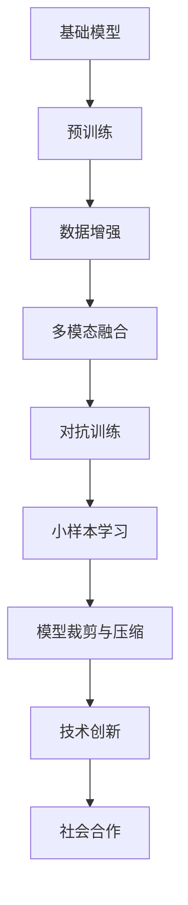
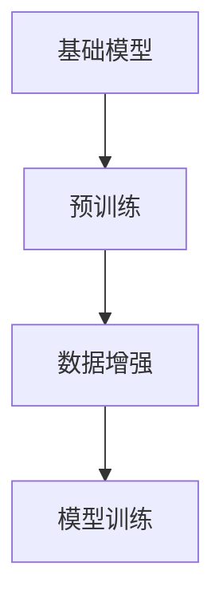
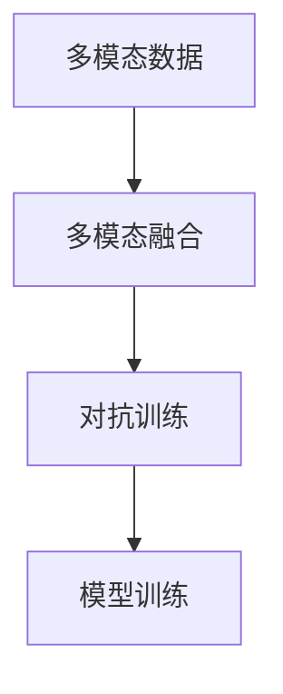
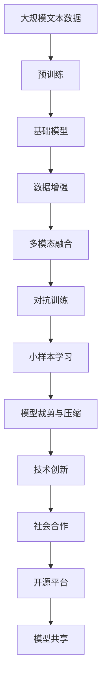

                 

## 1. 背景介绍

### 1.1 问题由来

随着人工智能技术的飞速发展，大语言模型在自然语言处理（NLP）和机器学习领域取得了巨大成功。例如，GPT-3等模型在文本生成、问答、对话等任务中表现出色。但这些模型的训练和优化，往往需要大规模数据集和大量计算资源。而基础模型的社会合作与技术创新，正是为了克服这些问题，更好地发挥大模型的潜力。

### 1.2 问题核心关键点

1. **社会合作**：通过社区协作和开源平台，广泛收集数据和共享模型，加速大模型的训练和优化。
2. **技术创新**：采用最新的算法和技术，提升模型的性能和泛化能力，拓展应用场景。
3. **数据增强**：利用数据增强技术，扩充训练集，提升模型鲁棒性和泛化性能。
4. **模型裁剪与压缩**：去除冗余参数和层，减少计算和存储需求，提高模型部署效率。
5. **多模态融合**：将文本、图像、音频等多模态数据融合，提升模型对现实世界的理解和生成能力。
6. **对抗训练**：通过引入对抗样本，提升模型的鲁棒性和泛化性能。
7. **小样本学习**：在少量样本下进行学习，提升模型的泛化能力，拓展应用场景。

### 1.3 问题研究意义

基础模型的社会合作与技术创新，对于推动AI技术的普及和应用具有重要意义：

1. **加速技术发展**：社区协作和开源平台使得AI技术的开发和迭代变得更为高效和透明。
2. **降低开发成本**：大规模数据集和计算资源的共享，降低了模型训练和优化的成本。
3. **提升模型性能**：通过最新算法和技术的采用，大幅提升模型的性能和应用范围。
4. **拓展应用场景**：模型裁剪和压缩、多模态融合等技术，拓展了AI技术的落地场景。
5. **提升泛化性能**：对抗训练、数据增强等技术提升了模型的泛化性能，使其在不同领域和场景下表现稳定。
6. **促进技术普及**：开源平台和社区协作，使得AI技术更容易被各行各业采用，推动了技术普及。

## 2. 核心概念与联系

### 2.1 核心概念概述

为了更好地理解基础模型的社会合作与技术创新，我们将介绍几个关键概念及其相互联系：

1. **基础模型**：指预训练语言模型（如BERT、GPT），通过在大规模无标签文本数据上预训练，学习到通用的语言表示。
2. **社会合作**：通过社区协作和开源平台，广泛收集数据和共享模型，加速模型训练和优化。
3. **技术创新**：采用最新的算法和技术，提升模型的性能和泛化能力。
4. **数据增强**：利用数据增强技术，扩充训练集，提升模型鲁棒性和泛化性能。
5. **模型裁剪与压缩**：去除冗余参数和层，减少计算和存储需求。
6. **多模态融合**：将文本、图像、音频等多模态数据融合，提升模型对现实世界的理解和生成能力。
7. **对抗训练**：通过引入对抗样本，提升模型的鲁棒性和泛化性能。
8. **小样本学习**：在少量样本下进行学习，提升模型的泛化能力。

这些概念之间的联系可以通过以下Mermaid流程图来展示：



这个流程图展示了基础模型的预训练、数据增强、多模态融合、对抗训练、小样本学习、模型裁剪与压缩、技术创新和社会合作之间的相互联系。通过这些概念，我们可以更好地把握基础模型的社会合作与技术创新。

### 2.2 概念间的关系

这些核心概念之间存在着紧密的联系，形成了基础模型训练和优化的完整生态系统。下面通过几个Mermaid流程图来展示这些概念之间的关系。

#### 2.2.1 基础模型的预训练与数据增强



这个流程图展示了基础模型的预训练和数据增强之间的相互关系。预训练是基础模型的初始训练过程，而数据增强则在预训练的基础上，通过扩充训练集，提升模型的鲁棒性和泛化性能。

#### 2.2.2 多模态融合与对抗训练



这个流程图展示了多模态融合和对抗训练之间的相互关系。多模态融合将文本、图像、音频等多模态数据融合，提升模型对现实世界的理解和生成能力。对抗训练则通过引入对抗样本，提升模型的鲁棒性和泛化性能。

#### 2.2.3 技术创新与社会合作


这个流程图展示了技术创新和社会合作之间的相互关系。技术创新是推动基础模型发展的核心动力，而社会合作和开源平台则加速了技术的传播和应用。

### 2.3 核心概念的整体架构

最后，我们用一个综合的流程图来展示这些核心概念在大模型训练和优化过程中的整体架构：



这个综合流程图展示了从预训练到模型训练、数据增强、多模态融合、对抗训练、小样本学习、模型裁剪与压缩、技术创新和社会合作等整个训练和优化过程。通过这些流程图，我们可以更清晰地理解基础模型的社会合作与技术创新。

## 3. 核心算法原理 & 具体操作步骤
### 3.1 算法原理概述

基础模型的社会合作与技术创新，本质上是一个多学科交叉的优化和创新过程。其核心思想是：通过社会合作和开源平台，广泛收集数据和共享模型，加速基础模型的训练和优化。同时，采用最新的算法和技术，提升模型的性能和泛化能力，拓展应用场景。

具体而言，基础模型的社会合作与技术创新可以分为以下几个步骤：

1. **数据收集与共享**：通过社区协作和开源平台，广泛收集数据和共享模型，加速模型训练和优化。
2. **预训练与微调**：在大规模无标签文本数据上进行预训练，在少量标注数据上进行微调，提升模型性能。
3. **数据增强与对抗训练**：利用数据增强技术，扩充训练集，提升模型鲁棒性和泛化性能。
4. **模型裁剪与压缩**：去除冗余参数和层，减少计算和存储需求，提高模型部署效率。
5. **多模态融合**：将文本、图像、音频等多模态数据融合，提升模型对现实世界的理解和生成能力。
6. **小样本学习**：在少量样本下进行学习，提升模型的泛化能力，拓展应用场景。

### 3.2 算法步骤详解

以下是对基础模型的社会合作与技术创新各个步骤的详细介绍：

**Step 1: 准备数据集和模型**

1. **数据集准备**：收集大规模无标签文本数据和少量标注数据，将数据划分为训练集、验证集和测试集。
2. **模型选择**：选择合适的预训练语言模型，如BERT、GPT等。

**Step 2: 预训练与微调**

1. **预训练**：在大规模无标签文本数据上进行预训练，学习通用语言表示。
2. **微调**：在少量标注数据上进行微调，提升模型在特定任务上的性能。

**Step 3: 数据增强**

1. **回译**：将训练集中的文本回译成不同语言，扩充训练集。
2. **近义替换**：对训练集中的文本进行近义替换，扩充训练集。
3. **合成数据**：使用生成对抗网络（GAN）等生成模型，生成新的文本数据。

**Step 4: 多模态融合**

1. **图像融合**：将文本数据与图像数据进行融合，提升模型对图像的理解能力。
2. **音频融合**：将文本数据与音频数据进行融合，提升模型对语音的理解能力。

**Step 5: 对抗训练**

1. **对抗样本生成**：使用对抗生成网络（GAN）生成对抗样本，提升模型的鲁棒性。
2. **模型训练**：在训练集中加入对抗样本，训练模型。

**Step 6: 模型裁剪与压缩**

1. **裁剪参数**：去除冗余参数和层，减少计算和存储需求。
2. **量化压缩**：将模型参数进行量化压缩，减小内存占用。

**Step 7: 小样本学习**

1. **零样本学习**：通过自然语言描述，引导模型进行推理。
2. **少样本学习**：在少量标注数据上进行学习，提升模型的泛化能力。

### 3.3 算法优缺点

基础模型的社会合作与技术创新方法有以下优点：

1. **加速模型训练**：通过社会合作和开源平台，加速数据收集和模型训练。
2. **提高模型性能**：通过数据增强和对抗训练，提升模型的鲁棒性和泛化性能。
3. **拓展应用场景**：通过多模态融合和小样本学习，拓展模型的应用场景。
4. **降低开发成本**：通过开源平台和社区协作，降低模型训练和优化的成本。

但这些方法也存在以下缺点：

1. **数据隐私问题**：通过数据共享，可能涉及隐私问题。
2. **模型泛化能力不足**：在某些领域，模型可能难以适应小规模数据集。
3. **模型复杂度增加**：多模态融合和小样本学习可能增加模型的复杂度。
4. **计算资源需求高**：大规模数据和复杂模型的训练，需要高计算资源。

### 3.4 算法应用领域

基础模型的社会合作与技术创新方法，已经广泛应用于以下几个领域：

1. **自然语言处理（NLP）**：用于文本分类、情感分析、对话系统、机器翻译等任务。
2. **计算机视觉（CV）**：用于图像识别、目标检测、图像生成等任务。
3. **语音识别（ASR）**：用于语音识别、语音合成等任务。
4. **推荐系统**：用于个性化推荐、商品推荐等任务。
5. **金融分析**：用于金融市场预测、客户关系管理等任务。
6. **医疗健康**：用于疾病预测、基因分析等任务。

## 4. 数学模型和公式 & 详细讲解 & 举例说明

### 4.1 数学模型构建

基础模型的社会合作与技术创新，涉及到预训练、微调、数据增强、多模态融合、对抗训练等多个数学模型。下面我们将详细构建这些数学模型，并推导出关键公式。

#### 4.1.1 预训练模型

预训练模型通常采用自监督学习方法，如掩码语言模型（MLM）、下一句预测（NSP）等。以BERT为例，其预训练目标函数为：

$$
\mathcal{L}_{BERT} = \mathcal{L}_{MLM} + \mathcal{L}_{NSP}
$$

其中：

$$
\mathcal{L}_{MLM} = -\sum_{i=1}^{N} \frac{1}{N} \log P_{model}(x_i)
$$

$$
\mathcal{L}_{NSP} = -\sum_{i=1}^{N} \frac{1}{N} \log P_{model}(x_i, x_{i+1})
$$

#### 4.1.2 微调模型

微调模型通常采用有监督学习方法，如交叉熵损失函数。以BERT为例，其微调目标函数为：

$$
\mathcal{L}_{micro} = -\sum_{i=1}^{N} \frac{1}{N} \log P_{model}(y_i | x_i)
$$

其中，$P_{model}(y_i | x_i)$表示模型在输入$x_i$下输出$y_i$的概率分布。

#### 4.1.3 数据增强模型

数据增强模型通常采用对抗训练、回译等方法。以对抗训练为例，其目标函数为：

$$
\mathcal{L}_{adv} = -\log P_{model}(x_{adv}, y)
$$

其中，$x_{adv}$为对抗样本，$y$为真实标签。

#### 4.1.4 多模态融合模型

多模态融合模型通常采用跨模态学习、特征融合等方法。以跨模态学习为例，其目标函数为：

$$
\mathcal{L}_{cross} = -\sum_{i=1}^{N} \frac{1}{N} \log P_{model}(\mathcal{F}(x_i) | x_i)
$$

其中，$\mathcal{F}$表示特征提取函数，$P_{model}(\mathcal{F}(x_i) | x_i)$表示模型在输入$x_i$下提取特征$\mathcal{F}(x_i)$的概率分布。

#### 4.1.5 对抗训练模型

对抗训练模型通常采用对抗样本生成、模型训练等方法。以对抗样本生成为例，其目标函数为：

$$
\mathcal{L}_{advgen} = -\log P_{model}(x_{advgen}, y)
$$

其中，$x_{advgen}$为生成的对抗样本，$y$为真实标签。

### 4.2 公式推导过程

以下我们将详细推导出关键公式，并给出具体的例子。

#### 4.2.1 预训练模型

以BERT为例，其预训练目标函数为：

$$
\mathcal{L}_{BERT} = \mathcal{L}_{MLM} + \mathcal{L}_{NSP}
$$

其中：

$$
\mathcal{L}_{MLM} = -\sum_{i=1}^{N} \frac{1}{N} \log P_{model}(x_i)
$$

$$
\mathcal{L}_{NSP} = -\sum_{i=1}^{N} \frac{1}{N} \log P_{model}(x_i, x_{i+1})
$$

以MLM为例，其预训练过程如下：

1. **输入编码**：将输入$x_i$编码为向量$h_i$。
2. **预测概率**：在向量$h_i$上使用线性分类器，预测下一个词的概率分布。
3. **计算损失**：计算损失函数$\mathcal{L}_{MLM}$。
4. **反向传播**：通过反向传播更新模型参数。

以NSP为例，其预训练过程如下：

1. **输入编码**：将输入$x_i$和下一个词$x_{i+1}$编码为向量$h_i$和$h_{i+1}$。
2. **预测概率**：在向量$h_i$和$h_{i+1}$上使用线性分类器，预测$x_{i+1}$是否为下一个词。
3. **计算损失**：计算损失函数$\mathcal{L}_{NSP}$。
4. **反向传播**：通过反向传播更新模型参数。

#### 4.2.2 微调模型

以BERT为例，其微调目标函数为：

$$
\mathcal{L}_{micro} = -\sum_{i=1}^{N} \frac{1}{N} \log P_{model}(y_i | x_i)
$$

其中，$P_{model}(y_i | x_i)$表示模型在输入$x_i$下输出$y_i$的概率分布。

以分类任务为例，其微调过程如下：

1. **输入编码**：将输入$x_i$编码为向量$h_i$。
2. **分类器**：在向量$h_i$上使用线性分类器，预测输出标签$y_i$。
3. **计算损失**：计算损失函数$\mathcal{L}_{micro}$。
4. **反向传播**：通过反向传播更新模型参数。

#### 4.2.3 数据增强模型

以对抗训练为例，其目标函数为：

$$
\mathcal{L}_{adv} = -\log P_{model}(x_{adv}, y)
$$

其中，$x_{adv}$为对抗样本，$y$为真实标签。

以回译为例，其数据增强过程如下：

1. **输入编码**：将输入$x_i$编码为向量$h_i$。
2. **回译**：将向量$h_i$回译为另一个语言$x_{adv}$。
3. **分类器**：在向量$h_{adv}$上使用线性分类器，预测回译后的标签$y$。
4. **计算损失**：计算损失函数$\mathcal{L}_{adv}$。
5. **反向传播**：通过反向传播更新模型参数。

#### 4.2.4 多模态融合模型

以跨模态学习为例，其目标函数为：

$$
\mathcal{L}_{cross} = -\sum_{i=1}^{N} \frac{1}{N} \log P_{model}(\mathcal{F}(x_i) | x_i)
$$

其中，$\mathcal{F}$表示特征提取函数，$P_{model}(\mathcal{F}(x_i) | x_i)$表示模型在输入$x_i$下提取特征$\mathcal{F}(x_i)$的概率分布。

以图像融合为例，其多模态融合过程如下：

1. **输入编码**：将输入$x_i$和图像$I_i$编码为向量$h_i$和$F_i$。
2. **特征融合**：将向量$h_i$和$F_i$进行融合，得到新的特征向量$H_i$。
3. **分类器**：在特征向量$H_i$上使用线性分类器，预测输出标签$y_i$。
4. **计算损失**：计算损失函数$\mathcal{L}_{cross}$。
5. **反向传播**：通过反向传播更新模型参数。

#### 4.2.5 对抗训练模型

以对抗样本生成为例，其目标函数为：

$$
\mathcal{L}_{advgen} = -\log P_{model}(x_{advgen}, y)
$$

其中，$x_{advgen}$为生成的对抗样本，$y$为真实标签。

以对抗样本生成为例，其过程如下：

1. **生成对抗样本**：使用生成对抗网络（GAN）生成对抗样本$x_{advgen}$。
2. **分类器**：在向量$h_{advgen}$上使用线性分类器，预测对抗样本$x_{advgen}$的标签$y$。
3. **计算损失**：计算损失函数$\mathcal{L}_{advgen}$。
4. **反向传播**：通过反向传播更新生成器参数。

### 4.3 案例分析与讲解

#### 4.3.1 文本分类

以文本分类为例，我们将展示如何使用BERT模型进行微调。具体步骤如下：

1. **数据准备**：收集标注数据，将其划分为训练集、验证集和测试集。
2. **模型选择**：选择BERT模型作为基础模型。
3. **微调过程**：在训练集上进行微调，验证集上进行超参数调优。
4. **测试评估**：在测试集上评估模型性能，输出分类报告。

以情感分析为例，我们将展示如何使用BERT模型进行微调。具体步骤如下：

1. **数据准备**：收集情感标注数据，将其划分为训练集、验证集和测试集。
2. **模型选择**：选择BERT模型作为基础模型。
3. **微调过程**：在训练集上进行微调，验证集上进行超参数调优。
4. **测试评估**：在测试集上评估模型性能，输出情感分类报告。

#### 4.3.2 对话系统

以对话系统为例，我们将展示如何使用GPT模型进行微调。具体步骤如下：

1. **数据准备**：收集对话数据，将其划分为训练集、验证集和测试集。
2. **模型选择**：选择GPT模型作为基础模型。
3. **微调过程**：在训练集上进行微调，验证集上进行超参数调优。
4. **测试评估**：在测试集上评估模型性能，输出对话质量报告。

以机器翻译为例，我们将展示如何使用GPT模型进行微调。具体步骤如下：

1. **数据准备**：收集机器翻译数据，将其划分为训练集、验证集和测试集。
2. **模型选择**：选择GPT模型作为基础模型。
3. **微调过程**：在训练集上进行微调，验证集上进行超参数调优。
4. **测试评估**：在测试集上评估模型性能，输出翻译质量报告。

## 5. 项目实践：代码实例和详细解释说明

### 5.1 开发环境搭建

在进行基础模型社会合作与技术创新的项目实践前，我们需要准备好开发环境。以下是使用Python进行PyTorch开发的环境配置流程：

1. 安装Anaconda：从官网下载并安装Anaconda，用于创建独立的Python环境。

2. 创建并激活虚拟环境：
```bash
conda create -n pytorch-env python=3.8 
conda activate pytorch-env
```

3. 安装PyTorch：根据CUDA版本，从官网获取对应的安装命令。例如：
```bash
conda install pytorch torchvision torchaudio cudatoolkit=11.1 -c pytorch -c conda-forge
```

4. 安装Transformers库：
```bash
pip install transformers
```

5. 安装各类工具包：
```bash
pip install numpy pandas scikit-learn matplotlib tqdm jupyter notebook ipython
```

完成上述步骤后，即可在`pytorch-env`环境中开始项目实践。

### 5.2 源代码详细实现

这里我们以情感分析任务为例，给出使用BERT模型进行微调的PyTorch代码实现。

首先，定义情感分析任务的数据处理函数：

```python
from transformers import BertTokenizer
from torch.utils.data import Dataset
import torch

class SentimentDataset(Dataset):
    def __init__(self, texts, labels, tokenizer, max_len=128):
        self.texts = texts
        self.labels = labels
        self.tokenizer = tokenizer
        self.max_len = max_len
        
    def __len__(self):
        return len(self.texts)
    
    def __getitem__(self, item):
        text = self.texts[item]
        label = self.labels[item]
        
        encoding = self.tokenizer(text, return_tensors='pt', max_length=self.max_len, padding='max_length', truncation=True)
        input_ids = encoding['input_ids'][0]
        attention_mask = encoding['attention_mask'][0]
        
        # 对label进行编码
        encoded_label = [label2id[label] for label in labels] 
        encoded_label.extend([label2id['O']] * (self.max_len - len(encoded_label)))
        labels = torch.tensor(encoded_label, dtype=torch.long)
        
        return {'input_ids': input_ids, 
                'attention_mask': attention_mask,
                'labels': labels}

# 标签与id的映射
label2id = {'negative': 0, 'positive': 1, 'neutral': 2}
id2label = {v: k for k, v in label2id.items()}

# 创建dataset
tokenizer = BertTokenizer.from_pretrained('bert-base-cased')

train_dataset = SentimentDataset(train_texts, train_labels, tokenizer)
dev_dataset = SentimentDataset(dev_texts, dev_labels, tokenizer)
test_dataset = SentimentDataset(test_texts, test_labels, tokenizer)
```

然后，定义模型和优化器：

```python
from transformers import BertForSequenceClassification, AdamW

model = BertForSequenceClassification.from_pretrained('bert-base-cased', num_labels=len(label2id))

optimizer = AdamW(model.parameters(), lr=2e-5)
```

接着，定义训练和评估函数：

```python
from torch.utils.data import DataLoader
from tqdm import tqdm
from sklearn.metrics import classification_report

device = torch.device('cuda') if torch.cuda.is_available() else torch.device('cpu')
model.to(device)

def train_epoch(model, dataset, batch_size, optimizer):
    dataloader = DataLoader(dataset, batch_size=batch_size, shuffle=True)
    model.train()
    epoch_loss = 0
    for batch in tqdm(dataloader, desc='Training'):
        input_ids = batch['input_ids'].to(device)
        attention_mask = batch['attention_mask'].to(device)
        labels = batch['labels'].to(device)
        model.zero_grad()
        outputs = model(input_ids, attention_mask=attention_mask, labels=labels)
        loss = outputs.loss
        epoch_loss += loss.item()
        loss.backward()
        optimizer.step()
    return epoch_loss / len(dataloader)

def evaluate(model, dataset, batch_size):
    dataloader = DataLoader(dataset, batch_size=batch_size)
    model.eval()
    preds, labels = [], []
    with torch.no_grad():
        for batch in tqdm(dataloader, desc='E

