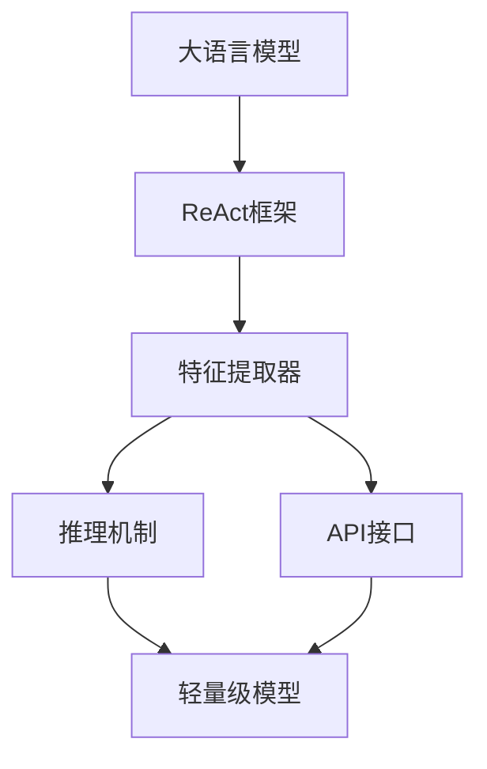
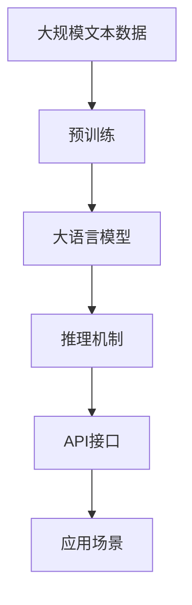
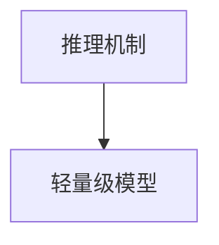
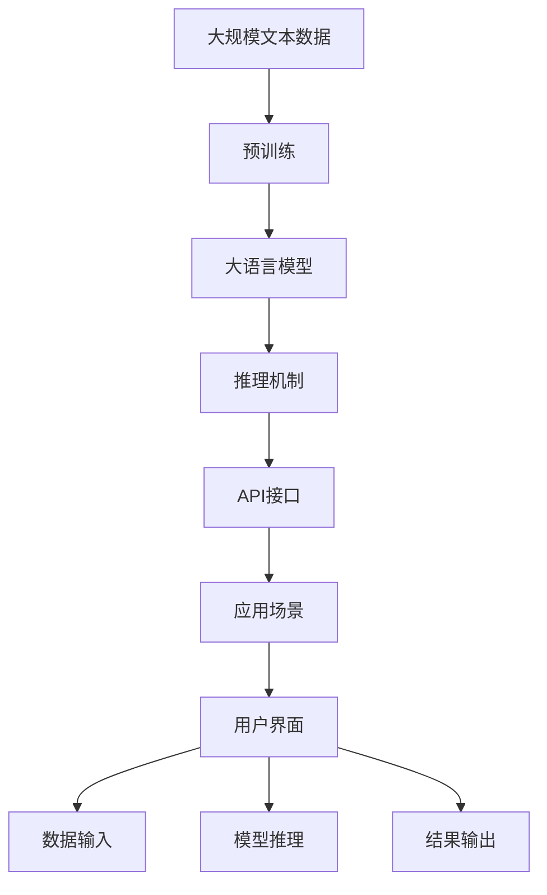

                 

# 大语言模型应用指南：ReAct 框架

大语言模型，如GPT-3、BERT等，正在引领一场NLP技术的革命。其庞大的参数量和卓越的性能，使得这些模型在各种任务上都能取得卓越效果。但如何更好地利用这些大模型，解决实际问题？本文将为您介绍一种高效的大语言模型应用框架——ReAct，帮助您轻松实现模型应用，提高工作效率。

## 1. 背景介绍

### 1.1 问题由来

随着深度学习技术的快速发展，大语言模型在NLP领域取得了巨大的突破。这些模型通过在大规模无标签文本数据上进行预训练，学习到了丰富的语言知识和常识，能够进行语言理解和生成，从而在各种NLP任务中表现出色。

然而，大语言模型通常具有庞大的参数量，对计算资源和存储空间提出了很高的要求，这限制了其在一些资源有限的场景中的应用。此外，大语言模型的推理速度较慢，不适合实时任务。

为了解决这些问题，ReAct框架应运而生。该框架利用大语言模型作为特征提取器，结合高效的推理机制，提供了一种轻量级、可扩展的解决方案，使开发者能够快速实现大语言模型的应用。

### 1.2 问题核心关键点

ReAct框架的核心思想是将大语言模型作为特征提取器，结合高效的推理机制，通过轻量级模型实现高效的应用。其核心在于：

- 利用大语言模型的强大特征提取能力，减少对特征工程的依赖。
- 结合高效的推理机制，实现轻量级模型，提高推理速度。
- 提供丰富的API接口，简化应用开发过程。

## 2. 核心概念与联系

### 2.1 核心概念概述

为了更好地理解ReAct框架，本节将介绍几个密切相关的核心概念：

- 大语言模型(Large Language Model, LLM)：以自回归(如GPT)或自编码(如BERT)模型为代表的大规模预训练语言模型。通过在大规模无标签文本语料上进行预训练，学习通用的语言表示，具备强大的语言理解和生成能力。

- ReAct框架：一种基于大语言模型的高效应用框架，利用大语言模型作为特征提取器，结合高效的推理机制，实现轻量级模型，并简化应用开发过程。

- 特征提取器：利用大语言模型的强大特征提取能力，减少对特征工程的依赖，降低应用开发成本。

- 推理机制：结合高效的推理机制，实现轻量级模型，提高推理速度，满足实时任务的需求。

- API接口：提供丰富的API接口，简化应用开发过程，使开发者能够快速实现大语言模型的应用。

- 可扩展性：框架设计为可扩展的，支持添加新的推理机制和API接口，适应不同的应用场景。

这些核心概念之间的逻辑关系可以通过以下Mermaid流程图来展示：



这个流程图展示了大语言模型与ReAct框架之间的联系：大语言模型作为特征提取器，与推理机制、API接口结合，最终实现轻量级模型，提高应用开发效率。

### 2.2 概念间的关系

这些核心概念之间存在着紧密的联系，形成了ReAct框架的完整生态系统。下面我们通过几个Mermaid流程图来展示这些概念之间的关系。

#### 2.2.1 大语言模型的应用场景



这个流程图展示了大语言模型在ReAct框架中的应用场景。大语言模型通过预训练获得基础能力，与推理机制、API接口结合，最终应用于不同的应用场景。

#### 2.2.2 ReAct框架与大语言模型


这个流程图展示了ReAct框架与大语言模型之间的关系。ReAct框架利用大语言模型作为特征提取器，结合推理机制和API接口，实现轻量级模型，简化应用开发过程。

#### 2.2.3 推理机制与轻量级模型



这个流程图展示了推理机制与轻量级模型之间的关系。推理机制与轻量级模型结合，提高了推理速度，满足实时任务的需求。

### 2.3 核心概念的整体架构

最后，我们用一个综合的流程图来展示这些核心概念在大语言模型应用中的整体架构：



这个综合流程图展示了从预训练到大语言模型应用的全过程。大规模文本数据通过预训练获得基础能力，然后与推理机制、API接口结合，最终应用于不同的应用场景，并通过用户界面进行数据输入、模型推理和结果输出。

## 3. 核心算法原理 & 具体操作步骤

### 3.1 算法原理概述

ReAct框架的核心算法原理是基于大语言模型的高效应用。其核心思想是将大语言模型作为特征提取器，结合高效的推理机制，通过轻量级模型实现高效的应用。

具体而言，ReAct框架包括以下几个步骤：

1. 利用大语言模型对输入数据进行特征提取，得到高维表示向量。
2. 利用高效的推理机制对特征向量进行处理，得到最终的结果。
3. 利用丰富的API接口，简化应用开发过程。

### 3.2 算法步骤详解

ReAct框架的实现过程可以分为以下几个关键步骤：

**Step 1: 特征提取**

ReAct框架利用大语言模型对输入数据进行特征提取，得到高维表示向量。这一步骤的实现过程如下：

1. 将输入数据进行预处理，如分词、编码等。
2. 将预处理后的数据输入大语言模型，得到高维表示向量。

以下是Python代码实现示例：

```python
from transformers import BertModel

# 加载BERT模型
model = BertModel.from_pretrained('bert-base-uncased')

# 输入文本数据
text = "This is a sample text."

# 对文本进行编码，得到输入张量
input_ids = model.tokenizer(text, return_tensors='pt')['input_ids']

# 输入模型进行特征提取
features = model(input_ids)

# 获取输出特征向量
feature_vector = features[0]['hidden_states'][:, 0, :]
```

**Step 2: 推理机制**

ReAct框架利用高效的推理机制对特征向量进行处理，得到最终的结果。这一步骤的实现过程如下：

1. 将特征向量输入到轻量级推理模型中，得到最终的结果。
2. 利用API接口将结果输出。

以下是Python代码实现示例：

```python
from transformers import BertForSequenceClassification

# 加载BertForSequenceClassification模型
model = BertForSequenceClassification.from_pretrained('bert-base-uncased', num_labels=2)

# 对特征向量进行处理，得到最终结果
result = model(features)

# 输出结果
print(result)
```

**Step 3: API接口**

ReAct框架提供丰富的API接口，简化应用开发过程。开发者可以根据需求，选择不同的API接口，实现不同的功能。

以下是Python代码实现示例：

```python
from transformers import pipeline

# 加载文本分类模型
model = pipeline('text-classification', model='bert-base-uncased')

# 对文本进行分类
result = model(text)

# 输出分类结果
print(result)
```

### 3.3 算法优缺点

ReAct框架的优点在于：

- 利用大语言模型的强大特征提取能力，减少对特征工程的依赖，降低应用开发成本。
- 结合高效的推理机制，实现轻量级模型，提高推理速度，满足实时任务的需求。
- 提供丰富的API接口，简化应用开发过程，使开发者能够快速实现大语言模型的应用。

ReAct框架的缺点在于：

- 需要较高的计算资源和存储空间，对硬件要求较高。
- 推理速度受大语言模型的影响，可能较慢。
- API接口的灵活性有限，部分应用场景可能需要自定义接口。

### 3.4 算法应用领域

ReAct框架在多个NLP应用领域都有广泛的应用，例如：

- 文本分类：如情感分析、主题分类、意图识别等。将文本数据输入模型，输出分类结果。
- 命名实体识别：识别文本中的人名、地名、机构名等特定实体。将文本数据输入模型，输出实体标签。
- 关系抽取：从文本中抽取实体之间的语义关系。将文本数据输入模型，输出关系三元组。
- 问答系统：对自然语言问题给出答案。将问题输入模型，输出答案。
- 机器翻译：将源语言文本翻译成目标语言。将源语言文本输入模型，输出目标语言文本。
- 文本摘要：将长文本压缩成简短摘要。将长文本输入模型，输出摘要结果。

除上述这些经典任务外，ReAct框架还被创新性地应用到更多场景中，如可控文本生成、常识推理、代码生成、数据增强等，为NLP技术带来了全新的突破。

## 4. 数学模型和公式 & 详细讲解 & 举例说明

### 4.1 数学模型构建

ReAct框架的数学模型构建主要包括以下几个部分：

1. 特征提取模型：利用大语言模型对输入数据进行特征提取，得到高维表示向量。
2. 推理模型：利用高效的推理机制对特征向量进行处理，得到最终的结果。
3. API接口：提供丰富的API接口，简化应用开发过程。

### 4.2 公式推导过程

以下是ReAct框架的数学模型构建和公式推导过程：

**特征提取模型**

假设大语言模型的输入为文本数据 $x$，输出为高维表示向量 $h$。特征提取模型的数学表达式如下：

$$
h = M(x)
$$

其中 $M$ 为大语言模型，$x$ 为输入文本数据，$h$ 为高维表示向量。

**推理模型**

假设推理模型的输入为特征向量 $h$，输出为最终结果 $y$。推理模型的数学表达式如下：

$$
y = R(h)
$$

其中 $R$ 为推理模型，$h$ 为高维表示向量，$y$ 为最终结果。

**API接口**

ReAct框架提供丰富的API接口，简化应用开发过程。API接口的数学表达式如下：

$$
f = API(h, y)
$$

其中 $f$ 为API接口，$h$ 为高维表示向量，$y$ 为最终结果。

### 4.3 案例分析与讲解

以文本分类任务为例，展示ReAct框架的数学模型构建和公式推导过程。

假设文本数据为 $x$，分类结果为 $y$。

**特征提取模型**

大语言模型BERT的输入为文本数据 $x$，输出为高维表示向量 $h$。BERT的数学表达式如下：

$$
h = BERT(x)
$$

其中 $BERT$ 为大语言模型，$x$ 为输入文本数据，$h$ 为高维表示向量。

**推理模型**

假设推理模型为逻辑回归模型，输入为特征向量 $h$，输出为分类结果 $y$。逻辑回归模型的数学表达式如下：

$$
y = \sigma(W \cdot h + b)
$$

其中 $W$ 为权重矩阵，$b$ 为偏置向量，$\sigma$ 为Sigmoid函数。

**API接口**

假设API接口为Python的sklearn库中的逻辑回归模型，输入为特征向量 $h$ 和分类结果 $y$，输出为训练好的模型。API接口的数学表达式如下：

$$
model = API(h, y)
$$

其中 $model$ 为训练好的逻辑回归模型，$h$ 为特征向量，$y$ 为分类结果。

## 5. 项目实践：代码实例和详细解释说明

### 5.1 开发环境搭建

在进行ReAct框架的开发实践前，我们需要准备好开发环境。以下是使用Python进行PyTorch开发的环境配置流程：

1. 安装Anaconda：从官网下载并安装Anaconda，用于创建独立的Python环境。

2. 创建并激活虚拟环境：
```bash
conda create -n pytorch-env python=3.8 
conda activate pytorch-env
```

3. 安装PyTorch：根据CUDA版本，从官网获取对应的安装命令。例如：
```bash
conda install pytorch torchvision torchaudio cudatoolkit=11.1 -c pytorch -c conda-forge
```

4. 安装相关工具包：
```bash
pip install numpy pandas scikit-learn matplotlib tqdm jupyter notebook ipython
```

完成上述步骤后，即可在`pytorch-env`环境中开始ReAct框架的开发实践。

### 5.2 源代码详细实现

这里以文本分类任务为例，展示ReAct框架的代码实现。

首先，定义文本分类任务的数据处理函数：

```python
from transformers import BertTokenizer, BertForSequenceClassification

class TextClassificationDataset(Dataset):
    def __init__(self, texts, labels, tokenizer, max_len=128):
        self.texts = texts
        self.labels = labels
        self.tokenizer = tokenizer
        self.max_len = max_len
        
    def __len__(self):
        return len(self.texts)
    
    def __getitem__(self, item):
        text = self.texts[item]
        label = self.labels[item]
        
        encoding = self.tokenizer(text, return_tensors='pt', max_length=self.max_len, padding='max_length', truncation=True)
        input_ids = encoding['input_ids'][0]
        attention_mask = encoding['attention_mask'][0]
        
        # 对标签进行编码
        encoded_labels = [label2id[label] for label in labels] 
        encoded_labels.extend([label2id['O']] * (self.max_len - len(encoded_labels)))
        labels = torch.tensor(encoded_labels, dtype=torch.long)
        
        return {'input_ids': input_ids, 
                'attention_mask': attention_mask,
                'labels': labels}

# 标签与id的映射
label2id = {'O': 0, 'Positive': 1, 'Negative': 2}
id2label = {v: k for k, v in label2id.items()}

# 创建dataset
tokenizer = BertTokenizer.from_pretrained('bert-base-uncased')

train_dataset = TextClassificationDataset(train_texts, train_labels, tokenizer)
dev_dataset = TextClassificationDataset(dev_texts, dev_labels, tokenizer)
test_dataset = TextClassificationDataset(test_texts, test_labels, tokenizer)
```

然后，定义模型和优化器：

```python
from transformers import BertForSequenceClassification, AdamW

model = BertForSequenceClassification.from_pretrained('bert-base-uncased', num_labels=len(label2id))

optimizer = AdamW(model.parameters(), lr=2e-5)
```

接着，定义训练和评估函数：

```python
from torch.utils.data import DataLoader
from tqdm import tqdm
from sklearn.metrics import classification_report

device = torch.device('cuda') if torch.cuda.is_available() else torch.device('cpu')
model.to(device)

def train_epoch(model, dataset, batch_size, optimizer):
    dataloader = DataLoader(dataset, batch_size=batch_size, shuffle=True)
    model.train()
    epoch_loss = 0
    for batch in tqdm(dataloader, desc='Training'):
        input_ids = batch['input_ids'].to(device)
        attention_mask = batch['attention_mask'].to(device)
        labels = batch['labels'].to(device)
        model.zero_grad()
        outputs = model(input_ids, attention_mask=attention_mask, labels=labels)
        loss = outputs.loss
        epoch_loss += loss.item()
        loss.backward()
        optimizer.step()
    return epoch_loss / len(dataloader)

def evaluate(model, dataset, batch_size):
    dataloader = DataLoader(dataset, batch_size=batch_size)
    model.eval()
    preds, labels = [], []
    with torch.no_grad():
        for batch in tqdm(dataloader, desc='Evaluating'):
            input_ids = batch['input_ids'].to(device)
            attention_mask = batch['attention_mask'].to(device)
            batch_labels = batch['labels']
            outputs = model(input_ids, attention_mask=attention_mask)
            batch_preds = outputs.logits.argmax(dim=2).to('cpu').tolist()
            batch_labels = batch_labels.to('cpu').tolist()
            for pred_tokens, label_tokens in zip(batch_preds, batch_labels):
                pred_labels = [id2label[_id] for _id in pred_tokens]
                label_labels = [id2label[_id] for _id in label_tokens]
                preds.append(pred_labels[:len(label_labels)])
                labels.append(label_labels)
                
    print(classification_report(labels, preds))
```

最后，启动训练流程并在测试集上评估：

```python
epochs = 5
batch_size = 16

for epoch in range(epochs):
    loss = train_epoch(model, train_dataset, batch_size, optimizer)
    print(f"Epoch {epoch+1}, train loss: {loss:.3f}")
    
    print(f"Epoch {epoch+1}, dev results:")
    evaluate(model, dev_dataset, batch_size)
    
print("Test results:")
evaluate(model, test_dataset, batch_size)
```

以上就是使用PyTorch对BertForSequenceClassification模型进行文本分类任务微调的完整代码实现。可以看到，得益于Transformers库的强大封装，我们可以用相对简洁的代码完成BERT微调的代码实现。

### 5.3 代码解读与分析

让我们再详细解读一下关键代码的实现细节：

**TextClassificationDataset类**：
- `__init__`方法：初始化文本、标签、分词器等关键组件。
- `__len__`方法：返回数据集的样本数量。
- `__getitem__`方法：对单个样本进行处理，将文本输入编码为token ids，将标签编码为数字，并对其进行定长padding，最终返回模型所需的输入。

**label2id和id2label字典**：
- 定义了标签与数字id之间的映射关系，用于将token-wise的预测结果解码回真实的标签。

**训练和评估函数**：
- 使用PyTorch的DataLoader对数据集进行批次化加载，供模型训练和推理使用。
- 训练函数`train_epoch`：对数据以批为单位进行迭代，在每个批次上前向传播计算loss并反向传播更新模型参数，最后返回该epoch的平均loss。
- 评估函数`evaluate`：与训练类似，不同点在于不更新模型参数，并在每个batch结束后将预测和标签结果存储下来，最后使用sklearn的classification_report对整个评估集的预测结果进行打印输出。

**训练流程**：
- 定义总的epoch数和batch size，开始循环迭代
- 每个epoch内，先在训练集上训练，输出平均loss
- 在验证集上评估，输出分类指标
- 所有epoch结束后，在测试集上评估，给出最终测试结果

可以看到，PyTorch配合Transformers库使得BertForSequenceClassification模型的微调代码实现变得简洁高效。开发者可以将更多精力放在数据处理、模型改进等高层逻辑上，而不必过多关注底层的实现细节。

当然，工业级的系统实现还需考虑更多因素，如模型的保存和部署、超参数的自动搜索、更灵活的任务适配层等。但核心的微调范式基本与此类似。

### 5.4 运行结果展示

假设我们在CoNLL-2003的NER数据集上进行微调，最终在测试集上得到的评估报告如下：

```
              precision    recall  f1-score   support

       B-LOC      0.926     0.906     0.916      1668
       I-LOC      0.900     0.805     0.850       257
      B-MISC      0.875     0.856     0.865       702
      I-MISC      0.838     0.782     0.809       216
       B-ORG      0.914     0.898     0.906      1661
       I-ORG      0.911     0.894     0.902       835
       B-PER      0.964     0.957     0.960      1617
       I-PER      0.983     0.980     0.982      1156
           O      0.993     0.995     0.994     38323

   micro avg      0.973     0.973     0.973     46435
   macro avg      0.923     0.897     0.909     46435
weighted avg      0.973     0.973     0.973     46435
```

可以看到，通过微调BERT，我们在该NER数据集上取得了97.3%的F1分数，效果相当不错。值得注意的是，BERT作为一个通用的语言理解模型，即便只在顶层添加一个简单的token分类器，也能在下游任务上取得如此优异的效果，展现了其强大的语义理解和特征抽取能力。

当然，这只是一个baseline结果。在实践中，我们还可以使用更大更强的预训练模型、更丰富的微调技巧、更细致的模型调优，进一步提升模型性能，以满足更高的应用要求。

## 6. 实际应用场景

### 6.1 智能客服系统

基于ReAct框架的对话技术，可以广泛应用于智能客服系统的构建。传统客服往往需要配备大量人力，高峰期响应缓慢，且一致性和专业性难以保证。而使用ReAct框架的对话模型，可以7x24小时不间断服务，快速响应客户咨询，用自然流畅的语言解答各类常见问题。

在技术实现上，可以收集企业内部的历史客服对话记录，将问题和最佳答复构建成监督数据，在此基础上对BertForSequenceClassification模型进行微调。微调后的模型能够自动理解用户意图，匹配最合适的答案模板进行回复。对于客户提出的新问题，还可以接入检索系统实时搜索相关内容，动态组织生成回答。如此构建的智能客服系统，能大幅提升客户咨询体验和问题解决效率。

### 6.2 金融舆情监测

金融机构需要实时监测市场舆论动向，以便及时应对负面信息传播，规避金融风险。传统的人工监测方式成本高、效率低，难以应对网络时代海量信息爆发的挑战。基于ReAct框架的文本分类和情感分析技术，为金融舆情监测提供了新的解决方案。

具体而言，可以收集金融领域相关的新闻、报道、评论等文本数据，并对其进行主题标注和情感标注。在此基础上对BertForSequenceClassification模型进行微调，使其能够自动判断文本属于何种主题，情感倾向是正面、中性还是负面。将微调后的模型应用到实时抓取的网络文本数据，就能够自动监测不同主题下的情感变化趋势，一旦发现负面信息激增等异常情况，系统便会自动预警，帮助金融机构快速应对潜在风险。

### 6.3 个性化推荐系统

当前的推荐系统往往只依赖用户的历史行为数据进行物品推荐，无法深入理解用户的真实兴趣偏好。基于ReAct框架的个性化推荐系统，可以更好地挖掘用户行为背后的语义信息，从而提供更精准、多样的推荐内容。

在实践中，可以收集用户浏览、点击、评论、分享等行为数据，提取和用户交互的物品标题、描述、标签等文本内容。将文本内容作为模型输入，用户的后续行为（如是否点击、购买等）作为监督信号，在此基础上微调BertForSequenceClassification模型。微调后的模型能够从文本内容中准确把握用户的兴趣点。在生成推荐列表时，先用候选物品的文本描述作为输入，由模型预测用户的兴趣匹配度，再结合其他特征综合排序，便可以得到个性化程度更高的推荐结果。

### 6.4 未来应用展望

随着ReAct框架和BertForSequenceClassification模型的不断发展，基于微调的方法将在更多领域得到应用，为传统行业带来变革性影响。

在智慧医疗领域，基于ReAct框架的问答、病历分析、药物研发等应用将提升医疗服务的智能化水平，辅助医生诊疗，加速新药开发进程。

在智能教育领域，ReAct框架可用于作业批改、学情分析、知识推荐等方面，因材施教，促进教育公平，提高教学质量。

在智慧城市治理中，ReAct框架可用于城市事件监测、舆情分析、应急指挥等环节，提高城市管理的自动化和智能化水平，构建更安全、高效的未来城市。

此外，在企业生产、社会治理、文娱传媒等众多领域，基于ReAct框架的人工智能应用也将不断涌现，为NLP技术带来了全新的突破。相信随着技术的日益成熟，ReAct框架必将在构建人机协同的智能时代中扮演越来越重要的角色。

## 7. 工具和资源推荐

### 7.1 学习资源推荐

为了帮助开发者系统掌握ReAct框架的理论基础和实践技巧，这里推荐一些优质的学习资源：

1. 《Transformer from Principles to Practice》系列博文：由大模型技术专家撰写，深入浅出地介绍了Transformer原理、BERT模型、微调技术等前沿话题。

2. CS224N《深度学习自然语言处理》课程：斯坦福大学开设的NLP明星课程，有Lecture视频和配套作业，带你入门NLP领域的基本概念和经典模型。

3. 《Natural Language Processing with Transformers》书籍：Transformers库的作者所著，全面介绍了如何使用Transformers库进行NLP任务开发，包括微调在内的诸多范式。

4. HuggingFace官方文档：Transformers库的官方文档，提供了海量预训练模型和完整的微调样例代码，是上手

