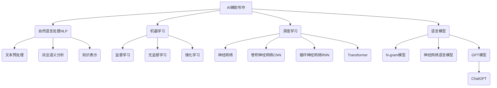

# AIGC从入门到实战：AI 辅助写作：基于 ChatGPT 的自动创作和文本扩展

## 1. 背景介绍

### 1.1 问题的由来

随着人工智能技术的不断发展,尤其是大型语言模型的崛起,AI辅助写作已经成为一个备受关注的新兴领域。传统的写作过程通常需要作者投入大量的时间和精力,不仅需要搜集和整理大量资料,还需要反复推敲修改才能完成一篇高质量的作品。而AI辅助写作技术的出现,为解决这一痛点提供了新的思路和方法。

### 1.2 研究现状

目前,基于大型语言模型的AI写作辅助工具已经开始在各个领域得到应用,例如新闻报道、营销文案、小说创作等。其中,OpenAI公司推出的ChatGPT因其强大的自然语言生成能力而备受瞩目。ChatGPT能够根据用户提供的提示和上下文,生成看似人类写作的连贯、流畅的文本内容。

然而,现有的AI写作辅助工具仍然存在一些局限性,例如:

1. 生成内容的创新性和独创性有待提高
2. 对于特定领域的专业知识掌握不足
3. 生成内容的一致性和逻辑性仍有改进空间
4. 缺乏对生成内容的自我评估和修正能力

### 1.3 研究意义

AI辅助写作技术的发展,不仅能够提高写作效率,节省人力成本,还能为创作者提供新的灵感和思路。同时,它也为文学、新闻、营销等领域带来了新的机遇和挑战。因此,深入研究AI辅助写作技术的原理、算法和应用,对于推动相关领域的创新和发展具有重要意义。

### 1.4 本文结构

本文将全面介绍AI辅助写作技术的核心概念、算法原理、数学模型、项目实践、应用场景等内容。文章结构安排如下:

1. 背景介绍
2. 核心概念与联系
3. 核心算法原理与具体操作步骤
4. 数学模型和公式详细讲解与案例分析
5. 项目实践:代码实例和详细解释说明
6. 实际应用场景
7. 工具和资源推荐
8. 总结:未来发展趋势与挑战
9. 附录:常见问题与解答

## 2. 核心概念与联系

AI辅助写作技术涉及多个核心概念,包括自然语言处理(NLP)、机器学习、深度学习、语言模型等,这些概念之间存在着密切的联系。

上图展示了AI辅助写作技术所涉及的核心概念及其内在联系。自然语言处理(NLP)是AI辅助写作的基础,包括文本预处理、词法语义分析和知识表示等子领域。机器学习则为AI写作提供了监督学习、无监督学习和强化学习等算法支持。深度学习技术,如神经网络、卷积神经网络(CNN)、循环神经网络(RNN)和Transformer等,为语言模型的建模和优化提供了强大的工具。

语言模型是AI辅助写作的核心技术,包括传统的N-gram模型和基于神经网络的语言模型。其中,GPT(Generative Pre-trained Transformer)模型因其在自然语言生成任务上的出色表现而备受关注。ChatGPT就是基于GPT模型训练而来的一种大型语言模型,它能够根据用户提供的上下文和提示生成看似人类写作的连贯文本。

## 3. 核心算法原理与具体操作步骤

### 3.1 算法原理概述

AI辅助写作的核心算法原理主要基于自然语言生成(NLG)技术。NLG旨在根据某种结构化的数据或知识表示,生成自然语言的文本内容。在AI写作辅助场景中,NLG算法需要根据用户提供的提示(如标题、大纲、关键词等)生成相应的文本内容。

NLG算法通常包括以下几个主要步骤:

1. **数据/知识表示**: 将输入的提示或上下文信息转换为适当的结构化表示,如知识图谱、语义框架等。
2. **内容规划**: 根据表示的数据或知识,规划文本内容的结构和组织方式。
3. **句子规划**: 确定每个句子表达的核心信息和语义结构。
4. **实现化(Realization)**: 将句子的语义结构转换为自然语言的表面形式。
5. **修正与优化**: 对生成的文本进行修正和优化,以提高其质量和连贯性。

在实际应用中,NLG算法通常与语言模型相结合,利用语言模型的强大生成能力来实现自然语言的生成。

### 3.2 算法步骤详解

以ChatGPT为例,其核心算法步骤可概括为:

1. **输入处理**: 对用户输入的提示进行预处理,包括分词、词性标注、命名实体识别等。
2. **语义理解**: 利用预训练的语言模型对输入的提示进行语义理解和表示,捕获其中的关键信息和上下文。
3. **内容规划**: 根据语义表示,规划生成文本的大致结构和内容框架。
4. **文本生成**: 基于语言模型,逐步生成文本内容。每生成一个token(单词或子词),模型都会根据之前生成的内容和输入的提示,预测下一个最可能的token。
5. **修正与优化**: 对生成的文本进行修正和优化,包括语法纠错、上下文一致性检查等。
6. **输出**: 将优化后的文本输出给用户。

在上述步骤中,语言模型扮演着至关重要的角色。ChatGPT使用了基于Transformer的GPT模型,通过自回归(auto-regressive)的方式生成文本。具体来说,给定之前生成的token序列$x_1, x_2, \ldots, x_t$,模型需要预测下一个token $x_{t+1}$的概率分布:

$$P(x_{t+1} | x_1, x_2, \ldots, x_t)$$

通过最大化上述条件概率,模型可以逐步生成连贯的文本内容。

### 3.3 算法优缺点

AI辅助写作算法具有以下优点:

1. **高效性**: 能够快速生成大量文本内容,提高写作效率。
2. **多样性**: 可以根据不同的提示生成多样化的文本,为创作提供新的思路和灵感。
3. **持续学习**: 算法可以通过不断训练来提高生成质量和适应新的领域。

同时,这些算法也存在一些缺点和局限性:

1. **创新性有限**: 生成的内容往往缺乏真正的创新性和独创性。
2. **知识局限**: 对于特定领域的专业知识掌握不足,生成内容可能存在错误或偏差。
3. **一致性问题**: 生成的长文本可能存在逻辑矛盾或上下文不一致的问题。
4. **偏见和安全性**: 算法可能会继承训练数据中存在的偏见和不当内容。

### 3.4 算法应用领域

AI辅助写作算法可以应用于多个领域,包括但不限于:

1. **新闻报道**: 自动生成新闻稿件,提高新闻生产效率。
2. **营销文案**: 生成广告文案、产品描述等营销内容。
3. **小说创作**: 为小说家提供创作灵感和辅助,扩展小说情节和人物描写。
4. **学术写作**: 辅助撰写论文、报告等学术文献。
5. **内容创作**: 生成博客、社交媒体内容等。
6. **对话系统**: 生成自然语言对话,应用于智能助手等场景。

## 4. 数学模型和公式详细讲解与举例说明

### 4.1 数学模型构建

AI辅助写作技术的核心是自然语言生成(NLG)模型,而语言模型又是NLG模型的基础。因此,构建高质量的语言模型对于提高AI写作辅助的性能至关重要。

目前,基于神经网络的语言模型已经成为主流。这些模型通常采用序列到序列(Sequence-to-Sequence, Seq2Seq)的架构,将语言建模问题转化为给定历史文本序列,预测下一个token的条件概率分布。

具体来说,给定一个长度为$T$的token序列$\boldsymbol{x} = (x_1, x_2, \ldots, x_T)$,语言模型需要学习该序列的概率分布:

$$P(\boldsymbol{x}) = \prod_{t=1}^T P(x_t | x_1, x_2, \ldots, x_{t-1})$$

其中,每个条件概率$P(x_t | x_1, x_2, \ldots, x_{t-1})$都由神经网络模型来预测。

在实践中,由于直接对长序列建模存在计算困难,通常会采用截断的语言模型(Truncated Language Model)。具体来说,给定长度为$n$的历史窗口$\boldsymbol{x}_{t-n:t-1} = (x_{t-n}, x_{t-n+1}, \ldots, x_{t-1})$,模型需要预测下一个token $x_t$的概率分布:

$$P(x_t | \boldsymbol{x}_{t-n:t-1})$$

### 4.2 公式推导过程

以Transformer模型为例,我们可以推导出其在语言模型任务中的公式表达。

Transformer模型由编码器(Encoder)和解码器(Decoder)两部分组成。在语言模型场景下,只需使用解码器部分。解码器的输入是历史token序列$\boldsymbol{x}_{t-n:t-1}$,输出是下一个token $x_t$的概率分布。

首先,我们将输入序列$\boldsymbol{x}_{t-n:t-1}$映射为嵌入向量序列$\boldsymbol{E}_{t-n:t-1}$。然后,这些嵌入向量将被送入Transformer的多头自注意力(Multi-Head Self-Attention)层和前馈神经网络(Feed-Forward Neural Network)层进行编码,得到新的向量表示$\boldsymbol{H}_{t-n:t-1}$:

$$\boldsymbol{H}_{t-n:t-1} = \text{Transformer}(\boldsymbol{E}_{t-n:t-1})$$

接下来,将$\boldsymbol{H}_{t-n:t-1}$输入到一个线性层和Softmax层,得到下一个token $x_t$的概率分布:

$$P(x_t | \boldsymbol{x}_{t-n:t-1}) = \text{Softmax}(\boldsymbol{W}\boldsymbol{H}_{t-n:t-1} + \boldsymbol{b})$$

其中,$\boldsymbol{W}$和$\boldsymbol{b}$分别是线性层的权重和偏置参数。

在训练过程中,我们最小化该模型在训练数据上的交叉熵损失函数:

$$\mathcal{L} = -\frac{1}{N}\sum_{i=1}^N \log P(x_t^{(i)} | \boldsymbol{x}_{t-n:t-1}^{(i)})$$

其中,$N$是训练样本的数量。通过反向传播算法,我们可以更新模型参数,使其在语言模型任务上的性能不断提高。

### 4.3 案例分析与讲解

现在,让我们通过一个具体的案例来说明AI辅助写作的过程。假设我们希望生成一篇关于"人工智能的未来发展"的文章,提供的提示是:

> 人工智能的未来发展

首先,我们将提示输入到ChatGPT模型中进行处理。模