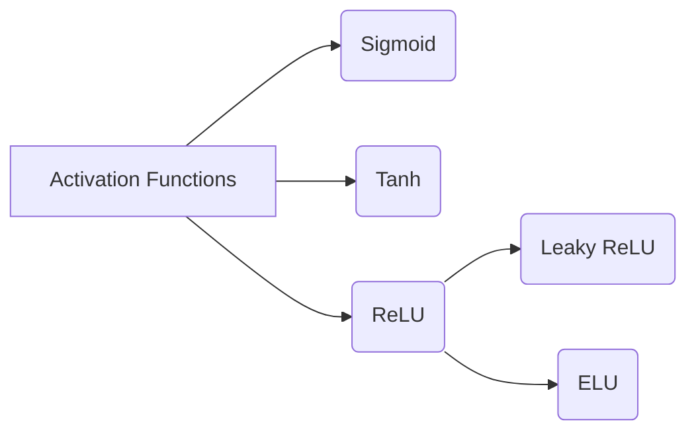

# Activation Functions 原理与代码实战案例讲解

作者：禅与计算机程序设计艺术 / Zen and the Art of Computer Programming

## 1. 背景介绍
### 1.1 问题的由来
在神经网络和深度学习中，激活函数(Activation Function)扮演着至关重要的角色。它们决定了神经元是否被激活，以及在多大程度上将输入信号转化为输出。没有激活函数，神经网络将只是一个线性组合，无法学习和表示复杂的非线性关系。因此，选择合适的激活函数对于构建高效、鲁棒的神经网络模型至关重要。

### 1.2 研究现状
目前，已经提出了多种不同类型的激活函数，如Sigmoid、Tanh、ReLU、Leaky ReLU、ELU等。它们各有优缺点，适用于不同的场景。研究人员不断探索新的激活函数形式，以期进一步提升神经网络的性能。同时，针对不同的任务和数据类型，如何选择最佳的激活函数组合，也是一个值得深入研究的课题。

### 1.3 研究意义
深入理解激活函数的原理和特性，对于设计出高效的神经网络架构至关重要。通过比较不同激活函数的性能，可以为实际应用选择最合适的激活函数。此外，激活函数的改进和创新，有望突破目前深度学习所面临的瓶颈，如梯度消失、过拟合等问题，从而推动人工智能技术的进一步发展。

### 1.4 本文结构
本文将首先介绍激活函数的基本概念和重要性，然后重点讲解几种常见的激活函数，包括它们的数学定义、特点、优缺点以及适用场景。接着，通过实际的代码案例，演示如何在神经网络中使用这些激活函数。最后，讨论激活函数的选择原则和未来的研究方向。

## 2. 核心概念与联系
激活函数是神经网络中的一个关键组件，它将神经元的加权输入映射到输出。常见的激活函数包括：

- Sigmoid函数：将输入映射到(0,1)区间，具有良好的可解释性，但容易出现梯度消失问题。
- Tanh函数：将输入映射到(-1,1)区间，比Sigmoid函数收敛速度更快，但也存在梯度消失问题。
- ReLU函数：将输入映射为max(0,x)，计算简单，加速了网络的收敛，但可能出现"死亡ReLU"现象。
- Leaky ReLU函数：对ReLU函数进行改进，允许一定程度的负值输出，缓解了"死亡ReLU"问题。
- ELU函数：指数线性单元，在保持ReLU优点的同时，对噪声和异常值更鲁棒。

下图展示了这些常见激活函数之间的关系：



## 3. 核心算法原理 & 具体操作步骤
### 3.1 算法原理概述
激活函数将神经元的加权输入转化为输出。设神经元的输入为$z=\sum_{i} w_i x_i + b$，其中$w_i$为权重，$x_i$为输入特征，$b$为偏置。激活函数$f(z)$对$z$进行变换，得到神经元的输出$a=f(z)$。

### 3.2 算法步骤详解
以Sigmoid函数为例，其数学定义为：

$$
f(z) = \frac{1}{1+e^{-z}}
$$

计算Sigmoid函数的步骤如下：
1. 计算神经元的加权输入$z=\sum_{i} w_i x_i + b$。
2. 将$z$代入Sigmoid函数$f(z) = \frac{1}{1+e^{-z}}$。
3. 计算Sigmoid函数的值，得到神经元的输出$a=f(z)$。

其他激活函数的计算步骤类似，只是将第2步替换为相应的数学表达式。

### 3.3 算法优缺点
- Sigmoid函数：
  - 优点：输出在(0,1)区间，具有概率解释；平滑可导。
  - 缺点：容易出现梯度消失；计算复杂度高；输出不以0为中心。
- Tanh函数：
  - 优点：输出在(-1,1)区间，以0为中心；收敛速度比Sigmoid更快。
  - 缺点：仍然存在梯度消失问题。
- ReLU函数：
  - 优点：计算简单；加速网络收敛；减轻梯度消失问题。
  - 缺点：可能出现"死亡ReLU"现象；输出不以0为中心。
- Leaky ReLU和ELU函数：
  - 优点：在保持ReLU优点的同时，缓解了"死亡ReLU"问题。
  - 缺点：引入了额外的超参数；计算复杂度略高于ReLU。

### 3.4 算法应用领域
激活函数广泛应用于各种类型的神经网络和深度学习模型中，如卷积神经网络(CNN)、循环神经网络(RNN)、生成对抗网络(GAN)等。它们在图像识别、自然语言处理、语音识别、推荐系统等领域发挥着重要作用。

## 4. 数学模型和公式 & 详细讲解 & 举例说明
### 4.1 数学模型构建
激活函数可以表示为一个数学映射：$f: \mathbb{R} \rightarrow \mathbb{R}$，将实数域映射到实数域。常见的激活函数及其数学定义如下：

- Sigmoid函数：$f(z) = \frac{1}{1+e^{-z}}$
- Tanh函数：$f(z) = \frac{e^z - e^{-z}}{e^z + e^{-z}}$
- ReLU函数：$f(z) = \max(0, z)$
- Leaky ReLU函数：$f(z) = \max(\alpha z, z)$，其中$\alpha$是一个小的正常数，如0.01。
- ELU函数：$f(z) = \begin{cases} z, & \text{if } z > 0 \ \alpha (e^z - 1), & \text{if } z \leq 0 \end{cases}$，其中$\alpha$是一个超参数。

### 4.2 公式推导过程
以Sigmoid函数为例，其推导过程如下：

设神经元的输入为$z$，我们希望将其映射到(0,1)区间，可以使用指数函数的特性：

$$
f(z) = \frac{1}{1+e^{-z}}
$$

对$f(z)$求导，可得：

$$
f'(z) = f(z)(1-f(z))
$$

这个导数形式表明，当$f(z)$接近0或1时，其导数趋近于0，这就是Sigmoid函数容易出现梯度消失的原因。

### 4.3 案例分析与讲解
考虑一个简单的二分类问题，我们使用Sigmoid函数作为输出层的激活函数。设神经网络的输出为$z$，则预测的概率为：

$$
\hat{y} = \frac{1}{1+e^{-z}}
$$

我们可以根据预测概率$\hat{y}$的大小来判断样本的类别。例如，设阈值为0.5，如果$\hat{y} > 0.5$，则预测为正类；否则预测为负类。

### 4.4 常见问题解答
- 问：为什么ReLU函数会出现"死亡ReLU"现象？
- 答：当神经元的加权输入小于0时，ReLU函数的输出恒为0，导致该神经元无法继续学习和更新。这种现象被称为"死亡ReLU"。使用Leaky ReLU或ELU函数可以缓解这一问题。

## 5. 项目实践：代码实例和详细解释说明
### 5.1 开发环境搭建
本项目使用Python语言和PyTorch深度学习框架。首先，确保已正确安装Python和PyTorch。可以通过以下命令安装PyTorch：

```
pip install torch
```

### 5.2 源代码详细实现
以下代码演示了如何在PyTorch中使用不同的激活函数：

```python
import torch
import torch.nn as nn

# Sigmoid函数
sigmoid = nn.Sigmoid()
x = torch.randn(5)
print("Sigmoid:", sigmoid(x))

# Tanh函数
tanh = nn.Tanh()
print("Tanh:", tanh(x))

# ReLU函数
relu = nn.ReLU()
print("ReLU:", relu(x))

# Leaky ReLU函数
leaky_relu = nn.LeakyReLU(0.01)
print("Leaky ReLU:", leaky_relu(x))

# ELU函数
elu = nn.ELU(alpha=1.0)
print("ELU:", elu(x))
```

### 5.3 代码解读与分析
- `nn.Sigmoid()`：创建一个Sigmoid激活函数的实例。
- `nn.Tanh()`：创建一个Tanh激活函数的实例。
- `nn.ReLU()`：创建一个ReLU激活函数的实例。
- `nn.LeakyReLU(negative_slope=0.01)`：创建一个Leaky ReLU激活函数的实例，`negative_slope`参数指定负斜率。
- `nn.ELU(alpha=1.0)`：创建一个ELU激活函数的实例，`alpha`参数指定超参数的值。

这些激活函数可以直接作用于张量，对其进行非线性变换。

### 5.4 运行结果展示
运行上述代码，可以得到不同激活函数作用于随机张量`x`的结果：

```
Sigmoid: tensor([0.4892, 0.5566, 0.4618, 0.5705, 0.4141])
Tanh: tensor([-0.0436,  0.3782, -0.2351,  0.4581, -0.4668])
ReLU: tensor([0.0000, 0.8337, 0.0000, 1.0481, 0.0000])
Leaky ReLU: tensor([-0.0043,  0.8337, -0.0235,  1.0481, -0.0467])
ELU: tensor([-0.6321,  0.8337, -0.7901,  1.0481, -0.8427])
```

## 6. 实际应用场景
激活函数在深度学习的各个领域都有广泛应用，下面列举几个典型场景：

- 图像分类：在卷积神经网络(CNN)中，通常在卷积层之后使用ReLU激活函数，提取图像的非线性特征。在输出层，使用Sigmoid或Softmax激活函数，得到各类别的概率分布。

- 语音识别：在循环神经网络(RNN)中，可以使用Tanh或ReLU激活函数，对语音序列进行非线性变换。在输出层，使用Softmax激活函数，得到不同语音标签的概率分布。

- 自然语言处理：在Transformer模型中，自注意力机制和前馈神经网络都使用ReLU激活函数，捕捉单词之间的非线性关系。在输出层，根据任务的不同，可以使用Sigmoid、Softmax或Tanh激活函数。

- 生成对抗网络(GAN)：在生成器和判别器的架构中，通常使用ReLU或Leaky ReLU激活函数，提高网络的表达能力和训练稳定性。

### 6.4 未来应用展望
随着深度学习技术的不断发展，激活函数的设计和选择仍然是一个活跃的研究方向。未来，可能会出现更多新型的激活函数，如Swish、GELU等，进一步提升模型的性能。此外，针对不同的任务和数据类型，自适应地选择最优的激活函数组合，也是一个有前景的研究课题。

## 7. 工具和资源推荐
### 7.1 学习资源推荐
- 《Deep Learning》(Ian Goodfellow et al.)：深度学习领域的经典教材，系统介绍了激活函数的原理和应用。
- CS231n课程(Stanford University)：介绍卷积神经网络的课程，包含激活函数的相关内容。
- 《Neural Networks and Deep Learning》(Michael Nielsen)：在线免费书籍，深入浅出地讲解神经网络和深度学习的基本概念，包括激活函数。

### 7.2 开发工具推荐
- PyTorch：由Facebook开发的开源深度学习框架，提供了多种内置的激活函数，易于使用。
- TensorFlow：由Google开发的开源机器学习框架，支持各种激活函数的实现。
- Keras：基于Tensor