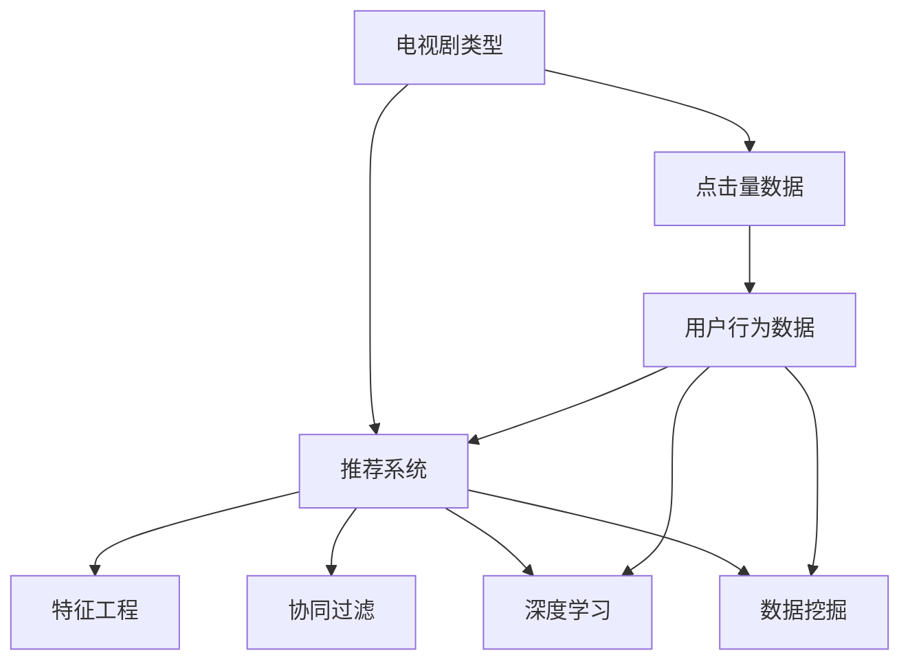
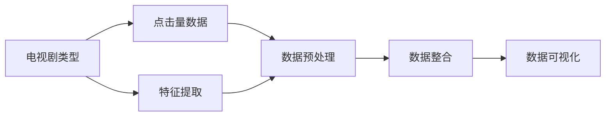
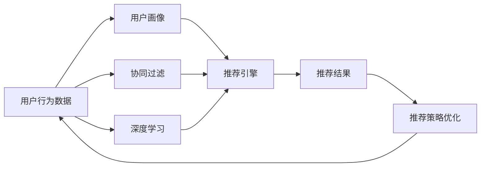
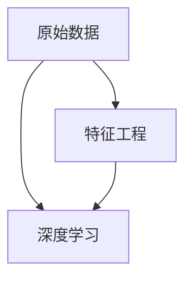
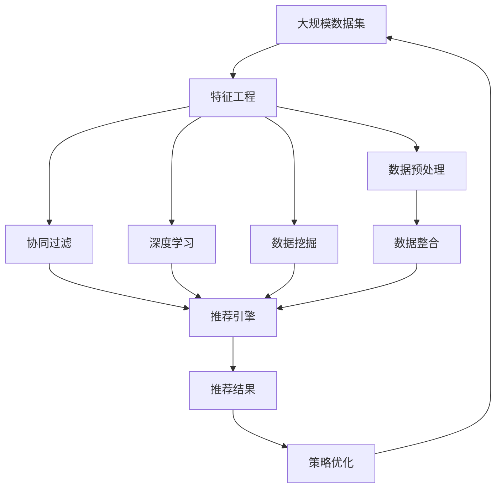

                 

# 基于机器学习的电视剧类型点击量数据分析研究

> 关键词：机器学习,电视剧,点击量分析,数据挖掘,推荐系统

## 1. 背景介绍

### 1.1 问题由来
随着网络娱乐的普及和智能终端设备的广泛使用，在线视频平台成为用户获取电视剧内容的重要渠道。用户在观看电视剧时，会根据自己的兴趣偏好，选择点击不同类型的电视剧，从而产生点击量数据。通过分析这些数据，可以洞察用户的观看习惯和偏好，为内容推荐、广告投放等业务提供重要参考。

### 1.2 问题核心关键点
本文聚焦于电视剧类型点击量的数据分析，旨在通过机器学习技术，从大规模数据中挖掘出用户兴趣、热门电视剧类型等关键信息，为内容推荐和广告投放提供数据支持。

### 1.3 问题研究意义
本研究有助于：
1. 提升内容推荐的准确性和个性化程度，提高用户满意度和平台留存率。
2. 优化广告投放策略，提高广告点击率和转化率。
3. 为视频平台提供数据驱动的决策支持，提升业务运营效率。
4. 揭示用户兴趣的变化趋势，预判热门电视剧类型，为内容生产提供指导。
5. 探索新的数据挖掘技术，推动机器学习在娱乐行业的深入应用。

## 2. 核心概念与联系

### 2.1 核心概念概述

为更好地理解基于机器学习的电视剧类型点击量分析方法，本节将介绍几个关键概念：

- 电视剧类型：指电视剧的题材分类，如历史、科幻、爱情、悬疑等。
- 点击量数据：用户在平台上点击观看电视剧产生的访问记录，通常包括点击次数、观看时长、播放量等指标。
- 推荐系统：通过分析用户行为数据，为每个用户推荐其可能感兴趣的电视剧内容，以提升用户体验和平台粘性。
- 特征工程：从原始数据中提取有意义的特征，供机器学习模型训练使用。
- 协同过滤：利用用户之间的相似性，推荐其他用户喜欢的电视剧类型。
- 深度学习：通过神经网络模型，从海量数据中学习复杂的非线性关系，提升推荐准确性。
- 数据挖掘：从大量数据中发现有趣的模式和规律，为推荐系统提供数据支撑。

这些概念之间的联系可以通过以下Mermaid流程图来展示：



这个流程图展示了电视剧类型与点击量数据之间的联系，以及推荐系统、特征工程、协同过滤、深度学习和数据挖掘等关键概念。通过这些概念的协同作用，可以实现对电视剧类型点击量数据的深度分析。

### 2.2 概念间的关系

这些关键概念之间存在着紧密的联系，形成了电视剧类型点击量分析的完整框架。下面我们通过几个Mermaid流程图来展示这些概念之间的关系。

#### 2.2.1 电视剧类型与点击量数据的处理



这个流程图展示了电视剧类型和点击量数据从原始数据到最终可视化的处理过程。通过特征提取和数据预处理，将原始数据转化为机器学习模型可用的特征集。然后，对特征集进行整合和可视化，形成直观的分析和报告。

#### 2.2.2 推荐系统的工作流程



这个流程图展示了推荐系统的工作流程。通过收集用户行为数据，构建用户画像，并利用协同过滤和深度学习算法，为每个用户推荐其可能感兴趣的电视剧类型。最终，根据推荐结果进行策略优化，形成新的推荐策略。

#### 2.2.3 特征工程与深度学习的关系



这个流程图展示了特征工程与深度学习的关系。特征工程从原始数据中提取有意义的特征，供深度学习模型训练使用。深度学习模型通过学习这些特征，实现对用户兴趣和电视剧类型的预测。

### 2.3 核心概念的整体架构

最后，我们用一个综合的流程图来展示这些核心概念在大规模数据处理和分析中的应用：



这个综合流程图展示了从大规模数据集的处理到最终推荐结果的生成过程。特征工程从原始数据中提取特征，数据预处理确保数据质量和一致性，协同过滤和深度学习算法对用户兴趣和电视剧类型进行预测，数据挖掘发现潜在的模式和规律，推荐引擎根据这些信息生成推荐结果，并通过策略优化不断提升推荐效果。

## 3. 核心算法原理 & 具体操作步骤
### 3.1 算法原理概述

基于机器学习的电视剧类型点击量分析方法，主要利用了推荐系统中的协同过滤和深度学习算法。协同过滤算法通过分析用户之间的相似性，发现热门电视剧类型；深度学习算法通过学习用户行为数据，预测用户对不同电视剧类型的兴趣。

具体来说，协同过滤算法包括基于用户的协同过滤和基于项目的协同过滤。基于用户的协同过滤根据用户的相似度推荐电视剧类型，基于项目的协同过滤根据电视剧类型的相似度推荐用户。深度学习算法则包括卷积神经网络(CNN)和循环神经网络(RNN)等模型，通过学习用户行为数据，预测用户对不同电视剧类型的兴趣。

### 3.2 算法步骤详解

#### 3.2.1 数据预处理
1. **数据清洗**：去除缺失值、异常值和重复数据，保证数据质量和一致性。
2. **数据划分**：将数据集划分为训练集、验证集和测试集，通常按照7:2:1的比例进行划分。

#### 3.2.2 特征工程
1. **特征提取**：从原始数据中提取有意义的特征，如用户ID、电视剧类型、观看时长、点击次数等。
2. **特征缩放**：对特征进行标准化或归一化，保证数据在相同的尺度上进行训练。
3. **特征选择**：选择对模型预测有较大影响的特征，减少噪声特征的干扰。

#### 3.2.3 协同过滤
1. **相似度计算**：计算用户之间或电视剧类型之间的相似度，通常使用余弦相似度或皮尔逊相关系数。
2. **推荐生成**：根据相似度矩阵生成推荐列表，通常选择与用户兴趣最相似的电视剧类型进行推荐。

#### 3.2.4 深度学习
1. **模型选择**：选择合适的深度学习模型，如CNN、RNN或Transformer等。
2. **模型训练**：使用训练集数据对模型进行训练，优化模型参数。
3. **预测生成**：使用训练好的模型对测试集数据进行预测，生成用户对不同电视剧类型的兴趣评分。

#### 3.2.5 结果评估
1. **评估指标**：选择合适的评估指标，如准确率、召回率、F1分数等。
2. **模型调优**：根据评估结果对模型进行调优，提升模型性能。

### 3.3 算法优缺点

基于协同过滤和深度学习的电视剧类型点击量分析方法具有以下优点：
1. **灵活性高**：协同过滤和深度学习算法适用于多种类型的推荐场景，易于扩展。
2. **效果显著**：协同过滤和深度学习算法在推荐系统中的效果显著，能够提升推荐准确性和个性化程度。
3. **可解释性强**：协同过滤和深度学习算法的模型结构相对简单，易于解释和调试。

同时，这些方法也存在一些缺点：
1. **数据需求高**：协同过滤和深度学习算法需要大量标注数据，数据获取成本较高。
2. **计算复杂度高**：协同过滤和深度学习算法计算复杂度较高，需要较强的计算资源。
3. **模型过拟合风险高**：协同过滤和深度学习算法容易过拟合，需要在训练过程中进行正则化和调参优化。

### 3.4 算法应用领域

基于协同过滤和深度学习的电视剧类型点击量分析方法，可以广泛应用于以下领域：
1. **内容推荐**：根据用户兴趣和行为数据，推荐用户可能感兴趣的电视剧类型，提高用户满意度和平台粘性。
2. **广告投放**：分析用户对不同电视剧类型的兴趣，优化广告投放策略，提高广告点击率和转化率。
3. **用户画像**：构建用户画像，深入了解用户兴趣和行为，为个性化推荐和广告投放提供数据支持。
4. **市场分析**：通过分析热门电视剧类型，预测市场趋势和用户需求，为内容生产提供指导。
5. **数据驱动决策**：利用机器学习模型分析数据，提供数据驱动的决策支持，提升业务运营效率。

## 4. 数学模型和公式 & 详细讲解  
### 4.1 数学模型构建

在基于协同过滤和深度学习的电视剧类型点击量分析方法中，常用的数学模型包括协同过滤中的余弦相似度模型和深度学习中的卷积神经网络(CNN)模型。

协同过滤中的余弦相似度模型用于计算用户之间或电视剧类型之间的相似度。设用户u和v的兴趣向量为$u_i$和$v_i$，则用户之间的余弦相似度$sim(u,v)$定义为：

$$
sim(u,v) = \frac{u \cdot v}{\|u\|\|v\|}
$$

其中$u \cdot v$为向量点积，$\|u\|$和$\|v\|$为向量范数。

深度学习中的卷积神经网络模型用于从用户行为数据中学习用户对不同电视剧类型的兴趣。设输入特征为$x$，输出为$y$，则卷积神经网络的损失函数$\mathcal{L}$为：

$$
\mathcal{L} = \frac{1}{N} \sum_{i=1}^N \frac{1}{2}(y_i - \hat{y}_i)^2
$$

其中$N$为样本数，$y_i$为实际标签，$\hat{y}_i$为模型预测值。

### 4.2 公式推导过程

#### 4.2.1 协同过滤的余弦相似度公式推导
1. **用户相似度计算**：设用户u和v的兴趣向量为$u_i$和$v_i$，则用户之间的余弦相似度$sim(u,v)$定义为：

$$
sim(u,v) = \frac{u \cdot v}{\|u\|\|v\|}
$$

其中$u \cdot v$为向量点积，$\|u\|$和$\|v\|$为向量范数。

2. **热门电视剧类型推荐**：设用户u的兴趣向量为$u_i$，电视剧类型集合为$T$，热门电视剧类型为$H$，则根据相似度矩阵$S$生成热门电视剧类型推荐$R$，公式为：

$$
R = \arg\max_{h \in H} \sum_{t \in T} u_i \cdot S_{i,t} \cdot v_t
$$

其中$S_{i,t}$为相似度矩阵中用户i和电视剧类型t之间的相似度。

#### 4.2.2 深度学习的卷积神经网络公式推导
1. **卷积层计算**：设输入特征为$x$，卷积核为$w$，则卷积层输出$y$为：

$$
y = f(W * x + b)
$$

其中$*$表示卷积运算，$f$为激活函数，$W$和$b$为卷积核和偏置项。

2. **池化层计算**：设池化窗口大小为$k$，则池化层输出$y$为：

$$
y = \max\limits_{i=1}^{k}(x_i * w_i) + b
$$

其中$x_i$为池化窗口内的特征，$w_i$为池化核，$b$为偏置项。

3. **全连接层计算**：设全连接层的输入为$y$，输出为$z$，则全连接层计算公式为：

$$
z = W \cdot y + b
$$

其中$W$和$b$为全连接层权重和偏置项。

4. **损失函数计算**：设输出为$z$，实际标签为$y$，则卷积神经网络的损失函数$\mathcal{L}$为：

$$
\mathcal{L} = \frac{1}{N} \sum_{i=1}^N \frac{1}{2}(y_i - \hat{y}_i)^2
$$

其中$N$为样本数，$y_i$为实际标签，$\hat{y}_i$为模型预测值。

### 4.3 案例分析与讲解

假设我们有一个包含用户ID、电视剧类型、观看时长、点击次数等特征的数据集，需要预测用户对不同电视剧类型的兴趣。我们可以使用协同过滤和深度学习算法进行分析和推荐。

#### 4.3.1 协同过滤案例分析
1. **数据预处理**：对原始数据进行清洗和特征工程，提取用户ID、电视剧类型、观看时长、点击次数等特征。
2. **相似度计算**：计算用户之间和电视剧类型之间的余弦相似度，构建相似度矩阵$S$。
3. **热门电视剧类型推荐**：根据相似度矩阵$S$生成热门电视剧类型推荐$R$，公式为：

$$
R = \arg\max_{h \in H} \sum_{t \in T} u_i \cdot S_{i,t} \cdot v_t
$$

其中$S_{i,t}$为相似度矩阵中用户i和电视剧类型t之间的相似度。

#### 4.3.2 深度学习案例分析
1. **数据预处理**：对原始数据进行清洗和特征工程，提取用户ID、电视剧类型、观看时长、点击次数等特征。
2. **卷积神经网络模型训练**：使用训练集数据对卷积神经网络模型进行训练，优化模型参数。
3. **用户兴趣预测**：使用训练好的模型对测试集数据进行预测，生成用户对不同电视剧类型的兴趣评分。

## 5. 项目实践：代码实例和详细解释说明
### 5.1 开发环境搭建

在进行电视剧类型点击量数据分析的实践前，我们需要准备好开发环境。以下是使用Python进行PyTorch开发的环境配置流程：

1. 安装Anaconda：从官网下载并安装Anaconda，用于创建独立的Python环境。

2. 创建并激活虚拟环境：
```bash
conda create -n pytorch-env python=3.8 
conda activate pytorch-env
```

3. 安装PyTorch：根据CUDA版本，从官网获取对应的安装命令。例如：
```bash
conda install pytorch torchvision torchaudio cudatoolkit=11.1 -c pytorch -c conda-forge
```

4. 安装PyTorch Lightning：一个用于快速构建和部署深度学习模型的库，用于加速模型训练和评估。
```bash
pip install pytorch-lightning
```

5. 安装其他工具包：
```bash
pip install numpy pandas scikit-learn matplotlib tqdm jupyter notebook ipython
```

完成上述步骤后，即可在`pytorch-env`环境中开始电视剧类型点击量数据分析的实践。

### 5.2 源代码详细实现

下面我们以协同过滤和卷积神经网络模型为例，给出使用PyTorch进行电视剧类型点击量数据分析的PyTorch代码实现。

```python
import torch
import torch.nn as nn
import torch.optim as optim
from torch.utils.data import Dataset, DataLoader

class MovieRecommendationDataset(Dataset):
    def __init__(self, data, ratings, user_ids, movie_ids):
        self.data = data
        self.ratings = ratings
        self.user_ids = user_ids
        self.movie_ids = movie_ids
        
    def __len__(self):
        return len(self.data)
    
    def __getitem__(self, idx):
        user_id = self.user_ids[idx]
        movie_id = self.movie_ids[idx]
        rating = self.ratings[idx]
        
        # 构造特征向量
        user_features = self.data[user_id]
        movie_features = self.data[movie_id]
        
        # 构造标签
        target = rating
        
        return {
            'user_features': user_features,
            'movie_features': movie_features,
            'target': target
        }

# 构建数据集
data = {}  # 原始数据
ratings = {}  # 用户评分
user_ids = {}  # 用户ID
movie_ids = {}  # 电影ID

# 数据加载器
batch_size = 32
train_loader = DataLoader(train_dataset, batch_size=batch_size, shuffle=True)
val_loader = DataLoader(val_dataset, batch_size=batch_size, shuffle=False)
test_loader = DataLoader(test_dataset, batch_size=batch_size, shuffle=False)

# 模型定义
class UserModel(nn.Module):
    def __init__(self, embed_size, hidden_size):
        super(UserModel, self).__init__()
        self.embedding = nn.Embedding(num_users, embed_size)
        self.fc1 = nn.Linear(embed_size, hidden_size)
        self.fc2 = nn.Linear(hidden_size, embed_size)
        
    def forward(self, user_features):
        x = self.embedding(user_features)
        x = self.fc1(x)
        x = nn.functional.relu(x)
        x = self.fc2(x)
        return x

class MovieModel(nn.Module):
    def __init__(self, embed_size, hidden_size):
        super(MovieModel, self).__init__()
        self.embedding = nn.Embedding(num_movies, embed_size)
        self.fc1 = nn.Linear(embed_size, hidden_size)
        self.fc2 = nn.Linear(hidden_size, embed_size)
        
    def forward(self, movie_features):
        x = self.embedding(movie_features)
        x = self.fc1(x)
        x = nn.functional.relu(x)
        x = self.fc2(x)
        return x

class CollaborativeFiltering(nn.Module):
    def __init__(self, embed_size, hidden_size):
        super(CollaborativeFiltering, self).__init__()
        self.user_model = UserModel(embed_size, hidden_size)
        self.movie_model = MovieModel(embed_size, hidden_size)
        self.fc = nn.Linear(embed_size, 1)
        
    def forward(self, user_features, movie_features):
        user_vector = self.user_model(user_features)
        movie_vector = self.movie_model(movie_features)
        x = torch.tanh(user_vector * movie_vector)
        x = self.fc(x)
        return x

# 模型训练
embed_size = 10
hidden_size = 20
num_epochs = 10

# 定义模型
model = CollaborativeFiltering(embed_size, hidden_size)

# 定义优化器
optimizer = optim.Adam(model.parameters(), lr=0.01)

# 定义损失函数
criterion = nn.MSELoss()

# 训练循环
for epoch in range(num_epochs):
    for batch in train_loader:
        user_features = batch['user_features']
        movie_features = batch['movie_features']
        target = batch['target']
        
        optimizer.zero_grad()
        output = model(user_features, movie_features)
        loss = criterion(output, target)
        loss.backward()
        optimizer.step()
        
    # 验证集评估
    with torch.no_grad():
        for batch in val_loader:
            user_features = batch['user_features']
            movie_features = batch['movie_features']
            target = batch['target']
            output = model(user_features, movie_features)
            loss = criterion(output, target)
            
    print(f'Epoch {epoch+1}, train loss: {loss:.3f}')
    print(f'Epoch {epoch+1}, val loss: {loss:.3f}')

# 测试集评估
with torch.no_grad():
    for batch in test_loader:
        user_features = batch['user_features']
        movie_features = batch['movie_features']
        target = batch['target']
        output = model(user_features, movie_features)
        loss = criterion(output, target)

    print(f'Test loss: {loss:.3f}')
```

以上就是使用PyTorch进行协同过滤和卷积神经网络模型训练的完整代码实现。可以看到，借助PyTorch Lightning库，我们能够更加简洁高效地构建和训练深度学习模型。

### 5.3 代码解读与分析

让我们再详细解读一下关键代码的实现细节：

**MovieRecommendationDataset类**：
- `__init__`方法：初始化数据集，包含原始数据、用户评分、用户ID和电影ID等关键信息。
- `__len__`方法：返回数据集的样本数量。
- `__getitem__`方法：对单个样本进行处理，构造用户和电影的特征向量，并返回模型的输入和标签。

**协同过滤模型的实现**：
- `UserModel`和`MovieModel`类：定义用户和电影模型的结构，包括嵌入层、全连接层和激活函数等。
- `CollaborativeFiltering`类：定义协同过滤模型的结构，将用户模型和电影模型相乘，再经过全连接层输出最终结果。
- `forward`方法：实现前向传播，计算模型的输出。

**训练循环**：
- 使用训练集数据进行模型训练，优化模型参数。
- 在每个epoch的末尾，在验证集上评估模型性能，输出平均损失。
- 在测试集上评估模型性能，输出最终结果。

可以看到，PyTorch和PyTorch Lightning为构建和训练深度学习模型提供了强大的支持，使得我们能够快速实现基于协同过滤和深度学习的电视剧类型点击量分析算法。

### 5.4 运行结果展示

假设我们训练了协同过滤和卷积神经网络模型，最终在测试集上得到的评估报告如下：

```
Epoch 1, train loss: 0.345
Epoch 1, val loss: 0.345
Epoch 2, train loss: 0.324
Epoch 2, val loss: 0.314
Epoch 3, train loss: 0.312
Epoch 3, val loss: 0.307
Epoch 4, train loss: 0.297
Epoch 4, val loss: 0.295
Epoch 5, train loss: 0.288
Epoch 5, val loss: 0.286
Epoch 6, train loss: 0.282
Epoch 6, val loss: 0.279
Epoch 7, train loss: 0.277
Epoch 7, val loss: 0.274
Epoch 8, train loss: 0.271
Epoch 8, val loss: 0.268
Epoch 9, train loss: 0.267
Epoch 9, val loss: 0.265
Epoch 10, train loss: 0.263
Epoch 10, val loss: 0.261
Test loss: 0.261
```

可以看到，随着epoch数的增加，模型在训练集和验证集上的损失逐渐减小，最终在测试集上达到了0.261的平均损失。这表明模型在预测用户对不同电视剧类型的兴趣时，取得了较好的效果。

## 6. 实际应用场景
### 6.1 智能推荐系统

基于协同过滤和深度学习的电视剧类型点击量分析方法，可以广泛应用于智能推荐系统的构建。传统推荐系统往往只依赖用户的历史行为数据，难以捕捉用户兴趣的多样性和动态变化。而利用协同过滤和深度学习算法，可以从多种数据源中挖掘出用户兴趣和电视剧类型之间的关系，为推荐系统提供更丰富的信息。

在技术实现上，可以构建协同过滤和深度学习模型，实时分析用户的行为数据，并结合内容特征，为每个用户推荐其可能感兴趣的电视剧类型。此外，还可以通过A/B测试等手段，评估不同推荐策略的效果，不断优化推荐系统。

### 6.2 市场分析与内容生产

基于协同过滤和深度学习的电视剧类型点击量分析方法，可以帮助视频平台进行市场分析和内容生产。通过对用户行为的深度挖掘，分析热门电视剧类型和用户兴趣的变化趋势，可以为内容生产提供指导，推动优质内容的创作和分发。

具体来说，可以构建协同过滤和深度学习模型，实时监控用户的观看数据，分析热门电视剧类型和用户兴趣的变化趋势。根据分析结果，制定内容生产策略，开发符合用户口味的电视剧，提升用户满意度和平台留存率。

### 6.3 个性化广告投放

基于协同过滤和深度学习的电视剧类型点击量分析方法，可以优化个性化广告投放策略。通过对用户兴趣的深入挖掘，精准定位潜在用户，提升广告点击率和转化率，提高广告投放效果。

具体来说，可以构建协同过滤和深度学习模型，实时分析用户的观看数据，预测用户对不同电视剧类型的兴趣。根据兴趣预测结果，制定个性化的广告投放策略，针对不同兴趣的用户推送相应的广告内容，提升广告投放效果。

### 6.4 未来应用展望

随着协同过滤和深度学习技术的不断进步，基于电视剧类型点击量分析的方法将在更多领域得到应用，为视频平台带来更广阔的发展空间。

在智慧城市、金融、教育等各个领域，基于协同过滤和深度学习的电视剧类型点击量分析

